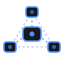
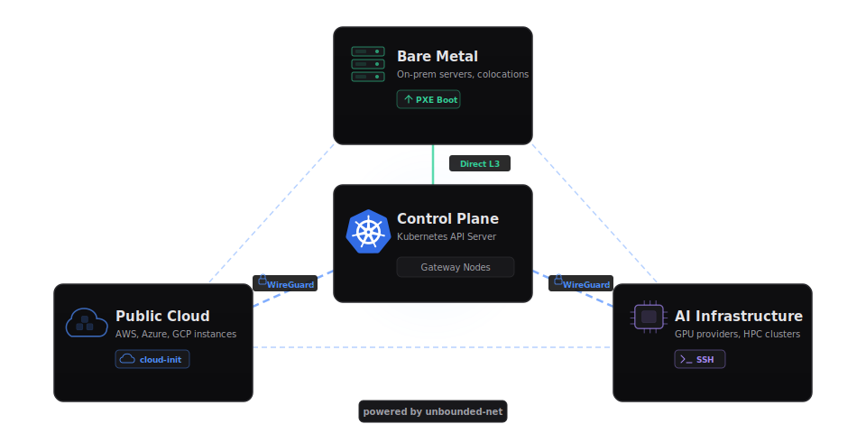
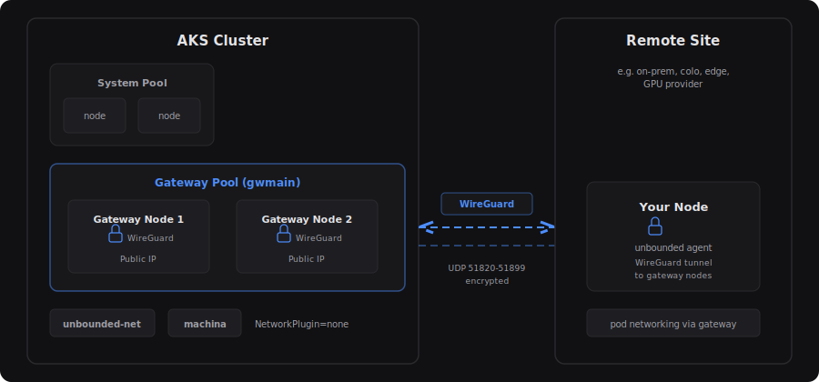

<p align="center">
  
</p>

<h1 align="center">Unbounded Kubernetes</h1>

<p align="center">
  <em>Run Kubernetes worker nodes anywhere — across clouds, on-prem, and at the edge — connected back to a single control plane.</em>
</p>

<p align="center">
  <a href="https://github.com/Azure/unbounded-kube/releases/latest"></a>
  <a href="https://github.com/Azure/unbounded-kube/actions/workflows/go-ci.yaml"></a>
  <a href="LICENSE"></a>
</p>

---

> **Early Development** — This project is under active development. It is suitable
> for experimentation and prototyping, but expect rough edges and breaking changes.
> Please report issues on the [Issue Tracker](https://github.com/Azure/unbounded-kube/issues).

## What is Unbounded Kubernetes?

Kubernetes assumes all worker nodes share a network — a single VPC in the cloud
or a flat LAN on-premises. That model breaks when you need compute in multiple
locations: a second cloud region, GPU capacity from a specialized provider,
on-prem hardware behind a NAT, or edge devices at remote sites.

**Unbounded Kubernetes** extends any conformant Kubernetes control plane so that
worker nodes can run anywhere and join back to the cluster over encrypted
tunnels. It provides multiple provisioning paths and a unified networking layer
so that pods, services, and DNS work transparently across sites.

<p align="center">
  
</p>

For a deeper dive, see the [Project Overview](https://azure.github.io/unbounded-kube/concepts/overview/).

## Key Features

- **Multi-site networking** — Transparent pod-to-pod connectivity across sites using WireGuard, GENEVE, VXLAN, IPIP, or direct routing with an eBPF or netlink dataplane.
- **SSH-based provisioning** — Join existing Linux machines to the cluster over SSH with a single command.
- **Cloud API provisioning** — Auto-provision instances from Nebius, CoreWeave, OCI, Azure, AWS, and others via Karpenter in response to unschedulable pods.
- **Bare-metal PXE boot** — PXE-boot servers with integrated DHCP, TFTP, HTTP, Redfish BMC power management, and TPM 2.0 attestation.
- **Works with any conformant Kubernetes** — AKS, EKS, GKE, kubeadm, k3s, and more. Bring your own cluster or use the quickstart script.
- **GPU support** — Automatic detection and configuration of NVIDIA GPUs on provisioned nodes.

## Components

| Component | Description | Details |
|-----------|-------------|---------|
| **[unbounded-agent](https://azure.github.io/unbounded-kube/guides/agent/)** | Single binary delivered to hosts to bootstrap them as Kubernetes worker nodes using `systemd-nspawn`. | [Agent Guide](https://azure.github.io/unbounded-kube/guides/agent/) |
| **[machina](https://azure.github.io/unbounded-kube/guides/ssh/)** | Kubernetes controller that provisions remote Linux machines over SSH. | [SSH Guide](https://azure.github.io/unbounded-kube/guides/ssh/), [CRD Reference](https://azure.github.io/unbounded-kube/reference/machina-crd/) |
| **[metalman](https://azure.github.io/unbounded-kube/guides/pxe/)** | Controller for PXE-booting bare-metal servers with DHCP, TFTP, HTTP, Redfish BMC, and TPM 2.0. | [PXE Guide](https://azure.github.io/unbounded-kube/guides/pxe/), [Bare Metal Concepts](https://azure.github.io/unbounded-kube/concepts/bare-metal/) |
| **[unbounded-net](https://github.com/Azure/unbounded-net)** | CNI plugin and multi-site networking system for cross-site pod connectivity. | [Networking Concepts](https://azure.github.io/unbounded-kube/concepts/networking/) |
| **kubectl-unbounded** | kubectl plugin for initializing sites, adding machines, and managing the cluster. | [CLI Reference](https://azure.github.io/unbounded-kube/reference/cli/) |

## Quick Start

Get a working multi-site cluster in under 10 minutes. This creates an AKS cluster
and joins a remote node to it. Already have a cluster? See the
[Bring Your Own Cluster](https://azure.github.io/unbounded-kube/guides/existing-cluster/) guide.

<p align="center">
  
</p>

### 1. Install the kubectl plugin

```bash
# Linux amd64
curl -sL https://github.com/Azure/unbounded-kube/releases/latest/download/kubectl-unbounded-linux-amd64.tar.gz | tar xz
sudo mv kubectl-unbounded /usr/local/bin/
```

<details>
<summary>macOS (Apple Silicon)</summary>

```bash
curl -sL https://github.com/Azure/unbounded-kube/releases/latest/download/kubectl-unbounded-darwin-arm64.tar.gz | tar xz
sudo mv kubectl-unbounded /usr/local/bin/
```

</details>

### 2. Create the cluster

```bash
curl -fsSLO https://raw.githubusercontent.com/Azure/unbounded-kube/main/hack/scripts/aks-quickstart.sh
chmod +x aks-quickstart.sh

./aks-quickstart.sh create \
    --name my-unbounded \
    --location eastus \
    --remote-node-cidr 192.168.1.0/24 \
    --remote-pod-cidr 10.245.0.0/16
```

> This takes about 8 minutes. The script creates an AKS cluster, adds a gateway
> node pool, and runs `kubectl unbounded site init` to install the networking stack.

### 3. Add a remote node

```bash
kubectl unbounded machine manual-bootstrap my-node --site remote \
    | ssh user@<host> sudo bash
```

> Replace `user@<host>` with the SSH user and IP of your remote machine.

### 4. Verify

```bash
kubectl get nodes -w
```

After a few minutes your remote node appears with status **Ready**.

For the full walkthrough including pod networking verification, see the
[Getting Started Guide](https://azure.github.io/unbounded-kube/guides/getting-started/).

## Documentation

Full documentation is available at **[azure.github.io/unbounded-kube](https://azure.github.io/unbounded-kube/)**.

| | |
|---|---|
| **Concepts** | [Project Overview](https://azure.github.io/unbounded-kube/concepts/overview/) · [Networking](https://azure.github.io/unbounded-kube/concepts/networking/) · [Bare Metal](https://azure.github.io/unbounded-kube/concepts/bare-metal/) |
| **Guides** | [Getting Started](https://azure.github.io/unbounded-kube/guides/getting-started/) · [Existing Cluster](https://azure.github.io/unbounded-kube/guides/existing-cluster/) · [SSH Provisioning](https://azure.github.io/unbounded-kube/guides/ssh/) · [Cloud API](https://azure.github.io/unbounded-kube/guides/cloud-api/) · [PXE Boot](https://azure.github.io/unbounded-kube/guides/pxe/) · [Agent](https://azure.github.io/unbounded-kube/guides/agent/) |
| **Reference** | [Architecture](https://azure.github.io/unbounded-kube/reference/architecture/) · [CLI](https://azure.github.io/unbounded-kube/reference/cli/) · [Machine CRD](https://azure.github.io/unbounded-kube/reference/machina-crd/) · [GPU / NVIDIA](https://azure.github.io/unbounded-kube/reference/gpu/nvidia/) |

## Repository Structure

```
api/          API definitions for custom resources
bin/          Generated binary artifacts
cmd/
  agent/      unbounded-agent sources
  inventory/  Inventory controller sources
  kubectl-unbounded/  kubectl plugin sources
  machina/    machina controller sources
  metalman/   metalman controller sources
deploy/       Kubernetes manifests for deployment
docs/         Documentation site (Hugo)
hack/         Development tools and scripts
images/       OCI image definitions (Containerfiles)
internal/     Shared internal packages
```

## Building from Source

Requires Go 1.26+.

```bash
# Build the kubectl plugin
make kubectl-unbounded

# Build controllers (includes format, lint, test, and build)
make machina
make metalman

# Build without lint/test (used in container images)
make machina-build
make metalman-build

# Build container images
make machina-oci
make metalman-oci

# Serve docs locally
make docs-serve
```

See [CONTRIBUTING.md](CONTRIBUTING.md) for full build instructions and coding standards.

## Contributing

This project welcomes contributions and suggestions. See [CONTRIBUTING.md](CONTRIBUTING.md) for
details on how to get started, including the CLA process, coding standards, and how to submit
pull requests.

- [Code of Conduct](CODE_OF_CONDUCT.md)
- [Support](SUPPORT.md)
- [Issue Tracker](https://github.com/Azure/unbounded-kube/issues)

## License

This project is licensed under the [MIT License](LICENSE).

Third-party dependency attributions are listed in the [NOTICE](NOTICE) file.

## Trademarks

This project may contain trademarks or logos for projects, products, or services. Authorized use of
Microsoft trademarks or logos is subject to and must follow
[Microsoft's Trademark & Brand Guidelines](https://www.microsoft.com/en-us/legal/intellectualproperty/trademarks/usage/general).
Use of Microsoft trademarks or logos in modified versions of this project must not cause confusion or
imply Microsoft sponsorship. Any use of third-party trademarks or logos are subject to those
third-party's policies.
