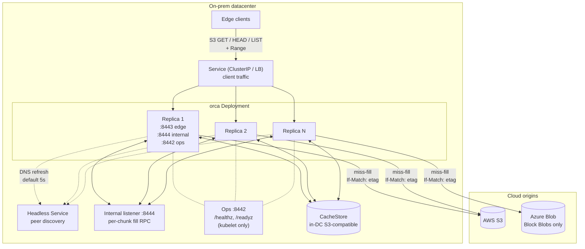
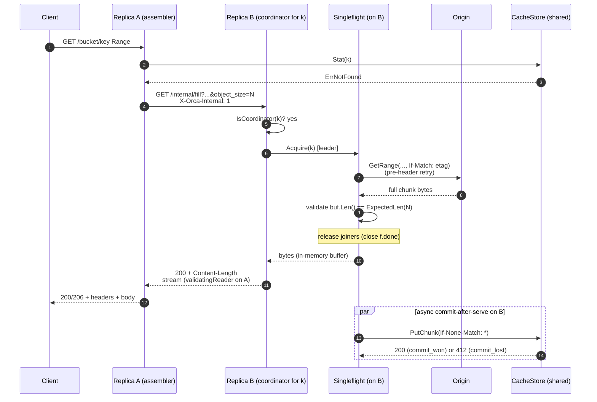

# Orca - Origin Cache - Architecture Brief

A short brief intended for technical leads who need to understand the
shape of the system, the load-bearing decisions, and what is in v1
without wading through the full design. Drill-down references point at
[design.md](./design.md).

## 1. Problem and approach

Cloud blob origins (AWS S3, Azure Blob) are slow and expensive when
read from on-prem at scale. The intended workload is large immutable
artifacts (job inputs, model weights, training shards) read by
thousands of clients with strongly correlated cold starts (job
launches, distributed-training kickoffs), including FUSE-mounted
filesystems where edge clients perform interactive `ls` and
directory navigation. Naive direct access stampedes origin egress
and cost.

Orca is a read-only S3-compatible HTTP cache deployed inside
the on-prem datacenter as a multi-replica Kubernetes Deployment
fronting AWS S3 and Azure Blob. It serves chunked, ETag-keyed bytes
out of a shared in-DC backing store, dedupes concurrent fills both
within and across replicas, and presents the same `GetObject` /
`HeadObject` / `ListObjectsV2` surface clients already use.

## 2. Goals and non-goals

Goals:
- Read-only S3-compatible API at the edge: `GetObject` (with byte-range
  `Range`), `HeadObject`, minimal `ListObjectsV2` pass-through.
- Multi-PB working set; thousands of concurrent clients.
- Multi-DC deployment; each DC independent (no cross-DC peering).
- Negligible origin stampede under correlated cold-access bursts.
- Low **TTFB** (time to first byte) on both warm and cold paths.
- Atomic, durable commit of fetched chunks; safe under concurrent
  fills.
- Bounded staleness: `metadata.ttl` (default 5m) on contract violation,
  `metadata.negative_ttl` (default 60s) on create-after-404; zero
  otherwise.

Non-goals:
- Write path, multipart upload, object versioning.
- Cross-DC peering.
- SigV4 verification at the edge (bearer / mTLS hooks present but the
  enforcement path is stubbed; see [design.md s4](./design.md#4-architecture)).
- Multi-tenant quotas or per-tenant credentials.
- Per-client / per-IP edge rate limiting.
- Mutable-blob invalidation beyond ETag identity.
- Encryption at rest beyond what the backing store provides.

## 3. System at a glance

Each request lands on one replica (the **assembler**), which iterates
the requested range chunk by chunk. Hits read directly from the
shared **CacheStore**. Misses route to the chunk's **coordinator**
(selected by rendezvous hashing on pod IP from the headless-Service
membership), which runs a per-`ChunkKey` singleflight against the
**Origin** and atomically commits to the CacheStore. The coordinator
may be the assembler itself (local fill) or a different replica
(per-chunk internal fill RPC).

### Diagram A: System overview

## 4. Components

Named building blocks. The two storage seams (Origin, CacheStore) are
formal Go interfaces in
[design.md s7](./design.md#7-internal-interfaces); the request-edge
components (Server, fetch.Coordinator, ChunkCatalog, Cluster) are
process-internal and are described in
[design.md s4](./design.md#4-architecture) and
[s8](./design.md#8-stampede-protection).

- **Server** - the S3-compatible HTTP edge for clients
  (`:8443`), the internal listener for per-chunk fill RPCs
  between replicas (`:8444`), and the ops listener for kubelet
  probes (`:8442`, serving `/healthz` and `/readyz`). Three
  listeners, three distinct trust intents (though only the ops
  listener has a fully-implemented auth posture today: no auth,
  not exposed via the client Service).
- **fetch.Coordinator** - orchestrates the per-request fan-out:
  per-chunk routing, origin concurrency bounding, internal-RPC
  client. The brain of the assembler.
- **Singleflight** - per-`ChunkKey` in-flight dedupe so concurrent
  cold misses for the same chunk collapse into one origin GET.
  Prevents process-local thundering herds.
- **ChunkCatalog** - in-memory LRU recording which chunks the
  CacheStore holds. Presence-only (no per-entry size or access
  counters); CacheStore is the source of truth. Pure hot-path
  optimization.
- **Origin** - read-only adapter to the upstream cloud blob store
  (AWS S3, Azure Blob). Sends `If-Match: <etag>` on every range
  read so mid-flight overwrites are detected at the wire.
- **CacheStore** - shared in-DC chunk store, source of truth for
  chunk presence. Implementation is `cachestore/s3` (in-DC
  S3-compatible object store such as VAST or LocalStack). The
  `CacheStore` interface is shaped to absorb additional driver
  shapes (e.g., shared POSIX FS); those are deferred work.
- **Cluster** - peer discovery from the headless Service plus
  rendezvous hashing on pod IP to pick the coordinator per
  `ChunkKey`. Refreshes membership every 5s by default.
- **Auth** - config plumbing exists for bearer / mTLS on the
  client edge and mTLS on the internal listener, but the
  enforcement paths are stubbed; dev runs with both disabled.
  Production deployments rely on Kubernetes NetworkPolicy or
  equivalent network isolation today. See
  [design.md s15](./design.md#15-deferred--future-work).

## 5. Five load-bearing mechanisms

### 5.1 Chunking and identity

The cache works in fixed-size chunks (default 8 MiB, configurable
4-16 MiB). The `ChunkKey` is
`{origin_id, bucket, object_key, etag, chunk_size, chunk_index}` and
is the on-store path for that chunk. ETag is treated as identity, not
freshness: any change of origin bytes (under the contract in s5.5)
produces a new ETag, which deterministically yields a new chunk path.
The cache cannot, by construction, serve old bytes for a new ETag.
The fetch coordinator additionally rejects origin Head responses with
an empty ETag (via `origin.MissingETagError`); without one, different
versions of `(bucket, key)` would alias to the same on-store path.
See [design.md s5](./design.md#5-chunk-model).

### 5.2 Singleflight + commit-after-serve

Per-`ChunkKey` singleflight on the coordinator collapses concurrent
misses to a single origin GET. Bounded **pre-header origin retry**
(default 3 attempts, 5s total budget) handles transient origin
failures invisibly before any HTTP response header is sent. Once the
leader has received and length-validated the full chunk body in an
in-memory buffer, joiners are released BEFORE the cachestore commit
begins; both joiner reads and the cachestore `PutChunk` run in
parallel against the same (now-immutable) buffer slice. The
cachestore commit failure is invisible to the client: the chunk is
not Recorded, and the next request refills. See
[design.md s8.1](./design.md#81-per-chunkkey-singleflight),
[s8.2](./design.md#82-singleflight--commit-after-serve), and
[s8.7](./design.md#87-failure-handling-without-re-stampede).

### 5.3 Per-chunk coordinator (rendezvous hashing)

Each replica polls a headless Service for peer IPs (default every
5s) and selects the coordinator per `ChunkKey` by rendezvous (Highest
Random Weight) hash on pod IP. The assembler fans out per-chunk fill
RPCs over a separate internal listener (`:8444`, plain HTTP in dev)
to coordinators that are not self. One client request spanning N
chunks may use N different coordinators; this is intentional for
highly correlated cold-access workloads, where any single hot key
would otherwise pin its assembler. Loop prevention is enforced by a
header marker (`X-Orca-Internal: 1`) plus a membership self-check
(`409 Conflict` fallback to local fill on disagreement). See
[design.md s8.3](./design.md#83-cluster-wide-deduplication-via-per-chunk-fill-rpc)
and [s8.4](./design.md#84-internal-rpc-listener).

### 5.4 Atomic-commit primitive

The leader publishes a chunk to the CacheStore in a single no-clobber
operation: the second concurrent commit MUST lose without overwriting
the winner. `cachestore/s3` uses `PutObject + If-None-Match: *`; the
loser receives `412 Precondition Failed` and is recorded as
`ErrCommitLost`. The driver runs `SelfTestAtomicCommit` at boot
(two PUTs, second must 412) and a `GetBucketVersioning` gate
(versioned buckets are rejected because `If-None-Match: *` is not
honored on them across all S3-compatible backends). Both checks
must pass before the listener binds. See
[design.md s10.1](./design.md#101-atomic-commit).

### 5.5 Bounded staleness contract

Correctness rests on an **immutable-origin contract** with the
operator: for any given `(origin_id, bucket, key)`, the underlying
bytes are immutable for the life of the key; replacement MUST publish
a new key. Because the
cache key includes ETag (s5.1), as long as the contract holds the
cache cannot serve stale bytes. If the contract is violated by an
in-place overwrite, the cache may serve old bytes for at most one
`metadata.ttl` window (default 5m), bounded by the metadata cache
TTL. This is the load-bearing semantic for correctness and MUST
appear in the consumer-API documentation. Defense in depth: every
`Origin.GetRange` carries `If-Match: <etag>`, so a mid-flight
overwrite is caught at fill time. See
[design.md s11](./design.md#11-bounded-staleness-contract). A
symmetric bound applies to **create-after-404** (a key uploaded after
a client already saw a 404 on it): at most one `metadata.negative_ttl`
window per replica that observed the original 404 (default 60s)
before the cache reflects the upload. See
[design.md s12](./design.md#12-create-after-404-and-negative-cache-lifecycle).

## 6. Backing-store options

The CacheStore is a Go interface; concrete implementations live
under `internal/orca/cachestore/<driver>/`. One driver ships
today:

- `cachestore/s3` - in-DC S3-compatible object store (e.g. VAST in
  production, LocalStack in dev). `PutObject` +
  `If-None-Match: *` is the atomic-commit primitive; the boot-time
  self-test plus the bucket-versioning gate guard the contract.

Shared-POSIX-filesystem drivers (`cachestore/posixfs` for NFSv4.1+,
Weka native, CephFS, Lustre, GPFS; `cachestore/localfs` for dev)
were designed but are not yet implemented. See
[design.md s15](./design.md#15-deferred--future-work).

## 7. A request, end-to-end (cold miss with cross-replica fill)

The diagram below traces a cold miss on replica A where the chunk's
coordinator is replica B. The hot path (cache hit on A) skips
straight from the catalog lookup to a direct CacheStore read; the
local-coordinator path (B == A) skips the internal RPC. On the cold
path, B fetches the chunk from origin under pre-header retry,
buffers it in memory, releases joiners as soon as the buffer is
length-validated, and streams the bytes back to A while the
CacheStore commit runs in parallel.

### Diagram B: Cold miss, cross-replica coordinator

## 8. Top risks worth your attention

1. **Immutable-origin contract** - Correctness rests on operators
   publishing new keys instead of overwriting. Bounded violation
   window is `metadata.ttl` (5m default). Must be visible in
   consumer-API documentation. See
   [design.md s11](./design.md#11-bounded-staleness-contract).
2. **Empty-ETag rejection at the fetch coordinator** - the on-store
   path encodes the ETag in its hash; without one, two different
   versions of `(bucket, key)` would alias to the same path and the
   cache would silently serve stale bytes after mutation. The fetch
   coordinator rejects empty-ETag origin Heads via
   `origin.MissingETagError` and negatively caches the rejection.
   Misconfigured origins surface as 502 `OriginMissingETag` rather
   than as data corruption. See
   [design.md s2](./design.md#2-decisions).
3. **Commit-after-serve failure** - The CacheStore commit happens
   in parallel with the response (and may outlive it on the
   leader's 5-minute detached context). If the commit fails, the
   client has the bytes but the chunk is silently uncached and the
   next request refills. Sustained failure is visible today only
   via structured debug logs; metrics for this case are deferred.
   See [design.md s8.7](./design.md#87-failure-handling-without-re-stampede).
4. **Per-replica origin semaphore is approximate** - Origin
   concurrency is capped per-replica at
   `floor(target_global / cluster.target_replicas)` (default 64
   slots/replica at `target_global=192`,
   `cluster.target_replicas=3`). Realized cluster-wide concurrency
   tracks `target_global` only when actual replica count matches
   `cluster.target_replicas`; scale-out without updating the knob
   over-allocates against origin, scale-in under-allocates.
   Origin throttling is handled by the leader's pre-header retry
   loop (exponential backoff) rather than by a hard coordinated
   cap. Coordinated cluster-wide limiter and dynamic recompute
   are deferred future work; see
   [design.md s15](./design.md#15-deferred--future-work).
5. **Create-after-404 staleness** - A key uploaded after clients
   already observed it as `404` will return stale `404` for up to
   `metadata.negative_ttl` (default 60s) per replica that observed
   the original miss. Round-robin LB can produce alternating `404`
   / `200` during the drain. No event-driven invalidation or admin-
   invalidation (the immutable-origin contract makes them
   unnecessary for the documented workload); operators must wait
   the TTL after uploading a previously-missing key. See
   [design.md s12](./design.md#12-create-after-404-and-negative-cache-lifecycle).
6. **Auth enforcement is stubbed** - bearer / mTLS hooks on the
   edge and mTLS on the internal listener are configured but not
   enforced; both are disabled in dev. Production deployments
   today rely on Kubernetes NetworkPolicy or equivalent network
   isolation. Building real enforcement is scoped as future work;
   see [design.md s15](./design.md#15-deferred--future-work).

## 9. Where to go next

`design.md` (full mechanism + flow):
- [s2 Decisions](./design.md#2-decisions) - shipped design choices.
- [s3 Terminology](./design.md#3-terminology) - full glossary.
- [s4 Architecture and onward](./design.md#4-architecture) -
  architecture, request flow, internal interfaces, stampede protection.
- [s8.7 Failure handling](./design.md#87-failure-handling-without-re-stampede) -
  pre-header retry, ETag-changed handling, commit-after-serve failure.
- [s10.1 Atomic commit](./design.md#101-atomic-commit) -
  `PutObject + If-None-Match: *`; SelfTestAtomicCommit; versioning gate.
- [s11 Bounded staleness](./design.md#11-bounded-staleness-contract).
- [s12 Create-after-404 and negative-cache lifecycle](./design.md#12-create-after-404-and-negative-cache-lifecycle).
- [s13 Eviction and capacity](./design.md#13-eviction-and-capacity) -
  passive lifecycle; ChunkCatalog sizing guidance.
- [s15 Deferred / future work](./design.md#15-deferred--future-work) -
  auth enforcement, posixfs/localfs drivers, Prometheus metrics,
  circuit breaker, LIST cache, prefetch, active eviction, bounded-
  freshness mode, cluster-wide HEAD coordinator, coordinated origin
  limiter, dynamic per-replica origin cap, mid-stream origin resume.
- Inline mermaid diagrams covering hits, cold misses, cross-replica
  fills, create-after-404 timeline, and membership flux.
