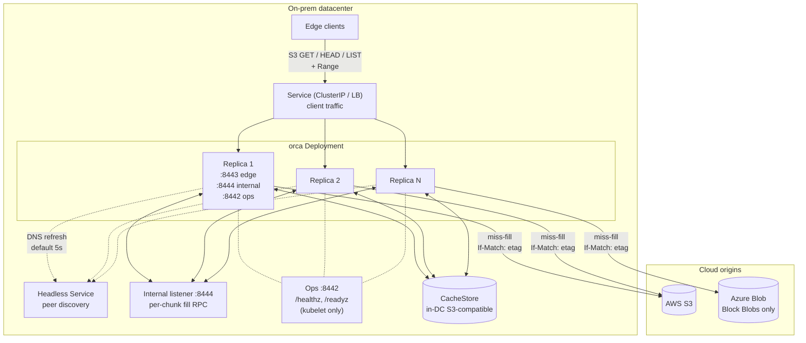
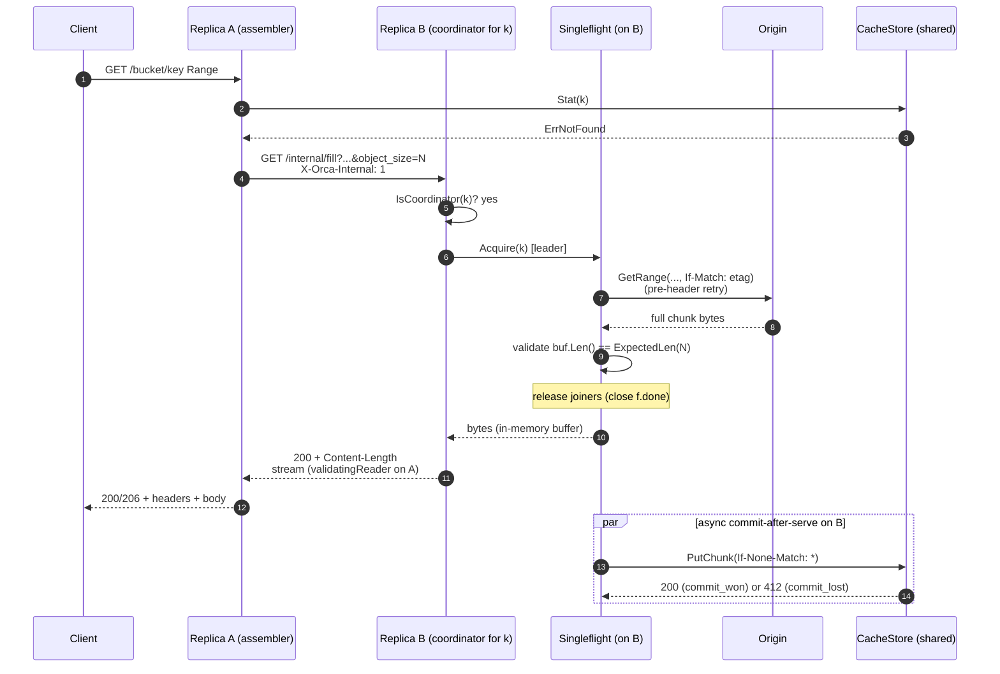

# Orca - Origin Cache - Architecture Brief

A short summary for technical leads who want the shape of the
system, the load-bearing decisions, and what's in the cache today
without reading the full design. Drill-downs link to
[design.md](./design.md).

## 1. Problem and approach

Cloud blob storage (AWS S3, Azure Blob) is slow and expensive when
many on-prem clients read from it at the same time. Orca's target
workload is large immutable artifacts (job inputs, model weights,
training shards) read by thousands of clients with highly
correlated cold starts (job launches, distributed-training
kickoffs), including FUSE mounts where edge clients run
interactive `ls` and directory walks. Letting every client read
from the cloud directly turns those bursts into a cost and
latency problem.

Orca is a read-only S3-compatible HTTP cache that sits inside the
on-prem datacenter as a multi-replica Kubernetes Deployment. It
fronts AWS S3 and Azure Blob. It serves chunked bytes - keyed by
the object's ETag - out of a shared in-DC store, and it makes sure
the same chunk is only fetched once even when many clients ask
for it. Clients use the same `GetObject` / `HeadObject` /
`ListObjectsV2` calls they already use.

## 2. Goals and non-goals

Goals:
- Read-only S3-compatible API at the edge: `GetObject` (with
  `Range`), `HeadObject`, a minimal `ListObjectsV2` pass-through.
- Multi-PB working set; thousands of concurrent clients.
- Multi-DC deployment; each DC is independent (no cross-DC
  peering).
- Almost no origin stampede when many clients ask for the same
  chunks at once.
- Fast time to first byte (TTFB) on hits and misses.
- Atomic, durable commit of fetched chunks; safe under concurrent
  fills.
- Bounded staleness: at most 5 minutes (`metadata.ttl`) if an
  operator overwrites a key in place, and at most 60 seconds
  (`metadata.negative_ttl`) after an operator uploads a key that
  someone already tried to fetch. Otherwise: zero.

Non-goals:
- Writes, multipart uploads, object versioning.
- Cross-DC peering.
- SigV4 verification at the edge (the bearer / mTLS hooks are
  there but nothing enforces them yet; see
  [design.md s4](./design.md#4-architecture)).
- Multi-tenant quotas or per-tenant credentials.
- Per-client / per-IP rate limiting at the edge.
- Telling clients when origin data changes, except via the ETag.
- Encryption at rest beyond what the backing store provides.

## 3. System at a glance

A client request lands on one replica - the **assembler**. The
assembler walks the requested byte range chunk by chunk. Hits
read straight from the shared **CacheStore**. Misses go to the
chunk's **coordinator** - the one replica a hash on the chunk's
identity picks from the headless Service membership. That
coordinator deduplicates with per-`ChunkKey` singleflight, fetches
from the **Origin**, and commits to the CacheStore without
overwriting anything that's already there. The coordinator might
be the same replica as the assembler (local fill) or a different
one (called over the per-chunk internal fill RPC).

### Diagram A: System overview

## 4. Components

The named pieces of the system. Their Go interfaces and concrete
implementations live under `internal/orca/`; the source files
have the canonical signatures. Mechanism-level prose is in
[design.md s4](./design.md#4-architecture) and
[s7](./design.md#7-stampede-protection).

- **Server** - the S3 API on the edge (`:8443`), the internal
  fill RPC between replicas (`:8444`), and the ops listener for
  kubelet probes (`:8442`, serving `/healthz` and `/readyz`).
  Three listeners with three different trust intents - though
  only the ops listener has a complete posture today (no auth,
  not exposed via the client Service).
- **fetch.Coordinator** - the per-replica brain that decides
  what to do for each chunk. Routes hits to the cachestore,
  routes misses to a coordinator (local or remote), bounds the
  number of in-flight origin fetches, and owns the pre-header
  retry loop.
- **Singleflight** - when many requests on one replica ask for
  the same chunk, only one fetch runs; the rest wait for it.
  Stops thundering herds inside a process.
- **ChunkCatalog** - an in-memory LRU of "this chunk is in the
  cachestore". Presence-only, no per-entry size or counters.
  Just a hot-path optimization; the cachestore is always the
  truth.
- **Origin** - the read-only adapter to the cloud blob store
  (AWS S3, Azure Blob). Sends `If-Match: <etag>` on every range
  read so an in-flight overwrite gets caught on the wire.
- **CacheStore** - the shared in-DC chunk store. The truth for
  what's cached. Today this is `cachestore/s3` (an in-DC
  S3-compatible store like VAST in production or LocalStack in
  dev). The interface is shaped to absorb other drivers (shared
  POSIX filesystems, for example); those are deferred work.
- **Cluster** - discovers peers from the headless Service and
  uses a hash on chunk identity to pick the coordinator for
  each chunk. Refreshes membership every 5 seconds by default.
- **Auth** - config keys exist for bearer / mTLS on the client
  edge and mTLS on the internal listener, but nothing enforces
  them today. Dev runs with both disabled. Production deployments
  rely on Kubernetes NetworkPolicy or similar network isolation.
  See [design.md s13](./design.md#13-deferred--future-work).

## 5. Five load-bearing mechanisms

### 5.1 Chunking and identity

Orca splits each object into fixed-size chunks (8 MiB by
default, tunable from 4 to 16). A chunk's name (`ChunkKey`) is
`{origin_id, bucket, object_key, etag, chunk_size, chunk_index}`,
and it deterministically becomes the chunk's storage path. The
ETag is treated as the key's identity, not as a freshness check:
any change to the bytes (under the contract in s5.5) produces a
new ETag, which gives a new path. So Orca cannot serve old bytes
for a new ETag - the design rules it out.

The fetch coordinator also rejects origin `Head` responses with
an empty ETag (as `origin.MissingETagError`). Without an ETag,
two different versions of the same `(bucket, key)` would share a
storage path. See
[design.md s5](./design.md#5-chunk-model).

### 5.2 Singleflight + commit-after-serve

The coordinator's singleflight collapses many concurrent misses
for the same chunk into a single origin fetch. A bounded
**pre-header origin retry** (3 attempts within 5 seconds by
default) absorbs transient origin failures before any HTTP
header reaches the client. Once the leader has the full chunk in
memory and the length checks out, joiners are released **before**
the cachestore commit begins; the joiners' reads and the
cachestore `PutChunk` run in parallel against the same buffer
(which is no longer being modified). If the commit fails, the
client never sees it: the chunk just isn't recorded, and the
next request refills. See
[design.md s7.1](./design.md#71-per-chunkkey-singleflight),
[s7.2](./design.md#72-singleflight--commit-after-serve), and
[s7.7](./design.md#77-failure-handling-without-re-stampede).

### 5.3 Per-chunk coordinator (rendezvous hashing)

Each replica polls the headless Service for peer IPs every 5
seconds (by default) and uses a rendezvous hash (HRW) on chunk
identity to pick one coordinator per chunk. The assembler calls
out to coordinators on the internal listener (`:8444`, plain
HTTP in dev). A single client request that spans N chunks can
hit N different coordinators - that's the point: it spreads hot
chunks across the cluster. Stale routes (when peer membership
shifts) are caught by an `X-Orca-Internal: 1` header and a
self-check on the receiver; a mismatch sends back 409 and the
caller falls back to filling locally. See
[design.md s7.3](./design.md#73-cluster-wide-deduplication-via-per-chunk-fill-rpc)
and [s7.4](./design.md#74-internal-rpc-listener).

### 5.4 Atomic-commit primitive

The leader publishes a chunk to the CacheStore in one step that
won't overwrite anything: if a chunk with that path already
exists, the write loses. The `cachestore/s3` driver does this
with `PutObject + If-None-Match: *`; the loser gets a `412` and
Orca records it as `ErrCommitLost`. At boot, the driver runs two
checks: a `SelfTestAtomicCommit` (two writes; the second must
get `412`) and a `GetBucketVersioning` gate (versioned buckets
are rejected, because some S3-compatible backends ignore
`If-None-Match: *` on them). Both checks must pass before the
listener binds. See
[design.md s8.1](./design.md#81-atomic-commit).

### 5.5 Bounded staleness contract

Correctness rests on a promise from the operator: for any given
`(origin_id, bucket, key)`, the bytes never change once the key
is published. To change the data, publish a new key. Because the
chunk's storage path includes the ETag (s5.1), as long as the
promise holds Orca cannot serve old bytes. If the operator does
break the promise, Orca may serve the old bytes for at most 5
minutes (the `metadata.ttl` default). That's the load-bearing
correctness statement and must appear in consumer-API docs.
Safety net: every `Origin.GetRange` carries `If-Match: <etag>`,
so an in-flight overwrite gets caught on the wire. See
[design.md s9](./design.md#9-bounded-staleness-contract).

There's a matching bound for the "I forgot to upload that" case:
if a key is uploaded after someone already saw a 404 on it, the
stale 404 lives for at most 60 seconds per replica that saw the
original 404 (`metadata.negative_ttl`). See
[design.md s10](./design.md#10-create-after-404-and-negative-cache-lifecycle).

## 6. Backing-store options

The CacheStore is a Go interface; concrete drivers live under
`internal/orca/cachestore/<driver>/`. One driver ships today:

- `cachestore/s3` - an in-DC S3-compatible object store (VAST in
  production, LocalStack in dev). The atomic-commit primitive is
  `PutObject + If-None-Match: *`. The boot self-test and the
  versioning gate keep the rule honest.

Shared-POSIX-filesystem drivers (`cachestore/posixfs` for
NFSv4.1+, Weka native, CephFS, Lustre, GPFS; `cachestore/localfs`
for dev) were designed and not built. See
[design.md s13](./design.md#13-deferred--future-work).

## 7. A request, end-to-end (cold miss with cross-replica fill)

Below: a cold miss on replica A where the chunk's coordinator is
replica B. The warm path (cache hit on A) skips straight from the
catalog lookup to a direct CacheStore read. The local-coordinator
path (B == A) skips the internal RPC. On the cold path, B fetches
from the origin with pre-header retry, holds the chunk in memory,
releases joiners as soon as it's length-checked, and streams the
bytes back to A while the cachestore commit runs in parallel.

### Diagram B: Cold miss, cross-replica coordinator

## 8. Top risks worth your attention

1. **The immutable-origin promise.** Correctness depends on
   operators publishing new keys instead of overwriting. If the
   promise is broken, the worst-case window for stale data is 5
   minutes (`metadata.ttl`). This needs to be visible in the
   consumer-API docs. See
   [design.md s9](./design.md#9-bounded-staleness-contract).
2. **Empty-ETag rejection.** The chunk's storage path includes
   the ETag in its hash. Without one, two different versions of
   `(bucket, key)` would share a path and Orca would silently
   serve old bytes after a mutation. The fetch coordinator
   rejects empty ETags with `origin.MissingETagError` and caches
   the rejection negatively. A misconfigured origin shows up as
   a 502 `OriginMissingETag`, not as data corruption. See
   [design.md s2](./design.md#2-decisions).
3. **Commit-after-serve failure.** The cachestore commit happens
   in parallel with the response (and can outlive it on the
   leader's 5-minute detached context). If the commit fails, the
   client already has the bytes, but the chunk isn't recorded
   and the next request will refill. Sustained failure is only
   visible in structured debug logs today; metrics for this are
   deferred. See
   [design.md s7.7](./design.md#77-failure-handling-without-re-stampede).
4. **The per-replica origin cap is approximate.** Each replica
   caps in-flight origin fetches at
   `floor(target_global / cluster.target_replicas)` - 64 by
   default. The cluster-wide cap only matches `target_global`
   when the actual replica count matches
   `cluster.target_replicas`. Scaling out without updating that
   knob over-allocates against origin; scaling in
   under-allocates. Origin throttling is handled by the leader's
   pre-header retry loop (exponential backoff), not by a hard
   cluster-wide cap. A coordinated cluster-wide limiter and a
   dynamic per-replica recompute are both deferred work; see
   [design.md s13](./design.md#13-deferred--future-work).
5. **Create-after-404 staleness.** A key uploaded after clients
   already saw a 404 on it will keep coming back as a 404 for up
   to 60 seconds (`metadata.negative_ttl`) per replica that saw
   the original 404. Under round-robin load balancing, clients
   can see 404 and 200 alternating while the cache drains. There
   is no origin-push invalidation and no admin invalidation RPC.
   The workaround: after uploading a key, wait
   `metadata.negative_ttl` before telling anyone about it. See
   [design.md s10](./design.md#10-create-after-404-and-negative-cache-lifecycle).
6. **Auth is stubbed.** The config keys for bearer / mTLS on the
   edge and mTLS on the internal listener exist; the enforcement
   does not. Both are off in dev. Production deployments rely on
   Kubernetes NetworkPolicy or similar isolation today. Building
   real enforcement is deferred work; see
   [design.md s13](./design.md#13-deferred--future-work).

## 9. Where to go next

`design.md` (full mechanism + flow):
- [s2 Decisions](./design.md#2-decisions) - the design choices
  Orca ships with.
- [s3 Terminology](./design.md#3-terminology) - full glossary.
- [s4 Architecture and onward](./design.md#4-architecture) -
  architecture, request flow, internal interfaces, stampede
  protection.
- [s7.7 Failure handling](./design.md#77-failure-handling-without-re-stampede) -
  pre-header retry, ETag changes, commit-after-serve failure.
- [s8.1 Atomic commit](./design.md#81-atomic-commit) -
  `PutObject + If-None-Match: *`, the boot self-test, the
  versioning gate.
- [s9 Bounded staleness](./design.md#9-bounded-staleness-contract).
- [s10 Create-after-404 and negative-cache lifecycle](./design.md#10-create-after-404-and-negative-cache-lifecycle).
- [s11 Eviction and capacity](./design.md#11-eviction-and-capacity) -
  passive lifecycle and `ChunkCatalog` sizing.
- [s13 Deferred / future work](./design.md#13-deferred--future-work) -
  auth enforcement, posixfs / localfs drivers, Prometheus
  metrics, circuit breaker, LIST cache, active eviction,
  bounded-freshness mode, cluster-wide HEAD coordinator,
  coordinated origin limiter, dynamic per-replica origin cap,
  mid-stream origin resume.
- Inline mermaid diagrams covering hits, cold misses,
  cross-replica fills, the create-after-404 timeline, and
  membership flux.
