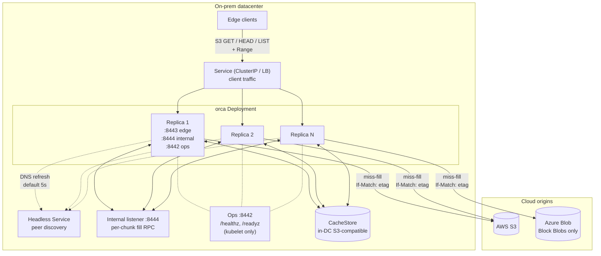

# Orca - Origin Cache - Architecture Brief

A one-screen orientation: what Orca is, the load-bearing
decisions, and the risks. For mechanism and flow, see
[design.md](./design.md).

## 1. Problem and approach

Cloud blob storage (AWS S3, Azure Blob) is slow and expensive
when many on-prem clients read from it at once. Orca's target
workload is large immutable artifacts - job inputs, model
weights, training shards - read by thousands of clients with
correlated cold starts. Direct cloud access at that scale is a
cost and latency problem.

Orca is a read-only S3-compatible HTTP cache that sits inside
the on-prem datacenter as a multi-replica Kubernetes Deployment.
It fronts AWS S3 and Azure Blob, serves chunked bytes keyed by
ETag out of a shared in-DC store, and makes sure the same chunk
is fetched only once no matter how many clients ask for it.
Clients use the same `GetObject` / `HeadObject` / `ListObjectsV2`
calls they already use.

## 2. Goals and non-goals

In scope:
- Read-only S3-compatible API: `GetObject` with `Range`,
  `HeadObject`, minimal `ListObjectsV2` pass-through.
- Multi-PB working set; thousands of concurrent clients.
- One Orca deployment per datacenter, no cross-DC peering.
- Near-zero origin stampede under correlated cold-access bursts.
- Fast TTFB on both hits and misses.
- Atomic, durable commit of fetched chunks.
- Bounded staleness: at most 5 minutes if an operator overwrites
  a key in place (`metadata.ttl`), at most 60 seconds for the
  "uploaded after a 404" case (`metadata.negative_ttl`).
  Otherwise zero.

Out of scope:
- Writes, multipart uploads, object versioning.
- Cross-DC peering.
- SigV4 verification (bearer / mTLS hooks exist but nothing
  enforces them yet).
- Multi-tenant quotas; per-client / per-IP rate limiting.
- Origin-pushed invalidation (the ETag covers it).
- Encryption at rest beyond what the backing store provides.

## 3. System at a glance

A client request lands on one replica, the **assembler**. The
assembler walks the requested byte range chunk by chunk. Hits
read directly from the shared **CacheStore**. Misses go to the
chunk's **coordinator** - the one replica a hash on chunk
identity picks from the headless Service membership. That
coordinator deduplicates concurrent fetches with a per-`ChunkKey`
singleflight, calls the **Origin**, and commits to the
CacheStore in a single no-overwrite write. The coordinator may
be the same replica as the assembler (local fill) or a different
one (called over the internal fill RPC).

### Diagram A: System overview

## 4. Five load-bearing mechanisms

### 4.1 Chunking and identity

Objects are split into fixed-size chunks (8 MiB by default,
tunable). A chunk's name (`ChunkKey`) is
`{origin_id, bucket, object_key, etag, chunk_size, chunk_index}`,
and that name deterministically becomes the chunk's storage
path. The ETag is the key's identity: a new ETag means a new
path, so Orca cannot serve old bytes for a new ETag by
construction. Empty-ETag origin responses are rejected at
`Head`.

The chunk size is not fixed. For bigger objects the edge picks a
bigger chunk size (8 MiB up to 128 MiB by default, see
`chunking.tiers`), so the per-object request count stays
manageable. The edge also fetches the next few chunks in
parallel while sending the current one to the client
(`chunking.readahead`, default 8). Both knobs help large-blob
throughput without changing how chunks are stored or addressed.

### 4.2 Singleflight + commit-after-serve

The coordinator's singleflight collapses many concurrent misses
for the same chunk into a single origin fetch. The leader retries
transient origin errors up to 3 times in 5 seconds before sending
any client headers, releases joiners as soon as the chunk is in
memory and length-checked, and commits to the cachestore in
parallel. A commit failure is invisible to the client: the chunk
just isn't recorded and the next request refills.

### 4.3 Per-chunk coordinator (rendezvous hashing)

Each replica polls the headless Service for peer IPs every 5
seconds and uses a rendezvous hash on chunk identity to pick one
coordinator per chunk. The assembler calls coordinators over the
internal listener (`:8444`, plain HTTP in dev). One client
request that spans N chunks can hit N different coordinators -
that's how Orca spreads hot chunks. Stale routes during
membership churn are caught by an `X-Orca-Internal: 1` header
plus a self-check on the receiver; a mismatch returns 409 and
the caller falls back to filling locally.

### 4.4 Atomic-commit primitive

The leader publishes a chunk to the CacheStore in one write that
won't overwrite. `cachestore/s3` uses `PutObject +
If-None-Match: *`; the loser of a race gets 412 and is recorded
as `ErrCommitLost`. At boot the driver runs two checks - a
self-test that proves the precondition is honored, and a
versioning gate that refuses to start on versioned buckets
(several S3-compatible backends ignore `If-None-Match: *` on
them).

### 4.5 Bounded staleness contract

Operators promise: once a key is published, its bytes never
change. To change the data, publish a new key. As long as the
promise holds, Orca cannot serve stale bytes (the ETag is in
the chunk's path). If the promise is broken, Orca may serve old
bytes for up to 5 minutes (`metadata.ttl`). That's the
load-bearing correctness statement and must appear in
consumer-API docs. Every `Origin.GetRange` also carries
`If-Match: <etag>` as a safety net. A matching bound applies to
the "uploaded after a 404" case: 60 seconds
(`metadata.negative_ttl`) per replica that saw the original 404.

## 5. Backing-store options

One driver ships today:

- `cachestore/s3` - an in-DC S3-compatible object store (VAST in
  production, LocalStack in dev). Atomic-commit primitive is
  `PutObject + If-None-Match: *`; the boot self-test and the
  versioning gate keep it honest.

Shared-POSIX-filesystem drivers (`cachestore/posixfs`,
`cachestore/localfs`) were designed and not built. See
[design.md s13](./design.md#13-deferred--future-work).

## 6. Top risks

| Risk | What goes wrong | Bound | Detail |
|---|---|---|---|
| Immutable-origin promise | Operator overwrites a key instead of publishing a new one | Up to 5 min stale (`metadata.ttl`) | [s9](./design.md#9-bounded-staleness-contract) |
| Empty-ETag origin | Two versions share a storage path; corrupt reads | Rejected at `Head`; 502 `OriginMissingETag` | [s2](./design.md#2-decisions) |
| Commit-after-serve failure | Client got bytes; cachestore commit failed | Chunk unrecorded; next request refills. Debug logs only today | [s7.7](./design.md#77-failure-handling-without-re-stampede) |
| Approximate origin cap | Scale changes mis-size the cluster-wide cap | Mirror replica count into `cluster.target_replicas` | [s13](./design.md#13-deferred--future-work) |
| Create-after-404 staleness | Upload after a 404 reached a client | Up to 60s per replica (`metadata.negative_ttl`) | [s10](./design.md#10-create-after-404-and-negative-cache-lifecycle) |
| Auth stubbed | Bearer / mTLS hooks not enforced | Rely on NetworkPolicy until built | [s13](./design.md#13-deferred--future-work) |

## 7. Where to go next

`design.md` for the full picture:

- [s2 Decisions](./design.md#2-decisions)
- [s3 Terminology](./design.md#3-terminology)
- [s4 Architecture](./design.md#4-architecture)
- [s7 Stampede protection](./design.md#7-stampede-protection)
- [s8 Atomic commit](./design.md#8-atomic-commit)
- [s9 Bounded staleness contract](./design.md#9-bounded-staleness-contract)
- [s10 Create-after-404](./design.md#10-create-after-404-and-negative-cache-lifecycle)
- [s11 Eviction and capacity](./design.md#11-eviction-and-capacity)
- [s13 Deferred / future work](./design.md#13-deferred--future-work)
