# Orca - Origin Cache - Design (mechanism & flow)

Status: draft for review (round 2 incorporating reviewer feedback)
Owner: TBD

---

## Table of contents

### Sections

1. [Overview](#1-overview)
2. [Decisions](#2-decisions)
3. [Terminology](#3-terminology)
4. [Architecture](#4-architecture)
5. [Chunk model](#5-chunk-model)
6. [Request flow](#6-request-flow)
   - [6.1 HEAD request flow](#61-head-request-flow)
   - [6.2 LIST request flow](#62-list-request-flow)
   - [6.3 HTTP error-code mapping](#63-http-error-code-mapping)
7. [Internal interfaces](#7-internal-interfaces)
8. [Stampede protection](#8-stampede-protection)
   - [8.1 Per-`ChunkKey` singleflight](#81-per-chunkkey-singleflight)
   - [8.2 TTFB tee + spool](#82-ttfb-tee--spool)
   - [8.3 Cluster-wide deduplication via per-chunk fill RPC](#83-cluster-wide-deduplication-via-per-chunk-fill-rpc)
   - [8.4 Origin backpressure](#84-origin-backpressure)
   - [8.5 Cancellation safety](#85-cancellation-safety)
   - [8.6 Failure handling without re-stampede](#86-failure-handling-without-re-stampede)
   - [8.7 Metadata-layer singleflight](#87-metadata-layer-singleflight)
   - [8.8 Internal RPC listener](#88-internal-rpc-listener)
9. [Azure adapter: Block Blob only](#9-azure-adapter-block-blob-only)
10. [Concurrency, durability, correctness](#10-concurrency-durability-correctness)
    - [10.1 Atomic commit (per CacheStore driver)](#101-atomic-commit-per-cachestore-driver)
    - [10.2 Catalog correctness, typed errors, circuit breaker](#102-catalog-correctness-typed-errors-circuit-breaker)
    - [10.3 Range, sizes, and edge cases](#103-range-sizes-and-edge-cases)
    - [10.4 Spool locality contract](#104-spool-locality-contract)
    - [10.5 Readiness probe (`/readyz`)](#105-readiness-probe-readyz)
11. [Bounded staleness contract](#11-bounded-staleness-contract)
    - [11.1 The contract and the staleness window](#111-the-contract-and-the-staleness-window)
    - [11.2 Bounded-freshness mode (optional)](#112-bounded-freshness-mode-optional)
12. [Create-after-404 and negative-cache lifecycle](#12-create-after-404-and-negative-cache-lifecycle)
13. [Eviction and capacity](#13-eviction-and-capacity)
    - [13.1 Passive eviction (lifecycle)](#131-passive-eviction-lifecycle)
    - [13.2 Active eviction (opt-in, access-frequency)](#132-active-eviction-opt-in-access-frequency)
    - [13.3 ChunkCatalog size awareness](#133-chunkcatalog-size-awareness-load-bearing-operational-note)
    - [13.4 Spool capacity](#134-spool-capacity)
    - [13.5 `chunk_size` config-change capacity impact](#135-chunk_size-config-change-capacity-impact)
    - [13.6 Eviction interactions](#136-eviction-interactions)
14. [Horizontal scale](#14-horizontal-scale)
15. [Deferred optimizations](#15-deferred-optimizations)
    - [15.1 Edge rate limiting](#151-edge-rate-limiting)
    - [15.2 Cluster-wide HEAD singleflight](#152-cluster-wide-head-singleflight)
    - [15.3 Cluster-wide LIST coordinator](#153-cluster-wide-list-coordinator)
    - [15.4 Mid-stream origin resume](#154-mid-stream-origin-resume)
    - [15.5 Coordinated cluster-wide origin limiter](#155-coordinated-cluster-wide-origin-limiter)
    - [15.6 Dynamic per-replica origin cap](#156-dynamic-per-replica-origin-cap)

### Request scenarios

Concrete request-flow narratives. Each scenario has a stable letter
identifier reused in the diagram heading.

- **Scenario A** - warm read (cache hit): [Diagram 3](#diagram-3-scenario-a---warm-read-cache-hit)
- **Scenario B** - cold miss, local coordinator: [Diagram 4](#diagram-4-scenario-b---cold-miss-local-coordinator)
- **Scenario C** - concurrent miss, same-replica joiner: [Diagram 5](#diagram-5-scenario-c---concurrent-miss-same-replica-joiner)
- **Scenario D** - cold miss, remote coordinator (cross-replica fill): [Diagram 6](#diagram-6-scenario-d---cold-miss-remote-coordinator)
- **Scenario E** - range spanning multiple coordinators: [Diagram 7](#diagram-7-scenario-e---range-spanning-multiple-coordinators)
- **Scenario F** - Azure non-BlockBlob rejection: [Diagram 8](#diagram-8-scenario-f---azure-non-blockblob-rejection)
- **Scenario G** - create-after-404 (operator upload after client miss): [Diagram 10](#diagram-10-scenario-g---create-after-404-timeline)
- **Scenario H** - rolling restart membership flux: [Diagram 12](#diagram-12-scenario-h---rolling-restart-membership-flux)

Other diagrams (D1, D2, D9, D11) depict architecture, math, or
mechanism rather than request scenarios and are reachable from the
Sections list above.

---

## 1. Overview

Edge devices inside an on-prem datacenter need read access to large files
held in cloud blob storage (S3, Azure Blob). Direct egress per device is
unacceptable (cost, latency, throughput, security boundary). Orca is
a read-only caching layer, deployed inside each datacenter, that fronts
cloud blob storage with an S3-compatible API. Clients issue range reads;
Orca serves from a shared in-DC store when present, otherwise
fetches from the cloud origin, stores the chunk, and returns it.

This document describes the mechanism: decisions, components, request flow,
stampede protection, atomic commit, and horizontal-scale coordination.

## 2. Decisions

| Area | Decision |
|---|---|
| Client API | S3-compatible HTTP; `GET` + `HEAD` + `ListObjectsV2`; supports `Range`. |
| Auth (v1) | Network-perimeter trust + bearer / mTLS. No SigV4 verification yet. |
| Origins | S3 + Azure Blob behind a pluggable `Origin` interface. |
| Azure constraint | Block Blobs only. Append/Page Blobs rejected at `Head`. |
| Backing store | Pluggable `CacheStore`; `localfs` for dev, `s3` (VAST or any S3-compatible in-DC object store) **or** `posixfs` (NFSv4.1+, Weka native, CephFS, Lustre, GPFS, or any shared POSIX FS that honors `link()` / `EEXIST` and directory `fsync`) for prod. The CacheStore is the source of truth for chunk presence. Driver choice is a deployment-time decision per replica set; `s3` and `posixfs` are interchangeable from the cache layer's perspective. |
| In-DC S3 vs. cloud S3 | The in-DC S3-compatible store is treated identically to cloud S3 at the protocol level. The only difference is "much faster, in-DC". Both `Origin` and the `cachestore/s3` driver are thin S3-client adapters with no special-casing. The `cachestore/posixfs` driver replaces the S3 protocol with shared-POSIX primitives but presents the same `CacheStore` interface, so nothing above s7 changes. |
| CacheStore atomic-commit primitive | Two equivalent primitives, picked per driver: object-store `PutObject + If-None-Match: *` (used by `cachestore/s3`) and POSIX `link()` / `renameat2(RENAME_NOREPLACE)` returning `EEXIST` (used by `cachestore/localfs` and `cachestore/posixfs`). Both are atomic, no-clobber, and have a "you lost the race" failure mode that maps cleanly onto `commit_lost`. Each driver runs `SelfTestAtomicCommit` at boot and refuses to start on backends that don't honor its primitive. |
| Chunking | Fixed 8 MiB default (configurable 4-16 MiB). `chunk_size` baked into `ChunkKey`. |
| Consistency | **Origin objects are immutable per operator contract**: an `(origin_id, bucket, key)` never has its bytes modified once published; replacement must be a new key. `ETag` is identity, not freshness. `If-Match: <etag>` on every `Origin.GetRange` is defense-in-depth that traps in-flight overwrites only. Bounded staleness uses two TTLs: `metadata_ttl` (default 5m) on positive entries (caps in-place-overwrite contract violations; see [s11](#11-bounded-staleness-contract)) and `negative_metadata_ttl` (default 60s) on negative entries (caps the create-after-404 unavailability window after an operator uploads a previously-missing key; see [s12](#12-create-after-404-and-negative-cache-lifecycle)). |
| Catalog | In-memory `ChunkCatalog` fronting `CacheStore.Stat`. No persistent local index. Per-entry access-frequency tracking (s10.2) feeds the optional active-eviction loop (s13.2). Bounded by `chunk_catalog.max_entries`; size to estimated working-set chunks (s13.3). |
| Eviction | Two-tier. Passive: bounded LRU on the in-memory ChunkCatalog (always on); CacheStore lifecycle (S3 lifecycle / posixfs operator sweep) for storage-side cleanup. Active: opt-in access-frequency-driven eviction loop (`chunk_catalog.active_eviction.enabled`, default `false`) that deletes cold chunks from the CacheStore via `CacheStore.Delete`. Operators using `cachestore/posixfs` typically enable active eviction since posixfs has no native lifecycle. See [s13](#13-eviction-and-capacity). |
| Prefetch | Sequential read-ahead by default. Configurable depth, capped concurrency. |
| Cluster | Kubernetes Deployment + headless Service for peer discovery + ClusterIP/LB for client traffic. Rendezvous hashing on pod IP selects the coordinator per `ChunkKey` for miss-fills only; receiving replica is the **assembler** that fans out per-chunk fill RPCs to coordinators (s8.3). All replicas can read all chunks directly from the CacheStore on hits. |
| Inter-replica auth | Separate internal mTLS listener (default `:8444`) chained to an internal CA distinct from the client mTLS CA; authorization = "presenter source IP is in current peer-IP set" (s8.8). |
| Local spool | Every fill writes origin bytes through a local spool (`internal/orca/fetch/spool`) in parallel with streaming to the client; serves as a slow-joiner fallback and as the source for the asynchronous CacheStore commit. The spool is NOT on the client-TTFB path in v1; client bytes flow origin -> client directly (s8.2 / s8.6). |
| Atomic commit | `localfs` and `posixfs` stage inside `<root>/.staging/<uuid>` with parent-dir fsync, then `link()` no-clobber (returns `EEXIST` to the loser); `s3` uses direct `PutObject` with `If-None-Match: *`. Each driver runs `SelfTestAtomicCommit` at boot: `s3` proves the backend honors `If-None-Match: *`; `posixfs` proves the backend honors `link()` / `EEXIST` and that directory fsync is durable, and additionally enforces `nfs.minimum_version` (default `4.1`, with opt-in `nfs.allow_v3`) and refuses to start on Alluxio FUSE backends. Cold-path bytes stream directly from origin to client; bounded leader-side **pre-header origin retry** (s8.6) handles transient origin failures invisibly before response headers are committed. The spool tees in parallel for joiners (s8.2) and as the CacheStore-commit source. CacheStore commit happens asynchronously after the response completes; commit-after-serve failure becomes `commit_after_serve_total{result="failed"}` rather than a client error (s8.6). |
| Versioned buckets on cachestore/s3 | Not supported. The `cachestore/s3` driver requires the bucket to have versioning **disabled**. AWS S3 honors `If-None-Match: *` on both versioned and unversioned buckets, but VAST Cluster (and likely other S3-compatible backends) only honors it on unversioned buckets ([VAST KB][vast-kb-conditional-writes]). The driver enforces this at boot via an explicit `GetBucketVersioning` versioning gate (s10.1.3); refusing to start on enabled or suspended versioning avoids a class of silent atomic-commit failures. |
| LIST caching | Per-replica TTL'd LIST cache (s6.2 / FW3) in front of `Origin.List`, sized for the FUSE-`ls` workload pattern. Default `list_cache.ttl=60s`, configurable. Cluster-wide LIST coordination is a deferred optimization ([s15.3](#153-cluster-wide-list-coordinator)). |
| Origin concurrency cap | Per-replica token bucket sized `floor(target_global / cluster.target_replicas)`. Default `target_global=192` and `cluster.target_replicas=3`, giving 64 slots per replica. Origin throttling responses (503 / 429) are handled by the leader's pre-header retry loop (s8.6) with exponential backoff. A coordinated cluster-wide limiter and dynamic recompute from `len(Cluster.Peers())` are deferred optimizations; see [s15.5](#155-coordinated-cluster-wide-origin-limiter) and [s15.6](#156-dynamic-per-replica-origin-cap). |
| Bounded-freshness mode | Optional, opt-in via `metadata_refresh.enabled` (default `false`). When enabled, a per-replica background loop proactively re-Heads hot keys (`AccessCount >= access_threshold`) ahead of `metadata_ttl` to shrink the effective bounded-staleness window for popular content. See [s11.2](#112-bounded-freshness-mode-optional). |
| Tenancy | Single tenant, single origin credential set in v1. |
| Edge rate limiting | Documented v1 gap; see [s15.1](#151-edge-rate-limiting). v1 has implicit hot-client mitigation via the per-replica origin limiter (s8.4) and singleflight (s8.1); per-client / per-IP / per-credential edge rate limiting is deferred future work. |
| Repo home | This repo. Layout mirrors `machina`. |

[vast-kb-conditional-writes]: https://kb.vastdata.com/documentation/docs/s3-conditional-writes

## 3. Terminology

Terms used throughout this document. Forward-references point at the
section that defines or implements the full mechanism.

- **Replica** - one running pod of the `orca` Deployment. All
  replicas are interchangeable; there is no per-pod state.
- **Client** - external caller using an S3-compatible HTTP API (e.g.
  `aws-sdk`, `boto3`).
- **Origin** - upstream cloud blob store (AWS S3 or Azure Blob); read-only
  from our perspective. Interface defined in
  [s7](#7-internal-interfaces).
- **CacheStore** - the in-DC durable store that holds cached chunk bytes
  and is shared by all replicas. Pluggable: `localfs` for dev, `s3` (e.g.
  VAST or any S3-compatible in-DC object store) and `posixfs` (shared
  POSIX FS - NFSv4.1+, Weka native, CephFS, Lustre, GPFS) for prod;
  driver choice is a deployment-time decision and is invisible above the
  cachestore boundary. Treated as the source of truth for chunk presence.
  Interface in [s7](#7-internal-interfaces); commit semantics in
  [s10](#10-concurrency-durability-correctness).
- **Chunk** - a fixed-size byte range of an origin object (default 8 MiB);
  the unit of caching and fill.
- **ChunkKey** - the immutable identifier for a chunk:
  `{origin_id, bucket, object_key, etag, chunk_size, chunk_index}`. Full
  definition in [s5](#5-chunk-model).
- **Headless Service** - Kubernetes `Service` with `clusterIP: None`; its
  DNS A-record resolves to the IPs of all Ready pods. We poll it (default
  every 5s) to discover the current peer set.
- **Rendezvous hashing** (a.k.a. Highest Random Weight, HRW) - for a given
  key, score each peer with `hash(peer_ip || key)` and pick the argmax.
  Stable under membership changes that don't add or remove the winning
  peer. We use it to pick exactly one coordinator per chunk from the
  current peer set.
- **Coordinator** - the replica that rendezvous hashing selects to perform
  the miss-fill for a particular chunk. Ownership is **per chunk**, not
  per request and not per object: a single client request spanning N
  chunks may have N different coordinators.
- **Assembler** - the replica that received the client request. It is
  responsible for stitching the client response. For each chunk in the
  requested range, the assembler either (a) reads from CacheStore on a
  hit, (b) runs a local miss-fill if it is the coordinator for that
  chunk, or (c) issues an internal fill RPC to the coordinator otherwise.
  See [s8.3](#83-cluster-wide-deduplication-via-per-chunk-fill-rpc).
- **Singleflight** - a per-key in-process deduplication primitive.
  Concurrent requests for the same `ChunkKey` share a single in-flight
  fill: the first arrival is the **leader** (issues the origin GET);
  subsequent arrivals are **joiners** (wait on the leader's stream). Full
  mechanism in [s8.1](#81-per-chunkkey-singleflight).
- **Tee** - the leader's origin byte stream is split two ways: into a
  small in-memory ring buffer for low-TTFB joiners, and into the Spool
  (below) for slow joiners that fall behind the ring head. Joiners
  therefore stream through the leader rather than waiting for the full
  disk write. Full mechanism in [s8.2](#82-ttfb-tee--spool).
- **Spool** - bounded local-disk staging area for in-flight fills
  (`internal/orca/fetch/spool`). Ensures slow joiners always have a
  local fallback regardless of CacheStore driver. Detail in
  [s8.2](#82-ttfb-tee--spool).
- **Atomic CacheStore commit** - the leader publishes the completed chunk
  in a single no-clobber operation: `link()` /
  `renameat2(RENAME_NOREPLACE)` for `localfs`; `PutObject` +
  `If-None-Match: *` for `s3`. Concurrent commits cannot overwrite each
  other; the loser is recorded as `commit_lost`. See
  [s10](#10-concurrency-durability-correctness).
- **Per-chunk internal fill RPC** - `GET /internal/fill?key=<encoded
  ChunkKey>` over mTLS on the internal listener (default `:8444`). The
  assembler calls the coordinator when a chunk is missed and the
  coordinator is not self. See [s8.8](#88-internal-rpc-listener).
- **Immutable origin contract** - operator promise that an
  `(origin_id, bucket, key)` never has its bytes modified once published;
  replacement is always a new key. The cache trusts this contract; on
  violation, the bounded staleness window is `metadata_ttl` (default 5m).
  Full statement in [s11](#11-bounded-staleness-contract).
- **Pre-header retry** - the leader retries `Origin.GetRange` on
  transient errors **before** sending HTTP response headers to the
  client, making transient origin failures invisible to the client.
  Bounded by `origin.retry.attempts` (default 3) and
  `origin.retry.max_total_duration` (default 5s). The "commit
  boundary" is the first byte arrival from origin: once received,
  the cache sends headers and starts streaming; subsequent origin
  failures become mid-stream client aborts (handled by S3 SDK
  retry via `Content-Length` mismatch). `OriginETagChangedError`
  is non-retryable. Detail in
  [s8.6](#86-failure-handling-without-re-stampede). Mid-stream
  origin resume is deferred future work
  ([s15.4](#154-mid-stream-origin-resume)).
- **CacheStore circuit breaker** - per-process error-rate breaker around
  `CacheStore` calls. On sustained `ErrTransient` / `ErrAuth`, the
  breaker opens, short-circuits writes, and surfaces via metrics and
  `/readyz`. Defaults: 10 errors / 30s window, 30s open, 3 half-open
  probes. Detail in [s10.2](#102-catalog-correctness-typed-errors-circuit-breaker).
- **Negative-cache entry** - a metadata-cache entry recording an
  authoritative `404` (or unsupported-blob-type rejection) from
  origin. Reused for `negative_metadata_ttl` (default 60s) before
  re-Heading. Bounds the create-after-404 unavailability window;
  see [s12](#12-create-after-404-and-negative-cache-lifecycle).
- **Shared-POSIX CacheStore** - the `cachestore/posixfs` driver: a
  `CacheStore` backed by a shared POSIX-style filesystem mounted on every
  replica at the same path. Concrete supported backends are NFSv4.1+ (the
  baseline), Weka native (`-t wekafs`), CephFS (`-t ceph`), Lustre
  (`-t lustre`), and IBM Spectrum Scale / GPFS (`-t gpfs`). Disqualified
  on purpose: Alluxio FUSE (no `link(2)`, no atomic no-overwrite rename,
  no NFS gateway). The driver depends on
  `internal/orca/cachestore/internal/posixcommon/` (link-based
  commit, dir-fsync, staging-dir helpers, fan-out path layout) which is
  also depended on by `cachestore/localfs`. Detail in
  [s10.1.2](#1012-cachestoreposixfs).
- **Atomic-commit primitive** - the no-clobber publish step that ends a
  fill. Two equivalent shapes: object-store
  `PutObject + If-None-Match: *` (used by `cachestore/s3`) and POSIX
  `link()` / `renameat2(RENAME_NOREPLACE)` returning `EEXIST` to the
  loser (used by `cachestore/localfs` and `cachestore/posixfs`). Both are
  atomic, return a "you lost the race" signal that becomes
  `commit_lost`, and are validated at boot by `SelfTestAtomicCommit`.
  Detail in [s10.1](#101-atomic-commit-per-cachestore-driver).
- **Spool locality contract** - the local Spool (`spool.dir`) MUST live
  on a local block device. The cache layer enforces this at boot via
  `statfs(2)` against a denylist of network filesystems
  (NFS / SMB / Ceph / Lustre / GPFS / FUSE) and refuses to start on
  violation. Governed by `spool.require_local_fs` (default `true`). The
  rationale and the boot check are in
  [s10.4](#104-spool-locality-contract); the spool's role in the
  cold-path TTFB barrier is in [s8.2](#82-ttfb-tee--spool).
- **LIST cache** - per-replica TTL'd cache of `Origin.List` responses
  keyed on the full query tuple `(origin_id, bucket, prefix,
  continuation_token, start_after, delimiter, max_keys)`. Default
  `list_cache.ttl=60s`, configurable. Sized for the FUSE-`ls`
  workload pattern (s6.2). Cluster-wide LIST coordination is a
  deferred optimization ([s15.3](#153-cluster-wide-list-coordinator)).
- **Active eviction** - optional, opt-in background loop in the
  cache layer (`chunk_catalog.active_eviction.enabled`, default
  `false`) that uses access-frequency tracking on the
  `ChunkCatalog` to delete cold chunks from the CacheStore via
  `CacheStore.Delete`. Recommended for `cachestore/posixfs`
  deployments without external sweep tooling. Detail in
  [s13.2](#132-active-eviction-opt-in-access-frequency).
- **Bounded-freshness mode** - optional, opt-in
  (`metadata_refresh.enabled`, default `false`) per-replica
  background loop that proactively re-Heads hot keys ahead of
  `metadata_ttl`. Shrinks the effective bounded-staleness window
  for popular content from `metadata_ttl` to
  `refresh_ahead_ratio * metadata_ttl` (default 3.5m). Hot-key
  detection uses access-frequency counters on the metadata cache
  (parallel to the ChunkCatalog tracking from FW8). Detail in
  [s11.2](#112-bounded-freshness-mode-optional).
- **S3 versioning gate** - boot-time `GetBucketVersioning` check
  by `cachestore/s3` that refuses to start if the bucket has
  versioning enabled or suspended. Required because
  `If-None-Match: *` is not honored on versioned buckets across
  all S3-compatible backends; without this gate the atomic-commit
  primitive silently degrades. Detail in
  [s10.1.3](#1013-cachestores3).

## 4. Architecture

A single binary, `orca`, deployed as a Kubernetes Deployment.
Replicas discover each other through a headless Service and refresh the
peer set on a configurable interval (default 5s). A request from a client
lands on one replica - the **assembler** - which iterates the requested
range chunk-by-chunk. For each `ChunkKey`, the assembler reads directly
from the shared CacheStore on a hit; on a miss it routes to the chunk's
**coordinator** (selected by rendezvous hashing on the current peer-IP
set) for a singleflight + tee + spool + atomic-commit fill. The
coordinator may be the assembler itself, in which case the fill runs
locally; otherwise the assembler issues a per-chunk internal fill RPC.
All terms are defined in [s3](#3-terminology). Single tenant. One origin
credential set per deployment.

### Diagram 1: System overview

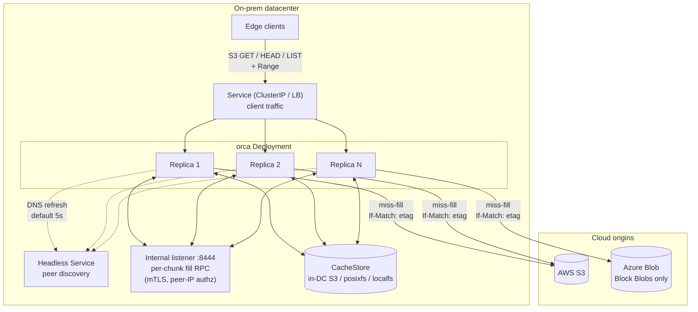

## 5. Chunk model

- `ChunkKey = {origin_id, bucket, object_key, etag, chunk_size, chunk_index}`.
  - `origin_id` is a deployment-scoped identifier from config (e.g.
    `aws-us-east-1-prod`, `azure-eastus-research`). Required. Namespaces
    cache key derivation and the on-store path so two deployments can
    safely share a CacheStore bucket.
  - `etag` captures immutability. A new ETag is treated as a new logical
    object and gets a fresh set of chunks. Old chunks age out via the
    CacheStore's lifecycle policy.
  - `chunk_size` is part of the key so a runtime config change does not
    silently corrupt or shadow existing data.
- `chunk_index = floor(byte / chunk_size)`.
- An object metadata cache holds `{origin_id, bucket, key} -> {size, etag,
  content_type, last_validated, last_status}` with a small TTL. Avoids
  re-`HEAD`ing origin on every request.

The CacheStore's namespace **is** the chunk index. `ChunkKey`
deterministically produces a path. Cache key derivation uses canonical
length-prefixed encoding to remove ambiguity from separators that may
appear in any field:

```
LP(s)   = LE64(uint64(len(s))) || s
hashKey = sha256(
            LP(origin_id) ||
            LP(bucket)    ||
            LP(key)       ||
            LP(etag)      ||
            LE64(chunk_size)
          )
path    = "<origin_id>/<hex(hashKey)>/<chunk_index>"
```

`origin_id` appears in the path in the clear (and `chunk_size` is folded
into the hash, not the path) so operators can run per-origin lifecycle
policies and target a specific deployment with `aws s3 rm --recursive
<bucket>/<origin_id>/`.

The `cachestore/posixfs` driver inserts a 2-character hex fan-out
between `<origin_id>` and `<hex(hashKey)>` to keep directory sizes
manageable on multi-PB working sets; that variant and its
`cachestore.posixfs.fanout_chars` knob are specified in
[s10.1.2](#1012-cachestoreposixfs). The `s3` and `localfs` drivers use
the unmodified path above.

**Operational note: changing `chunk_size`.** Because `chunk_size` is a
field of `ChunkKey` and is folded into the path hash, changing it in
deployment config never corrupts or shadows existing chunks; old-sized
chunks remain valid byte ranges of the old logical layout but are no
longer addressable. Operators should plan for transient storage
doubling and a cold-period origin-cost spike when changing
`chunk_size` on a hot working set: the working set is rebuilt at the
new size on demand while the old set ages out via the CacheStore
lifecycle policy (or, on `posixfs`, the operator's external sweep -
see [s13](#13-eviction-and-capacity)).

Whether a chunk is present is answered by `CacheStore.Stat(key)`. An
in-memory `ChunkCatalog` LRU memoizes recent positive lookups so the hot
path never touches the CacheStore for metadata. The catalog is purely a
hot-path optimization; it can be dropped at any time without affecting
correctness.

For a request `Range: bytes=A-B`:

```
firstChunk = A / chunk_size
lastChunk  = B / chunk_size
for cid := firstChunk; cid <= lastChunk; cid++ {  // streaming iterator
    fetchOrServe(cid)                              // + sliding prefetch window
    sliceWithin(cid, max(A, cid*sz), min(B, (cid+1)*sz - 1))
}
```

The chunk loop is a **streaming iterator**: at no point is the full
`[]ChunkKey` for the range materialized into a slice. Prefetch operates on
a sliding window of `min(prefetch_depth, lastChunk - cid)` ahead of the
current cursor. A configurable `server.max_response_bytes` cap returns
`416 Requested Range Not Satisfiable` (with header
`x-orca-cap-exceeded: true`) before any cache lookup if the
computed response size exceeds the cap.

### Diagram 2: Range request -> chunk index mapping

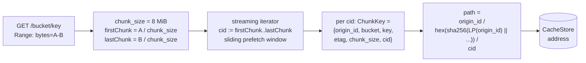

## 6. Request flow

1. `GET /{bucket}/{key}` arrives with optional `Range`.
2. Auth middleware (bearer / mTLS) validates the caller.
3. `fetch.Coordinator` looks up object metadata in the metadata cache. On
   miss, **per-replica** singleflight at the metadata layer issues at most
   one `HEAD` per object per replica per metadata-cache window. Cluster-wide
   bound is therefore N HEADs per object per window worst case where N is
   the current peer-set size; this is acceptable in v1 (a cluster-wide HEAD
   singleflight is a deferred optimization; see [s15.2](#152-cluster-wide-head-singleflight)).
   Two TTLs apply, asymmetric by design (s12):
   **positive entries** (`200` + ETag) are reused for `metadata_ttl`
   (default 5m), which also bounds the staleness window if the
   immutable-origin contract (s11) is violated. **Negative entries**
   (`404`, unsupported-blob-type) are reused for `negative_metadata_ttl`
   (default 60s), which bounds the create-after-404 unavailability window
   after an operator uploads a previously-missing key.
4. If the request has `Range`, validate against `ObjectInfo.Size`; serve
   `416` if unsatisfiable. Compute `firstChunk` and `lastChunk`. If
   `server.max_response_bytes > 0` and the computed response size exceeds
   it, return `400 RequestSizeExceedsLimit` (S3-style XML error body)
   with `x-orca-cap-exceeded: true`. `416` is reserved for true
   Range-vs-object-size violations.
5. Iterate the chunk range as a streaming iterator. For each `ChunkKey`:
   - **ChunkCatalog hit:** open reader from `CacheStore`. Typed
     `CacheStore` errors (s7) are honored: only `ErrNotFound` triggers a
     refill; `ErrTransient` surfaces as `503 Slow Down` with `Retry-After`,
     `ErrAuth` surfaces as `502 Bad Gateway` and counts toward the
     `/readyz` `ErrAuth` threshold (default 3 consecutive -> NotReady).
   - **ChunkCatalog miss:** call `CacheStore.Stat(key)`. If present,
     record in the catalog and serve from the CacheStore. If absent, take
     the miss-fill path (s8), which routes to the coordinator for that
     specific chunk via local singleflight or per-chunk internal RPC.
6. **Cold path: stream directly with pre-header retry**. On a chunk
   miss, the leader issues `Origin.GetRange` with bounded retry
   (s8.6) **before** any HTTP response header is sent to the client.
   Transient origin failures (5xx, network errors) on retryable
   attempts are invisible to the client: the leader retries up to
   `origin.retry.attempts` (default 3) with exponential backoff
   capped by `origin.retry.max_total_duration` (default 5s). The
   commit boundary is the **first byte arrival from origin**: once
   the leader has received any byte, response headers
   (`Content-Length`, `Content-Range`, `ETag`,
   `Accept-Ranges: bytes`) are sent immediately and the leader
   begins streaming bytes to the client as they arrive from origin.
   The leader simultaneously tees bytes into the local Spool (s8.2)
   for joiner support and for the asynchronous CacheStore commit.
   `Content-Length` and `Content-Range` are computable from
   `ObjectInfo.Size` and the chunk math, so headers can be sent
   before the body completes. Pre-commit failures
   (`OriginETagChangedError`, retry budget exhausted, internal RPC
   failure, semaphore timeout) return a clean HTTP error before
   any byte is sent (typically `502 Bad Gateway` or `503 Slow
   Down`). The CacheStore commit happens asynchronously after the
   client response completes, using whichever atomic primitive the
   configured driver advertises (`PutObject + If-None-Match: *` for
   `s3`; `link()` / `EEXIST` for `localfs` and `posixfs`). The
   assembler is driver-agnostic: it calls `CacheStore.PutChunk` and
   treats the typed error the same way regardless of backing store.
   Commit-after-serve failure does NOT affect the in-flight client
   response; it increments
   `orca_commit_after_serve_total{result="failed"}` and the
   chunk is **not** recorded in the `ChunkCatalog` (the next
   request will refill).
7. **Mid-stream failure**: once any body byte has been written
   (i.e., after the commit boundary), no HTTP error status is
   possible. Mid-stream failures (origin disconnect after first
   byte, or any post-commit error) abort the response (HTTP/2
   `RST_STREAM` with `INTERNAL_ERROR`; HTTP/1.1 `Connection: close`
   after the partial write) and increment
   `orca_responses_aborted_total{phase="mid_stream",reason}`.
   S3 clients (aws-sdk, boto3, etc.) detect this via
   `Content-Length` mismatch and retry. Mid-stream origin resume
   (re-issue origin GET with `Range: bytes=<offset>-` and continue
   feeding the client transparently) is deferred future work
   ([s15.4](#154-mid-stream-origin-resume)).
8. If sequential prefetch is enabled, the iterator schedules asynchronous
   fills for the next N chunks (capped per blob and globally) one chunk
   ahead of the cursor.

### Diagram 3: Scenario A - warm read (cache hit)

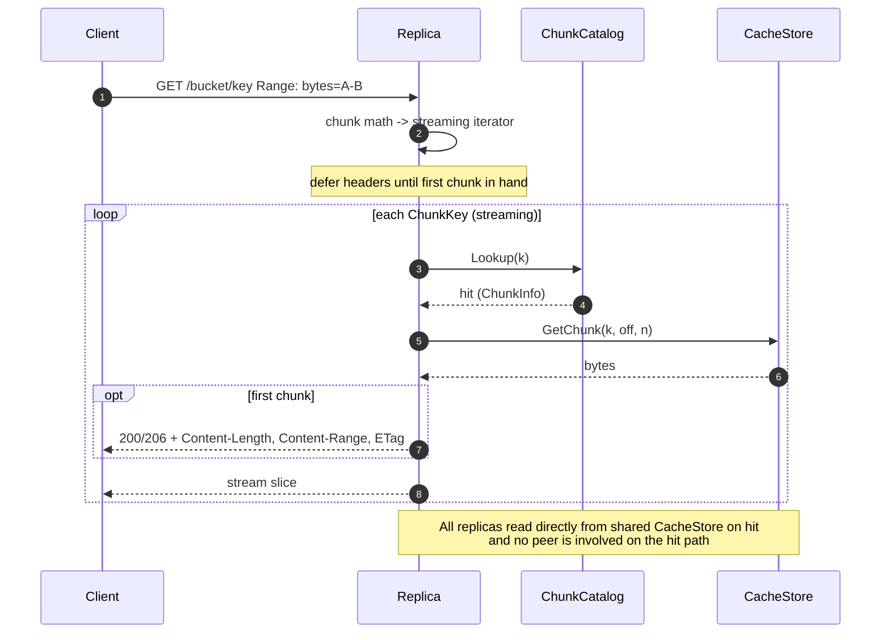

### Diagram 4: Scenario B - cold miss, local coordinator

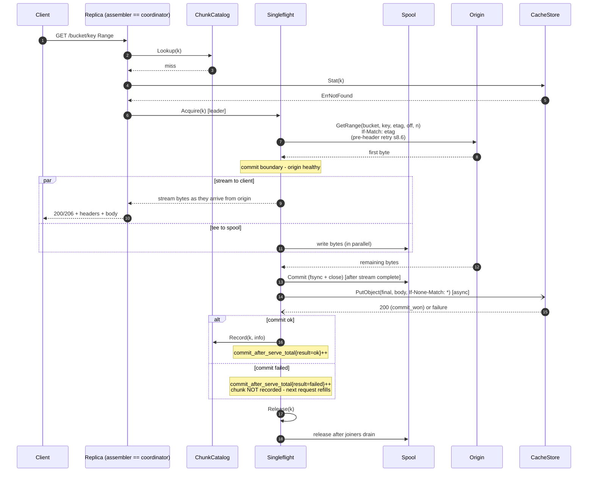

### 6.1 HEAD request flow

`HEAD /{bucket}/{key}` is served entirely from object metadata; no
chunk lookup is performed.

1. Auth as for GET.
2. `fetch.Coordinator` looks up `ObjectInfo` in the metadata cache.
   On miss, the metadata-layer singleflight (s8.7) issues at most one
   `Origin.Head` per object per replica per `metadata_ttl` window.
3. On success, return `200 OK` with `Content-Length:
   ObjectInfo.Size`, `ETag: "ObjectInfo.ETag"`, `Content-Type:
   ObjectInfo.ContentType`, `Accept-Ranges: bytes`. No
   `CacheStore.Stat` and no `CacheStore.GetChunk` calls.
4. Negative cases reuse the GET error mapping (s6.3): `404` is
   negatively cached for `negative_metadata_ttl` (s12); an unsupported azureblob
   blob type (s9) returns `502 OriginUnsupported` with the
   `x-orca-reject-reason` header.

HEAD does NOT validate `If-Match` / `If-None-Match` / `If-Modified-Since`
preconditions against the cache state in v1; conditional HEAD is a
read-only client-side concern that operates on the returned `ETag`.

### 6.2 LIST request flow

`GET /{bucket}/?list-type=2&prefix=...` (S3 ListObjectsV2). v1 LIST
serves from a per-replica **LIST cache** (s6.2 introduces it; FW3)
in front of the existing per-replica LIST singleflight. The cache
is sized and tuned for the FUSE-`ls` workload pattern: thousands of
edge clients implementing FUSE filesystems perform interactive
`ls` and directory navigation against the S3 API, generating
prefix-clustered LIST traffic where the same query is repeated
many times within a short window. Per-replica caching is naturally
effective for FUSE clients because they typically pin to one
replica via HTTP/2 keepalive.

**Cache key**: the full LIST query tuple
`(origin_id, bucket, prefix, continuation_token, start_after,
delimiter, max_keys)`. Pagination tokens are part of the key, so
sequential page-through caches each page independently and does
not collide.

**TTL**: governed by `list_cache.ttl` (default 60s, configurable
typical range 5s - 30m). The 60s default trades freshness vs.
origin load: a freshly-uploaded key is invisible to LIST clients
for up to 60s. Acceptable for the immutable-artifact workload;
operators with write-and-immediately-list patterns should tune
shorter.

**Eviction**: bounded LRU on `list_cache.max_entries` (default
1024). Memory math: 1024 entries times ~10 KB typical (1000-key
listing) = ~10 MB worst case.

**Response-size cap**: very large LIST responses
(>`list_cache.max_response_bytes`, default 1 MiB) bypass the cache
entirely; the response is served to the client but not stored.

**Steps**:

0. **Cache lookup**. Compute the cache key from the request
   parameters. On hit, serve the cached `ListResult` directly with
   header `x-orca-list-cache-age: <seconds>`. No origin
   call. No singleflight acquisition. `list_cache_hit_total{origin_id,
   result="hit"}++`.

1. Auth as for GET.

2. On cache miss, the request parameters `(prefix, continuation-token
   / start-after, max-keys, delimiter)` are forwarded verbatim to
   `Origin.List`. The continuation token returned to the client is
   the origin's token passed through unchanged. There is no token
   rewriting.

3. **Per-replica LIST singleflight** keyed on the same cache-key
   tuple collapses concurrent identical LIST calls on the same
   replica during the cache miss. There is no cluster-wide LIST
   singleflight in v1; cluster-wide bound is up to `N` `Origin.List`
   calls per identical query per `list_cache.ttl` window where `N`
   is peer-set size. Acceptable at v1 scale; a cluster-wide LIST
   coordinator is a deferred optimization
   ([s15.3](#153-cluster-wide-list-coordinator)).

4. **azureblob origin**: when `cachestore.azureblob.list_mode = filter`
   (the default), non-BlockBlob entries are stripped while
   continuation tokens are preserved (s9). `passthrough` mode
   disables filtering and returns the entire listing including
   unsupported blob types.

5. **Cache populate** on successful `Origin.List`. If the serialized
   `ListResult` exceeds `list_cache.max_response_bytes`, skip the
   populate (serve the response normally) and increment
   `list_cache_evict_total{reason="response_too_large"}`. Otherwise
   store with TTL = `list_cache.ttl`. Negative responses (errors)
   are NOT cached; errors fall through every time. Empty-result
   listings ARE cached (an authoritative "this prefix has no keys"
   for the TTL window).

6. LIST does NOT populate the metadata cache for individual entries.
   A subsequent GET / HEAD on a listed key still triggers an
   `Origin.Head` (subject to its own singleflight and TTL).
   Rationale: eager metadata population on large listings would
   balloon the metadata cache, and the FUSE workload typically
   reads only a fraction of listed entries.

7. Origin failures during LIST surface as `502 Bad Gateway`
   (`ErrTransient` upstream) or the corresponding S3 error code;
   LIST does NOT trip the CacheStore circuit breaker because it
   never touches the CacheStore.

**Stale-while-revalidate** is opt-in via
`list_cache.swr_enabled: false` default. When enabled with
`list_cache.swr_threshold_ratio: 0.5` (default), an entry whose
age exceeds half of `list_cache.ttl` is served immediately AND
triggers a background `Origin.List` to refresh; the user-observed
latency stays at cache-hit speed even at TTL boundaries. Adds
small extra origin load (one refresh per entry per TTL window).
Useful for heavy interactive FUSE deployments where `ls` latency
spikes at TTL expiry are user-visible.

**Toggle**: `list_cache.enabled: true` default. Set `false` to
disable the cache layer for diagnostics; LIST falls through to the
existing pass-through behavior with per-replica singleflight only.

### 6.3 HTTP error-code mapping

The complete catalog of HTTP statuses the cache layer can return on
the **client edge**. Internal-listener (`:8444`, s8.8) statuses are
listed inline in s8.3 and are not reproduced here.

| Status | S3-style code | Reason | Triggered by | Client retry? |
|---|---|---|---|---|
| `200 OK` / `206 Partial Content` | (none) | normal hit or successful fill | hit + range OK; cold-path fill after pre-header-retry commit (s8.6) | n/a |
| `400 RequestSizeExceedsLimit` | `RequestSizeExceedsLimit` | response would exceed `server.max_response_bytes` | range math at request entry; `x-orca-cap-exceeded: true` | no (different range) |
| `416 Requested Range Not Satisfiable` | `InvalidRange` | range vs. `ObjectInfo.Size` violation | range math at request entry | no (different range) |
| `502 Bad Gateway` | `OriginUnreachable` | origin error before commit boundary | `Origin.GetRange` 5xx; origin DNS failure; semaphore exhausted past wait | yes, small backoff |
| `502 Bad Gateway` | `OriginRetryExhausted` | leader retry budget exhausted (`origin.retry.attempts` or `origin.retry.max_total_duration`) before any byte from origin (s8.6) | sustained transient origin failures during pre-header retry | yes (origin may recover) |
| `502 Bad Gateway` | `OriginETagChanged` | `OriginETagChangedError` from `Origin.GetRange` (s8.6) | mid-flight overwrite caught by `If-Match`; non-retryable | yes (next request re-Heads) |
| `502 Bad Gateway` | `OriginUnsupported` | non-BlockBlob azureblob (s9) | `Origin.Head` returns unsupported blob type | no |
| `502 Bad Gateway` | `BackendUnavailable` | CacheStore `ErrAuth` | CacheStore credentials rejected | no (operator) |
| `503 Slow Down` | `SlowDown` | CacheStore `ErrTransient` | CacheStore 5xx / timeout / throttle | yes |
| `503 Slow Down` | `SlowDown` | spool full | `spool.max_inflight` exhausted past wait | yes |
| `503 Slow Down` | `SlowDown` | breaker open | per-process CacheStore breaker open (s10.2) | yes |
| `503 Service Unavailable` | (probe) | replica NotReady | `/readyz` failing predicates (s10.5) | n/a (LB drain) |
| (mid-stream abort) | n/a | post-commit-boundary failure | origin disconnect after first byte sent to client; CacheStore commit failure does NOT cause this (commit is post-response) | client SDK detects via `Content-Length` mismatch and retries; mid-stream resume deferred (s15.4) |

`Retry-After: 1s` is set on every `503 Slow Down`. Pre-first-byte
errors carry an S3-style XML body (`<Error><Code>...<Message>...`).
Mid-stream aborts terminate the response (`HTTP/2 RST_STREAM(INTERNAL_ERROR)`
or `HTTP/1.1 Connection: close`) and increment
`orca_responses_aborted_total{phase="mid_stream",reason}`.

## 7. Internal interfaces

The mechanism's named seams. Implementations live under
`internal/orca/`.

```go
// Origin: read-only view of upstream blob store. GetRange takes the etag
// from the prior Head and uses it as an If-Match precondition; mid-flight
// overwrite returns OriginETagChangedError.
type Origin interface {
    Head(ctx context.Context, bucket, key string) (ObjectInfo, error)
    GetRange(ctx context.Context, bucket, key, etag string, off, n int64) (io.ReadCloser, error)
    List(ctx context.Context, bucket, prefix, marker string, max int) (ListResult, error)
}

// OriginETagChangedError is returned by Origin.GetRange when the origin
// rejects the If-Match precondition. The fill is refused and the metadata
// cache entry for {origin_id, bucket, key} is invalidated; the next
// request re-Heads and gets a fresh ChunkKey.etag.
type OriginETagChangedError struct {
    Bucket, Key string
    Want, Got   string // Want = ETag we expected; Got = current ETag if known
}

// CacheStore: where chunk bytes physically live in the DC. Treated as the
// source of truth for chunk presence; backed by an in-DC S3-like service
// in production and a local directory in dev. PutChunk is atomic and
// no-clobber; the second concurrent PutChunk for the same key returns a
// CommitLost error. Read/Stat methods return typed errors:
//   - ErrNotFound:  chunk is absent. ONLY this error triggers a refill.
//   - ErrTransient: backend hiccup (5xx, timeout, throttle). Surfaced as
//                   503 Slow Down + Retry-After. Counts toward the
//                   per-process circuit breaker (see s10.2).
//   - ErrAuth:      backend rejected credentials (401/403). Surfaced as
//                   502 BadGateway. Counts toward the breaker AND toward
//                   the /readyz consecutive-ErrAuth threshold (default 3
//                   -> NotReady).
//
// Delete removes a chunk; used by active eviction (s13.2). Idempotent;
// ErrNotFound on a missing chunk is treated as success by the eviction
// loop. Delete errors count toward the same circuit breaker as Get / Put.
type CacheStore interface {
    GetChunk(ctx context.Context, k ChunkKey, off, n int64) (io.ReadCloser, error)
    PutChunk(ctx context.Context, k ChunkKey, size int64, r io.Reader) error // atomic, no-clobber
    Stat(ctx context.Context, k ChunkKey) (ChunkInfo, error)
    Delete(ctx context.Context, k ChunkKey) error // s13.2 active eviction
    SelfTestAtomicCommit(ctx context.Context) error // startup probe
}

// CacheStore typed errors. Wrap with %w so callers use errors.Is.
var (
    ErrNotFound  = errors.New("cachestore: not found")
    ErrTransient = errors.New("cachestore: transient")
    ErrAuth      = errors.New("cachestore: auth")
)

// ChunkCatalog: in-memory, best-effort record of chunks known to be
// present in the CacheStore. Purely a hot-path optimization; the
// ChunkCatalog: in-memory, best-effort record of chunks known to be
// present in the CacheStore. Purely a hot-path optimization; the
// CacheStore is the source of truth. A Lookup miss falls through to
// CacheStore.Stat; the result is Recorded for subsequent requests.
//
// Lookup has a side effect: it increments the matched entry's
// AccessCount and updates LastAccessed (s10.2). These access counters
// are consumed by the optional active eviction loop (s13.2). Side
// effects are atomic; Lookup remains safe for concurrent callers.
//
// Forget is invoked when an entry is known to be invalid:
//   - on OriginETagChangedError, the assembler Forgets the now-stale
//     ChunkKey (its etag has been superseded);
//   - on a CacheStore.GetChunk returning ErrNotFound for a key that
//     was previously Recorded (lifecycle eviction caught the entry);
//   - by the active eviction loop (s13.2) after a successful
//     CacheStore.Delete.
// In v1 there are no other callers.
type ChunkCatalog interface {
    Lookup(k ChunkKey) (ChunkInfo, bool)
    Record(k ChunkKey, info ChunkInfo)
    Forget(k ChunkKey)
}

// Cluster: peer discovery + rendezvous hashing. Returns the coordinator
// peer for a given ChunkKey. self == coordinator means handle locally.
// InternalDial returns a transport (HTTP/2 over mTLS) for issuing
// internal RPCs to a non-self peer. ServerName returns the stable SAN
// (default "orca.<ns>.svc") used for TLS verification across
// rolling restarts and pod-IP churn; per-replica internal-listener certs
// MUST include this SAN.
type Cluster interface {
    Coordinator(k ChunkKey) Peer  // returns self or remote Peer
    Self() Peer
    Peers() []Peer                // current membership snapshot
    InternalDial(ctx context.Context, p Peer) (InternalClient, error)
    ServerName() string           // e.g. "orca.<ns>.svc"
}

// Spool: bounded local-disk staging area for in-flight fills. Every fill
// writes through the spool so slow joiners can fall back from the leader's
// ring buffer to a local disk reader regardless of CacheStore driver.
type Spool interface {
    Begin(k ChunkKey, size int64) (SpoolWriter, error)
    Reader(k ChunkKey, off int64) (io.ReadCloser, error)
    Release(k ChunkKey) // drop spool entry once all in-flight readers are done
}

type SpoolWriter interface {
    io.Writer
    Commit() error // fsync + close
    Abort() error  // discard
}

// ---------------------------------------------------------------------
// Supporting types referenced by the interfaces above.
// ---------------------------------------------------------------------

// ObjectInfo: result of a successful Origin.Head and the metadata-cache
// entry shape. LastValidated and LastStatus are advisory and used for
// negative-cache TTL accounting (s8.6).
type ObjectInfo struct {
    Size          int64
    ETag          string
    ContentType   string
    LastValidated time.Time
    LastStatus    int // last HTTP status seen from the origin
}

// ChunkInfo: result of a successful CacheStore.Stat or
// ChunkCatalog.Lookup. Size is the on-store byte length, which equals
// chunk_size for all chunks except the last chunk of an object (which
// is partial; see s10.3).
//
// AccessCount, LastAccessed, and LastEntered are set by the
// ChunkCatalog as access-frequency tracking for the optional active
// eviction loop (s13.2). They are zero-valued on freshly-Recorded
// entries and are atomically updated by Lookup.
type ChunkInfo struct {
    Size         int64
    Committed    time.Time
    AccessCount  uint32    // s13.2; saturates at MaxUint32
    LastAccessed time.Time // s13.2; updated on Lookup hit
    LastEntered  time.Time // s13.2; set on Record; never updated
}

// ListResult: paginated result from Origin.List.
type ListResult struct {
    Entries     []ObjectEntry
    NextMarker  string
    IsTruncated bool
}

// ObjectEntry: one item in a ListResult. BlobType is azureblob-specific
// and lets the cache filter non-BlockBlob entries while preserving
// continuation tokens (s9).
type ObjectEntry struct {
    Key      string
    Size     int64
    ETag     string
    BlobType string // "" for s3 origin; "BlockBlob" / "PageBlob" / "AppendBlob" for azureblob
}

// Peer: a single replica in the current peer-set snapshot returned by
// Cluster.Peers / Cluster.Coordinator / Cluster.Self.
type Peer struct {
    IP   string // pod IP from the headless Service A-record
    Self bool   // true iff this is the current process
}

// InternalClient: HTTP/2 over mTLS client to a peer's internal listener.
// Returned by Cluster.InternalDial. v1 exposes the per-chunk fill RPC
// only.
type InternalClient interface {
    Fill(ctx context.Context, k ChunkKey) (io.ReadCloser, error)
}

// MetadataCacheEntry: per-entry shape of the metadata cache (s8.7,
// s11.2). Access tracking is set unconditionally on Lookup hit but
// only consumed by the optional bounded-freshness mode (s11.2).
type MetadataCacheEntry struct {
    ObjectInfo
    AccessCount  uint32    // s11.2; saturates at MaxUint32
    LastAccessed time.Time // s11.2; updated on Lookup hit
    LastEntered  time.Time // s11.2; set on Record; never updated
}
```

Implementations:

- `Origin`: `origin/s3`, `origin/azureblob` (Block Blob only). Both pass
  the caller's `etag` as `If-Match` on the underlying GET; both translate
  the backend's "precondition failed" status into `OriginETagChangedError`.
- `CacheStore`: `cachestore/localfs` (dev), `cachestore/s3` (in-DC
  S3-compatible object store, e.g. VAST), `cachestore/posixfs` (shared
  POSIX FS: NFSv4.1+ baseline, plus Weka native, CephFS, Lustre, GPFS).
  See [s10.1](#101-atomic-commit-per-cachestore-driver) for atomic-commit
  specifics per driver. The two POSIX-shaped drivers (`localfs` and
  `posixfs`) share their commit primitives (`link()` no-clobber, dir
  fsync, staging-dir layout, optional fan-out) via
  `internal/orca/cachestore/internal/posixcommon/`; this is an
  internal-to-cachestore package and is not visible to the rest of the
  cache layer.
- `ChunkCatalog`: a single in-memory LRU implementation with
  optional access-frequency tracking driving the active eviction
  loop (s13.2). Bounded by `chunk_catalog.max_entries`.
- `Cluster`: a single implementation that polls the headless Service
  (default 5s), computes rendezvous hashes against pod IPs, and exposes
  an mTLS HTTP/2 client for the internal listener.
- `Spool`: a single implementation backed by a configured local directory
  (`spool.dir`) with a capacity cap (`spool.max_bytes`) and an in-flight
  cap (`spool.max_inflight`).

## 8. Stampede protection

The single most important hot-path correctness issue. Layered defense.

### 8.1 Per-`ChunkKey` singleflight

Process-local map `inflight: map[ChunkKey]*Fill`, guarded by a mutex. Each
`*Fill` has a `done` channel, an error slot, the resulting `ChunkInfo`, a
bounded ring buffer, a `Spool` handle (s8.2), and a refcount. Acquire
path: under the lock, either return the existing entry as a joiner or
insert a new entry and become the leader. Release path: leader removes
the entry from the map after signalling, so any thread arriving while the
entry is mapped joins; any thread arriving after removal records the
chunk in the `ChunkCatalog` (which the leader populated before releasing)
and serves a normal hit.

### 8.2 TTFB tee + spool

In v1 the leader streams origin bytes directly to the requesting
client (after pre-header retry confirms a healthy origin
connection, s8.6) AND simultaneously tees the bytes into two
side channels for joiner support and the asynchronous CacheStore
commit:

1. **Ring buffer** (in-memory, bounded 1-2 MiB by default). Joiners
   obtain a `Reader` over this buffer that replays buffered bytes
   and blocks on a condition variable for more. Delivers low TTFB
   for on-pace joiners.
2. **Spool** (local disk file via the `Spool` interface). The
   leader writes every byte to a local spool file in parallel
   with the client write and the CacheStore upload. A slow joiner
   that falls behind the ring buffer head transparently switches
   to a `Spool.Reader(k, off)`. The spool exists because the
   production `cachestore/s3` driver streams directly into
   `PutObject` and does not produce a readable on-disk tmp file -
   without the spool, slow joiners on the s3 path would have no
   local fallback. The spool unifies joiner-fallback behavior
   across `localfs`, `s3`, and `posixfs` drivers.

**The spool is NOT on the client TTFB path in v1.** Cold-path
client TTFB is bounded by origin first-byte latency plus a small
amount of pre-header retry overhead (s8.6). The leader does NOT
wait for the chunk to be fully written or fsynced into the spool
before sending bytes to the client. The spool is a parallel
side-channel for joiner support and CacheStore commit; the client
write is independent of and in parallel with the spool write.

**Spool locality is required (with a documented override).** The
Spool MUST live on a local block device by default. At boot, the
cache layer runs `statfs(2)` against `spool.dir` and refuses to
start (exit non-zero) if the filesystem magic matches a network FS
denylist (NFS, SMB / CIFS, CephFS, Lustre, GPFS, FUSE including
Alluxio FUSE), incrementing
`orca_spool_locality_check_total{result="refused"}`.
Governed by `spool.require_local_fs` (default `true`). The
rationale is now defense-in-depth: with the v1 streaming design
the spool no longer gates client TTFB, but joiner-fallback latency
still benefits materially from local NVMe (a remote-FS spool would
convert microsecond-class read-from-spool to milliseconds-class
network-round-trip on every joiner switchover). Operators with
unusual placements (e.g., large RAM-disk) MAY relax the contract
via `spool.require_local_fs: false`; production deployments are
expected to keep the default. See
[s10.4](#104-spool-locality-contract) for the full check.

**CacheStore commit timing.** After the leader has streamed the
full chunk to the client (and the spool has finished receiving),
the leader performs the CacheStore commit asynchronously
(`PutObject + If-None-Match: *` for `s3`; `link()` for `localfs`
and `posixfs`). Success increments
`commit_after_serve_total{result="ok"}`; failure increments
`commit_after_serve_total{result="failed"}` AND skips
`ChunkCatalog.Record` so the next request refills. The client
response is unaffected either way - by this point the client has
already received the full chunk.

Capacity: `spool.max_bytes` caps total spool footprint (default 8
GiB); `spool.max_inflight` caps concurrent fills using the spool.
When the spool is full, new fills wait briefly on the
`spool.max_inflight` semaphore; on timeout they return `503 Slow
Down` to the client.

After the leader's CacheStore commit succeeds, the spool entry is
retained briefly so any in-flight joiner can finish reading; once
joiner refcount hits zero the spool entry is released. On commit-
after-serve failure the spool entry is released the same way; the
cache layer simply does not record the chunk and the next request
refills.

### Diagram 5: Scenario C - concurrent miss, same-replica joiner

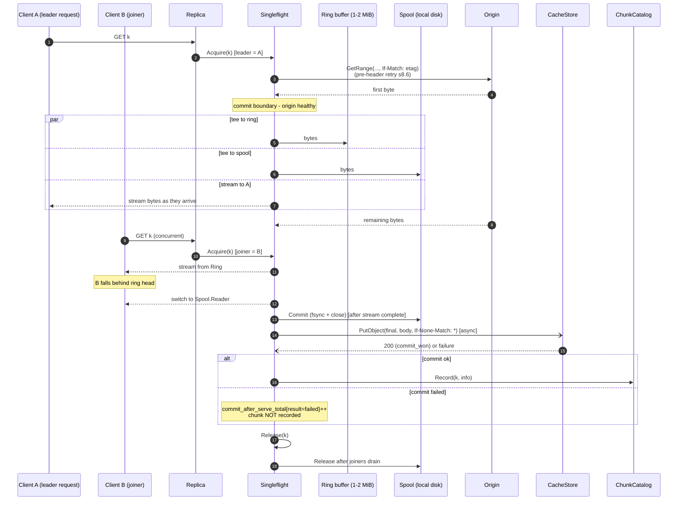

### 8.3 Cluster-wide deduplication via per-chunk fill RPC

Rendezvous hashing on `ChunkKey` against the current pod-IP set selects
**one coordinator per chunk**. A range request can span N chunks; those
chunks may have N distinct coordinators. The replica that receives the
client request is therefore the **assembler**, not a forwarder of the
whole HTTP request. For each `ChunkKey k` in the requested range:

- **Hit** (Catalog or `Stat` says present): assembler reads from
  `CacheStore` directly. No internal RPC.
- **Miss + `Coordinator(k) == self`**: assembler runs the local
  singleflight + tee + spool + commit path (s8.1, s8.2, s10).
- **Miss + `Coordinator(k) != self`**: assembler issues
  `GET /internal/fill?key=<encoded ChunkKey>` to the coordinator on the
  coordinator's internal listener (s8.8). The coordinator runs the
  singleflight + tee + spool + commit path locally and streams the chunk
  bytes back. The assembler stitches the returned bytes into the client
  response, slicing the first and last chunk to match the client's `Range`.

**Loop prevention**: the assembler sets `X-Origincache-Internal: 1` on
internal RPCs. A receiver seeing this header MUST self-check:
`Cluster.Coordinator(k) == Cluster.Self()`. On disagreement (membership
flux), the receiver returns `409 Conflict` with body
`{"reason":"not_coordinator"}`; the assembler falls back to local fill
for that chunk (one duplicate fill possible during flux; observable via
the duplicate-fills metric below). Receivers MUST NOT chain forward
internal RPCs.

Combined with s8.1, exactly one origin GET per cold chunk per cluster in
steady state. During membership change we accept up to one duplicate fill
per chunk (loser drops on commit collision; observable via
`orca_origin_duplicate_fills_total{result="commit_lost"}`). The
duplicate-fill metric is the leading indicator that this routing is
working: a sustained non-zero `commit_lost` rate signals chronic
membership flux or a bug in the hash distribution.

### Diagram 6: Scenario D - cold miss, remote coordinator

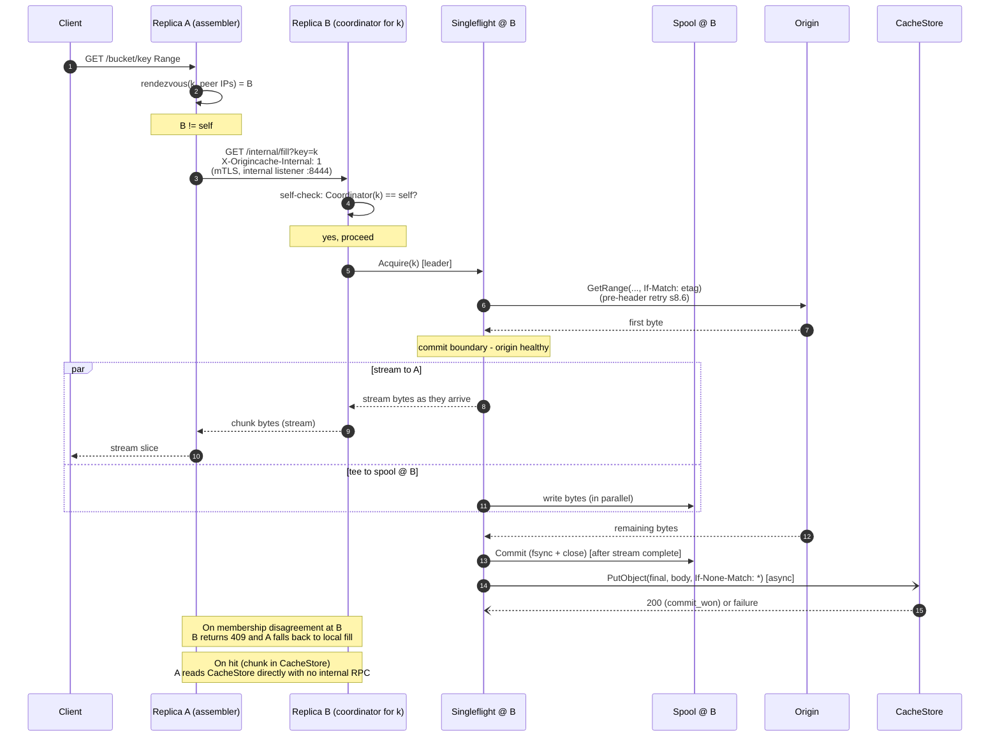

### Diagram 7: Scenario E - range spanning multiple coordinators

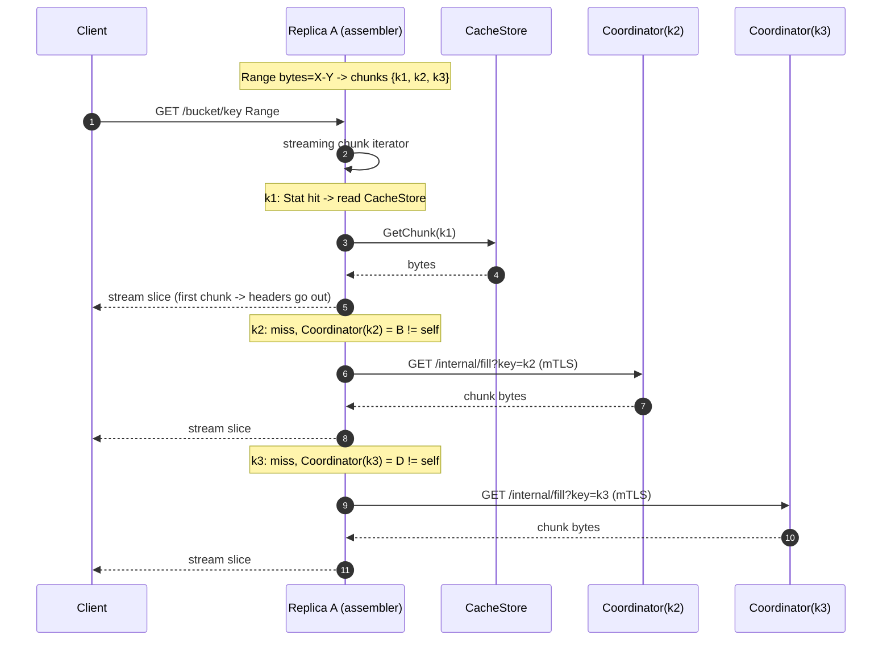

### 8.4 Origin backpressure

Each replica enforces a **per-replica token bucket** that caps
concurrent `Origin.GetRange` calls. The bucket is sized to a
conservative per-replica fraction of the desired cluster-wide
concurrency:

```
target_per_replica = floor(target_global / N_typical)
```

where `N_typical` is the expected replica count in steady state
(`cluster.target_replicas`, default 3). Defaults: `target_global=192`,
giving `target_per_replica=64`.

This is approximate. Realized cluster-wide concurrency depends on
the actual replica count `N_actual`:

- `N_actual == N_typical`: realized cap is `target_global` exactly.
- `N_actual > N_typical` (scaled out without updating
  `cluster.target_replicas`): realized cap exceeds `target_global`
  by up to `(N_actual - N_typical) * target_per_replica`.
- `N_actual < N_typical` (scaled in): realized cap falls below
  `target_global` by `(N_typical - N_actual) * target_per_replica`.

Operators MUST update `cluster.target_replicas` after any sustained
scale change. Dynamic recompute of the cap from `len(Cluster.Peers())`
is a deferred optimization; see
[s15.6](#156-dynamic-per-replica-origin-cap).

Origin throttling responses (HTTP 503 SlowDown, 429, retryable
5xx) are handled by the leader's pre-header retry loop (s8.6 /
Option D), which provides exponential backoff transparent to the
client. If the retry budget exhausts, the leader returns
`502 OriginRetryExhausted`. The system self-regulates without
cluster-wide coordination: an over-loaded origin slows individual
fills via backoff; the per-replica cap bounds inflight per pod;
the singleflight (s8.1) collapses concurrent identical fills.

When the bucket is saturated, leaders queue with bounded wait
(`origin.queue_timeout`, default 5s); on timeout, the request
returns `503 Slow Down` to the client so clients back off.
Joiners on existing fills do not consume slots.

The current saturation is exposed as
`orca_origin_inflight{origin}` (per-replica gauge).
Operators can sum across replicas in their monitoring stack to
observe approach to `target_global`.

A real coordinated cluster-wide limiter (Kubernetes-Lease-elected
authority + slot-lease tokens + RPC-based slot acquisition +
graceful fallback) is a deferred optimization; see
[s15.5](#155-coordinated-cluster-wide-origin-limiter) for the
full design, trigger conditions, and v1 bound. Build only when
measured deployment scale (>10 replicas with steady-state slot
under-utilization) justifies the additional surface area.

Optional token bucket on origin bytes/sec layered on top of the
slot-based concurrency cap.

### 8.5 Cancellation safety

`Fill.run()` uses an internal long-lived context, not any single client's
context. The fill outlives any single requester. If every joiner cancels
we still finish the fill (cheap insurance; configurable to abort). A
joiner cancelling unblocks only itself.

### 8.6 Failure handling without re-stampede

- **Retryable error**: short-lived negative entry in the singleflight map
  (cooldown 100 ms - 1 s) so concurrent joiners share the failure rather
  than each retrying immediately.
- **`OriginETagChangedError`**: leader (a) invalidates the metadata cache
  entry for `{origin_id, bucket, key}`, (b) fails the in-flight fill, (c)
  joiners receive the same error and abort their responses (or, if
  pre-commit, get a `502 Bad Gateway`). The next request triggers a
  fresh `Head` and a new `ChunkKey` with the new ETag. Old chunks under
  the old ETag age out via the CacheStore lifecycle. Increments
  `orca_origin_etag_changed_total`.
- **Hard 404 / unsupported blob type**: cached in the metadata cache as
  a negative entry for `negative_metadata_ttl` (default 60s,
  configurable). Per-replica HEAD singleflight (s8.7) caps origin HEAD
  load at one HEAD per object per replica per window. The full
  negative-cache lifecycle and the create-after-404 case (an operator
  uploads `K` after a client has already observed `404` on `K`) are in
  [s12](#12-create-after-404-and-negative-cache-lifecycle).
- **Pre-header origin retry (the v1 cold-path retry mechanism)**:
  the leader retries `Origin.GetRange` on transient errors **before**
  any HTTP response header is sent to the client, making transient
  origin failures invisible to the client. The retry budget is
  bounded by both attempt count and total wall-clock duration:
  - `origin.retry.attempts` (default 3): max attempts.
  - `origin.retry.backoff_initial` (default 100ms),
    `origin.retry.backoff_max` (default 2s): exponential backoff
    cap per attempt.
  - `origin.retry.max_total_duration` (default 5s): absolute
    wall-clock cap; if exceeded the leader returns `502 Bad Gateway`
    even before all attempts complete.

  The **commit boundary** is the first byte arrival from origin:
  once received, the leader sends headers + first byte, then
  streams. Pre-commit failures return clean HTTP errors (`502
  Bad Gateway` with code `OriginUnreachable` or
  `OriginRetryExhausted`); post-commit failures become mid-stream
  client aborts (s6 step 7). `OriginETagChangedError` is
  non-retryable (the object identity changed; refilling under the
  old ETag is the bug we are preventing); the leader returns
  `502 OriginETagChanged` immediately. Joiners sit through retries
  on the same `Fill`. Outcomes are exposed as
  `orca_origin_retry_total{result="success|exhausted_attempts|exhausted_duration|etag_changed"}`
  (one increment per request that entered the retry loop) and
  `orca_origin_retry_attempts` (histogram of attempt count
  per request).

  The retry budget defaults are intentionally smaller than typical
  S3 SDK read timeouts (aws-sdk-go: 30s; boto3: 60s) so retries
  complete before clients time out.
- **`CommitFailedAfterServe`**: the CacheStore commit happens
  asynchronously after the client response is complete (s8.2). A
  failure here is NOT visible to the client. The leader increments
  `orca_commit_after_serve_total{result="failed"}` and
  does NOT call `ChunkCatalog.Record`. Joiners on the same fill
  that are still draining the Spool finish normally; the next
  request for the same `ChunkKey` re-runs the fill (one extra
  origin GET worst case). Sustained non-zero `failed` rate is a
  CacheStore-health alert, not a per-request error path.
- **Typed `CacheStore` errors during read**: `ErrNotFound` triggers the
  miss-fill path; `ErrTransient` surfaces as `503 Slow Down` with
  `Retry-After: 1s`; `ErrAuth` surfaces as `502 Bad Gateway`. Sustained
  `ErrTransient` / `ErrAuth` trips the per-process **CacheStore circuit
  breaker** (s10.2). Sustained `ErrAuth` (default 3 consecutive) flips
  `/readyz` to NotReady so load balancers drain the replica.

### 8.7 Metadata-layer singleflight

Same pattern at the metadata cache:
`metaInflight: map[ObjectKey]*MetaFill`. Without this, a flood of
distinct cold keys shifts the storm from chunk GETs to chunk HEADs.
Stale-while-revalidate behavior: serve stale within a small margin while
one background refresh runs. The singleflight is **per-replica**: a
cluster-wide cold-fan-out can cause up to N HEADs per object per
`metadata_ttl` window where N is the current peer-set size. This is
acceptable in v1; a cluster-wide HEAD singleflight is a deferred
optimization (see [s15.2](#152-cluster-wide-head-singleflight)).

**LIST cache singleflight (FW3, s6.2).** A parallel per-replica
singleflight collapses concurrent identical `Origin.List` calls
keyed on the full LIST query tuple. Sits in front of the LIST
cache; reused on cache miss. Cluster-wide bound is up to N origin
LIST per identical query per `list_cache.ttl`; a cluster-wide LIST
coordinator is a deferred optimization (s15.3).

**Bounded-freshness mode interaction (FW5, s11.2).** When
`metadata_refresh.enabled: true`, background refresh workers are
gated by the same per-replica HEAD singleflight: if both an
on-demand miss-fill and a background refresh fire for the same
object key concurrently, they share one `Origin.Head` and both
consumers receive the result. New entries Recorded on a miss-fill
start with `AccessCount=0` and `LastEntered=now`; the cold-start
protection (`min_age`) prevents these from being immediately
eligible for refresh.

### 8.8 Internal RPC listener

Per-chunk fill RPCs (`GET /internal/fill?key=<encoded ChunkKey>`) are
served on a separate listener bound to a distinct port (default `:8444`,
config `cluster.internal_listen`). This isolates inter-replica traffic
from the client edge.

- **Transport**: HTTP/2 over mTLS.
- **Server cert**: per-replica cert (e.g. cert-manager-issued) chained to
  a configured **internal CA** (`cluster.internal_tls.ca_file`). The
  internal CA is **distinct** from the client mTLS CA so a leaked client
  cert cannot be used to dial the internal listener. The cert MUST
  include the stable SAN `cluster.internal_tls.server_name` (default
  `orca.<ns>.svc`); pod-IP SANs are NOT used because pod IPs
  change on rolling restart.
- **Client auth**: peer presents a client cert chained to the internal CA
  AND the peer's source IP must be in the current peer-IP set
  (`Cluster.Peers()`). The IP-set check guards against a leaked internal
  cert being usable from outside the Deployment.
- **TLS verification**: the dialer pins `tls.Config.ServerName` to the
  value returned by `Cluster.ServerName()` (the same stable SAN above)
  rather than to the destination pod IP. This keeps verification
  consistent across rolling restarts and pod-IP churn.
- **Authorization scope**: the internal listener serves `GET
  /internal/fill?key=<encoded ChunkKey>` only - the per-chunk
  fill RPC (s8.3). No client identity is propagated from the
  assembler because chunk content is identity-independent: any
  authorized client at the assembler is entitled to the chunk
  bytes, and the coordinator is doing the same fill it would do
  for a local request.
- **NetworkPolicy**: ingress on `:8444` allowed only from pods with
  label `app=orca` in the same namespace.
- **Loop prevention**: receiver enforces `X-Origincache-Internal: 1` ->
  self must be coordinator for the requested `ChunkKey`, else
  `409 Conflict`.

Metrics: `orca_cluster_internal_fill_requests_total{direction=
"sent|received|conflict"}`,
`orca_cluster_internal_fill_duration_seconds`.

## 9. Azure adapter: Block Blob only

Hardened constraint.

- Enforced in `internal/orca/origin/azureblob.Head`. Block type is
  immutable on an existing blob (you have to delete and recreate to change
  it, which produces a new ETag), so checking once per `(container, blob,
  etag)` is sufficient.
- Detection via `Get Blob Properties` -> `BlobType` field. Reject anything
  other than `BlockBlob` with a typed error `UnsupportedBlobTypeError`
  exported from `internal/orca/origin`.
- Surfaced to clients as HTTP `502 Bad Gateway` with S3 error code
  `OriginUnsupported`, body containing reason, plus
  `x-orca-reject-reason: azure-blob-type=<type>` header.
- Negatively cached in the metadata cache for `negative_metadata_ttl`
  (default 60s; see [s12](#12-create-after-404-and-negative-cache-lifecycle))
  and
  singleflighted at the metadata layer to prevent re-probing.
- `ListObjectsV2` defaults to `filter` mode: non-Block Blob entries are
  skipped while preserving continuation tokens. `passthrough` mode is
  available for debugging.
- Config schema reserves `enforce_block_blob_only: true`. Setting it to
  false is rejected at startup.
- `Origin.GetRange` on the azureblob adapter uses `If-Match: <etag>` on
  the underlying Get Blob; `412 Precondition Failed` is translated to
  `OriginETagChangedError` (s8.6).
- Prometheus counter:
  `orca_origin_rejected_total{origin="azureblob",reason="non_block_blob",blob_type=...}`.

### Diagram 8: Scenario F - Azure non-BlockBlob rejection

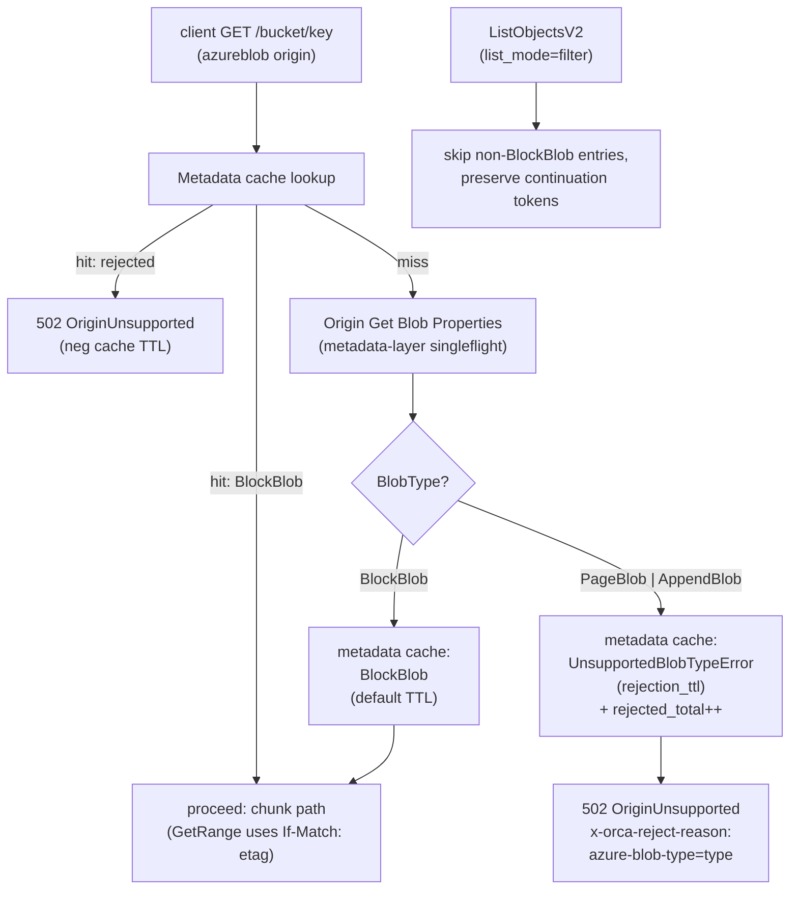

## 10. Concurrency, durability, correctness

### 10.1 Atomic commit (per CacheStore driver)

The leader publishes a chunk to the CacheStore atomically and
no-clobber: the second concurrent commit for the same key MUST lose
without overwriting the winner. Cold-path commit happens
asynchronously **after** the client response is complete (s8.2 / s6
step 6), so a commit failure here does NOT affect the
in-flight client response; it only increments
`orca_commit_after_serve_total{result="failed"}` and skips
`ChunkCatalog.Record` (next request refills).

Three drivers ship in v1, mapped onto two equivalent atomic-commit
primitives. `localfs` and `posixfs` both use POSIX `link()` (or
`renameat2(RENAME_NOREPLACE)` on Linux) returning `EEXIST` to the
loser, and share their helpers via
`internal/orca/cachestore/internal/posixcommon/`. `s3` uses
`PutObject + If-None-Match: *` returning `412` to the loser. All three
drivers run `SelfTestAtomicCommit` at boot.

Commit outcomes are recorded as label values on the metric
`orca_origin_duplicate_fills_total{result="commit_won|commit_lost"}`
(s8.3). Throughout this section "increment commit_won" / "increment
commit_lost" is shorthand for "increment that counter with the
matching label value".

#### 10.1.1 cachestore/localfs

1. Leader stages the chunk inside `<root>/.staging/<uuid>` (a fixed
   subdirectory of the CacheStore root, NOT `/tmp` and NOT the spool
   directory). Staging inside the root keeps the file on the same
   filesystem as the destination, which is required for `link()` to
   succeed; the spool MAY be on a different filesystem and so cannot
   also serve as the staging area.
2. After write, `fsync(<staging file>)` then `fsync(<staging dir>)`.
3. Commit: `link(<root>/.staging/<uuid>, <final>)`. POSIX `link()` is
   atomic and returns `EEXIST` if the destination exists. On `EEXIST`,
   the leader treats the existing `<final>` as the source of truth,
   `unlink(<root>/.staging/<uuid>)`, `fsync(<root>/.staging/)`, and
   increments commit_lost. On success, `unlink(<root>/.staging/<uuid>)`,
   `fsync(<root>/.staging/)`, `fsync(<final parent dir>)`, and
   increment commit_won.
4. On Linux, `renameat2(RENAME_NOREPLACE)` is preferred when available
   (single syscall) with the same parent-dir fsync sequencing; the
   `link` + `unlink` form is the portable fallback (also works on
   macOS dev environments). Plain `rename()` is **never** used because
   it overwrites the destination on POSIX.
5. Crash recovery: a periodic background sweep (default every 1 hour)
   unlinks `<root>/.staging/<uuid>` entries older than
   `cachestore.localfs.staging_max_age` (default 1h), with a
   `fsync(<root>/.staging/)` after the batch. Nothing breaks if a
   staging file lingers briefly. Each sweep increments
   `orca_localfs_dir_fsync_total{result}`.

#### 10.1.2 cachestore/posixfs

`posixfs` runs the same `link()` no-clobber primitive as `localfs`, but
against a shared POSIX-style filesystem mounted on every replica at the
same mount point and the same `<root>`. All replicas race the same
`link()` syscall against the same destination inode; the kernel (NFS
server, Weka, CephFS MDS, Lustre MDS, GPFS, etc.) is the arbiter, and
exactly one wins.

1. Backend selection and detection. At boot the driver inspects the
   filesystem under `<root>` via `statfs(2)` (`f_type`) and
   `/proc/mounts` and emits an info gauge
   `orca_posixfs_backend{type,version,major,minor}` (e.g.
   `type="nfs",version="4.1"`, `type="wekafs"`, `type="ceph"`,
   `type="lustre"`, `type="gpfs"`). Operators MAY override the detected
   `type` via `cachestore.posixfs.backend_type` for backends with
   ambiguous magic numbers; the override is logged loudly. Detected
   `type="fuse"` triggers an extra check: if `/proc/mounts` source
   matches `alluxio` (case-insensitive), the driver increments
   `orca_posixfs_alluxio_refusal_total` and exits non-zero with
   `cachestore/posixfs: Alluxio FUSE is unsupported (no link(2), no
   atomic no-overwrite rename, no NFS gateway); use cachestore.driver:
   s3 against the Alluxio S3 gateway instead`.
2. NFS minimum version. If `type="nfs"`, the driver reads the
   negotiated NFS version from `/proc/mounts` (the `vers=` option). If
   the version is below `cachestore.posixfs.nfs.minimum_version`
   (default `4.1`), the driver refuses to start. NFSv3 is opt-in only
   via `cachestore.posixfs.nfs.allow_v3: true`, which logs a loud
   warning and increments
   `orca_posixfs_nfs_v3_optin_total`. Rationale: NFSv3 has weak
   retransmit semantics; NFSv4.0 has atomic CREATE EXCLUSIVE but no
   session idempotency; NFSv4.1+ provides session-based idempotency
   that makes `link()` / `EEXIST` safe under client retries.
3. Path layout adds a 2-character hex fan-out to keep directory sizes
   manageable on multi-PB working sets:
   `<root>/<origin_id>/<hash[0:2]>/<hash>/<chunk_index>` where `hash`
   is the existing s5 hex hash. Fan-out width is governed by
   `cachestore.posixfs.fanout_chars` (default `2`, 0 disables). The
   `localfs` driver does NOT add fan-out by default (small dev working
   sets), but the `posixcommon` helper supports it on both drivers.
4. Stage + commit + recovery: identical to `localfs` (steps 1-5 above)
   with the fan-out parent dirs created lazily and `fsync`ed on first
   use, and `cachestore.posixfs.staging_max_age` (default 1h) governing
   the sweep.
5. **Startup self-test** (`SelfTestAtomicCommit`): on driver init the
   `posixfs` driver creates a staging file, links it to a probe final,
   then attempts a second `link()` to the same probe final and asserts
   `EEXIST`. It then writes a known-size payload to the linked file via
   a separate handle and asserts the size is observable to a re-`stat`
   after `fsync(<final parent dir>)`. If `EEXIST` is not returned (the
   second `link()` succeeds, or returns a different error), or if the
   size verification fails, the driver exits non-zero with
   `cachestore/posixfs: backend does not honor link()/EEXIST or
   directory fsync; refusing to start`. Governed by
   `cachestore.posixfs.require_atomic_link_self_test` (default `true`;
   never disabled in production). On success, the driver records
   `orca_posixfs_selftest_last_success_timestamp`.
6. NFS export hardening. `posixfs` documents (and the operator runbook
   enforces) that NFS exports MUST use `sync` (not `async`); an `async`
   export weakens the dir-fsync guarantee that the commit primitive
   depends on. The driver cannot detect server-side `async` directly;
   the runbook is the contract, and the boot self-test catches the most
   common misconfigurations by re-`stat`ing through the negotiated
   client cache.

#### 10.1.3 cachestore/s3

1. Leader streams origin bytes (via the Spool, s8.2) into a single
   `PutObject(final_key, body, If-None-Match: "*")`. There is no tmp
   key and no copy hop.
2. `200 OK` -> commit_won. `412 Precondition Failed` -> commit_lost
   (treat the existing object as the source of truth; no cleanup
   needed because no tmp object was created).
3. **Startup self-test** (`SelfTestAtomicCommit`): on driver init the
   `cachestore/s3` driver writes a probe key, then attempts a second
   `PutObject(probe_key, ..., If-None-Match: "*")` and asserts a
   `412` response. If the backend returns `200` instead (silently
   overwrites), the driver fails to start with `cachestore/s3:
   backend does not honor If-None-Match: *; refusing to start`. This
   prevents silent double-writes on backends that don't implement the
   precondition. Verified backends as of v1: AWS S3 (since 2024-08),
   MinIO, VAST Cluster (**non-versioned buckets only**). VAST
   documents that `If-None-Match: *` is honored on `PutObject` and
   `CompleteMultipartUpload` against unversioned buckets but is NOT
   supported on versioned buckets ([VAST KB: S3 Conditional
   Writes][vast-kb-conditional-writes], 2026-01-26).
4. **Startup versioning gate**: to prevent silent atomic-commit
   failures the driver also issues `GetBucketVersioning(bucket)` at
   boot. If the response indicates `Status: Enabled` OR
   `Status: Suspended` (suspended also disables `If-None-Match`-
   based atomic writes on AWS S3), the driver exits non-zero with
   `cachestore/s3: bucket <name> has versioning enabled or
   suspended; If-None-Match: * is not honored on versioned buckets
   and the atomic-commit primitive cannot guarantee no-clobber.
   Disable bucket versioning to use cachestore/s3.` Governed by
   `cachestore.s3.require_unversioned_bucket` (default `true`;
   never disabled in production). The gate emits
   `orca_s3_versioning_check_total{result="ok|refused"}` once
   per boot.

[vast-kb-conditional-writes]: https://kb.vastdata.com/documentation/docs/s3-conditional-writes

### 10.2 Catalog correctness, typed errors, circuit breaker

The CacheStore is the source of truth. The `ChunkCatalog` is purely an
optimization and may be dropped at any time without affecting correctness;
a `Lookup` miss falls through to `CacheStore.Stat` and refills the
catalog. Catalog entries that point at a now-absent chunk (e.g. evicted
by lifecycle) result in a `CacheStore.GetChunk` returning `ErrNotFound`,
which is the only error treated as a miss and refilled.

`CacheStore` returns three typed error classes (s7); the cache layer
honors them distinctly:

- **`ErrNotFound`** (chunk absent): triggers the miss-fill path. Normal
  cold-path behavior; not an error from the operator's perspective.
- **`ErrTransient`** (5xx, timeout, throttle): surfaced to the client as
  `503 Slow Down` with `Retry-After: 1s`. Counts toward the breaker.
  Does NOT trigger refill (would amplify load against an already-degraded
  backend).
- **`ErrAuth`** (401/403): surfaced as `502 Bad Gateway`. Counts toward
  the breaker. Counts toward the `/readyz` consecutive-`ErrAuth`
  threshold (default 3); on threshold the replica reports NotReady and
  load balancers drain it. A single non-`ErrAuth` success resets the
  counter.

To prevent amplifying degradation under sustained backend failure, a
**per-process CacheStore circuit breaker** wraps every `CacheStore`
call. Defaults (configurable):

- `error_window: 30s`
- `error_threshold: 10` (`ErrTransient` + `ErrAuth` count; `ErrNotFound`
  does not)
- `open_duration: 30s`
- `half_open_probes: 3`

State machine: **closed** (normal pass-through) -> **open** (immediately
short-circuits CacheStore writes with `ErrTransient`; reads still attempt
once per `open_duration / 10` for liveness probing) -> **half-open**
(allows up to `half_open_probes` test calls; on all-success returns to
closed; on any failure returns to open). Transitions are exposed as
`orca_cachestore_breaker_transitions_total{from,to}` and the
current state as `orca_cachestore_breaker_state` (0=closed,
1=open, 2=half_open).

**Access-frequency tracking on `Lookup`.** Per FW8 (s13.2), each
`ChunkCatalog.Lookup` hit has a side effect: it increments the
matched entry's `AccessCount` and updates `LastAccessed`. This data
is consumed by the optional active-eviction loop (s13.2). The side
effect is correctness-irrelevant: catalog `Lookup` continues to be
safe to call from any goroutine; access counters are stored
atomically. New entries Recorded by `ChunkCatalog.Record` start with
`AccessCount=0` and `LastEntered=now`.

**`CacheStore.Delete` breaker integration.** Active eviction
(s13.2) calls `CacheStore.Delete` in the background. `Delete`
errors count toward the same breaker as `Get` / `Put` errors:
sustained `ErrTransient` or `ErrAuth` from `Delete` opens the
breaker, which short-circuits subsequent writes (including the
eviction loop's deletes). The eviction loop checks breaker state
at run start and skips entirely if the breaker is open
(`active_eviction_runs_total{result="breaker_open"}++`). This
prevents the eviction loop from amplifying load against a
degraded backend.

### 10.3 Range, sizes, and edge cases

- Partial last chunk of a blob stored at its actual size; `ChunkInfo.Size`
  records it; range math respects it.
- `416 Requested Range Not Satisfiable` is returned by the server before
  any cache lookup, using object metadata, **only** for true Range vs.
  object-size violations.
- `server.max_response_bytes` overflow returns
  `400 RequestSizeExceedsLimit` (S3-style XML error body) with
  `x-orca-cap-exceeded: true` (s6). It is reported as `400` and
  not `416` because the cap is a server policy, not a property of the
  object: clients cannot fix it by re-requesting a different Range past
  EOF.
- Origin failure during fill never commits the staging file or makes a
  final PutObject. Pre-commit (before first byte from origin): the
  pre-header retry loop (s8.6) handles transient cases; if the retry
  budget exhausts, the leader returns `502 Bad Gateway` to the client
  and records a transient negative singleflight entry. Post-commit
  (after first byte sent to client): the response aborts mid-stream
  (s6 step 7); any CacheStore commit failure is invisible to the
  client and recorded as `commit_after_serve_total{result="failed"}`
  (s8.6). Mid-stream origin resume is deferred future work
  (s15.4).

### Diagram 9: Atomic commit (localfs vs posixfs vs s3 CacheStore)

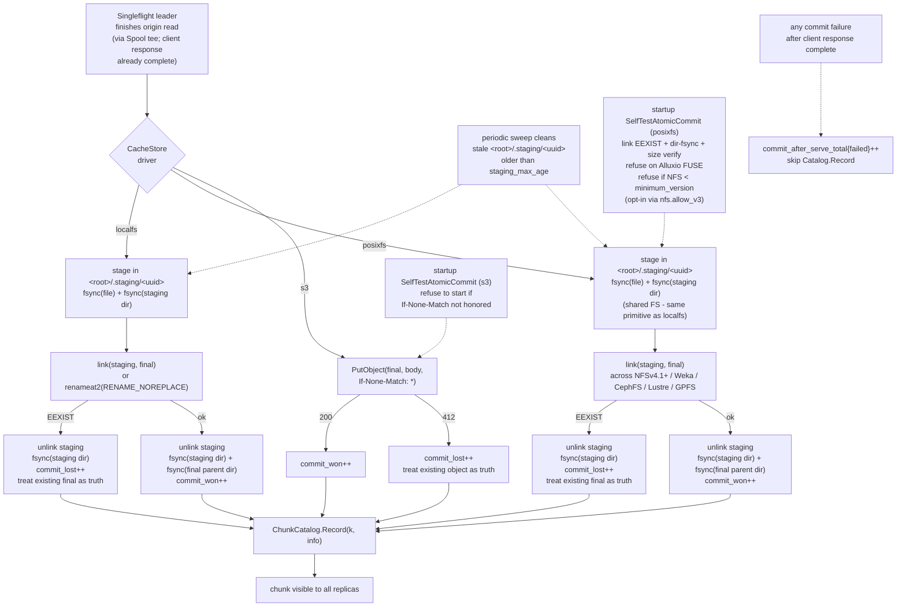

### 10.4 Spool locality contract

The local Spool (s8.2) is no longer on the cold-path client-TTFB
path in v1: bytes stream origin -> client directly (s6 step 6 /
s8.6 pre-header retry). The spool is a parallel side-channel that
serves joiner-fallback reads and feeds the asynchronous CacheStore
commit.

Even so, the spool benefits materially from a local block device.
A joiner that falls behind the in-memory ring buffer head
transparently switches to a `Spool.Reader(k, off)`. Local NVMe
serves these reads in microsecond-class latency; a network
filesystem (NFS, CephFS, Lustre, GPFS, FUSE) instead pays a
network round-trip on every read, which is tens of milliseconds
at best and seconds during congestion. That converts smooth
joiner-fallback into multi-second TTFB stalls for slow joiners.
Network-FS spools also weaken the durability semantics that the
asynchronous CacheStore commit relies on.

To prevent foot-gun deployments, the cache layer enforces a
**boot-time locality check** before any client traffic is
accepted, governed by `spool.require_local_fs` (default `true`):

1. Resolve `spool.dir` to an absolute path; resolve symlinks.
2. Call `statfs(2)` on the resolved path. Read `f_type`.
3. Compare `f_type` against a denylist (these magic numbers indicate a
   network or virtual FS that violates the locality contract):
   - `NFS_SUPER_MAGIC` (`0x6969`) - any NFS version, including
     NFSv4.1+.
   - `SMB2_MAGIC_NUMBER` (`0xfe534d42`), `CIFS_MAGIC_NUMBER`
     (`0xff534d42`) - SMB / CIFS.
   - `CEPH_SUPER_MAGIC` (`0x00c36400`) - CephFS kernel client.
   - `LUSTRE_SUPER_MAGIC` (`0x0bd00bd0`) - Lustre.
   - `GPFS_SUPER_MAGIC` (`0x47504653`) - IBM Spectrum Scale.
   - `FUSE_SUPER_MAGIC` (`0x65735546`) - any FUSE mount, including
     Alluxio FUSE.
4. On match: increment
   `orca_spool_locality_check_total{result="refused",fs_type="<name>"}`,
   log `spool: <spool.dir> is on a network filesystem (<name>);
   joiner-fallback latency would be unbounded. Refusing to start.
   Set spool.dir to a local-NVMe-backed path or, for unusual
   placements (e.g., RAM-disk), set spool.require_local_fs=false`,
   and exit non-zero.
5. On no match: increment
   `orca_spool_locality_check_total{result="ok",fs_type="<name>"}`
   and proceed.

**Relaxation**. `spool.require_local_fs: false` allows operators
with unusual placements (RAM-disk, tmpfs, exotic local FS not on
the denylist) to bypass the check. The override is supported but
not recommended for production: with the v1 streaming design the
spool no longer gates client TTFB, but joiner-fallback latency
still benefits materially from local block storage. The metric
label `result="bypassed"` distinguishes overridden runs from
clean ones, and the boot log carries a loud `WARN
spool.require_local_fs is disabled; joiner-fallback latency is
best-effort` line.

The check is in `internal/orca/fetch/spool/` and runs from
`cmd/orca/orca/main.go` before the HTTP listener binds.
It runs before any CacheStore self-test so a misconfigured spool
fails fast even on backends that would otherwise pass their own
self-test.

### 10.5 Readiness probe (`/readyz`)

The HTTP `/readyz` endpoint reports whether the replica should
receive client traffic. It is checked by the Kubernetes readiness
probe and by front-of-cluster load balancers. Distinct from
`/livez`, which is a process-liveness check only.

**Response shape.**

- `200 OK`, body `{"ready": true}`, when **all** of the following
  predicates hold:
  1. boot self-tests have passed (`SelfTestAtomicCommit` for the
     configured CacheStore driver; spool locality check, s10.4);
  2. the per-process CacheStore circuit breaker (s10.2) is `closed`
     or `half_open`;
  3. consecutive `ErrAuth` count from the CacheStore is below
     `readyz.errauth_consecutive_threshold` (default 3);
  4. peer discovery (s14) has completed at least one successful DNS
     refresh since boot (the empty-peer fallback in s14 keeps the
     replica functional, but `/readyz` still requires one
     successful refresh so a totally broken DNS path does not stay
     silently masked);
  5. the local Spool has free capacity below `spool.max_bytes`.

- `503 Service Unavailable`, body
  `{"ready": false, "reasons": ["..."]}`, when any predicate above
  fails. The `reasons` array names the failing predicates by stable
  string keys (`selftest_pending`, `selftest_failed`,
  `breaker_open`, `errauth_threshold`, `peer_discovery_pending`,
  `spool_full`) so operators can triage from a probe response
  alone.

**NotReady -> Ready transitions.** The endpoint is stateless apart
from reading the underlying components. Predicates clear themselves
as the system recovers:

- breaker `open` -> `closed` after `half_open_probes` successful
  probes (s10.2);
- `ErrAuth` consecutive counter resets on any non-`ErrAuth` success;
- spool fullness clears as in-flight fills drain;
- peer discovery flips to "completed" on the first successful
  refresh and stays sticky for the lifetime of the process.

**`/livez`.** A liveness-only check that returns `200 OK` if the
process is running and the HTTP listener is bound; it does NOT
consider any of the predicates above and is intentionally trivial.
This separation lets the readiness probe drain a misconfigured
replica without restarting it (so operators can inspect logs).

`/readyz` and `/livez` are bound to the same client listener as the
S3 API; they are NOT served on the internal listener (`:8444`,
s8.8) because the internal listener's authorization scope is
restricted to the `/internal/fill` per-chunk fill RPC.

## 11. Bounded staleness contract

Orca trusts an **operator contract** for correctness, and bounds
the consequences of contract violation by configuration.

### 11.1 The contract and the staleness window

**The contract.** For a given `(origin_id, bucket, object_key)`, the
underlying bytes are immutable for the life of the key. If the data
changes, operators MUST publish it under a new key. Replacement in place
is a contract violation.

**Why we trust it.** Cache key derivation includes the origin `ETag`
(s5), and a new ETag deterministically yields a new `ChunkKey` and a
fresh chunk path on the CacheStore. As long as the contract holds, the
cache cannot serve stale bytes: every change of identity is a change of
key.

**What happens if the contract is violated.** The cache may serve the
old bytes for up to one **`metadata_ttl`** window (default 5m,
configurable). Mechanism:

- Object metadata (`size`, `etag`, `content_type`) is cached for
  `metadata_ttl` to avoid re-`HEAD`ing on every request.
- During that window, requests resolve to the old `etag`, derive the
  same `ChunkKey`, and serve from cached chunks.
- After the window expires, the next request triggers a fresh `Head`,
  observes the new ETag, derives a new `ChunkKey`, and refills.

**Why this is acceptable for v1.** The intended workload is large
immutable artifacts (job inputs, model weights, training shards). The
contract matches how those are produced. The 5m window is a tunable
upper bound, not a typical case: a flood of distinct cold keys reads the
correct ETag on first contact with the cache.

**Defense in depth.** `If-Match: <etag>` is sent on every
`Origin.GetRange` (s8.6). If an in-flight fill races with an in-place
overwrite, the origin returns `412 Precondition Failed` and the leader
fails the fill, invalidates the metadata cache entry for
`{origin_id, bucket, key}`, and increments
`orca_origin_etag_changed_total`. This catches the narrow window
where a violation happens between the cache's `Head` and its `GetRange`.
It does NOT catch a violation that happens between two complete
request lifecycles within the same `metadata_ttl` window; the
`metadata_ttl` cap is what bounds that case.

### 11.2 Bounded-freshness mode (optional)

The default v1 posture is "trust the contract, cap the window". Some
workloads benefit from shorter effective staleness windows on hot keys
(typically: deployments where contract violations are operationally
possible, or where TTL-boundary cold-miss latency on popular content
is unacceptable). For those workloads, FW5 adds an opt-in
**bounded-freshness mode** that proactively re-Heads hot keys ahead
of `metadata_ttl`.

**Opt-in via config**: `metadata_refresh.enabled: false` (default).
When `false`, no background activity; the cache behaves exactly as
described in s11.1.

**Hot-key tracking**. Bounded-freshness mode requires per-entry access
tracking on the metadata cache, parallel to the chunk-catalog access
tracking from FW8 (s13.2). Each `MetadataCacheEntry` gains:
- `AccessCount` (uint32, increments on Lookup hit)
- `LastAccessed` (updated on Lookup hit)
- `LastEntered` (set on Record; never updated)

This tracking is independent of the chunk-catalog tracking; metadata
hotness can diverge from chunk hotness (e.g., random-range reads
access many chunks of one object).

**Eligibility**. An entry is eligible for proactive refresh when ALL
of:
- `AccessCount >= access_threshold` (default 5; "hot" key)
- `now - LastEntered >= refresh_ahead_ratio * metadata_ttl` (default
  0.7 * 5m = 3.5m; approaching TTL)
- `now - LastEntered < metadata_ttl` (still valid)
- `now - LastEntered >= min_age` (default `metadata_ttl/4` = 75s;
  cold-start protection)
- no in-flight refresh for this key (per-replica HEAD singleflight,
  s8.7, gates this)

**Negative entries** (404, unsupported blob type) are NOT refreshed.
Refreshing them would generate HEAD load to confirm a known-missing
key; `negative_metadata_ttl` (default 60s, s12) handles the
create-after-404 recovery instead.

**Refresh loop**:

```
every metadata_refresh.interval:                          # default 1m
  candidates = []
  scan metadata cache:
    for each entry e:
      if eligible(e):
        candidates.append(e)
  sort candidates:
    primary: highest AccessCount first
    secondary: oldest LastEntered first
  refresh_count = min(len(candidates), max_refreshes_per_run)  # 100
  spawn refresh workers (concurrency: refresh_concurrency, default 8)
  for first refresh_count entries:
    result = Origin.Head(e.bucket, e.key)
    case result of:
      ok with same ETag:
        metadata_cache.RefreshTTL(e.key)              # extend TTL
        metric: metadata_refresh_total{result="ok"}++
      ok with new ETag:
        metadata_cache.Update(e.key, result)
        metric: metadata_refresh_total{result="etag_changed"}++
        metric: origin_etag_changed_total++           # existing metric
        # old chunks orphaned; lifecycle / active eviction (s13)
        # cleans up
      err:
        # don't extend TTL; entry expires naturally
        metric: metadata_refresh_total{result="error"}++
```

**Origin HEAD load bound**. Per-replica per cycle: at most
`max_refreshes_per_run` HEADs (default 100). Per minute (default
interval): 100 HEADs. At 3 replicas: 300 HEADs/min. Negligible
against documented S3 / Azure HEAD rate limits.

The refresh workers compete for the existing **origin limiter**
(s8.4) so they cannot starve on-demand fills. If the limiter is
saturated, refresh requests queue with bounded wait and skip past
timeout (`metric: metadata_refresh_total{result="skipped_limiter_busy"}`).

**Effective staleness window** with bounded-freshness enabled:
`refresh_ahead_ratio * metadata_ttl` for hot keys (default 3.5m).
Cold keys still bounded by full `metadata_ttl` (default 5m). Negative
entries bounded by `negative_metadata_ttl` (default 60s).

**Cluster-wide HEAD bound** with bounded-freshness enabled: each
replica refreshes its own metadata cache independently. With N
replicas and H hot keys, refresh load is up to N*H HEADs per refresh
cycle. The cluster-wide HEAD coordinator (deferred future work, see
s15.2) would naturally absorb this load if N grows large enough to
matter.

**Failure modes**:
- `Origin.Head` error during refresh: don't extend TTL; entry expires
  naturally at `metadata_ttl`; on-demand miss re-Heads. Log + metric.
- Origin limiter saturated: refresh worker times out; entry expires
  naturally.
- Loop hangs / crashes: metadata cache continues to age; entries
  expire at `metadata_ttl`. Detected via
  `metadata_refresh_runs_total` not advancing.
- Refresh detects ETag change: metadata updated; old chunks orphaned;
  active eviction (FW8 / s13.2) or CacheStore lifecycle handles
  cleanup.

**When to enable**:
- Workload has identifiable hot keys with sub-`metadata_ttl`
  staleness sensitivity.
- Operators want shorter effective windows on popular content.
- Origin can absorb the additional HEAD load (typically small for
  bounded hot-key sets).

**When to leave disabled (default)**:
- Strict immutable-contract workload where `metadata_ttl` staleness
  is acceptable.
- Origin HEAD rate is constrained.
- Hot-key set is unbounded (every key appears hot - refresh load
  matches request load, defeating the purpose).

Cross-references: [s2 Decisions / Consistency](#2-decisions),
[s8.6 Failure handling](#86-failure-handling-without-re-stampede),
[s8.7 Metadata-layer singleflight](#87-metadata-layer-singleflight),
[s10.2 Catalog correctness](#102-catalog-correctness-typed-errors-circuit-breaker),
[s12 Create-after-404 and negative-cache lifecycle](#12-create-after-404-and-negative-cache-lifecycle),
[s13.2 Active eviction](#132-active-eviction-opt-in-access-frequency).

## 12. Create-after-404 and negative-cache lifecycle

### 12.1 The scenario

A client GETs a key `K` before the operator has uploaded it to
origin. The cache observes `404` from `Origin.Head(K)`, records a
negative metadata-cache entry, and returns `404` to the client. The
operator then uploads `K`. Subsequent client requests still see
`404` until the negative entry expires - the "we forgot to upload
that" case.

This is operationally indistinguishable from a contract violation
(s11): from the client's perspective, the bytes for `K` changed
without the cache being told. Event-driven origin invalidation is
intentionally not in v1 scope (the immutable-origin contract makes
it unnecessary for the documented workload); the cache can only
bound how long it serves the stale `404`.

### 12.2 Two TTLs (positive vs negative)

The metadata cache uses two TTLs:

| TTL | Default | Bounds | Rationale |
|---|---|---|---|
| `metadata_ttl` | 5m | positive entry (`200` + ETag) reuse without re-Head | immutable-origin contract (s11); long TTL keeps HEAD load low |
| `negative_metadata_ttl` | 60s | negative entry (`404` / unsupported blob type) reuse without re-Head | operator "oops upload" recovery should be fast |

Asymmetric defaults reflect asymmetric operational reality:
positive-entry staleness only matters on contract violation;
negative-entry staleness matters every time an operator uploads a
previously-missing key, which is a normal operational event.

Per-replica HEAD singleflight (s8.7) caps the HEAD load that a short
negative TTL would otherwise create: a flood of distinct missing
keys generates at most one HEAD per object per replica per
`negative_metadata_ttl` window. At default settings (60s, 3
replicas) origin sees at most 3 HEADs per missing key per minute,
well under any S3 / Azure HEAD rate limit.

### 12.3 Worst-case unavailability window

After an operator uploads a previously-missing key:

- A replica that observed the original `404` keeps serving `404`
  for up to `negative_metadata_ttl` from its OWN observation time,
  regardless of when the upload happened. The TTL is
  observation-anchored, not upload-anchored, because the cache
  cannot know about the upload.
- A replica that did NOT observe the `404` will Head fresh on the
  first request after the upload and serve `200` immediately.
- Worst case across replicas: `negative_metadata_ttl` after the
  LATEST replica's observation of the old `404`. Under round-robin
  load balancing, clients can see alternating `404` / `200`
  responses during the drain window (Diagram 10).

There is no active invalidation in v1: neither event-driven
invalidation (origin-pushed) nor an admin-invalidation RPC is in
v1 scope. Operator workaround: wait `negative_metadata_ttl` after
upload before announcing the key.

### 12.4 Defense-in-depth and observability

`If-Match: <etag>` (s8.6) does NOT defend against this case: there
is no in-flight fill for a `404`'d key, so no precondition exists
to trip on. The TTL is the only bound.

Negative-cache metrics let operators observe drain progress after
an upload:

- `orca_metadata_negative_entries` (gauge) - current count
  of negative entries.
- `orca_metadata_negative_hit_total{origin_id}` (counter) -
  returns served from a negative entry. A spike after a known
  upload signals ongoing drain.
- `orca_metadata_negative_age_seconds{origin_id}`
  (histogram) - age of negative entries at hit time. Use
  upper-bound percentiles to size `negative_metadata_ttl`.

Cross-references: [s2 Decisions / Consistency](#2-decisions),
[s6 Request flow](#6-request-flow),
[s8.6 Failure handling](#86-failure-handling-without-re-stampede),
[s8.7 Metadata-layer singleflight](#87-metadata-layer-singleflight),
[s11 Bounded staleness contract](#11-bounded-staleness-contract).

### Diagram 10: Scenario G - create-after-404 timeline


## 13. Eviction and capacity

Two complementary mechanisms govern CacheStore footprint in v1:
**passive lifecycle eviction** (always on, driver-dependent) and
**optional active eviction** by the cache layer itself (opt-in,
access-frequency-driven). Operators choose one, the other, or both
depending on CacheStore driver and workload.

### 13.1 Passive eviction (lifecycle)

Eviction is delegated to the CacheStore's storage system in the
default v1 configuration. Recommended baseline is age-based
expiration on the chunk prefix with a TTL chosen to fit the
deployment's working set in the available capacity. Operators tune
the TTL based on `orca_origin_bytes_total` and capacity
utilization metrics exposed by the CacheStore. Because the
on-store path is namespaced by `origin_id` (s5), per-origin
lifecycle policies can be configured independently on the same
CacheStore bucket.

**`cachestore/s3` deployments**: AWS S3, MinIO, and VAST all
support bucket lifecycle policies for age-based expiration.
Configure the lifecycle directly on the bucket (or delegate to the
in-DC object store's tooling).

**`cachestore/posixfs` deployments**: shared POSIX filesystems
(NFSv4.1+, Weka native, CephFS, Lustre, GPFS) do not provide
native object-lifecycle policies. Two options for posixfs:
- **External sweep**: schedule an age-based sweep against
  `<root>/<origin_id>/` from cron or a Kubernetes `CronJob` (e.g.
  `find <root>/<origin_id> -type f -atime +<n> -delete`). The
  sweep runs out-of-band; `CacheStore.GetChunk` on a swept entry
  returns `ErrNotFound` and re-enters the miss-fill path.
  Operators SHOULD NOT sweep the staging subdirectory
  `<root>/.staging/` - that is managed by the driver's own
  background sweep (`cachestore.posixfs.staging_max_age`, default
  1h, s10.1.2).
- **Active eviction** (s13.2): enable the cache layer's
  access-frequency-driven eviction loop. This is the recommended
  posixfs path when external sweep tooling is impractical.

### 13.2 Active eviction (opt-in, access-frequency)

When `chunk_catalog.active_eviction.enabled: true` (default
`false`), each replica runs a background eviction loop that
deletes cold chunks from BOTH the in-memory `ChunkCatalog` AND
the CacheStore. The decision uses **access-frequency tracking**
recorded in the catalog on every `Lookup` hit.

**Per-entry tracking** added by FW8 to each `ChunkCatalogEntry`:

```go
type ChunkCatalogEntry struct {
    ChunkInfo
    AccessCount  uint32     // increments on each Lookup hit;
                            // saturates at MaxUint32 (practically
                            // unreachable)
    LastAccessed time.Time  // updated on each Lookup hit
    LastEntered  time.Time  // set on Record; never updated
}
```

**Eviction policy**: a chunk is eligible for active eviction when
ALL of:
- `now - LastAccessed > inactive_threshold` (default 24h)
- `AccessCount < access_threshold` (default 5)
- `now - LastEntered >= min_age` (default 5m, cold-start protection
  preventing newly-recorded entries from being evicted before they
  accumulate hits)

**Score** for ordering candidates (lowest first = most evictable):
- primary: `AccessCount`
- tiebreak: oldest `LastAccessed`

**Loop**: every `eviction_interval` (default 10m), scan the
catalog, identify eligible candidates, sort by score, evict up to
`max_evictions_per_run` (default 1000) per cycle. For each
evicted entry: call `CacheStore.Delete(k)`, then
`ChunkCatalog.Forget(k)` on success. Bounded per-run cost
prevents pathological delete-storms on a large catalog; the next
cycle catches the remainder.

**Failure handling**:
- `Delete` returns `ErrNotFound` (already gone) - treat as success
  and Forget.
- `Delete` returns `ErrTransient` - do NOT Forget; retry next
  cycle. Counter feeds the existing per-process circuit breaker
  (s10.2).
- `Delete` returns `ErrAuth` - stop the entire run; do NOT
  Forget; metric increments. Circuit breaker integrates as usual.
- Circuit breaker open - skip the eviction run entirely
  (`active_eviction_runs_total{result="breaker_open"}++`) to
  avoid amplifying load against a degraded backend.

**Counter saturation, no decay in v1**: AccessCount is `uint32`
and saturates at ~4 billion (practically unreachable). New entries
start at 0 and must compete with old popular entries once past
`min_age`. The cold-start protection covers this; for steady-state
workloads the relative ordering remains correct.

### 13.3 ChunkCatalog size awareness (load-bearing operational note)

The ChunkCatalog is the active-eviction policy's window into
chunk activity. Its size relative to the CacheStore working set
determines eviction quality:

- **catalog == working set**: full visibility; eviction policy
  considers every chunk; quality is optimal.
- **catalog < working set**: many chunks live in the CacheStore
  but are NOT tracked by the catalog. They cannot be considered
  for active eviction; they live indefinitely until external
  lifecycle (if any) cleans them up. Active eviction has
  incomplete visibility; effective behavior is "evict from the
  visible subset only".
- **catalog > working set**: wasted RAM but no correctness or
  eviction-quality cost.

**Sizing guidance for operators**:

```
target_catalog_entries = 1.2 * estimated_active_working_set_chunks
                       (where chunk = chunk_size, default 8 MiB)

memory_estimate = target_catalog_entries * ~120 bytes/entry
```

| Active working set | Chunks at 8 MiB | Catalog entries | RAM (~120 B/entry) |
|---|---|---|---|
| 100 GiB | ~13K | 16K | ~2 MB |
| 1 TiB | ~130K | 160K | ~20 MB |
| 10 TiB | ~1.3M | 1.6M | ~190 MB |
| 100 TiB | ~13M | 16M | ~1.9 GB |

For very large working sets (>1 PiB at 8 MiB chunks), operators
should consider one of:
- larger `chunk_size` (e.g., 16 MiB) to reduce catalog entry count
  by half (note: changing `chunk_size` orphans the existing chunk
  set, see s5);
- disabling active eviction and relying on CacheStore lifecycle
  exclusively (the default v1 posture);
- a future external/persistent catalog (deferred future work,
  not in v1).

**Metrics for detecting undersizing**:
- `orca_chunk_catalog_hit_rate` (derived from `_hit_total`):
  sustained < 0.7 suggests undersizing.
- `orca_chunk_catalog_evict_total{reason="size"}`: high
  rate means LRU eviction is fighting the access-frequency policy;
  catalog is too small.
- `orca_chunk_catalog_entries`: pinned at `max_entries`
  may indicate undersizing.

### 13.4 Spool capacity

The local **spool** (s8.2) is bounded by `spool.max_bytes`;
full-spool conditions block new fills briefly, then return `503
Slow Down` to clients. Spool entries are released as soon as
in-flight readers drain. Spool capacity is independent of the
ChunkCatalog and CacheStore footprint.

### 13.5 `chunk_size` config-change capacity impact

See the operational note in [s5](#5-chunk-model): changing
`chunk_size` orphans the existing chunk set under the old size;
storage transiently doubles and the working set is rebuilt at the
new size on demand. The CacheStore lifecycle policy (or, on
posixfs with active eviction enabled, the access-frequency loop
detecting the orphans as cold) ages the orphaned chunks out.

### 13.6 Eviction interactions

Operators using BOTH passive lifecycle AND active eviction need
to understand the interaction:
- Lifecycle deletes a chunk -> active eviction sees `ErrNotFound`
  on `Delete`; treats as success. No conflict.
- Active eviction deletes a chunk -> lifecycle sees it gone. No
  conflict.
- Both aggressive on the same chunk -> "double eviction" with no
  correctness impact, but the chunk is gone slightly faster than
  either policy alone would have removed it. Operators should
  pick one as the primary mechanism and configure the other as
  defense-in-depth (e.g., long lifecycle TTL + short active
  eviction `inactive_threshold`).

## 14. Horizontal scale

Cluster membership comes from the headless Service: an A-record lookup
returns the IPs of all Ready pods backing the Service. Cluster code
consumes that list, refreshes it on a configurable interval (default 5s),
and rendezvous-hashes `ChunkKey` against pod IPs to select a coordinator
**per chunk**. The replica that received the client request acts as the
**assembler** (s8.3): for each chunk in the requested range, it serves
from CacheStore on hit, performs a local singleflight + tee + spool +
commit if it is the coordinator, or issues a per-chunk
`GET /internal/fill?key=<k>` to the coordinator on the coordinator's
internal mTLS listener (s8.8). The assembler stitches returned bytes into
the client response, slicing the first and last chunk to match the
client `Range`.

Pod names are not stable under a Deployment; we never address peers by
name, only by the IPs the headless Service publishes.

We accept up to one duplicate fill per chunk during membership flux (e.g.
rolling restarts when a pod's IP changes); the duplicate-fill metric
makes that visible.

Replication factor = 1 in v1 (cache loss is recoverable from origin).
Every replica sees the entire CacheStore. No replica owns bytes;
replica loss never strands data.

**Empty / unavailable peer set.** If `Cluster.Peers()` returns an
empty set (the headless Service has no Ready endpoints, the DNS
record returns NXDOMAIN, or the kube-dns / CoreDNS path is broken),
the replica treats itself as the only peer: rendezvous hashing
returns self for every `ChunkKey` and all fills run locally. The
replica does NOT refuse to serve; cluster-wide deduplication
(s8.3) degrades to per-replica deduplication for the duration. A
subsequent successful DNS refresh re-introduces peers without
process restart.

DNS-refresh outcomes are exposed as
`orca_cluster_dns_refresh_total{result="ok|fail|empty"}` and
the current peer-set size as `orca_cluster_peers` (gauge).
Boot-time failure is logged at WARN; sustained empty-peer state is
trivially observable from the gauge. The `/readyz` predicate
(s10.5) requires that **at least one** DNS refresh has succeeded
since boot; a totally broken DNS path therefore keeps the replica
NotReady and load balancers drain it, even though the empty-peer
local-fill fallback would otherwise let it serve.

### Diagram 11: Membership & rendezvous hash

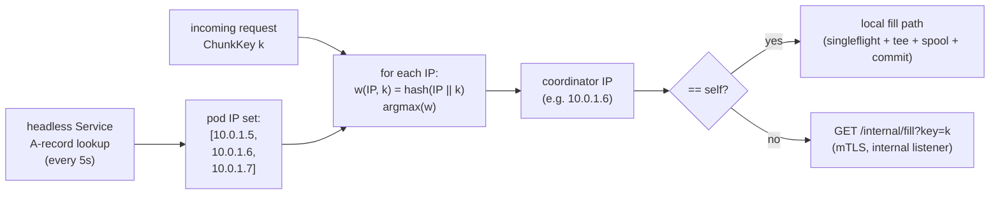

### Diagram 12: Scenario H - rolling restart membership flux

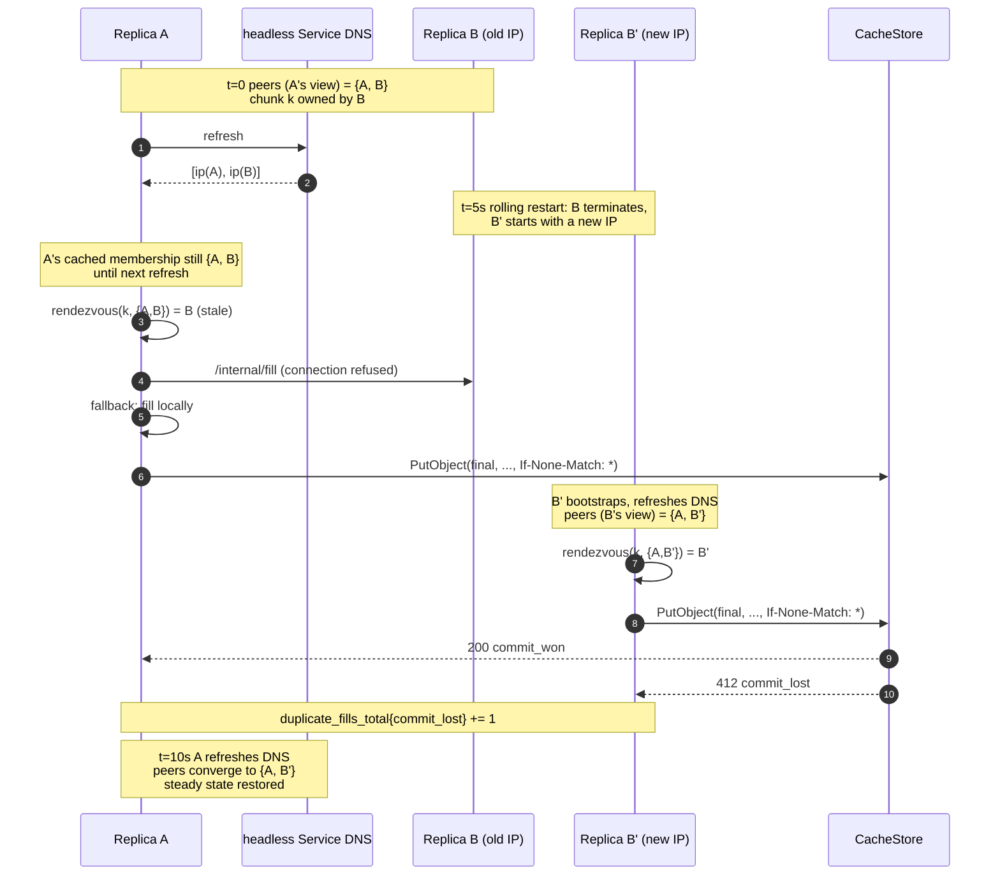

## 15. Deferred optimizations

This section catalogs concerns that are intentionally NOT in v1. Each
entry names what is deferred, why v1 ships without it, what operational
evidence would justify building it, and a sketch of how it would fit
into the existing surface area. None of these items require breaking
changes to v1 interfaces.

### 15.1 Edge rate limiting

**What**: Per-client / per-IP / per-credential token-bucket rate
limiting at the S3 edge; '429 Too Many Requests' on exhaustion;
identity from auth subject (mTLS cert subject or bearer-token claim)
with source-IP fallback when no auth identity is established.

**Why deferred**: v1 has implicit hot-client mitigation - the per-
replica origin semaphore (s8.4) and singleflight (s8.1)
coalesce concurrent identical work and cap cold-fill concurrency
regardless of caller. No measured noisy-neighbor evidence at v1
scale; cost of building edge rate limiting (token-bucket per
identity, identity extraction, new HTTP error path, new metric)
outweighs the speculative benefit.

**Trigger**: Operator reports a single client / credential is
measurably monopolizing TTFB or driving disproportionate origin
load past internal mechanisms.

**Sketch (if built)**: Token bucket per identity in
`internal/orca/server/edgelimit/`; refill rate per identity
configurable; per-replica enforcement (no cluster-wide
coordination); returns `429 Too Many Requests` with
`Retry-After: 1s`. New metric
`orca_edge_ratelimit_total{identity,result}`.

**Known v1 limitation**: documented gap. Multi-tenant deployments
worried about single-client monopolization should layer rate
limiting at an upstream proxy or LB until this lands.

### 15.2 Cluster-wide HEAD singleflight

**What**: A second coordinator role parallel to the chunk fill
coordinator (s8.3): rendezvous-hash on `(origin_id, bucket, key)`
to pick exactly one HEAD coordinator per object per cluster. New
`/internal/head` RPC. After: exactly one `Origin.Head` per object
per `metadata_ttl` window cluster-wide.

**Why deferred**: Per-replica HEAD singleflight (s8.7) caps
cluster-wide HEAD load at `N * (objects / metadata_ttl)`. At
documented v1 scale (3-5 replicas, 5m TTL), this is well under
documented S3 / Azure HEAD rate limits. Savings only become
material at much larger scale.

**Trigger**: any of:
- peer-set size exceeds ~10 replicas, AND keys cluster under
  shared prefixes approaching per-prefix rate limits (5500/sec on
  AWS S3);
- `metadata_ttl` configured short enough that HEAD storms repeat
  frequently;
- operator measures HEAD throttling on origin.

**Sketch (if built)**: New `ObjectKey = {origin_id, bucket,
object_key}` type. New `Cluster.HeadCoordinator(ObjectKey) Peer`
parallel to `Coordinator(ChunkKey) Peer`. New
`InternalClient.Head(ctx, ObjectKey) (ObjectInfo, error)`. New
endpoint `GET /internal/head?origin_id=...&bucket=...&key=...` on
existing internal listener (s8.8); reuses mTLS + peer-IP authz.
Same `409 Conflict` membership-flux fallback as chunk fill.
Coordinator-unreachable degrades to local `Origin.Head`. New
`cluster_internal_head_*` metrics. The bounded-freshness mode
(s11.2) would naturally route its background HEADs through this
same coordinator pattern.

**Known v1 bound**: at N replicas and `metadata_ttl=5m`, cold
popular-key fan-out generates **N HEADs per object per 5 minutes
cluster-wide**. Documented and acceptable at v1 scale.

### 15.3 Cluster-wide LIST coordinator

**What**: Extend FW2's coordinator pattern to LIST: rendezvous-
hash on the full LIST query tuple `(origin_id, bucket, prefix,
continuation_token, start_after, delimiter, max_keys)` to pick
one coordinator per query per cluster. New `/internal/list` RPC.
Coordinator's per-replica LIST cache (s6.2) becomes the de facto
cluster cache. After: exactly one `Origin.List` per identical
query per `list_cache.ttl` cluster-wide.

**Why deferred**: v1 ships with per-replica LIST cache (s6.2,
default 60s TTL). For the documented FUSE-`ls` workload, FUSE
clients are typically pinned to one replica via HTTP/2 keepalive,
making per-replica caching naturally effective for any single
client. Across many clients sharing prefixes, per-replica caching
holds origin LIST load to N per popular prefix per
`list_cache.ttl` window - well under any documented rate limit
at v1 scale.

**Trigger**: any of:
- peer-set size exceeds ~10 replicas, AND
- highly-shared FUSE prefixes, AND
- tight `ls` latency budgets (so the additional 5-20ms internal-
  RPC hop is acceptable in trade for reduced origin load);
- OR operator measures sustained LIST throttling on origin.

**Sketch (if built)**: Symmetric to s15.2. New
`Cluster.ListCoordinator(ListKey) Peer`. New
`InternalClient.List` RPC. Coordinator runs the LIST cache and
the existing per-replica LIST singleflight; non-coordinators
route to it on cache miss. Same `409 Conflict` membership-flux
fallback. Coordinator-unreachable degrades to local
`Origin.List`. The internal-RPC latency overhead matters more
for FUSE-`ls` than chunk fills, so caching at the coordinator
must be aggressive (TTL >= 60s).

**Known v1 bound**: cluster-wide LIST load is up to N origin LIST
calls per identical query per `list_cache.ttl` window where N is
peer count. Acceptable at v1 scale.

### 15.4 Mid-stream origin resume

**What**: After the commit boundary (s8.6 / s6 step 6) the v1 cache
streams origin bytes directly to the client. If the origin
connection breaks mid-chunk, the response aborts (HTTP/2
`RST_STREAM` or HTTP/1.1 `Connection: close`); the S3 SDK detects
the `Content-Length` mismatch and retries. Mid-stream origin
resume would replace the abort with a transparent re-issue: the
leader tracks bytes sent to client; on origin disconnect, it
re-issues `Origin.GetRange` with `Range: bytes=<offset>-` (and
the same `If-Match: <etag>`) and continues feeding the client
without ever showing an error.

**Why deferred**: v1 relies on the SDK retry behavior (every
mainstream S3 client handles this case correctly) which is
acceptable for the documented workload. Mid-stream resume
requires non-trivial state tracking (bytes-sent counter, retry
budget for the resume itself, interaction with the singleflight
joiner state), and the abort case is handled by the SDK so the
operational impact is small.

**Trigger**: any of:
- mid-stream client aborts measurably impact tail TTFB on the
  documented workload (visible via
  `responses_aborted_total{phase="mid_stream"}` rate);
- workload uses non-S3-compatible clients without robust retry
  (uncommon);
- post-commit origin failures are systematically more frequent
  than pre-commit (e.g., long-tail origin connections that
  succeed initially then drop).

**Sketch (if built)**: extend `fetch.Coordinator` to track
`bytesSent` per fill. On `Origin.GetRange` error after the commit
boundary, retry origin with `Range: bytes=<bytesSent>-` (within
the requested chunk's range; bounded by a separate
`origin.resume.attempts` budget, e.g. 1-2 attempts). Joiners reading
through the leader's tee transparently see the gap closed. The
spool tee continues unaffected; the resumed bytes flow through
the same ring buffer + spool. New metric:
`orca_origin_resume_total{result="success|exhausted|error"}`.

**Known v1 bound**: post-commit origin failures abort the client
response; client SDK retries from scratch
(`responses_aborted_total{phase="mid_stream"}` increments).
Acceptable for the documented workload at v1 scale.

### 15.5 Coordinated cluster-wide origin limiter

**What**: Replace the per-replica static cap (s8.4) with a true
cluster-wide cap on concurrent `Origin.GetRange` calls. Mechanism:
Kubernetes-Lease-elected **limiter authority** + in-memory
counting semaphore at the elected leader + slot-lease tokens
(batched) issued over an internal RPC + per-peer local bucket
that auto-refills + graceful fallback to the v1 per-replica
static cap when the authority is unreachable.

**Why deferred**: at documented v1 scale (3-5 replicas), the
per-replica static cap (s8.4) is approximate but acceptable;
cluster-wide concurrency tracks `target_global` within a small
margin during steady state, and the pre-header retry loop (s8.6)
handles origin throttling responses (`503 SlowDown` / `429`)
self-correctingly. The K8s Lease design adds substantial surface
area (election machinery, slot-lease tokens, batching, fallback
mode, RBAC, ~12 metrics, ~10 tests, an additional `Limiter`
interface plus `LimiterToken` type, three new internal RPC
endpoints) that is not justified at v1 scale. Reviewer feedback
flagged the cumulative complexity as not earning its keep.

**Trigger**: any of:
- peer-set size grows past ~10 replicas, AND measured steady-
  state slot under-utilization (one replica saturated while
  others are idle for the same hot work) is causing
  `503 Slow Down` to clients;
- operator requires a hard cluster-wide cap (e.g., dedicated
  origin pipe sized for X concurrent connections; cost-sensitive
  deployment cannot tolerate the static cap's worst-case
  overshoot);
- origin imposes an account-wide rate limit (rather than
  per-prefix) that the static cap would routinely exceed.

**Sketch (if built)**:

- **Election**: standard `client-go/tools/leaderelection` against
  a single `coordination.k8s.io/v1.Lease` resource named e.g.
  `orca-limiter` in the deployment's namespace. RBAC:
  `get / list / watch / create / update / patch` on the named
  Lease, scoped to the deployment's namespace. Steady-state K8s
  API load: ~6-30 writes/min/deployment (the elected leader
  renews; non-leaders do not write).

- **Authority**: holds an in-memory counting semaphore of
  `cluster.limiter.target_global` slots (default 192). Serves
  three RPCs over the existing internal listener (s8.8):
  `POST /internal/limiter/acquire` (issues a lease token holding
  N batched slots; default `batch.size=8`, configurable;
  `token.ttl=30s` wall-clock expiry); `POST /internal/limiter/extend`
  (bumps an existing token's expiry; returns `unknown_token` or
  `expired` if reclaimed); `POST /internal/limiter/release`
  (returns slots; idempotent). Background sweep every 5s reclaims
  expired tokens.

- **Peer**: each non-authority replica holds a small local bucket
  of slots acquired in batches; auto-refill triggers when remaining
  slots fall to or below `cluster.limiter.batch.refill_threshold`
  (default 2). Tokens auto-extend when their age exceeds
  `cluster.limiter.token.extend_at_ratio * token.ttl` (default
  0.5 * 30s = 15s). When the local bucket empties, the replica
  releases the old token and acquires a fresh one.

- **Authority changeover**: when the K8s Lease holder changes,
  the new authority starts with an empty slot table while old
  lease tokens at peers continue draining. Cluster-wide inflight
  may transiently exceed `target_global` by up to one full set
  of tokens; drains within `lease.duration + token.ttl` =
  45s worst case with defaults. Acceptable because the limiter
  is a soft cap; correctness is unaffected.

- **Fallback mode**: peer cannot reach authority -> activates the
  v1 per-replica static cap (the same `floor(target_global / N)`
  semaphore from s8.4). Transparent to the client. Reconnects
  automatically on `cluster.limiter.fallback.check_interval`
  (default 5s). Limiter authority unreachability is intentionally
  NOT a `/readyz` predicate: replicas in fallback are still
  serving correctly.

- **Disable toggle**: `cluster.limiter.enabled: false` returns
  the v1 per-replica static cap permanently. No K8s API access;
  no Lease object created. Useful for deployments without RBAC
  for the Lease resource, or for isolated debugging.

- **New metrics**: `orca_limiter_state{role="authority|peer|fallback"}`,
  `orca_limiter_target_global`,
  `orca_limiter_slots_available` (authority-only),
  `orca_limiter_slots_granted` (authority-only),
  `orca_limiter_slots_local` (per-peer),
  `orca_limiter_acquire_total{result}`,
  `orca_limiter_acquire_duration_seconds`,
  `orca_limiter_extend_total{result}`,
  `orca_limiter_release_total`,
  `orca_limiter_election_total{result}`,
  `orca_limiter_lease_expired_total`,
  `orca_limiter_fallback_active`.

- **New interfaces in s7**: `Limiter` (`Acquire(ctx) (Slot, error)`,
  `State() LimiterState`); `Slot` (`Release()`); `LimiterToken`
  struct (`ID`, `Slots`, `ExpiresAt`); `InternalClient` gains
  `LimiterAcquire`, `LimiterExtend`, `LimiterRelease`.

- **Composition with [s15.6](#156-dynamic-per-replica-origin-cap)**:
  the coordinated authority (this entry) and dynamic per-replica
  recompute (s15.6) are orthogonal mechanisms. If both ever
  ship, dynamic per-replica is the uncoordinated baseline that
  coordination tightens further.

**Known v1 limitation**: per-replica static cap; cluster-wide
concurrency tracks `target_global` only when `N_actual ==
cluster.target_replicas`. Documented and acceptable at v1
documented scale.

### 15.6 Dynamic per-replica origin cap

**What**: Derive `target_per_replica` at runtime from
`len(Cluster.Peers())` rather than from the static
`cluster.target_replicas` config knob. The per-replica origin
semaphore is resized on each membership-refresh, keeping
realized cluster-wide concurrency close to `target_global`
regardless of actual replica count.

**Why deferred**: v1 ships with `cluster.target_replicas` as a
static config knob (s8.4). Static is simpler, deterministic,
and matches the operator's mental model when the deployment has
a stable replica count (the documented v1 target of 3-5
replicas without HPA). Dynamic adds:

- a resizable-semaphore primitive (the Go standard library and
  `golang.org/x/sync/semaphore` both fix capacity at
  construction; a custom wrapper is required, ~30-40 lines);
- a peer-change notification channel on the `Cluster` interface
  (`PeersChanges() <-chan []Peer` or equivalent);
- a watcher goroutine that recomputes the cap on each membership
  change;
- edge-case handling (empty peer set, current inflight exceeding
  the new cap, rapid peer-set churn).

Roughly 60-80 lines of code plus ~5 new tests. Modest in
isolation but composes with the broader complaint that the v1
design has too many moving parts.

**Trigger**: any of:

- HPA-driven autoscaling produces frequent replica-count
  changes;
- operators routinely scale the deployment without updating
  `cluster.target_replicas`, leaving the realized cap
  mis-sized;
- operator measures sustained over- or under-allocation against
  `target_global` (sum of per-replica `origin_inflight` gauges
  diverging persistently from `target_global`).

**Sketch (if built)**:

- `internal/orca/origin/semaphore.go`: resizable semaphore
  wrapper with `Acquire(ctx)`, `Release()`, `SetCapacity(n)`.
- `Cluster` interface gains a peer-change notification surface
  (channel or callback).
- Watcher goroutine recomputes on each membership change:
  `target_per_replica = floor(target_global / max(1, len(peers)))`.
  The `max(1, ...)` matches the empty-peer fallback (s14): a
  lone replica gets `target_global` slots, which is correct for
  the last-replica-standing case.
- Edge cases: current inflight exceeds new cap (existing holders
  complete naturally; new acquires queue against the new cap);
  rapid peer-set churn (optional debouncing or rate-limiting on
  `SetCapacity` calls).
- Composes naturally with [s15.5](#155-coordinated-cluster-wide-origin-limiter):
  the coordinated authority (s15.5) and per-replica dynamic cap
  (this entry) are orthogonal mechanisms; if both ever ship,
  dynamic is the uncoordinated baseline that coordination
  tightens further.

**Known v1 limitation**: the static cap is approximate. Realized
cluster-wide concurrency depends on `N_actual`:

- `N_actual > N_typical`: realized cap exceeds `target_global` by
  up to `(N_actual - N_typical) * target_per_replica`.
- `N_actual < N_typical`: realized cap falls below `target_global`
  by `(N_typical - N_actual) * target_per_replica`.

Over-allocation may stress origin; under-allocation wastes
capacity. Operators MUST update `cluster.target_replicas` after
any sustained scale change.
