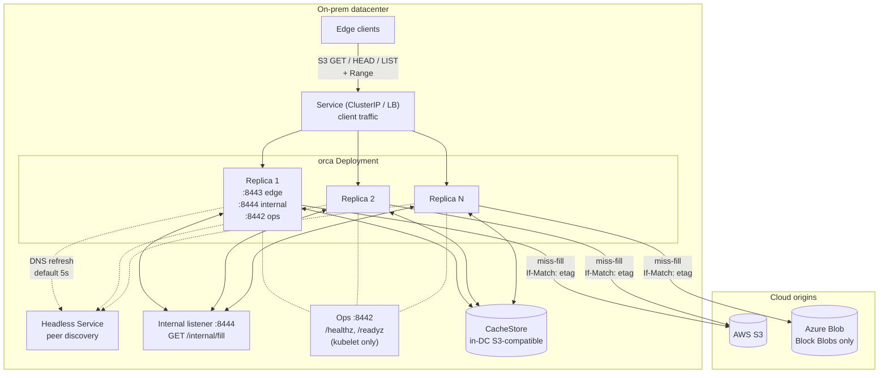
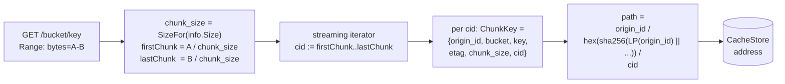
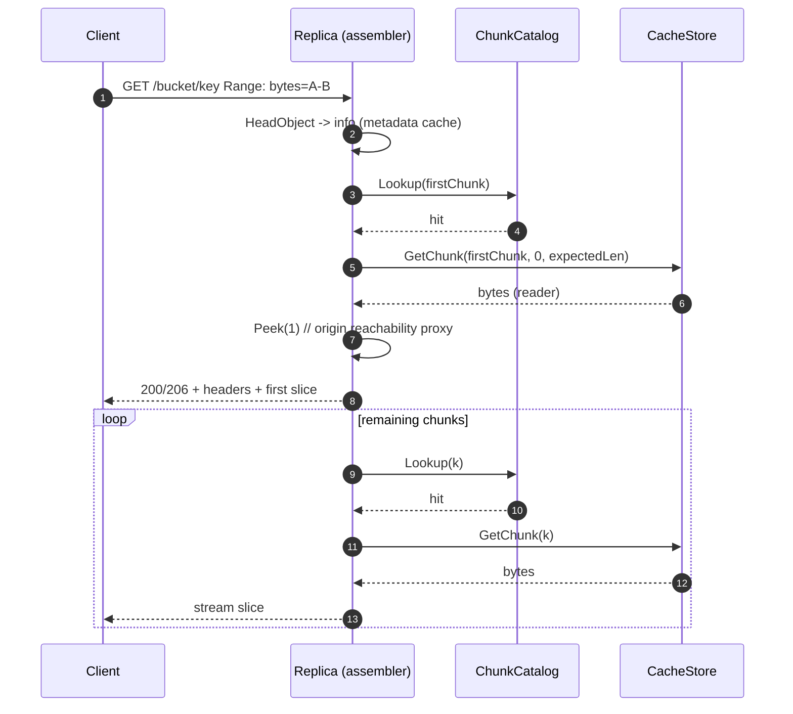
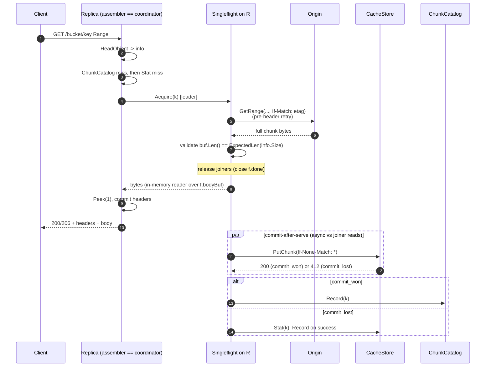
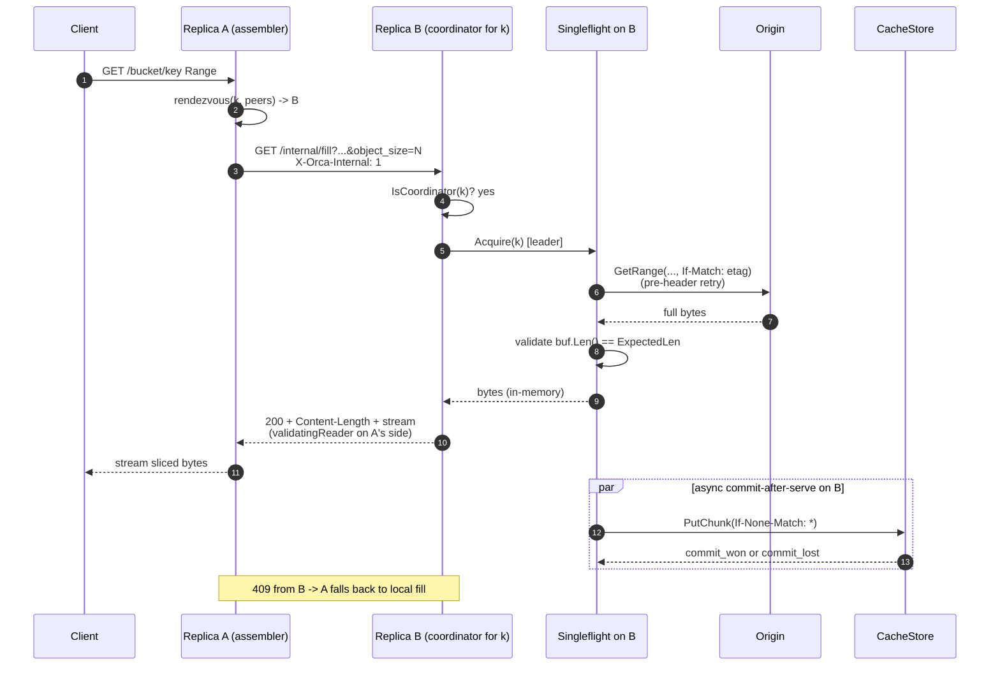
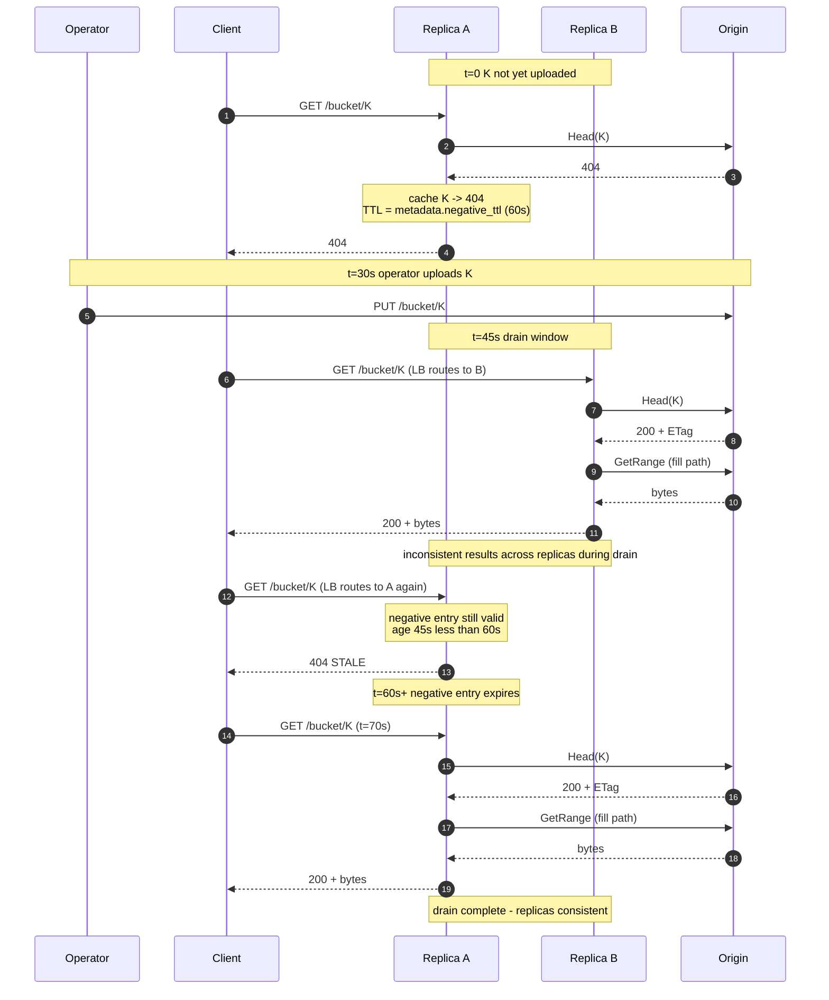
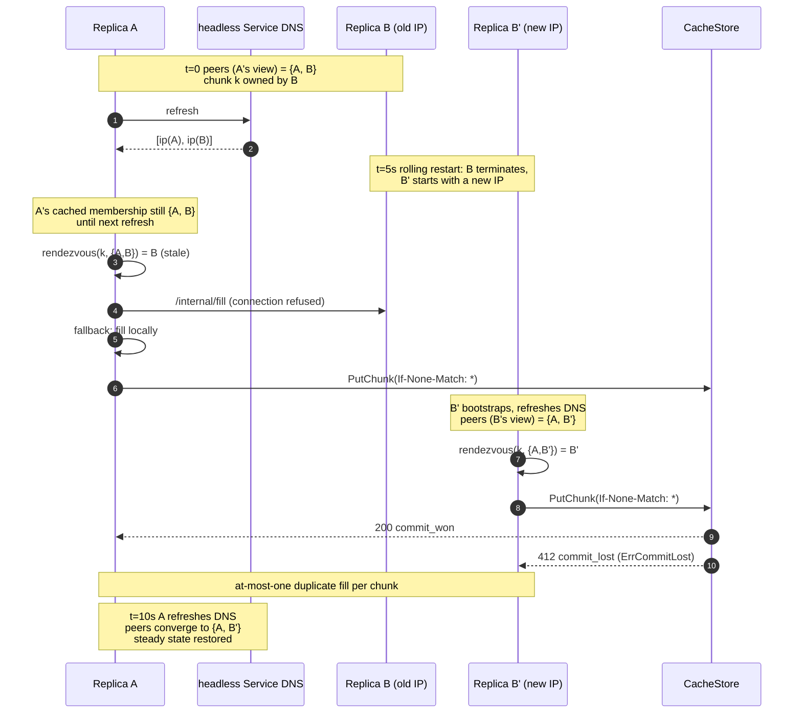

# Orca - Origin Cache - Design

What Orca does, how it does it, and the few decisions that keep it
correct under load. The shorter stakeholder version is in
[brief.md](./brief.md).

## Table of contents

1. [Overview](#1-overview)
2. [Decisions](#2-decisions)
3. [Terminology](#3-terminology)
4. [Architecture](#4-architecture)
5. [Chunk model](#5-chunk-model)
6. [Request flow](#6-request-flow)
7. [Stampede protection](#7-stampede-protection)
8. [Atomic commit](#8-atomic-commit)
9. [Bounded staleness contract](#9-bounded-staleness-contract)
10. [Create-after-404 and negative-cache lifecycle](#10-create-after-404-and-negative-cache-lifecycle)
11. [Eviction and capacity](#11-eviction-and-capacity)
12. [Horizontal scale](#12-horizontal-scale)
13. [Deferred / future work](#13-deferred--future-work)

---

## 1. Overview

Clients inside an on-prem datacenter need to read large files
that live in cloud blob storage (AWS S3, Azure Blob). Letting
every client read from the cloud directly costs too much,
adds too much latency, and pushes too much traffic across the
security boundary.

Orca sits inside the datacenter and reads from cloud storage on
the clients' behalf. It speaks an S3-compatible HTTP API, so
clients use the same SDKs they already use. On a cache hit it
serves from a shared in-DC store. On a miss it fetches from the
cloud, saves the result, and returns it.

Orca splits each object into fixed-size chunks (8 MiB by
default). Each chunk's storage path is a hash of the object's
identity (origin, bucket, key, ETag, chunk size). Orca runs as a
multi-replica Kubernetes Deployment. The replicas share one
in-DC store. They find each other through a headless Service.
For any given chunk a single hash picks one replica as the
chunk's "coordinator" - the only replica that's allowed to
fetch that chunk from the cloud. The other replicas ask the
coordinator over a private channel. The result: even if a
thousand clients ask for the same chunk at the same time, the
cloud sees exactly one fetch.

## 2. Decisions

| Area | Decision |
|---|---|
| Client API | S3-compatible HTTP. `GET` + `HEAD` + a minimal `ListObjectsV2` pass-through. Range reads work. |
| Auth surface | Bearer / mTLS hooks exist on the edge and the internal listener, but nothing checks them yet. Dev runs with auth off. See s4 and [Deferred / future work](#13-deferred--future-work). |
| Origins | AWS S3 and Azure Blob, behind a pluggable `Origin` interface. |
| Azure constraint | Block Blobs only. Page and Append blobs are rejected at `Head` with `UnsupportedBlobTypeError`. |
| Cachestore | An in-DC S3-compatible store (`cachestore/s3`): LocalStack in dev, VAST or similar in production. Treated as the truth for what chunks exist. |
| Atomic commit | `PutObject` with `If-None-Match: *`. The second concurrent commit gets a `412` and is recorded as `ErrCommitLost`. At boot, `SelfTestAtomicCommit` proves the backend honors the precondition; if it doesn't, the process refuses to start. |
| Versioned cachestore buckets | Not supported. At boot, `GetBucketVersioning` runs; if the bucket has versioning enabled or suspended, the process refuses to start. VAST and several S3-compatible backends ignore `If-None-Match: *` on versioned buckets, which would silently break the atomic-commit rule. |
| Chunking | Default 8 MiB (`chunking.size`). For bigger objects, an optional tier ladder (`chunking.tiers`) picks a larger size: 64 MiB for objects over 1 GiB, 128 MiB for objects over 10 GiB. The chunk size is part of the chunk's storage path, so changing the default or any tier never breaks existing data. Minimum 1 MiB. |
| Read-ahead | While the edge sends one chunk to the client, it can fetch the next few chunks in parallel. The default is 8 in flight. Set `chunking.readahead: 0` to turn it off. |
| Consistency | Operators promise: once a key is published, its bytes never change. To change the data, publish a new key. Orca treats the ETag as the key's identity, not as a freshness check. We also send `If-Match: <etag>` on every fetch as a safety net. If an operator breaks the promise, the wrong data is served for at most 5 minutes (`metadata.ttl`). If a key is uploaded after someone already saw a 404 on it, the wrong 404 is served for at most 60 seconds (`metadata.negative_ttl`). See [s9](#9-bounded-staleness-contract). |
| ETag presence | The origin must return a non-empty ETag on `Head`. If it doesn't, Orca rejects the response with `origin.MissingETagError`. Without an ETag, two different versions of the same `(bucket, key)` would hash to the same storage path and Orca would silently serve old bytes. |
| Catalog | An in-memory LRU (`ChunkCatalog`) that remembers which chunks are in the cachestore. Presence-only - no size or access count. Capped at 100,000 entries by default. |
| Cluster | Kubernetes Deployment + headless Service for peer discovery + ClusterIP / LB for client traffic. A hash on the chunk's identity picks one replica as the chunk's coordinator. The replica that received the client request - the **assembler** - asks the right coordinator for each chunk in the range. On hits, any replica can read the cachestore directly. |
| Internal-listener auth | Config keys exist for mTLS, but nothing enforces them yet. Dev runs with mTLS off. |
| Origin concurrency cap | Each replica caps in-flight origin fetches at `floor(origin.target_global / cluster.target_replicas)` - 64 by default. When the origin throttles (503, 429, retryable 5xx), the leader retries with exponential backoff before sending any HTTP headers, so the client never sees the throttle. |
| Tenancy | One tenant, one set of origin credentials. |
| Listeners | Three: edge `:8443`, internal-fill `:8444`, ops `:8442` (`/healthz`, `/readyz`). All plain HTTP in dev. |
| Repo home | This repo. Code under `internal/orca/`, manifests under `deploy/orca/`, dev harness under `hack/orca/`. |

## 3. Terminology

- **Replica** - one running pod of the `orca` Deployment. Replicas
  are interchangeable; they hold only in-memory caches.
- **Client** - whoever is calling the S3-compatible HTTP API.
- **Origin** - the upstream cloud store (AWS S3 or Azure Blob).
  Orca only reads from it. Interface in
  `internal/orca/origin/origin.go`.
- **CacheStore** - the shared in-DC chunk store. The truth for
  what's cached. Today this is `cachestore/s3` (an in-DC
  S3-compatible object store). Interface in
  `internal/orca/cachestore/cachestore.go`; commit rules in
  [s8](#8-atomic-commit).
- **Chunk** - one piece of an object. The size is chosen per
  request from a small ladder: 8 MiB for small objects, up to 128
  MiB for objects over 10 GiB by default. Orca caches and fills
  chunks, not whole objects.
- **ChunkKey** - the chunk's name:
  `{origin_id, bucket, object_key, etag, chunk_size, chunk_index}`.
  See [s5](#5-chunk-model).
- **Headless Service** - a Kubernetes Service with `clusterIP: None`.
  Its DNS A-record returns the IPs of all Ready pods. Orca polls
  it every 5s (default) to learn the current peers.
- **Rendezvous hashing** (HRW) - for a key, score every peer with
  `hash(peer_ip || key)` and pick the highest score. Stable when
  peers come and go: a chunk's owner only changes if its own
  owner is added or removed. Orca uses this to pick one
  coordinator per chunk.
- **Coordinator** - the replica the hash picks to fetch a chunk
  on a miss. One coordinator per chunk, not per request and not
  per object.
- **Assembler** - the replica that took the client request. It
  walks the requested byte range chunk by chunk. For each chunk
  it reads from the cachestore on a hit, or asks the chunk's
  coordinator on a miss (locally or over the internal RPC).
- **Singleflight** - a small in-process trick: if a fetch for a
  given chunk is already running, new requests for that chunk
  wait for the running fetch instead of starting their own. The
  first arrival is the **leader**; the rest are **joiners**. See
  [s7.1](#71-per-chunkkey-singleflight).
- **Per-chunk internal fill RPC** -
  `GET /internal/fill?<chunk-key params>` over plain HTTP on the
  internal listener (`:8444` by default). The assembler calls it
  when the coordinator is some other replica.
- **Atomic CacheStore commit** - the write that publishes a chunk
  to the cachestore without overwriting anything. `PutObject` with
  `If-None-Match: *`. If two replicas race, one wins with `200`
  and the other gets `412` (recorded as `ErrCommitLost`).
- **Immutable-origin contract** - operators promise that once
  they publish a key, its bytes never change. If they break this,
  Orca may serve the old bytes for up to `metadata.ttl`. See
  [s9](#9-bounded-staleness-contract).
- **Pre-header retry** - the leader retries a failed
  `Origin.GetRange` up to 3 times within 5 seconds before sending
  any HTTP header to the client. Transient origin failures stay
  invisible. `OriginETagChangedError` is not retried.
- **Negative-cache entry** - a metadata-cache entry that
  remembers a `404`, an `UnsupportedBlobTypeError`, or a
  `MissingETagError`. Reused for 60 seconds by default
  (`metadata.negative_ttl`).
- **S3 versioning gate** - a boot-time `GetBucketVersioning`
  check. If the cachestore bucket has versioning enabled or
  suspended, Orca refuses to start.
- **MissingETagError** - what the fetch coordinator returns when
  the origin's `Head` response has no ETag. Comes back to the
  client as a 502 `OriginMissingETag` and is cached negatively.

## 4. Architecture

Orca is a single binary deployed as a Kubernetes Deployment.
Replicas discover each other through a headless Service and
refresh the peer list every 5 seconds by default
(`cluster.membership_refresh`).

A client request lands on one replica, the **assembler**. The
assembler walks the requested byte range chunk by chunk. For
each chunk:

- If the chunk is in the cachestore, the assembler reads it
  directly. Any replica can do this.
- If not, a hash on the chunk's identity picks the **coordinator**
  for that chunk. If the coordinator is this replica, the
  assembler fetches the chunk locally. If it's some other
  replica, the assembler asks that replica over the internal-fill
  RPC.

One tenant. One set of origin credentials per deployment.

Each replica runs three HTTP listeners:

- **Edge (`:8443`)** - the S3-compatible client API. Auth is
  wired in config but not enforced. Dev runs with
  `server.auth.enabled: false`.
- **Internal-fill (`:8444`)** - serves `GET /internal/fill`, the
  RPC between replicas. Plain HTTP in dev
  (`cluster.internal_tls.enabled: false`).
- **Ops (`:8442`)** - serves `/healthz` (always 200 while the
  process is up) and `/readyz` (200 once the cachestore
  self-test has passed and the cluster has at least one peer-set
  snapshot). Plain HTTP, no auth. Production manifests point the
  kubelet probes here; the client Service does not expose this
  port.

### Diagram 1: System overview



## 5. Chunk model

A `ChunkKey` is six fields: `{origin_id, bucket, object_key,
etag, chunk_size, chunk_index}`.

- `origin_id` is a deployment-scoped name from config (e.g.
  `aws-us-east-1-prod`). Required. Two Orca deployments can share
  the same cachestore bucket without colliding because their keys
  start with different `origin_id` values.
- `etag` makes a key's content explicit. A new ETag means a new
  logical object: it gets a fresh set of chunks. Old chunks from
  the old ETag fall out of the cachestore via lifecycle policy
  (see [s11](#11-eviction-and-capacity)).
- `chunk_size` is baked into the storage-path hash, so changing
  it in config never corrupts existing data.
- `chunk_index = floor(byte / chunk_size)`.

A small metadata cache holds `(origin_id, bucket, key) -> ObjectInfo`
with two TTLs: 5 minutes for hits, 60 seconds for misses. Without
it, every request would re-`HEAD` the origin.

Each chunk's storage path is deterministic:

`LE64(x)` is the little-endian 8-byte encoding of a 64-bit unsigned
integer, `||` is byte-string concatenation, and `LP(s)` is the
length-prefixed encoding of `s` (its length as `LE64` followed by
its bytes). Length-prefixing each field prevents two distinct
inputs from producing the same hash via boundary ambiguity (e.g.
`("ab", "c")` vs. `("a", "bc")`).

```
LP(s)   = LE64(uint64(len(s))) || s
hashKey = sha256(
            LP(origin_id) ||
            LP(bucket)    ||
            LP(key)       ||
            LP(etag)      ||
            LE64(chunk_size)
          )
path    = "<origin_id>/<hex(hashKey)>/<chunk_index>"
```

`origin_id` is in the path in the clear (it's not hashed) so an
operator can delete one deployment's chunks with a single
`aws s3 rm --recursive <bucket>/<origin_id>/`. `chunk_size` goes
into the hash, not the path, so changing it doesn't break
anything visible.

**What happens if you change `chunk_size`.** Nothing bad. Each
chunk's path is hashed from the chunk size, so old chunks at the
old size never collide with new chunks at the new size. The old
chunks just become unreachable. Plan for two things while the
working set rebuilds at the new size: storage usage roughly
doubles, and origin traffic spikes briefly. The old chunks age
out on their own via the bucket's lifecycle policy.

### 5.1 Effective chunk size

Chunk size is not one global number. The edge handler picks it
per request from a base size plus an optional list of tiers.
Each tier says "for objects this big and larger, use this chunk
size." The base covers small objects; tiers kick in at higher
object sizes.

Default ladder:

| Object size | Chunk size |
|---|---|
| under 1 GiB | 8 MiB (base) |
| 1 GiB to 10 GiB | 64 MiB |
| over 10 GiB | 128 MiB |

**Why a ladder.** Small objects don't need big chunks - that
would waste memory per fill. Big objects pay a high price for
small chunks - more HTTP requests, more per-chunk overhead. The
ladder picks a size that fits each object.

**Why it's safe to change.** Each chunk's storage path includes
the chunk size in its hash. So a chunk written at 8 MiB and a
chunk written at 128 MiB live at different paths and never
overlap. If you change the ladder, old chunks at the old size
simply age out via the bucket lifecycle policy. Nothing gets
corrupted.

**Why tiers can't overlap.** The config requires tiers to be
sorted by their object-size threshold, with no duplicates. The
loader rejects anything else. So for any object size there is
exactly one matching tier (or the base, if no tier matches).

**Cross-replica safety.** The peer-to-peer fill RPC sends the
chunk size along with every request (see
[s7.3](#73-cluster-wide-deduplication-via-per-chunk-fill-rpc)).
If two replicas are running with different tier settings during
a rolling deploy, every request is still self-contained - the
receiver uses the size the sender asked for. No coordination is
needed.

To find a chunk, Orca calls `CacheStore.Stat(key)`. The
`ChunkCatalog` (an in-memory LRU) remembers recent Stat hits so
the hot path skips the cachestore. The catalog is a cache for
the cache: drop it and Orca still works. It stores nothing per
entry beyond "this path is present", because the path already
encodes the chunk's exact identity. If the cachestore later
loses the chunk (e.g. lifecycle deletes it), the next `GetChunk`
returns `ErrNotFound`, the caller calls `Forget`, and the next
request re-stats.

For a request `Range: bytes=A-B`:

```
firstChunk = A / chunk_size
lastChunk  = B / chunk_size
for cid := firstChunk; cid <= lastChunk; cid++ {
    fetchOrServe(cid)
    sliceWithin(cid, max(A, cid*sz), min(B, (cid+1)*sz - 1))
}
```

The loop is streaming: Orca never builds the full list of chunk
keys up front.

### Diagram 2: Range request -> chunk index mapping

`SizeFor` below is the tier-ladder lookup described in
[s5.1](#51-effective-chunk-size).



## 6. Request flow

A `GET /{bucket}/{key}` arrives, maybe with a `Range` header.
The edge handler does this:

1. **Get the object's metadata.** Call
   `fetch.Coordinator.HeadObject`. It first checks the metadata
   cache. On a miss, the per-replica HEAD singleflight runs
   `metadata.LookupOrFetch` and calls `Origin.Head` once. An
   empty `ETag` in the response is rejected as
   `MissingETagError`. Hits live 5 minutes (`metadata.ttl`);
   negative cases (`ErrNotFound`, `UnsupportedBlobTypeError`,
   `MissingETagError`) live 60 seconds (`metadata.negative_ttl`).
2. **Handle empty objects.** If the object is zero bytes, return
   200 with an empty body right away. A `Range` header on a
   zero-byte object is 416.
3. **Parse and check the range.** Validate any `Range` header
   against `info.Size`. An unsatisfiable range is 416.
4. Compute the chunk range with `chunk.IndexRange`.
5. **Fetch the first chunk before sending any headers.** Call
   `fc.GetChunk(firstKey, info.Size)`, wrap the reader in a
   `bufio.Reader`, and `Peek(1)`. If the peek fails - origin
   unreachable, auth, ETag changed, missing ETag - the handler
   returns a clean S3-style error without ever sending a 200 /
   206. Once that first byte is in hand, the handler sends
   headers (`Content-Length`, optional `Content-Range`, `ETag`,
   `Content-Type`) and starts streaming.
6. **Stream chunk by chunk.** Stream the first chunk's slice,
   then fetch and stream chunks 1..N. If a fetch fails after
   headers are out, the response just ends mid-body; S3 SDKs
   notice the Content-Length mismatch and retry.
7. **For each chunk**, `fc.GetChunk` first checks the catalog and
   the cachestore. A hit returns a reader clamped to
   `k.ExpectedLen(info.Size)`. A miss goes to the cluster-wide
   dedup path
   ([s7.3](#73-cluster-wide-deduplication-via-per-chunk-fill-rpc)).
8. **Cold-path fill.** The leader fetches the chunk from the
   origin with pre-header retry, checks the body length against
   `ExpectedLen`, buffers it in memory, releases the joiners, and
   commits to the cachestore in the background (commit-after-
   serve - see [s7.2](#72-singleflight--commit-after-serve)).

### Diagram 3: Scenario A - warm read (cache hit)



A cache hit. The assembler asks the catalog, reads from the
cachestore, and streams to the client. No origin call, no peer
call.

### Diagram 4: Scenario B - cold miss, local coordinator



A cold miss where the same replica is both the assembler and the
coordinator. The replica fetches from origin, hands the bytes to
the client, and writes to the cachestore in the background.

### 6.1 HEAD request flow

`HEAD /{bucket}/{key}` is served from object metadata. No chunks
are touched.

1. The edge handler calls `fc.HeadObject`. A metadata-cache hit
   returns the cached `ObjectInfo`. A miss runs the per-replica
   HEAD singleflight, which issues one `Origin.Head`.
2. On success, return 200 with `Content-Length: info.Size`,
   `ETag: info.ETag`, `Content-Type: info.ContentType`, and
   `Accept-Ranges: bytes`.
3. Errors reuse the GET error mapping (s6.3). A 404 is cached
   negatively. `UnsupportedBlobTypeError` comes back as a 502
   `OriginUnsupported`. `MissingETagError` comes back as a 502
   `OriginMissingETag`. All three are cached negatively.

### 6.2 LIST request flow

`GET /{bucket}/?list-type=2&prefix=...` is a thin pass-through to
`Origin.List`. The handler pulls `prefix`, `continuation-token`,
and `max-keys` from the query string, calls the origin, and
turns the result into a minimal `ListBucketResult` XML body.

This is deliberately narrow. A per-replica LIST cache tuned for
FUSE `ls` workloads is in scope as future work; see
[Deferred / future work](#13-deferred--future-work).

### 6.3 HTTP error-code mapping

| Status | S3-style code | Reason | Triggered by | Client retry? |
|---|---|---|---|---|
| 200 / 206 | (none) | normal hit or successful fill | hit + range OK; cold-path fill after pre-header-retry commit | n/a |
| 404 | `NoSuchKey` | origin returned `ErrNotFound` (cached negatively) | edge HEAD / GET miss | no |
| 416 | (text body) | range vs. `info.Size` violation | range math at request entry; or any `Range` against a zero-byte object | no (different range) |
| 502 | `OriginUnsupported` | non-BlockBlob azureblob; from `UnsupportedBlobTypeError` (cached negatively) | `Origin.Head` returns an unsupported blob type | no |
| 502 | `OriginETagChanged` | `OriginETagChangedError` from `Origin.GetRange`; not retried | mid-flight overwrite caught by `If-Match` | yes (next request re-`Head`s) |
| 502 | `OriginMissingETag` | `MissingETagError` from the fetch coordinator (cached negatively) | origin `Head` returned an empty ETag | no (operator must fix the origin config) |
| 502 | `Unauthorized origin` | `origin.ErrAuth` | origin returned 401 / 403 | no (operator) |
| 502 | `OriginUnreachable` | uncategorised origin error (5xx, timeouts past retry budget, DNS) | leader retry budget exhausted; cachestore failure during read | yes (origin may recover) |
| 503 | (probe response) | replica `NotReady` | `/readyz` failing predicates | n/a (LB drain) |
| (mid-stream abort) | n/a | post-header failure | origin disconnect, peer 5xx, cachestore failure after `Peek(1)` succeeded | S3 SDKs detect the Content-Length mismatch and retry |

Pre-header errors come back as `http.Error` text. The 416 paths
do too. There is no per-error S3-style XML envelope yet; S3 SDKs
accept the text body and route on the HTTP status. Mid-stream
aborts end the response (HTTP/2 `RST_STREAM` or HTTP/1.1
`Connection: close`).

### 6.4 Edge read-ahead

The chunk-by-chunk loop in step 6 of the request flow is not
strictly one-at-a-time. While the edge is sending one chunk to
the client, it can pull the next few chunks from the cachestore
at the same time. The default is up to 8 in flight per client
request.

**Why this matters.** A 700 GiB object at 128 MiB chunks is
around 5,600 chunks. Without read-ahead, each chunk is fetched,
then sent, then the next is fetched - one round trip after
another. With 8 in flight, most of the per-chunk round-trip time
is hidden behind sending bytes to the client.

**How it works.** The edge starts a small producer that issues
chunk fetches in order. Each fetch runs in its own worker.
Results come back in chunk order via a small in-memory queue, so
the client always receives bytes in the right order even if a
later worker finishes first.

**What stays the same.** The first chunk is still fetched and
checked before any response headers go out. If something fails
on chunk 0 - origin down, missing ETag, anything else - the
client gets a clean S3-style error, not a partial body.
Read-ahead only applies to chunks 1..N. Cold fills still go
through the per-replica origin cap
([s7.1](#71-per-chunkkey-singleflight)), so the cluster does not
suddenly issue more origin requests just because read-ahead is
on. Memory stays bounded by the origin cap.

**What happens on failure.** If a chunk fetch fails after
headers are out, the response just ends - same as before. If
the client disconnects, the producer stops and closes any chunk
bodies it has already pulled, so nothing leaks. If a worker
panics, it is caught, logged, and reported back to the consumer
as a fetch error.

**Turning it off.** Set `chunking.readahead: 0` to go back to
strict one-at-a-time fetching.

## 7. Stampede protection

The hot path. The job here is simple: when many clients ask for
the same chunk at the same time, the origin should see one
fetch, not many. Two mechanisms do this together.

1. **Inside one replica:** if a fetch for a chunk is already
   running, new requests for that chunk wait for the running
   fetch instead of starting their own. This is the singleflight.
2. **Across replicas:** a hash on the chunk's identity picks
   exactly one replica as the coordinator for that chunk. The
   other replicas ask that one over a private channel. So even
   across the cluster, only one replica fetches.

The named seams these mechanisms run through:

| Seam | File | Role |
|---|---|---|
| `origin.Origin` | `internal/orca/origin/origin.go` (interface); `internal/orca/origin/awss3/`, `internal/orca/origin/azureblob/` | Read-only adapter to the upstream blob store. `If-Match: <etag>` on every `GetRange`. |
| `cachestore.CacheStore` | `internal/orca/cachestore/cachestore.go` (interface); `internal/orca/cachestore/s3/` | In-DC chunk store; source of truth for chunk presence. `PutChunk` is atomic + no-clobber (returns `ErrCommitLost` on conflict). |
| `chunkcatalog.Catalog` | `internal/orca/chunkcatalog/chunkcatalog.go` | Bounded in-memory LRU recording chunks known to be in the cachestore. Presence-only. |
| `cluster.Cluster` | `internal/orca/cluster/cluster.go` | Peer discovery (DNS), rendezvous hashing, internal-fill RPC client + response validator. |
| `fetch.Coordinator` | `internal/orca/fetch/fetch.go` | Per-replica fill orchestrator. Owns the singleflight, the origin semaphore, and the pre-header retry loop. |

### 7.1 Per-`ChunkKey` singleflight

The fetch coordinator keeps a map of in-flight fills, keyed on
the chunk's storage path. The map is guarded by a mutex. Each
entry holds a `done` channel, an error slot, and the buffer the
leader will fill.

Two cases on entry:

- The map has no entry for this chunk. The caller becomes the
  leader, inserts a fresh entry, and runs `runFill` in a
  goroutine.
- The map already has an entry. The caller is a joiner. It waits
  on the leader's `done` channel.

Joiners select between their own request context and `<-f.done`.
On release they either return the leader's error or wrap the
leader's buffer in a `bytes.Reader` and stream it. The leader
guarantees the buffer is fully written and length-checked before
it closes `done`, so joiners never see a half-written buffer.

When `runFill` returns, the leader removes the in-flight entry.
Any request arriving after that point misses the map. By then
the chunk should be in the catalog and the request takes the
hit path.

### 7.2 Singleflight + commit-after-serve

What the leader does in `runFill`:

1. Runs on its own 5-minute context, not the client's. The
   cachestore commit then finishes even if every caller has
   walked away. The 5-minute ceiling caps how long a zombie fill
   can hold resources.
2. Takes a slot from the per-replica origin semaphore. The
   semaphore is sized `floor(target_global / target_replicas)`.
   Waiting more than `origin.queue_timeout` (default 5s) returns
   an error to the caller.
3. Calls `Origin.GetRange` through `fetchWithRetry`. The retry
   loop is 3 attempts within 5 seconds, with exponential backoff
   capped at 2 seconds. `OriginETagChangedError` and
   `origin.ErrNotFound` are not retried.
4. Copies the body into a fresh `bytes.Buffer`.
5. **Checks the length** against `k.ExpectedLen(objectSize)`. A
   short body is a hard error. If Orca recorded a short chunk,
   later requests would silently get truncated data. So the
   leader refuses to commit, hands the error to the joiners, and
   lets the next request try again.
6. Stores the buffer on the fill entry and **releases joiners**
   (closes `f.done`, wrapped in a `sync.Once` so it fires
   exactly once) **before** writing to the cachestore.
7. Writes to the cachestore via `PutObject` with
   `If-None-Match: *`.
8. On success, records the chunk in the catalog.
9. On `ErrCommitLost` (the 412 from the cachestore), another
   replica won the race. Stat the existing entry and record it
   in the catalog on success.
10. On any other error, log it and move on. The chunk is not
    recorded; the next request refills (one extra origin GET in
    the worst case). The client never sees this error because the
    response already went out.

Releasing joiners before the commit matters for cold-path
time-to-first-byte. Joiners get their bytes as soon as the
origin delivered them. Without the reorder, joiners would wait
for both the origin round-trip and the cachestore commit
round-trip before seeing any data.

The buffer-write, validate, release-joiners, then commit
sequence is safe because `bytes.Buffer`'s underlying slice
doesn't change after the final `io.Copy`. So joiners' reads of
`buf.Bytes()` and the cachestore `PutChunk`'s read of the same
slice are independent reads of an unchanging region.

There is no on-disk spool and no tee. The full chunk lives in
memory until the commit returns. Peak memory per fill is one
chunk (8 MiB by default). With the per-replica origin cap at 64,
the worst-case buffer footprint per replica is around 512 MiB
under full saturation.

### 7.3 Cluster-wide deduplication via per-chunk fill RPC

A hash on the chunk's identity picks one coordinator from the
current peer set. The replica that took the client request is
the assembler. For each chunk in the requested range:

- **Hit** (the catalog or `Stat` says the chunk is there): the
  assembler reads from the cachestore directly. No internal RPC.
- **Miss, this replica is the coordinator:** run the local
  singleflight ([s7.1](#71-per-chunkkey-singleflight)) and commit
  ([s7.2](#72-singleflight--commit-after-serve)).
- **Miss, some other replica is the coordinator:** the assembler
  calls `GET /internal/fill?<chunk-key params>` on that replica's
  internal listener ([s7.4](#74-internal-rpc-listener)). The
  coordinator runs the singleflight + commit path locally and
  streams the bytes back. The assembler stitches the bytes into
  the client response, slicing the first and last chunks to
  match the client's `Range`.

**Loop prevention.** The assembler sets `X-Orca-Internal: 1` on
internal RPCs. The internal handler checks
`Cluster.IsCoordinator(k)`. If the receiving replica disagrees
(peer membership has shifted), it returns 409 with
`{"reason":"not_coordinator"}`. `FillFromPeer` recognizes this
as `cluster.ErrPeerNotCoordinator` and the caller falls back to
filling locally. The loser of the resulting commit race gets
`ErrCommitLost`. Internal RPCs are never forwarded.

**Wire format.**
`GET /internal/fill?origin_id=...&bucket=...&key=...&etag=...&chunk_size=N&index=N&object_size=N`.
`DecodeChunkKey` requires `chunk_size > 0`, `index >= 0`,
`object_size > 0`, and a non-empty `origin_id` and `key`.
Anything else is a 400.

**Response framing.** The coordinator sets `Content-Length` to
`ExpectedLen(objectSize)` and `Content-Type` to
`application/octet-stream`. The caller wraps the response body
in a `validatingReader` that checks the actual byte count
against the advertised length. If they disagree it returns
`io.ErrUnexpectedEOF`. This catches truncated cross-replica
responses.

### Diagram 5: Scenario D - cold miss, remote coordinator



A cold miss where the coordinator is a different replica. The
assembler hands the work off, streams the bytes through, and the
coordinator commits in the background. A 409 from the
coordinator means peer membership has shifted; the assembler
falls back to filling locally.

### 7.4 Internal RPC listener

The per-chunk fill RPC runs on its own port (default `:8444`,
config `cluster.internal_listen`). That keeps cross-replica
traffic off the client edge.

In dev the listener is plain HTTP/2. Config keys exist for mTLS
(`cluster.internal_tls.{enabled, cert_file, key_file, ca_file, server_name}`)
but nothing enforces them yet. Production deployments rely on
Kubernetes NetworkPolicy or equivalent to isolate the port, not
on TLS at the listener.

Loop prevention: the listener requires `X-Orca-Internal: 1` and
checks `Cluster.IsCoordinator(k)`. Disagreement returns 409.

The listener serves only `GET /internal/fill`. Health and
readiness probes are on the ops listener; the client S3 API is
on the edge listener.

### 7.5 Metadata-layer singleflight

Same pattern, at the metadata cache.
`metadata.LookupOrFetch` maps each `(origin_id, bucket, key)`
to a singleflight entry. So a flood of distinct cold keys
generates at most one `Origin.Head` per object per replica per
`metadata.ttl` window. Across the cluster that's up to N HEADs
per object per window, where N is the peer count. A
cluster-wide HEAD coordinator is future work.

The entry is removed from the map **before** its `done` channel
is closed, so a caller arriving in that brief window starts a
fresh fetch instead of getting the old entry's cached error.
The trade-off: under contention you might pay one extra HEAD
per miss. In exchange a transient HEAD error never gets
replayed to a later caller.

### 7.6 Cancellation safety

`runFill` runs on its own 5-minute context, so it finishes
even when every caller has disconnected. The origin slot is
released when `runFill` returns. A joiner that cancels only
cancels itself (it `select`s between its context and
`f.done`).

If the leader's 5-minute context fires, the fill fails for the
joiners too. Worst case Orca wasted one fill's worth of work,
and the next request triggers a fresh one.

### 7.7 Failure handling without re-stampede

How each kind of failure is handled:

- **Retryable origin errors during pre-header retry.** The
  leader retries up to `origin.retry.attempts` (default 3)
  within `origin.retry.max_total_duration` (default 5s), with
  exponential backoff (`origin.retry.backoff_initial=100ms`,
  `origin.retry.backoff_max=2s`). All this happens before any
  HTTP header is sent, so the client never sees the transient
  failure. If the budget runs out, the client gets a 502
  `OriginUnreachable`.
- **`OriginETagChangedError`.** Not retried. The leader
  invalidates the metadata cache entry for
  `(origin_id, bucket, key)` and returns the error. The next
  request re-`Head`s, sees the new ETag, builds a new
  `ChunkKey`, and refills under the new path.
- **`origin.ErrNotFound`.** Not retried. Cached negatively for
  `metadata.negative_ttl`. The client gets a 404.
- **`UnsupportedBlobTypeError` / `MissingETagError`.** Not
  retried. Cached negatively. The client gets a 502.
- **Short body from the origin.** Hard error. `runFill` rejects
  a body that doesn't match `ExpectedLen(objectSize)`. The fill
  fails, the joiners see the error, and the catalog is not
  updated. This is what stops a short fetch from poisoning the
  catalog.
- **Commit failure after the response is gone**
  (`PutChunk` returns something other than `nil` or
  `ErrCommitLost`). The client already has the bytes, so the
  failure is invisible to them. The chunk is not recorded; the
  next request will refill. A sustained rate of this is a
  cachestore-health problem; today it's only visible in the
  structured debug logs.
- **CacheStore `ErrTransient` / `ErrAuth` during a read.** The
  client gets a 502. Orca does not auto-refill, because that
  would just hammer a backend that's already struggling.

## 8. Atomic commit

The leader publishes a chunk to the cachestore in one step that
won't overwrite anything: `PutObject` with `If-None-Match: *`.
The second concurrent commit for the same key gets HTTP 412 and
is recorded as `ErrCommitLost`. So when two replicas race to
fill the same chunk, exactly one wins; the loser treats the
existing object as the truth.

Joiners don't wait for the commit
([s7.2](#72-singleflight--commit-after-serve)). They're released
as soon as the leader's buffer is full and length-checked. The
`PutChunk` RPC runs in parallel with the joiners' reads. If the
commit fails, the client never knows; Orca just doesn't record
the chunk, and the next request refills.

**Boot-time self-test (`SelfTestAtomicCommit`).** At startup the
`cachestore/s3` driver writes a probe key, then writes the same
probe key again with `If-None-Match: "*"` and expects a 412. If
the second write returns 200 (the backend silently overwrote),
the driver refuses to start. This catches backends that don't
implement the precondition. Verified backends today: AWS S3
(since 2024-08), MinIO, VAST Cluster (only on non-versioned
buckets).

**Boot-time versioning gate.** The driver also runs
`GetBucketVersioning(bucket)`. If versioning is `Enabled` or
`Suspended`, startup fails with a clear error. VAST and several
S3-compatible backends ignore `If-None-Match: *` on versioned
buckets, which would silently break the atomic-commit rule.

## 9. Bounded staleness contract

Orca relies on a promise from the operator. It also caps the
damage if the operator breaks the promise.

### 9.1 The contract and the staleness window

**The contract.** For any `(origin_id, bucket, object_key)`, the
bytes never change once published. To change the data, publish
a new key. Overwriting in place is breaking the promise.

**Why this is enough.** The chunk's storage path includes its
ETag (s5). New ETag, new path. So as long as operators publish
new bytes under new keys, Orca cannot serve old bytes for a new
key.

**What happens if the promise is broken.** For up to 5 minutes
(the default `metadata.ttl`), Orca may serve the old bytes.
Here's why:

- Object metadata (`size`, `etag`, `content_type`) is cached for
  `metadata.ttl` so Orca doesn't re-`HEAD` on every request.
- During that window, every request looks up the cached ETag,
  builds the old `ChunkKey`, and serves from the old chunks.
- When the window expires, the next request does a fresh `Head`,
  sees the new ETag, builds a new `ChunkKey`, and refills.

**Why this is OK for the target workload.** Orca is built for
large immutable artifacts (job inputs, model weights, training
shards). Those naturally fit the contract. The 5-minute window
is the worst case, not the normal case. A new key gets the right
ETag right away.

**Safety net.** Every `Origin.GetRange` sends `If-Match: <etag>`.
If an in-flight fetch races with an in-place overwrite, the
origin returns 412 `PreconditionFailed`. The leader fails the
fill and invalidates the metadata cache entry. This catches the
narrow case where a violation happens between the `Head` and the
`GetRange`. It does **not** catch a violation between two
separate request lifecycles inside the same `metadata.ttl`
window. The `metadata.ttl` cap is what bounds that case.

## 10. Create-after-404 and negative-cache lifecycle

### 10.1 The scenario

The "I forgot to upload that" case. A client asks for key `K`.
The origin doesn't have it yet. Orca caches the 404 and returns
it. Then the operator uploads `K`. Orca keeps returning 404
until the cached 404 expires.

From the client's view, this looks the same as the operator
breaking the no-overwrite rule (s9): the bytes for `K` changed
without Orca knowing. There is no origin-to-cache invalidation,
so all Orca can do is cap how long it serves the stale 404.

### 10.2 Asymmetric TTLs

The metadata cache uses two TTLs:

| TTL | Default | Bounds | Why |
|---|---|---|---|
| `metadata.ttl` | 5m | how long Orca trusts a `200 + ETag` without re-`HEAD`ing | the contract holds in normal use, so trusting it longer cuts origin HEAD load |
| `metadata.negative_ttl` | 60s | how long Orca trusts a `404`, `UnsupportedBlobTypeError`, or `MissingETagError` | operators do upload keys that someone already tried to fetch, so recovery should be quick |

The two timeouts are different on purpose. The 5-minute timeout
only matters if the operator breaks the no-overwrite rule. The
60-second timeout matters every time someone uploads a key that
a client already saw a 404 on - a normal thing that happens.

The per-replica HEAD singleflight (s7.5) keeps the short
negative TTL from creating HEAD storms. A flood of distinct
missing keys produces at most one HEAD per object per replica
per `metadata.negative_ttl`. At defaults (60s, 3 replicas) the
origin sees at most 3 HEADs per missing key per minute, well
under any documented S3 / Azure rate limit.

### 10.3 Worst-case unavailability window

After an operator uploads a key that someone already tried to
fetch:

- A replica that saw the original 404 keeps serving 404 for up
  to `metadata.negative_ttl` from when **it** saw the 404, not
  from when the upload happened. Orca has no way to know when
  the upload happened.
- A replica that did not see the 404 will `Head` fresh on the
  first request and serve 200 right away.
- Worst case across the cluster: `metadata.negative_ttl` after
  the last replica's original 404. Under round-robin load
  balancing, clients can see 404 and 200 alternating during the
  drain.

There is no way to actively invalidate (no origin push, no
admin RPC). The workaround: after an upload, wait
`metadata.negative_ttl` before telling anyone the key exists.

### Diagram 6: Scenario G - create-after-404 timeline



A timeline of the drain. Replica A saw the 404; replica B did
not. During the window between the upload and the cache expiry,
clients can get a 200 from B and a 404 from A on the same key.

## 11. Eviction and capacity

### 11.1 Passive eviction (lifecycle)

Eviction is the cachestore's job, not Orca's. The recommended
setup is age-based expiration on the chunk prefix, with the
expiry chosen to fit the working set in the available capacity.
Storage paths start with `origin_id`, so an operator can set a
different lifecycle for each deployment that shares a bucket.

For AWS S3, MinIO, and VAST, the bucket lifecycle policy handles
this. Configure it on the bucket.

The `cachestore.CacheStore` interface has a `Delete(k)` method,
but production code doesn't call it. The method is there so a
future active-eviction loop can use it; see
[Deferred / future work](#13-deferred--future-work).

### 11.2 ChunkCatalog size

The catalog is capped by `chunk_catalog.max_entries` (default
100,000). Each entry is roughly 80 bytes (the path string plus a
list pointer), so the default is about 8 MB per replica.
Operators with very large active working sets should size the
catalog to a multiple of the expected chunk count (working set /
chunk size).

A catalog smaller than the working set is still correct, just
slower: cold lookups fall through to `CacheStore.Stat`. The
cachestore is always the truth.

### 11.3 `chunk_size` config-change capacity impact

Changing `chunk_size` orphans the old chunks (s5). Storage
roughly doubles for a while as the working set rebuilds at the
new size. The bucket lifecycle policy ages the orphaned chunks
out.

### 11.4 Per-fill memory

Peak memory per fill is one chunk, at whatever size the tier
ladder picked for that object. With the default ladder, that's
8 MiB for small objects, up to 128 MiB for objects over 10 GiB.

The per-replica origin cap is
`floor(target_global / target_replicas)`. On a 4-replica cluster
with `target_global = 64`, that's 16 concurrent fills.

So the worst case per replica is `16 fills * 128 MiB = 2 GiB` of
in-flight chunk buffers when many large objects are being filled
at the same time.

Operators with tighter memory budgets should remove the top tier
or lower its chunk size. Read-ahead does not change this number
- the cap on cold fills is what bounds memory.

## 12. Horizontal scale

Cluster membership comes from the headless Service. A DNS
A-record lookup returns the IPs of all Ready pods. The cluster
package polls that list every `cluster.membership_refresh`
(default 5s), and the hash on chunk identity picks a coordinator
per chunk. The assembler reads from the cachestore on a hit,
runs the local singleflight if it's the coordinator, or calls
`GET /internal/fill?<chunk-key params>` otherwise.

Pod names are not stable under a Deployment. Orca addresses
peers only by IP, not by name.

The cachestore stores one copy of each chunk. If a chunk is lost,
Orca refills from the origin. Every replica can read every
chunk; no replica owns any bytes, so losing a replica never
strands data.

**What happens if the peer set is empty.** If `Cluster.Peers()`
comes back empty - the Service has no Ready endpoints, DNS
returns NXDOMAIN, or CoreDNS is broken - the replica treats
itself as the only peer. The hash picks self for every chunk and
every fill runs locally. Orca keeps serving; the only loss is
that cluster-wide dedup falls back to per-replica dedup until
DNS recovers. No process restart is needed.

**What happens when a refresh fails.** On a DNS error or peer-
source error, the cluster keeps the previous (non-empty) peer
list rather than wiping it to `[Self]`. After 5 failures in a
row (`maxStalePeerRefreshes`) it falls back to `[Self]`. That
bounds how long Orca routes to dead peers. A `context.Canceled`
during graceful shutdown doesn't count toward the streak.

**`/readyz` predicate.** `/readyz` only flips to 200 after at
least one successful peer-set snapshot. So if DNS is broken end
to end the replica stays `NotReady` and gets drained, even
though the empty-peer fallback would otherwise let it serve.

**Rolling restarts.** Pod IPs change during a rolling restart,
and the new IPs take up to `cluster.membership_refresh` to
propagate. During that window the assembler and the new replica
can disagree on who owns a chunk. The assembler routes to a
stale IP and either gets `connection refused` (and falls back to
filling locally) or reaches the wrong replica (which returns 409
`not_coordinator`, and the assembler falls back). Either way,
the loser of the resulting commit race gets `ErrCommitLost`. No
duplicate bytes are written.

### Diagram 7: Membership flux during rolling restart



A walks through B being replaced by B'. A still thinks B owns
chunk k, tries B's old IP, fails, and fills locally. Meanwhile
B' boots, decides it owns k, and fills too. Both write to the
cachestore. The atomic-commit rule means only one write sticks;
the other gets `ErrCommitLost`. No corruption.

## 13. Deferred / future work

Things considered and not built. None requires breaking
existing interfaces. Build each when there's measured evidence
that justifies the extra surface area.

### Auth enforcement on edge and internal listeners

The edge handler checks `cfg.Server.Auth.Enabled` and returns
401 if it's true, but nothing actually checks bearer tokens or
mTLS client certs. The internal listener takes plain HTTP/2 in
dev; the `cluster.internal_tls.*` config keys are read but
nothing does the TLS handshake. Production deployments rely on
Kubernetes NetworkPolicy (or equivalent network isolation)
today.

Building this means: a real bearer-token check (HMAC against a
Kubernetes Secret), mTLS plumbing on both listeners with
separate trust roots, and a peer-IP check on the internal
listener.

### Posix-shared cachestore drivers

`cachestore/posixfs` (shared POSIX filesystems: NFSv4.1+, Weka
native, CephFS, Lustre, GPFS) and `cachestore/localfs` (dev)
were designed and not built. The atomic-commit primitive there
is `link()` returning `EEXIST` (or
`renameat2(RENAME_NOREPLACE)`). The posixfs flavor adds backend
detection, an NFS minimum-version check, refusal on Alluxio
FUSE, and a 2-character hex path fan-out. Both would share
helpers via `internal/orca/cachestore/internal/posixcommon/`.

These would let Orca run against shared-filesystem deployments
that don't have an in-DC S3-compatible object store. The
`SelfTestAtomicCommit` hook on `CacheStore` is already shaped to
absorb them.

### Prometheus metrics

There are no Prometheus collectors yet. The diagnostic surface
today is structured `slog` output (debug-level traces through
every chunk-resolution decision, switchable via
`logging.level` or `ORCA_LOG_LEVEL`).

The metric families that would matter:
- `orca_origin_*` (HEAD / GetRange counts, retry outcomes,
  duplicate fills, ETag-changed).
- `orca_cachestore_*` (put / get / stat counts, commit
  outcomes).
- `orca_commit_after_serve_total{ok|failed}`.
- `orca_origin_inflight` (per-replica origin semaphore gauge).
- `orca_fills_inflight` (per-replica singleflight map size).
- `orca_cluster_*` (peer-set size, refresh outcomes, internal-
  fill duration, direction, 409 rate).
- `orca_metadata_*` (positive / negative counts and ages).
- `orca_chunk_catalog_hit_rate`.

A Grafana dashboard is part of the work.

### CacheStore circuit breaker

A per-process circuit breaker around cachestore calls. Sustained
`ErrTransient` or `ErrAuth` would short-circuit writes so Orca
doesn't keep hammering a backend that's already in trouble.
Defaults considered: 10 errors per 30s window, 30s open, 3
half-open probes. It would also flip `/readyz` to `NotReady` on
sustained `ErrAuth`, and gate any future active-eviction loop's
`Delete` calls.

### LIST cache and cluster-wide LIST coordinator

The LIST handler is a pass-through today. A per-replica LIST
cache keyed on
`(origin_id, bucket, prefix, continuation_token, start_after, delimiter, max_keys)`
would absorb FUSE `ls` workloads (`list_cache.ttl=60s` default,
`list_cache.max_entries=1024`). A cluster-wide LIST coordinator
on the same query tuple is the next step. Both need
`409`-fallback semantics like the chunk-fill coordinator.

### Active eviction loop

An opt-in background loop
(`chunk_catalog.active_eviction.enabled`) that uses
access-frequency tracking on the catalog to `CacheStore.Delete`
cold chunks. Requires extending the catalog to record
`AccessCount`, `LastAccessed`, and `LastEntered` per entry. The
`Delete` method on `CacheStore` exists for this. Useful for
posixfs deployments that don't have external sweep tooling.

### Bounded-freshness mode

An opt-in (`metadata_refresh.enabled`) per-replica background
loop that re-`Head`s hot keys before `metadata.ttl` expires.
That shrinks the effective staleness window for popular keys
from `metadata.ttl` to `refresh_ahead_ratio * metadata.ttl`
(e.g. 3.5 minutes). Hot-key detection uses access counters on
the metadata cache.

### Cluster-wide HEAD singleflight

A second coordinator role (`Cluster.HeadCoordinator(ObjectKey)`)
alongside the chunk-fill coordinator. With it, the cluster does
exactly one `Origin.Head` per object per `metadata.ttl` window
instead of N. Only justified at much larger peer-set sizes than
the documented 3-5 replicas.

### Coordinated cluster-wide origin limiter

A Kubernetes-Lease-elected authority that hands out slot-lease
tokens to peers, replacing the per-replica static cap with a
true cluster-wide cap on `Origin.GetRange` calls. Lots of moving
parts (election, slot-lease tokens, batching, fallback mode,
RBAC). Only worth it when the peer set grows past 10-ish and
individual replicas show sustained slot under-utilization.

### Dynamic per-replica origin cap

Compute `target_per_replica` at runtime from
`len(Cluster.Peers())` instead of from the static
`cluster.target_replicas` config knob. Helpful for HPA-driven
autoscaling, or when operators routinely change replica count
and forget to update the config.

### Mid-stream origin resume

Today, if the origin disconnects after Orca has sent any bytes
to the client, the response just ends; S3 SDKs retry from
scratch. A resume path would re-issue `Origin.GetRange` with
`Range: bytes=<offset>-` and keep feeding the client invisibly.
Trade-off: real state-tracking work, plus interaction with the
singleflight joiners. SDK retry already handles this case.

### Per-request correlation IDs

Threading a request-scoped logger through every fetch coordinator
method needs ctx propagation in a lot of places. The shared
`slog.Group("chunk", ...)` taxonomy plus `AddSource: true`
already give cross-package correlation by chunk identity.

### Orphan-chunk garbage collection

When an origin ETag rotates, the old chunks under
`<origin_id>/<old-hash>/...` stay in the cachestore until the
bucket lifecycle policy deletes them. The atomic-commit rule
means there's no corruption; the only cost is storage growth in
proportion to the rotation rate. A real GC would walk the
cachestore and remove chunks whose
`(origin_id, bucket, key, etag)` no longer matches the current
origin `Head`. That's a lot of code for a problem that
lifecycle policies already handle in production.

### Singleflight context propagation

If the leader's request context cancels, the joiners get the
leader's error rather than continuing to wait on the fill (which
is on its own 5-minute context anyway). Self-healing on the
next request. Fixing this means restructuring the singleflight
join to outlive the leader's caller; a lot of work for a small
TTFB win.

### Origin-semaphore starvation under cancellation storms

A flood of cancelled requests can briefly hold origin slots
between acquire and the deferred release. Operational concern
only; no observed incident. Need metrics first.
