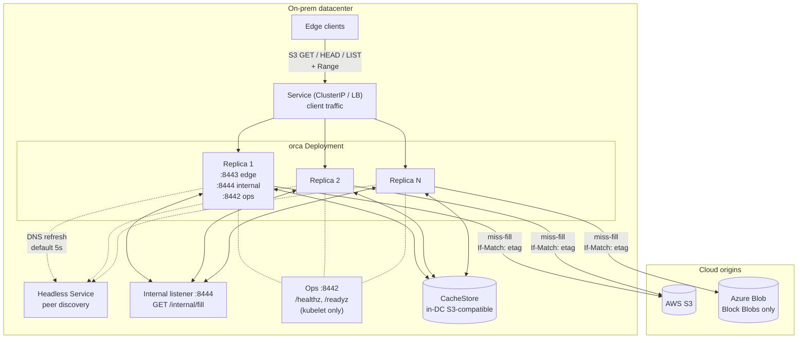
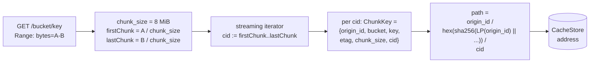
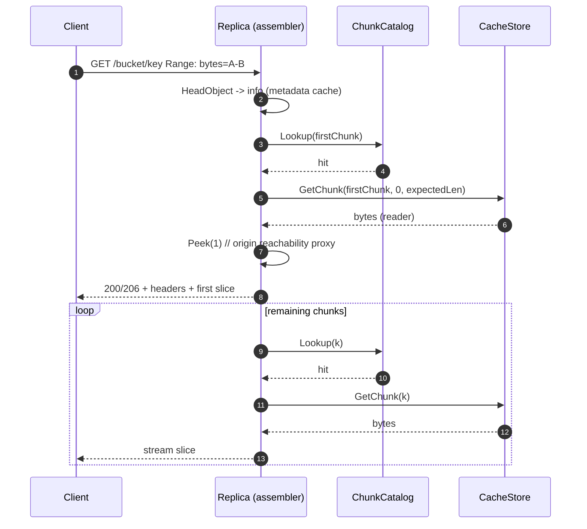
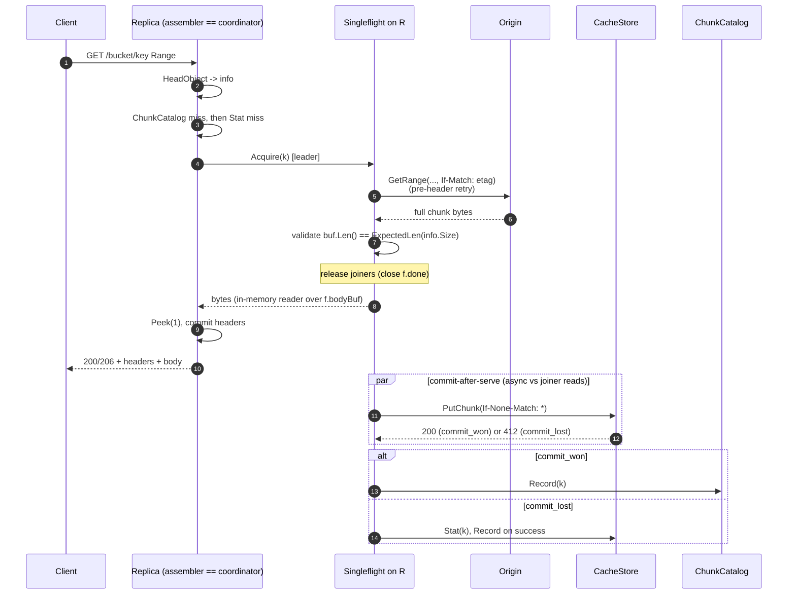
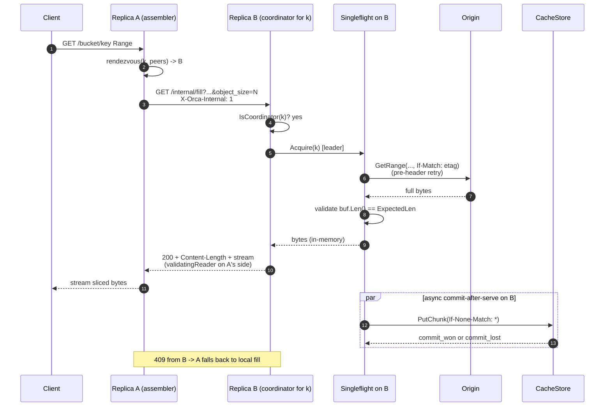
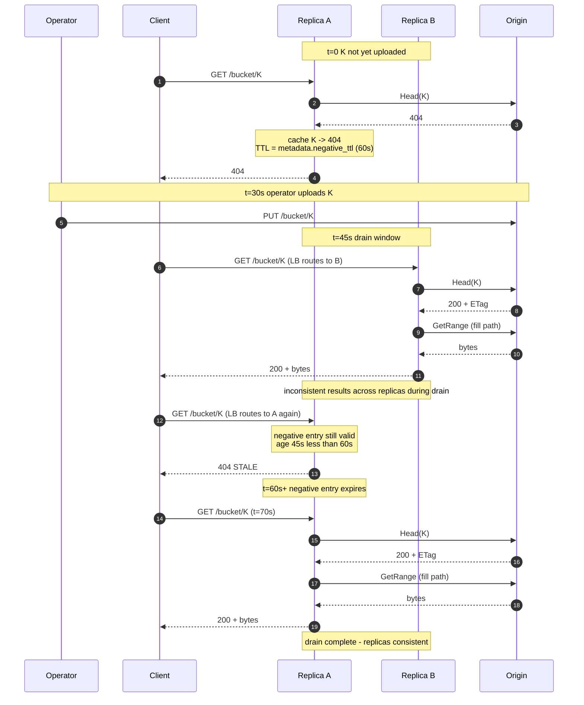
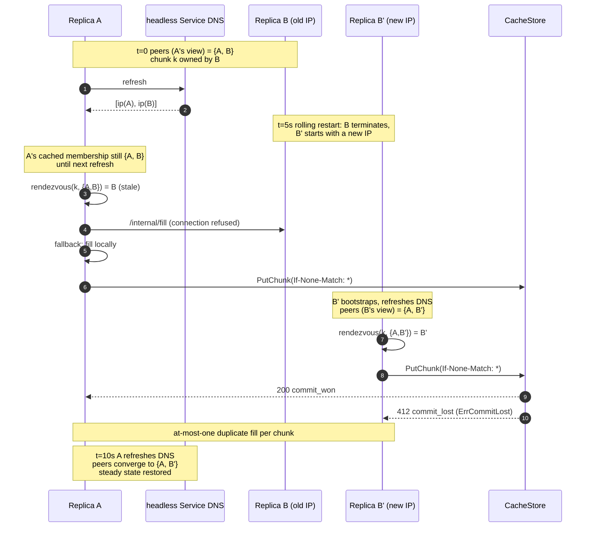

# Orca - Origin Cache - Design

A high-level reference for the Orca origin cache: what it does, how
it does it, and the load-bearing mechanisms that keep it correct
under load. This document describes the system as shipped. The
stakeholder-facing summary lives in [brief.md](./brief.md).

## Table of contents

1. [Overview](#1-overview)
2. [Decisions](#2-decisions)
3. [Terminology](#3-terminology)
4. [Architecture](#4-architecture)
5. [Chunk model](#5-chunk-model)
6. [Request flow](#6-request-flow)
7. [Stampede protection](#7-stampede-protection)
8. [Azure adapter: Block Blob only](#8-azure-adapter-block-blob-only)
9. [Concurrency, durability, correctness](#9-concurrency-durability-correctness)
10. [Bounded staleness contract](#10-bounded-staleness-contract)
11. [Create-after-404 and negative-cache lifecycle](#11-create-after-404-and-negative-cache-lifecycle)
12. [Eviction and capacity](#12-eviction-and-capacity)
13. [Horizontal scale](#13-horizontal-scale)
14. [Deferred / future work](#14-deferred--future-work)

---

## 1. Overview

Edge clients in an on-prem datacenter need read access to large
files held in cloud blob storage (AWS S3, Azure Blob). Direct
egress per client is unacceptable on cost, latency, throughput, and
security grounds. Orca is a read-only cache deployed inside the
datacenter that fronts cloud blob storage with an S3-compatible
HTTP API. Clients issue `GetObject`, `HeadObject`, and
`ListObjectsV2` requests against Orca; Orca serves from a shared
in-DC store when present and otherwise fetches from origin, commits
the result atomically, and returns it.

The unit of caching is a fixed-size chunk (default 8 MiB) keyed by
`{origin_id, bucket, object_key, etag, chunk_size, chunk_index}`.
A multi-replica Kubernetes Deployment shares one in-DC cachestore;
peer discovery comes from a headless Service and rendezvous hashing
on pod IP selects exactly one coordinator per chunk. Concurrent
cold misses for the same chunk collapse to a single origin GET via
per-replica singleflight; cross-replica deduplication comes from
the coordinator selection plus a per-chunk fill RPC on a separate
internal listener.

## 2. Decisions

| Area | Decision |
|---|---|
| Client API | S3-compatible HTTP. `GET` + `HEAD` + minimal `ListObjectsV2` (pass-through). Range reads supported. |
| Auth surface | Bearer / mTLS on the client edge and mTLS on the internal listener are configurable but the enforcement paths are not yet implemented. Dev runs both disabled. See s4 and [Deferred / future work](#14-deferred--future-work). |
| Origins | AWS S3 and Azure Blob behind a pluggable `Origin` interface. |
| Azure constraint | Block Blobs only. Page / Append blobs are rejected at `Head` with `UnsupportedBlobTypeError`. |
| Cachestore | S3-compatible in-DC store (`cachestore/s3`). LocalStack in dev, VAST or another S3-compatible object store in production. Treated as the source of truth for chunk presence. |
| Atomic commit | `PutObject` with `If-None-Match: *`. The second concurrent commit gets `412 Precondition Failed` and is recorded as `ErrCommitLost`. `SelfTestAtomicCommit` runs at boot and refuses to start on backends that don't honor the precondition. |
| Versioned cachestore buckets | Not supported. `GetBucketVersioning` runs at boot; `Enabled` or `Suspended` versioning fails startup. VAST and several S3-compatible backends do not honor `If-None-Match: *` on versioned buckets, which would silently degrade the atomic-commit primitive. |
| Chunking | Fixed 8 MiB default (`chunking.size`). `chunk_size` is folded into the path hash so a runtime config change does not corrupt or shadow existing data. Minimum 1 MiB enforced at config validation. |
| Consistency | Origin objects are immutable per operator contract: an `(origin_id, bucket, key)` never has its bytes modified once published; replacement must be a new key. `ETag` is identity, not freshness. `If-Match: <etag>` is sent on every `Origin.GetRange` as defense-in-depth. Bounded staleness uses asymmetric TTLs: `metadata.ttl` (default 5m) on positive entries; `metadata.negative_ttl` (default 60s) on negative entries. See [s10](#10-bounded-staleness-contract). |
| ETag presence | Origins MUST return non-empty ETags on `Head`. The fetch coordinator rejects empty ETags via `origin.MissingETagError` because `chunk.Path`'s hash encodes the ETag; without one, distinct versions of `(bucket, key)` would alias to the same path and silently serve stale bytes. |
| Catalog | In-memory `ChunkCatalog` LRU recording chunks known to be in the cachestore. Presence-only (no `Info` payload). Bounded by `chunk_catalog.max_entries` (default 100,000). |
| Cluster | Kubernetes Deployment + headless Service for peer discovery + ClusterIP / LB for client traffic. Rendezvous hashing on pod IP selects the coordinator per `ChunkKey` for miss-fills; the receiving replica is the **assembler** that fans per-chunk fill RPCs out to coordinators. All replicas can read all chunks directly from the cachestore on hits. |
| Internal-listener auth | Config plumbing for mTLS is in place (`cluster.internal_tls.*`); enforcement is stubbed. Dev runs with `cluster.internal_tls.enabled: false`. |
| Origin concurrency cap | Per-replica token bucket sized `floor(origin.target_global / cluster.target_replicas)`. Default `target_global=192`, `target_replicas=3`, giving 64 slots per replica. Throttling responses (503 SlowDown, 429, retryable 5xx) are handled by the leader's pre-header retry loop with exponential backoff. |
| Tenancy | Single tenant, single origin credential set. |
| Listeners | Three: edge `:8443`, internal-fill `:8444`, ops `:8442` (`/healthz`, `/readyz`). All plain HTTP in dev. |
| Repo home | This repo. Code lives under `internal/orca/`, manifests under `deploy/orca/`, dev harness under `hack/orca/`. |

## 3. Terminology

- **Replica** - one running pod of the `orca` Deployment. Stateless
  apart from in-memory caches; replicas are interchangeable.
- **Client** - external caller using an S3-compatible HTTP API.
- **Origin** - upstream cloud blob store (AWS S3 or Azure Blob).
  Read-only from the cache's perspective. Interface in
  `internal/orca/origin/origin.go`.
- **CacheStore** - the in-DC chunk store, shared by all replicas.
  Source of truth for chunk presence. Implementation is
  `cachestore/s3` (in-DC S3-compatible object store). Interface in
  `internal/orca/cachestore/cachestore.go`; commit semantics in
  [s9](#9-concurrency-durability-correctness).
- **Chunk** - a fixed-size byte range of an origin object (default
  8 MiB). Unit of caching and fill.
- **ChunkKey** - the immutable identifier for a chunk:
  `{origin_id, bucket, object_key, etag, chunk_size, chunk_index}`.
  See [s5](#5-chunk-model).
- **Headless Service** - Kubernetes Service with `clusterIP: None`;
  the DNS A-record resolves to the IPs of all Ready pods. We poll
  it (default every 5s) to discover the current peer set.
- **Rendezvous hashing** (a.k.a. HRW) - for a given key, score
  each peer with `hash(peer_ip || key)` and pick the argmax. Stable
  under membership changes that don't add or remove the winning
  peer. We use it to pick exactly one coordinator per chunk.
- **Coordinator** - the replica that rendezvous hashing selects to
  perform the miss-fill for a particular chunk. Ownership is per
  chunk, not per request and not per object.
- **Assembler** - the replica that received the client request. It
  iterates the requested byte range chunk by chunk, reading hits
  directly from the cachestore and routing misses to each chunk's
  coordinator (either locally or via the internal-fill RPC).
- **Singleflight** - per-`ChunkKey` in-process deduplication.
  Concurrent fills for the same key share one origin GET. The first
  arrival is the leader; subsequent arrivals are joiners. See
  [s7.1](#71-per-chunkkey-singleflight).
- **Per-chunk internal fill RPC** - `GET /internal/fill?<chunk-key
  params>` over plain HTTP on the internal listener (default
  `:8444`). Issued by the assembler to a non-self coordinator.
- **Atomic CacheStore commit** - the no-clobber publish step that
  ends a fill. `PutObject` with `If-None-Match: *`; the second
  concurrent commit gets `412` and is recorded as `ErrCommitLost`.
- **Immutable-origin contract** - the operator promise that an
  `(origin_id, bucket, key)` never has its bytes modified once
  published. Bounded staleness window on violation is
  `metadata.ttl`. See [s10](#10-bounded-staleness-contract).
- **Pre-header retry** - the leader's bounded retry of
  `Origin.GetRange` before any HTTP response header is sent.
  Defaults: 3 attempts, 5s total. `OriginETagChangedError` is
  non-retryable.
- **Negative-cache entry** - a metadata-cache entry recording
  `404 NotFound`, `UnsupportedBlobTypeError`, or `MissingETagError`.
  Reused for `metadata.negative_ttl` (default 60s).
- **S3 versioning gate** - boot-time `GetBucketVersioning` check on
  `cachestore/s3` that fails startup if the bucket has versioning
  enabled or suspended.
- **MissingETagError** - returned by the fetch coordinator when the
  origin's Head response carries an empty ETag. Surfaces as 502
  `OriginMissingETag` and is negatively cached.

## 4. Architecture

A single binary, `orca`, deployed as a Kubernetes Deployment.
Replicas discover each other through a headless Service and refresh
the peer set on a configurable interval (`cluster.membership_refresh`,
default 5s). A request from a client lands on one replica (the
**assembler**), which iterates the requested byte range chunk by
chunk. For each `ChunkKey`, the assembler reads directly from the
shared cachestore on a hit; on a miss it routes to the chunk's
coordinator (selected by rendezvous hashing on the current peer-IP
set) for a singleflight fill. The coordinator may be the assembler
itself (local fill) or a different replica (cross-replica fill via
the internal-fill RPC). Single tenant. One origin credential set per
deployment.

The runtime exposes three HTTP listeners:

- **Edge (`:8443`)**: the S3-compatible client API. Auth hooks
  are present in config but the enforcement path is stubbed; dev
  runs with `server.auth.enabled: false`.
- **Internal-fill (`:8444`)**: serves `GET /internal/fill` for
  per-chunk fill RPCs between replicas. Plain HTTP in dev
  (`cluster.internal_tls.enabled: false`).
- **Ops (`:8442`)**: serves `/healthz` (always 200 while the
  process is up) and `/readyz` (200 once the cachestore self-test
  has passed AND the cluster has loaded an initial peer-set
  snapshot). Plain HTTP, no auth. Production manifests wire kubelet
  probes to this listener; client Service objects do not expose it.

### Diagram 1: System overview



## 5. Chunk model

- `ChunkKey = {origin_id, bucket, object_key, etag, chunk_size,
  chunk_index}`.
  - `origin_id` is a deployment-scoped identifier from config (e.g.
    `aws-us-east-1-prod`, `azure-eastus-research`). Required.
    Namespaces cache-key derivation and the on-store path so two
    deployments can safely share a cachestore bucket.
  - `etag` captures immutability. A new ETag is treated as a new
    logical object and produces a fresh set of chunks. Old chunks
    age out via the cachestore's lifecycle policy (see
    [s12](#12-eviction-and-capacity)).
  - `chunk_size` is folded into the path hash so a runtime config
    change does not silently corrupt or shadow existing data.
- `chunk_index = floor(byte / chunk_size)`.
- A small metadata cache holds `(origin_id, bucket, key) -> ObjectInfo`
  with a TTL (default 5m positive, 60s negative). Avoids re-`HEAD`ing
  on every request.

Path derivation is deterministic and canonical:

```
LP(s)   = LE64(uint64(len(s))) || s
hashKey = sha256(
            LP(origin_id) ||
            LP(bucket)    ||
            LP(key)       ||
            LP(etag)      ||
            LE64(chunk_size)
          )
path    = "<origin_id>/<hex(hashKey)>/<chunk_index>"
```

`origin_id` appears in the path in the clear (and `chunk_size` is
folded into the hash, not the path) so operators can run per-origin
lifecycle policies and target a specific deployment with
`aws s3 rm --recursive <bucket>/<origin_id>/`.

**Operational note: changing `chunk_size`.** Because `chunk_size` is
folded into the path hash, changing it in deployment config never
corrupts or shadows existing chunks; old-sized chunks remain valid
byte ranges of the old logical layout but are no longer addressable.
Operators should plan for transient storage doubling and a
cold-period origin-cost spike when changing `chunk_size` on a hot
working set: the working set is rebuilt at the new size on demand
while the old set ages out via the cachestore lifecycle policy.

Whether a chunk is present is answered by `CacheStore.Stat(key)`.
An in-memory `ChunkCatalog` LRU memoizes recent positive lookups so
the hot path never touches the cachestore for presence. The catalog
is purely a hot-path optimization; it can be dropped at any time
without affecting correctness. The catalog stores no per-entry
metadata (no size, no access counters): chunk.Path encodes
`chunk_size` and ETag, so a path hit means the cachestore contains
bytes for this exact version of this chunk. A stale entry whose
backing bytes have been deleted self-heals: `GetChunk` returns
`ErrNotFound`, the caller `Forget`s the entry, and the next request
re-stats the cachestore.

For a request `Range: bytes=A-B`:

```
firstChunk = A / chunk_size
lastChunk  = B / chunk_size
for cid := firstChunk; cid <= lastChunk; cid++ {
    fetchOrServe(cid)
    sliceWithin(cid, max(A, cid*sz), min(B, (cid+1)*sz - 1))
}
```

The chunk loop is a streaming iterator: at no point is the full
`[]ChunkKey` for the range materialized into a slice.

### Diagram 2: Range request -> chunk index mapping



## 6. Request flow

1. `GET /{bucket}/{key}` arrives with optional `Range`.
2. The edge handler delegates HEAD to `fetch.Coordinator.HeadObject`,
   which checks the metadata cache and on miss runs the per-replica
   HEAD singleflight (`metadata.LookupOrFetch`). The coordinator
   rejects responses with an empty `ETag` via `MissingETagError`
   and negatively caches the rejection. Positive entries are reused
   for `metadata.ttl`; negative entries (`ErrNotFound`,
   `UnsupportedBlobTypeError`, `MissingETagError`) for
   `metadata.negative_ttl`.
3. If `info.Size == 0`, return 200 + empty body immediately (any
   `Range` header on a zero-byte object returns 416). Otherwise
   parse the optional `Range` header against `info.Size`; an
   unsatisfiable range returns 416.
4. Compute `firstChunk` and `lastChunk` via `chunk.IndexRange`.
5. **Fetch the first chunk before committing response headers.**
   `fc.GetChunk(firstKey, info.Size)` returns a reader; the handler
   wraps it in a `bufio.Reader` and `Peek(1)`s. If the peek errors
   (origin unreachable, auth, etag changed, missing etag), the
   handler emits a clean S3-style error response without ever
   writing the 200 / 206 status. Once the first byte is in hand,
   the handler commits headers (`Content-Length`, optional
   `Content-Range`, `ETag`, `Content-Type`) and starts streaming.
6. Stream the first chunk's slice. Subsequent chunks 1..N are
   fetched and streamed serially. A failure on any chunk after
   headers are committed is a mid-stream abort: the response
   terminates with a partial body, and S3 SDKs detect the
   `Content-Length` mismatch and retry.
7. Per chunk, `fc.GetChunk` first checks the catalog and the
   cachestore. On a hit, it returns a reader over the cachestore
   bytes clamped to the chunk's `ExpectedLen(info.Size)`. On a
   miss, the coordinator runs the cluster-wide dedup path
   ([s7.3](#73-cluster-wide-deduplication-via-per-chunk-fill-rpc)).
8. **Cold-path fill.** The leader issues `Origin.GetRange` with
   bounded pre-header retry, validates the response body length
   against `ExpectedLen`, buffers it in memory, releases joiners,
   and commits to the cachestore in the background (commit-after-
   serve, [s7.2](#72-singleflight--commit-after-serve)).

### Diagram 3: Scenario A - warm read (cache hit)



### Diagram 4: Scenario B - cold miss, local coordinator



### 6.1 HEAD request flow

`HEAD /{bucket}/{key}` is served entirely from object metadata; no
chunk lookup is performed.

1. The edge handler calls `fc.HeadObject`. Metadata cache hit returns
   the cached `ObjectInfo`. On miss, the per-replica HEAD
   singleflight issues `Origin.Head`.
2. On success, return 200 OK with `Content-Length: info.Size`,
   `ETag: info.ETag`, `Content-Type: info.ContentType`,
   `Accept-Ranges: bytes`.
3. Negative cases reuse the GET error mapping (s6.2): 404 negatively
   cached for `metadata.negative_ttl`; `UnsupportedBlobTypeError`
   surfaces as 502 `OriginUnsupported` and is negatively cached;
   `MissingETagError` surfaces as 502 `OriginMissingETag` and is
   negatively cached.

### 6.2 LIST request flow

`GET /{bucket}/?list-type=2&prefix=...` is a thin pass-through to
`Origin.List`. The handler parses `prefix`, `continuation-token`,
and `max-keys` from the query string, calls the origin, and
serializes the result as a minimal `ListBucketResult` XML body.

This is intentionally narrow. A per-replica TTL'd LIST cache sized
for the FUSE-`ls` workload is in scope as future work; see
[Deferred / future work](#14-deferred--future-work).

### 6.3 HTTP error-code mapping

| Status | S3-style code | Reason | Triggered by | Client retry? |
|---|---|---|---|---|
| 200 / 206 | (none) | normal hit or successful fill | hit + range OK; cold-path fill after pre-header-retry commit | n/a |
| 404 | `NoSuchKey` | origin returned `ErrNotFound` (negatively cached) | edge HEAD / GET miss | no |
| 416 | (text body) | range vs. `info.Size` violation | range math at request entry; or any Range header against a zero-byte object | no (different range) |
| 502 | `OriginUnsupported` | non-BlockBlob azureblob; surfaces from `UnsupportedBlobTypeError` (negatively cached) | `Origin.Head` returns unsupported blob type | no |
| 502 | `OriginETagChanged` | `OriginETagChangedError` from `Origin.GetRange`; non-retryable | mid-flight overwrite caught by `If-Match` | yes (next request re-Heads) |
| 502 | `OriginMissingETag` | `MissingETagError` from the fetch coordinator (negatively cached) | origin Head returned empty ETag | no (operator must fix origin config) |
| 502 | `Unauthorized origin` | `origin.ErrAuth` | origin returned 401 / 403 | no (operator) |
| 502 | `OriginUnreachable` | uncategorised origin error (5xx, timeouts past retry budget, DNS) | leader retry budget exhausted; cachestore failure during read | yes (origin may recover) |
| 503 | (probe response) | replica NotReady | `/readyz` failing predicates | n/a (LB drain) |
| (mid-stream abort) | n/a | post-header-commit failure | origin disconnect, peer 5xx, cachestore failure after `Peek(1)` succeeded | S3 SDKs detect via Content-Length mismatch and retry |

Pre-header errors are returned via `http.Error` (text body). The
zero-byte and range-math 416 path is also text. There is no
per-error S3-style XML envelope in the current implementation;
S3 SDKs accept the text body and the HTTP status code is the load-
bearing signal. Mid-stream aborts terminate the response (HTTP/2
`RST_STREAM` or HTTP/1.1 `Connection: close`).

## 7. Stampede protection

The hot path. Two layers:

1. **Per-replica singleflight** on `ChunkKey`: concurrent local
   misses for the same chunk collapse to one origin GET via the
   leader.
2. **Cluster-wide deduplication** via rendezvous hashing: across
   replicas, exactly one replica is the coordinator for any given
   `ChunkKey` at any time, so concurrent misses from different
   assemblers converge on the same leader through the internal-
   fill RPC.

The named seams these mechanisms run through:

| Seam | File | Role |
|---|---|---|
| `origin.Origin` | `internal/orca/origin/origin.go` (interface); `internal/orca/origin/awss3/`, `internal/orca/origin/azureblob/` | Read-only adapter to the upstream blob store. `If-Match: <etag>` on every `GetRange`. |
| `cachestore.CacheStore` | `internal/orca/cachestore/cachestore.go` (interface); `internal/orca/cachestore/s3/` | In-DC chunk store; source of truth for chunk presence. `PutChunk` is atomic + no-clobber (returns `ErrCommitLost` on conflict). |
| `chunkcatalog.Catalog` | `internal/orca/chunkcatalog/chunkcatalog.go` | Bounded in-memory LRU recording chunks known to be in the cachestore. Presence-only. |
| `cluster.Cluster` | `internal/orca/cluster/cluster.go` | Peer discovery (DNS), rendezvous hashing, internal-fill RPC client + response validator. |
| `fetch.Coordinator` | `internal/orca/fetch/fetch.go` | Per-replica fill orchestrator. Owns the singleflight, the origin semaphore, and the pre-header retry loop. |

### 7.1 Per-`ChunkKey` singleflight

`fetch.Coordinator` maintains `inflight: map[string]*fill` keyed
on `chunk.Key.Path()`, guarded by a mutex. Each `*fill` carries a
`done` channel, an error slot, and an in-memory body buffer
populated by the leader on success.

The acquire path takes the lock, either inserting a new `*fill`
(this caller becomes leader and spawns `runFill` in a goroutine)
or returning the existing entry (joiner).

Joiners then `select` on their request context and `<-f.done`. On
release they read `f.err` (if non-nil) or wrap `f.bodyBuf.Bytes()`
in a `bytes.Reader` and return it. The leader's `runFill`
guarantees the buffer is fully populated and length-validated
before `close(f.done)`, so joiners' reads never observe a torn
buffer.

The leader removes the inflight entry in its terminating defer.
A request arriving after that point misses the inflight map
entirely; if the chunk has by then been committed and recorded,
that request takes the catalog-hit path and reads from the
cachestore.

### 7.2 Singleflight + commit-after-serve

The leader's `runFill`:

1. Runs on a 5-minute detached context (not the requesting
   client's context) so the cachestore commit completes even if
   every caller disconnects mid-stream. The 5-minute ceiling
   bounds the cost of a no-readers fill.
2. Acquires a slot on the per-replica origin semaphore
   (`originSem`, capacity `floor(target_global / target_replicas)`).
   Acquisition has a wait budget of `origin.queue_timeout` (default
   5s); timeout returns `origin: queue timeout` to the caller.
3. Issues `Origin.GetRange(off, expectedLen)` via `fetchWithRetry`
   (pre-header retry: 3 attempts, 5s total, exponential backoff
   capped at 2s). `OriginETagChangedError` and `origin.ErrNotFound`
   are non-retryable.
4. `io.Copy`s the origin body into a fresh `bytes.Buffer`.
5. **Validates** `buf.Len() == k.ExpectedLen(objectSize)`. A short
   body is a hard error: short-recorded chunks would silently
   poison the catalog (B1 in the review history), so the leader
   refuses to commit, returns an error to joiners, and lets the
   next request retry.
6. Stores `f.bodyBuf = buf` and **releases joiners** (close of
   `f.done` via a `sync.Once`-wrapped `release` helper) BEFORE the
   `PutChunk` RPC.
7. Issues `cachestore.PutChunk(k, buf.Len(), bytes.NewReader(buf.Bytes()))`.
   The cachestore driver uses `PutObject` with `If-None-Match: *`.
8. On `nil` -> `Record` the chunk in the catalog.
9. On `ErrCommitLost` (412 from cachestore) -> another replica
   won the race; Stat the existing entry and Record on success.
10. On any other error -> log the failure, do NOT Record, do NOT
    surface to the client (response is already complete). The
    next request for this chunk will refill (one extra origin
    GET worst case).

The commit-after-serve ordering matters for cold-path TTFB: joiners
get bytes as soon as origin delivered them. Without the reorder,
joiners would have to wait both the origin RTT and the cachestore
commit RTT before seeing data.

The buffer-after-validate-then-release-then-commit sequence is
safe because `bytes.Buffer`'s internal slice is no longer mutated
after `io.Copy` returns; joiners' concurrent reads of
`buf.Bytes()` and `PutChunk`'s concurrent read of the same slice
are both pure reads of an immutable region.

The leader does NOT use a tee or a local-disk spool. The full
chunk is buffered in memory; peak per-fill heap is one
`chunk_size` allocation (8 MiB by default). With the per-replica
origin cap at 64, that's a ~512 MiB worst-case footprint per
replica under saturation.

### 7.3 Cluster-wide deduplication via per-chunk fill RPC

Rendezvous hashing on `ChunkKey` against the current pod-IP set
selects one coordinator per chunk. The replica that received the
client request is the **assembler**. For each chunk in the
requested range:

- **Hit** (catalog or `Stat` says present): assembler reads from
  the cachestore directly. No internal RPC.
- **Miss + `Coordinator(k) == self`**: assembler runs the local
  singleflight ([s7.1](#71-per-chunkkey-singleflight)) and commits
  ([s7.2](#72-singleflight--commit-after-serve)).
- **Miss + `Coordinator(k) != self`**: assembler issues
  `GET /internal/fill?<chunk-key params>` to the coordinator on
  the coordinator's internal listener
  ([s7.4](#74-internal-rpc-listener)). The coordinator runs the
  singleflight + commit path locally and streams the chunk bytes
  back. The assembler stitches returned bytes into the client
  response, slicing the first and last chunk to match the
  client's `Range`.

**Loop prevention**: the assembler sets `X-Orca-Internal: 1` on
internal RPCs. The internal handler checks
`Cluster.IsCoordinator(k)`; on disagreement (membership flux), it
returns 409 with `{"reason":"not_coordinator"}`. `FillFromPeer`
recognises 409 as `cluster.ErrPeerNotCoordinator` and the caller
falls back to local fill for that chunk (one duplicate fill
possible during flux; the loser's commit returns
`ErrCommitLost`). Receivers MUST NOT chain forward internal RPCs.

**Wire format**: `GET /internal/fill?origin_id=...&bucket=...&key=...&etag=...&chunk_size=N&index=N&object_size=N`.
`DecodeChunkKey` enforces `chunk_size > 0`, `index >= 0`,
`object_size > 0`, and presence of `origin_id` and `key`.
Malformed requests return 400.

**Response framing**: the coordinator sets `Content-Length:
ExpectedLen(objectSize)` and `Content-Type: application/octet-stream`.
`FillFromPeer` wraps the response body in a `validatingReader`
that asserts the actual byte count matches the advertised
`Content-Length` and returns `io.ErrUnexpectedEOF` otherwise.
This detects truncated cross-replica responses.

### Diagram 5: Scenario D - cold miss, remote coordinator



### 7.4 Internal RPC listener

Per-chunk fill RPCs are served on a separate listener bound to a
distinct port (default `:8444`, config `cluster.internal_listen`).
This isolates inter-replica traffic from the client edge.

In dev the listener is plain HTTP/2 with no mTLS
(`cluster.internal_tls.enabled: false`). Config plumbing for mTLS
exists - `cluster.internal_tls.{enabled, cert_file, key_file,
ca_file, server_name}` - but the enforcement path is not yet
wired. Production deployments today rely on Kubernetes
NetworkPolicy or equivalent network isolation, not on TLS at the
listener.

Loop prevention: the listener enforces `X-Orca-Internal: 1` plus a
membership self-check (`Cluster.IsCoordinator(k)`); on disagreement
it returns 409.

The listener's authorization scope is intentionally narrow: it
serves `GET /internal/fill` only. Health and readiness probes live
on the ops listener (`:8442`); the client S3 API lives on the edge
listener (`:8443`).

### 7.5 Metadata-layer singleflight

Same pattern at the metadata cache: `metadata.LookupOrFetch` maps
each `(origin_id, bucket, key)` to a per-replica singleflight
entry so a flood of distinct cold keys generates at most one
`Origin.Head` per object per replica per `metadata.ttl` window.
The cluster-wide bound is N HEADs per object per window (N =
peer count); a cluster-wide HEAD coordinator is future work.

The singleflight entry is deleted from the map BEFORE its `done`
channel is closed, so a concurrent caller arriving in the narrow
window between delete and close creates a fresh entry and runs
its own fetch. The result is that the fix for the original stale-
entry race accepts at worst one duplicated HEAD per miss
completion under contention, in exchange for never replaying a
transient error.

### 7.6 Cancellation safety

The leader's `runFill` runs on a 5-minute detached context so it
finishes regardless of caller disconnects. The per-replica origin
slot is released when `runFill` returns. Joiners cancelling unblock
only themselves (they `select` between their own ctx and
`f.done`).

If the leader's context cancels (its 5-minute ceiling fires) the
fill fails for joiners too, but at worst one fill's worth of
work is wasted; the next request triggers a fresh fill.

### 7.7 Failure handling without re-stampede

- **Retryable origin error during pre-header retry**: the leader
  retries up to `origin.retry.attempts` (default 3) within
  `origin.retry.max_total_duration` (default 5s) with exponential
  backoff (`origin.retry.backoff_initial=100ms`,
  `origin.retry.backoff_max=2s`). The retry happens before any
  HTTP response header is sent, so the client never observes the
  transient failure. Budget exhaustion surfaces as 502
  `OriginUnreachable`.
- **`OriginETagChangedError`**: non-retryable. The leader
  invalidates the metadata cache entry for
  `(origin_id, bucket, key)` and surfaces the error; the next
  request re-Heads, observes the new ETag, derives a new
  `ChunkKey` and a fresh path.
- **`origin.ErrNotFound`**: non-retryable. Cached negatively for
  `metadata.negative_ttl`; surfaces as 404 to the client.
- **`UnsupportedBlobTypeError` / `MissingETagError`**: non-
  retryable. Cached negatively; surfaces as 502 with the
  corresponding code.
- **Short body from origin**: hard error.
  `runFill` rejects `buf.Len() != ExpectedLen(objectSize)`; the
  fill fails, joiners see the error, the catalog is not recorded.
  This is the load-bearing defense against catalog poisoning.
- **Commit-after-serve failure** (`PutChunk` returns a non-
  `ErrCommitLost` error after joiners have been released): the
  failure does NOT propagate to the client (the response is
  already done). The chunk is not Recorded; the next request for
  the same `ChunkKey` re-runs the fill. Sustained failure rate
  is a cachestore-health concern, observable today only via
  structured debug logs.
- **CacheStore typed errors during read** (`ErrTransient`,
  `ErrAuth`): surface to the client as 502. No automatic refill
  (would amplify load against a degraded backend).

## 8. Azure adapter: Block Blob only

- Enforced in `internal/orca/origin/azureblob.Head`. Block type is
  immutable on an existing blob, so checking once per
  `(container, blob, etag)` is sufficient.
- Detection via `Get Blob Properties` -> `BlobType` field. Reject
  anything other than `BlockBlob` with
  `origin.UnsupportedBlobTypeError`.
- Surfaced to clients as HTTP 502 with text body
  `OriginUnsupported: <details>`.
- Negatively cached in the metadata cache for
  `metadata.negative_ttl`.
- `Origin.GetRange` on the azureblob adapter uses `If-Match:
  "<etag>"` (quoted per RFC 7232) on the underlying Get Blob;
  `412 Precondition Failed` is translated to
  `OriginETagChangedError`.
- The driver's `List` filters non-BlockBlob entries while
  preserving continuation tokens.

## 9. Concurrency, durability, correctness

### 9.1 Atomic commit

The leader publishes a chunk to the cachestore atomically and
no-clobber via `PutObject + If-None-Match: *`. The second
concurrent commit for the same key gets HTTP 412 and is recorded
as `ErrCommitLost`. The atomic-commit primitive guarantees that
two replicas filling the same chunk race for a single winner; the
loser treats the existing object as the source of truth.

Cold-path commit is asynchronous from the joiner's perspective
([s7.2](#72-singleflight--commit-after-serve)): joiners are
released when the validated bytes are in the leader's buffer, and
the `PutChunk` RPC runs in parallel with their reads. A failure
in commit-after-serve is invisible to the client; the chunk
simply isn't Recorded and the next request refills.

**Startup self-test** (`SelfTestAtomicCommit`): on driver init the
`cachestore/s3` driver writes a probe key, then attempts a second
`PutObject(probe_key, ..., If-None-Match: "*")` and asserts a 412
response. If the backend returns 200 instead (silently
overwrites), the driver fails to start. This prevents silent
double-writes on backends that don't implement the precondition.
Verified backends: AWS S3 (since 2024-08), MinIO, VAST Cluster
(non-versioned buckets only).

**Startup versioning gate**: the driver also issues
`GetBucketVersioning(bucket)` at boot. If versioning is `Enabled`
or `Suspended`, the driver fails to start with a clear error.
VAST and other S3-compatible backends do not honor
`If-None-Match: *` on versioned buckets, which would silently
break the atomic-commit primitive.

### 9.2 Typed cachestore errors

`CacheStore` returns four sentinel errors (see
`internal/orca/cachestore/cachestore.go`); the cache layer
honors them distinctly:

- `ErrNotFound`: chunk is absent. Triggers the miss-fill path.
- `ErrCommitLost`: another writer won the no-clobber race. The
  leader Stats the existing entry and Records on success.
- `ErrTransient` (5xx, timeout, throttle): surfaces as 502 to the
  client. Does NOT trigger refill.
- `ErrAuth` (401 / 403): surfaces as 502 to the client.

Production callers map these via `errors.Is`. The drivers' error
mapping (`cachestore/s3` and the origin drivers) is HTTP-status-
based, not substring-based; the AWS / Azure SDKs surface
`*awshttp.ResponseError` and equivalent typed errors that the
drivers introspect on `StatusCode`.

### 9.3 Range, sizes, and edge cases

- Partial last chunk of an object is stored at its actual size;
  `chunk.Key.ExpectedLen(info.Size)` computes the authoritative
  length and the leader rejects origin responses that don't match.
- `Range` requests are validated against `info.Size` before any
  cache lookup; an unsatisfiable range returns 416.
- Zero-byte objects short-circuit to 200 + empty body. Any Range
  header against a zero-byte object is 416 (RFC 7233).
- The `cachestore/s3.PutChunk` driver validates the input
  reader's length: for seekable readers (`io.ReadSeeker`), it
  probes the length via `Seek(0, SeekEnd)`; for non-seekable
  readers, it asserts post-write that the bytes-read counter
  matches the declared size. Either path errors before any S3
  RPC if the size disagrees.

### 9.4 Readiness probe (`/readyz`)

The ops listener (`:8442`) serves `/healthz` (unconditional 200
while the process is running) and `/readyz` (200 only when ready,
503 otherwise). Production manifests wire kubelet probes to this
listener.

`/readyz` returns 200 when BOTH:

1. The cachestore self-test has passed
   (`SelfTestAtomicCommit`), OR the operator passed
   `app.WithSkipCachestoreSelfTest` (test-only).
2. The cluster has loaded an initial peer-set snapshot
   (`Cluster.HasInitialSnapshot`).

Both conditions latch sticky-true once satisfied; transient
peer-set churn after the initial load does not flap readiness.
A totally broken DNS path that never produces a snapshot keeps
the replica `NotReady` and load balancers drain it.

`/healthz` is intentionally trivial: it lets operators distinguish
process-alive from ready-to-serve. A misconfigured replica can
sit `NotReady` indefinitely without being restarted, leaving its
logs available for inspection.

The ops listener has no auth and is not exposed via the client
Service; production manifests bind it only for the kubelet's
direct probe.

## 10. Bounded staleness contract

Orca trusts an operator contract for correctness, and bounds the
consequences of contract violation by configuration.

### 10.1 The contract and the staleness window

**The contract.** For a given `(origin_id, bucket, object_key)`,
the underlying bytes are immutable for the life of the key. If
the data changes, operators MUST publish it under a new key.
Replacement in place is a contract violation.

**Why we trust it.** Cache-key derivation includes the origin
`ETag` (s5), and a new ETag deterministically yields a new
`ChunkKey` and a fresh chunk path on the cachestore. As long as
the contract holds, the cache cannot serve stale bytes: every
change of identity is a change of key.

**What happens if the contract is violated.** The cache may
serve the old bytes for up to one `metadata.ttl` window (default
5m). Mechanism:

- Object metadata (`size`, `etag`, `content_type`) is cached for
  `metadata.ttl` to avoid re-`HEAD`ing on every request.
- During that window, requests resolve to the old `etag`, derive
  the same `ChunkKey`, and serve from cached chunks.
- After the window expires, the next request triggers a fresh
  `Head`, observes the new ETag, derives a new `ChunkKey`, and
  refills.

**Why this is acceptable.** The intended workload is large
immutable artifacts (job inputs, model weights, training shards).
The contract matches how those are produced. The 5m window is a
tunable upper bound, not a typical case: a flood of distinct cold
keys reads the correct ETag on first contact with the cache.

**Defense in depth.** `If-Match: <etag>` is sent on every
`Origin.GetRange`. If an in-flight fill races with an in-place
overwrite, the origin returns 412 `PreconditionFailed` and the
leader fails the fill, invalidates the metadata cache entry for
`(origin_id, bucket, key)`. This catches the narrow window where
a violation happens between the cache's `Head` and its
`GetRange`. It does NOT catch a violation that happens between
two complete request lifecycles within the same `metadata.ttl`
window; the `metadata.ttl` cap is what bounds that case.

## 11. Create-after-404 and negative-cache lifecycle

### 11.1 The scenario

A client GETs a key `K` before the operator has uploaded it. The
cache observes 404 from `Origin.Head(K)`, records a negative
metadata-cache entry, and returns 404 to the client. The operator
then uploads `K`. Subsequent client requests still see 404 until
the negative entry expires - the "we forgot to upload that" case.

This is operationally indistinguishable from a contract violation
(s10): from the client's perspective, the bytes for `K` changed
without the cache being told. Event-driven origin invalidation is
out of scope; the cache can only bound how long it serves the
stale 404.

### 11.2 Asymmetric TTLs

The metadata cache uses two TTLs:

| TTL | Default | Bounds | Rationale |
|---|---|---|---|
| `metadata.ttl` | 5m | positive entry (`200` + ETag) reuse without re-Head | immutable-origin contract; long TTL keeps HEAD load low |
| `metadata.negative_ttl` | 60s | negative entry (`404`, `UnsupportedBlobTypeError`, `MissingETagError`) reuse without re-Head | operator "oops upload" recovery should be fast |

Asymmetric defaults reflect asymmetric operational reality:
positive-entry staleness only matters on contract violation;
negative-entry staleness matters every time an operator uploads a
previously-missing key, which is a normal operational event.

The per-replica HEAD singleflight (s7.5) caps the HEAD load that a
short negative TTL would otherwise create: a flood of distinct
missing keys generates at most one HEAD per object per replica
per `metadata.negative_ttl` window. At default settings (60s, 3
replicas), origin sees at most 3 HEADs per missing key per
minute, well under any documented S3 / Azure HEAD rate limit.

### 11.3 Worst-case unavailability window

After an operator uploads a previously-missing key:

- A replica that observed the original 404 keeps serving 404 for
  up to `metadata.negative_ttl` from its OWN observation time,
  regardless of when the upload happened. The TTL is
  observation-anchored, not upload-anchored.
- A replica that did NOT observe the 404 will Head fresh on the
  first request after the upload and serve 200 immediately.
- Worst case across replicas: `metadata.negative_ttl` after the
  LATEST replica's observation of the old 404. Under round-robin
  load balancing, clients can see alternating 404 / 200 responses
  during the drain window.

There is no active invalidation: neither event-driven (origin-
pushed) nor an admin-invalidation RPC. Operator workaround: wait
`metadata.negative_ttl` after upload before announcing the key.

### Diagram 6: Scenario G - create-after-404 timeline



## 12. Eviction and capacity

### 12.1 Passive eviction (lifecycle)

Eviction is delegated to the cachestore's storage system. The
recommended baseline is age-based expiration on the chunk prefix
with a TTL chosen to fit the deployment's working set in the
available capacity. Because the on-store path is namespaced by
`origin_id` (s5), per-origin lifecycle policies can be configured
independently on the same cachestore bucket.

For AWS S3, MinIO, and VAST, bucket lifecycle policies handle
age-based expiration; configure them directly on the bucket.

The `cachestore.CacheStore` interface defines `Delete(k)` but
production code does not invoke it. The method exists to support
an active-eviction loop that has not yet been built; see
[Deferred / future work](#14-deferred--future-work).

### 12.2 ChunkCatalog size

The catalog is bounded by `chunk_catalog.max_entries` (default
100,000). At ~80 bytes per entry (path string + list pointer)
that's about 8 MB per replica. Operators with very large active
working sets should size the catalog to a multiple of the
expected chunk count (working set / chunk size).

A catalog smaller than the working set is correctness-safe but
degrades to repeated `CacheStore.Stat` calls on the cold catalog
miss path. The cachestore is the source of truth.

### 12.3 `chunk_size` config-change capacity impact

Changing `chunk_size` orphans the existing chunk set under the
old size (s5): storage transiently doubles and the working set is
rebuilt at the new size on demand. The cachestore lifecycle
policy ages the orphaned chunks out.

### 12.4 Per-fill memory

Peak per-fill heap is one `chunk_size` byte allocation
(8 MiB default). The per-replica origin semaphore bounds
concurrent fills at `floor(target_global / target_replicas)`
(default 64), so worst-case per-replica buffer footprint is
~512 MiB under full saturation.

## 13. Horizontal scale

Cluster membership comes from the headless Service: an A-record
lookup returns the IPs of all Ready pods backing the Service. The
cluster package consumes that list, refreshes it on
`cluster.membership_refresh` (default 5s), and rendezvous-hashes
`ChunkKey` against pod IPs to select a coordinator per chunk. The
assembler serves from cachestore on hit, runs the local
singleflight if it is the coordinator, or issues
`GET /internal/fill?<chunk-key params>` to the coordinator
otherwise.

Pod names are not stable under a Deployment; we never address
peers by name, only by the IPs the headless Service publishes.

Replication factor = 1 in the cachestore (cache loss is
recoverable from origin). Every replica reads the entire
cachestore. No replica owns bytes; replica loss never strands
data.

**Empty / unavailable peer set.** If `Cluster.Peers()` returns an
empty set (the headless Service has no Ready endpoints, the DNS
record returns NXDOMAIN, or the kube-dns / CoreDNS path is
broken), the replica treats itself as the only peer: rendezvous
hashing returns self for every `ChunkKey` and all fills run
locally. The replica does NOT refuse to serve; cluster-wide
deduplication degrades to per-replica deduplication for the
duration. A subsequent successful DNS refresh re-introduces peers
without process restart.

**Refresh failures.** On a refresh error (DNS lookup failure or
PeerSource error), the cluster preserves the previous non-empty
snapshot rather than overwriting it with `[Self]`. After
`maxStalePeerRefreshes` (5) consecutive failures, it falls back
to `[Self]` to bound how long we route to dead peers. A
`context.Canceled` from PeerSource during graceful shutdown does
not bump the streak counter.

**`/readyz` predicate.** The cluster must have loaded at least
one successful peer-set snapshot since boot for `/readyz` to flip
to 200. A totally broken DNS path keeps the replica `NotReady`
and load balancers drain it, even though the empty-peer fallback
would otherwise let it serve.

**Rolling-restart membership flux.** During rolling restarts, pod
IPs change and DNS refresh propagation can take up to
`cluster.membership_refresh`. During that window the assembler
and the new replica may disagree on the coordinator for a chunk;
the assembler routes to a stale IP and either (a) gets
`connection refused` and falls back to local fill, or (b) reaches
the wrong replica which returns 409 `not_coordinator` and the
assembler falls back to local fill. In both cases the loser of
the resulting commit race is recorded as `ErrCommitLost`; no
duplicate bytes are written.

### Diagram 7: Membership flux during rolling restart



## 14. Deferred / future work

The following design ideas were considered and explicitly not
shipped. None requires breaking changes to existing interfaces.
Build only when measured operational evidence justifies the added
surface area.

### Auth enforcement on edge and internal listeners

The client edge handler reads `cfg.Server.Auth.Enabled` and
returns 401 if true; the stub does not actually validate bearer
tokens or mTLS client certs. The internal listener accepts plain
HTTP/2 in dev; `cluster.internal_tls.*` config keys are read but
no TLS handshake is performed. Production deployments today rely
on Kubernetes NetworkPolicy or equivalent network isolation
rather than on listener-level auth.

Building this means: a real bearer-token validation middleware
(HMAC against a Kubernetes Secret), mTLS plumbing for both
listeners with separate trust roots, and a peer-IP authorization
check on the internal listener.

### Posix-shared cachestore drivers

`cachestore/posixfs` (shared POSIX FS: NFSv4.1+, Weka native,
CephFS, Lustre, GPFS) and `cachestore/localfs` (dev) were
designed but not implemented. The atomic-commit primitive is
`link()` / `EEXIST` (or `renameat2(RENAME_NOREPLACE)`). The
posixfs flavor adds backend detection, NFS minimum-version
gating, Alluxio-FUSE refusal, and 2-character hex path fan-out.
Both would share commit primitives via
`internal/orca/cachestore/internal/posixcommon/`.

These would let Orca run against shared filesystem deployments
that don't have an in-DC S3-compatible object store. The
`SelfTestAtomicCommit` contract on `CacheStore` is already shaped
to absorb them.

### Prometheus metrics

There are no Prometheus collectors today; the operator's
diagnostic surface is structured slog output (debug-level
tracing through every chunk-resolution decision point,
configurable via `logging.level` or `ORCA_LOG_LEVEL`). Metric
families that would matter: `orca_origin_*` (HEAD / GetRange
counts, retry outcomes, duplicate fills, ETag-changed), 
`orca_cachestore_*` (put / get / stat counts, atomic-commit
outcomes), `orca_commit_after_serve_total{ok|failed}`,
`orca_origin_inflight` (per-replica origin semaphore gauge),
`orca_fills_inflight` (per-replica singleflight map size),
`orca_cluster_*` (peer-set size, membership refresh outcomes,
internal-fill RPC duration / direction / 409 rate),
`orca_metadata_*` (positive / negative entry counts and ages),
`orca_chunk_catalog_hit_rate`. The grafana dashboard is part of
this work.

### CacheStore circuit breaker

A per-process error-rate breaker around CacheStore calls would
short-circuit writes on sustained `ErrTransient` / `ErrAuth` to
avoid amplifying load against a degraded backend. Defaults
considered: 10 errors / 30s window, 30s open, 3 half-open
probes. The breaker would integrate with `/readyz` (sustained
`ErrAuth` flips to `NotReady`) and would gate any future active
eviction loop's `Delete` calls.

### LIST cache and cluster-wide LIST coordinator

The current LIST handler is a thin pass-through. A per-replica
TTL'd LIST cache keyed on
`(origin_id, bucket, prefix, continuation_token, start_after,
delimiter, max_keys)` would absorb the FUSE-`ls` workload
pattern (default `list_cache.ttl=60s`,
`list_cache.max_entries=1024`). Cluster-wide LIST coordination
(rendezvous on the query tuple) is the next step after that;
both stages require `409`-fallback semantics symmetric with the
chunk-fill coordinator.

### Active eviction loop

An opt-in background loop (`chunk_catalog.active_eviction.enabled`)
that uses access-frequency tracking on the chunkcatalog to
`CacheStore.Delete` cold chunks. Requires extending the catalog
to record `AccessCount` / `LastAccessed` / `LastEntered` per
entry; the `Delete` method on `CacheStore` exists for this
purpose. Recommended for posixfs deployments without external
sweep tooling.

### Bounded-freshness mode

An opt-in (`metadata_refresh.enabled`) per-replica background
loop that proactively re-`Head`s hot keys ahead of
`metadata.ttl`. Shrinks the effective bounded-staleness window
for popular content from `metadata.ttl` to
`refresh_ahead_ratio * metadata.ttl` (e.g., 3.5m). Hot-key
detection uses access counters on the metadata cache.

### Cluster-wide HEAD singleflight

A second coordinator role (`Cluster.HeadCoordinator(ObjectKey)`)
parallel to the chunk-fill coordinator. After: exactly one
`Origin.Head` per object per `metadata.ttl` window cluster-wide
instead of N per object per window today. Justified only at
much larger peer-set sizes than the documented 3-5 replicas.

### Coordinated cluster-wide origin limiter

A Kubernetes-Lease-elected authority that issues slot-lease
tokens to peers, replacing the per-replica static cap with a
true cluster-wide cap on concurrent `Origin.GetRange` calls.
Substantial surface area (election machinery, slot-lease tokens,
batching, fallback mode, RBAC); justified only when peer-set
size grows past ~10 replicas with sustained slot under-
utilization on individual peers.

### Dynamic per-replica origin cap

Derive `target_per_replica` at runtime from `len(Cluster.Peers())`
rather than from the static `cluster.target_replicas` knob.
Justified by HPA-driven autoscaling or by frequent manual scale
changes that operators forget to mirror into config.

### Mid-stream origin resume

After the commit boundary, an origin disconnect aborts the
client response and S3 SDKs retry from scratch. Mid-stream
resume would re-issue `Origin.GetRange` with
`Range: bytes=<offset>-` and continue feeding the client without
ever showing an error. Trade-off: non-trivial state tracking
plus interaction with the singleflight joiner state; SDK retry
handles the case today.

### Per-request correlation IDs

Threading a request-scoped logger through every fetch
coordinator method requires ctx propagation work and touches
many call sites. The shared `slog.Group("chunk", ...)` taxonomy
plus `AddSource: true` already provides cross-package
correlation by chunk identity.

### Orphan-chunk garbage collection

When an origin ETag rotates, the old chunks under
`<origin_id>/<old-hash>/...` remain in the cachestore until
external lifecycle policy expires them. The atomic-commit
primitive guarantees no corruption; the cost is storage growth
proportional to the rotation rate. A targeted GC would scan for
chunks whose `(origin_id, bucket, key, etag)` no longer matches
the current origin Head; substantial work for a problem that
lifecycle policies already handle in production cachestore
deployments.

### Singleflight context propagation

If the leader's request context cancels, joiners receive the
leader's error rather than continuing to wait on the fill (which
runs on a 5-minute detached context anyway). Self-healing on the
next request. Fixing this means restructuring the singleflight
join to outlive the leader's caller; non-trivial for a small
TTFB win.

### Origin-semaphore starvation under cancellation storms

A flood of cancelled requests can hold origin slots briefly
between acquire and the fill's deferred release. Operational
concern only; no observed incident. Triage requires metrics
(see above) before any structural fix is justified.
