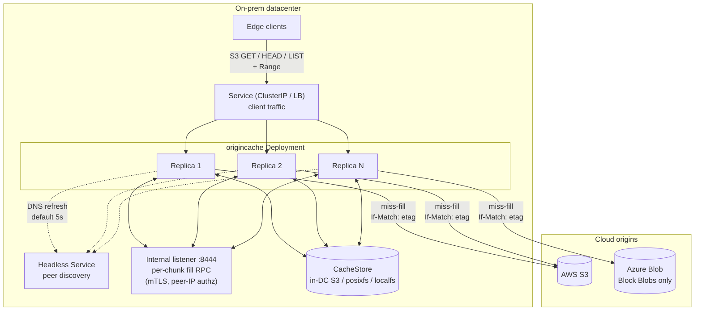
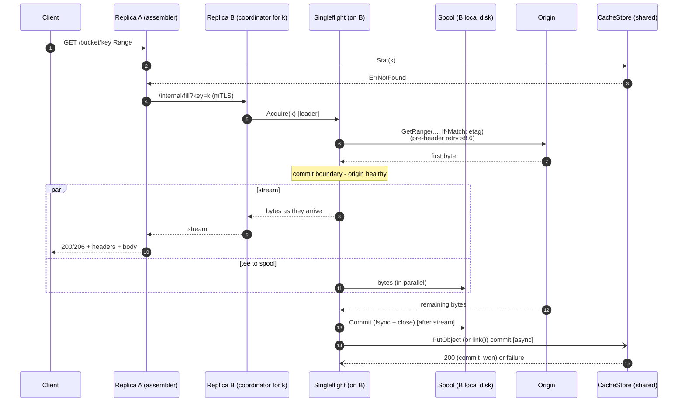

# OriginCache - Architecture Brief

A short brief intended for technical leads who need to understand the
shape of the system, the load-bearing decisions, and what is in v1
without wading through the full design. Drill-down references point at
[design.md](./design.md).

## 1. Problem and approach

Cloud blob origins (AWS S3, Azure Blob) are slow and expensive when
read from on-prem at scale. The intended workload is large immutable
artifacts (job inputs, model weights, training shards) read by
thousands of clients with strongly correlated cold starts (job
launches, distributed-training kickoffs), including FUSE-mounted
filesystems where edge clients perform interactive `ls` and
directory navigation. Naive direct access stampedes origin egress
and cost.

OriginCache is a read-only S3-compatible HTTP cache deployed inside
the on-prem datacenter as a multi-replica Kubernetes Deployment
fronting AWS S3 and Azure Blob. It serves chunked, ETag-keyed bytes
out of a shared in-DC backing store, dedupes concurrent fills both
within and across replicas, and presents the same `GetObject` /
`HeadObject` / `ListObjectsV2` surface clients already use.

## 2. Goals and non-goals

Goals (v1):
- Read-only S3-compatible API at the edge: `GetObject` (with byte-range
  `Range`), `HeadObject`, `ListObjectsV2`.
- Multi-PB working set; thousands of concurrent clients.
- Multi-DC deployment; each DC independent (no cross-DC peering).
- Negligible origin stampede under correlated cold-access bursts.
- Low **TTFB** (time to first byte) on both warm and cold paths.
- Atomic, durable commit of fetched chunks; safe under concurrent
  fills.
- Bounded staleness: `metadata_ttl` (default 5m) on contract violation,
  `negative_metadata_ttl` (default 60s) on create-after-404; zero
  otherwise.

Non-goals (v1):
- Write path, multipart upload, object versioning.
- Cross-DC peering.
- SigV4 verification at the edge (bearer / mTLS only).
- Multi-tenant quotas or per-tenant credentials.
- Per-client / per-IP edge rate limiting.
- Mutable-blob invalidation beyond ETag identity.
- Encryption at rest beyond what the backing store provides.

## 3. System at a glance

Each request lands on one replica (the **assembler**), which iterates
the requested range chunk by chunk. Hits read directly from the
shared **CacheStore**. Misses route to the chunk's **coordinator**
(selected by rendezvous hashing on pod IP from the headless-Service
membership), which runs a singleflight + tee + spool fill against the
**Origin** and atomically commits to the CacheStore. The coordinator
may be the assembler itself (local fill) or a different replica
(per-chunk internal mTLS fill RPC).

### Diagram A: System overview

## 4. Components

Named building blocks. The first five (Origin, CacheStore, ChunkCatalog,
Cluster, Spool) are formal Go interfaces in
[design.md s7](./design.md#7-internal-interfaces); the request-edge
components (Server, fetch.Coordinator, Singleflight, Auth) are
process-internal and are described in
[design.md s4](./design.md#4-architecture) and
[s8](./design.md#8-stampede-protection).

- **Server** - the S3-compatible HTTP edge for clients, plus a
  separate internal listener for per-chunk fill RPCs between
  replicas. Two listeners with two distinct trust roots.
- **fetch.Coordinator** - orchestrates the per-request fan-out:
  per-chunk routing, origin concurrency bounding, internal-RPC
  client. The brain of the assembler.
- **Singleflight** - per-`ChunkKey` in-flight dedupe so concurrent
  cold misses for the same chunk collapse into one origin GET.
  Prevents process-local thundering herds.
- **Spool** - bounded local-disk staging for in-flight fills.
  Tees bytes in parallel with the client write (s5.2), giving
  slow joiners a uniform fallback across all CacheStore drivers
  and serving as the source for the asynchronous CacheStore
  commit.
- **ChunkCatalog** - in-memory LRU recording which chunks the
  CacheStore holds. Pure hot-path optimization; CacheStore is
  source of truth.
- **Origin** - read-only adapter to the upstream cloud blob store
  (AWS S3, Azure Blob). Sends `If-Match: <etag>` on every range
  read so mid-flight overwrites are detected at the wire.
- **CacheStore** - shared in-DC chunk store, source of truth for
  chunk presence. Pluggable: `localfs`, `posixfs`, `s3`. Driver
  choice invisible above the cachestore boundary.
- **Cluster** - peer discovery from the headless Service plus
  rendezvous hashing on pod IP to pick the coordinator per
  `ChunkKey`. Refreshes membership every 5s by default.
- **Auth** - bearer / mTLS on the client edge and mTLS plus
  peer-IP authorization on the internal listener. Separate trust
  roots.

## 5. Five load-bearing mechanisms

### 5.1 Chunking and identity

The cache works in fixed-size chunks (default 8 MiB, configurable
4-16 MiB). The `ChunkKey` is
`{origin_id, bucket, object_key, etag, chunk_size, chunk_index}` and
is the on-store path for that chunk. ETag is treated as identity, not
freshness: any change of origin bytes (under the contract in s5.5)
produces a new ETag, which deterministically yields a new chunk path.
The cache cannot, by construction, serve old bytes for a new ETag.
See [design.md s5](./design.md#5-chunk-model).

### 5.2 Singleflight + tee + spool

Per-`ChunkKey` singleflight on the coordinator collapses concurrent
misses to a single origin GET. Cold-path bytes stream **directly
from origin to client**: bounded **pre-header origin retry**
(default 3 attempts, 5s total budget) handles transient origin
failures invisibly before any HTTP response header is sent; the
commit boundary is the first byte arrival from origin. Once
committed, the leader streams bytes to the client as they arrive.
In parallel, the leader tees bytes into a small in-memory ring
buffer (low-TTFB joiners) and a bounded local-disk **Spool**
(slow joiners that fall behind the ring head, plus uniform
behavior across all CacheStore drivers). The CacheStore commit
happens asynchronously after the response completes. The spool
is NOT on the client TTFB path in v1. See
[design.md s8.1](./design.md#81-per-chunkkey-singleflight),
[s8.2](./design.md#82-ttfb-tee--spool), and
[s8.6](./design.md#86-failure-handling-without-re-stampede).

### 5.3 Per-chunk coordinator (rendezvous hashing)

Each replica polls a headless Service for peer IPs (default every
5s) and selects the coordinator per `ChunkKey` by rendezvous (Highest
Random Weight) hash on pod IP. The assembler fans out per-chunk fill
RPCs over a separate internal mTLS listener (`:8444`) to coordinators
that are not self. One client request spanning N chunks may use N
different coordinators; this is intentional for highly correlated
cold-access workloads, where any single hot key would otherwise pin
its assembler. Loop prevention is enforced by a header marker plus a
membership self-check (`409 Conflict` fallback to local fill on
disagreement). See [design.md s8.3](./design.md#83-cluster-wide-deduplication-via-per-chunk-fill-rpc)
and [s8.8](./design.md#88-internal-rpc-listener).

### 5.4 Atomic-commit primitive

The leader publishes a chunk to the CacheStore in a single no-clobber
operation: the second concurrent commit MUST lose without overwriting
the winner. Two equivalent shapes are picked per driver: object-store
`PutObject + If-None-Match: *` (used by `cachestore/s3`) and POSIX
`link()` (or `renameat2(RENAME_NOREPLACE)`) returning `EEXIST` (used
by `cachestore/localfs` and `cachestore/posixfs`). Both atomic; both
report the loser as `commit_lost`. Each driver runs
`SelfTestAtomicCommit` at boot and refuses to start if the backend
does not honor its primitive. See
[design.md s10.1](./design.md#101-atomic-commit-per-cachestore-driver).

### 5.5 Bounded staleness contract

Correctness rests on an **immutable-origin contract** with the
operator: for any given `(origin_id, bucket, key)`, the underlying
bytes are immutable for the life of the key; replacement MUST publish
a new key. Because the
cache key includes ETag (s5.1), as long as the contract holds the
cache cannot serve stale bytes. If the contract is violated by an
in-place overwrite, the cache may serve old bytes for at most one
`metadata_ttl` window (default 5m), bounded by the metadata cache
TTL. This is the load-bearing semantic for correctness and MUST
appear in the consumer-API documentation. Defense in depth: every
`Origin.GetRange` carries `If-Match: <etag>`, so a mid-flight
overwrite is caught at fill time and increments
`origin_etag_changed_total`. See
[design.md s11](./design.md#11-bounded-staleness-contract). A
symmetric bound applies to **create-after-404** (a key uploaded after
a client already saw a 404 on it): at most one `negative_metadata_ttl`
window per replica that observed the original 404 (default 60s)
before the cache reflects the upload. See
[design.md s12](./design.md#12-create-after-404-and-negative-cache-lifecycle).
Operators with workloads requiring shorter effective windows on hot
keys can opt into a **bounded-freshness mode** (default off): a
per-replica background loop proactively re-Heads frequently-
accessed keys ahead of `metadata_ttl`, shrinking the effective
window for those keys to `refresh_ahead_ratio * metadata_ttl`
(default 3.5m). See
[design.md s11.2](./design.md#112-bounded-freshness-mode-optional).

## 6. Backing-store options

The CacheStore is pluggable; choice is a deployment-time decision and
is invisible above the `cachestore` package boundary. Three drivers
ship in v1:

- `localfs` - dev only; one POSIX FS per replica; not shared.
- `posixfs` - shared POSIX FS mounted on every replica at the same
  path. Supported backends: NFSv4.1+ (baseline), Weka native
  (`-t wekafs`), CephFS, Lustre, GPFS / IBM Spectrum Scale. Same
  `link()` / `EEXIST` primitive as `localfs`. Alluxio FUSE is hard-
  refused (no `link(2)`, no atomic no-overwrite rename).
- `s3` - in-DC S3-compatible object store (e.g. VAST). `PutObject`
  + `If-None-Match: *`.

See [design.md s10.1](./design.md#101-atomic-commit-per-cachestore-driver)
for atomic-commit specifics per driver.

## 7. A request, end-to-end (cold miss with cross-replica fill)

The diagram below traces a cold miss on replica A where the chunk's
coordinator is replica B. The hot path (cache hit on A) skips
straight from the catalog lookup to a direct CacheStore read; the
local-coordinator path (B == A) skips the internal RPC. Cold-path
bytes stream from origin -> coordinator -> assembler -> client
in parallel with the spool tee on B. Pre-header retry on B handles
transient origin failures invisibly; the CacheStore commit happens
asynchronously after the client has the full chunk.

### Diagram B: Cold miss, cross-replica coordinator

## 8. Top risks worth your attention

1. **Immutable-origin contract** - Correctness rests on operators
   publishing new keys instead of overwriting. Bounded violation
   window is `metadata_ttl` (5m default). Must be visible in
   consumer-API documentation. See
   [design.md s11](./design.md#11-bounded-staleness-contract).
2. **Commit-after-serve failure** - The CacheStore commit happens
   asynchronously after the client response is complete (cold-path
   bytes stream origin -> client directly with pre-header retry on
   the cache side). If the async commit fails after the client has
   the full chunk, the chunk is silently uncached and the next
   request refills. Sustained failure is visible only via
   `commit_after_serve_total{result="failed"}`; alerting is required.
   See [design.md s8.6](./design.md#86-failure-handling-without-re-stampede).
3. **Spool locality** - The Spool MUST live on a local block device
   by default (boot-time `statfs(2)` check refuses to start on
   NFS / SMB / CephFS / Lustre / GPFS / FUSE). With the v1 streaming
   design the spool is no longer on the client TTFB path, so this
   contract is defense-in-depth: a network-FS spool would only
   degrade joiner-fallback latency, not first byte. Operators with
   unusual placements MAY relax via `spool.require_local_fs: false`;
   production deployments are expected to keep the default. See
   [design.md s10.4](./design.md#104-spool-locality-contract).
4. **Limiter authority changeover overshoot** - Origin concurrency
   is capped cluster-wide via a Kubernetes-Lease-elected limiter
   authority. When the elected authority dies, the new authority
   starts with an empty slot table while old slot-lease tokens at
   peers continue draining; cluster-wide inflight may transiently
   exceed `target_global` for up to one
   `lease.duration + token.ttl` window (default 45s). When the
   authority is unreachable, peers gracefully fall back to a
   per-replica static cap. See
   [design.md s8.4](./design.md#84-origin-backpressure).
5. **POSIX backend hardening** - NFS exports MUST be `sync` (not
   `async`); Weka NFS `link()`/`EEXIST` is not docs-confirmed and
   is gated by `SelfTestAtomicCommit` at boot; Alluxio FUSE is
   hard-refused with a documented workaround
   (`cachestore.driver: s3` against the Alluxio S3 gateway). See
   [design.md s10.1.2](./design.md#1012-cachestoreposixfs).
6. **Create-after-404 staleness** - A key uploaded after clients
   already observed it as `404` will return stale `404` for up to
   `negative_metadata_ttl` (default 60s) per replica that observed
   the original miss. Round-robin LB can produce alternating `404`
   / `200` during the drain. No event-driven invalidation or admin-
   invalidation in v1 (the immutable-origin contract makes them
   unnecessary for the documented workload); operators must wait
   the TTL after uploading a previously-missing key. Mitigation:
   short default TTL, `metadata_negative_*` metrics. See
   [design.md s12](./design.md#12-create-after-404-and-negative-cache-lifecycle).

## 9. Where to go next

`design.md` (full mechanism + flow):
- [s2 Decisions](./design.md#2-decisions) - locked design choices.
- [s3 Terminology](./design.md#3-terminology) - full glossary.
- [s4 Architecture and onward](./design.md#4-architecture) -
  architecture, request flow, internal interfaces, stampede protection.
- [s8.4 Origin backpressure](./design.md#84-origin-backpressure) -
  K8s-Lease-elected limiter authority and graceful fallback.
- [s10.1 Atomic commit per driver](./design.md#101-atomic-commit-per-cachestore-driver)
- [s11 Bounded staleness](./design.md#11-bounded-staleness-contract)
  - [s11.2 Bounded-freshness mode (optional)](./design.md#112-bounded-freshness-mode-optional)
- [s12 Create-after-404 and negative-cache lifecycle](./design.md#12-create-after-404-and-negative-cache-lifecycle)
- [s13 Eviction and capacity](./design.md#13-eviction-and-capacity) -
  passive lifecycle and optional active eviction; ChunkCatalog
  size-awareness operational guidance.
- [s15 Deferred optimizations](./design.md#15-deferred-optimizations) -
  v1 scope-discipline catalog (edge rate limiting, cluster-wide HEAD
  singleflight, cluster-wide LIST coordinator).
- 13 inline mermaid diagrams covering hits, misses, cross-replica
  fills, atomic commit, create-after-404 timeline, membership flux,
  and limiter authority lifecycle.
