# OriginCache - Design (mechanism & flow)

Status: draft for review (round 2 incorporating reviewer feedback)
Owner: TBD

> Implementation phases, repo layout, configuration, ops, and approval
> checklist: see [plan.md](./plan.md).

---

## 1. Overview

Edge devices inside an on-prem datacenter need read access to large files
held in cloud blob storage (S3, Azure Blob). Direct egress per device is
unacceptable (cost, latency, throughput, security boundary). OriginCache is
a read-only caching layer, deployed inside each datacenter, that fronts
cloud blob storage with an S3-compatible API. Clients issue range reads;
OriginCache serves from a shared in-DC store when present, otherwise
fetches from the cloud origin, stores the chunk, and returns it.

This document describes the mechanism: decisions, components, request flow,
stampede protection, atomic commit, and horizontal-scale coordination. It
is paired with [plan.md](./plan.md), which covers deliverable scope, repo
layout, phasing, configuration, observability, and operational concerns.

## 2. Decisions

| Area | Decision |
|---|---|
| Client API | S3-compatible HTTP; `GET` + `HEAD` + `ListObjectsV2`; supports `Range`. |
| Auth (v1) | Network-perimeter trust + bearer / mTLS. No SigV4 verification yet. |
| Origins | S3 + Azure Blob behind a pluggable `Origin` interface. |
| Azure constraint | Block Blobs only. Append/Page Blobs rejected at `Head`. |
| Backing store | Pluggable `CacheStore`; `localfs` for dev, `s3` (VAST) for prod. The CacheStore is the source of truth for chunk presence. |
| In-DC S3 vs. cloud S3 | The in-DC S3-compatible store is treated identically to cloud S3 at the protocol level. The only difference is "much faster, in-DC". Both `Origin` and `CacheStore` are thin S3-client adapters with no special-casing. |
| Chunking | Fixed 8 MiB default (configurable 4-16 MiB). `chunk_size` baked into `ChunkKey`. |
| Consistency | Immutable blobs. ETag is the version identity. **Origin reads use `If-Match: <etag>`**; mid-flight overwrite triggers `OriginETagChangedError`, metadata invalidation, and refusal of the in-flight fill (no opt-out: design protects itself rather than relying on operational immutability). |
| Catalog | In-memory `ChunkCatalog` fronting `CacheStore.Stat`. No persistent local index. |
| Eviction | Deferred to CacheStore lifecycle policy. Cache layer ships no eviction code in v1. |
| Prefetch | Sequential read-ahead by default. Configurable depth, capped concurrency. |
| Cluster | Kubernetes Deployment + headless Service for peer discovery + ClusterIP/LB for client traffic. Rendezvous hashing on pod IP selects the coordinator per `ChunkKey` for miss-fills only; receiving replica is the **assembler** that fans out per-chunk fill RPCs to coordinators (s7.3). All replicas can read all chunks directly from the CacheStore on hits. |
| Inter-replica auth | Separate internal mTLS listener (default `:8444`) chained to an internal CA distinct from the client mTLS CA; authorization = "presenter source IP is in current peer-IP set" (s7.8). |
| Local spool | Every fill writes origin bytes through a local spool (`internal/origincache/fetch/spool`) so slow joiners always have a local fallback regardless of CacheStore driver (s7.2). |
| Atomic commit | `localfs` uses `link()` for atomic no-clobber; `s3` uses direct `PutObject` with `If-None-Match: *` and a startup self-test that refuses to start if the backend doesn't honor the precondition (s9). |
| Tenancy | Single tenant, single origin credential set in v1. |
| Repo home | This repo. Layout mirrors `machina`. |

## 3. Architecture

A single binary, `origincache`, deployed as a Kubernetes Deployment. All
replicas share a single in-DC CacheStore. A headless Service publishes the
set of Ready pod IPs; each replica polls it (default every 5s) to refresh
its peer set. Rendezvous hashing on `ChunkKey` against the current pod-IP
set selects a coordinator replica **per chunk**. The replica that receives
a client request is the **assembler**: for each chunk in the requested
range, it serves directly from the CacheStore on hit, runs a local
singleflight + tee fill if it is the coordinator for that chunk, or issues
an internal per-chunk fill RPC to the coordinator otherwise. The
coordinator owns the singleflight + tee + atomic CacheStore commit for its
chunks. Single tenant. One origin credential set per deployment.

### Diagram 1: System overview

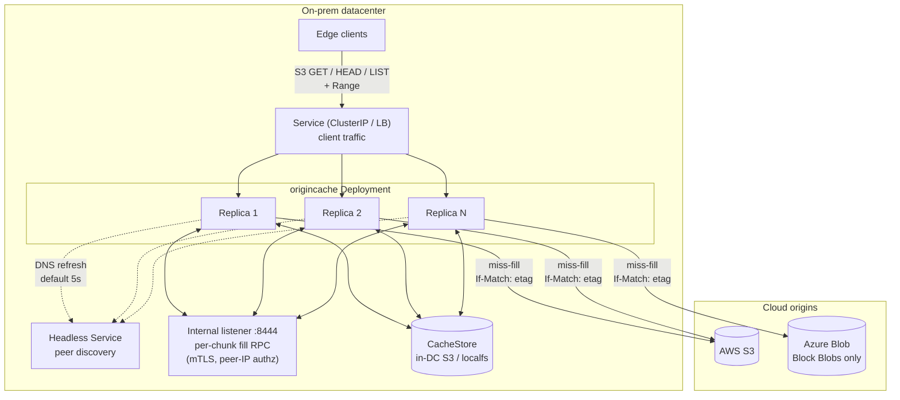

## 4. Chunk model

- `ChunkKey = {origin_id, bucket, object_key, etag, chunk_size, chunk_index}`.
  - `origin_id` is a deployment-scoped identifier from config (e.g.
    `aws-us-east-1-prod`, `azure-eastus-research`). Required. Namespaces
    cache key derivation and the on-store path so two deployments can
    safely share a CacheStore bucket.
  - `etag` captures immutability. A new ETag is treated as a new logical
    object and gets a fresh set of chunks. Old chunks age out via the
    CacheStore's lifecycle policy.
  - `chunk_size` is part of the key so a runtime config change does not
    silently corrupt or shadow existing data.
- `chunk_index = floor(byte / chunk_size)`.
- An object metadata cache holds `{origin_id, bucket, key} -> {size, etag,
  content_type, last_validated, last_status}` with a small TTL. Avoids
  re-`HEAD`ing origin on every request.

The CacheStore's namespace **is** the chunk index. `ChunkKey`
deterministically produces a path. Cache key derivation uses canonical
length-prefixed encoding to remove ambiguity from separators that may
appear in any field:

```
LP(s)   = LE64(uint64(len(s))) || s
hashKey = sha256(
            LP(origin_id) ||
            LP(bucket)    ||
            LP(key)       ||
            LP(etag)      ||
            LE64(chunk_size)
          )
path    = "<origin_id>/<hex(hashKey)>/<chunk_index>"
```

`origin_id` appears in the path in the clear (and `chunk_size` is folded
into the hash, not the path) so operators can run per-origin lifecycle
policies and target a specific deployment with `aws s3 rm --recursive
<bucket>/<origin_id>/`.

Whether a chunk is present is answered by `CacheStore.Stat(key)`. An
in-memory `ChunkCatalog` LRU memoizes recent positive lookups so the hot
path never touches the CacheStore for metadata. The catalog is purely a
hot-path optimization; it can be dropped at any time without affecting
correctness.

For a request `Range: bytes=A-B`:

```
firstChunk = A / chunk_size
lastChunk  = B / chunk_size
for cid := firstChunk; cid <= lastChunk; cid++ {  // streaming iterator
    fetchOrServe(cid)                              // + sliding prefetch window
    sliceWithin(cid, max(A, cid*sz), min(B, (cid+1)*sz - 1))
}
```

The chunk loop is a **streaming iterator**: at no point is the full
`[]ChunkKey` for the range materialized into a slice. Prefetch operates on
a sliding window of `min(prefetch_depth, lastChunk - cid)` ahead of the
current cursor. A configurable `server.max_response_bytes` cap returns
`416 Requested Range Not Satisfiable` (with header
`x-origincache-cap-exceeded: true`) before any cache lookup if the
computed response size exceeds the cap.

### Diagram 2: Range request -> chunk index mapping

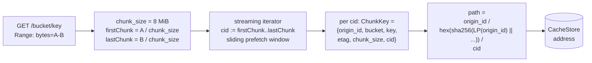

## 5. Request flow

1. `GET /{bucket}/{key}` arrives with optional `Range`.
2. Auth middleware (bearer / mTLS) validates the caller.
3. `fetch.Coordinator` looks up object metadata in the metadata cache. On
   miss, exactly one `HEAD` is issued to origin (singleflight at the
   metadata layer). `404` and unsupported-blob-type errors are negatively
   cached. The cached entry includes the current `ETag`.
4. If the request has `Range`, validate against `ObjectInfo.Size`; serve
   `416` if unsatisfiable. Compute `firstChunk` and `lastChunk`. If
   `server.max_response_bytes > 0` and the computed response size exceeds
   it, return `416` with `x-origincache-cap-exceeded: true`.
5. Iterate the chunk range as a streaming iterator. For each `ChunkKey`:
   - **ChunkCatalog hit:** open reader from `CacheStore`.
   - **ChunkCatalog miss:** call `CacheStore.Stat(key)`. If present,
     record in the catalog and serve from the CacheStore. If absent, take
     the miss-fill path (s7), which routes to the coordinator for that
     specific chunk via local singleflight or per-chunk internal RPC.
6. **Deferred response headers**: response headers (`Content-Length`,
   `Content-Range`, `ETag`, `Accept-Ranges: bytes`) are not sent until
   the **first chunk** of the range is in hand (committed to CacheStore
   for the cold path; available from CacheStore for the warm path).
   Until then, any failure - origin unreachable, `OriginETagChangedError`,
   semaphore timeout, internal RPC failure - returns a clean HTTP error
   (typically `502 Bad Gateway` or `503 Slow Down`). `Content-Length` and
   `Content-Range` are computable from `ObjectInfo.Size` and the chunk
   math, so deferring headers does not lose information; it only adds
   roughly one chunk-fill latency to TTFB on the cold path.
7. **Mid-stream failure**: once any body byte has been written, no HTTP
   error status is possible. Mid-stream failures abort the response
   (HTTP/2 `RST_STREAM` with `INTERNAL_ERROR`; HTTP/1.1 `Connection:
   close` after the partial write) and increment
   `origincache_responses_aborted_total{phase="mid_stream",reason}`. S3
   clients (aws-sdk, boto3, etc.) detect this via `Content-Length`
   mismatch and retry.
8. If sequential prefetch is enabled, the iterator schedules asynchronous
   fills for the next N chunks (capped per blob and globally) one chunk
   ahead of the cursor.

### Diagram 3: Cache hit

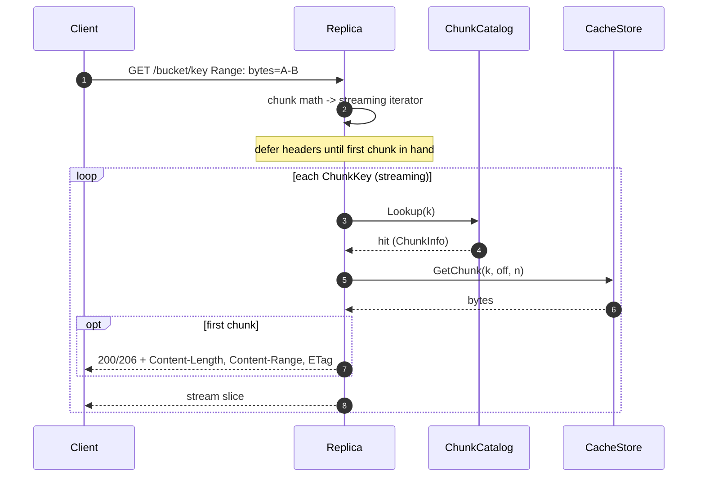

### Diagram 4: Cache miss, single replica (this replica is the coordinator)

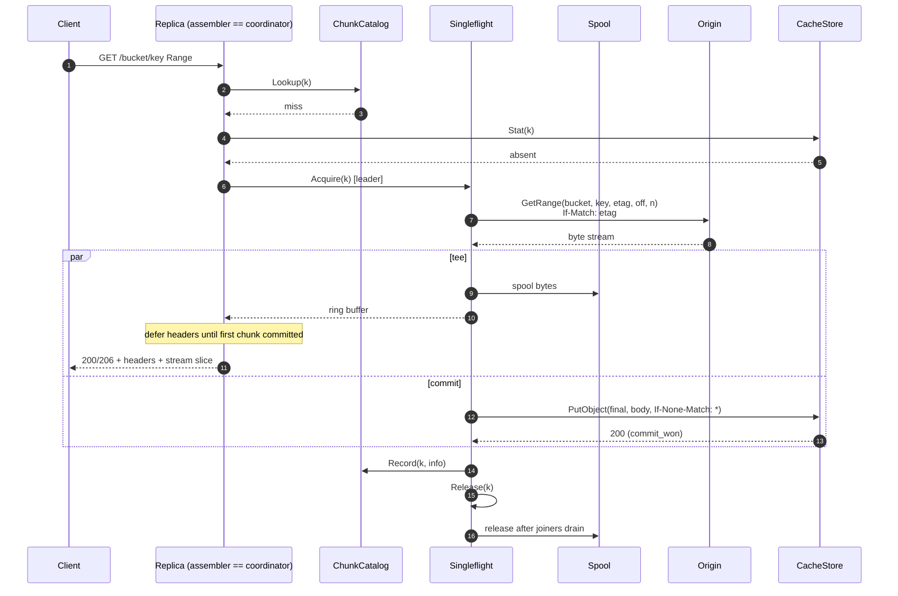

## 6. Internal interfaces

The mechanism's named seams. Implementations live under
`internal/origincache/`; see [plan.md#3-repo-layout](./plan.md#3-repo-layout-mirrors-machina).

```go
// Origin: read-only view of upstream blob store. GetRange takes the etag
// from the prior Head and uses it as an If-Match precondition; mid-flight
// overwrite returns OriginETagChangedError.
type Origin interface {
    Head(ctx context.Context, bucket, key string) (ObjectInfo, error)
    GetRange(ctx context.Context, bucket, key, etag string, off, n int64) (io.ReadCloser, error)
    List(ctx context.Context, bucket, prefix, marker string, max int) (ListResult, error)
}

// OriginETagChangedError is returned by Origin.GetRange when the origin
// rejects the If-Match precondition. The fill is refused and the metadata
// cache entry for {origin_id, bucket, key} is invalidated; the next
// request re-Heads and gets a fresh ChunkKey.etag.
type OriginETagChangedError struct {
    Bucket, Key string
    Want, Got   string // Want = ETag we expected; Got = current ETag if known
}

// CacheStore: where chunk bytes physically live in the DC. Treated as the
// source of truth for chunk presence; backed by an in-DC S3-like service
// in production and a local directory in dev. PutChunk is atomic and
// no-clobber; the second concurrent PutChunk for the same key returns a
// CommitLost error.
type CacheStore interface {
    GetChunk(ctx context.Context, k ChunkKey, off, n int64) (io.ReadCloser, error)
    PutChunk(ctx context.Context, k ChunkKey, size int64, r io.Reader) error // atomic, no-clobber
    Stat(ctx context.Context, k ChunkKey) (ChunkInfo, error)
    SelfTestAtomicCommit(ctx context.Context) error // startup probe
}

// ChunkCatalog: in-memory, best-effort record of chunks known to be
// present in the CacheStore. Purely a hot-path optimization; the
// CacheStore is the source of truth. A Lookup miss falls through to
// CacheStore.Stat; the result is Recorded for subsequent requests.
type ChunkCatalog interface {
    Lookup(k ChunkKey) (ChunkInfo, bool)
    Record(k ChunkKey, info ChunkInfo)
    Forget(k ChunkKey)
}

// Cluster: peer discovery + rendezvous hashing. Returns the coordinator
// peer for a given ChunkKey. self == coordinator means handle locally.
// InternalDial returns a transport (HTTP/2 over mTLS) for issuing
// /internal/fill RPCs to a non-self peer.
type Cluster interface {
    Coordinator(k ChunkKey) Peer  // returns self or remote Peer
    Self() Peer
    Peers() []Peer                // current membership snapshot
    InternalDial(ctx context.Context, p Peer) (InternalClient, error)
}

// Spool: bounded local-disk staging area for in-flight fills. Every fill
// writes through the spool so slow joiners can fall back from the leader's
// ring buffer to a local disk reader regardless of CacheStore driver.
type Spool interface {
    Begin(k ChunkKey, size int64) (SpoolWriter, error)
    Reader(k ChunkKey, off int64) (io.ReadCloser, error)
    Release(k ChunkKey) // drop spool entry once all in-flight readers are done
}

type SpoolWriter interface {
    io.Writer
    Commit() error // fsync + close
    Abort() error  // discard
}
```

Implementations:

- `Origin`: `origin/s3`, `origin/azureblob` (Block Blob only). Both pass
  the caller's `etag` as `If-Match` on the underlying GET; both translate
  the backend's "precondition failed" status into `OriginETagChangedError`.
- `CacheStore`: `cachestore/localfs` (dev), `cachestore/s3` (VAST etc.).
  See s9 for atomic-commit specifics per driver.
- `ChunkCatalog`: a single in-memory LRU implementation.
- `Cluster`: a single implementation that polls the headless Service
  (default 5s), computes rendezvous hashes against pod IPs, and exposes
  an mTLS HTTP/2 client for the internal listener.
- `Spool`: a single implementation backed by a configured local directory
  (`spool.dir`) with a capacity cap (`spool.max_bytes`) and an in-flight
  cap (`spool.max_inflight`).

## 7. Stampede protection

The single most important hot-path correctness issue. Layered defense.

### 7.1 Per-`ChunkKey` singleflight

Process-local map `inflight: map[ChunkKey]*Fill`, guarded by a mutex. Each
`*Fill` has a `done` channel, an error slot, the resulting `ChunkInfo`, a
bounded ring buffer, a `Spool` handle (s7.2), and a refcount. Acquire
path: under the lock, either return the existing entry as a joiner or
insert a new entry and become the leader. Release path: leader removes
the entry from the map after signalling, so any thread arriving while the
entry is mapped joins; any thread arriving after removal records the
chunk in the `ChunkCatalog` (which the leader populated before releasing)
and serves a normal hit.

### 7.2 TTFB tee + spool

Naive singleflight makes joiners wait for the leader's full disk write,
then re-read from disk. Instead the leader splits origin bytes two ways:

1. **Ring buffer** (in-memory, bounded 1-2 MiB by default). Joiners
   obtain a `Reader` over this buffer that replays buffered bytes and
   blocks on a condition variable for more. This delivers low TTFB for
   on-pace joiners.
2. **Spool** (local disk file via the `Spool` interface). The leader
   writes every byte to a local spool file before (or in parallel with)
   uploading to the CacheStore. A slow joiner that falls behind the ring
   buffer head transparently switches to a `Spool.Reader(k, off)`. The
   spool exists because the production `cachestore/s3` driver streams
   directly into `PutObject` and does not produce a readable on-disk tmp
   file - without the spool, slow joiners on the s3 path would have no
   local fallback. The spool unifies behavior across `localfs` and `s3`
   drivers.

Capacity: `spool.max_bytes` caps total spool footprint (default 8 GiB);
`spool.max_inflight` caps concurrent fills using the spool. When the
spool is full, new fills wait briefly on `spool.max_inflight` semaphore;
on timeout they return `503 Slow Down` to the client.

After the leader's CacheStore commit succeeds, the spool entry is retained
briefly so any in-flight joiner can finish reading; once joiner refcount
hits zero the spool entry is released.

### Diagram 5: Same-replica joiner via singleflight + tee + spool

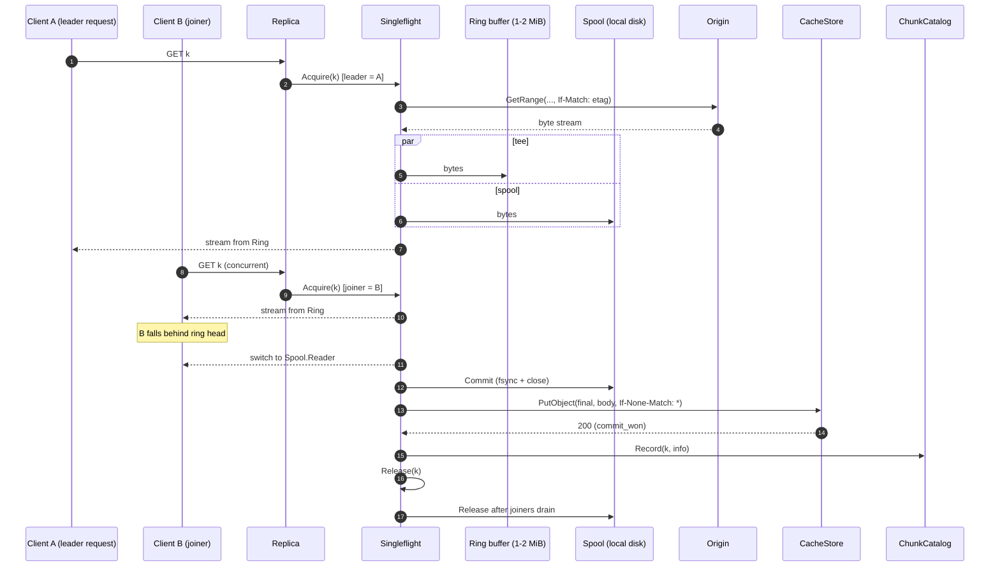

### 7.3 Cluster-wide deduplication via per-chunk fill RPC

Rendezvous hashing on `ChunkKey` against the current pod-IP set selects
**one coordinator per chunk**. A range request can span N chunks; those
chunks may have N distinct coordinators. The replica that receives the
client request is therefore the **assembler**, not a forwarder of the
whole HTTP request. For each `ChunkKey k` in the requested range:

- **Hit** (Catalog or `Stat` says present): assembler reads from
  `CacheStore` directly. No internal RPC.
- **Miss + `Coordinator(k) == self`**: assembler runs the local
  singleflight + tee + spool + commit path (s7.1, s7.2, s9).
- **Miss + `Coordinator(k) != self`**: assembler issues
  `GET /internal/fill?key=<encoded ChunkKey>` to the coordinator on the
  coordinator's internal listener (s7.8). The coordinator runs the
  singleflight + tee + spool + commit path locally and streams the chunk
  bytes back. The assembler stitches the returned bytes into the client
  response, slicing the first and last chunk to match the client's `Range`.

**Loop prevention**: the assembler sets `X-Origincache-Internal: 1` on
internal RPCs. A receiver seeing this header MUST self-check:
`Cluster.Coordinator(k) == Cluster.Self()`. On disagreement (membership
flux), the receiver returns `409 Conflict` with body
`{"reason":"not_coordinator"}`; the assembler falls back to local fill
for that chunk (one duplicate fill possible during flux; observable via
the duplicate-fills metric below). Receivers MUST NOT chain forward
internal RPCs.

Combined with 7.1, exactly one origin GET per cold chunk per cluster in
steady state. During membership change we accept up to one duplicate fill
per chunk (loser drops on commit collision; observable via
`origincache_origin_duplicate_fills_total{result="commit_lost"}` - see
[plan.md#6-observability](./plan.md#6-observability)). The duplicate-fill
metric is the leading indicator that this routing is working: a sustained
non-zero `commit_lost` rate signals chronic membership flux or a bug in
the hash distribution.

### Diagram 6: Cross-replica per-chunk fill RPC (one chunk)

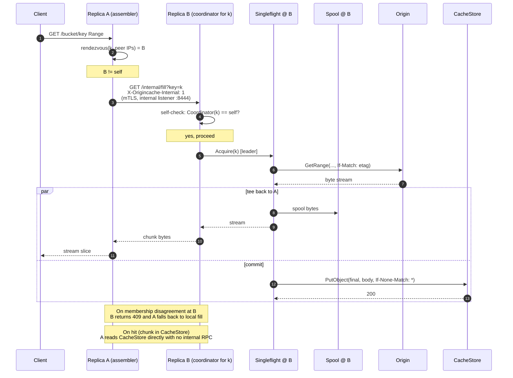

### Diagram 7: Multi-chunk assembler fan-out across coordinators

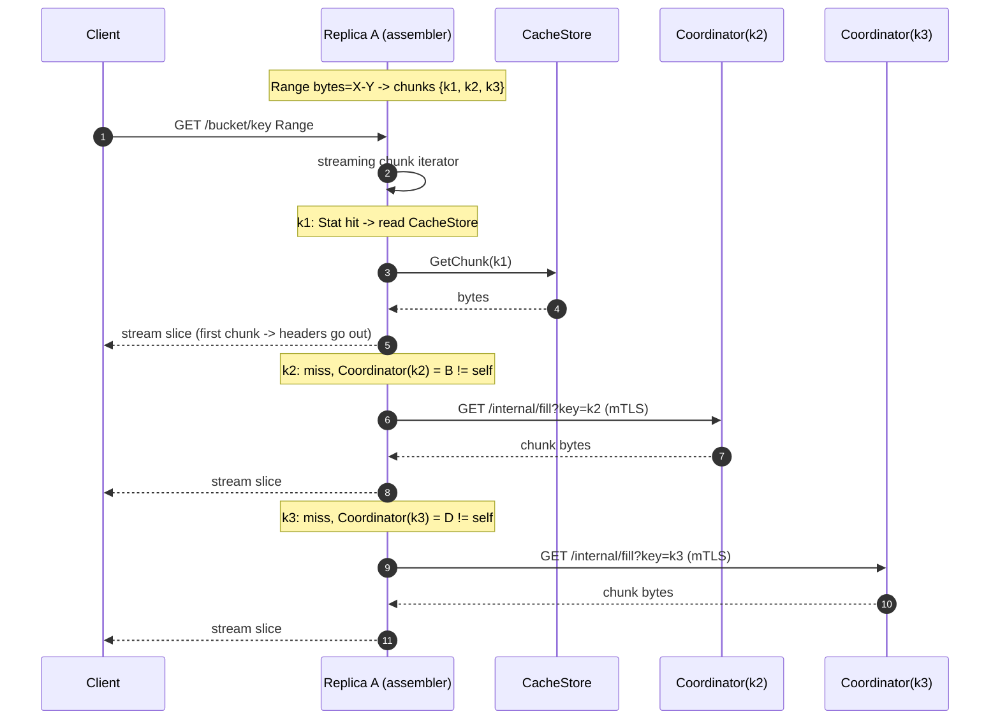

### 7.4 Origin backpressure

A separate per-origin **semaphore** caps concurrent `Origin.GetRange`
calls (default 64-128, configurable). Optional token bucket on origin
bytes/sec. Joiners do not consume tokens. If saturated, leaders queue
with bounded wait; on timeout the request returns `503 Slow Down` so
clients back off.

### 7.5 Cancellation safety

`Fill.run()` uses an internal long-lived context, not any single client's
context. The fill outlives any single requester. If every joiner cancels
we still finish the fill (cheap insurance; configurable to abort). A
joiner cancelling unblocks only itself.

### 7.6 Failure handling without re-stampede

- **Retryable error**: short-lived negative entry in the singleflight map
  (cooldown 100 ms - 1 s) so concurrent joiners share the failure rather
  than each retrying immediately.
- **`OriginETagChangedError`**: leader (a) invalidates the metadata cache
  entry for `{origin_id, bucket, key}`, (b) fails the in-flight fill, (c)
  joiners receive the same error and abort their responses (or, if
  pre-first-byte, get a `502 Bad Gateway`). The next request triggers a
  fresh `Head` and a new `ChunkKey` with the new ETag. Old chunks under
  the old ETag age out via the CacheStore lifecycle. Increments
  `origincache_origin_etag_changed_total`.
- **Hard 404 / unsupported blob type**: cached in the metadata cache for
  a longer TTL (default 5 min) so floods do not flood origin with `HEAD`s.
- **Retry inside the leader**: bounded exponential backoff (default 3
  attempts) before declaring failure, EXCEPT for `OriginETagChangedError`
  which is non-retryable (the object identity changed; refilling under
  the old ETag is the bug we are preventing). Joiners sit through retries
  on the same `Fill`.

### 7.7 Metadata-layer singleflight

Same pattern at the metadata cache:
`metaInflight: map[ObjectKey]*MetaFill`. Without this, a flood of
distinct cold keys shifts the storm from chunk GETs to chunk HEADs.
Stale-while-revalidate behavior: serve stale within a small margin while
one background refresh runs.

### 7.8 Internal RPC listener

Per-chunk fill RPCs (`GET /internal/fill?key=<encoded ChunkKey>`) are
served on a separate listener bound to a distinct port (default `:8444`,
config `cluster.internal_listen`). This isolates inter-replica traffic
from the client edge.

- **Transport**: HTTP/2 over mTLS.
- **Server cert**: per-replica cert (e.g. cert-manager-issued) chained to
  a configured **internal CA** (`cluster.internal_tls.ca_file`). The
  internal CA is **distinct** from the client mTLS CA so a leaked client
  cert cannot be used to dial the internal listener.
- **Client auth**: peer presents a client cert chained to the internal CA
  AND the peer's source IP must be in the current peer-IP set
  (`Cluster.Peers()`). The IP-set check guards against a leaked internal
  cert being usable from outside the Deployment.
- **Authorization scope**: the internal listener serves `GET
  /internal/fill?key=<...>` only. No client identity is propagated from
  the assembler because chunk content is identity-independent: any
  authorized client at the assembler is entitled to the chunk bytes, and
  the coordinator is doing the same fill it would do for a local request.
- **NetworkPolicy**: ingress on `:8444` allowed only from pods with
  label `app=origincache` in the same namespace.
- **Loop prevention**: receiver enforces `X-Origincache-Internal: 1` ->
  self must be coordinator for the requested ChunkKey, else `409 Conflict`.

Metrics: `origincache_cluster_internal_fill_requests_total{direction=
"sent|received|conflict"}`,
`origincache_cluster_internal_fill_duration_seconds`.

## 8. Azure adapter: Block Blob only

Hardened constraint.

- Enforced in `internal/origincache/origin/azureblob.Head`. Block type is
  immutable on an existing blob (you have to delete and recreate to change
  it, which produces a new ETag), so checking once per `(container, blob,
  etag)` is sufficient.
- Detection via `Get Blob Properties` -> `BlobType` field. Reject anything
  other than `BlockBlob` with a typed error `UnsupportedBlobTypeError`
  exported from `internal/origincache/origin`.
- Surfaced to clients as HTTP `502 Bad Gateway` with S3 error code
  `OriginUnsupported`, body containing reason, plus
  `x-origincache-reject-reason: azure-blob-type=<type>` header.
- Negatively cached in the metadata cache (default 5 min TTL) and
  singleflighted at the metadata layer to prevent re-probing.
- `ListObjectsV2` defaults to `filter` mode: non-Block Blob entries are
  skipped while preserving continuation tokens. `passthrough` mode is
  available for debugging.
- Config schema reserves `enforce_block_blob_only: true`. Setting it to
  false is rejected at startup.
- `Origin.GetRange` on the azureblob adapter uses `If-Match: <etag>` on
  the underlying Get Blob; `412 Precondition Failed` is translated to
  `OriginETagChangedError` (s7.6).
- Prometheus counter:
  `origincache_origin_rejected_total{origin="azureblob",reason="non_block_blob",blob_type=...}`.

### Diagram 8: Block Blob enforcement

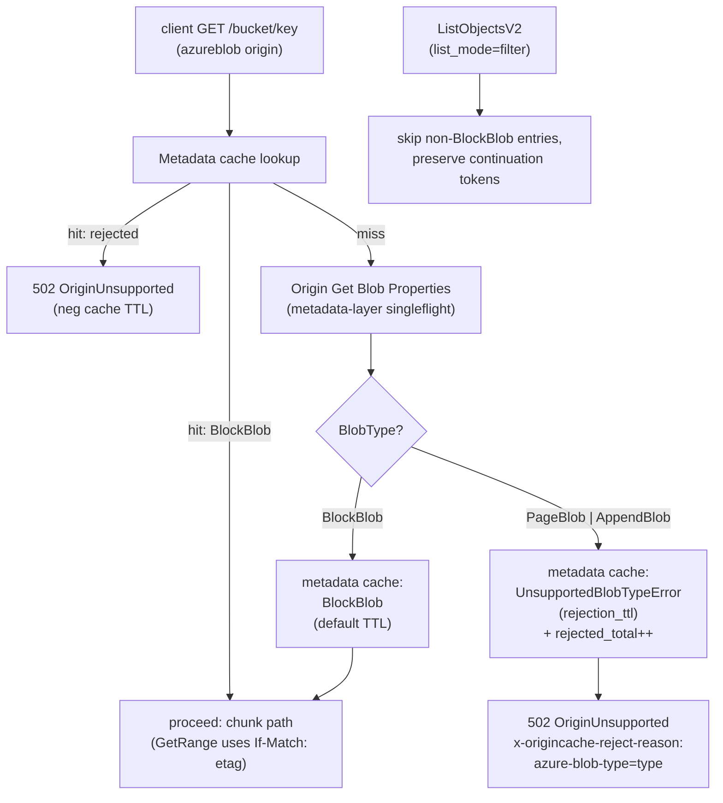

## 9. Concurrency, durability, correctness

### 9.1 Atomic commit (per CacheStore driver)

The leader publishes a chunk to the CacheStore atomically and
no-clobber: the second concurrent commit for the same key MUST lose
without overwriting the winner.

- **`cachestore/localfs`**:
  1. Leader writes origin bytes to `<final>.tmp.<uuid>` and `fsync()`s.
  2. Commit: `link(<final>.tmp.<uuid>, <final>)`. POSIX `link()` is atomic
     and returns `EEXIST` if the destination exists. On `EEXIST`, the
     leader treats the existing `<final>` as the source of truth, calls
     `unlink(<final>.tmp.<uuid>)`, and increments commit_lost. On success,
     `unlink(<final>.tmp.<uuid>)` and increment commit_won.
  3. On Linux, `renameat2(RENAME_NOREPLACE)` is preferred when available
     (single syscall); the `link` + `unlink` form is the portable
     fallback (also works on macOS dev environments). Plain `rename()` is
     **never** used because it overwrites the destination on POSIX.
  4. Crash recovery: a periodic background sweep (default every 1 hour)
     unlinks stale `*.tmp.*` files older than `spool.tmp_max_age`
     (default 1 hour). Nothing breaks if a tmp file lingers briefly.

- **`cachestore/s3`**:
  1. Leader streams origin bytes (via the Spool, s7.2) into a single
     `PutObject(final_key, body, If-None-Match: "*")`. There is no tmp
     key and no copy hop.
  2. `200 OK` -> commit_won. `412 Precondition Failed` -> commit_lost
     (treat the existing object as the source of truth; no cleanup
     needed because no tmp object was created).
  3. **Startup self-test** (`SelfTestAtomicCommit`): on driver init the
     `cachestore/s3` driver writes a probe key, then attempts a second
     `PutObject(probe_key, ..., If-None-Match: "*")` and asserts a
     `412` response. If the backend returns `200` instead (silently
     overwrites), the driver fails to start with `cachestore/s3:
     backend does not honor If-None-Match: *; refusing to start`. This
     prevents silent double-writes on backends that don't implement the
     precondition. Verified backends as of v1: AWS S3 (since 2024-08),
     MinIO. VAST: confirmation required during Phase 2 (see
     [plan.md#10-open-questions--risks](./plan.md#10-open-questions--risks)).

### 9.2 Catalog correctness

The CacheStore is the source of truth. The `ChunkCatalog` is purely an
optimization and may be dropped at any time without affecting correctness;
a `Lookup` miss falls through to `CacheStore.Stat` and refills the
catalog. Catalog entries that point at a now-absent chunk (e.g. evicted
by lifecycle) result in a `CacheStore.GetChunk` error that is treated as
a miss and refilled.

### 9.3 Range, sizes, and edge cases

- Partial last chunk of a blob stored at its actual size; `ChunkInfo.Size`
  records it; range math respects it.
- `416 Requested Range Not Satisfiable` is returned by the server before
  any cache lookup, using object metadata, and also when
  `server.max_response_bytes` would be exceeded (s5).
- Origin failure during fill never commits the tmp file or makes a final
  PutObject. Pre-first-byte: surfaces as `502 Bad Gateway` to the client
  and as a transient negative singleflight entry. Post-first-byte:
  response is aborted (s5 step 7).

### Diagram 9: Atomic commit (localfs vs s3 CacheStore)

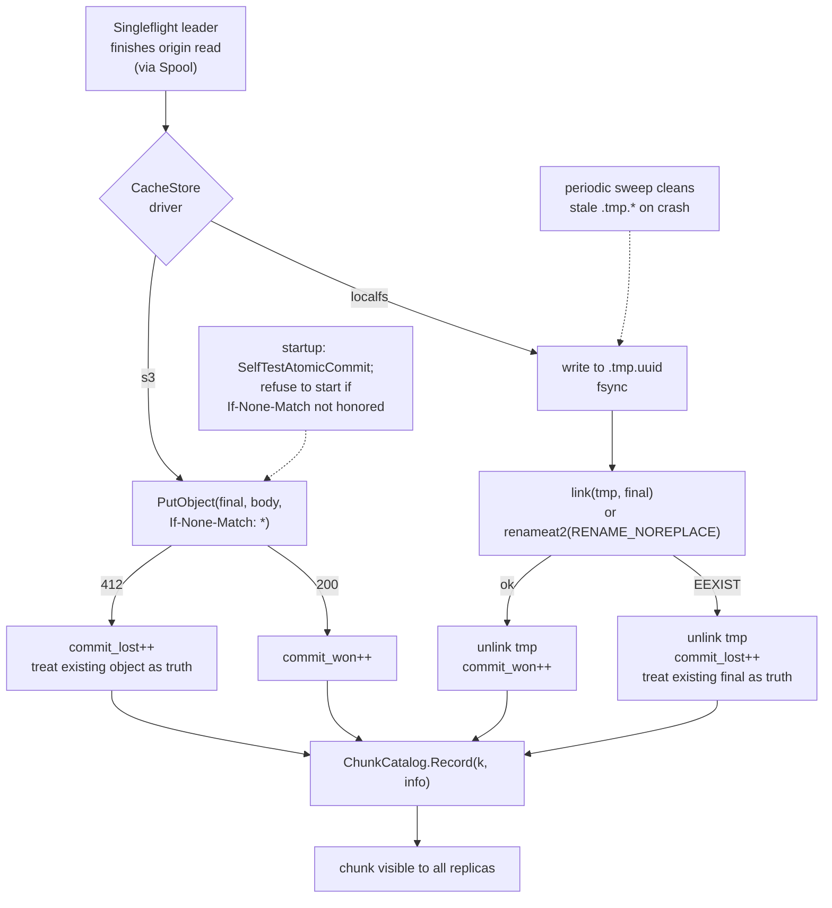

## 10. Eviction and capacity

Eviction is delegated to the CacheStore's storage system (e.g. VAST or S3
lifecycle policies). Recommended baseline is age-based expiration on the
chunk prefix with a TTL chosen to fit the deployment's working set in the
available capacity. Operators tune the TTL based on
`origincache_origin_bytes_total` and capacity utilization metrics exposed
by the CacheStore. Because the on-store path is namespaced by
`origin_id` (s4), per-origin lifecycle policies can be configured
independently on the same CacheStore bucket.

The cache layer itself does not evict CacheStore objects in v1. The
in-memory `ChunkCatalog` uses a fixed-size LRU; entries falling out of it
are not evicted from the CacheStore, only from the metadata cache - a
subsequent request will rediscover the chunk via `CacheStore.Stat`.

The local **spool** (s7.2) is bounded by `spool.max_bytes`; full-spool
conditions block new fills briefly, then return `503 Slow Down` to
clients. Spool entries are released as soon as in-flight readers drain.

Future work (Phase 4): if hot-chunk re-fetch from origin caused by
lifecycle eviction proves material, add an in-cache access-tracking layer
inside the `chunkcatalog` package and an opt-in active-eviction loop. This
does not affect any other interface in the system.

## 11. Horizontal scale

Cluster membership comes from the headless Service: an A-record lookup
returns the IPs of all Ready pods backing the Service. Cluster code
consumes that list, refreshes it on a configurable interval (default 5s),
and rendezvous-hashes `ChunkKey` against pod IPs to select a coordinator
**per chunk**. The replica that received the client request acts as the
**assembler** (s7.3): for each chunk in the requested range, it serves
from CacheStore on hit, performs a local singleflight + tee + spool +
commit if it is the coordinator, or issues a per-chunk
`GET /internal/fill?key=<k>` to the coordinator on the coordinator's
internal mTLS listener (s7.8). The assembler stitches returned bytes into
the client response, slicing the first and last chunk to match the
client `Range`.

Pod names are not stable under a Deployment; we never address peers by
name, only by the IPs the headless Service publishes.

We accept up to one duplicate fill per chunk during membership flux (e.g.
rolling restarts when a pod's IP changes); the duplicate-fill metric (see
[plan.md#6-observability](./plan.md#6-observability)) makes that visible.

Replication factor = 1 in v1 (cache loss is recoverable from origin).
Optional R=2 for hot chunks deferred to Phase 4. Every replica sees the
entire CacheStore. No replica owns bytes; replica loss never strands data.

### Diagram 10: Membership & rendezvous hash

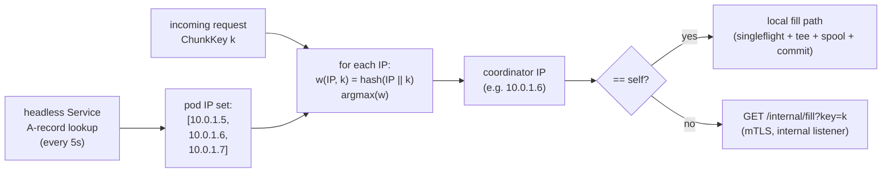

### Diagram 11: Rolling restart membership flux

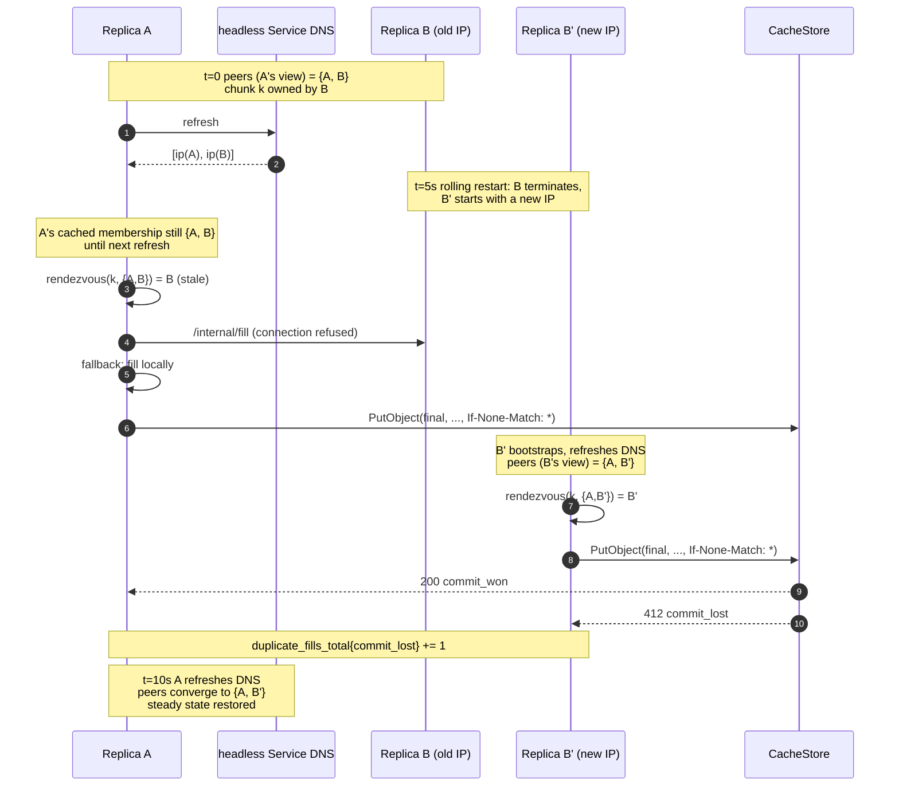
