# OriginCache - Design (mechanism & flow)

Status: draft for review (round 2 incorporating reviewer feedback)
Owner: TBD

> Implementation phases, repo layout, configuration, ops, and approval
> checklist: see [plan.md](./plan.md).

---

## Table of contents

### Sections

1. [Overview](#1-overview)
2. [Decisions](#2-decisions)
3. [Terminology](#3-terminology)
4. [Architecture](#4-architecture)
5. [Chunk model](#5-chunk-model)
6. [Request flow](#6-request-flow)
   - [6.1 HEAD request flow](#61-head-request-flow)
   - [6.2 LIST request flow](#62-list-request-flow)
   - [6.3 HTTP error-code mapping](#63-http-error-code-mapping)
7. [Internal interfaces](#7-internal-interfaces)
8. [Stampede protection](#8-stampede-protection)
   - [8.1 Per-`ChunkKey` singleflight](#81-per-chunkkey-singleflight)
   - [8.2 TTFB tee + spool](#82-ttfb-tee--spool)
   - [8.3 Cluster-wide deduplication via per-chunk fill RPC](#83-cluster-wide-deduplication-via-per-chunk-fill-rpc)
   - [8.4 Origin backpressure](#84-origin-backpressure)
   - [8.5 Cancellation safety](#85-cancellation-safety)
   - [8.6 Failure handling without re-stampede](#86-failure-handling-without-re-stampede)
   - [8.7 Metadata-layer singleflight](#87-metadata-layer-singleflight)
   - [8.8 Internal RPC listener](#88-internal-rpc-listener)
9. [Azure adapter: Block Blob only](#9-azure-adapter-block-blob-only)
10. [Concurrency, durability, correctness](#10-concurrency-durability-correctness)
    - [10.1 Atomic commit (per CacheStore driver)](#101-atomic-commit-per-cachestore-driver)
    - [10.2 Catalog correctness, typed errors, circuit breaker](#102-catalog-correctness-typed-errors-circuit-breaker)
    - [10.3 Range, sizes, and edge cases](#103-range-sizes-and-edge-cases)
    - [10.4 Spool locality contract](#104-spool-locality-contract)
    - [10.5 Readiness probe (`/readyz`)](#105-readiness-probe-readyz)
11. [Bounded staleness contract](#11-bounded-staleness-contract)
12. [Create-after-404 and negative-cache lifecycle](#12-create-after-404-and-negative-cache-lifecycle)
13. [Eviction and capacity](#13-eviction-and-capacity)
14. [Horizontal scale](#14-horizontal-scale)

### Request scenarios

Concrete request-flow narratives. Each scenario has a stable letter
identifier reused in the diagram heading.

- **Scenario A** - warm read (cache hit): [Diagram 3](#diagram-3-scenario-a---warm-read-cache-hit)
- **Scenario B** - cold miss, local coordinator: [Diagram 4](#diagram-4-scenario-b---cold-miss-local-coordinator)
- **Scenario C** - concurrent miss, same-replica joiner: [Diagram 5](#diagram-5-scenario-c---concurrent-miss-same-replica-joiner)
- **Scenario D** - cold miss, remote coordinator (cross-replica fill): [Diagram 6](#diagram-6-scenario-d---cold-miss-remote-coordinator)
- **Scenario E** - range spanning multiple coordinators: [Diagram 7](#diagram-7-scenario-e---range-spanning-multiple-coordinators)
- **Scenario F** - Azure non-BlockBlob rejection: [Diagram 8](#diagram-8-scenario-f---azure-non-blockblob-rejection)
- **Scenario G** - create-after-404 (operator upload after client miss): [Diagram 10](#diagram-10-scenario-g---create-after-404-timeline)
- **Scenario H** - rolling restart membership flux: [Diagram 12](#diagram-12-scenario-h---rolling-restart-membership-flux)

Other diagrams (D1, D2, D9, D11) depict architecture, math, or
mechanism rather than request scenarios and are reachable from the
Sections list above.

---

## 1. Overview

Edge devices inside an on-prem datacenter need read access to large files
held in cloud blob storage (S3, Azure Blob). Direct egress per device is
unacceptable (cost, latency, throughput, security boundary). OriginCache is
a read-only caching layer, deployed inside each datacenter, that fronts
cloud blob storage with an S3-compatible API. Clients issue range reads;
OriginCache serves from a shared in-DC store when present, otherwise
fetches from the cloud origin, stores the chunk, and returns it.

This document describes the mechanism: decisions, components, request flow,
stampede protection, atomic commit, and horizontal-scale coordination. It
is paired with [plan.md](./plan.md), which covers deliverable scope, repo
layout, phasing, configuration, observability, and operational concerns.

## 2. Decisions

| Area | Decision |
|---|---|
| Client API | S3-compatible HTTP; `GET` + `HEAD` + `ListObjectsV2`; supports `Range`. |
| Auth (v1) | Network-perimeter trust + bearer / mTLS. No SigV4 verification yet. |
| Origins | S3 + Azure Blob behind a pluggable `Origin` interface. |
| Azure constraint | Block Blobs only. Append/Page Blobs rejected at `Head`. |
| Backing store | Pluggable `CacheStore`; `localfs` for dev, `s3` (VAST or any S3-compatible in-DC object store) **or** `posixfs` (NFSv4.1+, Weka native, CephFS, Lustre, GPFS, or any shared POSIX FS that honors `link()` / `EEXIST` and directory `fsync`) for prod. The CacheStore is the source of truth for chunk presence. Driver choice is a deployment-time decision per replica set; `s3` and `posixfs` are interchangeable from the cache layer's perspective. |
| In-DC S3 vs. cloud S3 | The in-DC S3-compatible store is treated identically to cloud S3 at the protocol level. The only difference is "much faster, in-DC". Both `Origin` and the `cachestore/s3` driver are thin S3-client adapters with no special-casing. The `cachestore/posixfs` driver replaces the S3 protocol with shared-POSIX primitives but presents the same `CacheStore` interface, so nothing above s7 changes. |
| CacheStore atomic-commit primitive | Two equivalent primitives, picked per driver: object-store `PutObject + If-None-Match: *` (used by `cachestore/s3`) and POSIX `link()` / `renameat2(RENAME_NOREPLACE)` returning `EEXIST` (used by `cachestore/localfs` and `cachestore/posixfs`). Both are atomic, no-clobber, and have a "you lost the race" failure mode that maps cleanly onto `commit_lost`. Each driver runs `SelfTestAtomicCommit` at boot and refuses to start on backends that don't honor its primitive. |
| Chunking | Fixed 8 MiB default (configurable 4-16 MiB). `chunk_size` baked into `ChunkKey`. |
| Consistency | **Origin objects are immutable per operator contract**: an `(origin_id, bucket, key)` never has its bytes modified once published; replacement must be a new key. `ETag` is identity, not freshness. `If-Match: <etag>` on every `Origin.GetRange` is defense-in-depth that traps in-flight overwrites only. Bounded staleness uses two TTLs: `metadata_ttl` (default 5m) on positive entries (caps in-place-overwrite contract violations; see [s11](#11-bounded-staleness-contract)) and `negative_metadata_ttl` (default 60s) on negative entries (caps the create-after-404 unavailability window after an operator uploads a previously-missing key; see [s12](#12-create-after-404-and-negative-cache-lifecycle)). |
| Catalog | In-memory `ChunkCatalog` fronting `CacheStore.Stat`. No persistent local index. |
| Eviction | Deferred to CacheStore lifecycle policy. Cache layer ships no eviction code in v1. |
| Prefetch | Sequential read-ahead by default. Configurable depth, capped concurrency. |
| Cluster | Kubernetes Deployment + headless Service for peer discovery + ClusterIP/LB for client traffic. Rendezvous hashing on pod IP selects the coordinator per `ChunkKey` for miss-fills only; receiving replica is the **assembler** that fans out per-chunk fill RPCs to coordinators (s8.3). All replicas can read all chunks directly from the CacheStore on hits. |
| Inter-replica auth | Separate internal mTLS listener (default `:8444`) chained to an internal CA distinct from the client mTLS CA; authorization = "presenter source IP is in current peer-IP set" (s8.8). |
| Local spool | Every fill writes origin bytes through a local spool (`internal/origincache/fetch/spool`) so slow joiners always have a local fallback regardless of CacheStore driver (s8.2). |
| Atomic commit | `localfs` and `posixfs` stage inside `<root>/.staging/<uuid>` with parent-dir fsync, then `link()` no-clobber (returns `EEXIST` to the loser); `s3` uses direct `PutObject` with `If-None-Match: *`. Each driver runs `SelfTestAtomicCommit` at boot: `s3` proves the backend honors `If-None-Match: *`; `posixfs` proves the backend honors `link()` / `EEXIST` and that directory fsync is durable, and additionally enforces `nfs.minimum_version` (default `4.1`, with opt-in `nfs.allow_v3`) and refuses to start on Alluxio FUSE backends. Cold-path TTFB is gated on local Spool fsync, not on CacheStore commit; commit-after-serve failure becomes `commit_after_serve_total{result="failed"}` rather than a client error (s8.6). |
| Tenancy | Single tenant, single origin credential set in v1. |
| Edge rate limiting | Out of scope for v1. No per-client / per-IP / per-credential rate limiting at the S3 edge. Hot-client mitigation in v1 is implicit: the per-replica origin semaphore (s8.4) caps cold-fill concurrency regardless of caller, and the singleflight (s8.1) coalesces concurrent identical fills. Edge rate limiting is Phase 4 and only if measured. |
| Repo home | This repo. Layout mirrors `machina`. |

## 3. Terminology

Terms used throughout this document. Forward-references point at the
section that defines or implements the full mechanism.

- **Replica** - one running pod of the `origincache` Deployment. All
  replicas are interchangeable; there is no per-pod state.
- **Client** - external caller using an S3-compatible HTTP API (e.g.
  `aws-sdk`, `boto3`).
- **Origin** - upstream cloud blob store (AWS S3 or Azure Blob); read-only
  from our perspective. Interface defined in
  [s7](#7-internal-interfaces).
- **CacheStore** - the in-DC durable store that holds cached chunk bytes
  and is shared by all replicas. Pluggable: `localfs` for dev, `s3` (e.g.
  VAST or any S3-compatible in-DC object store) and `posixfs` (shared
  POSIX FS - NFSv4.1+, Weka native, CephFS, Lustre, GPFS) for prod;
  driver choice is a deployment-time decision and is invisible above the
  cachestore boundary. Treated as the source of truth for chunk presence.
  Interface in [s7](#7-internal-interfaces); commit semantics in
  [s10](#10-concurrency-durability-correctness).
- **Chunk** - a fixed-size byte range of an origin object (default 8 MiB);
  the unit of caching and fill.
- **ChunkKey** - the immutable identifier for a chunk:
  `{origin_id, bucket, object_key, etag, chunk_size, chunk_index}`. Full
  definition in [s5](#5-chunk-model).
- **Headless Service** - Kubernetes `Service` with `clusterIP: None`; its
  DNS A-record resolves to the IPs of all Ready pods. We poll it (default
  every 5s) to discover the current peer set.
- **Rendezvous hashing** (a.k.a. Highest Random Weight, HRW) - for a given
  key, score each peer with `hash(peer_ip || key)` and pick the argmax.
  Stable under membership changes that don't add or remove the winning
  peer. We use it to pick exactly one coordinator per chunk from the
  current peer set.
- **Coordinator** - the replica that rendezvous hashing selects to perform
  the miss-fill for a particular chunk. Ownership is **per chunk**, not
  per request and not per object: a single client request spanning N
  chunks may have N different coordinators.
- **Assembler** - the replica that received the client request. It is
  responsible for stitching the client response. For each chunk in the
  requested range, the assembler either (a) reads from CacheStore on a
  hit, (b) runs a local miss-fill if it is the coordinator for that
  chunk, or (c) issues an internal fill RPC to the coordinator otherwise.
  See [s8.3](#83-cluster-wide-deduplication-via-per-chunk-fill-rpc).
- **Singleflight** - a per-key in-process deduplication primitive.
  Concurrent requests for the same `ChunkKey` share a single in-flight
  fill: the first arrival is the **leader** (issues the origin GET);
  subsequent arrivals are **joiners** (wait on the leader's stream). Full
  mechanism in [s8.1](#81-per-chunkkey-singleflight).
- **Tee** - the leader's origin byte stream is split two ways: into a
  small in-memory ring buffer for low-TTFB joiners, and into the Spool
  (below) for slow joiners that fall behind the ring head. Joiners
  therefore stream through the leader rather than waiting for the full
  disk write. Full mechanism in [s8.2](#82-ttfb-tee--spool).
- **Spool** - bounded local-disk staging area for in-flight fills
  (`internal/origincache/fetch/spool`). Ensures slow joiners always have a
  local fallback regardless of CacheStore driver. Detail in
  [s8.2](#82-ttfb-tee--spool).
- **Atomic CacheStore commit** - the leader publishes the completed chunk
  in a single no-clobber operation: `link()` /
  `renameat2(RENAME_NOREPLACE)` for `localfs`; `PutObject` +
  `If-None-Match: *` for `s3`. Concurrent commits cannot overwrite each
  other; the loser is recorded as `commit_lost`. See
  [s10](#10-concurrency-durability-correctness).
- **Per-chunk internal fill RPC** - `GET /internal/fill?key=<encoded
  ChunkKey>` over mTLS on the internal listener (default `:8444`). The
  assembler calls the coordinator when a chunk is missed and the
  coordinator is not self. See [s8.8](#88-internal-rpc-listener).
- **Immutable origin contract** - operator promise that an
  `(origin_id, bucket, key)` never has its bytes modified once published;
  replacement is always a new key. The cache trusts this contract; on
  violation, the bounded staleness window is `metadata_ttl` (default 5m).
  Full statement in [s11](#11-bounded-staleness-contract).
- **Spool-fsync gate** - the cold-path TTFB barrier: the first body byte
  is released to the client only after the chunk is durably fsynced into
  the local Spool. The CacheStore commit happens asynchronously after
  that; commit failure does not affect the in-flight client response.
  Detail in [s8.2](#82-ttfb-tee--spool) and [s8.6](#86-failure-handling-without-re-stampede).
- **CacheStore circuit breaker** - per-process error-rate breaker around
  `CacheStore` calls. On sustained `ErrTransient` / `ErrAuth`, the
  breaker opens, short-circuits writes, and surfaces via metrics and
  `/readyz`. Defaults: 10 errors / 30s window, 30s open, 3 half-open
  probes. Detail in [s10.2](#102-catalog-correctness-typed-errors-circuit-breaker).
- **Negative-cache entry** - a metadata-cache entry recording an
  authoritative `404` (or unsupported-blob-type rejection) from
  origin. Reused for `negative_metadata_ttl` (default 60s) before
  re-Heading. Bounds the create-after-404 unavailability window;
  see [s12](#12-create-after-404-and-negative-cache-lifecycle).
- **Shared-POSIX CacheStore** - the `cachestore/posixfs` driver: a
  `CacheStore` backed by a shared POSIX-style filesystem mounted on every
  replica at the same path. Concrete supported backends are NFSv4.1+ (the
  baseline), Weka native (`-t wekafs`), CephFS (`-t ceph`), Lustre
  (`-t lustre`), and IBM Spectrum Scale / GPFS (`-t gpfs`). Disqualified
  on purpose: Alluxio FUSE (no `link(2)`, no atomic no-overwrite rename,
  no NFS gateway). The driver depends on
  `internal/origincache/cachestore/internal/posixcommon/` (link-based
  commit, dir-fsync, staging-dir helpers, fan-out path layout) which is
  also depended on by `cachestore/localfs`. Detail in
  [s10.1.2](#1012-cachestoreposixfs).
- **Atomic-commit primitive** - the no-clobber publish step that ends a
  fill. Two equivalent shapes: object-store
  `PutObject + If-None-Match: *` (used by `cachestore/s3`) and POSIX
  `link()` / `renameat2(RENAME_NOREPLACE)` returning `EEXIST` to the
  loser (used by `cachestore/localfs` and `cachestore/posixfs`). Both are
  atomic, return a "you lost the race" signal that becomes
  `commit_lost`, and are validated at boot by `SelfTestAtomicCommit`.
  Detail in [s10.1](#101-atomic-commit-per-cachestore-driver).
- **Spool locality contract** - the local Spool (`spool.dir`) MUST live
  on a local block device. The cache layer enforces this at boot via
  `statfs(2)` against a denylist of network filesystems
  (NFS / SMB / Ceph / Lustre / GPFS / FUSE) and refuses to start on
  violation. Governed by `spool.require_local_fs` (default `true`). The
  rationale and the boot check are in
  [s10.4](#104-spool-locality-contract); the spool's role in the
  cold-path TTFB barrier is in [s8.2](#82-ttfb-tee--spool).

## 4. Architecture

A single binary, `origincache`, deployed as a Kubernetes Deployment.
Replicas discover each other through a headless Service and refresh the
peer set on a configurable interval (default 5s). A request from a client
lands on one replica - the **assembler** - which iterates the requested
range chunk-by-chunk. For each `ChunkKey`, the assembler reads directly
from the shared CacheStore on a hit; on a miss it routes to the chunk's
**coordinator** (selected by rendezvous hashing on the current peer-IP
set) for a singleflight + tee + spool + atomic-commit fill. The
coordinator may be the assembler itself, in which case the fill runs
locally; otherwise the assembler issues a per-chunk internal fill RPC.
All terms are defined in [s3](#3-terminology). Single tenant. One origin
credential set per deployment.

### Diagram 1: System overview

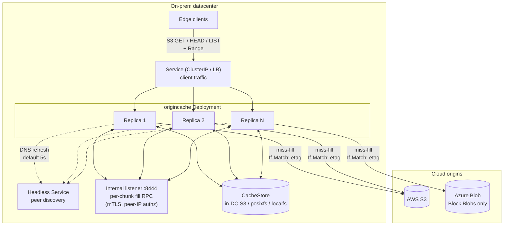

## 5. Chunk model

- `ChunkKey = {origin_id, bucket, object_key, etag, chunk_size, chunk_index}`.
  - `origin_id` is a deployment-scoped identifier from config (e.g.
    `aws-us-east-1-prod`, `azure-eastus-research`). Required. Namespaces
    cache key derivation and the on-store path so two deployments can
    safely share a CacheStore bucket.
  - `etag` captures immutability. A new ETag is treated as a new logical
    object and gets a fresh set of chunks. Old chunks age out via the
    CacheStore's lifecycle policy.
  - `chunk_size` is part of the key so a runtime config change does not
    silently corrupt or shadow existing data.
- `chunk_index = floor(byte / chunk_size)`.
- An object metadata cache holds `{origin_id, bucket, key} -> {size, etag,
  content_type, last_validated, last_status}` with a small TTL. Avoids
  re-`HEAD`ing origin on every request.

The CacheStore's namespace **is** the chunk index. `ChunkKey`
deterministically produces a path. Cache key derivation uses canonical
length-prefixed encoding to remove ambiguity from separators that may
appear in any field:

```
LP(s)   = LE64(uint64(len(s))) || s
hashKey = sha256(
            LP(origin_id) ||
            LP(bucket)    ||
            LP(key)       ||
            LP(etag)      ||
            LE64(chunk_size)
          )
path    = "<origin_id>/<hex(hashKey)>/<chunk_index>"
```

`origin_id` appears in the path in the clear (and `chunk_size` is folded
into the hash, not the path) so operators can run per-origin lifecycle
policies and target a specific deployment with `aws s3 rm --recursive
<bucket>/<origin_id>/`.

The `cachestore/posixfs` driver inserts a 2-character hex fan-out
between `<origin_id>` and `<hex(hashKey)>` to keep directory sizes
manageable on multi-PB working sets; that variant and its
`cachestore.posixfs.fanout_chars` knob are specified in
[s10.1.2](#1012-cachestoreposixfs). The `s3` and `localfs` drivers use
the unmodified path above.

**Operational note: changing `chunk_size`.** Because `chunk_size` is a
field of `ChunkKey` and is folded into the path hash, changing it in
deployment config never corrupts or shadows existing chunks; old-sized
chunks remain valid byte ranges of the old logical layout but are no
longer addressable. Operators should plan for transient storage
doubling and a cold-period origin-cost spike when changing
`chunk_size` on a hot working set: the working set is rebuilt at the
new size on demand while the old set ages out via the CacheStore
lifecycle policy (or, on `posixfs`, the operator's external sweep -
see [s13](#13-eviction-and-capacity)).

Whether a chunk is present is answered by `CacheStore.Stat(key)`. An
in-memory `ChunkCatalog` LRU memoizes recent positive lookups so the hot
path never touches the CacheStore for metadata. The catalog is purely a
hot-path optimization; it can be dropped at any time without affecting
correctness.

For a request `Range: bytes=A-B`:

```
firstChunk = A / chunk_size
lastChunk  = B / chunk_size
for cid := firstChunk; cid <= lastChunk; cid++ {  // streaming iterator
    fetchOrServe(cid)                              // + sliding prefetch window
    sliceWithin(cid, max(A, cid*sz), min(B, (cid+1)*sz - 1))
}
```

The chunk loop is a **streaming iterator**: at no point is the full
`[]ChunkKey` for the range materialized into a slice. Prefetch operates on
a sliding window of `min(prefetch_depth, lastChunk - cid)` ahead of the
current cursor. A configurable `server.max_response_bytes` cap returns
`416 Requested Range Not Satisfiable` (with header
`x-origincache-cap-exceeded: true`) before any cache lookup if the
computed response size exceeds the cap.

### Diagram 2: Range request -> chunk index mapping

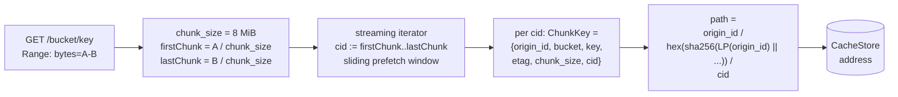

## 6. Request flow

1. `GET /{bucket}/{key}` arrives with optional `Range`.
2. Auth middleware (bearer / mTLS) validates the caller.
3. `fetch.Coordinator` looks up object metadata in the metadata cache. On
   miss, **per-replica** singleflight at the metadata layer issues at most
   one `HEAD` per object per replica per metadata-cache window. Cluster-wide
   bound is therefore N HEADs per object per window worst case where N is
   the current peer-set size; this is acceptable in v1 (a cluster-wide HEAD
   singleflight is Phase 4). Two TTLs apply, asymmetric by design (s12):
   **positive entries** (`200` + ETag) are reused for `metadata_ttl`
   (default 5m), which also bounds the staleness window if the
   immutable-origin contract (s11) is violated. **Negative entries**
   (`404`, unsupported-blob-type) are reused for `negative_metadata_ttl`
   (default 60s), which bounds the create-after-404 unavailability window
   after an operator uploads a previously-missing key.
4. If the request has `Range`, validate against `ObjectInfo.Size`; serve
   `416` if unsatisfiable. Compute `firstChunk` and `lastChunk`. If
   `server.max_response_bytes > 0` and the computed response size exceeds
   it, return `400 RequestSizeExceedsLimit` (S3-style XML error body)
   with `x-origincache-cap-exceeded: true`. `416` is reserved for true
   Range-vs-object-size violations.
5. Iterate the chunk range as a streaming iterator. For each `ChunkKey`:
   - **ChunkCatalog hit:** open reader from `CacheStore`. Typed
     `CacheStore` errors (s7) are honored: only `ErrNotFound` triggers a
     refill; `ErrTransient` surfaces as `503 Slow Down` with `Retry-After`,
     `ErrAuth` surfaces as `502 Bad Gateway` and counts toward the
     `/readyz` `ErrAuth` threshold (default 3 consecutive -> NotReady).
   - **ChunkCatalog miss:** call `CacheStore.Stat(key)`. If present,
     record in the catalog and serve from the CacheStore. If absent, take
     the miss-fill path (s8), which routes to the coordinator for that
     specific chunk via local singleflight or per-chunk internal RPC.
6. **Spool-fsync gate (cold path)**: response headers (`Content-Length`,
   `Content-Range`, `ETag`, `Accept-Ranges: bytes`) are deferred until
   the **first chunk** of the range is durably fsynced into the local
   **Spool** (s8.2). The CacheStore commit happens asynchronously after
   that, using whichever atomic primitive the configured driver
   advertises (`PutObject + If-None-Match: *` for `s3`; `link()` /
   `EEXIST` for `localfs` and `posixfs`). The assembler is driver-
   agnostic: it calls `CacheStore.PutChunk` and treats the typed error
   the same way regardless of backing store. Commit-after-serve failure
   does NOT affect the in-flight client response; it increments
   `origincache_commit_after_serve_total{result="failed"}` and the chunk
   is **not** recorded in the `ChunkCatalog` (the next request will
   refill). Pre-spool-fsync failures - origin unreachable,
   `OriginETagChangedError`, semaphore timeout, internal RPC failure -
   return a clean HTTP error (typically `502 Bad Gateway` or
   `503 Slow Down`). Warm-path TTFB is unchanged: the gate is the
   `CacheStore.GetChunk` first byte. `Content-Length` and `Content-Range`
   are computable from `ObjectInfo.Size` and the chunk math, so deferring
   headers does not lose information; it adds roughly one Spool-fsync
   latency to TTFB on the cold path.
7. **Mid-stream failure**: once any body byte has been written, no HTTP
   error status is possible. Mid-stream failures abort the response
   (HTTP/2 `RST_STREAM` with `INTERNAL_ERROR`; HTTP/1.1 `Connection:
   close` after the partial write) and increment
   `origincache_responses_aborted_total{phase="mid_stream",reason}`. S3
   clients (aws-sdk, boto3, etc.) detect this via `Content-Length`
   mismatch and retry.
8. If sequential prefetch is enabled, the iterator schedules asynchronous
   fills for the next N chunks (capped per blob and globally) one chunk
   ahead of the cursor.

### Diagram 3: Scenario A - warm read (cache hit)

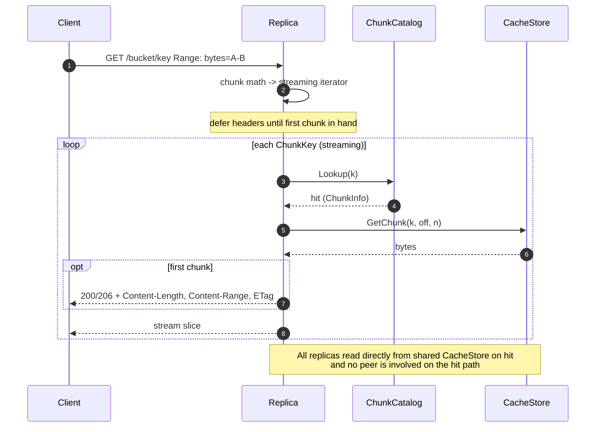

### Diagram 4: Scenario B - cold miss, local coordinator

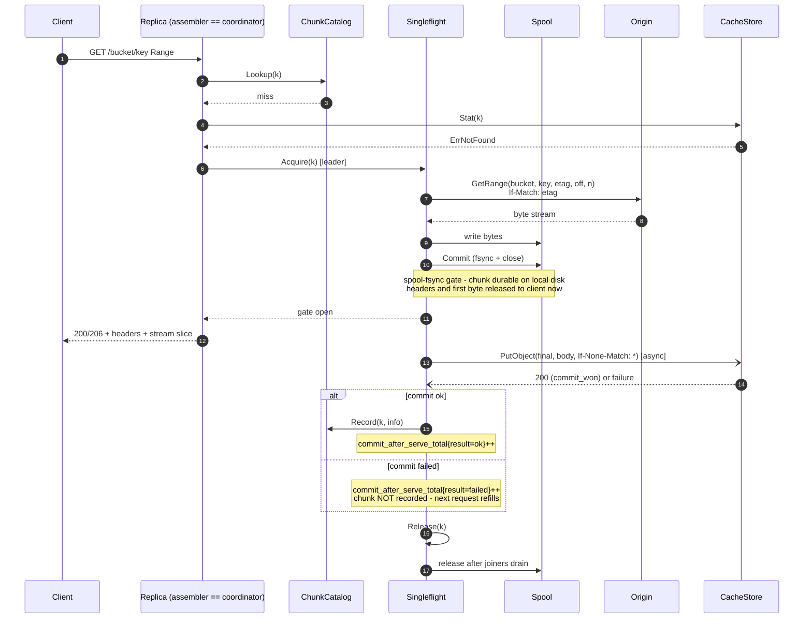

### 6.1 HEAD request flow

`HEAD /{bucket}/{key}` is served entirely from object metadata; no
chunk lookup is performed.

1. Auth as for GET.
2. `fetch.Coordinator` looks up `ObjectInfo` in the metadata cache.
   On miss, the metadata-layer singleflight (s8.7) issues at most one
   `Origin.Head` per object per replica per `metadata_ttl` window.
3. On success, return `200 OK` with `Content-Length:
   ObjectInfo.Size`, `ETag: "ObjectInfo.ETag"`, `Content-Type:
   ObjectInfo.ContentType`, `Accept-Ranges: bytes`. No
   `CacheStore.Stat` and no `CacheStore.GetChunk` calls.
4. Negative cases reuse the GET error mapping (s6.3): `404` is
   negatively cached for `negative_metadata_ttl` (s12); an unsupported azureblob
   blob type (s9) returns `502 OriginUnsupported` with the
   `x-origincache-reject-reason` header.

HEAD does NOT validate `If-Match` / `If-None-Match` / `If-Modified-Since`
preconditions against the cache state in v1; conditional HEAD is a
read-only client-side concern that operates on the returned `ETag`.

### 6.2 LIST request flow

`GET /{bucket}/?list-type=2&prefix=...` (S3 ListObjectsV2). v1 LIST is
a thin pass-through with per-replica metadata-layer singleflight; no
LIST result is cached on disk.

1. Auth as for GET.
2. The request parameters `(prefix, continuation-token / start-after,
   max-keys, delimiter)` are forwarded verbatim to `Origin.List`. The
   continuation token returned to the client is the origin's token
   passed through unchanged. There is no token rewriting.
3. **Per-replica LIST singleflight** keyed on
   `(origin_id, bucket, prefix, marker, max)` collapses concurrent
   identical LIST calls on the same replica. There is no cluster-wide
   LIST singleflight in v1 - cluster-wide cold fan-out can produce up
   to `N` `Origin.List` calls per identical query, where `N` is the
   peer-set size. Acceptable in v1 (LIST is rare on the intended
   workload); a cluster-wide LIST singleflight is Phase 4 only if
   measured.
4. **azureblob origin**: when `cachestore.azureblob.list_mode = filter`
   (the default), non-BlockBlob entries are stripped while
   continuation tokens are preserved (s9). `passthrough` mode disables
   filtering and returns the entire listing including unsupported
   blob types.
5. LIST does NOT populate the metadata cache for individual entries.
   A subsequent GET / HEAD on a listed key still triggers an
   `Origin.Head` (subject to its own singleflight and TTL). Rationale:
   eager metadata population on large listings would balloon the
   metadata cache, and the intended GET workload addresses keys that
   are already known.
6. Origin failures during LIST surface as `502 Bad Gateway`
   (`ErrTransient` upstream) or the corresponding S3 error code; LIST
   does NOT trip the CacheStore circuit breaker because it never
   touches the CacheStore.

LIST is intentionally a thin pass-through in v1. The intended workload
(large immutable artifacts under known keys) makes correctness the
only concern; if heavy-LIST workloads emerge, a Phase 4 LIST cache
with prefix-keyed cluster-wide singleflight is the natural follow-up.

### 6.3 HTTP error-code mapping

The complete catalog of HTTP statuses the cache layer can return on
the **client edge**. Internal-listener (`:8444`, s8.8) statuses are
listed inline in s8.3 and are not reproduced here.

| Status | S3-style code | Reason | Triggered by | Client retry? |
|---|---|---|---|---|
| `200 OK` / `206 Partial Content` | (none) | normal hit or successful fill | hit + range OK; cold-path fill past spool-fsync gate | n/a |
| `400 RequestSizeExceedsLimit` | `RequestSizeExceedsLimit` | response would exceed `server.max_response_bytes` | range math at request entry; `x-origincache-cap-exceeded: true` | no (different range) |
| `416 Requested Range Not Satisfiable` | `InvalidRange` | range vs. `ObjectInfo.Size` violation | range math at request entry | no (different range) |
| `502 Bad Gateway` | `OriginUnreachable` | origin error pre-spool-fsync gate | `Origin.GetRange` 5xx; origin DNS failure; semaphore exhausted past wait | yes, small backoff |
| `502 Bad Gateway` | `OriginETagChanged` | `OriginETagChangedError` from `Origin.GetRange` (s8.6) | mid-flight overwrite caught by `If-Match` | yes (next request re-Heads) |
| `502 Bad Gateway` | `OriginUnsupported` | non-BlockBlob azureblob (s9) | `Origin.Head` returns unsupported blob type | no |
| `502 Bad Gateway` | `BackendUnavailable` | CacheStore `ErrAuth` | CacheStore credentials rejected | no (operator) |
| `503 Slow Down` | `SlowDown` | CacheStore `ErrTransient` | CacheStore 5xx / timeout / throttle | yes |
| `503 Slow Down` | `SlowDown` | spool full | `spool.max_inflight` exhausted past wait | yes |
| `503 Slow Down` | `SlowDown` | breaker open | per-process CacheStore breaker open (s10.2) | yes |
| `503 Service Unavailable` | (probe) | replica NotReady | `/readyz` failing predicates (s10.5) | n/a (LB drain) |
| (mid-stream abort) | n/a | post-first-byte failure | CacheStore or origin failure after Spool-fsync gate | client SDK detects via `Content-Length` mismatch and retries |

`Retry-After: 1s` is set on every `503 Slow Down`. Pre-first-byte
errors carry an S3-style XML body (`<Error><Code>...<Message>...`).
Mid-stream aborts terminate the response (`HTTP/2 RST_STREAM(INTERNAL_ERROR)`
or `HTTP/1.1 Connection: close`) and increment
`origincache_responses_aborted_total{phase="mid_stream",reason}`.

## 7. Internal interfaces

The mechanism's named seams. Implementations live under
`internal/origincache/`; see [plan.md#3-repo-layout](./plan.md#3-repo-layout-mirrors-machina).

```go
// Origin: read-only view of upstream blob store. GetRange takes the etag
// from the prior Head and uses it as an If-Match precondition; mid-flight
// overwrite returns OriginETagChangedError.
type Origin interface {
    Head(ctx context.Context, bucket, key string) (ObjectInfo, error)
    GetRange(ctx context.Context, bucket, key, etag string, off, n int64) (io.ReadCloser, error)
    List(ctx context.Context, bucket, prefix, marker string, max int) (ListResult, error)
}

// OriginETagChangedError is returned by Origin.GetRange when the origin
// rejects the If-Match precondition. The fill is refused and the metadata
// cache entry for {origin_id, bucket, key} is invalidated; the next
// request re-Heads and gets a fresh ChunkKey.etag.
type OriginETagChangedError struct {
    Bucket, Key string
    Want, Got   string // Want = ETag we expected; Got = current ETag if known
}

// CacheStore: where chunk bytes physically live in the DC. Treated as the
// source of truth for chunk presence; backed by an in-DC S3-like service
// in production and a local directory in dev. PutChunk is atomic and
// no-clobber; the second concurrent PutChunk for the same key returns a
// CommitLost error. Read/Stat methods return typed errors:
//   - ErrNotFound:  chunk is absent. ONLY this error triggers a refill.
//   - ErrTransient: backend hiccup (5xx, timeout, throttle). Surfaced as
//                   503 Slow Down + Retry-After. Counts toward the
//                   per-process circuit breaker (see s10.2).
//   - ErrAuth:      backend rejected credentials (401/403). Surfaced as
//                   502 BadGateway. Counts toward the breaker AND toward
//                   the /readyz consecutive-ErrAuth threshold (default 3
//                   -> NotReady).
type CacheStore interface {
    GetChunk(ctx context.Context, k ChunkKey, off, n int64) (io.ReadCloser, error)
    PutChunk(ctx context.Context, k ChunkKey, size int64, r io.Reader) error // atomic, no-clobber
    Stat(ctx context.Context, k ChunkKey) (ChunkInfo, error)
    SelfTestAtomicCommit(ctx context.Context) error // startup probe
}

// CacheStore typed errors. Wrap with %w so callers use errors.Is.
var (
    ErrNotFound  = errors.New("cachestore: not found")
    ErrTransient = errors.New("cachestore: transient")
    ErrAuth      = errors.New("cachestore: auth")
)

// ChunkCatalog: in-memory, best-effort record of chunks known to be
// present in the CacheStore. Purely a hot-path optimization; the
// CacheStore is the source of truth. A Lookup miss falls through to
// CacheStore.Stat; the result is Recorded for subsequent requests.
//
// Forget is invoked when an entry is known to be invalid:
//   - on OriginETagChangedError, the assembler Forgets the now-stale
//     ChunkKey (its etag has been superseded);
//   - on a CacheStore.GetChunk returning ErrNotFound for a key that
//     was previously Recorded (lifecycle eviction caught the entry).
// In v1 there are no other callers; in particular, lifecycle
// eviction does not push notifications back into the catalog and
// stale entries are repaired lazily via the ErrNotFound path above.
type ChunkCatalog interface {
    Lookup(k ChunkKey) (ChunkInfo, bool)
    Record(k ChunkKey, info ChunkInfo)
    Forget(k ChunkKey)
}

// Cluster: peer discovery + rendezvous hashing. Returns the coordinator
// peer for a given ChunkKey. self == coordinator means handle locally.
// InternalDial returns a transport (HTTP/2 over mTLS) for issuing
// /internal/fill RPCs to a non-self peer. ServerName returns the stable
// SAN (default "origincache.<ns>.svc") used for TLS verification across
// rolling restarts and pod-IP churn; per-replica internal-listener certs
// MUST include this SAN.
type Cluster interface {
    Coordinator(k ChunkKey) Peer  // returns self or remote Peer
    Self() Peer
    Peers() []Peer                // current membership snapshot
    InternalDial(ctx context.Context, p Peer) (InternalClient, error)
    ServerName() string           // e.g. "origincache.<ns>.svc"
}

// Spool: bounded local-disk staging area for in-flight fills. Every fill
// writes through the spool so slow joiners can fall back from the leader's
// ring buffer to a local disk reader regardless of CacheStore driver.
type Spool interface {
    Begin(k ChunkKey, size int64) (SpoolWriter, error)
    Reader(k ChunkKey, off int64) (io.ReadCloser, error)
    Release(k ChunkKey) // drop spool entry once all in-flight readers are done
}

type SpoolWriter interface {
    io.Writer
    Commit() error // fsync + close
    Abort() error  // discard
}

// ---------------------------------------------------------------------
// Supporting types referenced by the interfaces above.
// ---------------------------------------------------------------------

// ObjectInfo: result of a successful Origin.Head and the metadata-cache
// entry shape. LastValidated and LastStatus are advisory and used for
// negative-cache TTL accounting (s8.6).
type ObjectInfo struct {
    Size          int64
    ETag          string
    ContentType   string
    LastValidated time.Time
    LastStatus    int // last HTTP status seen from the origin
}

// ChunkInfo: result of a successful CacheStore.Stat or
// ChunkCatalog.Lookup. Size is the on-store byte length, which equals
// chunk_size for all chunks except the last chunk of an object (which
// is partial; see s10.3).
type ChunkInfo struct {
    Size      int64
    Committed time.Time
}

// ListResult: paginated result from Origin.List.
type ListResult struct {
    Entries     []ObjectEntry
    NextMarker  string
    IsTruncated bool
}

// ObjectEntry: one item in a ListResult. BlobType is azureblob-specific
// and lets the cache filter non-BlockBlob entries while preserving
// continuation tokens (s9).
type ObjectEntry struct {
    Key      string
    Size     int64
    ETag     string
    BlobType string // "" for s3 origin; "BlockBlob" / "PageBlob" / "AppendBlob" for azureblob
}

// Peer: a single replica in the current peer-set snapshot returned by
// Cluster.Peers / Cluster.Coordinator / Cluster.Self.
type Peer struct {
    IP   string // pod IP from the headless Service A-record
    Self bool   // true iff this is the current process
}

// InternalClient: HTTP/2 over mTLS client to a peer's internal listener.
// Returned by Cluster.InternalDial. v1 exposes a single RPC; the
// surface can grow as additional internal RPCs are introduced.
type InternalClient interface {
    Fill(ctx context.Context, k ChunkKey) (io.ReadCloser, error)
}
```

Implementations:

- `Origin`: `origin/s3`, `origin/azureblob` (Block Blob only). Both pass
  the caller's `etag` as `If-Match` on the underlying GET; both translate
  the backend's "precondition failed" status into `OriginETagChangedError`.
- `CacheStore`: `cachestore/localfs` (dev), `cachestore/s3` (in-DC
  S3-compatible object store, e.g. VAST), `cachestore/posixfs` (shared
  POSIX FS: NFSv4.1+ baseline, plus Weka native, CephFS, Lustre, GPFS).
  See [s10.1](#101-atomic-commit-per-cachestore-driver) for atomic-commit
  specifics per driver. The two POSIX-shaped drivers (`localfs` and
  `posixfs`) share their commit primitives (`link()` no-clobber, dir
  fsync, staging-dir layout, optional fan-out) via
  `internal/origincache/cachestore/internal/posixcommon/`; this is an
  internal-to-cachestore package and is not visible to the rest of the
  cache layer.
- `ChunkCatalog`: a single in-memory LRU implementation.
- `Cluster`: a single implementation that polls the headless Service
  (default 5s), computes rendezvous hashes against pod IPs, and exposes
  an mTLS HTTP/2 client for the internal listener.
- `Spool`: a single implementation backed by a configured local directory
  (`spool.dir`) with a capacity cap (`spool.max_bytes`) and an in-flight
  cap (`spool.max_inflight`).

## 8. Stampede protection

The single most important hot-path correctness issue. Layered defense.

### 8.1 Per-`ChunkKey` singleflight

Process-local map `inflight: map[ChunkKey]*Fill`, guarded by a mutex. Each
`*Fill` has a `done` channel, an error slot, the resulting `ChunkInfo`, a
bounded ring buffer, a `Spool` handle (s8.2), and a refcount. Acquire
path: under the lock, either return the existing entry as a joiner or
insert a new entry and become the leader. Release path: leader removes
the entry from the map after signalling, so any thread arriving while the
entry is mapped joins; any thread arriving after removal records the
chunk in the `ChunkCatalog` (which the leader populated before releasing)
and serves a normal hit.

### 8.2 TTFB tee + spool

Naive singleflight makes joiners wait for the leader's full disk write,
then re-read from disk. Instead the leader splits origin bytes two ways:

1. **Ring buffer** (in-memory, bounded 1-2 MiB by default). Joiners
   obtain a `Reader` over this buffer that replays buffered bytes and
   blocks on a condition variable for more. This delivers low TTFB for
   on-pace joiners.
2. **Spool** (local disk file via the `Spool` interface). The leader
   writes every byte to a local spool file before (or in parallel with)
   uploading to the CacheStore. A slow joiner that falls behind the ring
   buffer head transparently switches to a `Spool.Reader(k, off)`. The
   spool exists because the production `cachestore/s3` driver streams
   directly into `PutObject` and does not produce a readable on-disk tmp
   file - without the spool, slow joiners on the s3 path would have no
   local fallback. The spool unifies behavior across `localfs`, `s3`,
   and `posixfs` drivers.

**Spool locality is mandatory.** The Spool MUST live on a local block
device. At boot, the cache layer runs `statfs(2)` against `spool.dir`
and refuses to start (exit non-zero) if the filesystem magic matches a
network FS denylist (NFS, SMB / CIFS, CephFS, Lustre, GPFS, FUSE
including Alluxio FUSE), incrementing
`origincache_spool_locality_check_total{result="refused"}`. Override is
intentionally not provided. Rationale: the spool-fsync gate (below) is
the cold-path TTFB barrier, and a remote-FS fsync would convert
microsecond-class local-NVMe latency into tens-of-milliseconds-class
network-round-trip latency, defeating the gate's purpose. Governed by
`spool.require_local_fs` (default `true`); see
[s10.4](#104-spool-locality-contract) for the full check.

**Spool-fsync gate (cold path)**: the cold-path TTFB barrier is the
local Spool fsync, NOT the cluster-wide CacheStore commit. Sequence:

1. Leader streams origin bytes into the Spool (and the ring buffer in
   parallel).
2. Once the chunk is fully written and `SpoolWriter.Commit()` has done a
   blocking `fsync` + close, the chunk is durable on this replica's
   local disk.
3. The first body byte to the client (and the deferred response headers)
   is released at this point.
4. The leader then performs the CacheStore commit asynchronously
   (`PutObject` + `If-None-Match: *` for `s3`; `link()` for `localfs`).
   Success increments `commit_after_serve_total{result="ok"}`; failure
   increments `commit_after_serve_total{result="failed"}` AND skips
   `ChunkCatalog.Record` so the next request refills. The client
   response is unaffected either way.

This separation is deliberate: it bounds cold-path TTFB by local disk
fsync (microseconds to low milliseconds on NVMe) rather than by the
in-DC CacheStore round-trip plus durability barrier (typically tens of
milliseconds on a healthy in-DC S3-like store, much higher under load).
The chunk is still durable on at least one replica's disk before the
client sees a byte; the only thing deferred is shared visibility.

Capacity: `spool.max_bytes` caps total spool footprint (default 8 GiB);
`spool.max_inflight` caps concurrent fills using the spool. When the
spool is full, new fills wait briefly on `spool.max_inflight` semaphore;
on timeout they return `503 Slow Down` to the client.

After the leader's CacheStore commit succeeds, the spool entry is retained
briefly so any in-flight joiner can finish reading; once joiner refcount
hits zero the spool entry is released. On commit-after-serve failure the
spool entry is released the same way; the cache layer simply does not
record the chunk and the next request refills.

### Diagram 5: Scenario C - concurrent miss, same-replica joiner

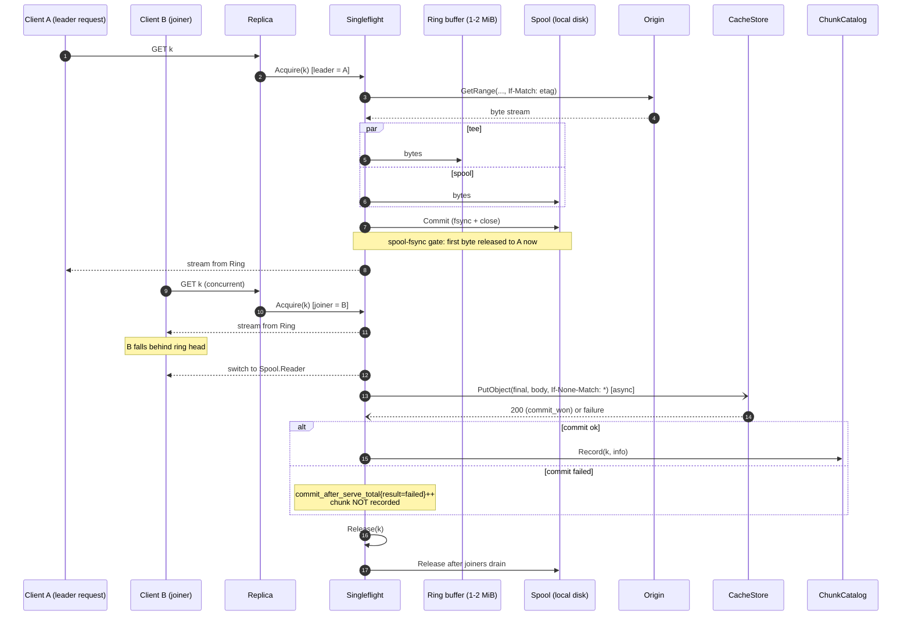

### 8.3 Cluster-wide deduplication via per-chunk fill RPC

Rendezvous hashing on `ChunkKey` against the current pod-IP set selects
**one coordinator per chunk**. A range request can span N chunks; those
chunks may have N distinct coordinators. The replica that receives the
client request is therefore the **assembler**, not a forwarder of the
whole HTTP request. For each `ChunkKey k` in the requested range:

- **Hit** (Catalog or `Stat` says present): assembler reads from
  `CacheStore` directly. No internal RPC.
- **Miss + `Coordinator(k) == self`**: assembler runs the local
  singleflight + tee + spool + commit path (s8.1, s8.2, s10).
- **Miss + `Coordinator(k) != self`**: assembler issues
  `GET /internal/fill?key=<encoded ChunkKey>` to the coordinator on the
  coordinator's internal listener (s8.8). The coordinator runs the
  singleflight + tee + spool + commit path locally and streams the chunk
  bytes back. The assembler stitches the returned bytes into the client
  response, slicing the first and last chunk to match the client's `Range`.

**Loop prevention**: the assembler sets `X-Origincache-Internal: 1` on
internal RPCs. A receiver seeing this header MUST self-check:
`Cluster.Coordinator(k) == Cluster.Self()`. On disagreement (membership
flux), the receiver returns `409 Conflict` with body
`{"reason":"not_coordinator"}`; the assembler falls back to local fill
for that chunk (one duplicate fill possible during flux; observable via
the duplicate-fills metric below). Receivers MUST NOT chain forward
internal RPCs.

Combined with s8.1, exactly one origin GET per cold chunk per cluster in
steady state. During membership change we accept up to one duplicate fill
per chunk (loser drops on commit collision; observable via
`origincache_origin_duplicate_fills_total{result="commit_lost"}` - see
[plan.md#6-observability](./plan.md#6-observability)). The duplicate-fill
metric is the leading indicator that this routing is working: a sustained
non-zero `commit_lost` rate signals chronic membership flux or a bug in
the hash distribution.

### Diagram 6: Scenario D - cold miss, remote coordinator

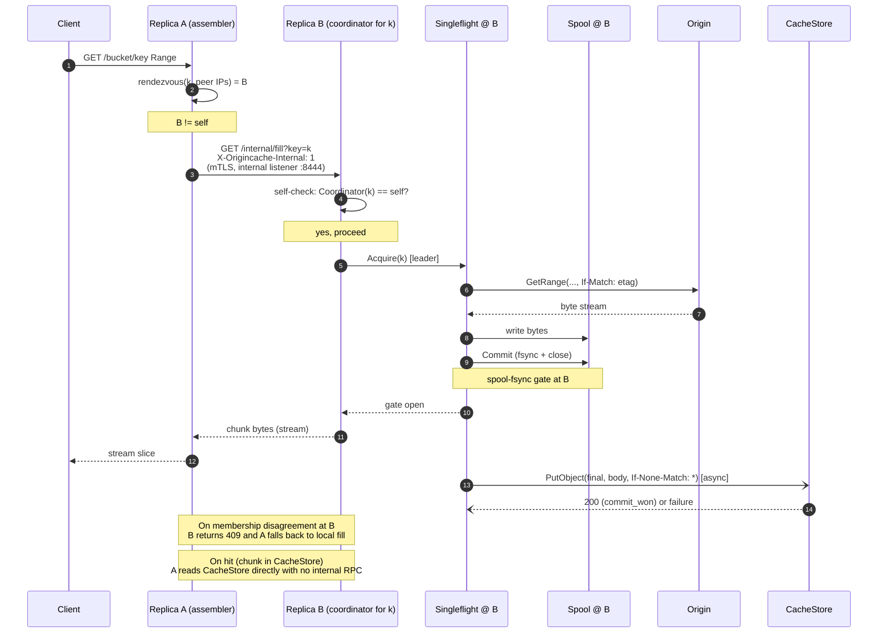

### Diagram 7: Scenario E - range spanning multiple coordinators

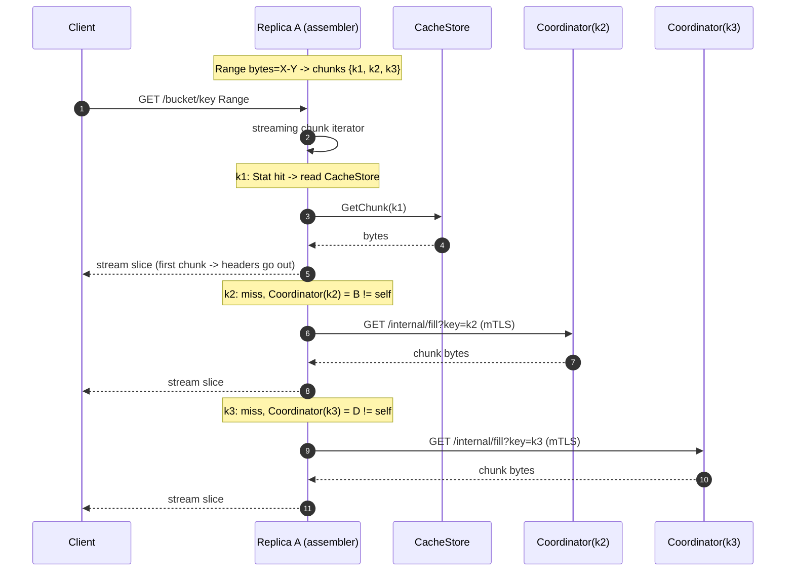

### 8.4 Origin backpressure

Each replica enforces a **per-replica** semaphore that caps concurrent
`Origin.GetRange` calls. The configured value is a per-replica cap, not a
cluster-wide one; given a desired global concurrency `target_global`, set
the per-replica cap as:

```
target_per_replica = floor(target_global / N_replicas)
```

with `N_replicas = len(Cluster.Peers())`. Defaults: 64-128 per replica,
which gives 192-384 global at the typical 3-replica deployment. A real
cluster-wide distributed limiter is deferred to Phase 4. The approximation
can transiently exceed `target_global` by up to
`(N_replicas - 1) * floor(target_global / N_replicas)` worst case during
membership flux; in practice this is bounded by the cluster size and is
acceptable for v1.

The current saturation is exposed as
`origincache_origin_inflight{origin}` (gauge, per-replica) so operators
can observe approach to the cap. Optional token bucket on origin
bytes/sec layered on top. Joiners do not consume tokens. If the
semaphore is saturated, leaders queue with bounded wait; on timeout the
request returns `503 Slow Down` so clients back off.

### 8.5 Cancellation safety

`Fill.run()` uses an internal long-lived context, not any single client's
context. The fill outlives any single requester. If every joiner cancels
we still finish the fill (cheap insurance; configurable to abort). A
joiner cancelling unblocks only itself.

### 8.6 Failure handling without re-stampede

- **Retryable error**: short-lived negative entry in the singleflight map
  (cooldown 100 ms - 1 s) so concurrent joiners share the failure rather
  than each retrying immediately.
- **`OriginETagChangedError`**: leader (a) invalidates the metadata cache
  entry for `{origin_id, bucket, key}`, (b) fails the in-flight fill, (c)
  joiners receive the same error and abort their responses (or, if
  pre-first-byte, get a `502 Bad Gateway`). The next request triggers a
  fresh `Head` and a new `ChunkKey` with the new ETag. Old chunks under
  the old ETag age out via the CacheStore lifecycle. Increments
  `origincache_origin_etag_changed_total`.
- **Hard 404 / unsupported blob type**: cached in the metadata cache as
  a negative entry for `negative_metadata_ttl` (default 60s,
  configurable). Per-replica HEAD singleflight (s8.7) caps origin HEAD
  load at one HEAD per object per replica per window. The full
  negative-cache lifecycle and the create-after-404 case (an operator
  uploads `K` after a client has already observed `404` on `K`) are in
  [s12](#12-create-after-404-and-negative-cache-lifecycle).
- **Retry inside the leader**: bounded exponential backoff (default 3
  attempts) before declaring failure, EXCEPT for `OriginETagChangedError`
  which is non-retryable (the object identity changed; refilling under
  the old ETag is the bug we are preventing). Joiners sit through retries
  on the same `Fill`.
- **`CommitFailedAfterServe` (post spool-fsync gate)**: after the client
  has already received the first byte (i.e. the Spool fsync succeeded),
  a CacheStore commit failure is NOT visible to the client. The leader
  increments `origincache_commit_after_serve_total{result="failed"}` and
  does NOT call `ChunkCatalog.Record`. Joiners on the same fill that are
  still draining the Spool finish normally; the next request for the
  same `ChunkKey` re-runs the fill (one extra origin GET worst case).
  Sustained non-zero `failed` rate is a CacheStore-health alert, not a
  per-request error path.
- **Typed `CacheStore` errors during read**: `ErrNotFound` triggers the
  miss-fill path; `ErrTransient` surfaces as `503 Slow Down` with
  `Retry-After: 1s`; `ErrAuth` surfaces as `502 Bad Gateway`. Sustained
  `ErrTransient` / `ErrAuth` trips the per-process **CacheStore circuit
  breaker** (s10.2). Sustained `ErrAuth` (default 3 consecutive) flips
  `/readyz` to NotReady so load balancers drain the replica.

### 8.7 Metadata-layer singleflight

Same pattern at the metadata cache:
`metaInflight: map[ObjectKey]*MetaFill`. Without this, a flood of
distinct cold keys shifts the storm from chunk GETs to chunk HEADs.
Stale-while-revalidate behavior: serve stale within a small margin while
one background refresh runs. The singleflight is **per-replica**: a
cluster-wide cold-fan-out can cause up to N HEADs per object per
`metadata_ttl` window where N is the current peer-set size. This is
acceptable in v1; a cluster-wide HEAD singleflight is Phase 4 only if
measured.

### 8.8 Internal RPC listener

Per-chunk fill RPCs (`GET /internal/fill?key=<encoded ChunkKey>`) are
served on a separate listener bound to a distinct port (default `:8444`,
config `cluster.internal_listen`). This isolates inter-replica traffic
from the client edge.

- **Transport**: HTTP/2 over mTLS.
- **Server cert**: per-replica cert (e.g. cert-manager-issued) chained to
  a configured **internal CA** (`cluster.internal_tls.ca_file`). The
  internal CA is **distinct** from the client mTLS CA so a leaked client
  cert cannot be used to dial the internal listener. The cert MUST
  include the stable SAN `cluster.internal_tls.server_name` (default
  `origincache.<ns>.svc`); pod-IP SANs are NOT used because pod IPs
  change on rolling restart.
- **Client auth**: peer presents a client cert chained to the internal CA
  AND the peer's source IP must be in the current peer-IP set
  (`Cluster.Peers()`). The IP-set check guards against a leaked internal
  cert being usable from outside the Deployment.
- **TLS verification**: the dialer pins `tls.Config.ServerName` to the
  value returned by `Cluster.ServerName()` (the same stable SAN above)
  rather than to the destination pod IP. This keeps verification
  consistent across rolling restarts and pod-IP churn.
- **Authorization scope**: the internal listener serves `GET
  /internal/fill?key=<...>` only. No client identity is propagated from
  the assembler because chunk content is identity-independent: any
  authorized client at the assembler is entitled to the chunk bytes, and
  the coordinator is doing the same fill it would do for a local request.
- **NetworkPolicy**: ingress on `:8444` allowed only from pods with
  label `app=origincache` in the same namespace.
- **Loop prevention**: receiver enforces `X-Origincache-Internal: 1` ->
  self must be coordinator for the requested ChunkKey, else `409 Conflict`.

Metrics: `origincache_cluster_internal_fill_requests_total{direction=
"sent|received|conflict"}`,
`origincache_cluster_internal_fill_duration_seconds`.

## 9. Azure adapter: Block Blob only

Hardened constraint.

- Enforced in `internal/origincache/origin/azureblob.Head`. Block type is
  immutable on an existing blob (you have to delete and recreate to change
  it, which produces a new ETag), so checking once per `(container, blob,
  etag)` is sufficient.
- Detection via `Get Blob Properties` -> `BlobType` field. Reject anything
  other than `BlockBlob` with a typed error `UnsupportedBlobTypeError`
  exported from `internal/origincache/origin`.
- Surfaced to clients as HTTP `502 Bad Gateway` with S3 error code
  `OriginUnsupported`, body containing reason, plus
  `x-origincache-reject-reason: azure-blob-type=<type>` header.
- Negatively cached in the metadata cache for `negative_metadata_ttl`
  (default 60s; see [s12](#12-create-after-404-and-negative-cache-lifecycle))
  and
  singleflighted at the metadata layer to prevent re-probing.
- `ListObjectsV2` defaults to `filter` mode: non-Block Blob entries are
  skipped while preserving continuation tokens. `passthrough` mode is
  available for debugging.
- Config schema reserves `enforce_block_blob_only: true`. Setting it to
  false is rejected at startup.
- `Origin.GetRange` on the azureblob adapter uses `If-Match: <etag>` on
  the underlying Get Blob; `412 Precondition Failed` is translated to
  `OriginETagChangedError` (s8.6).
- Prometheus counter:
  `origincache_origin_rejected_total{origin="azureblob",reason="non_block_blob",blob_type=...}`.

### Diagram 8: Scenario F - Azure non-BlockBlob rejection

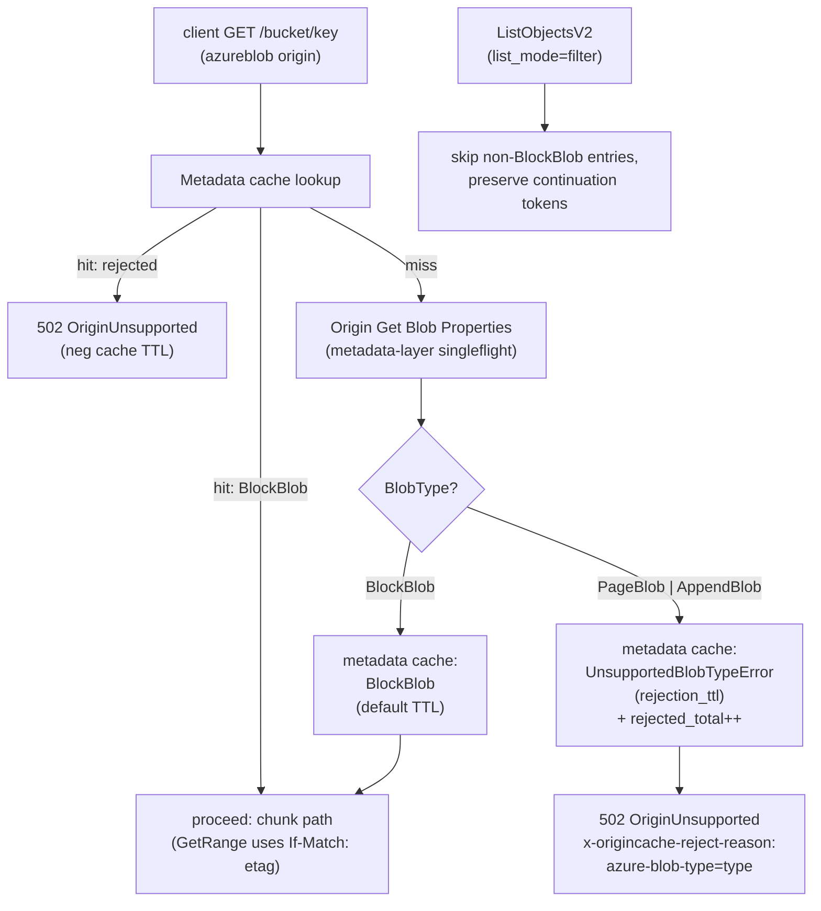

## 10. Concurrency, durability, correctness

### 10.1 Atomic commit (per CacheStore driver)

The leader publishes a chunk to the CacheStore atomically and
no-clobber: the second concurrent commit for the same key MUST lose
without overwriting the winner. Cold-path commit happens **after** the
spool-fsync gate (s8.2), so a commit failure here does NOT affect the
in-flight client response; it only increments
`origincache_commit_after_serve_total{result="failed"}` and skips
`ChunkCatalog.Record` (next request refills).

Three drivers ship in v1, mapped onto two equivalent atomic-commit
primitives. `localfs` and `posixfs` both use POSIX `link()` (or
`renameat2(RENAME_NOREPLACE)` on Linux) returning `EEXIST` to the
loser, and share their helpers via
`internal/origincache/cachestore/internal/posixcommon/`. `s3` uses
`PutObject + If-None-Match: *` returning `412` to the loser. All three
drivers run `SelfTestAtomicCommit` at boot.

Commit outcomes are recorded as label values on the metric
`origincache_origin_duplicate_fills_total{result="commit_won|commit_lost"}`
(s8.3). Throughout this section "increment commit_won" / "increment
commit_lost" is shorthand for "increment that counter with the
matching label value".

#### 10.1.1 cachestore/localfs

1. Leader stages the chunk inside `<root>/.staging/<uuid>` (a fixed
   subdirectory of the CacheStore root, NOT `/tmp` and NOT the spool
   directory). Staging inside the root keeps the file on the same
   filesystem as the destination, which is required for `link()` to
   succeed; the spool MAY be on a different filesystem and so cannot
   also serve as the staging area.
2. After write, `fsync(<staging file>)` then `fsync(<staging dir>)`.
3. Commit: `link(<root>/.staging/<uuid>, <final>)`. POSIX `link()` is
   atomic and returns `EEXIST` if the destination exists. On `EEXIST`,
   the leader treats the existing `<final>` as the source of truth,
   `unlink(<root>/.staging/<uuid>)`, `fsync(<root>/.staging/)`, and
   increments commit_lost. On success, `unlink(<root>/.staging/<uuid>)`,
   `fsync(<root>/.staging/)`, `fsync(<final parent dir>)`, and
   increment commit_won.
4. On Linux, `renameat2(RENAME_NOREPLACE)` is preferred when available
   (single syscall) with the same parent-dir fsync sequencing; the
   `link` + `unlink` form is the portable fallback (also works on
   macOS dev environments). Plain `rename()` is **never** used because
   it overwrites the destination on POSIX.
5. Crash recovery: a periodic background sweep (default every 1 hour)
   unlinks `<root>/.staging/<uuid>` entries older than
   `cachestore.localfs.staging_max_age` (default 1h), with a
   `fsync(<root>/.staging/)` after the batch. Nothing breaks if a
   staging file lingers briefly. Each sweep increments
   `origincache_localfs_dir_fsync_total{result}`.

#### 10.1.2 cachestore/posixfs

`posixfs` runs the same `link()` no-clobber primitive as `localfs`, but
against a shared POSIX-style filesystem mounted on every replica at the
same mount point and the same `<root>`. All replicas race the same
`link()` syscall against the same destination inode; the kernel (NFS
server, Weka, CephFS MDS, Lustre MDS, GPFS, etc.) is the arbiter, and
exactly one wins.

1. Backend selection and detection. At boot the driver inspects the
   filesystem under `<root>` via `statfs(2)` (`f_type`) and
   `/proc/mounts` and emits an info gauge
   `origincache_posixfs_backend{type,version,major,minor}` (e.g.
   `type="nfs",version="4.1"`, `type="wekafs"`, `type="ceph"`,
   `type="lustre"`, `type="gpfs"`). Operators MAY override the detected
   `type` via `cachestore.posixfs.backend_type` for backends with
   ambiguous magic numbers; the override is logged loudly. Detected
   `type="fuse"` triggers an extra check: if `/proc/mounts` source
   matches `alluxio` (case-insensitive), the driver increments
   `origincache_posixfs_alluxio_refusal_total` and exits non-zero with
   `cachestore/posixfs: Alluxio FUSE is unsupported (no link(2), no
   atomic no-overwrite rename, no NFS gateway); use cachestore.driver:
   s3 against the Alluxio S3 gateway instead`.
2. NFS minimum version. If `type="nfs"`, the driver reads the
   negotiated NFS version from `/proc/mounts` (the `vers=` option). If
   the version is below `cachestore.posixfs.nfs.minimum_version`
   (default `4.1`), the driver refuses to start. NFSv3 is opt-in only
   via `cachestore.posixfs.nfs.allow_v3: true`, which logs a loud
   warning and increments
   `origincache_posixfs_nfs_v3_optin_total`. Rationale: NFSv3 has weak
   retransmit semantics; NFSv4.0 has atomic CREATE EXCLUSIVE but no
   session idempotency; NFSv4.1+ provides session-based idempotency
   that makes `link()` / `EEXIST` safe under client retries.
3. Path layout adds a 2-character hex fan-out to keep directory sizes
   manageable on multi-PB working sets:
   `<root>/<origin_id>/<hash[0:2]>/<hash>/<chunk_index>` where `hash`
   is the existing s5 hex hash. Fan-out width is governed by
   `cachestore.posixfs.fanout_chars` (default `2`, 0 disables). The
   `localfs` driver does NOT add fan-out by default (small dev working
   sets), but the `posixcommon` helper supports it on both drivers.
4. Stage + commit + recovery: identical to `localfs` (steps 1-5 above)
   with the fan-out parent dirs created lazily and `fsync`ed on first
   use, and `cachestore.posixfs.staging_max_age` (default 1h) governing
   the sweep.
5. **Startup self-test** (`SelfTestAtomicCommit`): on driver init the
   `posixfs` driver creates a staging file, links it to a probe final,
   then attempts a second `link()` to the same probe final and asserts
   `EEXIST`. It then writes a known-size payload to the linked file via
   a separate handle and asserts the size is observable to a re-`stat`
   after `fsync(<final parent dir>)`. If `EEXIST` is not returned (the
   second `link()` succeeds, or returns a different error), or if the
   size verification fails, the driver exits non-zero with
   `cachestore/posixfs: backend does not honor link()/EEXIST or
   directory fsync; refusing to start`. Governed by
   `cachestore.posixfs.require_atomic_link_self_test` (default `true`;
   never disabled in production). On success, the driver records
   `origincache_posixfs_selftest_last_success_timestamp`.
6. NFS export hardening. `posixfs` documents (and the operator runbook
   enforces) that NFS exports MUST use `sync` (not `async`); an `async`
   export weakens the dir-fsync guarantee that the commit primitive
   depends on. The driver cannot detect server-side `async` directly;
   the runbook is the contract, and the boot self-test catches the most
   common misconfigurations by re-`stat`ing through the negotiated
   client cache.

#### 10.1.3 cachestore/s3

1. Leader streams origin bytes (via the Spool, s8.2) into a single
   `PutObject(final_key, body, If-None-Match: "*")`. There is no tmp
   key and no copy hop.
2. `200 OK` -> commit_won. `412 Precondition Failed` -> commit_lost
   (treat the existing object as the source of truth; no cleanup
   needed because no tmp object was created).
3. **Startup self-test** (`SelfTestAtomicCommit`): on driver init the
   `cachestore/s3` driver writes a probe key, then attempts a second
   `PutObject(probe_key, ..., If-None-Match: "*")` and asserts a
   `412` response. If the backend returns `200` instead (silently
   overwrites), the driver fails to start with `cachestore/s3:
   backend does not honor If-None-Match: *; refusing to start`. This
   prevents silent double-writes on backends that don't implement the
   precondition. Verified backends as of v1: AWS S3 (since 2024-08),
   MinIO. VAST: confirmation required during Phase 2 (see
   [plan.md#10-open-questions--risks](./plan.md#10-open-questions--risks)).

### 10.2 Catalog correctness, typed errors, circuit breaker

The CacheStore is the source of truth. The `ChunkCatalog` is purely an
optimization and may be dropped at any time without affecting correctness;
a `Lookup` miss falls through to `CacheStore.Stat` and refills the
catalog. Catalog entries that point at a now-absent chunk (e.g. evicted
by lifecycle) result in a `CacheStore.GetChunk` returning `ErrNotFound`,
which is the only error treated as a miss and refilled.

`CacheStore` returns three typed error classes (s7); the cache layer
honors them distinctly:

- **`ErrNotFound`** (chunk absent): triggers the miss-fill path. Normal
  cold-path behavior; not an error from the operator's perspective.
- **`ErrTransient`** (5xx, timeout, throttle): surfaced to the client as
  `503 Slow Down` with `Retry-After: 1s`. Counts toward the breaker.
  Does NOT trigger refill (would amplify load against an already-degraded
  backend).
- **`ErrAuth`** (401/403): surfaced as `502 Bad Gateway`. Counts toward
  the breaker. Counts toward the `/readyz` consecutive-`ErrAuth`
  threshold (default 3); on threshold the replica reports NotReady and
  load balancers drain it. A single non-`ErrAuth` success resets the
  counter.

To prevent amplifying degradation under sustained backend failure, a
**per-process CacheStore circuit breaker** wraps every `CacheStore`
call. Defaults (configurable, see plan.md s5):

- `error_window: 30s`
- `error_threshold: 10` (`ErrTransient` + `ErrAuth` count; `ErrNotFound`
  does not)
- `open_duration: 30s`
- `half_open_probes: 3`

State machine: **closed** (normal pass-through) -> **open** (immediately
short-circuits CacheStore writes with `ErrTransient`; reads still attempt
once per `open_duration / 10` for liveness probing) -> **half-open**
(allows up to `half_open_probes` test calls; on all-success returns to
closed; on any failure returns to open). Transitions are exposed as
`origincache_cachestore_breaker_transitions_total{from,to}` and the
current state as `origincache_cachestore_breaker_state` (0=closed,
1=open, 2=half_open).

### 10.3 Range, sizes, and edge cases

- Partial last chunk of a blob stored at its actual size; `ChunkInfo.Size`
  records it; range math respects it.
- `416 Requested Range Not Satisfiable` is returned by the server before
  any cache lookup, using object metadata, **only** for true Range vs.
  object-size violations.
- `server.max_response_bytes` overflow returns
  `400 RequestSizeExceedsLimit` (S3-style XML error body) with
  `x-origincache-cap-exceeded: true` (s6). It is reported as `400` and
  not `416` because the cap is a server policy, not a property of the
  object: clients cannot fix it by re-requesting a different Range past
  EOF.
- Origin failure during fill never commits the staging file or makes a
  final PutObject. Pre-spool-fsync-gate: surfaces as `502 Bad Gateway`
  to the client and as a transient negative singleflight entry.
  Post-spool-fsync-gate: response body completes from the local Spool;
  any CacheStore commit failure is invisible to the client and recorded
  as `commit_after_serve_total{result="failed"}` (s8.6).

### Diagram 9: Atomic commit (localfs vs posixfs vs s3 CacheStore)

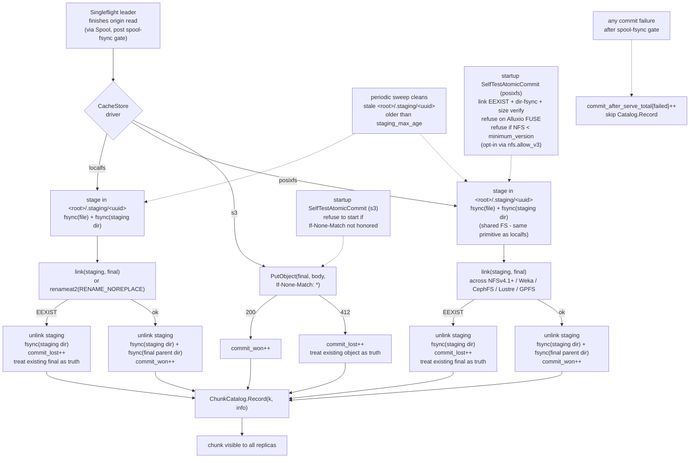

### 10.4 Spool locality contract

The local Spool (s8.2) is the cold-path TTFB barrier: the first body
byte to the client is gated on `SpoolWriter.Commit()`'s blocking
`fsync` + close. That gate budgets microsecond-class to low-millisecond
latency on a local NVMe. A network filesystem `fsync` instead pays a
network round-trip per commit, which is tens of milliseconds at best
and seconds during congestion. Putting the spool on a network FS
silently destroys the cache layer's TTFB guarantee.

To prevent that, the cache layer enforces a **boot-time locality
check** before any client traffic is accepted:

1. Resolve `spool.dir` to an absolute path; resolve symlinks.
2. Call `statfs(2)` on the resolved path. Read `f_type`.
3. Compare `f_type` against a denylist (these magic numbers indicate a
   network or virtual FS that violates the locality contract):
   - `NFS_SUPER_MAGIC` (`0x6969`) - any NFS version, including
     NFSv4.1+.
   - `SMB2_MAGIC_NUMBER` (`0xfe534d42`), `CIFS_MAGIC_NUMBER`
     (`0xff534d42`) - SMB / CIFS.
   - `CEPH_SUPER_MAGIC` (`0x00c36400`) - CephFS kernel client.
   - `LUSTRE_SUPER_MAGIC` (`0x0bd00bd0`) - Lustre.
   - `GPFS_SUPER_MAGIC` (`0x47504653`) - IBM Spectrum Scale.
   - `FUSE_SUPER_MAGIC` (`0x65735546`) - any FUSE mount, including
     Alluxio FUSE.
4. On match: increment
   `origincache_spool_locality_check_total{result="refused",fs_type="<name>"}`,
   log `spool: <spool.dir> is on a network filesystem (<name>); the
   spool MUST be on a local block device. Refusing to start. Set
   spool.dir to a local-NVMe-backed path or, for testing only, set
   spool.require_local_fs=false`, and exit non-zero.
5. On no match: increment
   `origincache_spool_locality_check_total{result="ok",fs_type="<name>"}`
   and proceed.

Override is `spool.require_local_fs: false` (default `true`). The
override exists for unit tests on developer laptops where the work
directory may be on an unusual FS; it is **not** intended for
production and MUST NOT be set in any deployed manifest. The metric
label `result="bypassed"` distinguishes overridden runs from clean
ones, and the boot log carries a loud `WARN spool.require_local_fs is
disabled; spool durability gate is best-effort` line.

The check is in `internal/origincache/fetch/spool/` and runs from
`cmd/origincache/origincache/main.go` before the HTTP listener binds.
It runs before any CacheStore self-test so a misconfigured spool fails
fast even on backends that would otherwise pass their own self-test.

### 10.5 Readiness probe (`/readyz`)

The HTTP `/readyz` endpoint reports whether the replica should
receive client traffic. It is checked by the Kubernetes readiness
probe and by front-of-cluster load balancers. Distinct from
`/livez`, which is a process-liveness check only.

**Response shape.**

- `200 OK`, body `{"ready": true}`, when **all** of the following
  predicates hold:
  1. boot self-tests have passed (`SelfTestAtomicCommit` for the
     configured CacheStore driver; spool locality check, s10.4);
  2. the per-process CacheStore circuit breaker (s10.2) is `closed`
     or `half_open`;
  3. consecutive `ErrAuth` count from the CacheStore is below
     `readyz.errauth_consecutive_threshold` (default 3);
  4. peer discovery (s14) has completed at least one successful DNS
     refresh since boot (the empty-peer fallback in s14 keeps the
     replica functional, but `/readyz` still requires one
     successful refresh so a totally broken DNS path does not stay
     silently masked);
  5. the local Spool has free capacity below `spool.max_bytes`.

- `503 Service Unavailable`, body
  `{"ready": false, "reasons": ["..."]}`, when any predicate above
  fails. The `reasons` array names the failing predicates by stable
  string keys (`selftest_pending`, `selftest_failed`,
  `breaker_open`, `errauth_threshold`, `peer_discovery_pending`,
  `spool_full`) so operators can triage from a probe response
  alone.

**NotReady -> Ready transitions.** The endpoint is stateless apart
from reading the underlying components. Predicates clear themselves
as the system recovers:

- breaker `open` -> `closed` after `half_open_probes` successful
  probes (s10.2);
- `ErrAuth` consecutive counter resets on any non-`ErrAuth` success;
- spool fullness clears as in-flight fills drain;
- peer discovery flips to "completed" on the first successful
  refresh and stays sticky for the lifetime of the process.

**`/livez`.** A liveness-only check that returns `200 OK` if the
process is running and the HTTP listener is bound; it does NOT
consider any of the predicates above and is intentionally trivial.
This separation lets the readiness probe drain a misconfigured
replica without restarting it (so operators can inspect logs).

`/readyz` and `/livez` are bound to the same client listener as the
S3 API; they are NOT served on the internal listener (`:8444`,
s8.8) because the internal listener's authorization scope is
restricted to `/internal/fill`.

## 11. Bounded staleness contract

OriginCache trusts an **operator contract** for correctness, and bounds
the consequences of contract violation by configuration.

**The contract.** For a given `(origin_id, bucket, object_key)`, the
underlying bytes are immutable for the life of the key. If the data
changes, operators MUST publish it under a new key. Replacement in place
is a contract violation.

**Why we trust it.** Cache key derivation includes the origin `ETag`
(s5), and a new ETag deterministically yields a new `ChunkKey` and a
fresh chunk path on the CacheStore. As long as the contract holds, the
cache cannot serve stale bytes: every change of identity is a change of
key.

**What happens if the contract is violated.** The cache may serve the
old bytes for up to one **`metadata_ttl`** window (default 5m,
configurable). Mechanism:

- Object metadata (`size`, `etag`, `content_type`) is cached for
  `metadata_ttl` to avoid re-`HEAD`ing on every request.
- During that window, requests resolve to the old `etag`, derive the
  same `ChunkKey`, and serve from cached chunks.
- After the window expires, the next request triggers a fresh `Head`,
  observes the new ETag, derives a new `ChunkKey`, and refills.

**Why this is acceptable for v1.** The intended workload is large
immutable artifacts (job inputs, model weights, training shards). The
contract matches how those are produced. The 5m window is a tunable
upper bound, not a typical case: a flood of distinct cold keys reads the
correct ETag on first contact with the cache.

**Defense in depth.** `If-Match: <etag>` is sent on every
`Origin.GetRange` (s8.6). If an in-flight fill races with an in-place
overwrite, the origin returns `412 Precondition Failed` and the leader
fails the fill, invalidates the metadata cache entry for
`{origin_id, bucket, key}`, and increments
`origincache_origin_etag_changed_total`. This catches the narrow window
where a violation happens between the cache's `Head` and its `GetRange`.
It does NOT catch a violation that happens between two complete
request lifecycles within the same `metadata_ttl` window; the
`metadata_ttl` cap is what bounds that case.

**No background re-validation in v1.** A bounded-freshness mode (periodic
background `Head` to refresh `etag` ahead of `metadata_ttl`) is Phase 4
material, only if measured to be needed. The default posture is "trust
the contract, cap the window".

Cross-references: [s2 Decisions / Consistency](#2-decisions),
[s8.6 Failure handling](#86-failure-handling-without-re-stampede),
[s10.2 Catalog correctness](#102-catalog-correctness-typed-errors-circuit-breaker),
[s12 Create-after-404 and negative-cache lifecycle](#12-create-after-404-and-negative-cache-lifecycle).

## 12. Create-after-404 and negative-cache lifecycle

### 12.1 The scenario

A client GETs a key `K` before the operator has uploaded it to
origin. The cache observes `404` from `Origin.Head(K)`, records a
negative metadata-cache entry, and returns `404` to the client. The
operator then uploads `K`. Subsequent client requests still see
`404` until the negative entry expires - the "we forgot to upload
that" case.

This is operationally indistinguishable from a contract violation
(s11): from the client's perspective, the bytes for `K` changed
without the cache being told. There is no event-driven invalidation
in v1 (deferred to Phase 4); the cache can only bound how long it
serves the stale `404`.

### 12.2 Two TTLs (positive vs negative)

The metadata cache uses two TTLs:

| TTL | Default | Bounds | Rationale |
|---|---|---|---|
| `metadata_ttl` | 5m | positive entry (`200` + ETag) reuse without re-Head | immutable-origin contract (s11); long TTL keeps HEAD load low |
| `negative_metadata_ttl` | 60s | negative entry (`404` / unsupported blob type) reuse without re-Head | operator "oops upload" recovery should be fast |

Asymmetric defaults reflect asymmetric operational reality:
positive-entry staleness only matters on contract violation;
negative-entry staleness matters every time an operator uploads a
previously-missing key, which is a normal operational event.

Per-replica HEAD singleflight (s8.7) caps the HEAD load that a short
negative TTL would otherwise create: a flood of distinct missing
keys generates at most one HEAD per object per replica per
`negative_metadata_ttl` window. At default settings (60s, 3
replicas) origin sees at most 3 HEADs per missing key per minute,
well under any S3 / Azure HEAD rate limit.

### 12.3 Worst-case unavailability window

After an operator uploads a previously-missing key:

- A replica that observed the original `404` keeps serving `404`
  for up to `negative_metadata_ttl` from its OWN observation time,
  regardless of when the upload happened. The TTL is
  observation-anchored, not upload-anchored, because the cache
  cannot know about the upload.
- A replica that did NOT observe the `404` will Head fresh on the
  first request after the upload and serve `200` immediately.
- Worst case across replicas: `negative_metadata_ttl` after the
  LATEST replica's observation of the old `404`. Under round-robin
  load balancing, clients can see alternating `404` / `200`
  responses during the drain window (Diagram 10).

There is no active invalidation in v1. Operator workaround: wait
`negative_metadata_ttl` after upload before announcing the key. An
admin-invalidation RPC is a Phase 4 deliverable
([plan.md s7](./plan.md#7-phased-delivery)).

### 12.4 Defense-in-depth and observability

`If-Match: <etag>` (s8.6) does NOT defend against this case: there
is no in-flight fill for a `404`'d key, so no precondition exists
to trip on. The TTL is the only bound.

Negative-cache metrics let operators observe drain progress after
an upload:

- `origincache_metadata_negative_entries` (gauge) - current count
  of negative entries.
- `origincache_metadata_negative_hit_total{origin_id}` (counter) -
  returns served from a negative entry. A spike after a known
  upload signals ongoing drain.
- `origincache_metadata_negative_age_seconds{origin_id}`
  (histogram) - age of negative entries at hit time. Use
  upper-bound percentiles to size `negative_metadata_ttl`.

Cross-references: [s2 Decisions / Consistency](#2-decisions),
[s6 Request flow](#6-request-flow),
[s8.6 Failure handling](#86-failure-handling-without-re-stampede),
[s8.7 Metadata-layer singleflight](#87-metadata-layer-singleflight),
[s11 Bounded staleness contract](#11-bounded-staleness-contract).

### Diagram 10: Scenario G - create-after-404 timeline

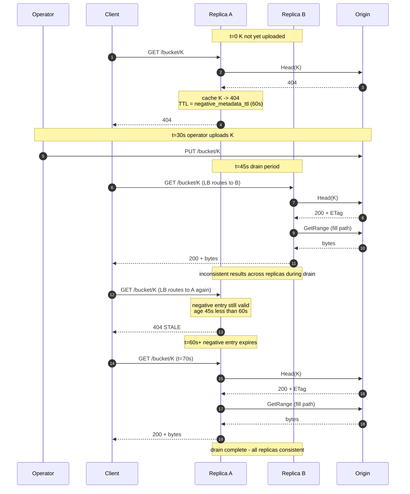

## 13. Eviction and capacity

Eviction is delegated to the CacheStore's storage system (e.g. VAST or S3
lifecycle policies). Recommended baseline is age-based expiration on the
chunk prefix with a TTL chosen to fit the deployment's working set in the
available capacity. Operators tune the TTL based on
`origincache_origin_bytes_total` and capacity utilization metrics exposed
by the CacheStore. Because the on-store path is namespaced by
`origin_id` (s5), per-origin lifecycle policies can be configured
independently on the same CacheStore bucket.

**`cachestore/posixfs` deployments**. Shared POSIX filesystems
(NFSv4.1+, Weka native, CephFS, Lustre, GPFS) do not provide native
object-lifecycle policies. The cache layer ships no automatic
posixfs eviction in v1; operators MUST schedule an external cleanup
mechanism. The recommended baseline is an age-based sweep against
`<root>/<origin_id>/` from cron or a Kubernetes `CronJob` (e.g.
`find <root>/<origin_id> -type f -atime +<n> -delete`). The sweep
runs out-of-band; the cache layer does not need to be aware of it,
because a `CacheStore.GetChunk` on a swept entry returns
`ErrNotFound` and re-enters the miss-fill path. Operators SHOULD
NOT sweep the staging subdirectory `<root>/.staging/` - that is
managed by the driver's own background sweep
(`cachestore.posixfs.staging_max_age`, default 1h, s10.1.2).

The cache layer itself does not evict CacheStore objects in v1. The
in-memory `ChunkCatalog` uses a fixed-size LRU; entries falling out of it
are not evicted from the CacheStore, only from the metadata cache - a
subsequent request will rediscover the chunk via `CacheStore.Stat`.

The local **spool** (s8.2) is bounded by `spool.max_bytes`; full-spool
conditions block new fills briefly, then return `503 Slow Down` to
clients. Spool entries are released as soon as in-flight readers drain.

**Capacity impact of `chunk_size` config changes.** See the
operational note in [s5](#5-chunk-model): changing `chunk_size`
orphans the existing chunk set under the old size; storage
transiently doubles and the working set is rebuilt at the new size
on demand. The CacheStore lifecycle policy (or, on `posixfs`, the
operator's external sweep above) ages the orphaned chunks out.

Future work (Phase 4): if hot-chunk re-fetch from origin caused by
lifecycle eviction proves material, add an in-cache access-tracking layer
inside the `chunkcatalog` package and an opt-in active-eviction loop. This
does not affect any other interface in the system.

## 14. Horizontal scale

Cluster membership comes from the headless Service: an A-record lookup
returns the IPs of all Ready pods backing the Service. Cluster code
consumes that list, refreshes it on a configurable interval (default 5s),
and rendezvous-hashes `ChunkKey` against pod IPs to select a coordinator
**per chunk**. The replica that received the client request acts as the
**assembler** (s8.3): for each chunk in the requested range, it serves
from CacheStore on hit, performs a local singleflight + tee + spool +
commit if it is the coordinator, or issues a per-chunk
`GET /internal/fill?key=<k>` to the coordinator on the coordinator's
internal mTLS listener (s8.8). The assembler stitches returned bytes into
the client response, slicing the first and last chunk to match the
client `Range`.

Pod names are not stable under a Deployment; we never address peers by
name, only by the IPs the headless Service publishes.

We accept up to one duplicate fill per chunk during membership flux (e.g.
rolling restarts when a pod's IP changes); the duplicate-fill metric (see
[plan.md#6-observability](./plan.md#6-observability)) makes that visible.

Replication factor = 1 in v1 (cache loss is recoverable from origin).
Optional R=2 for hot chunks deferred to Phase 4. Every replica sees the
entire CacheStore. No replica owns bytes; replica loss never strands data.

**Empty / unavailable peer set.** If `Cluster.Peers()` returns an
empty set (the headless Service has no Ready endpoints, the DNS
record returns NXDOMAIN, or the kube-dns / CoreDNS path is broken),
the replica treats itself as the only peer: rendezvous hashing
returns self for every `ChunkKey` and all fills run locally. The
replica does NOT refuse to serve; cluster-wide deduplication
(s8.3) degrades to per-replica deduplication for the duration. A
subsequent successful DNS refresh re-introduces peers without
process restart.

DNS-refresh outcomes are exposed as
`origincache_cluster_dns_refresh_total{result="ok|fail|empty"}` and
the current peer-set size as `origincache_cluster_peers` (gauge).
Boot-time failure is logged at WARN; sustained empty-peer state is
trivially observable from the gauge. The `/readyz` predicate
(s10.5) requires that **at least one** DNS refresh has succeeded
since boot; a totally broken DNS path therefore keeps the replica
NotReady and load balancers drain it, even though the empty-peer
local-fill fallback would otherwise let it serve.

### Diagram 11: Membership & rendezvous hash

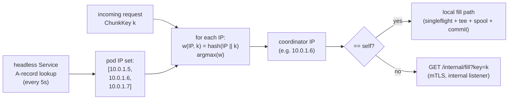

### Diagram 12: Scenario H - rolling restart membership flux

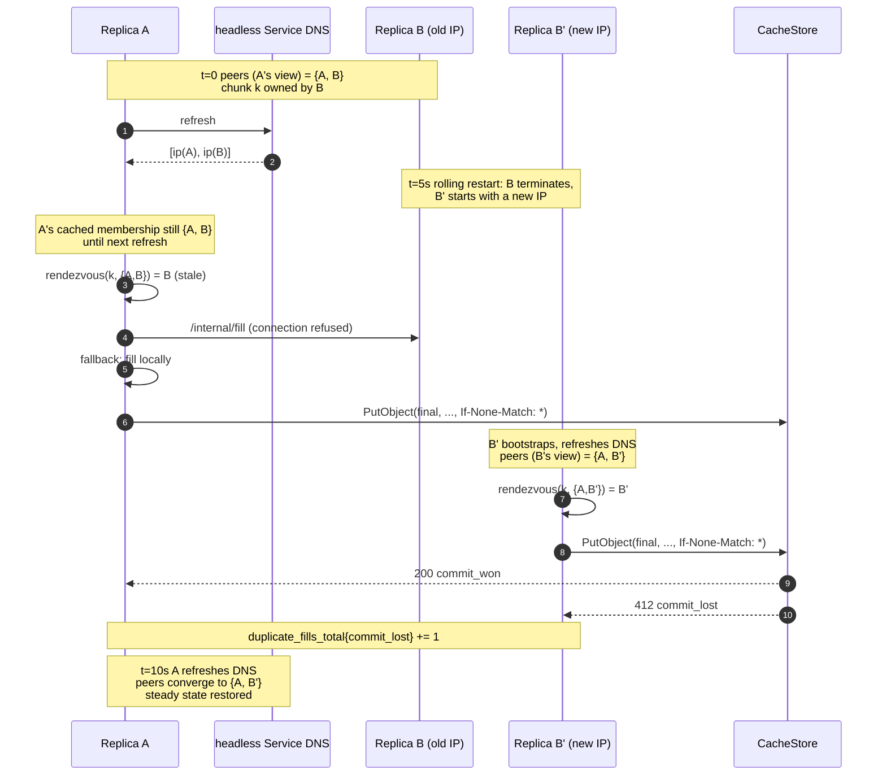
