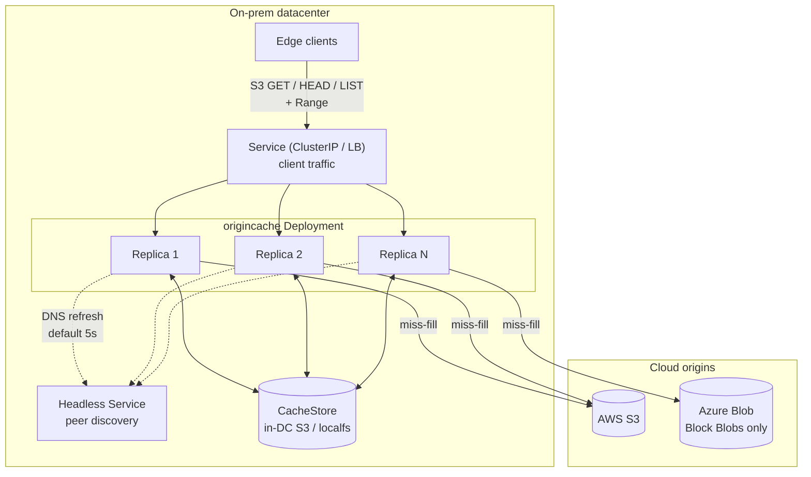
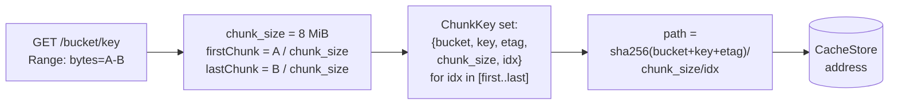
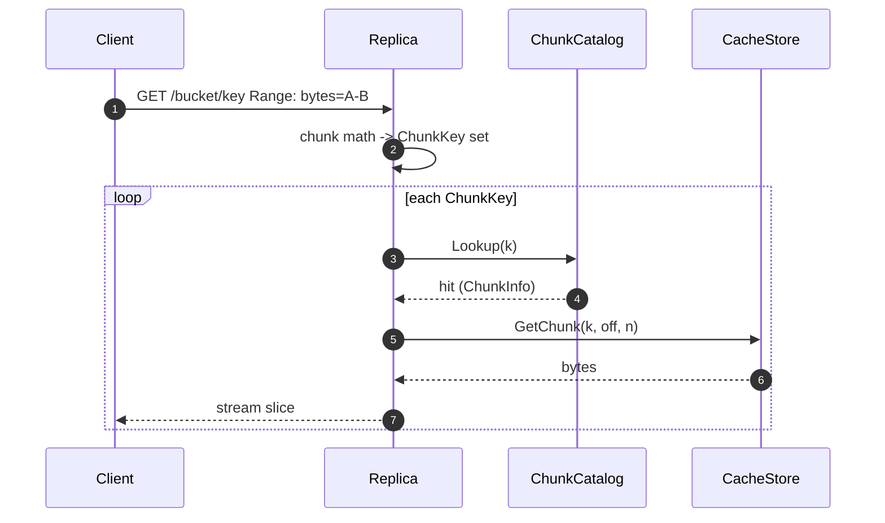
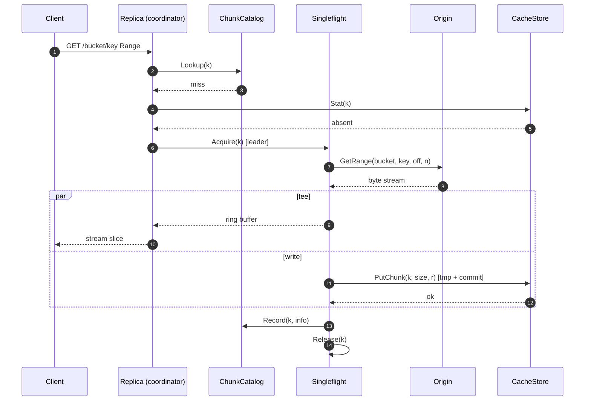
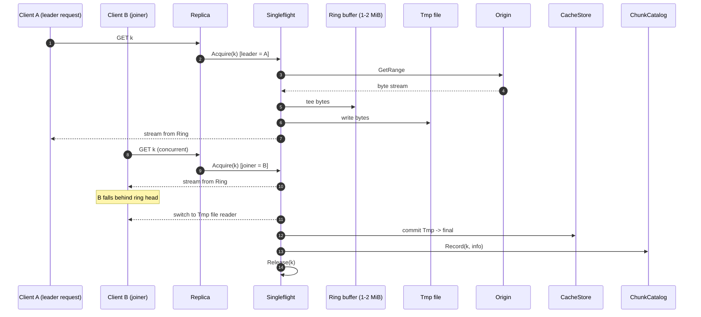
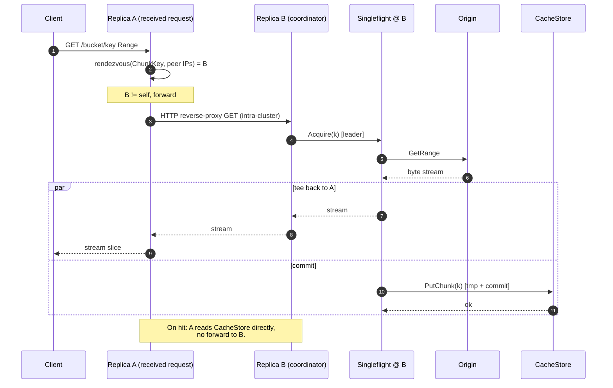
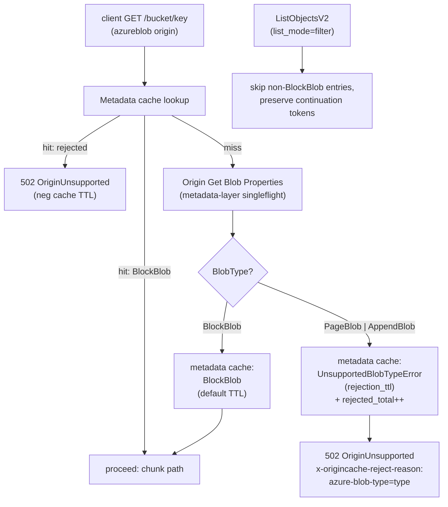
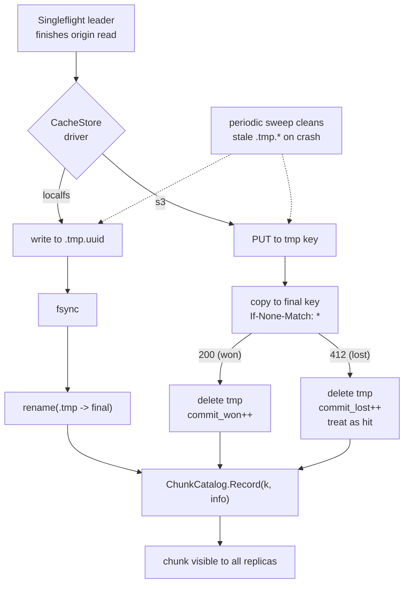
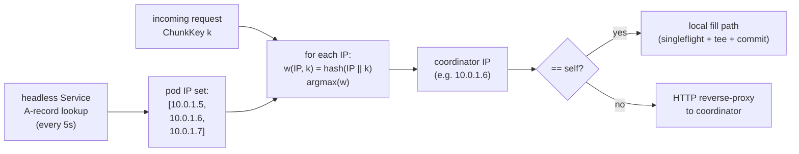
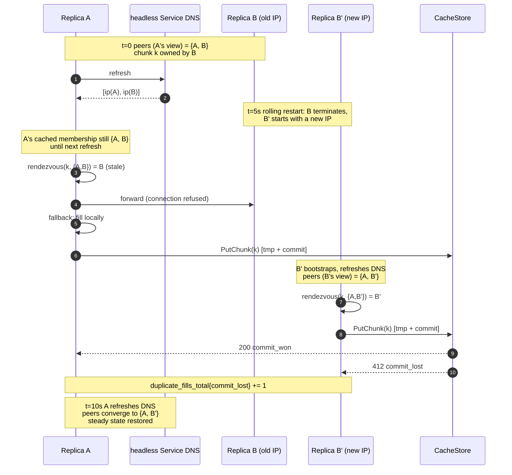

# OriginCache - Design (mechanism & flow)

Status: draft for review
Owner: TBD

> Implementation phases, repo layout, configuration, ops, and approval
> checklist: see [plan.md](./plan.md).

---

## 1. Overview

Edge devices inside an on-prem datacenter need read access to large files
held in cloud blob storage (S3, Azure Blob). Direct egress per device is
unacceptable (cost, latency, throughput, security boundary). OriginCache is
a read-only caching layer, deployed inside each datacenter, that fronts
cloud blob storage with an S3-compatible API. Clients issue range reads;
OriginCache serves from a shared in-DC store when present, otherwise
fetches from the cloud origin, stores the chunk, and returns it.

This document describes the mechanism: decisions, components, request flow,
stampede protection, atomic commit, and horizontal-scale coordination. It
is paired with [plan.md](./plan.md), which covers deliverable scope, repo
layout, phasing, configuration, observability, and operational concerns.

## 2. Decisions

| Area | Decision |
|---|---|
| Client API | S3-compatible HTTP; `GET` + `HEAD` + `ListObjectsV2`; supports `Range`. |
| Auth (v1) | Network-perimeter trust + bearer / mTLS. No SigV4 verification yet. |
| Origins | S3 + Azure Blob behind a pluggable `Origin` interface. |
| Azure constraint | Block Blobs only. Append/Page Blobs rejected at `Head`. |
| Backing store | Pluggable `CacheStore`; `localfs` for dev, `s3` (VAST) for prod. The CacheStore is the source of truth for chunk presence. |
| In-DC S3 vs. cloud S3 | The in-DC S3-compatible store is treated identically to cloud S3 at the protocol level. The only difference is "much faster, in-DC". Both `Origin` and `CacheStore` are thin S3-client adapters with no special-casing. |
| Chunking | Fixed 8 MiB default (configurable 4-16 MiB). `chunk_size` baked into `ChunkKey`. |
| Consistency | Immutable blobs. ETag is the version identity. |
| Catalog | In-memory `ChunkCatalog` fronting `CacheStore.Stat`. No persistent local index. |
| Eviction | Deferred to CacheStore lifecycle policy. Cache layer ships no eviction code in v1. |
| Prefetch | Sequential read-ahead by default. Configurable depth, capped concurrency. |
| Cluster | Kubernetes Deployment + headless Service for peer discovery + ClusterIP/LB for client traffic. Rendezvous hashing on pod IP selects the coordinator for miss-fills only; all replicas can read all chunks. |
| Tenancy | Single tenant, single origin credential set in v1. |
| Repo home | This repo. Layout mirrors `machina`. |

## 3. Architecture

A single binary, `origincache`, deployed as a Kubernetes Deployment. All
replicas share a single in-DC CacheStore. A headless Service publishes the
set of Ready pod IPs; each replica polls it (default every 5s) to refresh
its peer set. Rendezvous hashing on `ChunkKey` against the current pod-IP
set selects a coordinator replica per chunk that runs singleflight + tee on
miss-fills; all replicas can read any already-cached chunk directly from
the CacheStore. Single tenant. One origin credential set per deployment.

### Diagram 1: System overview



## 4. Chunk model

- `ChunkKey = {bucket, object_key, etag, chunk_size, chunk_index}`.
  - `etag` captures immutability. A new ETag is treated as a new logical
    object and gets a fresh set of chunks. Old chunks age out via the
    CacheStore's lifecycle policy.
  - `chunk_size` is part of the key so a runtime config change does not
    silently corrupt or shadow existing data.
- `chunk_index = floor(byte / chunk_size)`.
- An object metadata cache holds `{bucket, key} -> {size, etag, content_type,
  last_validated, last_status}` with a small TTL. Avoids re-`HEAD`ing origin
  on every request.

The CacheStore's namespace **is** the chunk index. `ChunkKey`
deterministically produces a path
(`<sha256(bucket+key+etag)>/<chunk_size>/<chunk_index>`). Whether a chunk
is present is answered by `CacheStore.Stat(key)`. An in-memory
`ChunkCatalog` LRU memoizes recent positive lookups so the hot path never
touches the CacheStore for metadata. The catalog is purely a hot-path
optimization; it can be dropped at any time without affecting correctness.

For a request `Range: bytes=A-B`:

```
firstChunk = A / chunk_size
lastChunk  = B / chunk_size
for cid in [firstChunk..lastChunk]:
    fetchOrServe(cid)
    sliceWithin(cid, max(A, cid*sz), min(B, (cid+1)*sz - 1))
```

### Diagram 2: Range request -> chunk index mapping



## 5. Request flow

1. `GET /{bucket}/{key}` arrives with optional `Range`.
2. Auth middleware (bearer / mTLS) validates the caller.
3. `fetch.Coordinator` looks up object metadata in the metadata cache. On
   miss, exactly one `HEAD` is issued to origin (singleflight at the
   metadata layer). `404` and unsupported-blob-type errors are negatively
   cached.
4. Coordinator computes the chunk-aligned set of `ChunkKey`s required.
5. For each `ChunkKey`:
   - **ChunkCatalog hit:** open reader from `CacheStore`.
   - **ChunkCatalog miss:** call `CacheStore.Stat(key)`. If present,
     record in the catalog and serve from the CacheStore. If absent, enter
     the singleflight miss-fill path (see s7).
6. Server assembles the response by streaming chunks back-to-back, slicing
   the first and last chunk to match the user range. Sets `Content-Range`,
   `Content-Length`, `ETag`, `Accept-Ranges: bytes`.
7. If sequential prefetch is enabled, schedule asynchronous fills for the
   next N chunks (capped per blob and globally).

### Diagram 3: Cache hit



### Diagram 4: Cache miss, single replica (this replica is the coordinator)



## 6. Internal interfaces

The mechanism's named seams. Implementations live under
`internal/origincache/`; see [plan.md#3-repo-layout](./plan.md#3-repo-layout-mirrors-machina).

```go
// Origin: read-only view of upstream blob store.
type Origin interface {
    Head(ctx context.Context, bucket, key string) (ObjectInfo, error)
    GetRange(ctx context.Context, bucket, key string, off, n int64) (io.ReadCloser, error)
    List(ctx context.Context, bucket, prefix, marker string, max int) (ListResult, error)
}

// CacheStore: where chunk bytes physically live in the DC. Treated as the
// source of truth for chunk presence; backed by an in-DC S3-like service in
// production and a local directory in dev.
type CacheStore interface {
    GetChunk(ctx context.Context, k ChunkKey, off, n int64) (io.ReadCloser, error)
    PutChunk(ctx context.Context, k ChunkKey, size int64, r io.Reader) error // atomic
    Stat(ctx context.Context, k ChunkKey) (ChunkInfo, error)
}

// ChunkCatalog: in-memory, best-effort record of chunks known to be present
// in the CacheStore. Purely a hot-path optimization; the CacheStore is the
// source of truth. A Lookup miss falls through to CacheStore.Stat; the
// result is Recorded for subsequent requests.
type ChunkCatalog interface {
    Lookup(k ChunkKey) (ChunkInfo, bool)
    Record(k ChunkKey, info ChunkInfo)
    Forget(k ChunkKey)
}

// Cluster: peer discovery + rendezvous hashing. Returns the coordinator
// peer for a given ChunkKey. self == coordinator means handle locally.
type Cluster interface {
    Coordinator(k ChunkKey) Peer  // returns self or remote Peer
    Self() Peer
    Peers() []Peer                // current membership snapshot
}
```

Implementations:

- `Origin`: `origin/s3`, `origin/azureblob` (Block Blob only).
- `CacheStore`: `cachestore/localfs` (dev), `cachestore/s3` (VAST etc.).
- `ChunkCatalog`: a single in-memory LRU implementation.
- `Cluster`: a single implementation that polls the headless Service
  (default 5s) and computes rendezvous hashes against pod IPs.

## 7. Stampede protection

The single most important hot-path correctness issue. Layered defense.

### 7.1 Per-`ChunkKey` singleflight

Process-local map `inflight: map[ChunkKey]*Fill`, guarded by a mutex. Each
`*Fill` has a `done` channel, an error slot, the resulting `ChunkInfo`, a
bounded ring buffer, and a refcount. Acquire path: under the lock, either
return the existing entry as a joiner or insert a new entry and become the
leader. Release path: leader removes the entry from the map after
signalling, so any thread arriving while the entry is mapped joins; any
thread arriving after removal records the chunk in the `ChunkCatalog`
(which the leader populated before releasing) and serves a normal hit.

### 7.2 TTFB tee

Naive singleflight makes joiners wait for the leader's full disk write,
then re-read from disk. Instead the leader tees origin bytes into a
bounded ring buffer; joiners obtain a `Reader` over that buffer that
replays buffered bytes and blocks on a condition variable for more.
Buffer is bounded (default 1-2 MiB); a slow joiner that falls behind the
head transparently switches to reading from the on-disk tmp file. Caps
memory regardless of waiter count.

### Diagram 5: Same-replica joiner via singleflight + tee



### 7.3 Cluster-wide deduplication

Rendezvous hashing on `ChunkKey` against the current pod-IP set routes all
miss-fills for a given chunk to a single coordinator replica. A replica
that receives a request whose ChunkKey hashes to a peer reverse-proxies
the HTTP request to that peer; the coordinator owns the singleflight + tee
for the fill, performs the origin GET and CacheStore commit, and streams
bytes back to the forwarding replica which streams to the client. Reads
of an already-cached chunk are served directly from the shared CacheStore
by whichever replica received the client request, with no forward.
Combined with 7.1, exactly one origin GET per cold chunk per cluster in
steady state. During membership change we accept up to one duplicate fill
per chunk (loser drops on commit collision; observable via
`origincache_origin_duplicate_fills_total{result="commit_lost"}` - see
[plan.md#6-observability](./plan.md#6-observability)). The duplicate-fill
metric is the leading indicator that this routing is working: a
sustained non-zero `commit_lost` rate signals chronic membership flux or
a bug in the hash distribution.

### Diagram 6: Cross-replica coordinator routing



### 7.4 Origin backpressure

A separate per-origin **semaphore** caps concurrent `Origin.GetRange` calls
(default 64-128, configurable). Optional token bucket on origin
bytes/sec. Joiners do not consume tokens. If saturated, leaders queue
with bounded wait; on timeout the request returns `503 Slow Down` so
clients back off.

### 7.5 Cancellation safety

`Fill.run()` uses an internal long-lived context, not any single client's
context. The fill outlives any single requester. If every joiner cancels
we still finish the fill (cheap insurance; configurable to abort). A
joiner cancelling unblocks only itself.

### 7.6 Failure handling without re-stampede

- **Retryable error**: short-lived negative entry in the singleflight map
  (cooldown 100 ms - 1 s) so concurrent joiners share the failure rather
  than each retrying immediately.
- **Hard 404 / unsupported blob type**: cached in the metadata cache for a
  longer TTL (default 5 min) so floods do not flood origin with `HEAD`s.
- **Retry inside the leader**: bounded exponential backoff (default 3
  attempts) before declaring failure. Joiners sit through retries on the
  same `Fill`.

### 7.7 Metadata-layer singleflight

Same pattern at the metadata cache: `metaInflight: map[ObjectKey]*MetaFill`.
Without this, a flood of distinct cold keys shifts the storm from chunk
GETs to chunk HEADs. Stale-while-revalidate behavior: serve stale within
a small margin while one background refresh runs.

## 8. Azure adapter: Block Blob only

Hardened constraint.

- Enforced in `internal/origincache/origin/azureblob.Head`. Block type is
  immutable on an existing blob (you have to delete and recreate to change
  it, which produces a new ETag), so checking once per `(container, blob,
  etag)` is sufficient.
- Detection via `Get Blob Properties` -> `BlobType` field. Reject anything
  other than `BlockBlob` with a typed error `UnsupportedBlobTypeError`
  exported from `internal/origincache/origin`.
- Surfaced to clients as HTTP `502 Bad Gateway` with S3 error code
  `OriginUnsupported`, body containing reason, plus
  `x-origincache-reject-reason: azure-blob-type=<type>` header.
- Negatively cached in the metadata cache (default 5 min TTL) and
  singleflighted at the metadata layer to prevent re-probing.
- `ListObjectsV2` defaults to `filter` mode: non-Block Blob entries are
  skipped while preserving continuation tokens. `passthrough` mode is
  available for debugging.
- Config schema reserves `enforce_block_blob_only: true`. Setting it to
  false is rejected at startup.
- Prometheus counter:
  `origincache_origin_rejected_total{origin="azureblob",reason="non_block_blob",blob_type=...}`.

### Diagram 7: Block Blob enforcement



## 9. Concurrency, durability, correctness

- Atomic chunk write: leader writes to a tmp object key in the CacheStore
  (`<chunk>.tmp.<uuid>` for `localfs`, a temporary key under the same
  prefix for `s3`), then commits with an atomic rename / copy-and-delete
  (`localfs`) or `If-None-Match: *` PUT (`s3`) so the final object appears
  exactly once. Crash recovery sweeps stale `*.tmp.*` objects on a periodic
  background scan; nothing breaks if a tmp object lingers briefly.
- The CacheStore is the source of truth. The `ChunkCatalog` is purely an
  optimization and may be dropped at any time without affecting
  correctness; a `Lookup` miss falls through to `CacheStore.Stat` and
  refills the catalog. Catalog entries that point at a now-absent chunk
  (e.g. evicted by lifecycle) result in a `CacheStore.GetChunk` error
  that is treated as a miss and refilled.
- Partial last chunk of a blob stored at its actual size; `ChunkInfo.Size`
  records it; range math respects it.
- `416 Requested Range Not Satisfiable` is returned by the server before
  any cache lookup, using object metadata.
- Origin failure during fill never commits the tmp object; surfaces as
  `502` to the client and as a transient negative singleflight entry.

### Diagram 8: Atomic commit (localfs vs s3 CacheStore)



## 10. Eviction and capacity

Eviction is delegated to the CacheStore's storage system (e.g. VAST or S3
lifecycle policies). Recommended baseline is age-based expiration on the
chunk prefix with a TTL chosen to fit the deployment's working set in the
available capacity. Operators tune the TTL based on
`origincache_origin_bytes_total` and capacity utilization metrics exposed
by the CacheStore.

The cache layer itself does not evict CacheStore objects in v1. The
in-memory `ChunkCatalog` uses a fixed-size LRU; entries falling out of it
are not evicted from the CacheStore, only from the metadata cache - a
subsequent request will rediscover the chunk via `CacheStore.Stat`.

Future work (Phase 4): if hot-chunk re-fetch from origin caused by
lifecycle eviction proves material, add an in-cache access-tracking layer
inside the `chunkcatalog` package and an opt-in active-eviction loop. This
does not affect any other interface in the system.

## 11. Horizontal scale

Cluster membership comes from the headless Service: an A-record lookup
returns the IPs of all Ready pods backing the Service. Cluster code
consumes that list, refreshes it on a configurable interval (default 5s),
and rendezvous-hashes `ChunkKey` against pod IPs to select a coordinator.
When replica A receives a request whose `ChunkKey` hashes to replica B, A
reverse-proxies the HTTP request to B; B owns the singleflight + tee,
performs the origin fetch and CacheStore commit, and streams bytes back to
A which streams to the client. On cache hits, A reads directly from
CacheStore with no forwarding hop. Pod names are not stable under a
Deployment; we never address peers by name, only by the IPs the headless
Service publishes.

We accept up to one duplicate fill per chunk during membership flux (e.g.
rolling restarts when a pod's IP changes); the duplicate-fill metric (see
[plan.md#6-observability](./plan.md#6-observability)) makes that visible.

Replication factor = 1 in v1 (cache loss is recoverable from origin).
Optional R=2 for hot chunks deferred to Phase 4. Every replica sees the
entire CacheStore. No replica owns bytes; replica loss never strands data.

### Diagram 9: Membership & rendezvous hash



### Diagram 10: Rolling restart membership flux


