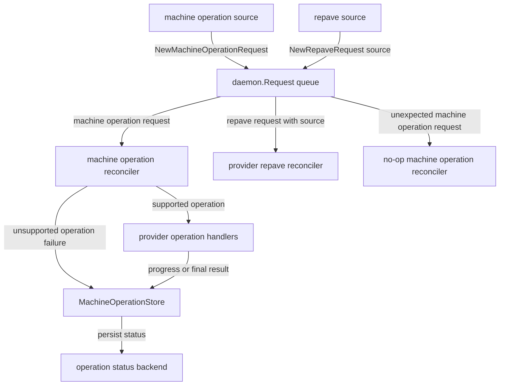
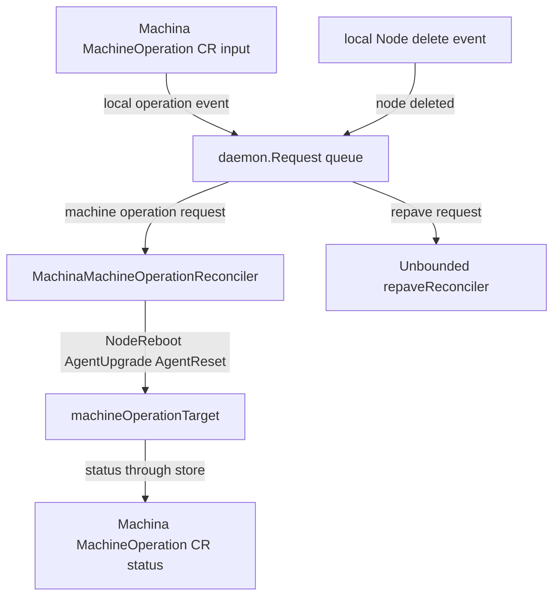

# Agent Daemon Controller

The agent daemon controller package provides shared building blocks for
host-local daemon controllers. It is intended for daemons that reconcile one
local worker node and mutate local runtime state such as systemd units,
systemd-nspawn machines, files, and daemon binaries.

The current implementation lives in `pkg/agent/daemon` and is used by the
Unbounded agent daemon in `cmd/agent/internal/daemon`.

## Goals

- Share controller-runtime setup across Unbounded and external daemons.
- Serialize host-local daemon work so reset, restart, upgrade, and repave flows
  cannot interleave.
- Keep Machina `MachineOperation` status handling reusable for Unbounded.
- Keep operation handlers product-owned so host-specific work stays outside the
  shared package.
- Support daemons that only need local repave-style reconcile triggers.

## Non-goals

- Provide a generic cloud or machine operations abstraction. The daemon package
  only covers host-local daemon flows.
- Resolve product-specific desired state. Repave reconcilers still own their
  product-specific goal resolution.
- Hide Machina API details from the Machina operation reconciler. The reusable
  Machina reconciler intentionally uses Machina `MachineOperation` types.

## Controller Shape

`SetupController` installs one typed controller-runtime controller:

```go
func SetupController(
    name string,
    mgr ctrl.Manager,
    machineOperations MachineOperationRequestReconciler,
    repaves RepaveReconciler,
) error
```

The shared queue item is `daemon.Request`. It has two internal variants:

- Machine operation request, created with `NewMachineOperationRequest(name)`.
- Repave request, created with `NewRepaveRequest(source)`.

The request payload structs are private so consumers construct requests through
the exported constructors. This keeps the queue representation small while still
allowing the package to evolve.

Both reconcilers contribute watches through `SetupController` methods:

```go
type MachineOperationRequestReconciler interface {
    SetupController(*builder.TypedBuilder[Request]) *builder.TypedBuilder[Request]
    ReconcileMachineOperation(context.Context, string) (ctrl.Result, error)
}

type RepaveReconciler interface {
    SetupController(*builder.TypedBuilder[Request]) *builder.TypedBuilder[Request]
    ReconcileRepave(context.Context, string) (ctrl.Result, error)
}
```

This lets each product register only the event sources it owns while sharing the
runtime controller and dispatch logic.

## Relationships



The shared controller serializes machine operation requests and repave requests
through the same queue. Sources are registered by the concrete reconcilers and
enqueue either `NewMachineOperationRequest` or `NewRepaveRequest`. The machine
operation reconciler uses `MachineOperationStore` to persist progress and final
status; the backing status store is provider-specific. External providers that
do not use machine operations can wire only the repave flow and pass
`NoopMachineOperationReconciler`; any machine operation request in that
configuration is treated as unexpected wiring.

In Unbounded, these components are wired as follows:



## Serialization

The shared controller sets `MaxConcurrentReconciles` to `1`.

Host-local daemon operations mutate shared node state, including systemd units,
nspawn machines, local files, and daemon binaries. Running them concurrently can
leave the host in an undefined state. For example, an agent upgrade restart must
not interleave with an agent reset, and a repave must not race with a node
restart.

The shared controller therefore serializes all request kinds for one daemon
process.

## Repave Requests

Repave is a generic local reconcile trigger. It is not tied to a Machina object.

`NewRepaveRequest(source)` carries a string source so consumers can distinguish
why a local reconcile was queued. Current Unbounded usage passes `node-delete`.
External providers can use sources such as `node-change` and `machine-poll` if
they want to preserve different requeue behavior for event-driven and
polling-driven reconciles.

The shared package does not interpret the source. It passes the string to
`ReconcileRepave(ctx, source)`.

## Machina MachineOperation Reconciler

`MachinaMachineOperationReconciler` is the reusable Machina-specific operation
adapter. It does the following:

- Watches `MachineOperation` objects.
- Filters out terminal operations.
- Filters to operations targeting the local machine by `spec.machineRef` or
  `spec.machineSelector`.
- Dispatches supported operation kinds to product-owned handlers.
- Marks matching but unsupported operation kinds as failed.
- Provides `MachineOperationStore[int64]` for handlers to mark progress and
  finish operations.

The constructor is:

```go
func NewMachinaMachineOperationReconciler(
    c client.Client,
    machineName string,
    nodeName string,
    handlers MachineOperationHandlers,
) (*MachinaMachineOperationReconciler, error)
```

`MachineOperationHandlers` maps Machina `OperationKind` values to host-local
handlers:

```go
type MachineOperationHandler[TGeneration comparable] func(
    context.Context,
    MachineOperationStore[TGeneration],
    MachineOperation,
) (ctrl.Result, error)
```

Handlers receive a simplified `MachineOperation` containing:

- `Name`
- `Kind`
- `Parameters`

Handlers own the operation lifecycle. They call `MarkInProgress` and `Finish`
on the provided store as appropriate. This is important for operations such as
agent upgrade and reset where the handler needs to publish status before
restarting or stopping the current daemon process.

## Operation Status

`MachineOperationStore` exposes:

```go
type MachineOperationStore[TGeneration comparable] interface {
    MarkInProgress(context.Context, MachineOperation, string) error
    Finish(context.Context, MachineOperation, MachineOperationResult[TGeneration]) error
}
```

`MachineOperationResult` carries status output:

- `Phase`
- `Reason`
- `Message`
- `ObservedMachineGeneration`

`FinishMachineOperation(ctx, client, op, result)` is also exported for delayed
completion paths. The Unbounded `AgentUpgrade` flow uses it after the restarted
daemon publishes success or failure from the signal file.

Status condition `ObservedGeneration` is the `MachineOperation` object
generation. `status.observedMachineGeneration` is separate and records the
target Machine generation the handler acted on.

## Unsupported Operations

The watch mapper intentionally does not filter by registered handler after an
operation is known to target the local machine. A matching unsupported operation
is queued and then failed by the reconciler with:

- Reason: `UnsupportedOperation`
- Message: `no handler registered for operation kind <kind>`

This prevents local operations from staying pending forever when they target a
daemon that does not implement their kind.

## Selector Matching

For `MachineOperation.spec.machineSelector`, the Machina reconciler first tries
to match the selector against the local Node labels. If the Node does not exist,
it falls back to the local Machine labels.

This means:

- `machineRef` targeting only needs the `MachineOperation` CRD.
- Selector targeting can work with only Node labels when the Node exists.
- Selector fallback to Machine labels needs the Machina `Machine` CRD and local
  Machine object.

The Unbounded daemon handlers currently read the local `Machine` object to
record `ObservedMachineGeneration`, so the current Unbounded daemon still
expects the Machine CRD and object even though the reusable reconciler can handle
some flows without them.

## No-op Machine Operation Reconciler

Consumers that only need repave-style triggers can pass
`NoopMachineOperationReconciler()` to `SetupController`.

The no-op reconciler registers no watches. If it receives a machine operation
request anyway, it returns an error. Receiving such a request indicates that a
consumer unexpectedly wired a machine operation source into a controller that
declared it does not handle machine operations.

## Current Unbounded Composition

The Unbounded agent daemon composes the shared package as follows:

- Creates a `machineOperationTarget` with Unbounded host-local operation
  handlers.
- Creates `MachinaMachineOperationReconciler` with handlers for:
  - `OperationNodeReboot`
  - `OperationAgentUpgrade`
  - `OperationAgentReset`
- Creates a `repaveReconciler` that watches local Node delete events and queues
  `NewRepaveRequest("node-delete")`.
- Calls `daemon.SetupController("unbounded-agent-daemon", mgr, machineOps,
  repaves)`.

The machine operation target owns nspawn restart, agent upgrade, and agent reset
execution. The repave reconciler owns Unbounded MachineConfiguration resolution
and local nspawn repave behavior.

## External Provider Adoption Shape

An external implementation can adopt the shared controller without adopting
Machina operations:

1. Implement `RepaveReconciler` for the provider's local reconcile.
2. Register its Node watch and optional poll or initial event sources in
   `RepaveReconciler.SetupController`.
3. Queue `NewRepaveRequest(source)` with sources such as `node-change` or
   `machine-poll`.
4. Pass `NoopMachineOperationReconciler()` for the machine operation reconciler.
5. Preserve provider-specific goal resolution, external machine reads, state
   files, and status publishing inside its repave reconciler.

This keeps the shared package responsible for serialized controller dispatch
only, while the external implementation keeps ownership of provider-specific
state and lifecycle logic.

## Testing

The shared package has focused tests for:

- Runtime request dispatch.
- Input validation.
- No-op machine operation behavior.
- Machina operation handler dispatch.
- Terminal and unsupported operation behavior.
- MachineRef, Node selector, and Machine selector fallback mapping.
- Status update helpers.

The Unbounded daemon tests cover the composed behavior for node reboot, agent
upgrade, agent reset, and repave.
