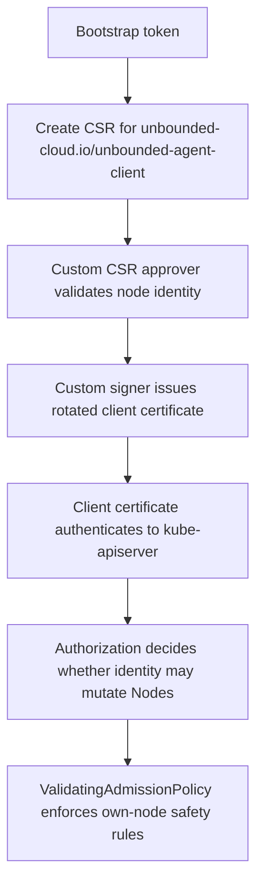

# Agent Daemon RBAC

The host-side `unbounded-agent` daemon needs a Kubernetes identity that can
perform lifecycle actions against its own `Node` object without inheriting the
kubelet identity or broad cluster-admin privileges. The primary use case is a
node-local daemon deleting or updating the `Node` that represents the local
systemd-nspawn worker.

The current setup is bootstrap-token based. The daemon builds its Kubernetes
client from the applied agent config, which contains the API server URL, the
cluster CA bundle, and the kubelet bootstrap token. `cmd/agent/internal/daemon`
uses that client to ensure the local `Machine` CR exists, publish agent-upgrade
status, run the shared daemon controller, watch the local `Node` deletion event,
and update local `Machine` status after repave-related reconciliation. The
controller cache is scoped to the local `Node`, the local `Machine`, and
`MachineConfigurationVersion` objects, but the authenticated identity is still
the bootstrap token identity. That is enough for early registration and
controller work, but it is not a durable lifecycle identity. Bootstrap tokens are
short-lived joining credentials and do not naturally express `agent on node A may
mutate only node A`.

The kubelet identity is also not enough. Kubelets authenticate as:

```text
CN = system:node:<nodeName>
O  = system:nodes
```

Those identities are handled specially by the built-in Node authorizer and the
NodeRestriction admission plugin. In upstream Kubernetes, the Node authorizer
allows a kubelet to create, get, update, and patch its own `Node` object, and to
update or patch its own `Node/status` subresource, but it does not allow `delete`
on `nodes`. NodeRestriction then applies kubelet-specific field restrictions to
own-node creates and updates, such as blocking taint changes, protected label
changes, owner reference changes, and non-nil config source changes. The hard
functional blocker is `Node` deletion, while lifecycle updates are still coupled
to kubelet-specific admission rules. Reusing `system:node:<nodeName>` would also
make the host daemon indistinguishable from the kubelet in authorization logs and
audit trails.

The proposed setup gives each agent daemon a rotated client certificate with a
project-owned subject:

```text
CN = unbounded-agent:<nodeName>
O  = unbounded-agent-daemons
```

For example:

```text
unbounded-agent:node-a can get/delete nodes/node-a
unbounded-agent:node-a cannot get/delete nodes/node-b
```

This separate identity lets lifecycle permissions be granted, denied, logged, and
evolved independently from normal kubelet status and lease activity.

## Goals

- Issue a rotated client certificate to each host-side `unbounded-agent` daemon.
- Bind the certificate identity to one expected Kubernetes `Node` name.
- Allow the daemon to get or delete only its own `Node` object.
- Leave annotation-only `Node` update or patch as a future extension if the
  daemon needs it.
- Keep lifecycle identity independent from kubelet authentication and
  authorization.
- Support clusters where kube-apiserver authorizer configuration cannot be
  changed.
- Define a stricter model for clusters where an authorizer webhook can be
  configured.

## Non-goals

- Replace kubelet client certificate bootstrap or rotation.
- Grant pod, secret, workload, or cluster-wide administration permissions to the
  agent daemon.
- Model per-node RBAC objects. Kubernetes RBAC cannot express `user X may mutate
  only resource name derived from X` without creating separate bindings per node.
- Require managed Kubernetes clusters to change kube-apiserver authorizer
  configuration.

## Request Flow



## Certificate Identity

The CSR uses the custom signer `unbounded-cloud.io/unbounded-agent-client` and
requests a client certificate with this subject:

| Field | Value |
|-------|-------|
| Common name | `unbounded-agent:<nodeName>` |
| Organization | `unbounded-agent-daemons` |
| Extended key usage | `clientAuth` |
| TTL | Align with kubelet client certificate duration, commonly 1 year |

The issued certificate must chain to a CA trusted by the kube-apiserver client
certificate authenticator. This means the agent client certificate must be issued
by the same client CA bundle, or another CA in the same trusted client CA bundle,
that the kube-apiserver uses for X.509 client certificate authentication. This is
not the serving CA used by the kube-apiserver TLS endpoint. If a cluster does not
allow adding or selecting a trusted client CA for this signer, the certificate
identity model cannot be deployed there without another authentication mechanism.
The signer gives the daemon an authenticated identity; it does not grant
Kubernetes permissions by itself.

## CSR Approver

The custom CSR approver is the first security boundary. It prevents a bootstrap
credential from requesting an agent daemon certificate for a different node or a
more privileged identity.

The approver needs RBAC to read CSRs and write approval decisions. It should not
hold the signer private key. A minimal role includes:

```yaml
apiVersion: rbac.authorization.k8s.io/v1
kind: ClusterRole
metadata:
  name: unbounded-agent-csr-approver
rules:
- apiGroups: ["certificates.k8s.io"]
  resources: ["certificatesigningrequests"]
  verbs: ["get", "list", "watch"]
- apiGroups: ["certificates.k8s.io"]
  resources: ["certificatesigningrequests/approval"]
  verbs: ["update"]
```

For each CSR, the approver validates:

- `spec.signerName` is `unbounded-cloud.io/unbounded-agent-client`.
- The requested common name is `unbounded-agent:<expected-node-name>`.
- The requested organization list contains only `unbounded-agent-daemons`.
- The requested usages are limited to client authentication.
- The request does not include `system:masters`, `system:nodes`, or unexpected
  groups.
- The request does not include subject alternative names unless a future design
  explicitly allows them.
- The requested expiration does not exceed the configured agent client
  certificate duration.
- The bootstrap token or requesting user is allowed to claim the expected node.

The node-claim check is the most important part of approval. Initial issuance
must prove that the bootstrap requester is allowed to claim the requested node.
The claim source should be a controller-owned mapping such as Machine data,
provisioning state, or bootstrap-token metadata that binds the token to one
Machine and expected Node name. Approval must not rely only on the node name
embedded in the CSR.

For renewal, the approver should validate that the requester is already
authenticated as `unbounded-agent:<nodeName>` and that the new CSR requests the
same common name, group, signer, and usages. A renewed certificate must not allow
the agent to change node identity.

The agent daemon needs RBAC to create CSRs. Initial issuance uses the bootstrap
token's CSR permissions. Renewal uses the current `unbounded-agent:<nodeName>`
certificate, so the `unbounded-agent-daemons` group also needs permission to
create CSRs for renewal:

```yaml
apiVersion: rbac.authorization.k8s.io/v1
kind: ClusterRole
metadata:
  name: unbounded-agent-csr-renewal
rules:
- apiGroups: ["certificates.k8s.io"]
  resources: ["certificatesigningrequests"]
  verbs: ["create", "get", "watch"]
```

The renewal permission is safe only with the approver checks above. RBAC allows
CSR creation; the approver decides whether any requested identity should be
issued.

## CSR Signer

The custom signer signs only approved CSRs for
`unbounded-cloud.io/unbounded-agent-client`. It issues a rotated client
certificate with the approved subject and client-auth usage.

The signer needs RBAC to read approved CSRs and write issued certificates to CSR
status. A minimal role includes:

```yaml
apiVersion: rbac.authorization.k8s.io/v1
kind: ClusterRole
metadata:
  name: unbounded-agent-csr-signer
rules:
- apiGroups: ["certificates.k8s.io"]
  resources: ["certificatesigningrequests"]
  verbs: ["get", "list", "watch"]
- apiGroups: ["certificates.k8s.io"]
  resources: ["certificatesigningrequests/status"]
  verbs: ["update"]
```

Example issued identity:

```text
Subject:
  CN = unbounded-agent:node-a
  O  = unbounded-agent-daemons

Usage:
  clientAuth

TTL:
  8760h
```

The signer must not broaden the approved subject, usages, or TTL. If the signer
and approver are separate controllers, the signer should still re-validate the
approved CSR before issuing a certificate.

The intended lifetime should align with kubelet client certificate rotation
rather than use an unusually short agent-specific window. Kubernetes'
recommended default `--cluster-signing-duration` is 365 days, and kubelet client
certificates commonly use that duration. The agent signer should default to the
same duration unless the deployment explicitly configures a shorter value. The
daemon should renew before expiry, following kubelet-style rotation timing rather
than waiting for the certificate to become invalid.

## Certificate Renewal

The daemon owns renewal of its agent client certificate. Renewal uses the current
agent certificate, not the original bootstrap token, after the first certificate
has been issued.

The renewal flow is:

1. The daemon stores the issued certificate and private key on the host with
   permissions limited to the agent daemon user.
2. The daemon periodically checks the certificate lifetime.
3. When the certificate enters its renewal window, the daemon creates a new CSR
   for the same signer, common name, organization, and usages.
4. The daemon submits the CSR using the current agent client certificate.
5. The CSR approver validates that the requester is the same
   `unbounded-agent:<nodeName>` identity requested in the new CSR.
6. The signer issues a replacement certificate with the configured duration.
7. The daemon atomically replaces the stored certificate and begins using it for
   new API connections.

The renewal window should follow kubelet-style behavior: start renewal well before
expiry and use jitter so agents do not all renew at the same time. If renewal
fails, the daemon should retry with backoff while the current certificate remains
valid and expose metrics for renewal failures, retry count, and time to expiry.
If the certificate expires before renewal succeeds, the daemon may attempt the
initial bootstrap flow only if it still has a valid bootstrap token. If the
bootstrap token is no longer valid, the daemon must fail closed and surface the
failure through metrics and logs. It must not silently continue with an invalid
credential.

There is no online revocation mechanism for agent daemon certificates at the
moment. If a certificate should no longer be trusted before expiry, enforcement
depends on authorization and ValidatingAdmissionPolicy denying requests from that
identity. Server-side audit logs should record the distinct
`unbounded-agent:<nodeName>` username and `unbounded-agent-daemons` group for
agent lifecycle requests.

## Authorization

There are two mutually exclusive authorization models. Option A uses broad RBAC
plus ValidatingAdmissionPolicy for clusters where a kube-apiserver authorizer
webhook cannot be enabled. Option B uses a webhook authorizer to avoid granting
broad Node mutation permission in the first place.

### Option A: Broad Node Read and ValidatingAdmissionPolicy

This option intentionally allows the agent daemon group to read all `Node`
objects. Mutation is still restricted to the daemon's own `Node` by
ValidatingAdmissionPolicy.

RBAC grants cluster-wide Node read and broad Node delete:

```yaml
apiVersion: rbac.authorization.k8s.io/v1
kind: ClusterRole
metadata:
  name: unbounded-agent-node-lifecycle
rules:
- apiGroups: [""]
  resources: ["nodes"]
  verbs: ["get", "list", "watch", "delete"]
```

```yaml
apiVersion: rbac.authorization.k8s.io/v1
kind: ClusterRoleBinding
metadata:
  name: unbounded-agent-node-lifecycle
roleRef:
  apiGroup: rbac.authorization.k8s.io
  kind: ClusterRole
  name: unbounded-agent-node-lifecycle
subjects:
- kind: Group
  apiGroup: rbac.authorization.k8s.io
  name: unbounded-agent-daemons
```

ValidatingAdmissionPolicy is required for this model. It narrows the broad RBAC
delete grant with an object-name check:

```text
request.userInfo.username == "unbounded-agent:" + request.name
```

This model works on clusters where a custom kube-apiserver authorizer cannot be
configured. Its security model is:

```text
RBAC intentionally allows cluster-wide Node read.
RBAC broadly allows Node delete.
ValidatingAdmissionPolicy denies cross-node mutation afterward.
```

Because ValidatingAdmissionPolicy is part of the security boundary, it must fail
closed. Use `failurePolicy: Fail` and `validationActions: [Deny]`. Do not deploy
the broad-RBAC binding unless this policy is installed and enforced.

### Option B: Webhook Authorizer

A webhook authorizer is the stricter model when the cluster can configure
kube-apiserver authorizers. The authorizer receives request attributes such as:

```text
user = unbounded-agent:node-a
group = unbounded-agent-daemons
verb = get/delete
resource = nodes
name = node-a
```

It allows the request only when:

```text
user == "unbounded-agent:" + resourceName
```

In this model, RBAC does not grant broad Node mutation permission to
`unbounded-agent-daemons`. The authorizer grants only own-node access, and
ValidatingAdmissionPolicy remains defense-in-depth for object-level safety rules.

The downside is operational: the cluster must allow kube-apiserver authorizer
configuration. This is not available on many managed Kubernetes offerings.

The two models should not be deployed together. If broad RBAC and the webhook
authorizer both exist, either one can authorize the request, so a webhook denial
could be bypassed by RBAC and only ValidatingAdmissionPolicy would still narrow
the request. A deployment must choose one source of Node mutation authorization.

## ValidatingAdmissionPolicy

ValidatingAdmissionPolicy is required for the broad-RBAC model and remains useful
for the webhook authorizer model.

The policy should enforce:

- Agent daemon identities may mutate only their own `Node`.
- For delete, the policy must use `request.name` and `oldObject`; it must not
  depend on a new `object` value.
- For get, no object mutation rules apply.

The initial policy does not need to allow `update` or `patch` because the current
daemon does not mutate `Node` objects. It only watches the local `Node` for delete
events and mutates `Machine` resources. If a future daemon flow needs to update
or patch `Node` annotations, the authorization rules and policy should be
expanded explicitly for annotation-only changes. That future policy must handle
all supported patch forms, including JSON patch, merge patch, and server-side
apply, or it should continue to reject patch and allow only full-object updates
that can be safely diffed.

Future update or patch policy should enforce:

- Agent daemon identities may not add privileged labels.
- Agent daemon identities may only modify explicitly allowed annotations.
- Agent daemon identities may not modify `spec.providerID`.
- Agent daemon identities may not modify taints.
- Agent daemon identities may not mutate fields owned by the control plane.

The exact protected label, annotation, taint, and field sets should be defined
with the Node recreation and Machine lifecycle flows that need this identity.

## Broad RBAC Flow

1. The host-side `unbounded-agent` daemon starts with a bootstrap token.
2. The daemon creates a CSR for `unbounded-cloud.io/unbounded-agent-client` with
   `CN=unbounded-agent:node-a` and `O=unbounded-agent-daemons`.
3. The custom approver verifies that the requester may claim `node-a`.
4. The custom signer signs the approved CSR with a trusted client CA.
5. The daemon uses the issued certificate to call `DELETE /api/v1/nodes/node-a`.
6. The kube-apiserver authenticates the certificate as
   `username=unbounded-agent:node-a` and `groups=unbounded-agent-daemons`.
7. RBAC allows the group to delete Node objects.
8. ValidatingAdmissionPolicy checks that the username is `unbounded-agent:` plus
   the requested Node name.
9. The request is allowed for `node-a` and denied for any other Node name.

## Risks and Open Questions

The broad-RBAC model depends on ValidatingAdmissionPolicy as a security boundary.
A missing, misconfigured, or fail-open policy would leave
`unbounded-agent-daemons` with broad Node mutation permission.

The CSR approver needs a reliable source of truth for which bootstrap requester
may claim which node. That mapping is not defined here and should be specified
with the bootstrap or provisioning flow.

The default agent certificate TTL should track the kubelet client certificate
duration for the cluster. The implementation still needs to define renewal
jitter, retry behavior, and what the daemon does if renewal is blocked past
expiry.

The webhook authorizer model requires kube-apiserver configuration access, which
may not be available on managed clusters. The deployment model should make the
selected authorization strategy explicit.
