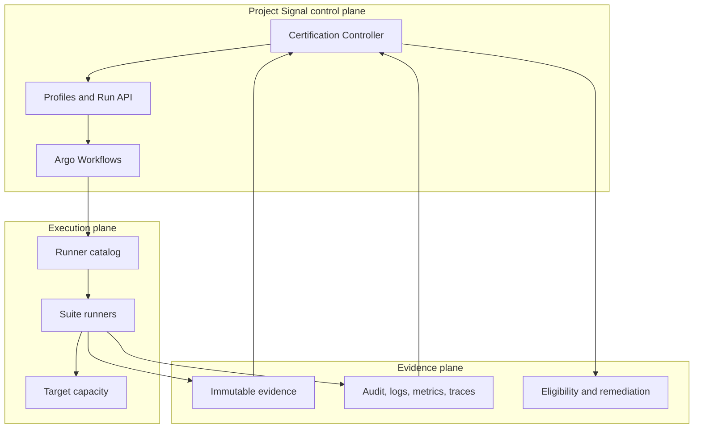
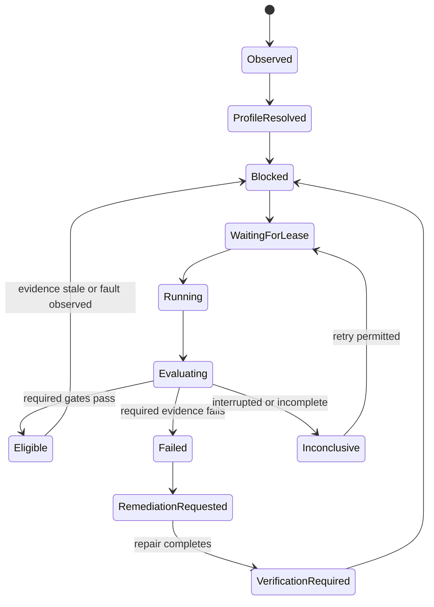
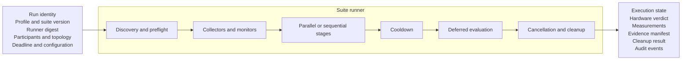
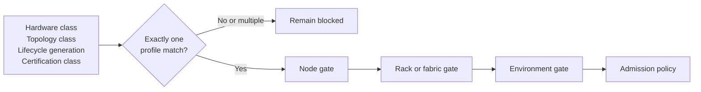
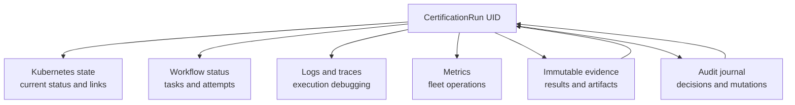
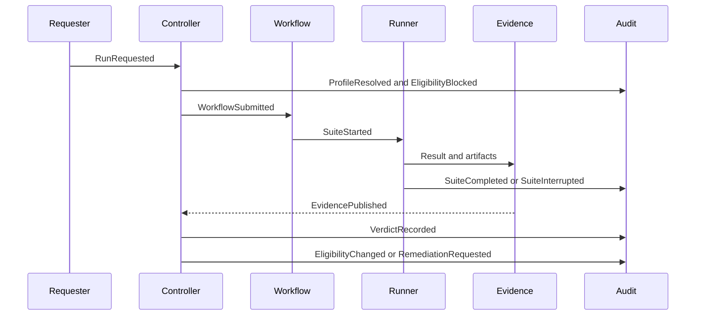
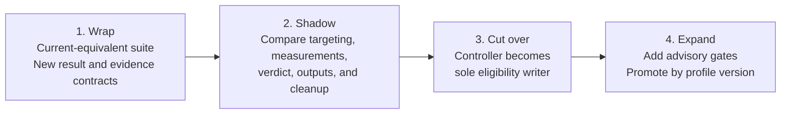

# Project Signal: Certification Controller

**Status:** Engineering design review draft

**Scope:** Certification of newly provisioned, repaired, stale, or suspect
compute capacity before production admission.

**Project name:** Project Signal

## Decision summary

- A Certification Controller owns certification lifecycle, profile selection,
  participant selection, evidence policy, eligibility, and remediation requests.
- Argo Workflows owns execution of suite graphs, including retries, deadlines,
  synchronization, fan-out, cancellation, and cleanup sequencing.
- A certification suite is the stable execution boundary. A suite may contain
  one command or a coordinated diagnostic procedure with internal discovery,
  monitors, collectors, stages, cooldown, and evaluation.
- Versioned profiles compose suites into node, rack, fabric, environment, and
  workload gates.
- Execution state and hardware verdict are separate. Infrastructure
  interruption does not automatically become hardware failure.
- Every run produces a typed result, immutable evidence manifest, and correlated
  audit history.
- Existing certification behavior can enter the system through an exact
  compatibility suite. Additional gates remain separate until a new profile
  version explicitly makes them authoritative.

## Goals

The system must:

1. Keep capacity blocked until its required profile produces current evidence.
2. Bind certification history to durable infrastructure asset identity while
   projecting current state onto the active Kubernetes Node.
3. Support initial burn-in, post-repair verification, idle revalidation,
   continuous fault response, and authorized on-demand runs.
4. Support node-local and coordinated multi-node suites without forcing every
   diagnostic operation into a separate pod.
5. Produce reproducible results tied to immutable profile, configuration,
   runner image, participant, topology, and artifact identity.
6. Preserve one writer for eligibility and one requester for remediation.
7. Apply fleet and failure-domain concurrency limits to disruptive testing.
8. Allow compatibility behavior and new certification gates to coexist without
   silently changing each other's verdicts.

## Non-goals

- The controller does not implement diagnostic commands.
- Argo does not decide whether capacity is trustworthy.
- Process exit code alone is not the certification contract.
- Kubernetes Events and pod logs are not the durable evidence record.
- Continuous monitoring does not replace invasive certification.
- The first release does not require all suites to share identical tests or
  thresholds.

## Conceptual model

| Resource | Purpose |
|---|---|
| `CertificationProfile` | Versioned gate graph, suite references, thresholds, evidence requirements, retry policy, and admission policy |
| `CertificationSuite` | Stable logical procedure implemented by a private or public runner |
| `CertificationRun` | One execution for one scope, participant set, profile version, and trigger |
| `SuiteResult` | Typed execution state, verdict, measurements, observations, failure category, and evidence references |
| `EvidenceManifest` | Immutable index of inputs, results, artifacts, checksums, topology, observation coverage, and cleanup |
| `CertificationRecord` | Durable asset-keyed history of runs, faults, remediation, and recovery |

## Architecture



### Ownership

| Component | Owns | Must not own |
|---|---|---|
| Certification Controller | Profile resolution, lifecycle, participants, scheduling protection, policy evaluation, eligibility, evidence references, and remediation requests | Test command execution or success inference from pod exit alone |
| Argo Workflows | DAG execution, retries for infrastructure failures, deadlines, synchronization, fan-out, cancellation, and cleanup ordering | Trust, eligibility, or hardware policy |
| Runner catalog | Resolution of logical suites to digest-pinned images, templates, privileges, adapters, and schemas | Profile selection or cluster state mutation |
| Suite runner | Tool execution, suite-local state, parsing, monitoring, artifacts, cleanup, and `SuiteResult` publication | Direct writes to normalized eligibility |
| Evidence service | Immutable manifests and artifact retention | Verdict reinterpretation |
| Audit pipeline | Decision and mutation history correlated by run identity | Replacement of evidence or result payloads |
| Infrastructure adapters | Durable asset identity and execution of approved lifecycle operations | Certification verdict policy |

## End-to-end lifecycle



1. The controller observes capacity that requires certification.
2. It binds the Kubernetes Node to durable asset identity and current repair
   generation.
3. It resolves exactly one immutable `CertificationProfile`.
4. It records blocked or testing eligibility before invasive execution.
5. It creates a `CertificationRun` and an Argo Workflow.
6. Argo executes the profile's suite graph with required placement and
   synchronization.
7. Each suite publishes a typed result and evidence manifest.
8. The controller evaluates required gates and evidence completeness.
9. It advances eligibility, leaves capacity blocked, or requests remediation.
10. A repair creates a new generation that requires new verification evidence.

No profile match or multiple profile matches fail closed. The controller does
not substitute a smaller suite merely because resources are unavailable.

## Suite execution contract



A suite is a complete gate-level procedure. It may internally implement:

- Discovery and preflight invariants.
- Long-running collectors and monitors.
- Sequential or parallel stress stages.
- Shared state and event processing.
- Cooldown observation.
- Deferred threshold evaluation.
- Coordinated cancellation and cleanup.

Argo treats the suite as one task unless the suite contract explicitly exposes
safe child tasks. This preserves procedures whose monitors, baselines, samples,
and evaluators span multiple internal operations.

### Required runner inputs

- `CertificationRun` UID.
- Immutable profile and suite version.
- Runner image digest.
- Participant and topology identity.
- Target Node placement.
- Deadline and cancellation channel.
- Configuration and secret references.
- Evidence destination.
- Audit correlation fields.

### Required runner outputs

```yaml
apiVersion: certification.unbounded.io/v1alpha1
kind: SuiteResult
spec:
  runUID: 01K...
  suite: node-burn-in-v1
  execution:
    state: Completed # Completed, Interrupted, Error
    attempt: 1
    startedAt: "2026-10-09T10:00:00Z"
    finishedAt: "2026-10-09T11:00:00Z"
  verdict:
    state: Pass # Pass, Suspect, Fail, Inconclusive
    category: Healthy
  evidence:
    manifestURI: object://certification-runs/01K.../manifest.json
    manifestDigest: sha256:...
  cleanup:
    state: Completed
```

Execution state answers whether the procedure ran correctly. Verdict answers
what the completed evidence says about the target.

## Profiles and gate graphs



A profile selects suites based on declared capabilities and certification
class. Different environments may select different profiles while using the
same controller and result contracts.

```yaml
apiVersion: certification.unbounded.io/v1alpha1
kind: CertificationProfile
metadata:
  name: accelerator-capacity-v1
spec:
  selector:
    matchLabels:
      certification.unbounded.io/class: accelerator
  gates:
    - name: node
      suiteRef: node-burn-in-v1
    - name: rack
      dependsOn: [node]
      suiteRef: rack-fabric-v1
    - name: environment
      dependsOn: [rack]
      suiteRef: environment-validation-v1
  admission:
    requiredGates: [node, rack, environment]
```

Profiles own:

- Suite composition and dependencies.
- Repetition and duration.
- Required measurements and thresholds.
- Evidence and observation coverage.
- Retry policy by failure class.
- Concurrency and failure-domain locks.
- Required, advisory, and shadow gates.
- Eligibility transitions.

Environment-specific behavior must not become hidden controller logic. New
hardware generations, topology classes, and policy revisions use new profile
versions.

## Scheduling and concurrency

The controller protects targets before execution and delegates workload
admission to the batch scheduling layer.

Recommended Node state:

- `certification.unbounded.io/eligibility=blocked|canary|production`
- `certification.unbounded.io/profile=<profile>`
- `certification.unbounded.io/generation=<generation>`
- `certification.unbounded.io/state=pending|testing|passed|failed|inconclusive`

Recommended taints:

- `certification.unbounded.io/blocked:NoSchedule`
- `certification.unbounded.io/testing:NoSchedule`
- `certification.unbounded.io/impaired:NoSchedule`

Concurrency policy may limit:

- Total disruptive runs.
- Runs per rack or fabric domain.
- Coordinated multi-node suites.
- High-bandwidth storage or network suites.
- Automated quarantine and remediation rate.

A run waits when a required lease is unavailable. It does not silently skip the
gate.

## Evidence and data flow



Each run writes an immutable prefix:

```text
certification-runs/
  <run-uid>/
    manifest.json
    run.json
    topology.json
    suites/
      <suite-name>/
        result.json
        measurements.json
        observations.json
        stdout.log
        stderr.log
        raw/
    cleanup/
      result.json
    checksums.txt
```

`manifest.json` records:

- Run, asset, Node, profile, suite, configuration, and runner identity.
- Participant and topology snapshots.
- Artifact paths and SHA-256 digests.
- Measurement and observation coverage.
- Result schema version.
- Cleanup status.
- Creation and retention policy.

Kubernetes stores current reconciliation state and evidence links. It is not
the high-volume or long-term artifact store.

## Auditing, logs, metrics, and traces

All records share the `CertificationRun` UID. Suite and task IDs provide child
correlation.

| Record | Purpose |
|---|---|
| Audit journal | Authoritative history of requests, decisions, state changes, publications, and remediation requests |
| Workflow and task logs | Execution debugging |
| Structured runner events | Progress, heartbeats, measurements, warnings, interruption, cleanup, and artifact publication |
| Metrics | Queue time, duration, outcomes, retries, failures, cleanup failures, and publication lag |
| Distributed traces | One-run path across controller, workflow engine, runners, stores, publishers, and lifecycle APIs |
| Evidence manifest | Reproducible inputs and outputs that anchor the verdict |



Minimum audit sequence:

1. `RunRequested`
2. `ProfileResolved`
3. `EligibilityBlocked`
4. `WorkflowSubmitted`
5. `SuiteStarted`
6. `SuiteCompleted` or `SuiteInterrupted`
7. `EvidencePublished`
8. `VerdictRecorded`
9. `CompatibilityOutputPublished`, when configured
10. `EligibilityChanged` or `RemediationRequested`

Audit events include actor identity, timestamp, asset and Node identity,
profile/configuration/runner digests, workflow identity, evidence digest,
previous and new state, reason, and operation result.

Logs and metrics explain execution but cannot replace the typed result and
evidence record. Secrets, tokens, private implementation contents, and
unrestricted environment dumps must not enter logs or evidence.

## Compatibility mode



Compatibility mode brings an existing certification procedure into the new
control plane without translating every internal operation into a separate
workflow task.

The compatibility suite preserves:

- Participant and device selection.
- Runtime image, configuration, environment, mounts, and privileges.
- Discovery and preflight behavior.
- Stage ordering and concurrency.
- Monitors, collectors, shared state, and cooldown.
- Thresholds, rules, failure categories, and result mapping.
- Cancellation and cleanup behavior.
- Required operational outputs.

The adapter wraps the native result in `SuiteResult` without re-evaluating it.
Additional evidence is allowed. A different compatibility verdict is not.

New gates run separately as shadow or advisory gates. They become admission
requirements only through a new profile version.

### Migration phases

1. **Wrap:** execute the current-equivalent suite through the new run, evidence,
   and audit contracts while existing authority remains.
2. **Shadow:** compare targeting, environment, measurements, verdicts,
   categories, outputs, cancellation, and cleanup.
3. **Cut over:** make the Certification Controller the sole eligibility writer.
4. **Expand:** promote additional gates independently through versioned policy.

At every phase, one named component owns eligibility mutation and one named
component may request remediation.

## Failure semantics

| Situation | Execution state | Verdict | Default action |
|---|---|---|---|
| Procedure completes and required evidence passes | Completed | Pass | Advance the gate |
| Procedure completes with a hardware-policy violation | Completed | Fail | Keep blocked and evaluate remediation |
| Procedure completes with warning evidence | Completed | Suspect | Apply profile policy |
| Pod eviction or transient infrastructure loss | Interrupted | Inconclusive | Retry by infrastructure policy |
| Runner or parser defect | Error | Inconclusive | Keep blocked and alert the service owner |
| Missing evidence or cleanup proof | Error or Interrupted | Inconclusive | Keep blocked |

Hardware failure is not retried as infrastructure interruption. Infrastructure
retry does not erase earlier attempts; each attempt remains in the evidence and
audit history.

## Security and confidentiality

- Runners use digest-pinned images and least-privilege service accounts.
- Public resources reference logical suites rather than implementation contents.
- Secret references remain external to profiles and results.
- Artifact access is separate from operational log access.
- Runner-specific redaction policy applies before upload.
- Audit writes are append-only and idempotent.
- Retention classes distinguish audit records, raw logs, measurements, and
  large artifacts.
- Privileged infrastructure administrators can inspect running containers.
  Private images reduce distribution but do not provide absolute secrecy.

## Reconciliation outline

```text
reconcile(target):
  identity = resolveDurableIdentity(target)
  history = loadCertificationRecord(identity)
  profile = resolveExactlyOneProfile(target, history)

  if evidenceIsCurrentAndHealthy(history, profile):
      projectEligibility(target, history)
      return

  protectFromProductionScheduling(target)

  run = findOrCreateCertificationRun(identity, profile)
  workflow = ensureWorkflow(run)

  if workflowIsActive(workflow):
      updateProgressAndAudit(run, workflow)
      return

  result = loadAndValidateEvidence(run)

  if result.requiredGatesPassed:
      recordPassAndAdvanceEligibility(identity, result)
  elif result.retryableInfrastructureFailure:
      scheduleRetry(run, result)
  else:
      recordNonPassingResult(identity, result)
      requestRemediationWhenPolicyAllows(identity, result)
```

## Rollout and acceptance

The initial rollout should:

1. Deploy CRDs, controller, workflow templates, evidence storage, and audit
   pipeline without changing production eligibility.
2. Run compatibility suites in shadow mode on representative capacity and
   injected failures.
3. Compare participant selection, runtime environment, measurements, verdict,
   failure category, outputs, cancellation, and cleanup.
4. Validate dashboards, alerts, artifact retention, and audit reconstruction.
5. Exercise authority cutover and rollback.
6. Enable the controller as the sole eligibility writer.
7. Add new advisory gates and promote them through new profile versions.

Acceptance requires:

- Exact profile resolution or fail-closed behavior.
- Complete evidence and cleanup proof.
- Reproducible profile/configuration/runner identity.
- No dual eligibility or remediation writers.
- Explicit distinction between interruption and hardware failure.
- Successful audit reconstruction from request through final mutation.

## Open decisions

- Final API group, resource names, and schema versions.
- Evidence store and audit-store implementations.
- Default retention classes.
- Ownership of profile and runner-catalog publication.
- Whether compatibility outputs are controller-side or workflow-side
  publishers.
- Initial scheduler and failure-domain lock implementation.
- Policy for promotion from advisory to required gates.

## Appendix A: Flex Node lifecycle grounded in current Unbounded operations

This appendix separates the lifecycle that Unbounded implements today from the
Project Signal integration proposed by this design. Current-state claims cite
the code that enforces them.

### What exists today

| Area | Implemented behavior |
|---|---|
| Machine lifecycle | `Machine.status.phase` uses `Pending`, `Provisioning`, `Joining`, `Ready`, and `Failed`, with `Rebooting` also defined for lifecycle work (`api/machina/v1alpha3/machine_types.go:744-751`) |
| Provisioning conditions | Machines expose `Provisioning`, `Provisioned`, `AgentBootstrapped`, `NodeUpdated`, `ConfigurationPending`, and `RepavePending` conditions (`api/machina/v1alpha3/machine_types.go:54-91`) |
| Node binding | `Machine.spec.kubernetes.nodeRef` records the corresponding Node; when absent, Machine and Node names are matched by convention (`api/machina/v1alpha3/machine_types.go:516-518`, `cmd/machina/machina/controller/machine_controller.go:793-809`) |
| Initial Node taints | `Machine.spec.kubernetes.registerWithTaints` is passed to kubelet registration (`api/machina/v1alpha3/machine_types.go:524-527`, `pkg/agent/phases/nodestart/kubelet.go:227-250`) |
| Agent bootstrap | The agent runs host preparation, rootfs preparation, node start, and daemon installation in order (`cmd/agent/internal/bootstrap/coordinator.go:21-40`, `cmd/agent/internal/bootstrap/coordinator.go:122-145`) |
| Node join | After provisioning succeeds, Machina enters `Joining`, waits for the Node object, records `nodeRef` when needed, and enters `Ready` (`cmd/machina/machina/controller/machine_controller.go:394-419`, `cmd/machina/machina/controller/machine_controller.go:793-843`) |
| Lifecycle operations | `MachineOperation` supports `NodeReboot`, `AgentUpgrade`, `AgentReset`, `HostReboot`, `HostPowerOff`, `HostPowerOn`, and `HostReplace` (`api/machina/v1alpha3/machineoperation_types.go:51-85`) |
| Operation status | Operations move through `Pending`, `InProgress`, `Complete`, or `Failed` (`api/machina/v1alpha3/machineoperation_types.go:88-95`) |

### Day 0: current Machine and Node join path

The existing controllers already own host provisioning and cluster join. Project
Signal must integrate after or alongside those states rather than inventing a
second provisioning workflow.

```text
Machine created
   |
   v
Machina reconciliation
   |
   +-- host unreachable -------------------------------> Machine Pending
   |
   +-- host reachable and Kubernetes config present
           |
           v
     Machine Provisioning
     Provisioning=True
           |
           v
     Provisioner installs/configures the agent
           |
           v
     Agent bootstrap coordinator
           |
           +-- EnsureHostClean
           +-- ResolveInputs
           +-- PrepareHost
           +-- PrepareRootFS
           +-- EnsureNodeStarted
           |      |
           |      +-- start node services
           |      +-- wait for kubelet bootstrap
           |      +-- persist applied configuration
           |
           +-- EnsureDaemonInstalled
           |
           v
     Provisioned=True
     Provisioning=False
     Machine Joining
           |
           v
     Machina waits for Node object
           |
           +-- Node absent --> remain Joining
           |
           +-- Node found
                  |
                  +-- write spec.kubernetes.nodeRef if absent
                  |
                  v
              Machine Ready
```

Code references for this path:

- Machina checks reachability, enters provisioning only from allowed phases,
  requires the bootstrap token, and sets `Provisioning=True` before invoking the
  provisioner (`cmd/machina/machina/controller/machine_controller.go:255-360`).
- Successful provisioning sets `Provisioned=True` and changes the phase to
  `Joining` (`cmd/machina/machina/controller/machine_controller.go:394-419`).
- The agent bootstrap coordinator executes all bootstrap stages in order and
  records completion locally (`cmd/agent/internal/bootstrap/coordinator.go:62-145`).
- Node start starts the node and waits for kubelet bootstrap before persisting
  applied configuration (`cmd/agent/internal/cmd/bootstrap.go:183-225`).
- Machina changes `Joining` to `Ready` when the Node object appears
  (`cmd/machina/machina/controller/machine_controller.go:819-843`).

`MachinePhaseReady` currently means that the expected Node object exists. The
join reconciler does not check the Node's `Ready` Condition before changing the
Machine phase (`cmd/machina/machina/controller/machine_controller.go:819-843`).
Project Signal therefore needs its own entry guard for the Node conditions and
resources required by the selected certification profile.

### Project Signal handoff on Day 0

Project Signal adds certification after the existing join path. It does not
replace provisioning or agent bootstrap.

```text
IMPLEMENTED TODAY                         PROJECT SIGNAL ADDITION

Machine Pending
      |
Machine Provisioning
      |
Agent bootstrap
      |
Machine Joining
      |
Node object appears
      |
Machine Ready --------------------------> Certification entry guard
                                               |
                                               +-- Machine phase is Ready
                                               +-- Machine has NodeRef
                                               +-- Node object exists
                                               +-- required Node Conditions pass
                                               +-- required resources are visible
                                               |
                                               v
                                         Resolve one profile
                                               |
                                               v
                                         Create CertificationRun
                                               |
                                               v
                                         Execute required suites
                                               |
                                               v
                                         Project eligibility
```

To avoid a scheduling race, capacity that always requires certification should
join with a blocking taint through the existing
`Machine.spec.kubernetes.registerWithTaints` field. Project Signal can later
remove or replace that taint after required gates pass. Whether Project Signal
owns that initial Machine field or another controller supplies it remains an
API ownership decision.

The Day 0 boundary is:

```text
Machina owns:        Pending -> Provisioning -> Joining -> Ready
Agent owns:          host -> rootfs -> node start -> daemon bootstrap
Project Signal owns: certification due -> testing -> evidence -> eligibility
```

### Day 1: current steady state and proposed revalidation

Machina's current steady-state behavior is deliberately small:

- While the Machine is `Ready` and the Node object still exists, it remains
  `Ready` (`cmd/machina/machina/controller/machine_controller.go:845-848`).
- If the Node object disappears, the Machine returns to `Joining` and waits for
  it to reappear (`cmd/machina/machina/controller/machine_controller.go:850-857`).
- Agent and configuration changes are represented through existing Machine
  conditions such as `NodeUpdated` and `RepavePending`
  (`api/machina/v1alpha3/machine_types.go:72-91`).

Project Signal adds trust maintenance without redefining those states:

```text
Machine Ready and Node present
        |
        +-- certification evidence current --> no action
        |
        +-- evidence stale
        |       |
        |       +-- Node busy --> defer
        |       |
        |       +-- Node idle --> acquire certification lease
        |                           |
        |                           v
        |                     run revalidation profile
        |                           |
        |                +----------+----------+
        |                |                     |
        |                v                     v
        |            gates pass            gates fail
        |                |                     |
        |                v                     v
        |        refresh evidence       block eligibility
        |
        +-- Node disappears --> Machina returns Machine to Joining
```

Project Signal should watch both the Machine and its referenced Node. It should
not treat Machine `Ready` as proof that certification prerequisites are still
present.

### The Day 1 and Day 2 boundary

Project Signal divides Day 1 from Day 2 by the kind of action required, not by
the age of the Machine.

- **Day 1 is trust maintenance.** Project Signal observes the Machine and Node,
  checks evidence freshness, schedules non-disruptive or explicitly permitted
  revalidation, and changes certification eligibility. It does not request a
  host lifecycle mutation.
- **Day 2 is lifecycle intervention.** It begins when policy decides that
  restoring trust requires an existing `MachineOperation`, such as resetting an
  agent, rebooting a host, or replacing a host. Project Signal selects and
  requests the operation; the existing Unbounded operation executor performs
  it.

The same signal can remain in Day 1 or escalate to Day 2 depending on policy,
history, and evidence:

| Observation | Day 1 response | Day 2 threshold |
|---|---|---|
| Evidence is stale | Revalidate when the Node is eligible for testing | Repeated inability to complete revalidation indicates a lifecycle fault |
| A required gate is inconclusive | Retry or collect more evidence while keeping eligibility blocked as required | Retry budget is exhausted and policy maps the failure mode to an operation |
| A required gate fails | Block eligibility and classify the failure | The classified failure has an approved `MachineOperation` response |
| Node disappears | Invalidate Node-level trust and wait while Machina returns the Machine to `Joining` | An operation is required to recover or replace the host |
| Agent or configuration drifts | Revalidate affected gates after the existing controller converges | Convergence requires `AgentUpgrade`, `AgentReset`, or another operation |

```text
DAY 1: TRUST MAINTENANCE

Eligible
   |
   +-- evidence current ------------------------------> remain eligible
   |
   +-- evidence stale / new signal
            |
            v
       revalidate and classify
            |
       +----+-------------------+
       |                        |
       v                        v
  trust restored       block or limit eligibility
                                |
                                +-- observation/retry is sufficient --> stay Day 1
                                |
                                +-- lifecycle mutation required
                                             |
                                             v
                                    DAY 2: INTERVENTION
                                             |
                                             v
                                  create MachineOperation
                                             |
                                      +------+------+
                                      |             |
                                      v             v
                                   Failed        Complete
                                      |             |
                                 stay blocked       v
                                             wait for Machine
                                             and Node readiness
                                                   |
                                                   v
                                           mandatory recertification
                                                   |
                                              +----+----+
                                              |         |
                                              v         v
                                            Pass       Fail
                                              |         |
                                              v         v
                                      return to Day 1  remain Day 2
```

Day 2 therefore does not replace Day 1. It is a controlled excursion from
normal trust maintenance into an Unbounded lifecycle action. The Machine
returns to Day 1 only after the operation completes, Machine and Node
prerequisites return, and a new `CertificationRun` passes. Operation completion
alone never restores eligibility.

### Day 2: use existing MachineOperation kinds

Project Signal should request an existing `MachineOperation` kind rather than a
generic `repair` action. The selected kind depends on policy and evidence.

| Operation | Existing meaning | Expected certification response |
|---|---|---|
| `NodeReboot` | Restart the node in place without rebuilding its rootfs | Keep blocked during the operation, then run the configured post-reboot profile |
| `AgentUpgrade` | Upgrade the host-side agent | Revalidate agent and Node readiness; run deeper certification only when profile policy requires it |
| `AgentReset` | Remove the agent and associated resources | Expect the Node to disappear; wait for bootstrap and join before recertification |
| `HostReboot` | Power-cycle the host | Wait for operation completion and Node rejoin, then run the post-reboot profile |
| `HostPowerOff` | Power off the host | Keep blocked; no certification can run until a later power-on operation completes |
| `HostPowerOn` | Power on the host | Wait for join prerequisites, then determine whether current evidence is still valid |
| `HostReplace` | Replace the host VM and reinstall the agent so the Node can rejoin | Invalidate prior admission evidence and require the full replacement profile |

The current operation flow is:

```text
MachineOperation created
        |
        v
phase = Pending
        |
        v
operation executor accepts work
        |
        v
phase = InProgress
        |
        +-- operation succeeds --> phase = Complete
        |
        +-- operation fails ----> phase = Failed
```

Project Signal integration:

```text
Certification evidence fails
        |
        v
Policy selects one existing OperationKind
        |
        v
Project Signal creates MachineOperation
        |
        v
Project Signal watches operation phase
        |
        +-- Pending/InProgress --> remain blocked
        |
        +-- Failed ------------> record operation failure; remain blocked
        |
        +-- Complete
                |
                v
        wait for Machine and Node prerequisites
                |
                v
        create a new CertificationRun
                |
         +------+-------+
         |              |
         v              v
       Pass            Fail
         |              |
         v              v
   restore policy   another operation
   eligibility      or quarantine
```

There is no generic repair-generation field in the current API. Project Signal
should correlate verification with the completed `MachineOperation` UID, the
current Machine UID/generation, the Node identity, and the new
`CertificationRun`. If a stronger lifecycle generation is needed, this design
must add it explicitly rather than describing it as existing behavior.

### Combined current and proposed state story

```text
CURRENT MACHINE LIFECYCLE                PROJECT SIGNAL LIFECYCLE

Pending
   |
Provisioning
   |
Joining
   |
Ready ---------------------------------> CertificationDue
   |                                            |
   |                                      WaitingForLease
   |                                            |
   |                                         Running
   |                                            |
   |                                        Evaluating
   |                                  +---------+---------+
   |                                  |                   |
   |                                  v                   v
   |                               Eligible            Failed
   |                                  |                   |
Node disappears                        |                   v
   |                                  |          MachineOperation
   v                                  |          Pending/InProgress
Joining                               |                   |
   |                                  |          +--------+--------+
Node rejoins                          |          |                 |
   |                                  |          v                 v
Ready --------------------------------+       Complete           Failed
                                                  |
                                                  v
                                           Machine/Node ready
                                                  |
                                                  v
                                           CertificationDue
```

The integration rule is:

```text
Existing controllers establish Machine and Node readiness.
Project Signal establishes production trust.
MachineOperation performs the selected lifecycle action.
A completed lifecycle action does not restore trust by itself.
```
