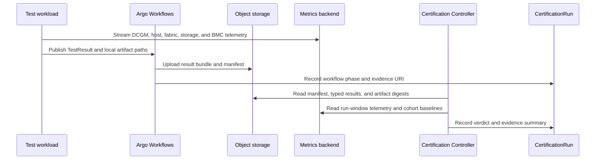
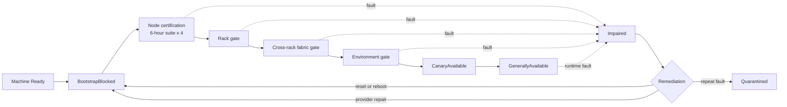

# Unbounded Certification Controller

**Status:** Engineering design review draft

**Scope:** Accelerator bare-metal capacity

**Objective:** Establish a Kubernetes-native reliability boundary before
capacity enters the production training pool.

## Decision summary

- A Certification Controller owns trust, lifecycle, policy, scheduler state,
  and remediation.
- Argo Workflows executes node, rack, fabric, and environment certification.
- Initial node burn-in runs the same six-hour suite four consecutive times.
- Rack, cross-rack, environment, and canary gates follow node certification.
- Production-idle certification begins with a configurable 30-minute active
  window and 30-minute cooldown.
- Versioned `CertificationTest` and `CertificationProfile` resources provide
  the extension model.
- Durable per-asset history carries certification, fault, repair, failover, and
  recovery evidence across Node replacement and customer delivery.

## Requirements

The certification system must:

1. Own the production-trust decision for accelerator capacity through a
   Kubernetes-native controller and API.
2. Bind trust to a durable provider asset identity while projecting current
   state onto the active Kubernetes Node.
3. Keep new, repaired, stale, and actively failing capacity blocked until the
   required profile produces current evidence.
4. Support initial burn-in, continuous monitoring, idle revalidation, and
   workload preflight as distinct execution modes with independent disruption,
   timeout, retry, and admission policy.
5. Validate node, local-fabric, rack, cross-rack fabric, Kubernetes platform,
   external network, external storage, and representative-workload behavior.
6. Compare declared hardware capability, observed inventory, and measured
   throughput so partial device availability and data-path regressions affect
   eligibility.
7. Execute the initial node burn-in suite for four consecutive six-hour
   repetitions and evaluate both each run and cross-run drift.
8. Produce typed results and durable evidence containing profile, test,
   runner, topology, participant, measurement, counter, artifact, and cleanup
   identity.
9. Preserve certification, runtime fault, remediation, failover, repair, and
   recovery history across Node recreation and customer delivery.
10. Classify evidence as healthy, degraded, failed, inconclusive, repairing, or
    verification-required and map each classification to explicit scheduler and
    remediation policy.
11. Publish bounded Node Conditions, eligibility labels, and scheduling taints
    while retaining per-device, per-link, per-test, and per-attempt details in
    certification resources and evidence storage.
12. Integrate lifecycle actions through `MachineOperation` and the existing
    ownership boundaries of machina, metalman, the Unbounded agent,
    unbounded-net, device operators, and the scheduler.
13. Require post-remediation verification before restored production
    eligibility and use repeated-failure history to drive quarantine and
    replacement policy.
14. Apply fleet, rack, and fabric blast-radius controls to automated
    quarantine and remediation.
15. Support versioned test definitions and profiles so new diagnostics,
    thresholds, execution primitives, and hardware generations extend the
    system through declared policy.

## Prior art and design inputs

The design incorporates lessons from existing certification, monitoring, and
triage systems:

| Input | Design lesson |
|---|---|
| [NVIDIA NVSentinel](https://docs.nvidia.com/nvsentinel/getting-started/overview/) | Continuous monitors, workload preflight, structured health events, topology-aware analysis, and separate remediation stages provide useful operating patterns |
| [Kubernetes Node Problem Detector](https://github.com/kubernetes/node-problem-detector) | Continuous fault detection complements burn-in through lightweight runtime signals |
| Fleet operating experience | Invasive burn-in, continuous node signals, structured triage, and durable repair history serve distinct stages of the capacity lifecycle |

The NVSentinel patterns come from its public documentation for
[preflight checks](https://docs.nvidia.com/nvsentinel/configuration/preflight/),
[health events](https://github.com/NVIDIA/NVSentinel/blob/853a3ee84e5484627d6898bbac452d29a851a5c3/docs/health-event-data-model.md),
[historical analysis](https://github.com/NVIDIA/NVSentinel/blob/853a3ee84e5484627d6898bbac452d29a851a5c3/docs/health-events-analyzer.md),
and [circuit breakers](https://github.com/NVIDIA/NVSentinel/blob/853a3ee84e5484627d6898bbac452d29a851a5c3/docs/circuit-breaker.md).
Unbounded owns its API, policy, evidence model, and remediation decisions.

These inputs establish four execution modes:

| Mode | Purpose | Typical checks |
|---|---|---|
| Initial burn-in | Establish trust before production admission | Full host, accelerator, local fabric, RDMA, storage, thermal, rack, and environment suites |
| Continuous monitoring | Detect runtime faults with low workload impact | NPD, DCGM, BMC, fabric, storage, kernel, and service signals |
| Idle revalidation | Refresh deeper evidence while operator-owned capacity is idle | Bounded stress, NCCL, RDMA, storage integrity, and drift checks |
| Workload preflight | Confirm current serviceability before a sensitive workload starts | Inventory, required device count, topology, environment, and targeted collective checks |

## Architecture

### Components

| Component | Ownership |
|---|---|
| Certification Controller | Selects policy, participants, gates, and remediation; evaluates evidence; reconciles Conditions, labels, and taints |
| Argo Workflows | Executes the requested test graph; manages retries, deadlines, synchronization, cleanup, and artifact publication |
| Test workloads | Run a specific certification test as a `Job`, `JobSet`, or `MPIJob`; publish a typed result |
| Evidence store | Retains logs, raw tool output, metrics, topology snapshots, counter deltas, and cleanup proof |
| Unbounded operators | Provision Machines, configure Nodes, manage networking and devices, and execute lifecycle operations |

### End-to-end flow

1. The controller observes a ready `Machine` and its Kubernetes `Node`.
2. The controller creates or refreshes `NodeCertification`.
3. The controller selects an immutable `CertificationProfile`.
4. The controller creates a `CertificationRun` for one scope and participant
   set.
5. The Argo adapter creates the corresponding Workflow.
6. Argo launches test workloads and publishes typed results.
7. The controller evaluates the evidence against profile policy.
8. The controller advances the gate, updates Kubernetes state, or starts
   remediation.

Each `CertificationRun` covers one scope:

- Node.
- Rack.
- Cross-rack fabric group.
- Environment validation group.

### Component topology

```mermaid
flowchart TB
    subgraph CP["Kubernetes control plane"]
        API["Kubernetes API"]
        CC["Certification Controller"]
        CRD["Certification CRDs<br/>NodeCertification<br/>CertificationProfile<br/>CertificationTest<br/>CertificationRun<br/>EnvironmentCertification"]
        ARGO["Argo Workflows"]
        KUEUE["Kueue / batch scheduler"]
        OPS["Unbounded operators<br/>machina, metalman, agent,<br/>unbounded-net, device operators"]
    end

    subgraph DP["Execution plane"]
        WORK["Certification workloads<br/>Job, JobSet, MPIJob"]
        NODE["Accelerator nodes<br/>GPU, HBM, NVLink, HCA,<br/>CPU, memory, NVMe, BMC"]
        COLLECT["Runtime collectors<br/>NPD, DCGM, RDMA,<br/>storage, BMC"]
    end

    subgraph EP["Evidence plane"]
        OBJECT["Durable object storage<br/>result manifests, raw artifacts,<br/>logs, topology, cleanup proof"]
        METRICS["Metrics backend<br/>time-series telemetry and dashboards"]
    end

    OPS <--> API
    CC <--> API
    CRD <--> API
    CC -->|"creates Workflow"| ARGO
    ARGO -->|"submits workloads"| KUEUE
    KUEUE --> WORK
    WORK --> NODE
    COLLECT -->|"live telemetry"| METRICS
    WORK -->|"typed results and artifacts"| OBJECT
    ARGO -->|"workflow status and evidence URI"| API
    CC -->|"reads evidence bundle"| OBJECT
    CC -->|"queries run telemetry"| METRICS
    CC -->|"creates MachineOperation"| API
```



Component roles:

| Component | Role in certification |
|---|---|
| Kubernetes API | Shared reconciliation surface for Machines, Nodes, certification CRDs, Argo Workflows, Jobs, Conditions, labels, and taints |
| Certification Controller | Trust and lifecycle authority |
| Argo Workflows | Workflow execution, retry, deadline, synchronization, cleanup, and artifact coordination |
| Kueue or batch scheduler | Admission, quota, priority, preemption, and gang scheduling |
| Certification workloads | Hardware and environment test execution |
| Runtime collectors | Continuous fault signals and time-series telemetry |
| Durable object storage | Auditable evidence bundles for certification decisions |
| Metrics backend | Operational telemetry, trend analysis, dashboards, and cohort comparison |

### Evidence store

The evidence store is durable object storage used as the certification record
for each run. The deployment selects an implementation that supports the
required identity, retention, versioning, and immutability policy.

Argo uses the same container as its artifact repository. Each
`CertificationRun` receives a dedicated prefix:

```text
certification-runs/
  <run-uid>/
    manifest.json
    run.json
    topology.json
    preflight/
      inventory.json
      versions.json
      counters.json
    tests/
      <test-name>/
        result.json
        stdout.log
        stderr.log
        measurements.json
        counters-before.json
        counters-after.json
        raw/
    cleanup/
      result.json
    checksums.txt
```

`manifest.json` records:

- CertificationRun UID.
- Asset and Node identities.
- Profile, test-definition, runner-image, and topology digests.
- Start and completion timestamps.
- Participant list.
- Artifact paths and SHA-256 digests.
- Result schema version.
- Cleanup status.

Evidence flow:



Storage responsibilities:

| Data | System |
|---|---|
| Verdict, phase, summary, evidence URI, manifest digest | `CertificationRun.status` |
| Gate state, eligibility, maturity, repair revision | `NodeCertification.status` |
| Typed result, topology, raw diagnostics, logs, cleanup proof | Durable object storage |
| High-frequency clocks, temperatures, power, counters, and bandwidth | Metrics backend |
| Scheduler-facing health and eligibility | Node Conditions, labels, and taints |

Access model:

- Test workloads receive prefix-scoped write access for their run.
- Argo receives artifact upload and workflow metadata access.
- The Certification Controller receives evidence read access and CRD update
  access.
- Object versioning, retention, and immutability policy preserve the reviewed
  evidence bundle.
- Manifest and artifact digests bind the controller verdict to exact evidence.

## Certification Controller

### Responsibilities

The controller:

- Discovers new, changed, repaired, and stale assets.
- Maintains durable trust keyed to provider asset and component identity.
- Keeps certification-pending capacity blocked from production.
- Selects profiles and required gates.
- Selects participants and acquires failure-domain leases.
- Creates and observes certification runs.
- Evaluates typed evidence and cross-run drift.
- Publishes bounded Node Conditions.
- Applies eligibility labels and scheduling taints.
- Requests resets, reboots, repaves, and replacement through Unbounded
  lifecycle APIs.
- Schedules continuous certification during production-idle windows.
- Tracks repeat faults, repair and failover history, and quarantine policy.
- Compares declared hardware capability with measured serviceability and
  throughput.
- Preserves trust history when capacity transitions to customer control and
  active revalidation opportunities become sparse.

### Kubernetes resources

| Resource | Purpose |
|---|---|
| `NodeCertification` | Durable trust, lifecycle, gate freshness, repair revision, maturity, eligibility, and bounded history summary for one asset |
| `CertificationProfile` | Immutable gate graph, test references, thresholds, cadence, and remediation policy |
| `CertificationTest` | Reusable test definition, runner, resources, topology, safety classification, and result mapping |
| `CertificationRun` | Immutable execution request, participant snapshot, verdict, and evidence references |
| `EnvironmentCertification` | Shared Kubernetes, external network, and storage readiness |
| `RemediationCase` | Fault evidence, lifecycle operation, provider repair, and recertification requirement |

The provider asset identity provides the durable key. The Kubernetes Node UID
provides the current runtime binding.

### Historical trust

Certification history follows the durable provider asset identity rather than
the current Node object. A new Node binding retains the asset's earlier
certification, runtime fault, failover, repair, and recovery records.

`NodeCertification.status` carries the bounded summary required for
reconciliation:

- Current trust state and active profile generation.
- Last successful result for each required gate.
- Recent fault, remediation, and recovery timestamps.
- Repair revision and provider operation references.
- Repeat-failure counters by subsystem and rolling policy window.
- Latest declared inventory and measured throughput summary.
- Evidence references for the complete immutable history.

The evidence store retains every attempt and relationship:

- Certification and revalidation attempts.
- Runtime health events and impacted hardware entities.
- Reset, reboot, repave, failover, repair, and replacement actions.
- Pre-repair and post-repair measurements.
- Supersession links from newer evidence to earlier findings.
- Verified recovery boundaries.

This history supports policy such as `RepeatedFailureWithinWindow`,
`RepeatedRepairWithoutRecovery`, `ThroughputRegressionAfterRepair`, and
`HostReturnedAfterMultipleFailovers`. A successful repair appends a recovery
record and preserves the earlier failure evidence.

### Observed signals

| Source | Signal |
|---|---|
| `Machine` | Provisioning phase, applied configuration, Node reference, provider, site, and bootstrap status |
| `MachineOperation` | Node reboot, host reboot, power, repave, and replacement progress |
| `Node` | kubelet readiness, pressure, resources, topology, taints, and runtime Conditions |
| NPD | Kernel, memory, filesystem, device, and required-service events |
| DCGM and GPU collectors | Xids, ECC, retired pages, clocks, temperature, power, and throttling |
| RDMA and fabric collectors | Port state, link flaps, BER/FEC, retries, congestion, and bandwidth |
| Storage collectors | Media health, integrity, latency, and throughput |
| BMC and facility collectors | Temperature, power, fan, PSU, and platform health |
| Argo and test results | Execution phase, measurements, counter deltas, artifacts, and cleanup |
| Scheduler and Kueue | Workload demand, reservations, preemption, and gang admission |

### Node Conditions

Condition types represent operational failure domains. Stable `Reason` values
carry specific diagnoses.

| Condition | Producer | Example reasons |
|---|---|---|
| `UnboundedHostFault` | NPD and host collector | `MachineCheck`, `MemoryUncorrectable`, `KernelHardLock`, `CPUThrottleViolation` |
| `UnboundedAcceleratorFault` | GPU/DCGM detector | `FatalXid`, `UncorrectableECC`, `FallenOffBus`, `ClockViolation`, `ResetRequired` |
| `UnboundedLocalFabricFault` | NVLink/NVSwitch detector | `LinkDegraded`, `SwitchFault`, `BandwidthFloor`, `CollectiveMismatch` |
| `UnboundedRDMAFault` | RDMA/fabric detector | `PortDown`, `LinkFlap`, `BERExceeded`, `GDRFailure`, `BandwidthFloor` |
| `UnboundedLocalStorageFault` | NPD and storage collector | `MediaError`, `ReadOnlyFilesystem`, `ChecksumMismatch`, `LatencyFloor` |
| `UnboundedPlatformFault` | Kubernetes platform probes | `DNSFailure`, `CNIReadinessFailure`, `DevicePluginReadinessFailure`, `CSIReadinessFailure`, `SchedulerFailure` |
| `UnboundedExternalNetworkFault` | Environment validator | `PathReadinessFailure`, `MTUMismatch`, `ThroughputFloor`, `LossExceeded` |
| `UnboundedExternalStorageFault` | Environment validator | `AccessFailure`, `ChecksumMismatch`, `ThroughputFloor`, `MetadataSLO` |
| `UnboundedCertificationReady` | Certification Controller | `AllGatesPassed`, `GateFailed`, `EvidenceStale`, `RecertificationRequired` |

Fault-condition polarity:

- `False`: current healthy signal.
- `True`: active fault.
- `Unknown`: current evidence pending.

`UnboundedCertificationReady` polarity:

- `True`: every required gate and monitor passes with current evidence.
- `False`: a blocking fault or failed gate exists.
- `Unknown`: trust assessment awaits current evidence.

Per-device, per-link, per-test, and per-repetition detail remains in
certification status and immutable evidence.

Health evaluation separates severity from the current scheduler action:

| Classification | Meaning | Typical action |
|---|---|---|
| `Healthy` | Current evidence meets the profile | Preserve or advance eligibility |
| `Degraded` | Service remains usable and evidence requests correlation, repetition, or a workaround | Record yellow state, increase monitoring, or schedule revalidation |
| `Failed` | A hard serviceability threshold or fatal hardware event triggers | Block admission and start remediation |
| `Inconclusive` | Test execution, dependency readiness, or evidence completeness leaves the result unresolved | Preserve the prior trust boundary and repeat the required check |
| `Repairing` | An accepted remediation action is active | Keep the asset blocked and collect operation status |
| `VerificationRequired` | Remediation completed and recovery evidence remains due | Run the profile selected for the repair revision |

Specific event policy maps individual XIDs, ECC states, link events, and
counter deltas to these classifications. A fatal XID can trigger immediate
remediation, while transient or correctable signals can accumulate as degraded
evidence and advance through correlation policy.

### Scheduler state

Labels:

```text
certification.unbounded.io/eligibility=blocked|canary|production
certification.unbounded.io/profile=<profile-version>
certification.unbounded.io/generation=<certification-generation>
certification.unbounded.io/maturity=new|stabilizing|mature
topology.unbounded.io/provider=<provider>
topology.unbounded.io/rack=<rack>
topology.unbounded.io/leaf=<leaf>
topology.unbounded.io/rail=<rail>
```

Taints:

| Taint | Effect | State |
|---|---|---|
| `certification.unbounded.io/blocked` | `NoSchedule` | New, repaired, expired, or certification-pending |
| `certification.unbounded.io/testing` | `NoSchedule` | Reserved for disruptive certification |
| `certification.unbounded.io/impaired` | `NoSchedule` | Active fault or remediation |
| `certification.unbounded.io/fatal` | `NoExecute` according to policy | Integrity or hardware fault requiring prompt workload removal |

### Lifecycle



Every repair returns the asset to `BootstrapBlocked`. Recertification then
follows the profile selected for the repair revision.

### Coordination with Unbounded operators

| Component | Existing ownership | Certification interaction |
|---|---|---|
| machina `Machine` controller | Provisioning, Node join, applied configuration, and Machine phase | Start certification from `MachinePhaseReady`, current configuration generation, and matching Node reference |
| metalman | PXE, TPM bootstrap, image delivery, Redfish power, reboot, and repave | Execute host actions requested through `MachineOperation` |
| Unbounded agent | `NodeReboot`, `AgentUpgrade`, and `AgentReset` | Execute in-node operations requested through `MachineOperation` |
| Machine operations controller | Routes operations and records status | Provide operation phase, completion Condition, and observed Machine generation |
| Machine configuration controllers | Host and kubelet configuration, labels, and registration taints | Supply configuration generation and registration-time blocked taint |
| unbounded-net | Site networking, gateways, routes, and connectivity | Supply readiness and own networking remediation |
| GPU and RDMA operators | Drivers, device plugins, and resources | Supply readiness before certification workloads start |
| Scheduler and Kueue | Admission, quota, preemption, and gang scheduling | Admit low-priority certification workloads and expose demand |

Lifecycle operation mapping:

| Certification decision | `MachineOperation` | Executor |
|---|---|---|
| Recoverable in-node fault | `NodeReboot` | Unbounded agent |
| Agent lifecycle action | `AgentReset` or `AgentUpgrade` | Unbounded agent |
| Host-level recovery | `HostReboot` | metalman or provider controller |
| Reimage or replacement | `HostReplace` | metalman or provider controller |
| Datacenter repair | Repair record followed by the selected host operation | Infrastructure provider, datacenter operator, and metalman |

Operation completion advances the asset to `BootstrapBlocked` and increments
the repair revision.

## Argo workflow service

### Decision

The initial implementation uses Argo Workflows as the execution engine for
continuous infrastructure validation. Unbounded retains its own certification
API and controller ownership model.

Argo supplies:

- Declarative DAG dependencies.
- Fan-out and result fan-in.
- Retry and backoff.
- Step and workflow deadlines.
- Mutexes and semaphores.
- Exit handlers and cleanup.
- Cancellation.
- Artifact integration.
- Workflow history and operator UI.
- Workflow-state recovery across controller restarts.

The Certification Controller owns trust, thresholds, eligibility, lifecycle,
and remediation. Argo owns execution.

### Adapter interface

```go
type WorkflowService interface {
    Submit(ctx context.Context, run *CertificationRun) (WorkflowReference, error)
    Observe(ctx context.Context, ref WorkflowReference) (WorkflowStatus, error)
    Cancel(ctx context.Context, ref WorkflowReference) error
}
```

The initial release implements the Argo adapter. The interface preserves the
certification API as the execution implementation evolves.

### Argo execution contract

For each `CertificationRun`, the adapter supplies:

- Run UID and artifact prefix.
- Profile and test-definition digests.
- Scope and exact participants.
- Topology snapshot.
- Runner parameters and safety limits.
- Deadlines, retry classes, and cleanup policy.

Argo creates a `Job`, `JobSet`, or `MPIJob` for each selected
`CertificationTest`.

Each workload:

1. Validates devices, mounts, drivers, and topology.
2. Captures pre-test inventory, counters, and telemetry.
3. Executes the configured test.
4. Captures post-test counters, telemetry, and health events.
5. Calculates measurements and counter deltas.
6. Writes a typed `TestResult`.
7. Uploads logs, raw output, metrics, and diagnostics.
8. Reports cleanup completion.

Workload type by scope:

| Scope | Workload |
|---|---|
| Node | Node-local Jobs |
| Rack | Gang-scheduled JobSet or MPIJob |
| Cross-rack fabric | Gang-scheduled JobSet or MPIJob across selected topology |
| Environment | Per-node probe Jobs followed by an aggregation step |

### Alternatives considered

| Option | Strength | Engineering cost |
|---|---|---|
| Argo Workflows | Mature DAG, retry, synchronization, cleanup, artifacts, UI, and history | Additional platform service and workflow CRDs |
| Controller-native Jobs | Unified Unbounded state model and direct lifecycle integration | Workflow-engine implementation and operations |
| Tekton Pipelines | Mature reusable task pipelines | Topology-aware multi-node integration |
| Volcano JobFlow | HPC-oriented jobs and gang scheduling | Scheduler coupling and smaller workflow ecosystem |
| Temporal | Durable timers, signals, and compensation | External control plane and Kubernetes execution adapters |

Kueue, JobSet, and MPIJob provide scheduling and execution primitives. Argo
supplies the workflow lifecycle around them.

## Initial certification workflow

### Entry criteria

- `Machine.status.phase=Ready`.
- Machine and Node references match.
- Provisioning and configuration generations are current.
- GPU, RDMA, storage, and monitoring services report ready.
- The blocked taint is present.
- The scheduler reports zero production allocations.
- The required failure-domain lease is acquired.

### Repeated burn-in

Initial burn-in executes the same complete six-hour node suite four consecutive
times.

For each repetition:

1. Create an immutable `CertificationRun`.
2. Capture topology, versions, and pre-test counters.
3. Execute the complete node suite.
4. Capture post-test counters and cleanup proof.
5. Publish typed results and artifacts.
6. Evaluate `Pass`, `Suspect`, `Fail`, or `Inconclusive`.

Every repetition produces an independent pass. After repetition four, the
controller evaluates:

- Performance variance.
- Clock, temperature, and power drift.
- ECC, remap, retry, BER, and link-flap growth.
- Cohort outliers.
- Repeated suspect results.

### Capability and throughput

Certification compares declared hardware capability, observed inventory, and
measured throughput. Each profile defines the expected accelerator, HCA, link,
rail, and storage shape together with performance floors.

Example evidence:

```text
expected.gpus=8
observed.gpus=7
expected.fabricBandwidthGbps=400
achieved.ncclBusBandwidthGbps=86
```

Inventory checks identify missing devices and topology drift. Comprehensive
IB, RDMA, and NCCL tests then validate the usable end-to-end data path. This
combination catches partial configurations that enumerate enough components to
start workloads yet deliver reduced collective participation or throughput.

### Node suite

| Test | Tools and operations | Pass contract | Fault result |
|---|---|---|---|
| Inventory and topology | `dmidecode`, `lspci`, `nvidia-smi`, `dcgmi discovery`, `ibstat`, `rdma link`, `nvme list`, Redfish snapshot | Device inventory, firmware, PCIe width/speed, and topology match the approved profile | `UnboundedPlatformFault` with configuration reason |
| Host burn | `stress-ng`, STREAM, NUMA bandwidth, memory integrity | MCE/EDAC counters remain within policy; bandwidth, latency, clocks, and throttling meet profile | `UnboundedHostFault` |
| Local storage | `nvme-cli`, `fio`, direct-I/O checksum validation | Media counters, integrity, bandwidth, and latency meet profile | `UnboundedLocalStorageFault` |
| GPU and HBM | DCGM diagnostics, CUDA stress, HBM bandwidth and memory-pattern tests | Xids, ECC, retired pages, clocks, bandwidth, temperature, and power meet profile | `UnboundedAcceleratorFault` |
| PCIe, NVLink, and NVSwitch | `nvbandwidth`, CUDA peer tests, intra-node NCCL, NVSwitch counters | Link state, peer matrix, bandwidth, error deltas, and collective output meet profile | `UnboundedLocalFabricFault` |
| HCA and GPUDirect RDMA | `ib_write_bw`, `ib_read_bw`, `ib_send_bw`, GDRCopy-equivalent validation | Port state, GDR, bandwidth, latency, retries, BER/FEC, and flap deltas meet profile | `UnboundedRDMAFault` |
| Mixed thermal soak | Concurrent CPU, GPU, HBM, NVLink, and RDMA load with DCGM and BMC sampling | Sustained clocks, temperature, power, fan, PSU, and error growth meet profile | Fault on the affected subsystem |
| Final snapshot | Repeat inventory and health-counter collection | Complete before/after deltas and cleanup evidence | Suite verdict input |

The profile assigns runner durations that total approximately six hours.

### Multi-node and environment gates

| Gate | Tests | Pass contract |
|---|---|---|
| Rack | NCCL `all_reduce`, `all_gather`, `reduce_scatter`, point-to-point bandwidth, rail-aware RDMA | Every rank completes; bandwidth, variance, counters, and rail balance meet rack policy |
| Cross-rack fabric | NCCL and RDMA across selected racks, rails, leaf groups, and spine paths | Required path coverage, aggregate bandwidth, fairness, loss, retries, and congestion meet fabric policy |
| Kubernetes platform | Pod scheduling, DNS, service routing, image pulls, GPU/RDMA allocation, CSI, gang scheduling, cancellation, cleanup | Every required platform function completes within SLO with complete cleanup |
| External network | Per-node and aggregate throughput, route, MTU, latency, loss, retransmits, path coverage | Every node meets the per-node floor; aggregate target, fairness, and path coverage meet policy |
| External storage | Per-node access, `fio`, IOR, `mdtest`, metadata, read/write, checkpoint, checksum, restore | Integrity, per-node SLOs, aggregate targets, checkpoint, and restore meet policy |
| Representative workload | Multi-node training step, collectives, checkpoint, restart, restore, output verification | Performance, deterministic output, checkpoint, and recovery meet workload policy |

### Test result contract

```go
type TestResult struct {
    TestName       string
    DefinitionRef  string
    DefinitionHash string
    Subjects       []SubjectReference
    StartedAt      metav1.Time
    CompletedAt    metav1.Time
    Execution      ExecutionResult
    Measurements   []Measurement
    CounterDeltas  []CounterDelta
    HealthEvents   []HealthEvent
    Artifacts      []ArtifactReference
    Cleanup        CleanupResult
}
```

Verdicts:

| Verdict | Meaning |
|---|---|
| `Pass` | Complete evidence satisfies profile policy |
| `Suspect` | Absolute floors pass and drift or cohort policy requests review or repetition |
| `Fail` | A hard threshold or fatal event triggers |
| `Inconclusive` | Evidence, execution, or cleanup leaves the result unresolved |

### Release sequence

1. Four node-suite passes.
2. Rack gate.
3. Cross-rack fabric gate.
4. Kubernetes and external-service environment gate.
5. Canary workloads.
6. Production eligibility.

## Continuous certification

### Execution policy

Continuous certification combines passive monitors, active idle checks, and
targeted workload preflight:

- Passive monitors run throughout the asset lifecycle and publish structured
  health events.
- Active idle checks refresh deeper evidence when the operator controls the
  scheduling window.
- Workload preflight validates the current hardware and environment contract
  before selected sensitive workloads.
- Initial and post-repair burn-in use the complete invasive profile.

Customer delivery changes the available validation window. Capacity assigned
to customer workloads may provide few idle periods for active checks. Durable
per-asset history therefore carries the latest burn-in, runtime health,
failover, repair, and recovery evidence into admission and support decisions.

### Eligibility

Continuous certification starts when:

- The node is `GenerallyAvailable`.
- `UnboundedCertificationReady=True`.
- Scheduler, reservation, drain, and maintenance checks report idle
  eligibility.
- The cooldown has elapsed.
- Fleet and failure-domain concurrency permit the run.
- Selected tests carry `continuousEligible=true`.

### Initial cadence

- Active window: 30 minutes.
- Cooldown: at least 30 minutes.
- Priority: below production workloads.
- Preemption result: `Interrupted`.
- Fatal event result: immediate transition to `Impaired`.

### Continuous profile

The continuous profile prioritizes:

- Passive GPU, host, fabric, storage, and BMC telemetry.
- Bounded CPU, memory, GPU, HBM, NVLink, and RDMA stress.
- Read-dominant storage and integrity validation.
- Low-priority, preemptible node-local workloads.
- Small rack collectives within configured concurrency.

Maintenance profiles schedule firmware changes, destructive tests, broad fault
injection, endurance writes, disruptive reboot tests, and large cross-rack
validation.

### Maturity policy

| Maturity | Active testing |
|---|---|
| `new` | 30-minute active window and 30-minute cooldown while idle |
| `stabilizing` | Reduced frequency after configured clean runtime and continuous passes |
| `mature` | Lower active frequency with continuous passive monitoring |

The controller increases frequency after:

- Driver, firmware, kernel, OS, or configuration change.
- Rack or fabric change.
- Repair or component replacement.
- Runtime fault.
- Cohort regression.

### Blast-radius controls

Automated quarantine and remediation use fleet and topology limits:

- Observation mode records proposed actions before enforcement.
- Absolute and percentage limits bound simultaneous quarantines.
- Rack and fabric-domain limits prevent one correlated environment fault from
  producing a host-replacement storm.
- A circuit-breaker state pauses new disruptive actions while evidence
  collection continues.
- Operator reset chooses how accumulated actions resume after review.

## Extensibility

### `CertificationTest`

```yaml
apiVersion: certification.unbounded.io/v1alpha1
kind: CertificationTest
metadata:
  name: gpu-hbm-burn
spec:
  scope: Node
  executor:
    image: registry.example.com/unbounded-cert-gpu@sha256:...
    command: ["/runner", "gpu-hbm-burn"]
  resources:
    gpu: all
    cpu: "8"
    memory: 32Gi
  timeout: 45m
  retryPolicy:
    maxAttempts: 2
    retryableReasons: [InfrastructureInterrupted]
  behavior:
    disruptive: false
    continuousEligible: true
  resultSchema: certification.unbounded.io/test-result/v1
  faultMappings:
    - event: UncorrectableECC
      condition: UnboundedAcceleratorFault
      reason: UncorrectableECC
      severity: Fatal
```

A test definition declares:

- Scope and execution image.
- Command and typed parameters.
- Resources and privileges.
- Topology requirements.
- Timeout and retry policy.
- Safety and continuous-eligibility classification.
- Result schema.
- Health-event and fault mapping.
- Cleanup requirements.

### `CertificationProfile`

```yaml
apiVersion: certification.unbounded.io/v1alpha1
kind: CertificationProfile
metadata:
  name: gpu-bare-metal-v3
spec:
  hardwareSelector:
    accelerator: gpu
    hostClass: bare-metal
  initial:
    repetitions: 4
    targetDurationPerRepetition: 6h
  gates:
    - name: node
      tests:
        - inventory
        - host-memory-burn
        - local-nvme
        - gpu-hbm-burn
        - nvlink-nvswitch
        - rdma-gdr
    - name: rack
      dependsOn: [node]
      tests: [rack-nccl]
    - name: fabric
      dependsOn: [rack]
      tests: [cross-rack-rdma]
    - name: environment
      dependsOn: [fabric]
      tests:
        - kubernetes-platform
        - external-network
        - external-storage
  continuous:
    activeWindow: 30m
    cooldown: 30m
    tests:
      - host-memory-burn
      - gpu-hbm-burn
      - nvlink-nvswitch
      - rdma-gdr
```

Profiles become immutable after first use. A suite change creates a new profile
version and certification generation.

### Adding a certification

1. Implement a runner that emits the typed result schema.
2. Build, sign, scan, and publish the runner image by digest.
3. Create a `CertificationTest`.
4. Add the test to a new `CertificationProfile`.
5. Validate the generated Argo Workflow in a staging cohort.
6. Promote the profile.
7. Apply targeted or full recertification policy.

The existing controller path supports tests that use:

- An existing execution scope.
- The standard result schema.
- An existing fault domain.
- Job, JobSet, or MPIJob execution.

Controller and adapter extension points cover:

- New execution primitives.
- New failure-domain lock types.
- New scheduler integrations.
- New Node Condition domains.
- New remediation operations.

### Workflow compilation

```go
type RunGraph struct {
    Steps []RunStep
}

type RunStep struct {
    Name         string
    TestRef      string
    DependsOn    []string
    Participants []SubjectReference
    LeaseRefs    []LeaseReference
    Parameters   map[string]string
}
```

The Argo adapter translates the graph into Workflow templates and child
workloads. Certification policy and test definitions remain in Unbounded CRDs.

## Reconciliation shape

```go
func (r *NodeCertificationReconciler) Reconcile(
    ctx context.Context,
    req ctrl.Request,
) (ctrl.Result, error) {
    cert, machine, node, profile, err := r.loadState(ctx, req)
    if err != nil {
        return ctrl.Result{}, err
    }

    desired, err := r.evaluate(cert, machine, node, profile)
    if err != nil {
        return ctrl.Result{}, err
    }

    if err := r.reconcileConditions(ctx, node, desired); err != nil {
        return ctrl.Result{}, err
    }
    if err := r.reconcileLabelsAndTaints(ctx, node, desired); err != nil {
        return ctrl.Result{}, err
    }
    if err := r.reconcileMachineOperation(ctx, cert, machine, desired); err != nil {
        return ctrl.Result{}, err
    }
    if err := r.reconcileCertificationRun(ctx, cert, profile, desired); err != nil {
        return ctrl.Result{}, err
    }

    return ctrl.Result{RequeueAfter: desired.RequeueAfter}, nil
}
```

## Open decisions

1. Argo deployment, tenancy, artifact repository, retention, and upgrade
   ownership.
2. Registration-time ownership of the blocked taint in Machine configuration.
3. Provider repair and ticket integration.
4. Accelerator test images and vendor diagnostic versions.
5. Per-node and aggregate external network targets.
6. External service endpoints, storage backend, and workload SLOs.
7. Canary duration and representative workload mix.
8. `NoExecute` policy for fatal integrity faults.
9. Cohort maturity thresholds.
10. Evidence retention and artifact backend.
11. Customer-delivery integration for workload preflight and history queries.
12. Degraded-state thresholds, workaround policy, and escalation windows.
13. Fleet, rack, and fabric circuit-breaker thresholds.
14. Review of additional certification frameworks as source access becomes
    available.
