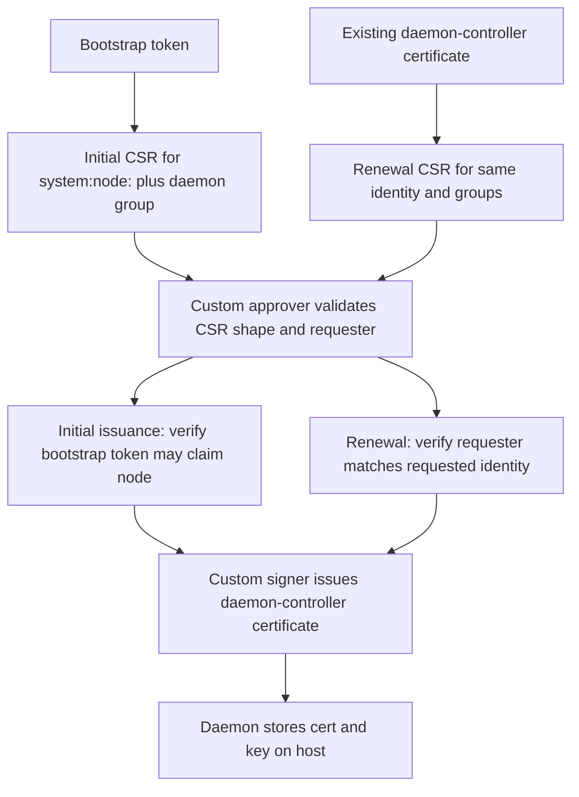
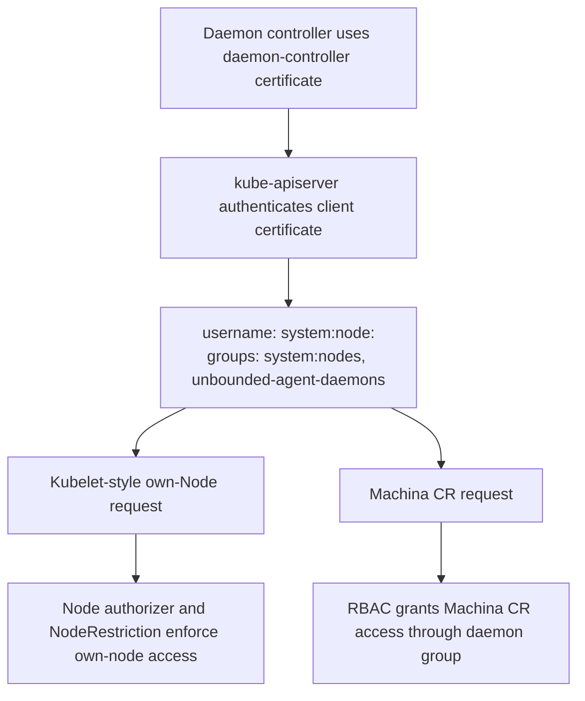

# Daemon Controller Authn/z

The host-side `unbounded-agent` daemon controller needs a Kubernetes client
credential for reconciling local Unbounded machine state. The credential must
authenticate to kube-apiserver, keep the same baseline `Node` permissions as a
kubelet, and carry an additional Unbounded group for Machina CR access.

Today `cmd/agent/internal/daemon` builds that client from the applied agent
config, which contains the API server URL, the cluster CA bundle, and the kubelet
TLS bootstrap token. The daemon controller uses that bootstrap-token client to
ensure the local `Machine` CR exists, publish `AgentUpgrade` startup status, run
the shared daemon controller, watch local `Node` deletion events, and update
local `Machine` status after repave-related reconciliation. This works today
because the bootstrap token can authenticate with an extra authorization group
that RBAC uses for Machina CR access. That extra group is part of the bootstrap
token's authenticated user info, not a durable daemon identity.

This is useful during early bootstrap, but it is not acceptable for a long-running
daemon controller. The TLS bootstrap token is short-lived and is intended for
joining, not ongoing reconciliation. The extra bootstrap-token group also will
not be propagated into the built-in kubelet client certificate issued by Kubernetes;
the built-in kubelet client signer accepts only the kubelet-shaped `system:nodes`
organization. The daemon controller therefore needs a rotated client certificate
whose authorization shape matches its two roles: kubelet-like own-node access and
Unbounded CR access.

## Goals

- Give the daemon controller a client certificate for kube-apiserver
  authentication and authorization.
- Restrict daemon-controller `Node` permissions to the same baseline used by the
  kubelet: own-Node read, own-Node main-resource create/update/patch subject to
  NodeRestriction, and own-Node status update/patch.
- Include an extra group in the certificate so RBAC can grant Machina CR access
  to the daemon controller.
- Keep lifecycle operations that require privileged `Node` mutation outside the
  daemon controller, including updating node labels or taints and deleting the
  `Node` object to trigger repave.
- Keep daemon-controller behavior limited to local reconciliation and status
  reporting.
- Ensure the daemon implementation does not rely on own-Node main-resource
  updates, even though the credential has kubelet-style own-Node update/patch
  capability subject to NodeRestriction.

## Non-goals

- Define the separate lifecycle controller or operator workflow that performs
  cordon, drain, privileged node changes, or Node deletion.
- Change the kubelet client certificate signer or kubelet TLS bootstrap behavior.
- Define a general-purpose node identity model for components other than the
  `unbounded-agent` daemon controller.
- Define revocation or CA rotation for daemon-controller certificates.

## Proposed Certificate Identity

A normal kubelet client certificate authenticates as a Kubernetes node identity:

```text
CN = system:node:<nodeName>
O  = system:nodes
```

Kubernetes recognizes this shape as a node identity. The built-in
[Node authorizer](https://github.com/kubernetes/kubernetes/blob/master/plugin/pkg/auth/authorizer/node/node_authorizer.go)
then limits node requests to kubelet-style node-scoped behavior. For `Node`
objects, that includes own-Node reads, own-Node main-resource create/update/patch,
and own-Node status update/patch. The
[NodeRestriction admission plugin](https://github.com/kubernetes/kubernetes/blob/master/plugin/pkg/admission/noderestriction/admission.go)
adds object-level restrictions for node requests, such as preventing a node from
modifying another node or changing protected parts of its own `Node` object. This
identity cannot delete Nodes through the Node authorizer path.

The daemon controller should get the same baseline `Node` behavior, so its custom
client certificate is intentionally kubelet-shaped and adds one Unbounded group:

```text
CN = system:node:<nodeName>
O  = system:nodes
O  = unbounded-agent-daemons
```

`unbounded-agent-daemons` is the default group name used in this design. The
group name should be configurable by deployment as long as the CSR approver, CSR
signer, and RBAC binding agree on the same value.

Including `system:nodes` causes the built-in Node authorizer and NodeRestriction
admission plugin to apply the same own-node restrictions used for kubelets. This
is how the daemon controller satisfies the baseline `Node` requirement. This is
kubelet-style Node access, not a custom status-only permission model.

Including `unbounded-agent-daemons` allows RBAC to grant additional Unbounded CR
permissions without granting those permissions to all kubelets.

This certificate must be issued by a custom signer. The built-in Kubernetes kubelet
client signer validates kubelet client CSRs as exactly `O=system:nodes` in the
[kubelet client CSR validation helper](https://github.com/kubernetes/kubernetes/blob/master/pkg/apis/certificates/helpers.go)
and does not preserve bootstrap-token extra groups into the issued kubelet client
certificate. The daemon-controller certificate therefore needs a custom CSR
approval and signing path that deliberately permits the extra Unbounded group.

## Authorization Model

Authorization is split by resource family:

- Built-in Node authorizer and NodeRestriction admission handle `Node` access for
  the `system:node:<nodeName>` / `system:nodes` part of the identity.
- Kubernetes RBAC grants Machina CR access through the `unbounded-agent-daemons`
  group.

The Unbounded group must not grant additional `Node` mutation permissions. Node
labels, taints, privileged annotations, and Node deletion remain outside the
daemon controller.

## Machina RBAC

RBAC grants Machina-related permissions to the extra group, not directly to
`system:nodes`:

```yaml
apiVersion: rbac.authorization.k8s.io/v1
kind: ClusterRole
metadata:
  name: unbounded-agent-daemon-controller
rules:
- apiGroups: ["unbounded-cloud.io"]
  resources: ["machines"]
  verbs: ["get", "create", "update", "patch"]
- apiGroups: ["unbounded-cloud.io"]
  resources: ["machines/status"]
  verbs: ["get", "update", "patch"]
- apiGroups: ["unbounded-cloud.io"]
  resources: ["machineoperations"]
  verbs: ["get", "list", "watch"]
- apiGroups: ["unbounded-cloud.io"]
  resources: ["machineoperations/status"]
  verbs: ["get", "update", "patch"]
- apiGroups: ["unbounded-cloud.io"]
  resources: ["machineconfigurationversions"]
  verbs: ["get", "list", "watch"]
```

```yaml
apiVersion: rbac.authorization.k8s.io/v1
kind: ClusterRoleBinding
metadata:
  name: unbounded-agent-daemon-controller
roleRef:
  apiGroup: rbac.authorization.k8s.io
  kind: ClusterRole
  name: unbounded-agent-daemon-controller
subjects:
- kind: Group
  apiGroup: rbac.authorization.k8s.io
  name: unbounded-agent-daemons
```

## CSR Approval And Signing

The custom CSR approver is responsible for ensuring only the local daemon
controller can receive the kubelet-shaped certificate with the extra group.

The approver validates:

- `spec.signerName` is the Unbounded daemon-controller signer.
- The requested common name is `system:node:<expected-node-name>`.
- The requested organizations are exactly `system:nodes` and
  `unbounded-agent-daemons`.
- The requested usages are limited to client authentication.
- The request has no subject alternative names unless a future design explicitly
  allows them.
- For initial issuance, the bootstrap requester is allowed to claim the requested
  node name.
- Renewal requests cannot change the node name or group set.
- A normal kubelet certificate that has `system:nodes` but does not have the
  configured Unbounded daemon group cannot renew into a daemon-controller
  certificate.

The custom signer signs only approved CSRs for this signer. The issued
certificate must chain to a CA trusted by the kube-apiserver client certificate
authenticator.

## Certificate Issuing Process

The daemon-controller certificate can be issued in two cases: initial issuance
from a bootstrap token and renewal from an existing daemon-controller
certificate. Both paths produce the same certificate shape:

```text
CN = system:node:<nodeName>
O  = system:nodes
O  = unbounded-agent-daemons
```

### Initial Issuance From Bootstrap Token

Initial issuance starts before the daemon has a durable client certificate. The
daemon submits a CSR using the kubelet TLS bootstrap token from the applied agent
config.

The approval rule is: the bootstrap token submitting the CSR must be allowed to
claim the requested node name. The CSR subject is not trusted by itself. Without
this check, any valid bootstrap token could request a daemon-controller
certificate for another node.

The initial issuance flow is:

1. The daemon builds a bootstrap REST client from the API server URL, cluster CA,
   and kubelet TLS bootstrap token in the applied agent config.
2. The daemon creates a private key and CSR for the daemon-controller signer with
   `CN=system:node:<nodeName>`, `O=system:nodes`, and the configured Unbounded
   daemon group.
3. The custom approver validates the CSR shape, signer, usages, and requested
   expiration.
4. The custom approver resolves the bootstrap token identity and verifies that the
   token is authorized to claim the requested Machine and Node name.
5. The custom signer signs the approved CSR with a CA trusted by the kube-apiserver
   client certificate authenticator.
6. The daemon stores the issued certificate and private key on the host with
   permissions limited to the daemon user.
7. The daemon uses the issued certificate for daemon-controller API requests.

The token-to-node check should use controller-owned state, such as Machine data,
provisioning state, or bootstrap-token metadata. The exact source can vary by
provisioning path, but the security property is fixed: the approver must prove
that this bootstrap token is allowed to request this node name.

### Renewal From Existing Certificate

Renewal starts after the daemon already has a valid daemon-controller
certificate. Renewal does not use the bootstrap token unless the existing
certificate has expired and the daemon must fall back to the initial issuance
path.

The renewal flow is:

1. The daemon periodically checks the stored certificate lifetime.
2. When the certificate enters its renewal window, the daemon creates a new
   private key and CSR for the same signer, common name, organizations, and
   usages.
3. The daemon submits the CSR using the current daemon-controller certificate.
4. The custom approver validates that the authenticated requester is the same
   `system:node:<nodeName>` identity and still carries the configured Unbounded
   daemon group.
5. The custom approver rejects renewal if the requested node name, group set,
   signer, or usages changed.
6. The signer issues a replacement certificate.
7. The daemon atomically replaces the stored certificate and uses it for new API
   connections.

If renewal fails while the current certificate remains valid, the daemon should
retry with backoff and expose metrics. If the certificate expires and no valid
bootstrap path exists, the daemon must fail closed and stop reconciling API-backed
operations until a valid credential is available.

## Request Flow

Certificate issuance:



Authentication and authorization:



## Machina CR Scoping

RBAC bound to `unbounded-agent-daemons` is group-wide. The built-in Node
authorizer does not scope Unbounded CRDs to the local node or Machine. This
design assumes daemon controllers are trusted to reconcile only their local
`Machine` and `MachineOperation` objects by implementation logic and
controller-owned conventions.

If hard per-node or per-Machine enforcement is required later, it must be added
separately. Options include deterministic `resourceNames`-based RBAC, admission
checks for create/update/patch, or a custom authorizer.

## Node Permissions

The daemon controller receives kubelet-like baseline `Node` permissions from the
`system:node:<nodeName>` and `system:nodes` parts of its certificate. It may rely
on the built-in Kubernetes node path for own-Node reads and own-Node status
updates. The same credential can also attempt kubelet-style own-Node
main-resource create/update/patch, subject to NodeRestriction. The daemon
implementation will not rely on main-resource `Node` updates.

The `unbounded-agent-daemons` group must not grant any additional `Node`
permissions.

The daemon controller implementation must not perform lifecycle `Node` mutations
such as:

- Update `Node` labels.
- Update `Node` taints.
- Update privileged `Node` annotations.
- Delete `Node` objects.

Those operations must be performed by a separate controller, operator workflow,
or future lifecycle identity that is explicitly authorized for that purpose.

Today the daemon controller only watches the local `Node` for deletion and reacts
by reconciling repave. It does not issue the `Node` deletion itself.

The daemon should not assume that a normal shared informer list/watch over Nodes
will work with this identity. The Node authorizer does not allow a node identity
to read all Nodes. The implementation should use a single-object watch if the
client path can express one, or fall back to periodic `GET` of its own `Node`.

## Alternatives Considered

One alternative is a completely separate daemon-controller identity, for example:

```text
CN = unbounded-agent:<nodeName>
O  = unbounded-agent-daemons
```

That has cleaner audit separation from kubelet identities, but it no longer uses
the built-in Node authorizer and NodeRestriction admission behavior. To preserve
the same own-node safety guarantees, Unbounded would need to replicate that logic
with a custom CSR approver, ValidatingAdmissionPolicy rules, and an authorization
webhook for dynamic own-node checks. The authorization webhook is required to
avoid creating one RBAC binding per node identity. That is more complicated than
using a kubelet-shaped identity and letting Kubernetes enforce the baseline Node
permissions.

Another alternative is granting Machina CR permissions to `system:nodes`. That is
not acceptable because it grants those permissions to all kubelets, not only
Unbounded daemon controllers.

## Implementation Requirements And Limitations

The custom certificate includes `system:nodes`, so requests appear as
`system:node:<nodeName>` in server-side audit logs. The extra group records that
the request also belongs to `unbounded-agent-daemons`, but the username is still a
node-shaped identity.

The custom signer must use a CA trusted by the kube-apiserver client certificate
authenticator. Clusters that do not allow a custom trusted client CA, or do not
allow signing with an existing trusted client CA, cannot use this certificate
model without a different authentication mechanism.

The bootstrap-token-to-node claim check is the critical approval decision. The
approver must have controller-owned state that maps the bootstrap token to the
expected Machine and Node name. Until that mapping is available and reliable, the
approver cannot safely issue daemon-controller certificates.

The daemon needs a concrete storage path for the custom certificate and key. The
path should be on the host, not inside the nspawn machine, because the host-side
daemon is the certificate consumer.

Renewal timing, retry backoff, and metrics names still need implementation-level
definition. The daemon must expose enough state to detect renewal failures before
the current certificate expires.

There is no online revocation mechanism for these daemon-controller certificates
in this design. If a certificate should stop working before expiry, enforcement
depends on authorization or admission denying the identity, or on client CA
rotation.

Accepted risk: the daemon-controller certificate includes `system:nodes`, so it
receives the same baseline Node authorizer behavior as a kubelet. This includes
own-Node main-resource update/patch permissions subject to NodeRestriction, not
only Node/status updates. The design accepts this because the daemon is node-local
and the desired behavior is to inherit Kubernetes' existing kubelet node-scoping
model rather than replicate it with a custom authorizer or ValidatingAdmissionPolicy.
Compromise of this certificate should be treated similarly to compromise of a
kubelet client credential for that node, plus the additional Machina CR
permissions granted to `unbounded-agent-daemons`.
