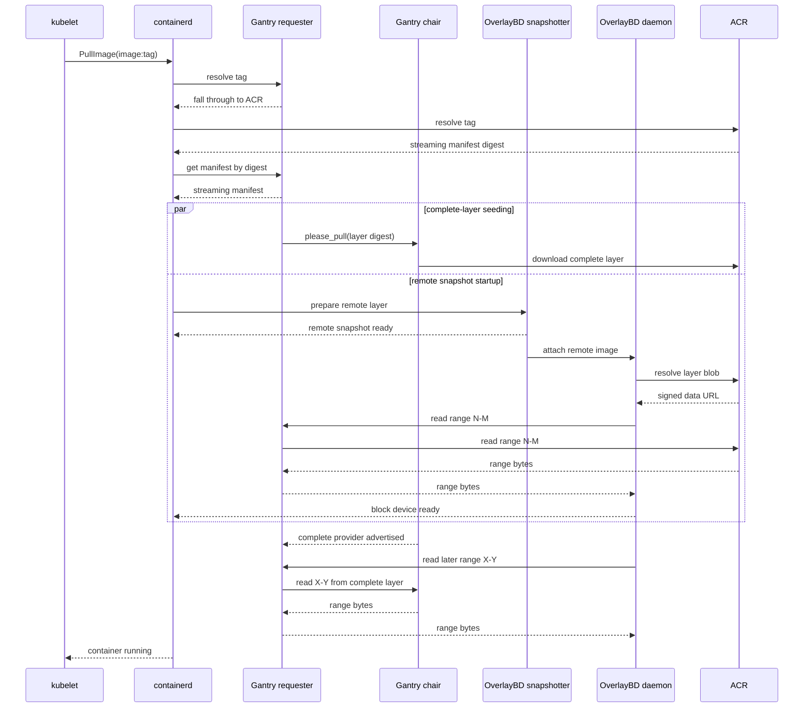

# Gantry with ACR Artifact Streaming

**Status:** Draft for discussion

## Summary

ACR Artifact Streaming and Gantry solve different parts of container startup.

ACR Artifact Streaming lets a container start without downloading every image
layer in full. OverlayBD mounts the image as a remote block device and reads
only the byte ranges required by the container.

Gantry reduces repeated registry traffic across the cluster. After seeing an
image manifest, Gantry asks a bounded set of chairs to download the complete
layers. Those layers become verified peer seeds for every other node.

This design combines both behaviors:

```text
first Pod:   read required ranges immediately
background:  Gantry downloads and distributes complete layers
later Pods:  read ranges from Gantry peers instead of ACR
```

The complete background downloads are intentional. They are the value Gantry
adds to Artifact Streaming: fast first startup followed by cluster-wide
convergence on complete local content.

## The problem

Artifact Streaming improves startup latency, but by itself each node can keep
reading image data from ACR. During a large rollout, many nodes may request the
same ranges or eventually consume most of the same layers.

Gantry already prevents this duplication for normal OCI pulls. It coordinates
a small number of complete origin downloads and distributes the resulting
objects between peers. However, OverlayBD does not request complete OCI objects
while a container is running. It requests byte ranges from a signed ACR data
URL.

Gantry therefore needs to support two related data paths:

1. its existing complete-object path for proactive layer seeding; and
2. a new range path used by OverlayBD while complete layers are unavailable or
   while only a subset of their bytes is needed.

## Goals

- Preserve Artifact Streaming's ability to start the first Pod without waiting
  for complete image layers.
- Preserve Gantry's proactive, bounded complete-layer pulls.
- Serve OverlayBD ranges from local or peer content as soon as a complete layer
  is available anywhere in the cluster.
- Keep signed ACR URLs on the node that received them.
- Require no Pod specification changes.
- Continue using containerd as the source of truth for complete content.
- Continue using Gantry's digest-keyed DHT for complete provider discovery.


## Two paths run at the same time

The easiest way to understand the design is to separate the complete-layer path
from the range-read path.

### Complete-layer path

Gantry observes the resolved streaming manifest and extracts its child layer
digests. It assigns complete pulls for those digests to a bounded chair cohort.

Each chair:

1. downloads its assigned complete layer from ACR;
2. commits the layer to its local containerd content store;
3. verifies the layer's OCI digest; and
4. advertises itself as a provider for that digest.

This is the same Gantry behavior used for ordinary OCI layers. It runs in the
background and does not block remote snapshot creation.

### Range-read path

OverlayBD reads only the byte ranges required to mount and use the image. It
sends each range to a node-local Gantry endpoint.

Gantry serves the range from the best source currently available:

1. the complete layer in the local containerd store;
2. a complete layer held by a Gantry peer; or
3. the signed ACR data URL supplied by OverlayBD.

The source can change between requests. An early request may use ACR while a
chair is still downloading the layer. A later request for the same layer can use
the completed peer copy.

## Cold Pull walkthrough

Assume a Pod using `acr.azurecr.io/team/app:latest` is scheduled to a node that
has none of the image locally. ACR Artifact Streaming is enabled and containerd
uses the OverlayBD snapshotter.

### 1. Kubelet requests the image

Kubelet calls containerd's CRI `PullImage` operation with the tagged image.
Containerd selects the OverlayBD snapshotter for the workload.

No large layer has been downloaded yet.

### 2. ACR resolves the tag to the streaming image

Containerd first asks Gantry to resolve the tag:

```text
HEAD /v2/team/app/manifests/latest?ns=acr.azurecr.io
```

Gantry deliberately does not cache or resolve mutable tags. It returns `503`,
which makes containerd continue to ACR. ACR resolves the tag to the generated
streaming manifest and returns its immutable digest.

### 3. Containerd fetches the streaming manifest through Gantry

Containerd now fetches the immutable manifest:

```text
GET /v2/team/app/manifests/sha256:<manifest>
```

Because this request is digest-addressed, Gantry handles it through its normal
local, peer, chair, and origin logic. The manifest contains the image config and
the streaming layer descriptors.

### 4. Gantry starts complete-layer pulls

After serving the manifest, Gantry parses its children. For each missing layer,
Gantry selects chairs and sends a layer-specific `please_pull` request. This is an existing gantry optimization.

The selected chairs begin downloading complete layers immediately. Different
layers can be assigned to different chairs, spreading origin and disk work
across the seed cohort.

This work is asynchronous. Containerd does not wait for the complete downloads.

### 5. Containerd creates remote snapshots

Containerd passes the image reference, layer digest, layer size, and OverlayBD
annotations to the snapshotter. The snapshotter creates backing-store metadata
similar to:

```json
{
  "repoBlobUrl": "https://acr.azurecr.io/v2/team/app/blobs",
  "lowers": [
    {
      "digest": "sha256:<streaming-layer>",
      "size": 123456789
    }
  ]
}
```

The snapshotter commits a remote snapshot. Under containerd's remote snapshot
protocol, this tells containerd that it does not need to download and unpack the
complete layer before continuing.

At this point the manifest and config are local, while the large layer data may
still be remote.

### 6. OverlayBD resolves the layer data URL

When containerd creates the container root filesystem, the snapshotter asks the
OverlayBD daemon to attach the remote image.

OverlayBD opens:

```text
https://acr.azurecr.io/v2/team/app/blobs/sha256:<streaming-layer>
```

OverlayBD authenticates to ACR. ACR can redirect the blob request to a signed
ACR data or Azure Blob Storage URL. That signed URL grants temporary access to
the layer data.

### 7. OverlayBD asks Gantry for a range

OverlayBD needs small reads to load layer indexes and later to satisfy
filesystem I/O. With P2P acceleration enabled, it sends the resolved URL and the
exact range to Gantry:

```http
GET /blobs/<signed-data-url>
Range: bytes=N-M
```

The signed URL contains enough information for Gantry to identify the streaming
layer digest.

Gantry then chooses a source:

- **Local complete layer:** read `N-M` from the local containerd store.
- **Complete peer layer:** ask the peer for `N-M` by digest.
- **No complete provider yet:** fetch `N-M` from the signed URL.

The first range never needs to wait for a complete chair pull. Gantry can use
the signed origin URL while complete seeding continues.

### 8. The container starts

After OverlayBD has loaded enough index and filesystem metadata, it exposes the
block device, the root filesystem mounts, and containerd starts the process.

The application can continue producing range reads while the chairs download
complete layers in the background.

### 9. Gantry takes over later reads

When a chair finishes a layer, containerd verifies and commits it. Gantry then
advertises that chair as a provider for the layer digest.

Subsequent range requests can use the peer's complete copy:

```text
OverlayBD on node A
  -> Gantry on node A
  -> Gantry chair holding the complete layer
  -> exact requested bytes
```

ACR is no longer involved in those reads.

## End-to-end sequence



The diagram shows the coldest case, where the first range reaches ACR before a
chair finishes. If a chair finishes first, Gantry can serve the first range from
that peer instead.

## Warm and scale-out behavior

When the same image is scheduled on more nodes, its complete layers are likely
already advertised by Gantry providers.

Containerd still creates OverlayBD remote snapshots, so startup remains lazy.
However, the OverlayBD range requests now resolve to cluster peers rather than
ACR. New nodes receive only the ranges they need, while complete peer copies are
available if they later consume more of the image.

The result is:

- first-node startup remains range-based;
- origin downloads remain bounded by the chair cohort;
- scale-out traffic moves to the cluster network; and
- the cluster converges on complete, verified layers without making every node
  download each layer from ACR.

## Content and trust boundaries

Complete layers and partial ranges have different trust properties.

### Complete layers

Complete layers are stored in containerd and verified against their OCI digest
before Gantry advertises them. Existing digest-keyed DHT records mean "this peer
can open and serve the complete verified object."

### Signed origin ranges

The signed URL is a temporary origin capability obtained by OverlayBD. Gantry
uses it only on the local node when no complete provider can serve the range.

Gantry must not:

- log the complete URL or SAS query;
- put it in metrics;
- advertise it in the DHT; or
- send it to a peer.

Peer range requests contain only the layer digest and requested byte range.

Partial origin ranges do not become normal Gantry provider records. If Gantry
later adds a transient range cache, it remains separate from containerd's
complete-object store and from complete-object DHT advertisements.

## Failure behavior

### A chair is still downloading

The range request uses the signed origin URL. It does not wait indefinitely for
the chair. Later requests can use the peer after the complete layer is committed
and advertised.

### A provider is stale or unavailable

Gantry tries another complete provider. If no provider succeeds, it uses the
signed origin URL for that range.

### ACR is unavailable

Existing complete local and peer layers remain usable. A range with no complete
provider cannot be satisfied until ACR recovers or another provider appears.

### Gantry restarts

An active OverlayBD device depends on its node-local Gantry endpoint while P2P
configuration is enabled. This integration does not change OverlayBD to add a
second fail-open path. Production rollout therefore keeps the Gantry DaemonSet
available, uses its readiness and drain behavior for controlled replacement,
and drains active streaming workloads before disabling the OverlayBD P2P
configuration or removing the Gantry endpoint.

## Deployment model

Gantry exposes the OverlayBD endpoint on its existing node-local listener:

```text
http://localhost:5000/blobs
```

OverlayBD is configured with:

```json
{
  "p2pConfig": {
    "enable": true,
    "address": "http://localhost:5000/blobs"
  }
}
```

The node must also:

- run the OverlayBD daemon and snapshotter;
- register the snapshotter socket with containerd;
- select OverlayBD for Artifact Streaming workloads; and
- enable containerd's remote snapshot annotations.

AKS Artifact Streaming node pools already provide most of this stack. For
nodes without that AKS-provided stack, provisioning and managing OverlayBD is
out of scope for this integration.

No containerd or OverlayBD snapshotter algorithm change is currently expected.
The existing remote snapshot contracts provide the required image reference,
digest, size, backing-store configuration, and mount behavior.


