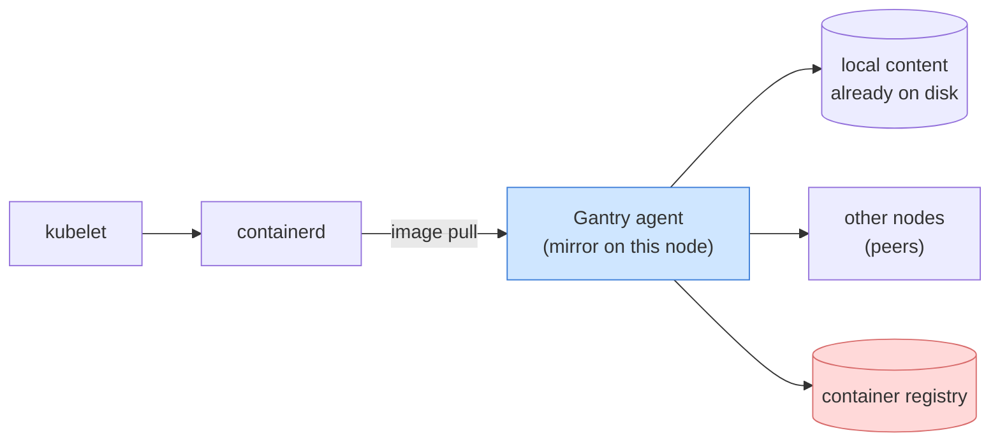
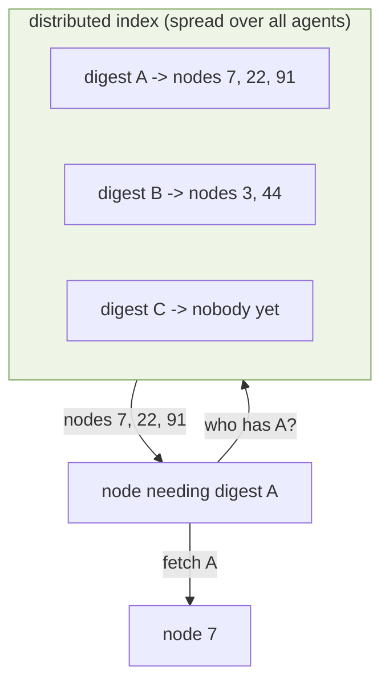
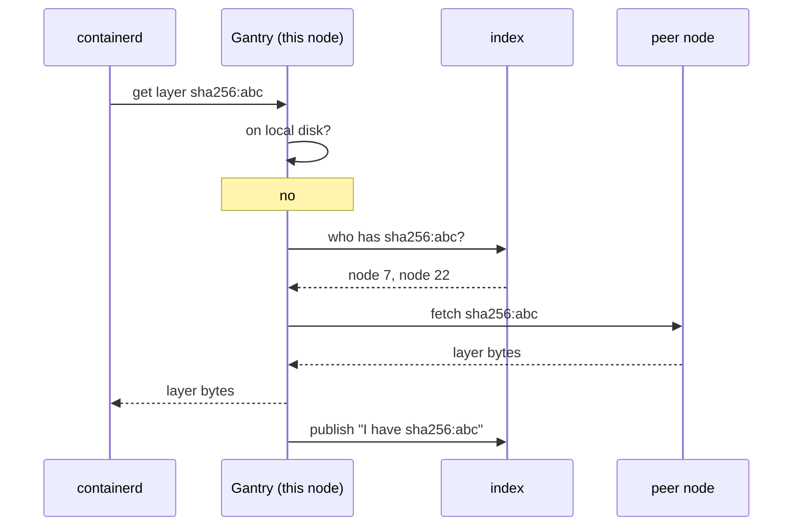
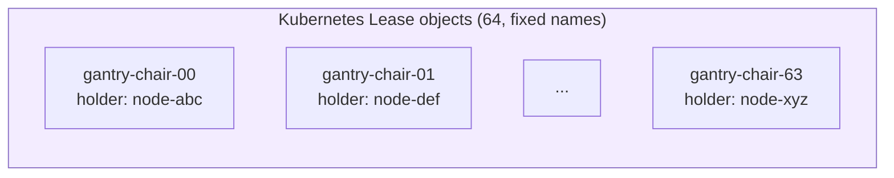
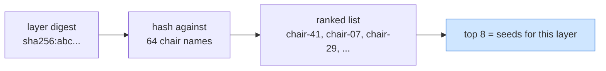
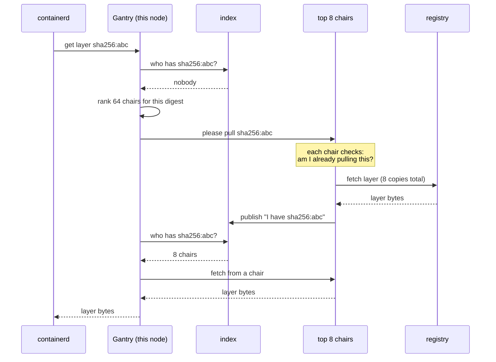
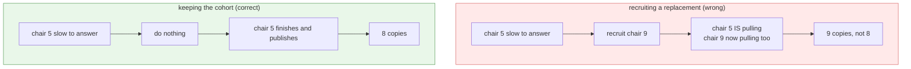
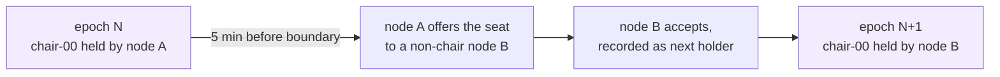
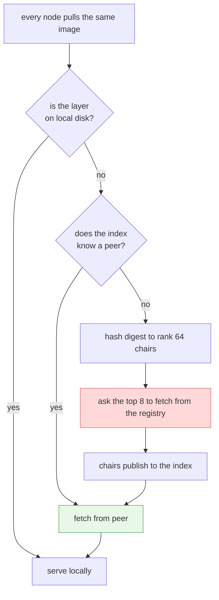

# How Gantry Handles a Cold Image Pull

For readers who know Kubernetes but not the Gantry codebase. This describes what
happens when a large image is pulled by every node at once, and why the registry
sees a small fraction of the traffic you would expect.

## The problem

A DaemonSet or Job that lands on every node makes every kubelet pull the same
image at the same time. Nothing in Kubernetes deduplicates that. Each node
contacts the registry independently.

At the size we test:

| | |
|---|---|
| Nodes | 1,000 |
| Image | 40 GiB, 40 layers |
| Registry traffic if every node pulls | **42 TB** |

That is expensive, slow, and often rate-limited. The registry is doing 1,000
copies of identical work.

The goal is to make registry traffic scale with the **image**, not with the
**cluster**.

## Where Gantry sits

Gantry runs as a DaemonSet. On each node it registers itself as a **registry
mirror** for containerd. Nothing about the workload changes: pods reference
normal image names, and kubelet pulls them normally.

containerd asks Gantry instead of the registry. Gantry then answers from
whichever source is cheapest: local disk first, a peer second, and the registry
only as a last resort.

The interesting question is how a node *finds* a peer that already has the
layer.

## Finding a peer: the index

Every agent publishes the layers it holds into a **distributed index**, keyed by
the layer's content digest. Any node can ask that index "who has this digest?"

The index is spread across all the agents. There is no index server, and no
node holds the whole thing. This matters at 100,000 nodes, where a central
lookup service would be the bottleneck.

## The warm case

Once any node holds a layer, everyone else can get it from a peer. This is the
normal path and it accounts for essentially all of the bytes moved.

The last step matters: every node that receives a layer immediately becomes a
source for it. Availability grows as the pull spreads.

## The cold case

On the very first pull of a brand-new image, the index is empty. Nobody has the
layer, so there is no peer to fetch from. Someone has to go to the registry.

The obvious answers are both wrong:

- **Let every node go to the registry.** That is the 42 TB problem.
- **Let one node go, everyone waits.** One node fetching 40 GiB is a bottleneck
  and a single point of failure.

Gantry picks a small, fixed number of nodes to fetch each layer from the
registry. Those nodes are called **chairs**.

### What a chair is

There are 64 chairs, each represented by a Kubernetes **Lease** object with a
fixed name (`gantry-chair-00` through `gantry-chair-63`). Agents claim empty
Leases to become chair holders, and renew them as a heartbeat, exactly like any
other leader-election use of the Lease API.

A chair is not a coordinator and does not decide anything for anyone else. It is
simply a node that has agreed to be one of the designated registry fetchers.

Being a chair is a small extra duty: 64 of 1,000 nodes, and it never grows with
cluster size.

### Choosing which chairs seed which layer

For any given layer, all nodes need to agree on which chairs should fetch it,
**without talking to each other**. Gantry does this with a hash of the layer
digest against the 64 chair names, producing a ranking.

Because the input is just the digest and the chair names, every node computes
the **same** ranking independently. No election, no coordination, no chatter.

A different layer hashes to a different ranking, so the 40 layers of an image
spread their seeding work across the chairs rather than piling onto the same
eight nodes.

### The cold pull, end to end

Note that the requesting node does not wait on the chairs' replies to make
progress. It waits on the **index**: once any chair finishes and publishes, the
normal peer path takes over and the layer spreads outward from the seeds.

Meanwhile the other 999 nodes are doing the same thing. They all compute the
same top 8, so they all ask the same chairs, and each chair recognizes the
duplicate requests and pulls once.

### Why exactly 8

Eight is a deliberate trade between registry cost and resilience.

| Seeds | Registry traffic | Risk |
|---|---|---|
| 1 | 40 GiB | one slow or dead node stalls the cluster |
| **8** | **343.6 GB** | tolerates several slow or dead seeds |
| 1,000 | 42 TB | no sharing at all |

Eight copies of a 40 GiB image is 343.6 GB, and that number does not change if
the cluster grows to 100,000 nodes. Only the peer-to-peer traffic grows, and
that is traffic the registry never sees.

## Failure handling

The interesting design decision is what happens when a chair does not answer.

The intuitive response is to recruit a replacement chair. **That is wrong**, and
getting it wrong was worth a 60% increase in registry traffic.

A chair that has not answered within the timeout has usually already *started*
fetching. It is busy, not absent. Recruiting a replacement does not move the
work, it **adds** a ninth fetcher:

So Gantry contacts the top eight once and accepts partial answers. It only moves
further down the ranking when the entire cohort of eight answers nothing at all,
which means they are genuinely unreachable rather than merely busy.

Measured on 1,000 nodes, this single distinction is the difference between 13.4
and 8.0 registry copies per layer.

If a node truly cannot get a layer from any peer or chair, it falls back to
pulling from the registry directly. That path exists for correctness but should
be rare; in the current measurements it does not fire at all.

## Chair rotation

Chairs are not permanent. Being a seed is extra network and disk work, so the
role moves.

The epoch is derived from the clock (a 6-hour quantum), so every node knows
which epoch it is in without asking anyone. The handover is arranged five
minutes ahead, so the seat is never vacant, and the successor is always a node
that is not already a chair. Work in flight on the old holder finishes normally.

If a holder dies, its Lease expires like any other Kubernetes Lease and the
chair becomes claimable. Replacement is demand-driven: a dead chair that nobody
needs is simply left alone until someone needs it.

## What this looks like in practice

Measured across three runs of 1,000 nodes pulling a cold 40 GiB image
simultaneously:

| | |
|---|---|
| Registry traffic | **343.6 / 343.6 / 352.2 GB** |
| Copies of each layer fetched from the registry | **8.0 / 8.0 / 8.2** |
| Peer-to-peer traffic | 42.6 TB |
| Bytes containerd received from the registry directly | **0** |

The design floor is 8 copies, or 343.6 GB. Two runs sat exactly on it and the
third was a few extra seed fetches above.

In the most recent run, 99.3% of the bytes containerd received came from peers
and 0.7% from local disk. None of it bypassed Gantry to reach the registry.

## Summary

The registry path is the narrow red box, entered once per layer by eight nodes.
Everything else is the green box, and that is where the terabytes go.
