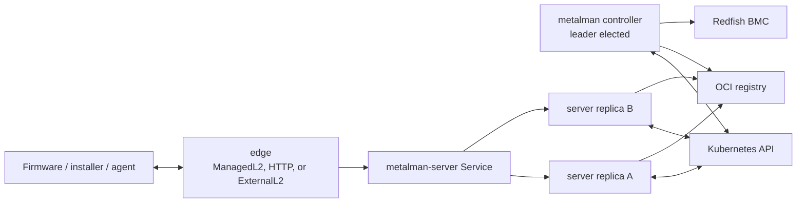
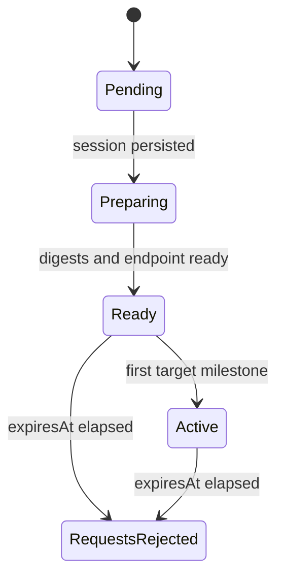
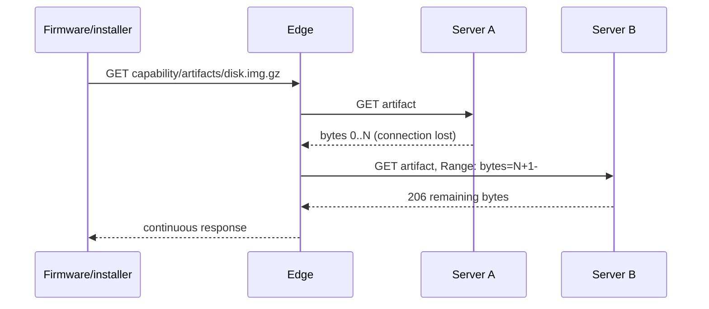

# Metalman Netboot Architecture

## Status

Implemented for the `v1alpha3` API. This is a breaking alpha redesign; the new
boot axes and endpoint reference are the supported contract.

## Goals

- Keep the normal Metalman control and serving planes off host networking.
- Keep active provisioning valid across controller failover, server pod loss,
  and rolling updates.
- Support traditional DHCP/TFTP PXE on a local L2 and UEFI HTTP boot through
  routed, NAT, NodePort, load-balancer, and internet paths.
- Configure HTTP boot through either DHCP or Redfish, with DHCP or static
  firmware networking.
- Let an administrator bootstrap the first Site node without running Kubernetes
  controllers on the administrator machine.
- Use the existing unbounded-net dataplane for optional routed access from an
  external bootstrap host without pretending WireGuard provides L2.
- Remove source-address identity and correlate every artifact, callback, and
  attestation request with one operation target.

## Non-goals

- Extending DHCP broadcasts through WireGuard.
- Hiding loss of a ManagedL2 address with ordinary pod replication. The L2
  address must be stable through node placement, a VIP, or an external edge.
- Preserving the old alpha `bootProtocol`, Site replica, or DHCP auto-interface
  API fields.
- Providing a multi-machine temporary bootstrap handoff. The command owns one
  designated first Machine and exits when that Node is Ready.
- Requiring shared writable storage for OCI caches.

## Runtime Roles



### Controller

The singleton per-Site controller owns leader-elected reconciliation, Redfish
certificate pinning and power/boot operations, OCI resolution, and immutable
session creation. It has no DHCP, TFTP, artifact, callback, or attestation
listener and does not use host networking.

### Server

Two server replicas sit behind a ClusterIP Service. They materialize disposable
digest-addressed OCI caches and serve authenticated session artifacts,
callbacks, DHCP decisions, and TPM attestation. A PodDisruptionBudget,
zero-unavailable rollout, health probes, and topology spread preserve service
availability. A lost local cache is reconstructed from the immutable digest.

### Edge

The edge has no controller RBAC. It proxies HTTP and, when attached to a
provisioning LAN, owns DHCP and TFTP. Its authenticated internal DHCP decision
calls use a projected `metalman-edge` ServiceAccount token. Firmware-facing
paths carry the session capability and do not rely on client IP.

## Endpoint Model

`NetbootEndpoint` is cluster-scoped and declares a stable external URL, Site,
trust boundary, TLS policy, placement, and readiness.

| Type | Ownership | Networking | Typical use |
|------|-----------|------------|-------------|
| `ManagedL2` | Operator Deployment | Host network | Rack-local DHCP, TFTP, and private HTTP |
| `HTTP` | Operator Deployment and Service | Pod network | UEFI HTTP through ClusterIP, NodePort, load balancer, or ingress |
| `ExternalL2` | External process | Host network outside cluster | First-node bootstrap or dedicated appliance |

Only `ManagedL2` uses host networking in the normal operator deployment. Public
endpoints require an `https://` URL and TLS mode `Secret` or `External`. Secret
mode mirrors the selected certificate into the operator namespace and rolls
the edge when its checksum changes.

An endpoint is usable only when status observes the current generation and has
`Ready=True`. External edges claim and renew status themselves.

## Machine Boot Axes

`Machine.spec.host.netboot` separates concepts previously conflated as one boot
protocol:

- `transport`: `TFTP` or `HTTP`.
- `configurationSource`: `DHCP` or `Redfish` supplies the firmware boot target.
- `networkMode`: `DHCP` or `Static` configures firmware networking.
- `endpointRef`: required stable NetbootEndpoint identity.

Supported combinations are:

| Transport | Configuration source | Network mode | Behavior |
|-----------|----------------------|--------------|----------|
| TFTP | DHCP | DHCP | DHCP supplies lease and tokenized TFTP path. |
| HTTP | DHCP | DHCP | DHCP supplies lease and signed HTTP boot URL. |
| HTTP | Redfish | DHCP | Redfish writes the signed URL; firmware obtains networking through DHCP. |
| HTTP | Redfish | Static | Redfish writes both the signed URL and static NIC configuration. |

TFTP+Redfish, static networking without Redfish, and Redfish configuration
without BMC details are rejected by validation.

## Immutable Sessions

One `NetbootSession` is created per HostReplace operation target. Its spec is
immutable and records:

- Exact Machine, MachineOperation, and endpoint names, UIDs, and generations.
- Endpoint external URL, boot axes, architecture, leases, and target disk.
- Machine and netboot OCI references resolved to SHA-256 digests.
- The complete artifact allowlist and firmware artifact.
- Cluster API, CA, DNS, Kubernetes version, agent settings, provider labels,
  and resolved cloud-init user-data.
- Expiration.

The operation target stores the session name and UID before any Redfish side
effect. Reconciliation returns after persisting this reference, then proceeds
only when the same session is Ready or Active. A replaced endpoint, Machine, or
session UID fails closed.



Milestones are conditions on both the exact session and exact
`MachineOperation.status.targets[]` entry. Operation-wide conditions are not
used for target progress, preventing multi-target cross-talk and stale callback
completion.

## Capabilities and Trust

The controller and servers share a per-Site HMAC-SHA256 key. A capability binds
the session name, UID, expiration, and key ID. The bearer token is never stored
in Kubernetes status. Canonical routes are rooted at:

```text
/v1/netboot/sessions/<session>/<capability>/
```

Allowlisted artifacts, installer callbacks, cloud-init reporting, logs, and TPM
attestation all use this identity. Server validation checks the current session
UID and expiration before resolving any file or Machine. Internal edge decision
routes additionally use TokenReview with audience `metalman-edge`.

Trusted-LAN endpoints may use HTTP. Public endpoints require HTTPS because URL
capabilities are bearer credentials. Redfish and TPM identities retain their
existing trust-on-first-use pinning.

## Artifact Availability

Session artifacts resolve by OCI digest and architecture, not by mutable tag.
Static files use HTTP range semantics. The edge preserves client Range requests;
if a backend response truncates, it reconnects and requests exactly the missing
range from any healthy server replica. TFTP uses the same immutable backend and
resuming reader before reporting `BootLoaderDownloaded`.

No RWX volume is required. Pod-local cache loss may increase latency but cannot
change the selected bits. Server readiness and retry behavior must distinguish a
cold cache from an invalid session.



## Provisioning Flows

### Traditional PXE

DHCP identity is the NIC MAC. The server selects one unexpired Ready/Active
session for the endpoint and MAC, returning conflict on ambiguity. DHCP returns
a tokenized TFTP path. TFTP and all subsequent HTTP requests use the capability,
not source IP. A remote DHCP server requires a relay on the client LAN.

### UEFI HTTP

DHCP may supply the signed URL directly, or the controller may configure it
through Redfish. Redfish static NIC writes occur only for `networkMode: Static`.
HTTP boot can traverse routed and NAT paths because identity is in the URL.

### First-node Bootstrap

```mermaid
sequenceDiagram
    participant CLI as kubectl unbounded
    participant K as Kubernetes API
    participant PF as Reconnecting port-forward
    participant E as Local edge
    participant H as First host

    CLI->>K: enable Metalman; wait controller/server
    CLI->>K: create ExternalL2 endpoint; update designated Machine
    CLI->>PF: forward loopback port to a Ready server pod
    CLI->>E: start edge with projected edge token
    CLI->>K: claim endpoint Ready
    H->>E: DHCP/TFTP/HTTP provisioning
    H->>K: kubelet creates designated Node
    CLI->>K: observe designated Node Ready
    CLI->>E: stop
    CLI->>K: restore Machine endpoint; delete ephemeral resources
```

`kubectl unbounded site bootstrap-netboot` never runs Metalman controllers
locally. It reconnects its local-to-pod SPDY forward across server replacement
and stops automatically only for the Node selected by the requested Machine.

With `--routed-cidr`, the command also starts the reusable unbounded-net node
agent as a temporary external gateway. It creates a synthetic unschedulable,
tainted Node, an External WireGuard GatewayPool, and a Site assignment. The
agent runs without kubelet, CNI, or status-transport assumptions and cleans host
networking on shutdown. WireGuard provides only L3 reachability for BMC and
downstream CIDRs; DHCP remains on the local L2.

## Failure Semantics

| Failure | Expected behavior |
|---------|-------------------|
| Controller leader loss | Durable operation/session references allow the new leader to resume before issuing another side effect. |
| Server pod deletion | Edge reconnects; range-capable transfers resume against another replica. |
| Mutable OCI tag changes | Existing sessions continue using their pinned digest. |
| Machine edit during provision | Existing session rendering and boot configuration remain unchanged. |
| Stale callback | Capability/session UID mismatch rejects it; sibling targets are untouched. |
| Endpoint replacement | UID mismatch blocks the session rather than using a new endpoint under the same name. |
| ManagedL2 pod/node loss | New sessions wait for endpoint readiness; active firmware connections may fail unless the L2 address itself is redundant. |
| Bootstrap CLI or edge exits | Ephemeral endpoint, Machine endpoint override, gateway resources, token files, port-forward, and child processes are cleaned. |

## Deployment and RBAC

- Controller and server have separate ServiceAccounts and least-role-specific
  Kubernetes permissions.
- The edge ServiceAccount has no controller permissions; its internal requests
  are authenticated by TokenReview.
- Controller and server mount the capability key. Only TLS-terminating edges
  mount serving certificates.
- Controller/server use ordinary pod networking. ManagedL2 alone may use the
  host network and required node placement.
- Synthetic external gateway Nodes are marked unschedulable, tainted, and
  labeled so the normal unbounded-net DaemonSet excludes them.

## Alternatives Rejected

### Replicate the old monolith

Nonleaders served from independent caches while only the leader reconciled
images, and every replica advertised a different node-local URL. Replication did
not provide a stable endpoint or coherent state.

### Keep Metalman on every Site host network

This preserves direct DHCP but creates a first-node scheduling dependency,
couples controllers to privileged ports, and makes ordinary rollouts disrupt
the advertised endpoint.

### Shared RWX artifact cache

Shared storage can reduce cold-cache latency but does not solve mutable request
identity, stale callbacks, or active connection loss. Digest snapshots and range
resume provide correctness without requiring a storage class.

### Identify clients by source IP

NAT, proxies, address reuse, and multiple interfaces make source addresses
ambiguous and forgeable. Session capabilities provide explicit operation-target
identity across every routed topology.

### Run controllers in the kubectl process

Local controller state would compete with the in-cluster deployment and require
broad persistent credentials. The bootstrap CLI instead runs only an edge and
uses a reconnecting tunnel to the in-cluster server.

### Carry DHCP over WireGuard

The existing dataplane is routed L3, not an Ethernet extension. A local edge or
DHCP relay is simpler and preserves the routing model.

## Verification

- API schema tests cover endpoint/session scope, immutability, and valid axes.
- MachineOperation tests prove session persistence before Redfish side effects,
  immutable inputs, and target-scoped milestones.
- Server and edge tests cover capability validation, digest selection, Range
  requests, truncated-backend resume, DHCP decisions, and tokenized TFTP.
- Operator tests cover split roles, no host networking on controller/server,
  Services, PDBs, TLS rotation, endpoint workload types, and RBAC separation.
- CLI tests cover preflight-before-mutation, rollout waits, token rotation,
  port-forward reconnection, exact-node handoff, early child exit, rollback, and
  optional external gateway cleanup.
- Smoke suites exercise traditional PXE and Redfish HTTP boot through split
  roles; the traditional suite deletes a server pod during provisioning.
