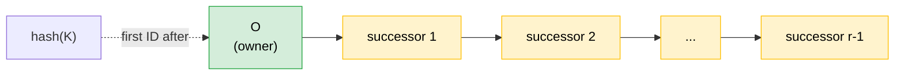
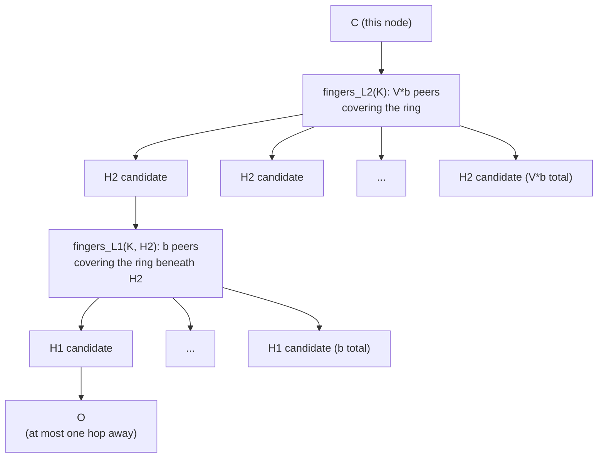
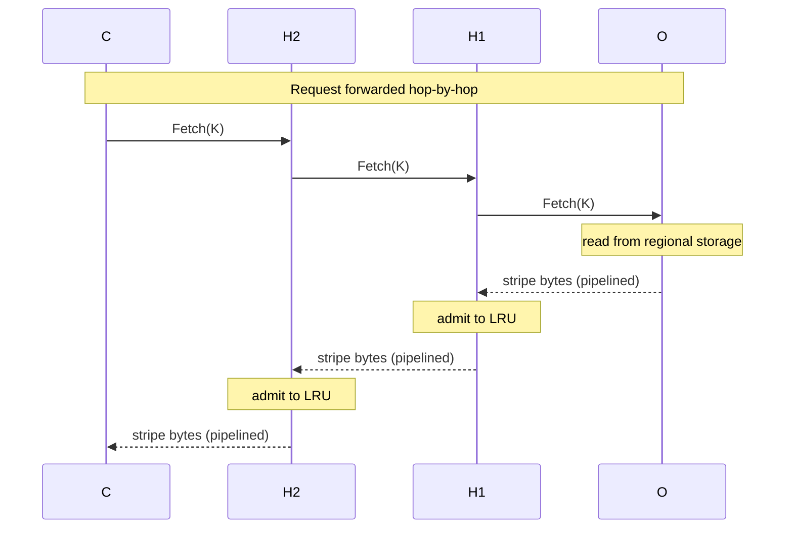
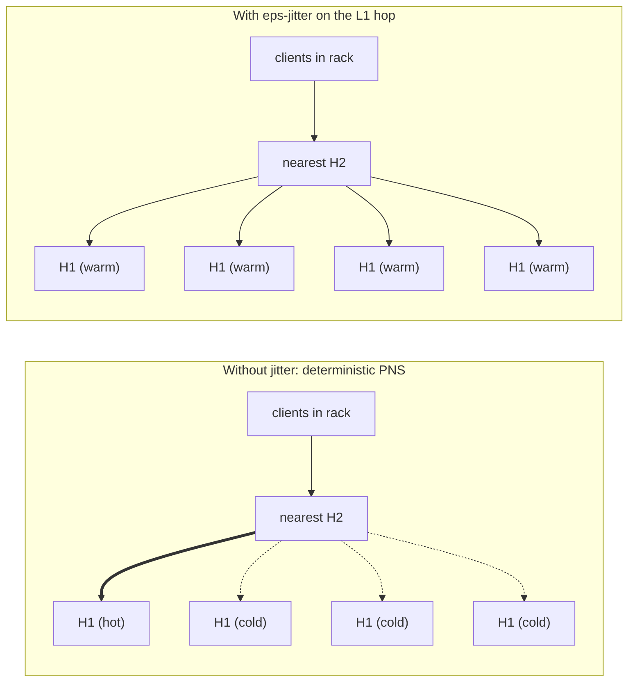
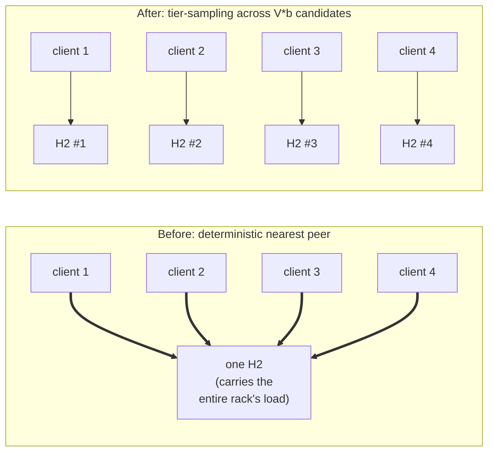

# P2P Storage Cache Protocol

## Background

A large cluster (think 100k nodes) needs to share content with itself:
container image stripes, build artifacts, model weights. We want any
node to fetch any object from any other node, with no central server.

The goal is low latency and high aggregate throughput during a
fleet-wide rollout - we want to saturate every node's local links,
while keeping oversubscribed inter-rack uplinks lightly loaded.

- Stripes are content-addressed and immutable: a key is the hash of its bytes
- Ground truth for every object is **regional storage** external to the cluster
- Objects are split into fixed **1 GiB stripes** and the protocol operates on one stripe at a time
- The data path is **RDMA**, so a full mesh across all cluster nodes is not feasible

## Protocol

Node `C` wants stripe `K`. Nobody in the cluster has it yet.

**Step 1: Find the stripe's owner.**

Every node has the cluster membership list - the set of cache pods
running across the fleet, learned from the Kubernetes API. Every node
hashes `K` to a position on a ring of node IDs and reads off the owner:
the node whose ID comes immediately after that position. Call it `O`.
There is no lookup, no directory, no coordinator; every node computes
the same answer locally.

For redundancy/availability, the next `r-1` successors of `O` on the ring are also
valid first-ask targets (default `r = 8`).



**Step 2: Pick a path toward the owner.**

`C` does *not* talk to `O` directly. `O` could be anywhere - possibly
across an oversubscribed spine link - and we want to keep traffic local
whenever we can.

Instead, `C` keeps two small **finger tables**, each sized to roughly
the cube root of the cluster (a few thousand entries at 100k nodes):

- a **level-2** set of peers chosen to evenly cover the ring, and
- a **level-1** set under each level-2 peer, again covering the ring
  beneath it.

Together they let `C` reach any node in at most three hops. Entries
are refreshed in the background by re-sampling the ring whenever
membership changes; a dead finger is replaced by the next live ID in
its slot.



Each peer carries a topology label (`rack/row/...`) read from its
Kubernetes Node, so "nearest" is a local lookup. `C`
picks its nearest level-2 peer (same rack, then same row, then
anywhere); call it `H2`. `H2` picks its nearest level-1 peer, `H1`.
`H1` is one hop from `O`.

We now have a 3-hop path `C -> H2 -> H1 -> O`, where each hop preferred
a short link.

**Step 3: Download the bytes.**

The request is **forwarded**: it travels
`C -> H2 -> H1 -> O`, and the bytes stream back along the same path
`O -> H1 -> H2 -> C`. The relay is pipelined, so each extra hop adds
chunk-fill latency, not stripe-transfer time. As bytes pass through,
`H1` and `H2` admit a copy into their LRU cache.

Forwarding (rather than referring `C` straight to `O`) is what warms
the path's caches on every pull.



## Cache Fanout

A rollout is in progress. Thousands of nodes want stripe `K`.

**A neighbor of `C` asks next.** Some node in the same rack as `C`
picks the same nearest `H2` (because nearest-by-topology gives the same
answer to neighbors). `H2` is already warm from `C`'s pull and serves
the bytes in one intra-rack hop. `O` never hears about this request.

**A node far from `C` asks.** It picks its own nearest `H2'`, which is
cold. But `H2'`'s nearest `H1'` was warmed by some earlier pull from
yet another part of the cluster, so the bytes come back in two hops -
both short - and again `O` is untouched.

**The pattern.** Every cold pull warms two more nodes. After a handful
of pulls, copies of `K` exist in many topological pockets of the
cluster. Once warm everywhere, almost every read is one hop, almost
always intra-rack, and the owner is idle. The cache fans out to about
`V*b + b^2` nodes per stripe (we'll define `V` and `b` shortly). A
file split into `S` stripes therefore lives on roughly `S * (V*b + b^2)`
serving slots - plenty for a fleet-wide fanout.

This is a pull-through CDN, except it falls out of the routing rules.
No broadcast. No tracker. No admin pre-positioning the hot files. A
key gets popular and the system grows more serving slots for it.

**What gets cached.** Every stripe that passes through is admitted to
a single per-node LRU pool with a fixed byte budget (default 10% of
node disk). Nothing is pinned: owner, successor, and finger-table
status do not protect a stripe from eviction. Hot stripes stay
resident by being touched; truly cold keys evict and the next request
falls through to regional storage. The `S * (V*b + b^2)` estimate
assumes the hot working set fits the budget, which is an operator
sizing concern, not a protocol one.

## Breaking the Symmetry

Watching the hot pull closely reveals two problems. Both have the same
root cause: "pick the topologically nearest peer" is *deterministic*.
Every client in the same rack makes the same choice.

**Problem 1: the cache fans out too narrowly.** If every client in a
neighborhood picks the same `H1`, only that one `H1` ever warms. The
other level-1 candidates stay cold forever. The realized cache ceiling
collapses from `b^2` copies per stripe to a small fraction of it, and
hot reads end up bottlenecked on too few sources.

*Fix: eps-jitter on the level-1 hop.* A small fraction of pulls skip
the nearest peer and pick a random level-1 candidate instead. Set the
jitter rate to `eps_k = 1/b` (about 4% at 16k nodes, where `b ~ 25`).
Over any window of `b` pulls this puts one jitter pull per L1 slot in
expectation, so each slot is warmed with probability
`1 - (1 - 1/b)^b`, which approaches `1 - 1/e ~ 0.63` as `b` grows.
The warm-up phase uses slightly less local links; once warm, almost
every read is one local hop again, but now every level-1 slot is
populated.



**Problem 2: the serving load concentrates.** Even after the cache is
fully warm, every client in a rack reads from the same nearest `H2`,
so one node carries the entire rack's read load on its NIC. Eps-jitter
doesn't help here - it operates on `H1`, not on the `H2` that actually
serves the warm read.

*Fix, part A: nearest-tier sampling.* Instead of locking onto the
single nearest peer, each client samples uniformly from all peers at
the *smallest* tier it can reach (all same-rack peers, or if none, all
same-row peers). Locality is preserved exactly - the chosen peer is
still at the smallest reachable tier - but ties break stochastically.
Clients in the same rack now spread across whatever same-rack
candidates exist.

*Fix, part B: virtualize the level-2 slot.* In a large cluster a rack
often only contains one same-tier `H2` candidate, leaving nearest-tier
sampling nothing to spread across. So we give each key `V * b` level-2
candidates instead of `b` (default `V = 2`). More candidates per rack,
more cells where there is actually a choice to spread across, and the
cache fan-out at the level-2 layer doubles for free. Cost: `V * b`
cached copies at the level-2 layer per key, small compared to the
`b^2` ceiling at the level-1 layer.



The model exposes per-node serve counts (`serve_skew_p99`,
`serve_skew_max`) specifically to keep us honest about this. With both
fixes applied at 16k nodes, the worst-loaded node carries about 9x
less than under naive deterministic PNS.

## Recap

Re-reading the walkthrough with the failure modes in mind, each
mechanism does specific work:

- **A ring for ownership.** Any node can compute who owns a key with
  no lookup, and churn only affects the keys near the changed node.
- **Two small finger tables.** Any node reaches any other in a fixed
  three hops, with predictable latency, while tracking only a few
  thousand peers.
- **Pick the nearest peer at every hop.** The bottleneck on real
  fabrics is the oversubscribed inter-rack uplink, not the server NIC.
  We sidestep it whenever a finger set offers a local option.
- **Cache anything that passes through.** Popularity becomes serving
  capacity automatically, with no central decision about which files
  to pre-position.
- **Jitter, tier-sampling, and `V`.** Three small, local fixes for
  the failure modes determinism creates. Each is a knob the model can
  turn and measure.

## Tradeoffs

- **More membership state in exchange for bounded hops.** Classic
  Chord/Kademlia uses much smaller fingers and pays log-N hops. We
  pay more membership state per node (a few thousand entries at 100k
  nodes) to cap every pull at three hops. Since the throughput goal
  is to keep bytes on local links, fewer hops directly means less
  oversubscribed-uplink traffic per byte delivered, so the
  state-for-hops trade is a throughput win.
- **Adequate steady-state throughput.** A BitTorrent-style
  swarm or a tree multicast would converge a bit faster on a single
  huge fanout, but both need a tracker. We use the routing fabric
  we already have, pay a brief warm-up, and then ride the same rules
  for both routing and caching.
- **No special path for hot files.** No "broadcast" mode, no separate
  tier-1 cache, no toggle. The same rules apply cold or hot. The
  cost of that uniformity is that small workloads pay the three-hop
  tax where a flat hash table would do one hop.
- **No write/churn modeling.** The design assumes membership changes
  are rare relative to reads (true for image and artifact
  distribution, less true for a general-purpose KV store).

In exchange, failure modes are gentle: a dead owner routes to a
successor replica, a dead finger peer routes to the next-nearest one,
and there is no quorum, no leader, and no global state to reconcile.
Repeated demand under partial failure spreads the cache *more*, not
less, because every pull warms the path it took.

## Pseudo Code

```
# State held by every node.
ring         : sorted list of live node IDs (from K8s membership)
topology(n)  : (rack, row, ...) label for node n, from K8s Node
fingers_L2(K): V*b node IDs covering the ring, sampled per key K
fingers_L1(K, H2): b node IDs under H2 covering the ring beneath it
lru          : per-node byte-budgeted LRU of stripes (no pinning)
self         : this node's ID

# --- Client ---------------------------------------------------------

procedure Fetch(K):
    # Step 1: ring lookup, with r successors as alternates.
    owners = successors(ring, hash(K), count=r)

    # Step 2: choose a 3-hop path with locality at every hop.
    H2 = PickNearestTier(fingers_L2(K))           # uniform within
                                                  # smallest reachable tier
    L1 = fingers_L1(K, H2)
    if random() < eps_k:
        H1 = uniform_choice(L1)                   # eps-jitter: spread
    else:                                          # the level-1 cache
        H1 = PickNearestTier(L1)

    path = [H2, H1, owners]                       # owners is the tail;
                                                  # try in order on failure

    # Step 3: forward the request; bytes stream back along the same path.
    return SendForward(next_hop=H2, key=K, remaining=[H1, owners])

procedure PickNearestTier(peers):
    # Group peers by topological distance from self; sample uniformly
    # from the smallest non-empty group. Preserves locality, breaks ties
    # stochastically so a rack's clients spread their load.
    for tier in [same_rack, same_row, ..., any]:
        candidates = [p for p in peers if tier(self, p)]
        if candidates: return uniform_choice(candidates)

# --- Server (runs on H2, H1, and O alike) ---------------------------

procedure Serve(key K, remaining):
    # Cache-first: anything we already have, we serve directly.
    if K in lru:
        lru.touch(K)
        return stream_from(lru, K)

    if remaining is empty:
        # We are the owner (or a successor standing in). Ground truth
        # lives in regional storage.
        bytes_in = fetch_from_regional(K)
    else:
        # Recurse one hop closer. The next hop runs the same Serve.
        next, rest = remaining[0], remaining[1:]
        bytes_in = SendForward(next_hop=next, key=K, remaining=rest)
        # On next-hop failure, fall through to remaining[1], then to
        # the successor list; same-shape recursion, omitted here.

    # Pipelined relay: admit to LRU as bytes pass through, in parallel
    # with forwarding them to the caller. This is what warms the path.
    return tee(bytes_in, into=lru.admit(K), out=caller)

procedure SendForward(next_hop, key, remaining):
    open RDMA stream to next_hop
    send Request{key, remaining}
    return stream of bytes from next_hop      # consumed lazily by Serve/Fetch
```

