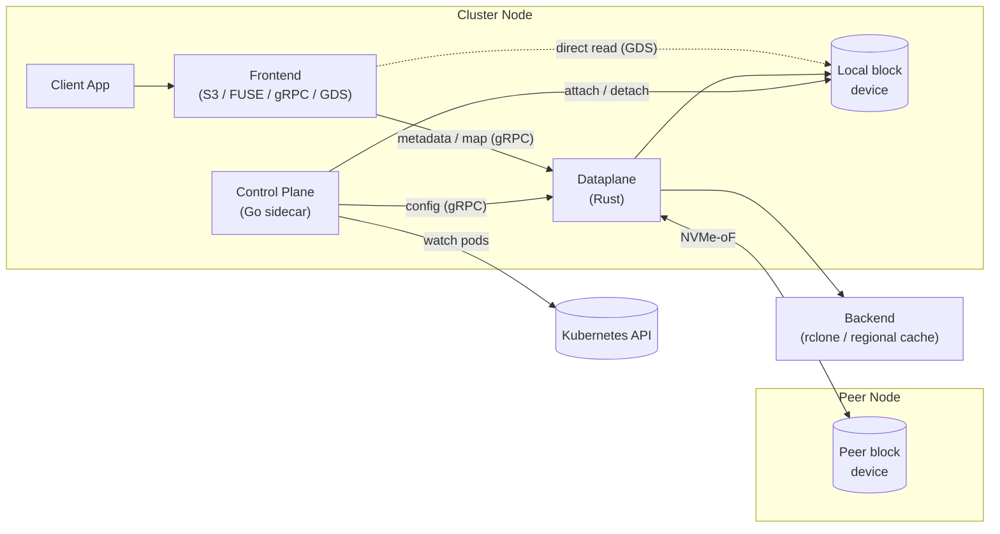
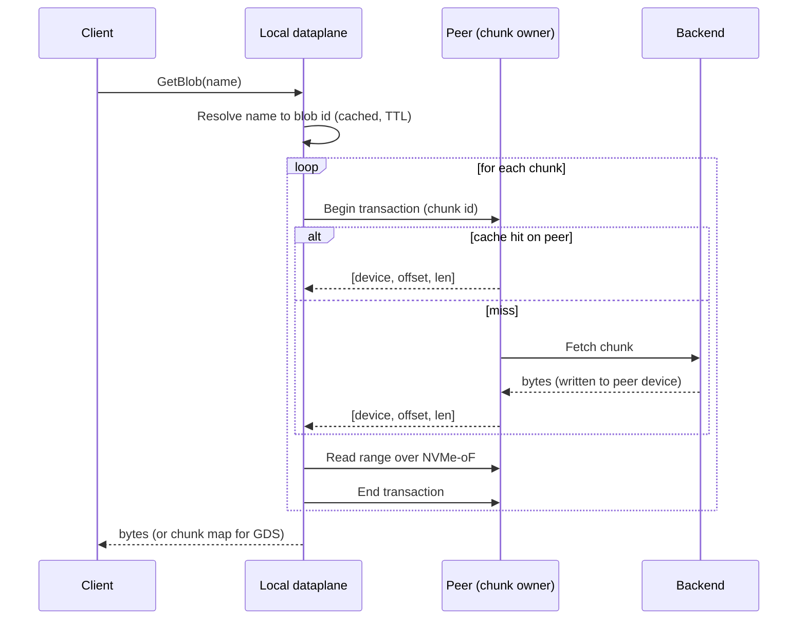
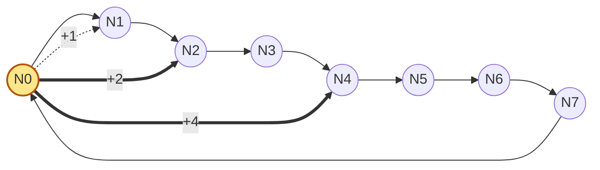
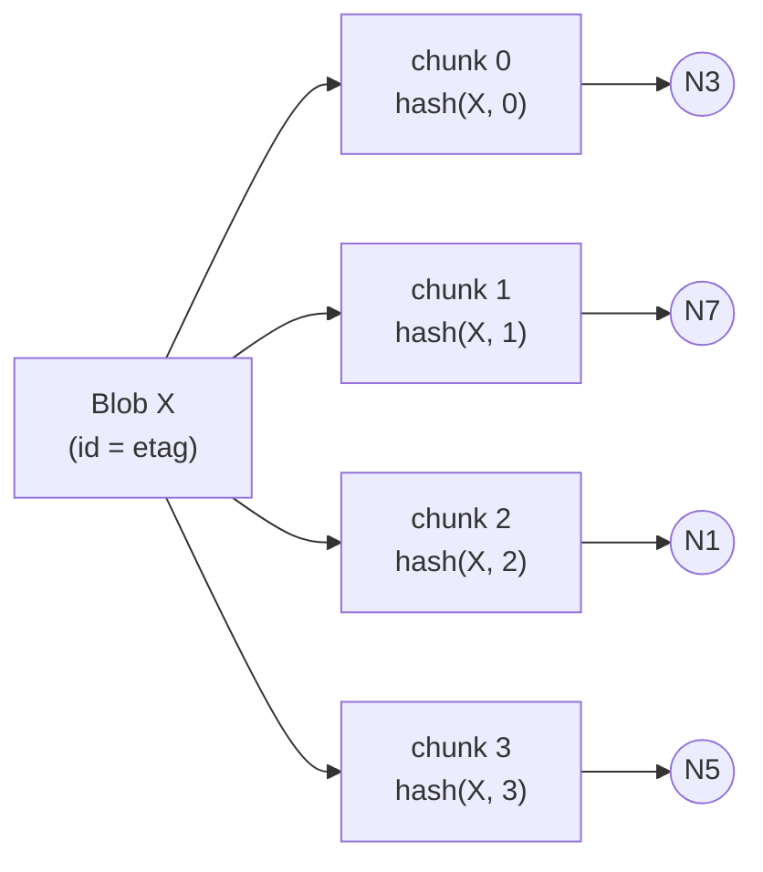

# unbounded-storage-p2p

> TODO: Better name?

This doc exists to align on some basic architectural patterns.

## Goals

Optimize for high-frequency reads of large values, like model weights or container images.

- Throughput: saturate 400Gb NICs
- Scale: >10k node clusters
- Efficient: small CPU/memory footprint, hardware acceleration when supported
- Flexible: run anywhere, pull data from a generic endpoint (a regional cache in most cases)
- GPUDirect: support copying directly into GPU memory

## TL;DR

- Rust dataplane: IO over block devices (typically NVMe-oF)
- Go controlplane: build a hash ring over the cluster topology, manage block device attachments
- gRPC API for blob metadata: `frontend` (s3/fuse/etc.) implementations read directly from block devices for perf
- A generic `backend` API for pulling values from regional cache or remote storage (implementation of that endpoint is out of scope)

## Dataplane Architecture

### Block

The foundation of the service is simple block devices.
Each node must have at least one writable block device that __can also be read by a fixed subset of other cluster nodes__.
In most cases other nodes will attach the device using NVMe-oF, but operating at the block level means we're decoupled from the transport.

- Bare metal can use NVMe-oF RDMA with full hardware offload on ConnectX/BlueField NICs (with NVIDIA SNAP providing host-side NVMe device emulation where needed)
- Cloud instances can use shared block devices from the provider (e.g. Azure shared disks)
- It's always possible to fall back to the Linux NVMe-oF stack over RDMA or TCP

### Pull-through

The goal of the dataplane is simple: shuffle cache values onto a block device attached to the requesting node.
Those values might originate from a neighboring cluster node, the regional cache, or remote storage.
Missing values are downloaded from a separate `backend` service: initially just a thin wrapper around rclone, later a regional cache layer.

### Frontend

The dataplane can implement various frontends (S3, Azure Blob) but will also expose a lower-level gRPC API.
Clients can use this API to request a cache value "map" that references ranges on local block devices.
This is critical for very high-performance clients like GPUDirect Storage, which can bypass the dataplane completely.

> NOTE: we'll need to implement a custom `cuFile` for GDS support, similar to Lustre, VAST, etc.

### Metadata

Blob names need to be resolved to a "blob identifier": their length, and an immutable id (etag).
Metadata should be cached according to a configurable TTL.
These values can then be hashed by the client to discover the stripe placements (more on that later).

Metadata will use gRPC to avoid building an RPC layer on top of block devices.
The requests are tiny, so performance won't be an issue.
Clients can access it through a UDS to avoid the overhead of TCP/mTLS.
State will be stored alongside cache values on the block devices.

### Transaction

Before peers can safely read from shared block devices, they need to essentially take locks on regions.
This roundtrip can be used to resolve a given chunk identifier to its location, i.e. `[device,offset,len]`.

Nodes track the transaction state of their peers and will not evict blocks while they are "visible" to peers.
This uses a strict fencing method: transactions must eventually be terminated explicitly, or the peer must be removed from the cluster.

### Topology

We need to maintain a performant P2P mesh without requiring a full mesh.
Nodes should be able to reach any value in a bounded number of hops while only maintaining connections to some subset of the cluster.

This reduces overhead on large clusters, and is required in cases where the number of nodes
in the cluster exceeds the number of RDMA connections that can be maintained by a single NIC.

The solution is simple: connect each node to `log₂(n)` "neighbors".
Adjacencies use a power-of-two distribution around a hash ring (each node `i` connects to nodes at offsets `2⁰, 2¹, 2², ...` along the ring), the same routing structure used by Chord.
This guarantees `O(log₂(n))` hops worst-case from any node to any value hashed onto the ring.

For example, a 10k node cluster needs ~14 connections per node and will reach any value in ~14 hops worst-case (~7 hops expected).

Thin arrows are the ring's successor chain; thick arrows are `N0`'s fingers at offsets `2⁰, 2¹, 2²` (3 fingers for `n=8`, since `log₂(8) = 3`). Every other node maintains an analogous fan-out from its own position.

#### Fan Out

Since values are always read by copying them to a disk controlled by the node,
read throughput for a given value will naturally increase as more nodes read it.

#### Availability

The ring hashing topology means that each cache key is owned by a single node.
This is the only node that is allowed to download the blob from remote storage.
Naturally, the value won't be available if the owner is unable to accept requests.

We mitigate this by allowing clients to retry requests with the target's successor (the next node on the hash ring), which is the natural next owner of those keys under consistent hashing.
The successor won't have the value cached and will have to fetch it like the original owner would; successor-retry preserves liveness, not latency.
Routing from the successor takes up to `log₂(n)` additional hops, so the worst-case path length stays `O(log(n))` (the constant roughly doubles).

#### Locality

Neighbor selection is topology-aware: for a given finger, the dataplane can pick any peer within the arc spanning the node and the key, preferring nodes that are physically closer, share faster interconnects, etc.
This preserves the `O(log₂(n))` hop guarantee per ["Proximity Neighbor Selection"](https://people.eecs.berkeley.edu/~sylvia/cs268-2019/papers/dht-geometries.pdf).

#### Per-node Topology

Nodes with more than one PCIe complex will hash each complex onto the ring, and pin their NIC/SSD IO accordingly.
On GB200-class hardware this is critical since bandwidth between complexes is limited.

### Striping

Cache values will often be large enough that downloading them from a single neighbor would create hotspots.
In order to support high read concurrency, we need to stripe values into "chunks".
The size of each chunk should be configurable, but a sane default would be 1GB.
Stripes should be hashed onto the topology ring using the value's identifier plus an offset computed to purposefully distribute stripes across the ring.

Smaller chunks increase the cost of coordination (metadata); larger chunks cause hotspots.

Each chunk lands on a different ring position, so a client reading the whole blob pulls from multiple owners in parallel rather than hammering one neighbor.

### Eviction

The dataplane will always make room for new values needed by the client.
To do this, it can evict less frequently accessed chunks at any time, as long as they aren't currently visible to any read transactions.
Use [SIEVE](https://cachemon.github.io/SIEVE-website/).

If every chunk on a controlled device is pinned by an active transaction, eviction cannot proceed.
In this case the dataplane returns a retryable "out of capacity" error to the client rather than blocking indefinitely.
Combined with transaction leases (see Transaction), this bounds the time a misbehaving peer can starve a node: pinned chunks become evictable as soon as their owning transaction's lease expires.

### Integrity

Modern bare metal NVMe-oF implementations provide hardware-accelerated end-to-end CRC (CRC32C on the fabric, T10 PI on the drive), which gives us read-time integrity at line rate for free.
When hardware offload isn't available, we fall back to a background loop in the dataplane that periodically checks values against their expected checksum.
Software verification on the read path isn't practical at our target throughputs.

## Control Plane Architecture

The dataplane will run as a DaemonSet, with the control plane as a sidecar.
It will watch various k8s resources to determine the expected state,
serve the config to the dataplane over gRPC, and interact with the host
to manage block device attachments.

The dataplane should be completely decoupled from both Kubernetes and the underlying block transports.

### Membership

Cluster membership is sourced from Kubernetes: the control plane watches the dataplane's DaemonSet pods and derives the node set from `Ready` pods. This list is pushed to the dataplane over the same config gRPC stream.

Kubernetes is the source of truth for "is this node in the cluster"; the dataplane is the source of truth for "is this peer currently reachable". A peer that is `Ready` in k8s but unreachable on the data path is treated as transiently failed (clients fall through to the successor as described in Availability) without removing it from the topology.

### Topology Computation

Topology is a pure function of the membership list: given the same sorted set of node IDs, every node computes the same ring positions and the same `log₂(n)` neighbor set. There is no coordinator and no consensus required.

On membership change, each node independently recomputes its neighbor set and opens/closes connections accordingly. Chunks whose ownership moves to a different node are not migrated; they are simply re-fetched on demand by the new owner and eventually evicted from the old one.

