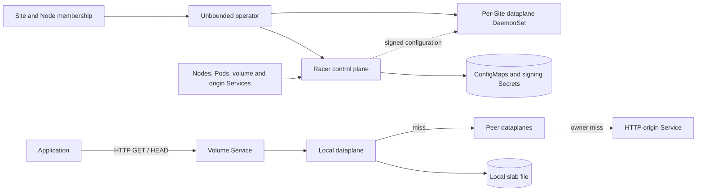

# Racer - High-level architecture

**Status:** Architecture of the HTTP-cache implementation.
**Scope:** Racer at revision `cc0a20cd2f38518dab6e3f4d07518d86cbbe4281`
on `feat/racer-operator-integration`. Source links below are pinned to the
reviewed revision of the HTTP-cache implementation.

## 1. Overview

Racer is a Site-scoped, distributed HTTP read cache. Applications read objects
through a local cache endpoint; misses converge through peer caches toward a
deterministically selected owner, which fetches from an HTTP origin. The origin
remains the source of truth. Racer stores reusable object metadata and immutable,
versioned payload pages on each node.

The architecture separates three responsibilities:

- **Kubernetes integration** installs workloads and translates Site membership
  and volume Services into cache topology.
- **The control plane** durably records topology and coordinates signed
  configuration changes across participating processes.
- **The dataplane** serves reads, routes misses, coalesces compatible in-flight
  fetches, and manages local storage and transport resources.

The DaemonSet supplies the local and peer dataplanes shown in the read path.
The controller sets volume Services to local traffic policy, so clients need a
ready dataplane endpoint on their node. Peer traffic uses configured peer
addresses directly. See [controller.go:446][service-output] and
[topology.go:484][snapshots].

## 2. Components and concepts

| Component | Responsibility |
| --- | --- |
| `internal/operator/components/racer` | Shared control-plane installation, per-Site DaemonSets, bootstrap, key projections, and host cache mounts. |
| `cmd/racer-controlplane` | Kubernetes reconciliation, slot placement, listener allocation, durable generations, and authenticated configuration delivery. |
| `cmd/racer-dataplane` | Linux Rust daemon implementing the HTTP cache, peer routing, io_uring execution, persistent storage, and optional RDMA. |
| `api/racer/control.proto` | Shared configuration and coordinated-control wire schema, with Go and Rust bindings. |
| `pkg/racer` | Go client for version-pinned parallel reads and an origin handler backed by an application-provided store. |
| `cmd/racer-loadgen` | Test load generator and origin fixture. |

A **universe** is the routing and configuration domain derived from a Site.
The canonical Node Site label takes precedence over the deprecated label, and
an explicit exclusion label removes a Node from active membership. Node identity
incorporates the Kubernetes Node UID, so replacing a Pod preserves node identity
while deleting and recreating the Node changes it. See
[internal/racer/site.go:19][site-identity].

A **volume** is an HTTP dataset endpoint described by an annotated Kubernetes
Service. It identifies an origin Service, cache generation, fixed slot count,
and listener port. Multiple volumes share a dataplane process while retaining
separate cache namespaces and routing configurations. Origins are resolved to
numeric ClusterIP addresses; their logical identity is independent of that
address. See [model.go:51][volume-model] and [control.proto:7][schema].

A **slot** is a logical routing position assigned to a physical node. A node can
own many slots. Slot ownership determines where a cold miss converges; it does
not imply that the owner is the only node allowed to cache the resulting data.
Relays and ingress nodes can satisfy later reads from their own cache. See
[topology.go:107][placement] and [cache.rs:1454][cache-lookup].

## 3. Object model and read path

### Metadata before payload

Racer first resolves a target into its length, checksum/version, and expiration.
The target is the exact escaped HTTP path and query: path cleaning, query
reordering, and decoding would change object identity. Representations require
a strong quoted ETag containing 64 lowercase hexadecimal checksum characters.
The origin supplies that whole-object checksum; ranged reads pin the version
rather than recomputing the entire object hash. See
[cache.rs:373][object-keys] and [pkg/racer/client.go:121][sdk-client].

Metadata freshness follows the origin's cache policy: `s-maxage` takes precedence
over `max-age`, and `Age` reduces the remaining lifetime. Disabled caching or
missing freshness gives a request-scoped resolution rather than reusable
metadata. Payload pages are keyed by object identity, checksum, object length,
and aligned offset. A metadata refresh can therefore select a new version without
mixing its pages with the previous version. See [cache.rs:313][object-keys].

### A read through the cache

1. The application sends `HEAD` or `GET` to a volume endpoint. The dataplane
   resolves metadata before evaluating conditions and byte ranges.
2. A valid local metadata record avoids upstream work. Otherwise, the metadata
   miss follows the volume's peer route; the selected owner resolves it with an
   origin `HEAD`.
3. `HEAD` finishes without fetching payload. For `GET`, the handler divides the
   requested interval into aligned 4 MiB pages, clipping the last page at EOF.
4. Each page is looked up locally. A hit supplies a file lease; a miss joins a
   compatible in-flight fetch or becomes its producer and contacts the next peer.
5. An owner without the page issues an origin range `GET` with `If-Match` for the
   resolved version. Response framing, length, range, and version must agree
   before the page can be accepted.
6. The page travels back through the route and becomes available to consumers
   and local cache admission. Ordinary file-backed HTTP hits use io_uring splice
   through a pipe to the socket, allowing Linux's page cache to supply hot data.

Sources: [handlers.rs:125][response], [handlers.rs:785][upstream],
[cache.rs:1454][cache-lookup], and [http_server.rs:1270][file-send].

The Go SDK makes this model explicit: a download performs a separate `HEAD`, then
bounded parallel page requests carrying the returned ETag. `Open` pins a
representation for random access. A version change fails the operation; it does
not silently restart with new metadata. The origin helper separates `Stat` from
`Open(target, etag)`, allowing metadata-only requests and requiring the store to
return a stable snapshot for payload reads. See
[pkg/racer/client.go:121][sdk-client] and [pkg/racer/origin.go:25][sdk-origin].

## 4. Peer topology and cold-miss convergence

Racer uses a deterministic directed slot graph rather than broadcasting a miss.
For `P` slots, the graph has degree `d = ceil(cuberoot(P))`; the outgoing neighbors
of slot `u` are `(d*u + digit) mod P` for `digit` in `[0, d)`. Canonical,
destination-rooted routing reaches a destination in at most three logical hops.
Requests that reach the same logical position toward the same destination share
the same remaining route. See [topology.rs:51][route-math].

The primary owner slot is selected by hashing the raw request target. Metadata
and pages for that target converge toward the same owner. Alternative candidates
are successive slots, bounded by the configured attempt count and slot count.
The controller balances slot ownership across participating nodes, retaining
previous assignments where possible and favoring distinct owners for adjacent
slots. Each recipient receives its local slots, outgoing edges, and direct peer
endpoints, including incoming-only neighbors. It does not receive a full
cluster membership table. See [control.rs:1877][routing],
[topology.go:107][placement], and [topology.go:410][snapshots].

The three-hop bound is a property of the logical graph, not a bound on a physical
node's neighbor count. Nodes owning many slots can have many direct peers.
Forwarding skips co-located positions on the canonical route to avoid waiting
on itself. In-flight coalescing includes the routing identity, destination, and
canonical logical dependency, not just the object/page key. This prevents
unrelated routes on one physical node from forming cyclic waits. See
[control.rs:1940][routing] and [handlers.rs:843][upstream].

### Failure handling

Transport recovery and owner replacement are distinct decisions:

- A failed RDMA payload exchange can retry HTTP to the same peer within the
  existing request budget.
- Advancing to another owner requires attributable owner-failure evidence.
  Intermediate relays report that failure upstream; the ingress advances the
  candidate. An arbitrary error or local capacity rejection does not grant every
  relay permission to fetch directly from origin.
- Only the selected route endpoint may initiate an origin fetch. Attempts,
  deadlines, circuit breakers, and admission limits bound upstream work.

See [handlers.rs:768][upstream]. This produces convergence and bounded retries,
not a cluster-wide exactly-once origin-fetch guarantee.

## 5. Local execution and storage

### Worker and memory ownership

The dataplane assigns I/O workers and compute workers to disjoint physical cores
within NUMA nodes. Each I/O worker owns its io_uring driver, HTTP/runtime state,
and assigned slab shards. Compute workers handle checksum and cryptographic
work. Transient 4 MiB buffers and compatible network flights are shared within a
NUMA node, with explicit ownership across asynchronous operations. See
[workers.rs:88][workers] and [main.rs:220][startup].

The transient buffer pool is working memory, not a completed-payload memory
cache. Metadata is stored inline in the resident index; completed payloads are
represented by file leases and may be hot in the kernel page cache. A buffered
or RDMA consumer materializes file data into transient storage when needed.
Metadata resolution does not require a payload slot. See
[cache.rs:1478][cache-lookup] and [cache_persistence.rs:1150][file-hit-test].

Buffer admission reserves capacity for downstream progress along a route.
The daemon requires at least four buffers per NUMA node: three downstream
progress slots plus one receiving slot for a maximum-length route. A canceled
request cannot recycle memory while kernel or device I/O still owns it. These
bounds are part of forward progress and memory safety, rather than just tuning
knobs. See [main.rs:80][buffer-minimum], [handlers.rs:891][upstream], and
[buffers.rs:1][buffers].

### Persistent cache

Each node uses a slab file partitioned into independently owned shards. A shard
has a resident B-tree index, inline metadata, allocation bookkeeping, and payload
extents protected by CRC64. Eviction is bounded and approximate-frequency based;
live file leases and retained checkpoints can delay space reuse. See
[allocator.rs:1823][allocator].

Persistence uses alternating checkpoints: payload and index writes are ordered
and synchronized before publishing a recoverable root. Recovery selects a valid
checkpoint. A page can become readable before its checkpoint is durable, so a
successful read is not a durable-storage acknowledgment. Lost cache state is
refillable from peers or origin. See [allocator.rs:1577][recovery] and
[allocator.rs:2490][checkpoint].

Cache namespaces include universe, volume, cache generation, and logical origin
identity. They exclude topology epoch and origin network address, preserving
reuse across routing changes and endpoint movement. A dataset replacement can
use a new cache generation to select a fresh namespace. The slab's persisted
layout records size, shard count, and I/O-worker placement; incompatible
formats or execution placement are rejected instead of automatically reformatted. See
[cache.rs:263][namespace] and [allocator.rs:162][layout].

Runtime-resize update: independent signed per-Node storage policies now replace
size and shard layout through a fresh-inode cache flush. Execution placement,
workers, pools, and RDMA registrations stay fixed. The all-worker fence/install
transaction publishes by rename and directory sync, then retires old ownership
before another replacement. Restart opens the published layout rather than
reapplying creation environment. The current automatic envelope is 32MiB..4TiB;
Site/Node quantities normalize independently of topology. See the current
[runtime coordinator](../cmd/racer-dataplane/src/runtime/storage.rs),
[layout planner](../cmd/racer-dataplane/src/allocator/layout.rs), and
[storage policy controller](../cmd/racer-controlplane/storage_policy.go).

## 6. Control plane and reconfiguration

The control plane watches Nodes, selected dataplane Pods, and volume/origin
Services. It derives per-volume membership, places slots, reserves listeners,
and constructs full replacement snapshots for each recipient. A Running Pod
with an IP can receive configuration before becoming Ready, avoiding a circular
dependency between configuration and Service readiness. See
[model.go:205][membership] and [topology.go:448][snapshots].

Only the elected leader serves subscriptions. Durable topology lives in
immutable, hash-verified ConfigMap chunks referenced by a resource-version
compare-and-swap commit pointer. This keeps partially written generations from
becoming authoritative and preserves revisions, ownership, and port reservations
across controller restarts. See [main.go:275][leader] and [state.go:39][state].

Dataplanes subscribe to `/v2/<universe>/<node>`. Pod-bound service-account tokens
identify the selected Pod; a process boot nonce distinguishes incarnations.
Signed commands bind those identities to a revision and exact snapshot digest.
The normal rollout has four phases:

| Phase | Meaning |
| --- | --- |
| Prepare | Validate the candidate and prepare resources on participating workers. |
| Enable reception | Make the candidate addressable by peers while retaining the previous ingress configuration. |
| Activate ingress | After participants acknowledge receive readiness, direct new client requests into the candidate. |
| Retire | Drain and release the previous generation and complete its retirement. |

See [rollout.go:328][rollout] and [runtime.rs:893][activation].

This receive-before-send barrier lets new routes work while ingress switches
across nodes. Requests retain their generation, and peer requests select an exact
routing identity among active and draining generations. Draining is bounded.
The controller can abort before reception; after that boundary it uses forward
recovery and retirement. Controller restart requires fresh process
acknowledgments, and a control-channel timeout alone does not establish that a
participant has disappeared. See [runtime.rs:516][generations] and
[rollout.go:54][rollout-recovery].

## 7. Transports and trust boundaries

Client reads and origin fetches use HTTP. Peer metadata uses small HTTP exchanges;
peer payload can use HTTP or optional RDMA READ. RDMA sessions are negotiated
for configured direct peers, and the cache/routing model remains the same for
both transports. Runtime RDMA is disabled by default. See
[handlers.rs:785][upstream] and [main.rs:159][runtime-startup].

Peer HTTP requests and responses carry detached signatures bound to request
semantics and identities. Receivers check configured peer membership, timestamps,
and a process-wide replay ledger. These checks authenticate protocol exchanges;
plaintext HTTP and RDMA payloads are not encrypted by those signatures. Control
subscription tokens also travel over the configured HTTP transport. See
[http_auth.rs:377][peer-auth] and [rollout.go:328][rollout].

The managed deployment projects separate configuration-verification and
peer-signing bundles. Configuration authority and peer data exchange are separate
roles. The ordinary client-facing object API is also distinct from authenticated
peer RPCs; deployments must provide the network and client-access boundary
appropriate for their datasets. See [resources.go:180][deployment] and
[handlers.rs:125][response].

## 8. Deployment and architectural tradeoffs

Enabling Racer on a Site installs a shared control plane and a Site-specific
DaemonSet. The managed profile sets the locked-memory limit, starts the daemon, and mounts
`/var/lib/racer` for the slab. Linux io_uring, suitable physical-core placement,
NUMA allocation, locked memory, and the supported filesystem geometry are runtime
prerequisites. Management exposes startup, readiness, liveness, and metrics
endpoints separately from volume listeners. See [resources.go:180][deployment]
and the [dataplane README:68][runtime-guide].

The main tradeoffs follow from the read path:

- **Convergent routing over broadcast discovery:** cold reads may traverse relays,
  but requests for a target share deterministic downstream dependencies.
- **Version-pinned pages over whole-object buffering:** memory is bounded by
  active work, and large or random reads can reuse individual pages. Origins
  must implement the checksum-ETag and immutable-snapshot contract.
- **Kernel page cache over a second payload cache:** file-backed hits avoid
  occupying the transient receive pool, while RDMA still needs registered
  memory and explicit completion ownership.
- **Coordinated topology over independent updates:** durable rollout phases add
  control-plane state and barriers in exchange for safe receive-before-send
  transitions. Existing serving generations can survive a control partition;
  membership changes cannot simply treat silence as removal.
- **Persistent cache over disposable process state:** warm data can survive
  restart, at the cost of a fixed slab layout and recovery machinery. The origin
  remains responsible for authoritative data durability.

## 9. Verification and further reading

Representative tests exercise architectural invariants directly:

- [tests/control/topology.rs:91][topology-test] checks shortest paths, decreasing
  route rank, and the three-hop bound, including exhaustive small graphs.
- [tests/control/routing.rs:51][routing-test] checks co-located slots and which
  logical dependencies may share a network flight.
- [tests/storage/cache_persistence.rs:1614][flight-test] checks single-flight
  payload sharing, deadlines, and request-scoped zero-TTL metadata.
- [tests/runtime/activation.rs:1274][activation-test] checks that a candidate can
  receive peer traffic before it becomes active for ingress.

The [dataplane testing guide][testing-guide] describes deterministic simulation,
real-kernel ownership checks, and opt-in hardware/stress coverage. The
[control-plane README][control-guide] covers Service configuration and rollout
operations; the [SDK README][sdk-guide] covers client and origin contracts.
These operational references belong to the same pinned implementation revision.

[service-output]: https://github.com/Azure/unbounded/blob/cc0a20cd2f38518dab6e3f4d07518d86cbbe4281/cmd/racer-controlplane/controller.go#L446-L477
[snapshots]: https://github.com/Azure/unbounded/blob/cc0a20cd2f38518dab6e3f4d07518d86cbbe4281/cmd/racer-controlplane/topology.go#L410-L539
[site-identity]: https://github.com/Azure/unbounded/blob/cc0a20cd2f38518dab6e3f4d07518d86cbbe4281/internal/racer/site.go#L19-L89
[volume-model]: https://github.com/Azure/unbounded/blob/cc0a20cd2f38518dab6e3f4d07518d86cbbe4281/cmd/racer-controlplane/model.go#L51-L174
[schema]: https://github.com/Azure/unbounded/blob/cc0a20cd2f38518dab6e3f4d07518d86cbbe4281/api/racer/control.proto#L7-L96
[placement]: https://github.com/Azure/unbounded/blob/cc0a20cd2f38518dab6e3f4d07518d86cbbe4281/cmd/racer-controlplane/topology.go#L107-L294
[cache-lookup]: https://github.com/Azure/unbounded/blob/cc0a20cd2f38518dab6e3f4d07518d86cbbe4281/cmd/racer-dataplane/src/cache.rs#L1454-L2036
[object-keys]: https://github.com/Azure/unbounded/blob/cc0a20cd2f38518dab6e3f4d07518d86cbbe4281/cmd/racer-dataplane/src/cache.rs#L313-L443
[sdk-client]: https://github.com/Azure/unbounded/blob/cc0a20cd2f38518dab6e3f4d07518d86cbbe4281/pkg/racer/client.go#L121-L414
[response]: https://github.com/Azure/unbounded/blob/cc0a20cd2f38518dab6e3f4d07518d86cbbe4281/cmd/racer-dataplane/src/handlers.rs#L125-L231
[upstream]: https://github.com/Azure/unbounded/blob/cc0a20cd2f38518dab6e3f4d07518d86cbbe4281/cmd/racer-dataplane/src/handlers.rs#L768-L1128
[file-send]: https://github.com/Azure/unbounded/blob/cc0a20cd2f38518dab6e3f4d07518d86cbbe4281/cmd/racer-dataplane/src/http_server.rs#L1270-L1379
[sdk-origin]: https://github.com/Azure/unbounded/blob/cc0a20cd2f38518dab6e3f4d07518d86cbbe4281/pkg/racer/origin.go#L25-L145
[route-math]: https://github.com/Azure/unbounded/blob/cc0a20cd2f38518dab6e3f4d07518d86cbbe4281/cmd/racer-dataplane/src/topology.rs#L51-L204
[routing]: https://github.com/Azure/unbounded/blob/cc0a20cd2f38518dab6e3f4d07518d86cbbe4281/cmd/racer-dataplane/src/control.rs#L1877-L1992
[workers]: https://github.com/Azure/unbounded/blob/cc0a20cd2f38518dab6e3f4d07518d86cbbe4281/cmd/racer-dataplane/src/workers.rs#L88-L150
[startup]: https://github.com/Azure/unbounded/blob/cc0a20cd2f38518dab6e3f4d07518d86cbbe4281/cmd/racer-dataplane/src/main.rs#L220-L287
[file-hit-test]: https://github.com/Azure/unbounded/blob/cc0a20cd2f38518dab6e3f4d07518d86cbbe4281/cmd/racer-dataplane/tests/storage/cache_persistence.rs#L1150-L1203
[buffer-minimum]: https://github.com/Azure/unbounded/blob/cc0a20cd2f38518dab6e3f4d07518d86cbbe4281/cmd/racer-dataplane/src/main.rs#L80-L91
[buffers]: https://github.com/Azure/unbounded/blob/cc0a20cd2f38518dab6e3f4d07518d86cbbe4281/cmd/racer-dataplane/src/buffers.rs#L1-L33
[allocator]: https://github.com/Azure/unbounded/blob/cc0a20cd2f38518dab6e3f4d07518d86cbbe4281/cmd/racer-dataplane/src/allocator.rs#L1823-L2095
[recovery]: https://github.com/Azure/unbounded/blob/cc0a20cd2f38518dab6e3f4d07518d86cbbe4281/cmd/racer-dataplane/src/allocator.rs#L1577-L1666
[checkpoint]: https://github.com/Azure/unbounded/blob/cc0a20cd2f38518dab6e3f4d07518d86cbbe4281/cmd/racer-dataplane/src/allocator.rs#L2490-L2650
[namespace]: https://github.com/Azure/unbounded/blob/cc0a20cd2f38518dab6e3f4d07518d86cbbe4281/cmd/racer-dataplane/src/cache.rs#L263-L303
[layout]: https://github.com/Azure/unbounded/blob/cc0a20cd2f38518dab6e3f4d07518d86cbbe4281/cmd/racer-dataplane/src/allocator.rs#L162-L311
[membership]: https://github.com/Azure/unbounded/blob/cc0a20cd2f38518dab6e3f4d07518d86cbbe4281/cmd/racer-controlplane/model.go#L205-L371
[leader]: https://github.com/Azure/unbounded/blob/cc0a20cd2f38518dab6e3f4d07518d86cbbe4281/cmd/racer-controlplane/main.go#L275-L304
[state]: https://github.com/Azure/unbounded/blob/cc0a20cd2f38518dab6e3f4d07518d86cbbe4281/cmd/racer-controlplane/state.go#L39-L159
[rollout]: https://github.com/Azure/unbounded/blob/cc0a20cd2f38518dab6e3f4d07518d86cbbe4281/cmd/racer-controlplane/rollout.go#L328-L553
[activation]: https://github.com/Azure/unbounded/blob/cc0a20cd2f38518dab6e3f4d07518d86cbbe4281/cmd/racer-dataplane/src/runtime.rs#L893-L1055
[generations]: https://github.com/Azure/unbounded/blob/cc0a20cd2f38518dab6e3f4d07518d86cbbe4281/cmd/racer-dataplane/src/runtime.rs#L516-L713
[rollout-recovery]: https://github.com/Azure/unbounded/blob/cc0a20cd2f38518dab6e3f4d07518d86cbbe4281/cmd/racer-controlplane/rollout.go#L54-L322
[runtime-startup]: https://github.com/Azure/unbounded/blob/cc0a20cd2f38518dab6e3f4d07518d86cbbe4281/cmd/racer-dataplane/src/main.rs#L159-L218
[peer-auth]: https://github.com/Azure/unbounded/blob/cc0a20cd2f38518dab6e3f4d07518d86cbbe4281/cmd/racer-dataplane/src/http_auth.rs#L377-L510
[deployment]: https://github.com/Azure/unbounded/blob/cc0a20cd2f38518dab6e3f4d07518d86cbbe4281/internal/operator/components/racer/resources.go#L180-L247
[runtime-guide]: https://github.com/Azure/unbounded/blob/cc0a20cd2f38518dab6e3f4d07518d86cbbe4281/cmd/racer-dataplane/README.md#L68-L85
[topology-test]: https://github.com/Azure/unbounded/blob/cc0a20cd2f38518dab6e3f4d07518d86cbbe4281/cmd/racer-dataplane/tests/control/topology.rs#L91-L181
[routing-test]: https://github.com/Azure/unbounded/blob/cc0a20cd2f38518dab6e3f4d07518d86cbbe4281/cmd/racer-dataplane/tests/control/routing.rs#L51-L124
[flight-test]: https://github.com/Azure/unbounded/blob/cc0a20cd2f38518dab6e3f4d07518d86cbbe4281/cmd/racer-dataplane/tests/storage/cache_persistence.rs#L1614-L1677
[activation-test]: https://github.com/Azure/unbounded/blob/cc0a20cd2f38518dab6e3f4d07518d86cbbe4281/cmd/racer-dataplane/tests/runtime/activation.rs#L1274-L1316
[testing-guide]: https://github.com/Azure/unbounded/blob/cc0a20cd2f38518dab6e3f4d07518d86cbbe4281/cmd/racer-dataplane/TESTING.md
[control-guide]: https://github.com/Azure/unbounded/blob/cc0a20cd2f38518dab6e3f4d07518d86cbbe4281/cmd/racer-controlplane/README.md
[sdk-guide]: https://github.com/Azure/unbounded/blob/cc0a20cd2f38518dab6e3f4d07518d86cbbe4281/pkg/racer/README.md
