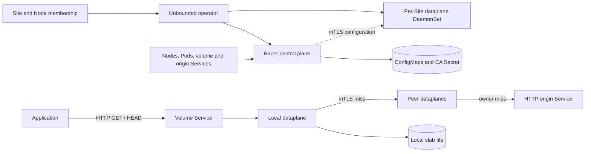

# Racer - High-level architecture

**Status:** Architecture of the HTTP-cache implementation with mTLS and CA rotation.
**Scope:** Cache/routing references retain the reviewed baseline at
`cc0a20cd2f38518dab6e3f4d07518d86cbbe4281`. Trust, transport, and deployment
references describe the mTLS implementation at
`10f7d259` on `feat/racer-mtls`. Runtime-resize references track the merged
implementation. The cutover requires matching binaries.

This is a historical, revision-pinned description. The P2PCache/Unix-socket
implementation supersedes its annotated-Service configuration and local TCP
read path. See `cmd/racer-controlplane/README.md` for the current API contract,
`docs/content/guides/racer.md` for deployment, and `designs/racer-uds-benchmark.md`
for measured local transport comparisons. Peer HTTP remains TCP.

## 1. Overview

Racer is a Site-scoped, distributed HTTP read cache. Applications read objects
through a local cache endpoint; misses converge through peer caches toward a
deterministically selected owner, which fetches from an HTTP origin. The origin
remains the source of truth. Racer stores reusable object metadata and immutable,
versioned payload pages on each node.

The architecture separates three responsibilities:

- **Kubernetes integration** installs workloads and translates Site membership
  and volume Services into cache topology.
- **The control plane** durably records topology, coordinates configuration
  changes over mTLS, and manages certificate issuance and CA rotation.
- **The dataplane** serves reads, routes misses, coalesces compatible in-flight
  fetches, and manages local storage and transport resources.

The DaemonSet supplies the local and peer dataplanes shown in the read path.
The controller sets volume Services to local traffic policy, so clients need a
ready dataplane endpoint on their node. Peer traffic uses configured peer
addresses directly. See [controller.go:446][service-output] and
[topology.go:484][snapshots].

## 2. Components and concepts

| Component | Responsibility |
| --- | --- |
| `internal/operator/components/racer` | Shared control-plane installation, per-Site DaemonSets, bootstrap, public trust projection, enrollment tokens, and host cache mounts. |
| `cmd/racer-controlplane` | Kubernetes reconciliation, slot placement, listener allocation, durable generations, mTLS configuration delivery, and CA issuance/rotation. |
| `cmd/racer-dataplane` | Linux Rust daemon implementing the HTTP cache, peer routing, io_uring execution, persistent storage, and optional RDMA. |
| `api/racer/control.proto` | Shared configuration and coordinated-control wire schema, with Go and Rust bindings. |
| `pkg/racer` | Go client for version-pinned parallel reads and an origin handler backed by an application-provided store. |
| `cmd/racer-loadgen` | Test load generator and origin fixture. |

A **universe** is the routing and configuration domain derived from a Site.
The canonical Node Site label takes precedence over the deprecated label, and
an explicit exclusion label removes a Node from active membership. Node identity
incorporates the Kubernetes Node UID, so replacing a Pod preserves node identity
while deleting and recreating the Node changes it. See
[internal/racer/site.go:19][site-identity].

A **volume** is an HTTP dataset endpoint described by an annotated Kubernetes
Service. It identifies an origin Service, cache generation, fixed slot count,
and listener port. Multiple volumes share a dataplane process while retaining
separate cache namespaces and routing configurations. Origins are resolved to
numeric ClusterIP addresses; their logical identity is independent of that
address. See [model.go:51][volume-model] and [control.proto:7][schema].

A **slot** is a logical routing position assigned to a physical node. A node can
own many slots. Slot ownership determines where a cold miss converges; it does
not imply that the owner is the only node allowed to cache the resulting data.
Relays and ingress nodes can satisfy later reads from their own cache. See
[topology.go:107][placement] and [cache.rs:1454][cache-lookup].

## 3. Object model and read path

### Metadata before payload

Racer first resolves a target into its length, checksum/version, and expiration.
The target is the exact escaped HTTP path and query: path cleaning, query
reordering, and decoding would change object identity. Representations require
a strong quoted ETag containing 64 lowercase hexadecimal representation-ID characters.
The origin supplies a content checksum or opaque version ID; permanently immutable
names may use a domain-separated hash of their backing identity. An ID must never
be reused for changed bytes at the same target, including after deletion/recreation.
Ranged reads pin this version; independent page CRCs check corruption. See
[cache.rs:373][object-keys] and [pkg/racer/client.go:121][sdk-client].

Metadata freshness follows the origin's cache policy: `s-maxage` takes precedence
over `max-age`, and `Age` reduces the remaining lifetime. Disabled caching or
missing freshness gives a request-scoped resolution rather than reusable
metadata. Payload pages are keyed by object identity, checksum, object length,
and aligned offset. A metadata refresh can therefore select a new version without
mixing its pages with the previous version. See [cache.rs:313][object-keys].

### A read through the cache

1. The application sends `HEAD` or `GET` to a volume endpoint. The dataplane
   resolves metadata before evaluating conditions and byte ranges.
2. A valid local metadata record avoids upstream work. Otherwise, the metadata
   miss follows the volume's peer route; the selected owner resolves it with an
   origin `HEAD`.
3. `HEAD` finishes without fetching payload. For `GET`, the handler divides the
   requested interval into aligned 4 MiB pages, clipping the last page at EOF.
4. Each page is looked up locally. A hit supplies a file lease; a miss joins a
   compatible in-flight fetch or becomes its producer and contacts the next peer.
5. An owner without the page issues an origin range `GET` with `If-Match` for the
   resolved version. Response framing, length, range, and version must agree
   before the page can be accepted.
6. The page travels back through the route and becomes available to consumers
   and local cache admission. Ordinary file-backed HTTP hits use io_uring splice
   through a pipe to the socket, allowing Linux's page cache to supply hot data.

Sources: [handlers.rs:125][response], [handlers.rs:785][upstream],
[cache.rs:1454][cache-lookup], and [http_server.rs:1270][file-send].

The Go SDK makes this model explicit: a download performs a separate `HEAD`, then
bounded parallel page requests carrying the returned ETag. `Open` pins a
representation for random access. A version change fails the operation; it does
not silently restart with new metadata. The origin helper separates `Stat` from
`Open(target, etag)`, allowing metadata-only requests and requiring the store to
return a stable snapshot for payload reads. See
[pkg/racer/client.go:121][sdk-client] and [pkg/racer/origin.go:25][sdk-origin].

## 4. Peer topology and cold-miss convergence

Racer uses a deterministic directed slot graph rather than broadcasting a miss.
For `P` slots, the graph has degree `d = ceil(cuberoot(P))`; the outgoing neighbors
of slot `u` are `(d*u + digit) mod P` for `digit` in `[0, d)`. Canonical,
destination-rooted routing reaches a destination in at most three logical hops.
Requests that reach the same logical position toward the same destination share
the same remaining route. See [topology.rs:51][route-math].

The primary owner slot is selected by hashing the raw request target. Metadata
and pages for that target converge toward the same owner. Alternative candidates
are successive slots, bounded by the configured attempt count and slot count.
The controller balances slot ownership across participating nodes, retaining
previous assignments where possible and favoring distinct owners for adjacent
slots. Each recipient receives its local slots, outgoing edges, and direct peer
endpoints, including incoming-only neighbors. It does not receive a full
cluster membership table. See [control.rs:1877][routing],
[topology.go:107][placement], and [topology.go:410][snapshots].

The three-hop bound is a property of the logical graph, not a bound on a physical
node's neighbor count. Nodes owning many slots can have many direct peers.
Forwarding skips co-located positions on the canonical route to avoid waiting
on itself. In-flight coalescing includes the routing identity, destination, and
canonical logical dependency, not just the object/page key. This prevents
unrelated routes on one physical node from forming cyclic waits. See
[control.rs:1940][routing] and [handlers.rs:843][upstream].

### Failure handling

Transport recovery and owner replacement are distinct decisions:

- A failed RDMA payload exchange can retry HTTP to the same peer within the
  existing request budget.
- Advancing to another owner requires attributable owner-failure evidence.
  Intermediate relays report that failure upstream; the ingress advances the
  candidate. An arbitrary error or local capacity rejection does not grant every
  relay permission to fetch directly from origin.
- Only the selected route endpoint may initiate an origin fetch. Attempts,
  deadlines, circuit breakers, and admission limits bound upstream work.

See [handlers.rs:768][upstream]. This produces convergence and bounded retries,
not a cluster-wide exactly-once origin-fetch guarantee.

## 5. Local execution and storage

### Worker and memory ownership

The dataplane assigns I/O workers and compute workers to disjoint physical cores
within NUMA nodes. Each I/O worker owns its io_uring driver, HTTP/runtime state,
and assigned slab shards. Compute workers handle checksum and cryptographic
work. Transient 4 MiB buffers and compatible network flights are shared within a
NUMA node, with explicit ownership across asynchronous operations. See
[workers.rs:88][workers] and [main.rs:220][startup].

The transient buffer pool is working memory, not a completed-payload memory
cache. Metadata is stored inline in the resident index; completed payloads are
represented by file leases and may be hot in the kernel page cache. A buffered
or RDMA consumer materializes file data into transient storage when needed.
Metadata resolution does not require a payload slot. See
[cache.rs:1478][cache-lookup] and [cache_persistence.rs:1150][file-hit-test].

Buffer admission reserves capacity for downstream progress along a route.
The daemon requires at least four buffers per NUMA node: three downstream
progress slots plus one receiving slot for a maximum-length route. A canceled
request cannot recycle memory while kernel or device I/O still owns it. These
bounds are part of forward progress and memory safety, rather than just tuning
knobs. See [main.rs:80][buffer-minimum], [handlers.rs:891][upstream], and
[buffers.rs:1][buffers].

### Persistent cache

Each node uses a slab file partitioned into independently owned shards. A shard
has a resident B-tree index, inline metadata, allocation bookkeeping, and payload
extents protected by CRC64. Eviction is bounded and approximate-frequency based;
live file leases and retained checkpoints can delay space reuse. See
[allocator.rs:1823][allocator].

Persistence uses alternating checkpoints: payload and index writes are ordered
and synchronized before publishing a recoverable root. Recovery selects a valid
checkpoint. A page can become readable before its checkpoint is durable, so a
successful read is not a durable-storage acknowledgment. Lost cache state is
refillable from peers or origin. See [allocator.rs:1577][recovery] and
[allocator.rs:2490][checkpoint].

Cache namespaces include universe, volume, cache generation, and logical origin
identity. They exclude topology epoch and origin network address, preserving
reuse across routing changes and endpoint movement. A dataset replacement can
use a new cache generation to select a fresh namespace. The slab's persisted
layout records size, shard count, and I/O-worker placement; incompatible
formats or execution placement are rejected instead of automatically reformatted. See
[cache.rs:263][namespace] and [allocator.rs:162][layout].

Runtime-resize update: independent per-Node storage policies delivered over mTLS replace
size and shard layout through a fresh-inode cache flush. Execution placement,
workers, pools, and RDMA registrations stay fixed. The all-worker fence/install
transaction publishes by rename and directory sync, then retires old ownership
before another replacement. Restart opens the published layout rather than
reapplying creation environment. The current automatic envelope is 32MiB..4TiB;
Site/Node quantities normalize independently of topology. See the current
[runtime coordinator](../cmd/racer-dataplane/src/runtime/storage.rs),
[layout planner](../cmd/racer-dataplane/src/allocator/layout.rs), and
[storage policy controller](../cmd/racer-controlplane/storage_policy.go).
Policy admission follows TLS and command identity validation
(`cmd/racer-dataplane/src/control.rs:1051-1061`); identity/version validation and
runtime feedback remain independent of topology
(`cmd/racer-dataplane/src/control/storage_policy.rs:121-204`).

## 6. Control plane and reconfiguration

The control plane watches Nodes, selected dataplane Pods, and volume/origin
Services. It derives per-volume membership, places slots, reserves listeners,
and constructs full replacement snapshots for each recipient. A Running Pod
with an IP can receive configuration before becoming Ready, avoiding a circular
dependency between configuration and Service readiness. See
[model.go:205][membership] and [topology.go:448][snapshots].

Only the elected leader serves subscriptions. Durable topology lives in
immutable, hash-verified ConfigMap chunks referenced by a resource-version
compare-and-swap commit pointer. This keeps partially written generations from
becoming authoritative and preserves revisions, ownership, and port reservations
across controller restarts. See [tls_server.go:225-283][leader] and [state.go:39][state].

Dataplanes subscribe to `GET /v3/<universe>/<node>` over mTLS on port 8443.
An enrolled leaf identifies the universe, node, and selected Pod; a process boot
nonce distinguishes incarnations. Raw protobuf `ControlCommand` messages bind
those identities to a revision and exact snapshot digest. Pod-bound tokens are
used for certificate enrollment and renewal, not subscription authentication.
See [tls_server.go:133-164][control-tls] and [control.proto:78-93][mtls-schema].
The normal rollout has four phases:

| Phase | Meaning |
| --- | --- |
| Prepare | Validate the candidate and prepare resources on participating workers. |
| Enable reception | Make the candidate addressable by peers while retaining the previous ingress configuration. |
| Activate ingress | After participants acknowledge receive readiness, direct new client requests into the candidate. |
| Retire | Drain and release the previous generation and complete its retirement. |

See [rollout.go:328][rollout] and [runtime.rs:893][activation].

This receive-before-send barrier lets new routes work while ingress switches
across nodes. Requests retain their generation, and peer requests select an exact
routing identity among active and draining generations. Draining is bounded.
The controller can abort before reception; after that boundary it uses forward
recovery and retirement. Controller restart requires fresh process
acknowledgments, and a control-channel timeout alone does not establish that a
participant has disappeared. See [runtime.rs:516][generations] and
[rollout.go:54][rollout-recovery].

## 7. Transports and trust boundaries

Client reads and origin fetches use ordinary HTTP. Peer metadata and HTTP payload
exchanges use a dedicated TLS 1.3 mutual-authentication listener on port 9443.
Optional RDMA READ retains authenticated session negotiation, but its payload is
not TLS-encrypted. The cache/routing model is shared by both peer transports;
runtime RDMA is disabled by default. Peer mTLS does not authenticate clients at
volume ingress. See [runtime.rs][mtls-runtime], [http_auth.rs:15-24][peer-auth],
and [main.rs][runtime-startup].

### Per-process credentials

Each dataplane generates a local private key and sends a CSR to
`POST /v3/enroll` on port 8444 over server-authenticated HTTPS. The request uses a
Pod-bound bearer token for audience `racer-control`, a 64-hex `X-Racer-Boot` nonce,
and JSON fields `csr`, `pod_namespace`, and `pod_name`. The response contains
`certificate` (PEM leaf plus issuing root), `generation`, and `issuer` (root DER
SHA-256). The server derives identity from TokenReview, live Kubernetes ownership
and Site membership, and committed topology, not CSR identity claims.

Node leaves carry
`spiffe://racer/universe/<universe>/node/<node>/pod/<podUID>`. Peer authorization
checks universe, direct membership, and the selected Pod UID for the addressed
routing generation. Node IDs survive Pod replacement, but keys are not shared
across nodes or processes. PKI participants are identified by Pod UID and boot
nonce. Controller replicas also generate local keys; the leader validates their
Pod/ReplicaSet/Deployment ownership and issues leaves through Pod-owned
`racer-replica-<podUID>` ConfigMaps. Controller leaves identify
`spiffe://racer/controlplane` and the Service DNS name.

Sources: [enrollment.go:77-214][enrollment], [pki/types.go:55-74][pki-types],
[replica_tls.go][replica-tls], and [runtime.rs][mtls-runtime].

### Durable CA rotation

The fenced leader persists CA private state in Secret `racer-ca` (`state.json`)
and publishes public trust in ConfigMap `racer-trust` (`bundle.json`). Immutable
participant ConfigMap shards are referenced by the Secret's commit. The public
bundle carries version, generation, active root DER digest, and PEM roots.
Existing trust/topology prevents silent CA regeneration if private state is lost.

Rotation is independent of topology rollout and advances the public generation
at each transition:

1. **Stable:** one root issues production leaves.
2. **Overlap:** persist and publish both roots, still issuing production leaves
   from the old root. All retained controller/dataplane processes acknowledge the
   exact bundle and prove next-root trust through a fresh TLS handshake.
3. **Switched:** issue new-root production leaves while retaining both roots.
   Retirement requires fresh proofs, old-connection draining, and the old issuer's
   latest leaf expiry plus clock skew.
4. **Stable again:** remove the old root and publish single-root trust.

Dataplanes prove installed trust through empty-body `POST /v3/proof` on 8446 over
a fresh mTLS connection (204 on success). It carries boot, trust generation/digest,
verified issuer, and old-connection-count headers. In overlap the server presents
a next-root leaf while the client can still present an old-root leaf. The leader
also probes every replica's `GET /v3/replica-proof` on 8445 over fresh
server-authenticated TLS pinned to that replica's key and boot. Claims in headers
or ConfigMaps alone do not satisfy the TLS proof barrier. Leader takeover requires
fresh evidence. Lost readiness, labels, or network contact does not retire a
participant; authoritative Pod absence or proven container replacement does.

The binary defaults to a 30-day CA interval, 24-hour leaves, and five-minute
retirement clock skew. Operators request rotation with a unique nonempty
`racer.unbounded-cloud.io/rotate-ca` annotation on `racer-trust`, never by editing
or deleting private state. The [control-plane guide][control-guide] provides the
command and observation procedure. Retained unavailable participants can block
progress, and a switched two-root bundle is expected until old leaves expire.

Sources: [pki/manager.go:535-651][ca-rotation], [pki/types.go][pki-types],
[participants.go][pki-participants], [main.go:42-54][control-defaults],
[trust_proof.go][trust-proof], and [replica_tls.go][replica-tls].

### Hot reload and TLS I/O

The managed deployment projects only public trust as a directory without
`subPath`. A dataplane credential loop runs independently of control polling,
installs overlap roots, and renews leaves when needed. Every worker must install
the context before trust is acknowledged. Invalid bundles, rollback, and
same-generation divergence retain the last valid context and report an error;
certificate validity is still enforced. Controllers reload both production and
proof contexts, including on standbys. New connections use the installed context
while old contexts drain.

Native dataplane builds require OpenSSL 3 headers/libraries and `pkg-config` as
well as `cc`, `ar`, and libibverbs headers. OpenSSL uses native socket BIOs; kTLS
eligibility requires **OpenSSL >= 3.5 and Linux >= 6.14** for TLS 1.3 rekeying.
OpenSSL 3.0 and older kernels use encrypted software TLS for the entire connection.
TX/RX offload is measured independently and is not guaranteed by version checks.
TLS file sends use `SSL_sendfile` only with TX offload, otherwise buffered encrypted
writes. Plaintext application ingress retains its file/splice path.

Sources: [credentials.rs:378-517][credentials], [tls_native.c:39-65][ktls],
[http_server.rs][tls-file-send], and [resources.go:199-270][deployment].

## 8. Deployment and architectural tradeoffs

Enabling Racer on a Site installs a shared control plane and a Site-specific
DaemonSet. The managed profile sets the locked-memory limit, starts the daemon, and mounts
`/var/lib/racer` for the slab. Linux io_uring, suitable physical-core placement,
NUMA allocation, locked memory, and the supported filesystem geometry are runtime
prerequisites. Management exposes startup, readiness, liveness, and metrics
endpoints on HTTP port 9090 separately from volume listeners. Controller HTTP
health and leader readiness use 8081. The controller Service exposes subscription
8443, enrollment 8444, and trust proof 8446; replica proof 8445 is accessed directly
on controller Pods. See [resources.go:112-146][deployment] and the
[dataplane README][runtime-guide].

The main tradeoffs follow from the read path:

- **Convergent routing over broadcast discovery:** cold reads may traverse relays,
  but requests for a target share deterministic downstream dependencies.
- **Version-pinned pages over whole-object buffering:** memory is bounded by
  active work, and large or random reads can reuse individual pages. Origins
  must implement the checksum-ETag and immutable-snapshot contract.
- **Kernel page cache over a second payload cache:** file-backed hits avoid
  occupying the transient receive pool, while RDMA still needs registered
  memory and explicit completion ownership.
- **Coordinated topology over independent updates:** durable rollout phases add
  control-plane state and barriers in exchange for safe receive-before-send
  transitions. Existing serving generations can survive a control partition;
  membership changes cannot simply treat silence as removal.
- **Persistent cache over disposable process state:** warm data can survive
  restart, at the cost of persisted layout and recovery machinery. The origin
  remains responsible for authoritative data durability.

## 9. Verification and further reading

Representative tests exercise architectural invariants directly:

- [tests/control/topology.rs:91][topology-test] checks shortest paths, decreasing
  route rank, and the three-hop bound, including exhaustive small graphs.
- [tests/control/routing.rs:51][routing-test] checks co-located slots and which
  logical dependencies may share a network flight.
- [tests/storage/cache_persistence.rs:1614][flight-test] checks single-flight
  payload sharing, deadlines, and request-scoped zero-TTL metadata.
- [tests/runtime/activation.rs:1274][activation-test] checks that a candidate can
  receive peer traffic before it becomes active for ingress.

The [dataplane testing guide][testing-guide] describes unit tests,
real-kernel ownership checks, and opt-in hardware/stress coverage. The
[control-plane README][control-guide] covers Service configuration and rollout
operations; the [SDK README][sdk-guide] covers client and origin contracts.
These operational references track the current repository documentation.

For the mTLS implementation, `TestTrustProofRequiresFreshPendingRootTLS` checks
that an old-root client can prove next-root trust and rejects wrong digest, boot,
and self-reported issuer. `TestProductionCARotationTraffic` launches two real Rust
daemons with fake Kubernetes/TokenReview and short-lived leaves, asserting
continuous SDK reads through overlap, issuer switch, full retirement, and renewal.
It requires `RACER_DATAPLANE_BINARY`, set by `make racer-crosslang-test`. A skipped
campaign is not passing coverage. The live Kubernetes deployment test separately
checks overlap/switch and that production leaves prevent early retirement.
See [trust_proof_test.go:149-162][proof-test],
[rotation_harness_test.go:519-596][rotation-test], and
[e2e/racer/deployment_test.go:288-342][live-rotation-test].

[service-output]: https://github.com/Azure/unbounded/blob/cc0a20cd2f38518dab6e3f4d07518d86cbbe4281/cmd/racer-controlplane/controller.go#L446-L477
[snapshots]: https://github.com/Azure/unbounded/blob/cc0a20cd2f38518dab6e3f4d07518d86cbbe4281/cmd/racer-controlplane/topology.go#L410-L539
[site-identity]: https://github.com/Azure/unbounded/blob/cc0a20cd2f38518dab6e3f4d07518d86cbbe4281/internal/racer/site.go#L19-L89
[volume-model]: https://github.com/Azure/unbounded/blob/cc0a20cd2f38518dab6e3f4d07518d86cbbe4281/cmd/racer-controlplane/model.go#L51-L174
[schema]: https://github.com/Azure/unbounded/blob/10f7d259/api/racer/control.proto#L7-L93
[placement]: https://github.com/Azure/unbounded/blob/cc0a20cd2f38518dab6e3f4d07518d86cbbe4281/cmd/racer-controlplane/topology.go#L107-L294
[cache-lookup]: https://github.com/Azure/unbounded/blob/cc0a20cd2f38518dab6e3f4d07518d86cbbe4281/cmd/racer-dataplane/src/cache.rs#L1454-L2036
[object-keys]: https://github.com/Azure/unbounded/blob/cc0a20cd2f38518dab6e3f4d07518d86cbbe4281/cmd/racer-dataplane/src/cache.rs#L313-L443
[sdk-client]: https://github.com/Azure/unbounded/blob/cc0a20cd2f38518dab6e3f4d07518d86cbbe4281/pkg/racer/client.go#L121-L414
[response]: https://github.com/Azure/unbounded/blob/cc0a20cd2f38518dab6e3f4d07518d86cbbe4281/cmd/racer-dataplane/src/handlers.rs#L125-L231
[upstream]: https://github.com/Azure/unbounded/blob/cc0a20cd2f38518dab6e3f4d07518d86cbbe4281/cmd/racer-dataplane/src/handlers.rs#L768-L1128
[file-send]: https://github.com/Azure/unbounded/blob/cc0a20cd2f38518dab6e3f4d07518d86cbbe4281/cmd/racer-dataplane/src/http_server.rs#L1270-L1379
[sdk-origin]: https://github.com/Azure/unbounded/blob/cc0a20cd2f38518dab6e3f4d07518d86cbbe4281/pkg/racer/origin.go#L25-L145
[route-math]: https://github.com/Azure/unbounded/blob/cc0a20cd2f38518dab6e3f4d07518d86cbbe4281/cmd/racer-dataplane/src/topology.rs#L51-L204
[routing]: https://github.com/Azure/unbounded/blob/cc0a20cd2f38518dab6e3f4d07518d86cbbe4281/cmd/racer-dataplane/src/control.rs#L1877-L1992
[workers]: https://github.com/Azure/unbounded/blob/cc0a20cd2f38518dab6e3f4d07518d86cbbe4281/cmd/racer-dataplane/src/workers.rs#L88-L150
[startup]: https://github.com/Azure/unbounded/blob/cc0a20cd2f38518dab6e3f4d07518d86cbbe4281/cmd/racer-dataplane/src/main.rs#L220-L287
[file-hit-test]: https://github.com/Azure/unbounded/blob/cc0a20cd2f38518dab6e3f4d07518d86cbbe4281/cmd/racer-dataplane/tests/storage/cache_persistence.rs#L1150-L1203
[buffer-minimum]: https://github.com/Azure/unbounded/blob/cc0a20cd2f38518dab6e3f4d07518d86cbbe4281/cmd/racer-dataplane/src/main.rs#L80-L91
[buffers]: https://github.com/Azure/unbounded/blob/cc0a20cd2f38518dab6e3f4d07518d86cbbe4281/cmd/racer-dataplane/src/buffers.rs#L1-L33
[allocator]: https://github.com/Azure/unbounded/blob/cc0a20cd2f38518dab6e3f4d07518d86cbbe4281/cmd/racer-dataplane/src/allocator.rs#L1823-L2095
[recovery]: https://github.com/Azure/unbounded/blob/cc0a20cd2f38518dab6e3f4d07518d86cbbe4281/cmd/racer-dataplane/src/allocator.rs#L1577-L1666
[checkpoint]: https://github.com/Azure/unbounded/blob/cc0a20cd2f38518dab6e3f4d07518d86cbbe4281/cmd/racer-dataplane/src/allocator.rs#L2490-L2650
[namespace]: https://github.com/Azure/unbounded/blob/cc0a20cd2f38518dab6e3f4d07518d86cbbe4281/cmd/racer-dataplane/src/cache.rs#L263-L303
[layout]: https://github.com/Azure/unbounded/blob/cc0a20cd2f38518dab6e3f4d07518d86cbbe4281/cmd/racer-dataplane/src/allocator.rs#L162-L311
[membership]: https://github.com/Azure/unbounded/blob/cc0a20cd2f38518dab6e3f4d07518d86cbbe4281/cmd/racer-controlplane/model.go#L205-L371
[leader]: https://github.com/Azure/unbounded/blob/10f7d259/cmd/racer-controlplane/tls_server.go#L225-L283
[state]: https://github.com/Azure/unbounded/blob/cc0a20cd2f38518dab6e3f4d07518d86cbbe4281/cmd/racer-controlplane/state.go#L39-L159
[rollout]: https://github.com/Azure/unbounded/blob/cc0a20cd2f38518dab6e3f4d07518d86cbbe4281/cmd/racer-controlplane/rollout.go#L328-L553
[activation]: https://github.com/Azure/unbounded/blob/cc0a20cd2f38518dab6e3f4d07518d86cbbe4281/cmd/racer-dataplane/src/runtime.rs#L893-L1055
[generations]: https://github.com/Azure/unbounded/blob/cc0a20cd2f38518dab6e3f4d07518d86cbbe4281/cmd/racer-dataplane/src/runtime.rs#L516-L713
[rollout-recovery]: https://github.com/Azure/unbounded/blob/cc0a20cd2f38518dab6e3f4d07518d86cbbe4281/cmd/racer-controlplane/rollout.go#L54-L322
[runtime-startup]: https://github.com/Azure/unbounded/blob/10f7d259/cmd/racer-dataplane/src/main.rs
[peer-auth]: https://github.com/Azure/unbounded/blob/10f7d259/cmd/racer-dataplane/src/http_auth.rs#L15-L24
[deployment]: https://github.com/Azure/unbounded/blob/10f7d259/internal/operator/components/racer/resources.go#L112-L270
[runtime-guide]: ../cmd/racer-dataplane/README.md
[topology-test]: https://github.com/Azure/unbounded/blob/cc0a20cd2f38518dab6e3f4d07518d86cbbe4281/cmd/racer-dataplane/tests/control/topology.rs#L91-L181
[routing-test]: https://github.com/Azure/unbounded/blob/cc0a20cd2f38518dab6e3f4d07518d86cbbe4281/cmd/racer-dataplane/tests/control/routing.rs#L51-L124
[flight-test]: https://github.com/Azure/unbounded/blob/cc0a20cd2f38518dab6e3f4d07518d86cbbe4281/cmd/racer-dataplane/tests/storage/cache_persistence.rs#L1614-L1677
[activation-test]: https://github.com/Azure/unbounded/blob/cc0a20cd2f38518dab6e3f4d07518d86cbbe4281/cmd/racer-dataplane/tests/runtime/activation.rs#L1274-L1316
[testing-guide]: ../cmd/racer-dataplane/TESTING.md
[control-guide]: ../cmd/racer-controlplane/README.md
[sdk-guide]: ../pkg/racer/README.md
[control-tls]: https://github.com/Azure/unbounded/blob/10f7d259/cmd/racer-controlplane/tls_server.go#L133-L164
[mtls-schema]: https://github.com/Azure/unbounded/blob/10f7d259/api/racer/control.proto#L78-L93
[enrollment]: https://github.com/Azure/unbounded/blob/10f7d259/cmd/racer-controlplane/enrollment.go#L77-L214
[pki-types]: https://github.com/Azure/unbounded/blob/10f7d259/internal/racer/pki/types.go
[replica-tls]: https://github.com/Azure/unbounded/blob/10f7d259/cmd/racer-controlplane/replica_tls.go
[ca-rotation]: https://github.com/Azure/unbounded/blob/10f7d259/internal/racer/pki/manager.go#L535-L651
[pki-participants]: https://github.com/Azure/unbounded/blob/10f7d259/internal/racer/pki/participants.go
[control-defaults]: https://github.com/Azure/unbounded/blob/10f7d259/cmd/racer-controlplane/main.go#L42-L54
[trust-proof]: https://github.com/Azure/unbounded/blob/10f7d259/cmd/racer-controlplane/trust_proof.go
[credentials]: https://github.com/Azure/unbounded/blob/10f7d259/cmd/racer-dataplane/src/credentials.rs#L378-L517
[ktls]: https://github.com/Azure/unbounded/blob/10f7d259/cmd/racer-dataplane/src/tls_native.c#L39-L65
[tls-file-send]: https://github.com/Azure/unbounded/blob/10f7d259/cmd/racer-dataplane/src/http_server.rs
[mtls-runtime]: https://github.com/Azure/unbounded/blob/10f7d259/cmd/racer-dataplane/src/runtime.rs
[proof-test]: https://github.com/Azure/unbounded/blob/10f7d259/cmd/racer-controlplane/trust_proof_test.go#L149-L162
[rotation-test]: https://github.com/Azure/unbounded/blob/10f7d259/cmd/racer-controlplane/rotation_harness_test.go#L519-L596
[live-rotation-test]: https://github.com/Azure/unbounded/blob/10f7d259/e2e/racer/deployment_test.go#L288-L342
