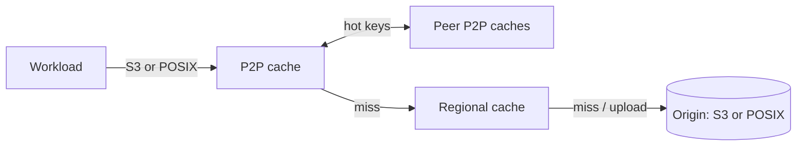

# unbounded-storage

## High-level architecture

Data flows through two cache tiers in front of the origin:

- **Origin** is the bandwidth-constrained source of truth: an S3 bucket, Azure blob storage, etc.
- **Regional cache** is a pull-through cache of objects and metadata residing within the cluster's geo.
- **P2P cache** runs on every node. Nodes share hot data with each other, so
  popular objects are served from the fleet over verbs/RDMA or custom TLS TCP
  RPC at high aggregate throughput.

## Read path

1. The workload asks the local storage client for an object.
2. The client calls the regional cache to resolve the object's name to
   its length and immutable ID.
3. The client requests the object's contents from the P2P cache.
4. The P2P cache serves the object from local NVMe, pulls it from a
   peer, or pulls it through from the regional cache.
5. On a miss, the regional cache serves the object from regional
   storage or pulls it through from the origin.

## Write path

1. The storage client writes directly to local NVMe.
2. The P2P cache asynchronously writes those objects to the regional
   cache.
3. The regional cache writes the objects to regional storage, to the
   origin, or both.

## List path

Storage clients hit the regional cache directly for list metadata.
This simplifies the P2P cache and reduces latency, and metadata is
small enough that the regional cache won't become a bottleneck.

## Mutability

The P2P cache is content-addressed: it stores striped objects by
checksum, so all objects are immutable.

The regional cache allows a bounded amount of safe mutability. When it
reads objects from the origin, it stores them indexed by etag (or
another immutable property) and keeps a name-to-etag mapping with a
configurable TTL. On reads, it can check whether the origin still maps
the name to the same ID without fetching the full object.

## P2P cache

- **RDMA or authenticated TCP over the backend fabric.** Peer transfers use
  libfabric verbs/RDMA (InfiniBand or RoCE) where available. The non-RDMA path
  is the custom TLS TCP RPC transport, which replaces the old libfabric TCP
  fallback. Libfabric remains the verbs/RDMA implementation.
- **Mandatory peer security.** TCP peers use an OpenSSL TLS 1.3 mutual-auth
  handshake. The configured peer name must match a DNS SAN, and kTLS TX and RX
  are required before application traffic starts.
- **Zero-copy TCP page path.** Each shard owns its io_uring and persistent peer
  lanes. Page bodies receive directly into fixed buffers; SEND_ZC source pages
  stay pinned until the final kernel notification.
- **Local NVMe.** Each node backs its cache with local NVMe.
- **Bounded neighbors.** Each node maintains peer connections to a bounded
  subset of peers, not a full mesh. On RDMA this keeps NIC queue-pair (QP) usage
  well under hardware limits.
- **Disjoint discovery.** A node can be configured with only its
  direct routing neighbors (the top-level `routing_plan`) instead of the full
  cluster roster. Because the recursive routing math only ever
  consults a node's own fingers/successor/predecessor, a planner with
  global view can compute each node's neighbor set offline and the
  cluster routes identically to the full-knowledge build. The exact
  algorithm a planner must reproduce is specified in
  `storage-disjoint-routing-parity.md`.
- **Recursive bounded routing.** Each lane runs one active request. Requests
  carry a hop TTL, decrement it only when forwarded, and fail rather than recurse
  past the limit. Cancellation or disconnect tears down the active lane and
  releases relay state.

## Data plane APIs

- The regional cache pulls from the origin using its native API: Azure
  Blob, S3, or a POSIX filesystem (for VAST, Lustre, etc.). The
  `rclone` libraries can likely provide the various backend clients.
- The P2P cache pulls from the regional cache using an S3-compatible
  API.
- The P2P cache implements client APIs (S3, FUSE, OCI registry)
  in-process, using shared io_uring buffers for high performance.

## Control plane APIs

Kubernetes resources provide this metadata to the data plane. Some
values come from labels or annotations on existing resources, others
from new CRDs. The schemas are specified in a separate doc.

- **Frontends**: S3 loopbacks, FUSE storage classes, OCI registries.
- **Backends**: URLs, credential references, etc.
- **Cache policies**: balance inherent tradeoffs such as storage
  duplication and write-back durability.
- **Cache topology**: physical topology hints used by the P2P cache
  when building its neighbor hash ring.
