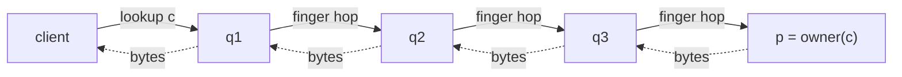
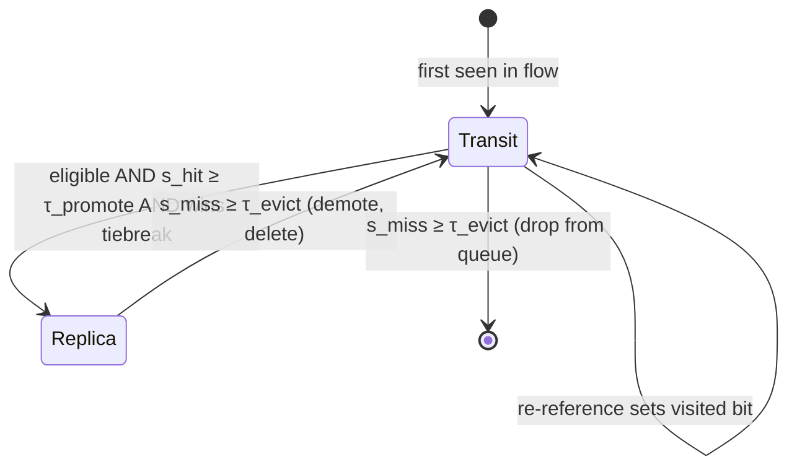
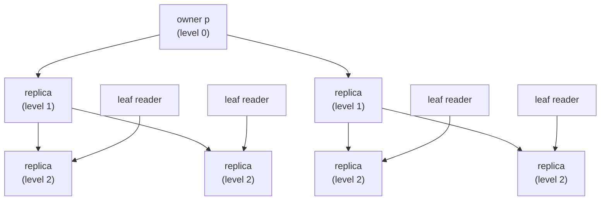

# P2P Storage Protocol

Beehive variant on a Chord-style ring for unbounded-storage-p2p.

## TL;DR

Nodes are arranged on a Chord-style hash ring. Membership comes from
Kubernetes, so every node independently computes the same ring with no
gossip or coordinator. Blobs are split into fixed-width chunks where the
width is a pure function of the blob's length, so any client can address
any chunk without a manifest. Each chunk has exactly one **owner** (the
next node clockwise from its hash) and only the owner is allowed to fetch
it from the backing store; everyone else either has a replica or forwards
the request along the ring.

Reads route across `O(log n)` hops, but routing is recursive *at the byte
level*: NVMe-oF bytes physically flow through each hop, so every transit
node sees the chunks crossing it. Each node runs a SIEVE queue over all
chunks it observes in transit, and when a chunk stays hot for several
sweeps the node promotes itself to a replica (gated by node-id arithmetic
that determines who is "eligible" at each ring level, plus a fault-domain
tiebreak so exactly one node per domain promotes). Demotion is the
symmetric rule on consecutive misses.

The result is Beehive-style adaptive replication that emerges from local
decisions: hot chunks accumulate replicas closer and closer to their
readers, collapsing lookups from `O(log n)` toward `O(1)`, and synchronised
reads (e.g. 1000 nodes pulling the same image) self-organise into a
multicast tree with average fan-out 2. Failures need no migration -
existing replicas keep serving until SIEVE drains them, and the new owner
cold-fetches on the first miss.

## Ring and Fingers

Nodes hash onto a ring of size `2^m`. Each node `q` has `m` finger slots at
offsets `2^0..2^(m-1)`; with `n` nodes only the top `~log₂ n` slots resolve
to distinct peers, giving out-degree `O(log n)`. Membership comes from
Kubernetes, so every node computes the same ring.

**Proximity Neighbor Selection (PNS):** for slot `i`, `q` picks any peer in
the arc `[q + 2^i, q + 2^(i+1))`, preferring topologically near peers (rack,
PCIe complex, interconnect). The arc preserves Chord's distance-halving
invariant, so `O(log n)` hops still hold.

## Chunk Placement

Blobs are striped into uniform chunks whose width is a pure function of
blob length:

    width(L) = clamp(round_pow2(L / TARGET_CHUNKS), MIN_WIDTH, MAX_WIDTH)

Clients always know `L`, so width is computable without coordination or a
per-blob manifest. Within a blob all chunks are the same size (the last
may be partial); across blobs, width varies between `MIN_WIDTH` and
`MAX_WIDTH`. Chunk id is `hash(blob_id, chunk_index)`. Each chunk's
**owner** is the first node clockwise from its hash; only the owner may
cold-fetch from the backend.

`f` must depend solely on `L`; any dependence on cluster size, time, or
mutable config would break the no-coordination property. Power-of-two
bucketing absorbs minor length-reporting jitter.

## Transport

Routing is recursive at the byte level: NVMe-oF bytes flow along the lookup
path, each hop forwarding to the next, so every transit node sees the chunks
crossing it. Cold-read latency is `O(log n)` hops; popular chunks shed hops
as replicas grow.

Solid arrows are the lookup; dashed arrows are the chunk bytes returning along
the same path. Every transit node observes `c` and feeds it into its SIEVE.

## Eligibility

The `i`-th **predecessor-finger arc** of `p` is `(p - 2^(i+1), p - 2^i]`.
Node `q` is eligible at level `i` iff `q` lies in that arc, equivalently iff
`p` lies in `q`'s forward arc `[q + 2^i, q + 2^(i+1))`; this is a pure
function of the two ids.

Eligibility is a superset of "p is q's actual finger entry" (`successor(q +
2^i)` under strict Chord, q's topology pick under PNS); they coincide only
when the arc holds at most one node (`2^i ≲ 2^m / n`). The slack is
harmless: SIEVE gating below ensures arc-eligible nodes off every lookup
path never accumulate hits and never promote.

**Shortcut property:** any lookup terminating at `p` crosses arc-eligible
nodes in order on its way; the first that holds a replica answers,
short-circuiting the lookup.

## SIEVE

Each node maintains a SIEVE queue over **all transit chunks**, not only
owned or cached ones. The queue is byte-weighted: a chunk of width `w`
contributes `w` bytes to queue size, the hand advances at a configured
bytes/sec rate, and a sweep is one full pass over `bytes(queue)`. Each
chunk is still examined exactly once per sweep regardless of width, so
wall-clock visit cadence is uniform across chunk sizes. Two derived
counters drive transitions:

- `s_hit(c)`: consecutive sweeps with the visited bit set at the hand.
- `s_miss(c)`: consecutive sweeps with it clear. Resets on re-reference.

Node `q` promotes chunk `c` (owner `p`) when (1) `q` is eligible,
(2) `s_hit(c) ≥ τ_promote`, and (3) `q` wins the fault-domain tiebreak.
Promotion is local: `q` tees the next verified pass-through and serves `c`.
Demotion is local too: delete when `s_miss(c) ≥ τ_evict`. Both thresholds
are `> 1`, so brief bursts or troughs cannot drive a transition.

**Fault-domain tiebreak.** Among eligible nodes that have also crossed
`τ_promote`, group by fault domain (chassis, NIC, PCIe complex); within
each, the node minimising `hash(node_id, chunk_id)` is the sole promoter.
Gating on `s_hit` before the tiebreak is required under PNS: a hash-only
minimum could elect an arc-eligible node that never sees transit, leaving
the domain uncovered. Keying on `chunk_id` spreads winners across nodes
rather than concentrating them on a single low-id node per domain.

Thresholds are sweep counts and a sweep takes `bytes(queue) / sweep_rate`
with `sweep_rate` in bytes/sec, so `τ` is interpretable directly as
"hot/cold across this many full working-set traversals" without reference
to chunk-width distribution.

Per-chunk lifecycle on a single node. Most chunks live and die in `Transit`;
only sustained hits on an eligible node cross into `Replica`.

## Recursive Structure

Once `q` serves `c`, lookups that previously terminated at `p` now
terminate at `q`, and `q`'s own predecessor-fingers see transit for `c` and
may promote in turn. Levels emerge with no explicit tracking. With `r`
levels, expected lookup length is `log₂ n - r`, reaching `O(1)` at
saturation.

As more predecessor levels promote, the replica set forms a tree rooted at
the owner. Cold-read clients hit a level-`r` replica in `log₂ n - r` hops;
synchronised reads (e.g. image pull at job start) traverse the same tree as
a multicast with average fan-out 2.

## Physical Clustering and Multicast

PNS biases each hop toward the nearest peer in its arc, so hot chunks
acquire a dense replica cluster near their dominant readers and a thinner
reach into colder regions, with no explicit topology placement.

For synchronised large-blob reads (e.g. 1000 nodes pulling the same image
at job start), the same mechanism assembles a self-organising multicast
tree: after `~log n` waves the chunk reaches every node. The fan-out
analysis is per-blob and relies on within-blob chunk uniformity, which the
width function preserves. A balanced tree of `n` leaves over `log₂ n`
levels has *average* fan-out `n^(1/log₂ n) = 2`, bounding per-replica
bandwidth as the cluster scales.

This is an average, not a per-node bound: a replica has up to `log₂ n`
predecessor-finger arcs and under skewed demand may fan out to more
children, with bandwidth tracking local fan-out.

## Failure and Liveness

- **Owner failure.** Replicas remain on disk, but only those on the lookup
  path to the new successor `p'` intercept new requests. High-index
  predecessors of `p` are also predecessors of `p'`, so most of the tree
  keeps serving; low-index replicas may fall off-path until re-promoted.
  Misses fall through to `p'`, which cold-fetches.
- **Membership change.** Chunks are not migrated. Existing replicas serve
  until SIEVE drains them; the new owner cold-fetches only on a miss. Hot
  chunks regrow the tree under the new geometry.
- **In-flight transactions.** A hop failure surfaces as an NVMe-oF
  transport error. The client retries; partial bytes are discarded by the
  reader's content-hash check.
