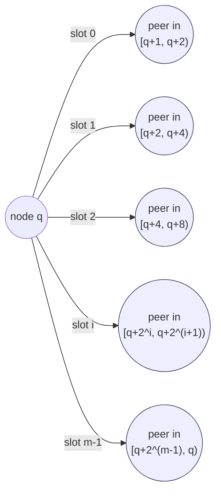
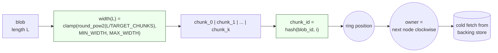
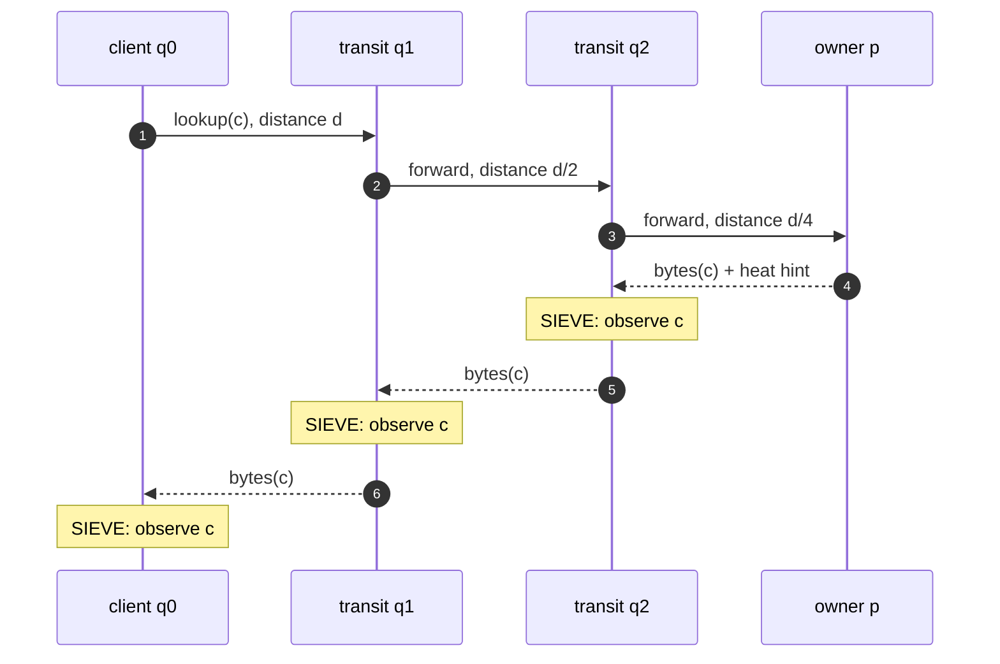
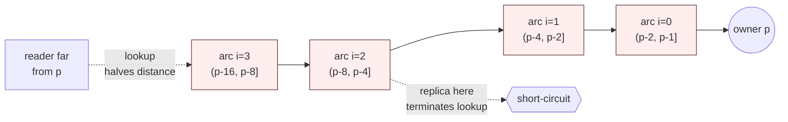
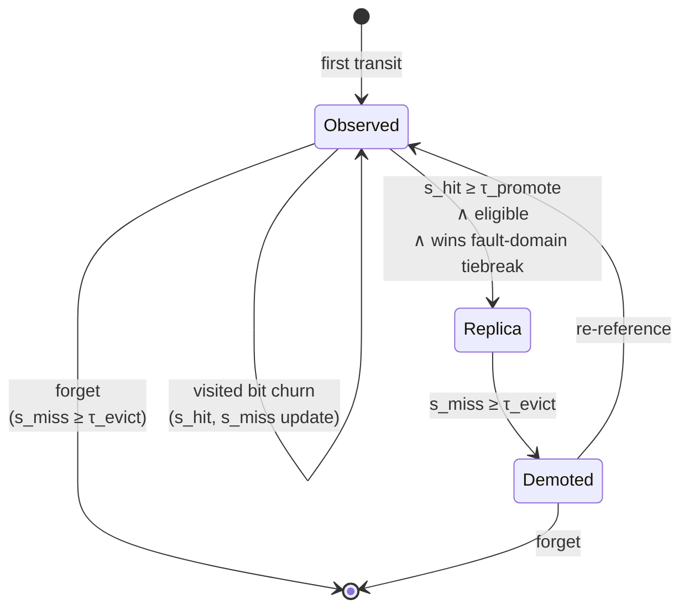
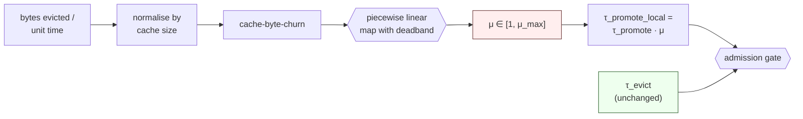
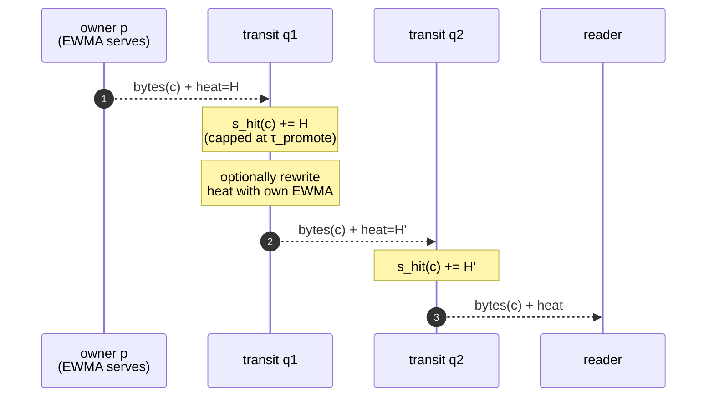
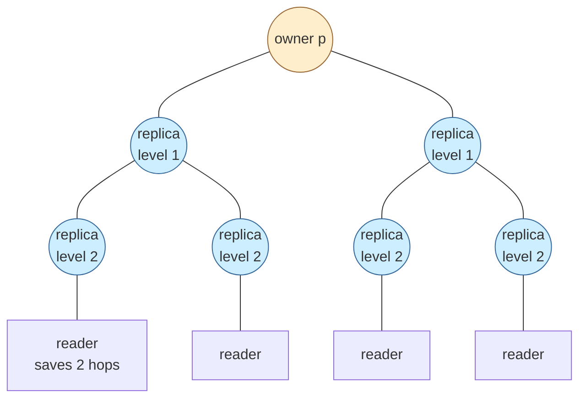
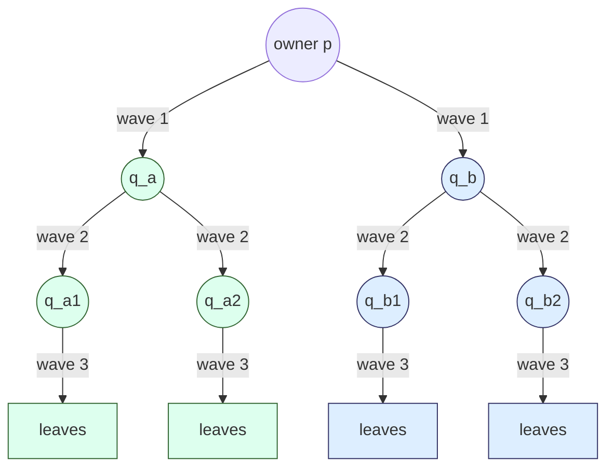
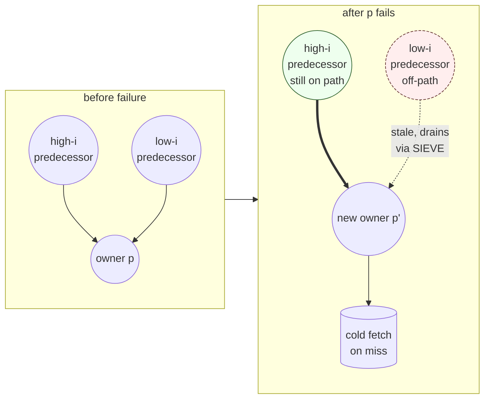

# P2P Storage Protocol

Adaptive replication over a structured ring for unbounded-storage-p2p.

## TL;DR

**Membership**

- Nodes hash onto a ring. Each node links to peers at offsets `2^0, 2^1,
  ...` ahead of itself, so any address is reachable in `O(log n)` hops.
  Membership comes from Kubernetes, so every node computes the same ring
  without coordination.
- Blobs split into fixed-width chunks. Width is computed from blob length
  alone, so clients find chunk boundaries without a manifest.
- Each chunk has one **owner**: the next node clockwise from
  `hash(blob_id, chunk_index)`. Only the owner cold-fetches from the
  backing store.

**Read path**

- Lookup descends the neighbor table in `O(log n)` hops to the owner.
- Bytes flow back along the same path, so caching is a side-effect of
  routing: any node on the path can keep a copy, and once it does,
  later lookups whose paths cross that node terminate there instead
  of continuing on to the owner.

**Adaptive replication**

- Each node tracks the chunks it sees in transit. Chunks that stay hot
  get cached; chunks that go cold are dropped. Decisions are local; no
  coordination.
- Because caches form on the paths leading to the owner, popular chunks
  end up replicated along the geometry that future readers will
  traverse anyway. The set of paths to a hot owner thickens into a tree
  of replicas rooted near the hot region, and each level of the tree
  halves the distance the next reader has to travel.
- Owners and existing replicas stamp a small heat hint onto served bytes.
  Downstream transit nodes fold that hint into their local SIEVE counters,
  shortening the runway to promotion for chunks that just turned hot.

**Emergent properties**

- Hot chunks gain replicas near their readers. Lookups rapidly shrink from
  `O(log n)` toward `O(1)` as replica levels grow.
- Synchronised reads (e.g. 1000 nodes pulling the same image) form a
  multicast tree with average fan-out 2 over `log2 n` levels.

## Motivation

- **Bounded peer set per node.** NICs (especially RDMA HCAs) fall off a
  cliff past a few thousand concurrent peers. A node must talk to
  `O(log n)` neighbors, not `O(n)`. Full-mesh swarms and centralized
  cache tiers both violate this.
- **No metadata round-trip.** Placement must be a pure function of the
  blob id so any client finds chunks without a lookup service.
- **One cold fetch per chunk.** A single owner per chunk avoids M cache
  nodes each pulling the same bytes from the backing store.
- **Bounded origin egress under synchronized pulls.** Thousands of pods
  starting at once must not all hit the backing store or one cache
  fleet. Peer fan-out is the only way to keep per-node egress flat as
  the cluster grows.
- **Demand-shaped replication.** Workloads are read-heavy and bimodal:
  a small hot set dominates traffic, a long cold tail dominates bytes.
  Bytes should land where readers are, and drain when demand fades.
- **Topology awareness for free.** Datacenters are hierarchical in
  bandwidth and fault domains (rack, PCIe, rail). Replicas should
  cluster near readers without explicit placement policy.
- **Tolerate Kubernetes churn.** Autoscaling, rolling upgrades, and
  spot evictions reshape membership constantly. State must not migrate
  on every change; existing replicas keep serving while the new owner
  cold-fetches lazily.
- **Reuse the existing control plane.** The Kubernetes API server is
  already HA and trusted. A bespoke tracker or metadata service would
  need the same rigor for less benefit.

## Ring and Neighbors

Nodes hash onto a ring of size `2^m`. Each node `q` has `m` neighbor slots
at offsets `2^0..2^(m-1)`. With `n` nodes, only the top `~log2 n` slots
resolve to distinct peers, so out-degree is `O(log n)`. Membership comes
from Kubernetes, so every node computes the same ring.

**Proximity Neighbor Selection (PNS):** for slot `i`, `q` picks any peer
in the arc `[q + 2^i, q + 2^(i+1))`, preferring topologically near peers
(rack, PCIe complex, interconnect). The arc keeps the distance-halving
property, so `O(log n)` hops still hold.

Each slot's arc doubles in width. PNS picks the topologically nearest
peer inside the arc; the arc width guarantees the next hop still halves
the remaining ring distance.

## Chunk Placement

Blobs are striped into uniform chunks. Width depends only on blob length:

    width(L) = clamp(round_pow2(L / TARGET_CHUNKS), MIN_WIDTH, MAX_WIDTH)

Clients know `L`, so they compute width without coordination or a
manifest. All chunks in a blob are the same size (last may be partial).
Across blobs, width varies between `MIN_WIDTH` and `MAX_WIDTH`. Chunk id
is `hash(blob_id, chunk_index)`. The **owner** is the first node
clockwise from that hash; only the owner may cold-fetch from the backend.

`width` must depend only on `L`. Any dependence on cluster size, time, or
mutable config breaks the no-coordination property. Power-of-two
bucketing absorbs minor length-reporting jitter.

The green nodes are pure functions of public inputs: any client computes
them without coordination. Only the owner is allowed to cold-fetch.

## Transport

Routing is recursive at the byte level. Bytes flow along the lookup
path, so every transit node sees the chunks crossing it. Cold-read
latency is `O(log n)` hops; popular chunks shed hops as replicas grow.

The lookup descends the neighbor path with hops that halve the remaining
ring distance, so depth is `O(log n)`. Bytes retrace the path back; each
transit node observes chunk `c` exactly once and updates its SIEVE.

Caching is a side-effect of routing: every transit node sees `c` once
per pass, so any of them can later short-circuit the lookup if it
promotes.

## Eligibility

Eligibility restricts promotion to ring positions that lie on high-probability
lookup paths to the owner, so cache bytes spent here are guaranteed to shorten
subsequent lookups.

The `i`-th **predecessor-neighbor arc** of owner `p` is
`(p - 2^(i+1), p - 2^i]`. Node `q` is eligible at level `i` iff `q` lies
in that arc, equivalently iff `p` lies in `q`'s forward arc
`[q + 2^i, q + 2^(i+1))`. This depends only on the two ids.

Eligibility is a superset of "p is q's actual neighbor entry"; the two
match only when an arc holds at most one node (`2^i ≲ 2^m / n`). The
slack is harmless: SIEVE gating (below) means arc-eligible nodes off
every lookup path never accumulate hits, so they never promote.

**Shortcut property:** any lookup terminating at `p` crosses
arc-eligible nodes in order on its way. The first one holding a replica
answers, short-circuiting the lookup.

Eligible nodes form a nested sequence of arcs behind `p`. A lookup
crosses them from outer (high `i`) to inner (low `i`); the first replica
encountered serves the bytes.

## SIEVE

Each node maintains a SIEVE queue over **all transit chunks**, not just
owned or cached ones. The queue is byte-weighted: a chunk of width `w`
contributes `w` bytes, the hand advances at a configured bytes/sec rate,
and a sweep is one full pass over `bytes(queue)`. Each chunk is examined
once per sweep regardless of width, so visit cadence is uniform across
chunk sizes. Two derived counters drive transitions:

- `s_hit(c)`: consecutive sweeps with the visited bit set at the hand.
- `s_miss(c)`: consecutive sweeps with it clear. Resets on re-reference.

Node `q` promotes chunk `c` (owner `p`) when:
1. `q` is eligible,
2. `s_hit(c) ≥ τ_promote`, and
3. `q` wins the fault-domain tiebreak.

Promotion is local: `q` tees the next verified pass-through and serves
`c`. Demotion is local too: delete when `s_miss(c) ≥ τ_evict`. Both
thresholds are `> 1`, so brief bursts or troughs cannot drive a
transition.

**Fault-domain tiebreak.** Among eligible nodes past `τ_promote`, group
by fault domain (chassis, NIC, PCIe complex). Within each domain, the
node minimising `hash(node_id, chunk_id)` is the sole promoter. Gating
on `s_hit` before the tiebreak matters under PNS: a hash-only minimum
could pick an arc-eligible node that never sees transit, leaving the
domain uncovered. Keying on `chunk_id` spreads winners across nodes
instead of concentrating them on one low-id node per domain.

Thresholds are sweep counts. A sweep takes `bytes(queue) / sweep_rate`,
so `τ` reads directly as "hot/cold across this many full working-set
traversals" without depending on chunk-width distribution.

Per-chunk lifecycle on a single node:

- **promote:** `s_hit ≥ τ_promote` ∧ eligible ∧ wins fault-domain
  tiebreak.
- **demote:** `s_miss ≥ τ_evict` while serving; chunk stays in the
  SIEVE queue but is no longer served.
- **forget:** `s_miss ≥ τ_evict` while merely observed; chunk drops out
  of the queue.

The visited-bit churn (set on re-reference, cleared by the hand) is
queue bookkeeping that drives `s_hit` and `s_miss`, not a state
transition. Most chunks live and die in `Observed`; only sustained hits
on an eligible node cross into `Replica`.

Promotion needs all three gates; demotion and forgetting are decided by
`s_miss` alone. Thresholds count sweeps, so they read as "hot/cold
across this many full working-set traversals" regardless of chunk width.

## Adaptive Admission

A fixed `τ_promote` ignores cache pressure. A node already churning
through its cache should be slower to admit new replicas. Each node
multiplies `τ_promote` by a local factor `μ ≥ 1`:

    τ_promote_local = τ_promote · μ

`μ` rises with **cache-byte-churn**: bytes evicted per unit time,
normalised by cache size. Low churn means the cache is comfortable and
`μ = 1`. High churn means promotions are pushing out chunks faster than
they age out naturally, and `μ` climbs toward a configured `μ_max`.
Between the two it varies linearly. The deadband at the low end keeps
the multiplier quiet under normal load.

Only admission is gated. `τ_evict` is unchanged, so a pressure spike
will not flush chunks that are still serving. The hot set stays put
until it goes cold on its own.

Computation is local. No coordination, no shared state, no integrator
to wind up across membership changes. Under steady demand `μ = 1` and
the rule reduces to the original `τ_promote`.

`μ` only gates admission. Eviction stays on its original schedule, so
pressure spikes can not flush a working set that is still being served.

## Promotion Hints

SIEVE on a single transit node only sees the slice of traffic that
crosses it. For a chunk that has just turned hot - a freshly published
image tag, a model rollout, the start of a synchronised pull - no
transit has accumulated `τ_promote` sweeps yet, so no replicas exist,
and the first wave of readers all pays the full `O(log n)` path. SIEVE
is doing the right thing in general; it just lags the workloads we
care about most.

The owner does not have this blind spot. Every cold miss funnels
through it, so it sees demand climb several ring levels before any
single transit catches up. Owner-adjacent branch nodes see a partial
version of the same picture.

**The hint.** Each server (owner or replica) tracks an EWMA of recent
serves per chunk. When it writes a response, it stamps that rate, as a
small integer, into a header on the byte stream. Cold chunks carry
zero.

**How transit nodes use it.** As bytes flow back, each transit reads
the header and adds its value to `s_hit(c)`, as if the chunk had been
visited at the head of that many extra sweeps. Eligibility, the
fault-domain tiebreak, and `μ` are unchanged. The hint shortens the
runway to `τ_promote_local`, nothing else.

**Composition along the path.** A forwarding node may rewrite the
header with its own observed rate before passing it on. Once early
replicas exist, downstream receivers see heat from the nearest
authoritative point on their path, which is the relevant signal for
the next wave of readers attaching to that subtree.

**Bounds.** Per-response credit is capped at `τ_promote`, so no single
hint can promote on its own; the chunk still needs to be eligible and
to win the tiebreak. `τ_evict` is untouched, so a chunk admitted on a
hint that turns out to be cold drains on the normal schedule. The
asymmetry is intentional: cheap to admit, slow to evict.

**Why not just lower `τ_promote`.** That would admit the warm long
tail too. The hint is per-chunk and demand-derived, so only genuinely
hot chunks accelerate. Cold chunks earn promotion the slow way.

Under steady demand heat values are near zero and this section reduces
to plain SIEVE. It only matters during bursts, which is when fan-out
matters.

Each server stamps its own EWMA on outgoing bytes. Transit nodes fold
that into `s_hit` to shorten the runway to `τ_promote_local`.
Eligibility, the tiebreak, and `μ` are unchanged, so a hint can not
promote a chunk that has no business being promoted.

## Recursive Structure

Once `q` serves `c`, lookups that previously terminated at `p` now
terminate at `q`. `q`'s own predecessor-neighbors then see transit for
`c` and may promote in turn. Levels emerge with no explicit tracking.
With `r` levels, expected lookup length is `log2 n - r`, reaching `O(1)`
at saturation.

Edges are undirected: the tree records the replica hierarchy, not data
flow. A reader's lookup terminates at the first replica it crosses, so
attaching at level `r` saves `r` hops. The same picture read in reverse
describes synchronised reads (e.g. an image pull at job start): bytes
propagate from `p` along the tree as a multicast, with average fan-out
2 across `log2 n` levels.

Levels emerge with no explicit tracking. Expected lookup length is
`log2 n - r` with `r` levels of replicas, reaching `O(1)` at saturation.

## Physical Clustering and Multicast

PNS biases each hop toward the nearest peer in its arc. Hot chunks
acquire a dense replica cluster near their dominant readers and a
thinner reach into colder regions, with no explicit topology placement.

For synchronised large-blob reads (e.g. 1000 nodes pulling the same
image), the same mechanism builds a self-organising multicast tree.
After `~log n` waves the chunk reaches every node. Fan-out analysis is
per-blob and relies on within-blob chunk uniformity, which the width
function preserves. A balanced tree of `n` leaves over `log2 n` levels
has *average* fan-out `n^(1/log2 n) = 2`, bounding per-replica bandwidth
as the cluster scales.

This is an average, not a per-node bound. A replica has up to `log2 n`
predecessor-neighbor arcs, and under skewed demand may fan out to more
children, with bandwidth tracking local fan-out.

PNS biases each hop to the topologically nearest peer in its arc, so
sub-trees collapse into local clusters (rack, PCIe complex). The same
geometry that serves cached reads handles synchronised reads as a
multicast tree with average fan-out 2 across `log2 n` waves.

## Failure and Liveness

- **Owner failure.** Replicas remain on disk, but only those on the
  lookup path to the new successor `p'` intercept new requests.
  High-index predecessors of `p` are also predecessors of `p'`, so most
  of the tree keeps serving. Low-index replicas may fall off-path until
  re-promoted. Misses fall through to `p'`, which cold-fetches.
- **Membership change.** Chunks are not migrated. Existing replicas
  serve until SIEVE drains them; the new owner cold-fetches only on a
  miss. Hot chunks regrow the tree under the new geometry.
- **In-flight transactions.** A hop failure surfaces as a transport
  error. The client retries; partial bytes are discarded by the
  reader's content-hash check.

High-index predecessors of `p` are also predecessors of `p'`, so the
top of the replica tree keeps serving without migration. Low-index
replicas fall off-path and drain via SIEVE while `p'` cold-fetches
misses. No chunks move on membership change.

## Alternatives Considered

The design rests on three invariants: placement is a pure function of
`(blob_id, chunk_index)` and current membership, bytes flow along the
lookup path so caching is a routing side-effect, and replication
geometry emerges from demand. Each alternative below sacrifices at
least one.

- **Centralized cache tier** (Harbor mirrors, Dragonfly supernodes,
  CDN edges). Sized ahead of demand, not on the consumer's data path,
  NIC-bound under synchronized pulls, extra control plane to operate,
  concentrated fault domain.
- **Centralized metadata, distributed blocks** (HDFS NameNode, Ceph
  MDS, BitTorrent tracker, IPFS provider records). Reintroduces a
  per-read lookup, must be HA and on the critical path, rewrites
  placement records on membership churn, adds write-time coordination.
- **Typical BitTorrent.** Rarest-first is the wrong objective (we want
  hot pieces replicated, not rare ones), peer discovery is not
  `O(log n)` over the cluster, transit peers do not see chunks they
  did not request, no locality awareness, and the tracker/DHT is
  itself a centralization point.
- **Production peers.** Spegel (libp2p + DHT, no structured routing or
  demand shaping), Dragonfly (supernode is bottleneck and SPOF),
  Uber Kraken (tracker dependency, locality requires explicit config).
  None combine pure-function placement, routing-as-caching, and
  emergent replication geometry.

