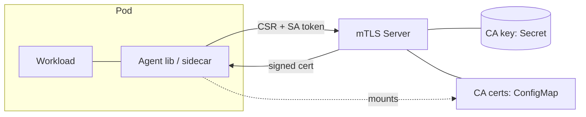

# Unbounded mTLS

Automatic, mutually-authenticated TLS between workloads, with trust rooted in
Kubernetes. Every pod gets a short-lived certificate that identifies it by
ServiceAccount and rotates automatically, with no operator intervention.

## Goals

- **Automatic mTLS.** Workloads get an identity and an encrypted, mutually
  authenticated channel without writing crypto code.
- **Kubernetes-backed trust.** Identity derives from the pod's ServiceAccount
  token; the cluster is the root of trust.
- **Short-lived certs.** Leaves live for minutes to hours and rotate before
  expiry, limiting the blast radius of a leak.
- **Cheap authz.** Authorization is a simple check on the peer's certified
  identity (SA / namespace), not a policy engine.
- **Small and simple.** One signing endpoint. Few moving parts, few secrets to manage.

## Why not SPIFFE?

SPIFFE/SPIRE adds node attestation, its own trust-domain and SVID machinery,
and a workload API: more surface area than we need. Kubernetes already gives us
a cluster-wide root of trust (the API server's TokenReview) and a natural
identity (the ServiceAccount), so we can get the same guarantees with far less
code.

## Components

### Server

A controller exposing a single `Sign` HTTP endpoint.

- **Sign endpoint.** Accepts a CSR plus the caller's SA token. It validates the
  token via TokenReview, requiring the Server's dedicated audience to protect
  against replay attacks. It derives the identity
  (`namespace/serviceaccount`), stamps it into the certificate as a URI SAN, and
  returns the signed leaf. Leaf lifetime is clamped to a configured maximum.

- **Leaf certs.** Carry `clientAuth` + `serverAuth` EKUs and only their identity
  URI SAN. They are explicitly not CA certs (`isCA=false`) and never bear the
  Server's serving identity, so a leaf can never impersonate the Sign endpoint.

- **High availability.** The Server runs as multiple replicas behind one
  in-cluster Service. Signing is stateless and active-active: any replica can
  validate a token and sign. Only CA generation, rotation, and publishing the CA
  ConfigMap/Secret run under leader election. A single replica restarting never
  interrupts renewal.

- **Serving identity.** The Sign endpoint's own TLS cert is issued in-process by
  the Server, signed by the CA, with a reserved identity SAN that is never issued
  to a workload. Agents do not just check that the Server chains to the CA (every
  leaf does); they **pin** the reserved identity, requiring (a) a valid chain to
  the mounted bundle, (b) the `serverAuth` EKU, and (c) an exact SAN match. This
  authenticates the very first call, so the SA token is never exposed to anyone
  but the genuine Server.

### CA management and rotation

The CA private keys live in a Secret; the CA certificates are published in a
ConfigMap that pods mount as their trust bundle. CA and leaf rotation are
independent.

- **Staged CA rotation.** A new CA is not used for signing immediately. ConfigMap
  updates reach pods only after a kubelet sync delay, so the Server publishes the
  new CA cert to the bundle first, keeps signing with the **previous** key for a
  configurable propagation period, and only then promotes the new key. By then
  every mounted bundle already trusts the new CA, so no cert is ever presented
  before its verifier can validate it.

- **Key retention.** The Secret holds at most two private keys: the active
  signer and, mid-rotation, the pending new key. On promotion the superseded
  private key is deleted; only its certificate lingers in the bundle so still-live
  leaves keep verifying until they age out (up to one max leaf TTL). Old signing
  keys are never retained, to keep the blast radius of a Secret compromise small.

- **Leaf rotation.** Each agent renews at 80% of its cert's lifespan, plus
  jitter to avoid a thundering herd. Renewal is a fresh CSR over the same token
  flow; the new cert is swapped in atomically with no connection interruption.

### Agent

- **Go library.** Embedded in Go workloads: generates a keypair, builds the CSR,
  calls the Server, and keeps an in-memory `tls.Config` whose certificate is
  hot-swapped on each rotation.
- **Sidecar container.** A thin wrapper around the Go library for non-Go processes.

Pods mount the CA ConfigMap as their trust bundle and present their projected SA
token to the Server alongside each CSR.

