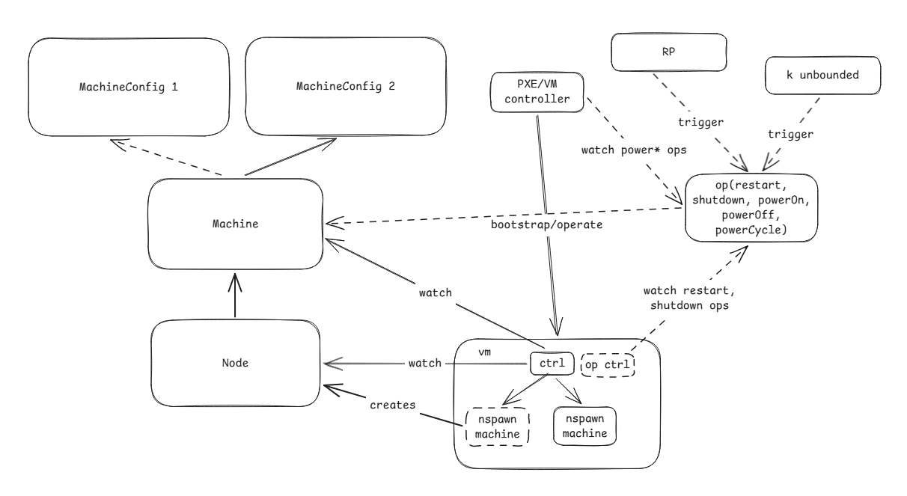

# Unbounded controller/CRs

The Unbounded controller will rely on two control methods - configuration CRs for machine configuration and status alongside an operational CR for operations like reboot, shutdown, and power on.

[Link](https://excalidraw.com/#json=FvIvkl5uWdPAwTrVdNNua,WTKPZlW8KllB1HMfHbj0rQ)

## Configuration CRs - Machine, MachineConfiguration

### Machine/Node

The `Machine` CR is used to create a relationship to a particular VM or piece of hardware. It should contain information about the VM/hardware, including how to identify it and what controller owns it (this would indicate what cloud/provisioning mechanism it uses, like Azure, PXE, Manual, etc.). It also may contain a selection reference for a `MachineConfiguration` and possibly a specific version of that configuration. If a specific version of the configuration is referenced, then at `Node` provisioning time that configuration will be used; if not, the newest configuration version will be used (and become locked, if unlocked — see [Versioning](#versioning) below).

Machines have a 1:1 relationship with a Kubernetes `Node` object. When a machine is initially added to the cluster, it should trigger initial provisioning of the VM or compute, but *not* add the node to the cluster. That should be done only after a `MachineConfiguration` has been selected, which may happen either by setting the `MachineConfiguration` (and possibly version) manually on the `Machine` object or via the `MachineConfiguration` CR having a `machineSelector` that matches fields on the `Machine` object. If no `MachineConfiguration` has been selected and no `machineSelector` matches, the `Machine` should report a `ConfigurationPending` status condition and remain in a waiting state until a configuration is assigned.

The configuration selected drives the VM agent (see Agents, below) to create the `systemd-nspawn` container and bootstrap `kubelet` such that the node joins the cluster. Once provisioning has completed and the node has appeared in the cluster, the machine controller should annotate the `Node` object with the `MachineConfiguration` name and version that were used to bootstrap the machine.

If the user wants to repave the `systemd-nspawn` container or make configuration changes on the VM effective, they should cordon/drain the node and then delete the Kubernetes `Node` object. The VM agent will detect that the `Machine` exists but no matching Kubernetes `Node` exists; this will then trigger the repave operation on the node, which should result in the node rejoining the cluster and becoming ready.

**TODO**: Figure out a way to deal with changes that don't require a repave, if we want to allow that. Perhaps an `applyConfiguration` operation that can be used to indicate we want changes applied, which could take a parameter for disruptive or not, and handle the automation of cordon/drain/delete?

### MachineConfiguration/MachineConfigurationVersion

The `MachineConfiguration` CR stores a configuration profile for a class of machines. It will contain properties (list TBD) about how the machine and the `systemd-nspawn` containers should be configured, like the image version. Importantly, the configuration should have versioned child objects that are automatically maintained and updated by the controller. The versioned child objects are not updatable by the end user directly. 

`MachineConfiguration` objects may have a `machineSelector` and a `priority`, in which case any new machines that are registered and match the selector will automatically receive the latest **locked** version of the highest priority configuration that they match the selectors for, if any, or version 1 if it's a new configuration. If multiple configurations match and have the same priority, the order should be selected by lexicographic sort.

`MachineConfiguration` objects should have a `spec.updateStrategy` based on the base Kubernetes `DaemonSet` object. The initial support should be for `type: OnDelete`, where the user indicates that they want to make the configuration changes effective by doing a cordon/drain/delete of the `Node` object. Future iterations may support `type: RollingUpdate`, where the controller would automate the cordon/drain/delete cycle across machines respecting a `maxUnavailable` setting.

#### Versioning

When a user creates a `MachineConfiguration` object, a corresponding `MachineConfigurationVersion` child object (using a Kubernetes `ownerReference`) named `<MachineConfigurationName>-v<version>` and a `status.deployed` of `false` will be automatically created by the controller. This version will remain editable until it has been deployed (see the `Machine` object). Once any machines have been deployed using a given configuration version, the state of the configuration will be changed to deployed and the spec fields of the object will become immutable like a running `Pod` (this should be enforced by the CRD schema using CEL/`x-kubernetes-validations`). The controller may still update the status field to include things like the count of machines currently referencing the policy. Once deployed, a version may never be modified again, but may be deleted if it is not currently referenced. Deletion of a version that is still referenced by any `Machine` object should be blocked by a `ValidatingAdmissionPolicy`. The highest version created should be stored in a status field on the `MachineConfiguration` so that the controller will not reuse a number if a `MachineConfigurationVersion` is deleted. An integer `revisionHistoryLimit` on the MachineConfiguration will trigger the controller to only retain the last `<limit>` versions, though this will not override the restriction on deleting in use configurations, so more configurations than the limit may be retained.

When changes are made to a `MachineConfiguration` object specification, the controller will copy the changes to the most recent `MachineConfigurationVersion` if it has not been deployed or create a new version if there are no non-deployed versions. In this way, the count of versioned objects does not grow extremely large, as they only become locked and permanent when deployed, and old configurations may be deleted.

#### Rollback

To roll back to a previous configuration, the user updates the `Machine` object's configuration version reference to point to an earlier `MachineConfigurationVersion`. The normal repave workflow (cordon/drain/delete the `Node`) then applies the prior version. This avoids the need for a dedicated rollback mechanism — any previously deployed version can be targeted directly.

## Operational CRs

### MachineOperation

The `MachineOperation` CR acts like a Kubernetes `Job` object in that it has a `status.state` field that can contain values like `Pending`, `InProgress`, `Complete`, or `Failed`. It should also have a `ttlSecondsAfterFinished` property that can be used to automatically clean up completed or failed operations automatically.

The `MachineOperation` will take a spec field that references a `Machine` object (or a `machineSelector` to target multiple machines, in which case the controller creates individual `MachineOperation` children per matched machine) and an `operationName` field that's an enum-as-string, so it can contain both predefined operations (like `reboot`, `shutdown`, `restartService`, `powerCycle`, `powerOff`, or `powerOn`) or custom operations that are supported by individual cloud controllers (these might be troubleshooting actions like `packetCapture` that could be performed on any machine or cloud-specific actions that may be needed). Different agents may act on the operations based on the name - for example, the in-VM agent would handle operations like `restart` and `shutdown`, which would be operating system level, whereas a cloud or PXE agent would handle things like `powerOff` that need to be handled outside of the VM. The controller should label the `MachineOperation` with the `Machine` name so that the agents can use a `labelSelector` on their informers.

A `parameters` field of type `map[string]string` should be supplied that can be used to pass parameters to operations if required.

## Agents

A number of different agents may be present in the cluster, and each will watch for a different set of CRs.

- Machine controller: The machine controller runs on every `Machine` and monitors its own `Machine` and `Node` objects and any `MachineOperations` that target itself. This controller creates the `systemd-nspawn` machine based on the `Machine` and the `MachineConfigurationVersion` it references. It should implement operations like the following:

  - Pave/repave the node if there is no corresponding `Node` object in the cluster - this should handle initial pave and repave when the node is deleted.
  - `Restart`/`shutdown` - operating system level power management for the `MachineOperation` CRs.

  - PXE/cloud controller: This controller monitors for `Machine` objects created by the user with PXE settings and powers on/handles initial bootstrapping of them. This type of controller may have multiple instances (one for each cloud/type of provisioning) and handles both initial bootstrapping of the machine object and operations that are implemented for it (like `power*`).