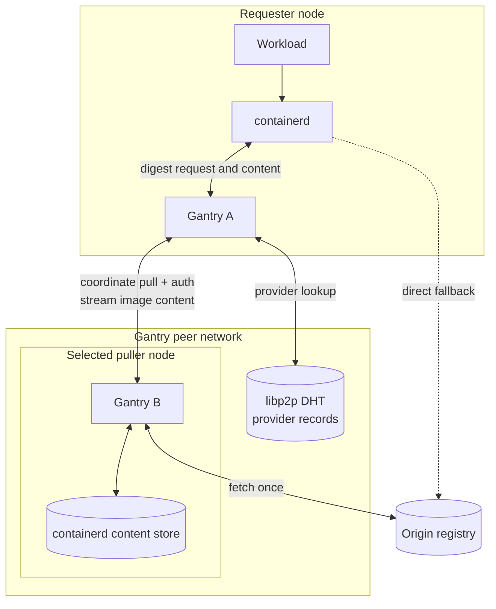

Gantry is a decentralized, peer-to-peer OCI distribution layer for Kubernetes.
It reduces duplicate origin-registry traffic during large rollouts by
coordinating each digest fetch on a small number of nodes and serving the
content from peers that already have it.

Gantry runs as a DaemonSet and uses each node's existing containerd content
store. It does not introduce a separate image cache or a central metadata
service. Peer discovery uses libp2p and a distributed hash table (DHT), and
containerd continues to verify every content digest before using it.

After the node-level mirror configuration is installed, Gantry is transparent
to workloads. Pods continue to use normal OCI image references,
`imagePullSecrets`, and kubelet credential providers.

## Architecture



The DHT contains provider records, not image data. Manifests and layers stream
directly from the selected Gantry peer, while containerd remains responsible
for digest verification and the node-local content store.

## How Gantry Handles a Pull

1. Containerd resolves an image tag at the origin registry and obtains a
   content digest.
2. Containerd requests that digest through the node-local Gantry mirror.
3. Gantry checks the local containerd content store and asks the DHT for peers
   that already provide the digest.
4. If no provider exists, Gantry uses deterministic highest-random-weight
  (HRW) selection, a consistent-hashing algorithm, to choose one of a small
  set of nodes to fetch the digest. Every agent reaches the same choice
  without a consensus service.
5. Other nodes stream the content from that peer. The requesting containerd
   verifies and commits it to its own content store.

Gantry routes content by digest. Tag resolution still reaches the origin, so
the exact reduction in registry requests depends on image composition and
rollout size. Large layers distributed to many nodes receive the greatest
benefit.

## Installation

### 1. Select a Released Gantry Image

Find the latest Gantry release on the
[Unbounded releases page](https://github.com/Azure/unbounded/releases) and use
its published image:

```bash
export GANTRY_IMAGE="ghcr.io/azure/gantry:<release-version>"
```

### 2. Configure Upstream Registries

Edit `deploy/gantry/configmap.yaml` and replace the example
`upstream_registries` entry. This list is an opt-in allowlist: add only the
origin registries whose image pulls you want Gantry to accelerate. Registries
that are not configured here continue using containerd's normal direct-origin
path and are not distributed through Gantry.

```yaml
upstream_registries:
  - name: "registry.example.com"
    endpoint: "https://registry.example.com"
```

The `name` must match the registry host in the image reference and in
containerd's `certs.d` directory. Include the port when the image reference
uses a non-default port. Gantry requires at least one accelerated upstream
registry.


### 3. Deploy Gantry


```bash
kubectl apply -f deploy/gantry/serviceaccount.yaml
kubectl apply -f deploy/gantry/node-config.yaml
kubectl -n gantry-system rollout status daemonset/gantry-containerd-config
kubectl apply -f deploy/gantry/serviceaccount.yaml
kubectl apply -f deploy/gantry/configmap.yaml
kubectl set image --local \
  -f deploy/gantry/daemonset.yaml \
  gantry="${GANTRY_IMAGE}" \
  -o yaml | kubectl apply -f -

kubectl -n gantry-system rollout status daemonset/gantry
kubectl -n gantry-system get pods -o wide
```


### 4. Private Registry Authentication

#### Requester-Delegated Authentication

The workload supplies credentials in the normal Kubernetes way, such as an
`imagePullSecret` or a kubelet credential provider. For a private HTTPS
registry, the flow is:

1. Containerd sends an unauthenticated digest request to its local Gantry
   agent.
2. Gantry probes the registry's verified HTTPS `/v2/` endpoint and relays its
   Basic or Bearer `WWW-Authenticate` challenge.
3. Containerd answers the challenge using the credential supplied by kubelet
   or CRI. For Bearer authentication, containerd exchanges that credential at
   the registry's HTTPS token service and sends Gantry the scoped token.
4. Gantry carries the request-scoped authorization to the selected origin
   puller. The selected node does not need its own registry identity or access
   to the requester's `imagePullSecret`.
5. Gantry discards the authorization after the request. It does not persist
   the credential or fall back to the puller's identity if the registry
   rejects it.

Requester-delegated private-registry authentication requires an HTTPS origin.
Private plaintext HTTP registries are not supported by this mode.

#### Shared-Identity Authentication

Shared identity is a compatibility mode for environments where kubelet or CRI
cannot provide a usable request credential. It gives every Gantry agent the
same registry identity.

To enable it, copy and edit
`deploy/gantry/examples/registry-secret.example.yaml`, apply the resulting
Secret, and set the matching registry's `credentials_path` in the ConfigMap.
The file contains a `username:password` pair keyed by the registry `name`.

Gantry reads configured credential files eagerly during startup. A missing
file causes the pod to fail, so do not add `credentials_path` unless the Secret
is present. Prefer requester-delegated authentication when possible because it
avoids distributing a shared registry credential to every node.

### 5. Verify Distribution

First verify one agent directly. Select a pod and forward its health and
metrics listener:

```bash
GANTRY_POD=$(kubectl -n gantry-system get pods \
    -l app.kubernetes.io/name=gantry \
    -o jsonpath='{.items[0].metadata.name}')

kubectl -n gantry-system port-forward "pod/${GANTRY_POD}" 9095:9095
```

In another shell:

```bash
curl -fsS http://127.0.0.1:9095/readyz
curl -fsS http://127.0.0.1:9095/metrics
```

Roll out the same multi-layer image to at least two nodes, then inspect these
metrics:

| Signal | Expected result |
| --- | --- |
| `p2p_dht_health_score` | Reaches at least `0.7` after the routing table forms. |
| `gantry_storage_mode_info{mode="containerd"}` | Equals `1` on every agent. |
| `p2p_cache_hit_total` | Increases when the local containerd store satisfies mirror requests. |
| `p2p_peer_fetch_total{outcome="hit"}` | Increases when a node receives content from a peer. |
| `p2p_origin_pull_total` | Increases only on designated origin pullers during a cold rollout. |
| `p2p_origin_fallback_total` | Remains near zero during healthy operation. |
| `gantry_advertise_reconcile_total` | Continues increasing as Gantry reconciles containerd content with the DHT. |
| `gantry_containerd_lease_created_total` | Increases when coordinated background pulls ingest new content. |
