<!-- Copyright (c) Microsoft Corporation. Licensed under the MIT License. -->

# Architecture Guide

This document provides a detailed overview of unbounded-net's architecture, components, and their interactions.

## System Overview

unbounded-net is designed to provide seamless pod-to-pod networking across multiple Kubernetes sites using encrypted (WireGuard) or unencrypted (GENEVE, VXLAN, IPIP) tunnels. The encapsulation type is selected per link scope and can be set explicitly or resolved automatically based on link characteristics. The data plane supports two modes: **eBPF** (default) and **netlink**. The eBPF dataplane uses a TC egress BPF program and LPM trie maps for tunnel endpoint resolution, while the netlink dataplane uses per-peer tunnel interfaces and kernel routing tables.

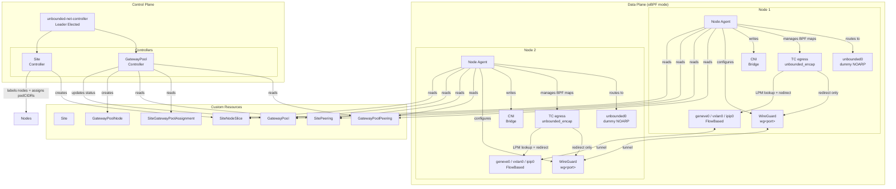

## Component Details

### Controller (`unbounded-net-controller`)

The controller runs as a Deployment with 2 replicas for high availability. Only the leader actively reconciles resources.

#### Pod CIDR Assignment (Site Controller)

Pod CIDRs are assigned by the Site controller based on per-site assignment rules:

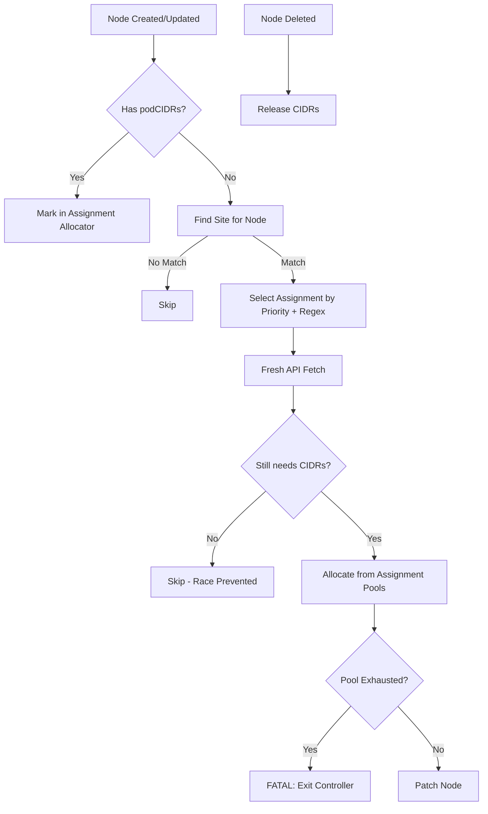

**Key Design Decisions:**
- Fresh API fetch before allocation prevents double-allocation from stale informer cache
- Pool exhaustion is fatal to surface the problem immediately
- Pod CIDRs are marked as allocated in assignment allocators based on current site rules

#### Site Controller

Manages site membership and SiteNodeSlice objects:

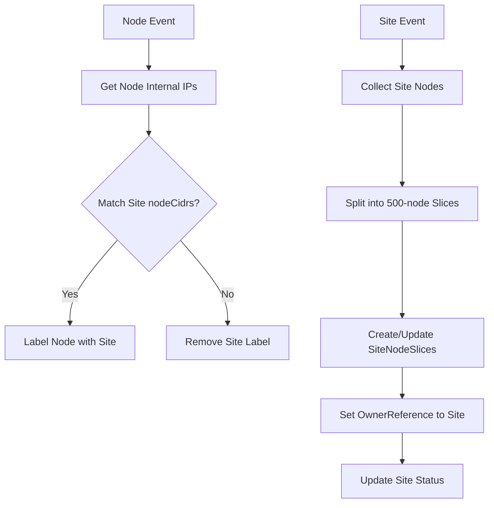

**SiteNodeSlice Design:**
- Maximum 500 nodes per slice (prevents etcd object size limits)
- Slices named `{site-name}-{index}` (e.g., `site-east-0`, `site-east-1`)
- OwnerReferences enable automatic garbage collection when Site is deleted

#### GatewayPool Controller

Maintains gateway node information:

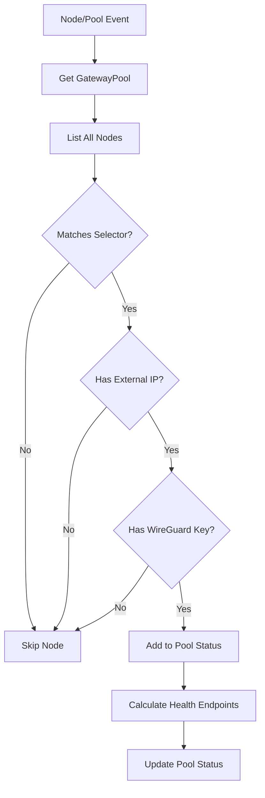

### Node Agent (`unbounded-net-node`)

The node agent runs as a DaemonSet on every node, including control plane nodes. It manages WireGuard interfaces, tunnel configuration, eBPF program lifecycle and BPF map reconciliation, route programming, and CNI configuration. A companion `unroute` debug tool can dump and query BPF LPM trie maps for tunnel endpoint resolution diagnostics.

#### Initialization Flow

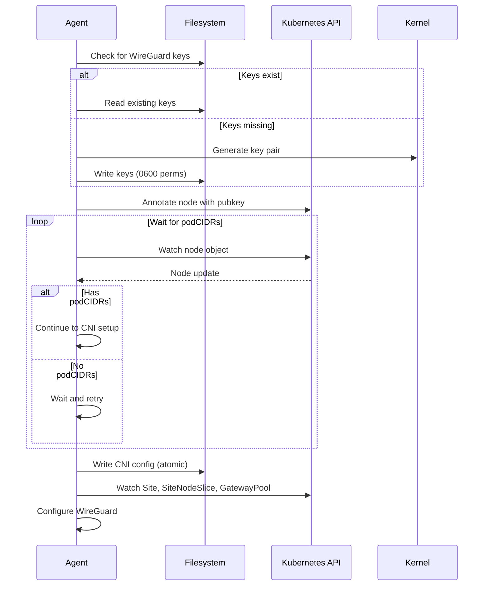

#### WireGuard Interface Architecture

**Regular Nodes:**

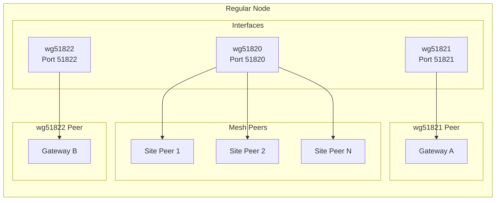

**Gateway Nodes:**

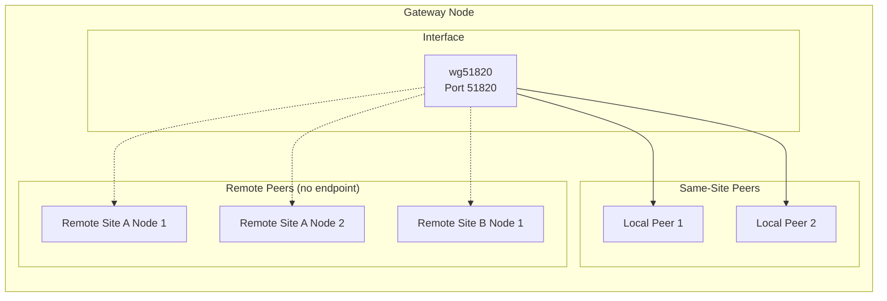

#### Route Management

Routes are programmed directly into the kernel via netlink using nexthop objects. No external routing daemon is involved.

#### Encapsulation Types

The node agent supports multiple encapsulation types for tunnel links:

- **WireGuard**: Encrypted tunneling using the WireGuard protocol. Used by default for links that traverse untrusted networks (external/public IPs). Overhead: 80 bytes (IPv6 worst case).
- **GENEVE**: Unencrypted Generic Network Virtualization Encapsulation. Used by default for links using only internal IPs (same-site, network-peered sites, internal gateway pools). Overhead: 58 bytes. A single `geneve0` interface with FDB entries handles all GENEVE peers for higher throughput on high-bandwidth links.
- **VXLAN**: VXLAN encapsulation using a single external flow-based `vxlan0` interface. Similar overhead to GENEVE (~58 bytes). Useful when the underlying network has better VXLAN hardware offload support.
- **IPIP**: IP-in-IP tunneling with minimal overhead (20 bytes). Uses per-peer tunnel interfaces. Best for environments where encryption is not needed and minimal encapsulation overhead is desired.
- **None**: Direct routing with no encapsulation. Requires L3 reachability between nodes. Zero overhead but no isolation.
- **Auto**: System selects based on link characteristics. Links using external IPs resolve to WireGuard; links using only internal IPs resolve to GENEVE (configurable via `--preferred-private-encap` and `--preferred-public-encap` flags).

The `tunnelProtocol` field on Site, GatewayPool, SitePeering, SiteGatewayPoolAssignment, and GatewayPoolPeering specs controls the selection. When set to `Auto` (the default), the system chooses based on link characteristics. The **security-wins rule** means that if any scope in the hierarchy explicitly sets `WireGuard`, the link uses WireGuard regardless of other scopes.

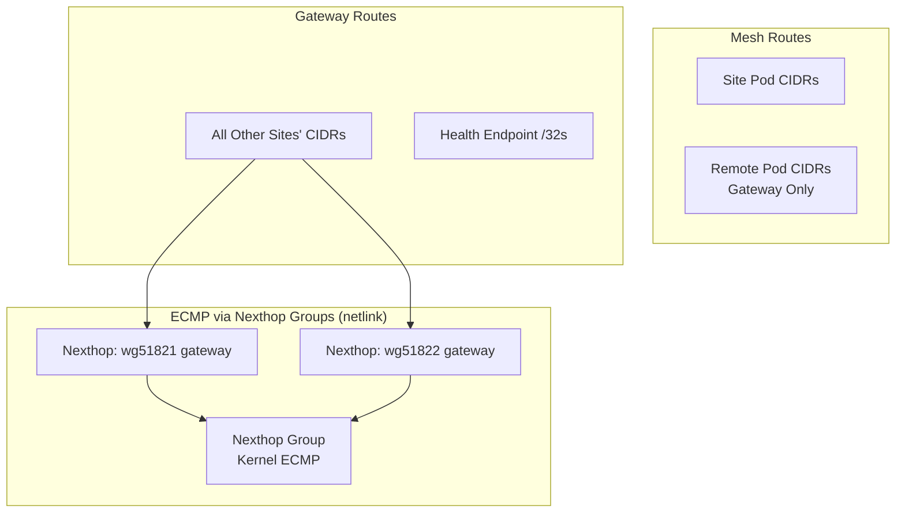

## Tunnel Dataplane Modes

The node agent supports two tunnel dataplane modes, selected by the `--tunnel-dataplane` flag: `ebpf` (default) and `netlink`.

### eBPF Dataplane (default)

The eBPF dataplane uses a single dummy device (`unbounded0`) as a routing anchor, a TC egress BPF program for tunnel endpoint resolution, and shared flow-based tunnel interfaces. This design avoids per-peer interface creation and scales to large meshes with minimal kernel resource usage.

#### Architecture

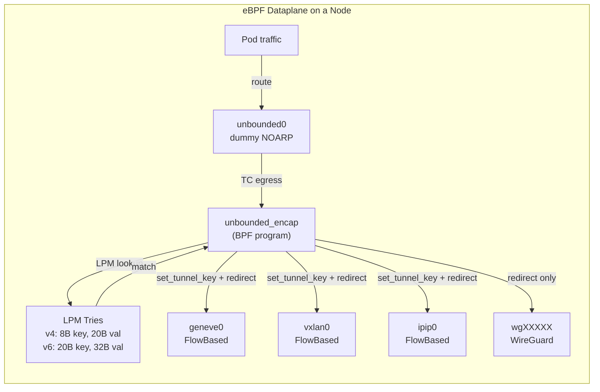

#### unbounded0 Device

`unbounded0` is a **dummy** network interface configured with:

- `NOARP` flag (no ARP resolution needed)
- Overlay IPs assigned directly (scope global)
- Supernet routes pointing to it for all remote pod CIDRs
- A `clsact` qdisc for TC program attachment

All traffic destined for remote overlay CIDRs is routed to `unbounded0`, where the TC egress BPF program intercepts it.

#### TC Egress BPF Program

The `unbounded_encap` program (defined in `bpf/unbounded_encap.c`) is attached as a TC egress classifier on `unbounded0`. For each outgoing packet, it:

1. Extracts the destination IP (v4 or v6)
2. Performs an LPM (longest-prefix-match) lookup against the appropriate BPF trie map
3. If the entry has `TUNNEL_F_SET_KEY` set, calls `bpf_skb_set_tunnel_key()` with the remote endpoint address and tunnel ID
4. If the entry has `TUNNEL_F_IPV6_UNDERLAY` set, uses the IPv6 remote address with `BPF_F_TUNINFO_IPV6`
5. Derives a deterministic inner Ethernet destination MAC and rewrites the packet header
6. Calls `bpf_redirect()` to send the packet to the target tunnel interface

#### BPF LPM Trie Maps

Two maps store overlay CIDR to tunnel endpoint mappings:

| Map | Key struct | Key size | Value struct | Value size |
|-----|-----------|----------|-------------|------------|
| `unbounded_endpoints_v4` | `lpm_key_v4` (prefixlen + IPv4 addr) | 8 bytes | `tunnel_endpoint_v4` (5x u32) | 20 bytes |
| `unbounded_endpoints_v6` | `lpm_key_v6` (prefixlen + IPv6 addr) | 20 bytes | `tunnel_endpoint_v6` (IPv6 union + 4x u32) | 32 bytes |

Both maps are `BPF_MAP_TYPE_LPM_TRIE` with `BPF_F_NO_PREALLOC` and a default max of 16384 entries.

Each map entry contains:

- **Remote IP**: The underlay endpoint address for the tunnel
- **Interface index**: The target tunnel interface for `bpf_redirect()`
- **Flags**: Bitmask controlling tunnel behavior
  - `TUNNEL_F_SET_KEY` (0x01) -- set tunnel key/metadata (used by GENEVE, VXLAN, IPIP)
  - `TUNNEL_F_IPV6_UNDERLAY` (0x04) -- use IPv6 underlay addressing
- **Protocol**: Diagnostic identifier for the entry type
  - `PROTO_GENEVE` (1), `PROTO_VXLAN` (2), `PROTO_IPIP` (3), `PROTO_WIREGUARD` (4), `PROTO_NONE` (5)
  - The protocol field is stored for observability and diagnostic tooling (e.g., `unroute`) but does not drive BPF program behavior

#### BPF Map Reconciliation

The node agent reconciles BPF map entries whenever the desired peer state changes. Entries are accumulated into a pending map (`state.pendingBPFEntries`) across all peer configuration functions, then a single `Reconcile()` call:

1. Iterates existing LPM entries
2. Deletes stale entries no longer in the desired set
3. Upserts new or changed entries
4. Keeps IPv4 and IPv6 tries synchronized

#### Shared Tunnel Interfaces

In eBPF mode, tunnel interfaces are shared across all peers of the same type:

- **`geneve0`**: Flow-based GENEVE interface. BPF sets the remote endpoint and VNI via `bpf_skb_set_tunnel_key()`.
- **`vxlan0`**: Flow-based VXLAN interface. Same metadata-driven approach as GENEVE.
- **`ipip0`**: Flow-based IP-in-IP interface. Tunnel key sets the remote endpoint.
- **WireGuard (`wgXXXXX`)**: Not flow-based. BPF performs redirect-only (no tunnel key). Crypto routing is handled by the WireGuard driver using AllowedIPs on each peer. Multiple WireGuard interfaces may exist (one per port/gateway link).

#### Deterministic MAC Derivation

The BPF program and Go code both derive the inner Ethernet destination MAC deterministically from the destination IP, avoiding the need for ARP/ND on tunnel interfaces:

- **IPv4**: `02:<ip[0]>:<ip[1]>:<ip[2]>:<ip[3]>:FF`
- **IPv6**: `02:<last 4 bytes of IPv6>:FF`

This MAC is written into the Ethernet header before `bpf_redirect()` and is also configured on tunnel interface endpoints so the receiving side accepts the frame.

#### rp_filter Requirements

Reverse path filtering must be disabled on tunnel interfaces because decapsulated packets arrive on `geneve0`/`vxlan0`/`ipip0` while the overlay routes point to `unbounded0`. The node agent writes `0` to:

- `/proc/sys/net/ipv4/conf/<tunnel-iface>/rp_filter`
- `/proc/sys/net/ipv4/conf/all/rp_filter`
- `/proc/sys/net/ipv4/conf/default/rp_filter`

The node init script sets `net.ipv4.conf.all.rp_filter=0` and `net.ipv4.conf.default.rp_filter=0` so that newly created tunnel interfaces inherit the correct value. The node agent also explicitly writes `0` after creating each tunnel interface as defense-in-depth.

Writes go through `/proc/1/root/proc/sys/` to bypass the container procfs overlay, which silently discards direct `/proc/sys/` writes. The kernel also resets `rp_filter` on remaining interfaces when an interface is deleted, so `disableRPFilter()` is reapplied after interface cleanup.

### Netlink Dataplane

The netlink dataplane uses per-peer tunnel interfaces and kernel routing tables with a dedicated routing table and ip rule:

- Each GENEVE/VXLAN/IPIP peer gets a dedicated tunnel interface
- Routes are programmed with lightweight tunnel encap (`ip_encap`) into a separate routing table
- An ip rule directs overlay traffic to the dedicated table
- WireGuard interfaces work identically in both modes

The netlink dataplane is simpler but creates more kernel objects (interfaces, routes) as the mesh grows.

### unroute Debug Tool

The `unroute` tool (`cmd/unroute/main.go`) is a diagnostic utility for the eBPF dataplane. It can:

- Dump all entries in the `unbounded_endpoints_v4` and `unbounded_endpoints_v6` LPM trie maps
- Perform longest-prefix-match lookups for specific IPs to show which tunnel endpoint would be selected
- Dump the `local_cidrs` map
- Output in human-readable text or JSON format

## Data Flow

### Pod-to-Pod Communication (Same Site, eBPF mode)

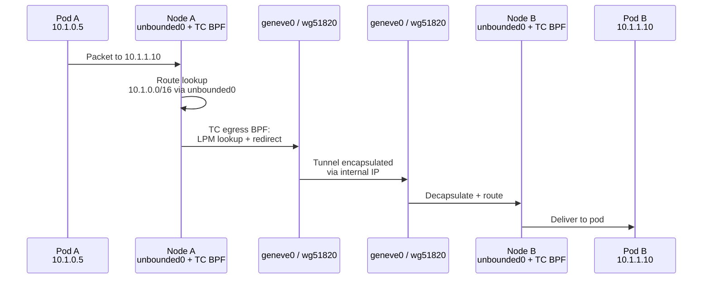

### Pod-to-Pod Communication (Cross-Site)

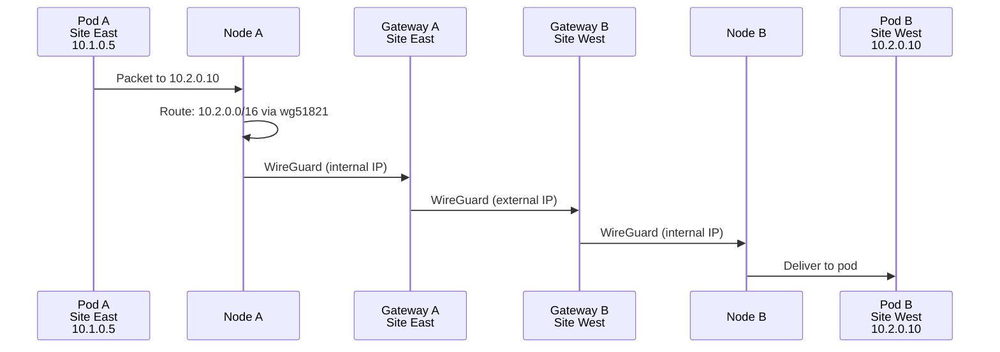

### Gateway Health Check Flow

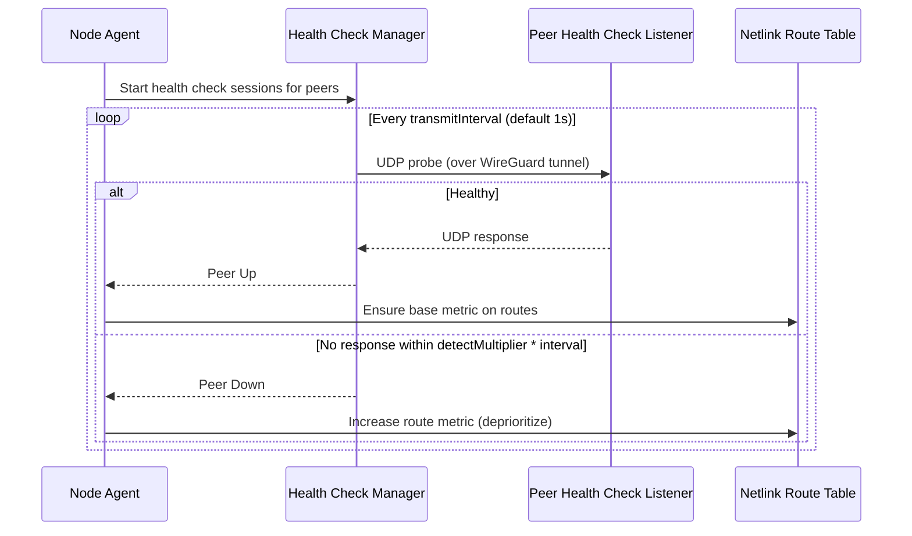

**Key Design Decisions:**
- Probes are sent and received over WireGuard tunnels at configurable intervals (default 1s)
- Failure detection uses `detectMultiplier * max(transmitInterval, receiveInterval)` to determine when a peer is down
- On failure, route metrics are increased to deprioritize unhealthy paths rather than removing routes entirely
- On recovery, route metrics are restored to their base values

### Push-Based Status Aggregation

Node agents periodically push their status to the controller, which caches and broadcasts updates to dashboard clients via WebSocket.

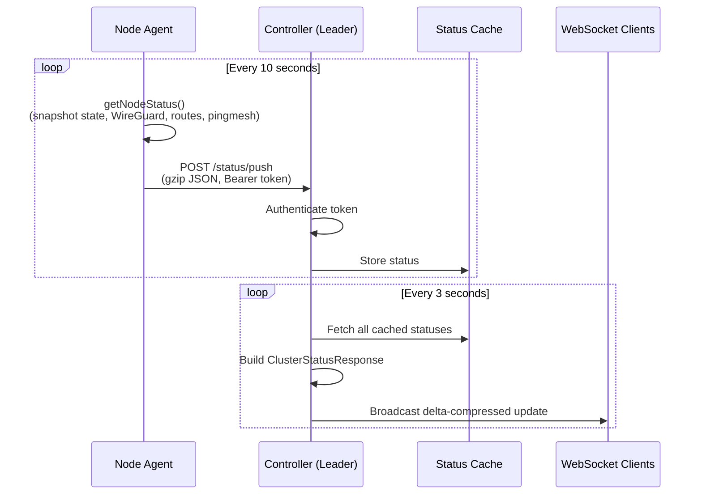

**Key Design Decisions:**
- The controller Service has **no selector** -- the leader manages its own EndpointSlice, ensuring only the leader receives pushes
- On leader election, the controller cleans up stale `v1/Endpoints` resources left by previous controller versions to prevent kube-proxy routing to dead pods
- HTTP POST is sent asynchronously with an atomic in-flight guard to prevent ticker drift
- Status collection uses a snapshot-and-release pattern to minimize lock hold time
- A pod informer watches `unbounded-net-node` pods to display pod name, restart count, and age in the dashboard

## State Management

### Controller State

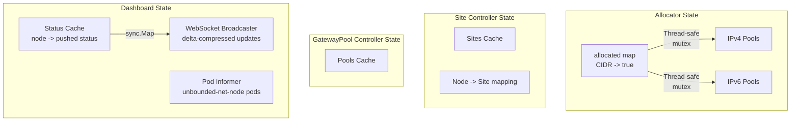

### Node Agent State

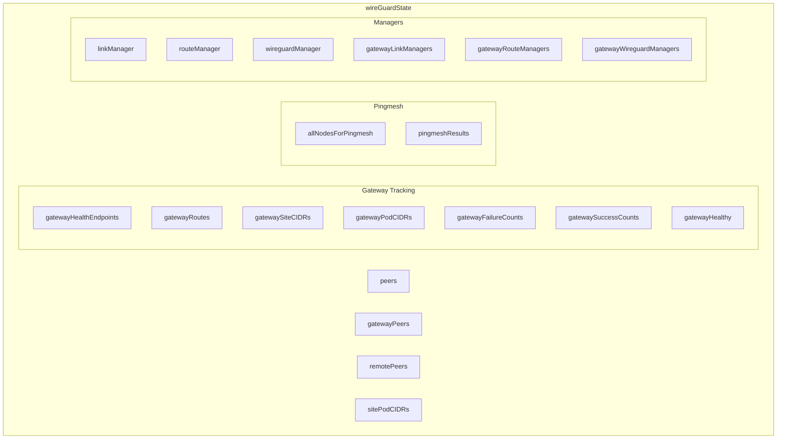

## Security Model

### WireGuard Security

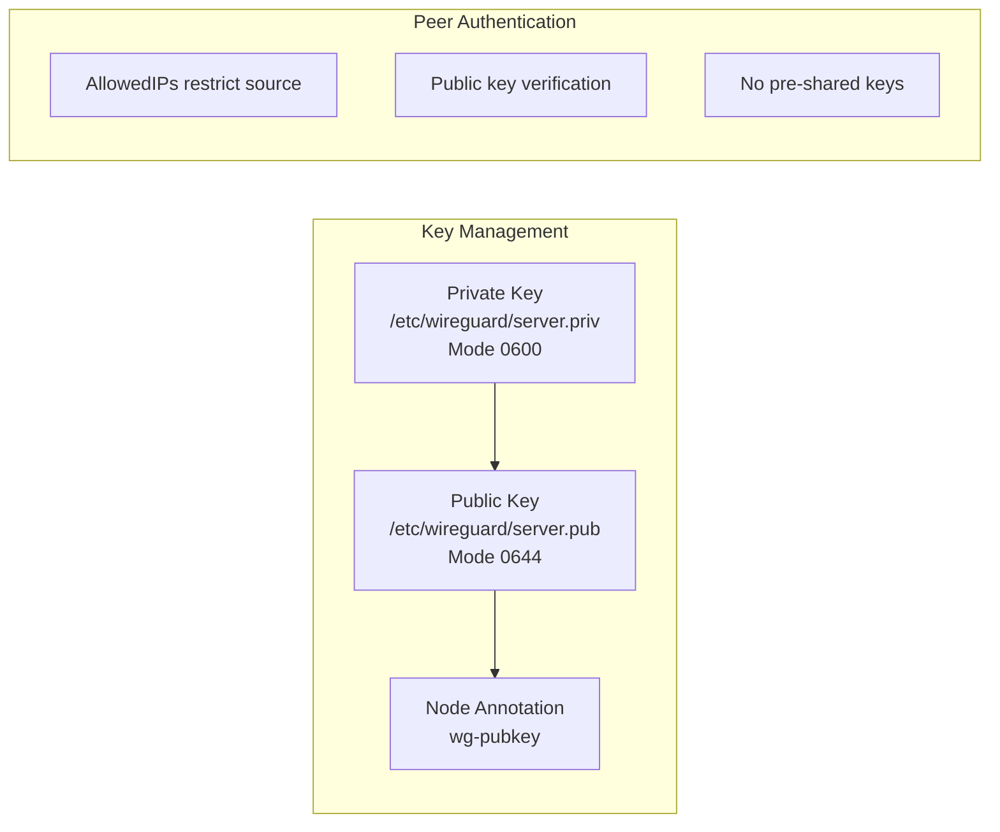

> **Unencrypted Tunnel Note:** GENEVE, VXLAN, IPIP, and None tunnels do not provide encryption. They are designed for trusted internal networks where encryption overhead would limit throughput on high-bandwidth links (100Gbps+). The `tunnelProtocol` field's Auto mode ensures that links crossing untrusted boundaries (external IPs) automatically use WireGuard. The security-wins hierarchy rule prevents accidental downgrade to unencrypted tunneling when any scope explicitly requests WireGuard.

### RBAC Model

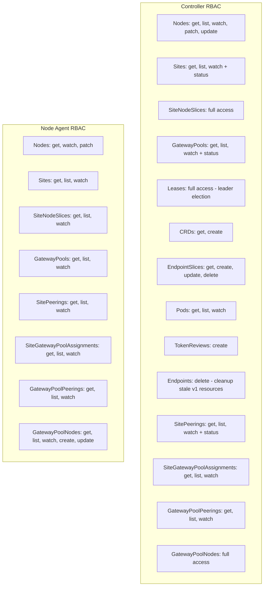

### Gateway Node Isolation

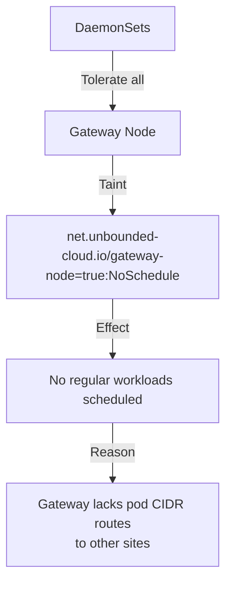

## Failure Modes and Recovery

### Controller Failure

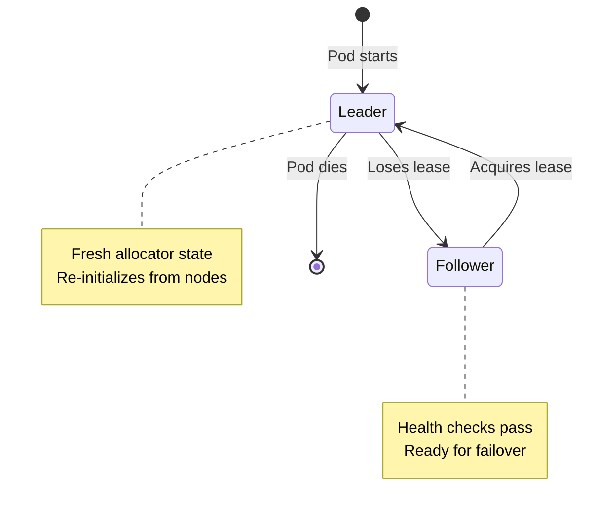

### Gateway Failure

```mermaid
stateDiagram-v2
    [*] --> New
    New --> Healthy: N successes
    New --> New: failure (reset count)
    Healthy --> Degraded: 1 failure
    Degraded --> Healthy: Success (reset count)
    Degraded --> Unhealthy: N failures (configurable)
    Unhealthy --> Recovering: 1 success
    Recovering --> Unhealthy: failure (reset count)
    Recovering --> Healthy: N successes

    note right of New: Gateways start unhealthy<br/>Must prove connectivity first
    note right of Unhealthy: Route metrics increased<br/>Unhealthy paths deprioritized<br/>Traffic fails over
    note right of Recovering: Symmetric recovery:<br/>Same successes needed<br/>as failures to go down
```

### Network Partition

```mermaid
graph TD
    subgraph "Site A"
        A1[Node 1]
        A2[Node 2]
        AG[Gateway]
    end

    subgraph "Site B"
        B1[Node 1]
        B2[Node 2]
        BG[Gateway]
    end

    AG ---|Partition| BG

    A1 -->|Still works| A2
    B1 -->|Still works| B2
    A1 -.->|Fails until<br/>recovery| B1
```

## Performance Considerations

### Informer-Based Architecture

All components use Kubernetes informers rather than polling:

- Efficient watch-based updates
- Local caching reduces API server load
- Immediate reaction to changes

### Differential Updates

All configuration managers use differential (delta) updates to minimize disruption:

```mermaid
flowchart LR
    D[Desired State] --> C{Compare}
    A[Actual State] --> C
    C --> Add[Add Missing]
    C --> Remove[Remove Extra]
    C --> Keep[Keep Matching]
```

**Components using delta updates:**

| Component | What it manages | Delta behavior |
|-----------|-----------------|----------------|
| **WireGuard Manager** | Peer configuration | Compares current vs desired peers; only adds new, updates changed, removes stale |
| **Route Manager** | IP routes | Tracks expected routes per interface; only modifies differences |
| **Link Manager** | Network interfaces | Creates/updates interfaces; removes stale gateway interfaces |
| **Masquerade Manager** | iptables NAT rules | Compares current vs desired rules; only adds/removes differences |
| **ECMP Route Manager** | Multi-path routes | Adds/removes gateways from ECMP nexthop groups |
| **BPF Map Reconciler** | LPM trie entries (eBPF mode) | Iterates existing map entries; deletes stale, upserts changed, keeps matching |

This approach ensures:
- No unnecessary interface flapping
- No route table churn during configuration resyncs
- Minimal iptables rule updates
- Preserved WireGuard handshakes for unchanged peers

### ECMP Load Balancing

Multiple gateway interfaces enable kernel-level ECMP load balancing via netlink nexthop groups:

- Routes programmed directly into the kernel using nexthop objects
- Nexthop groups provide ECMP across multiple gateway interfaces
- Kernel automatically distributes traffic per-flow (same flow = same path)

In eBPF dataplane mode, BPF-level ECMP is also available. Each LPM trie entry
supports up to 4 nexthops per CIDR prefix with **HRW (Highest Random Weight)**
consistent hashing. HRW selects a nexthop per 5-tuple flow so that when a
nexthop fails, only flows assigned to that nexthop are rehashed. Each nexthop
has a `TUNNEL_F_HEALTHY` flag updated by the health check system; unhealthy
nexthops are skipped by the BPF program. Healthcheck probes (UDP 9997) are
always forwarded regardless of health state to enable recovery detection.

> **Note:** Policy-based routing (PBR) using connmark/fwmark/ip-rule is
> deprecated. Cross-site transit forwarding now uses per-interface iptables
> FORWARD ACCEPT rules (`iptables -I FORWARD 1 -i <iface> -j ACCEPT`) on
> tunnel and WireGuard gateway interfaces. The `enablePolicyRouting` option
> defaults to `false` and is retained only for backward compatibility.
