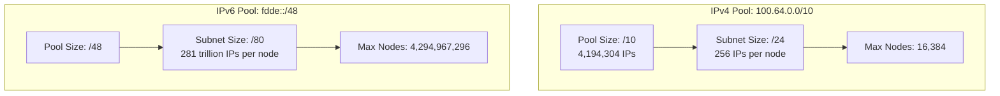
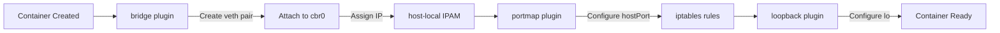
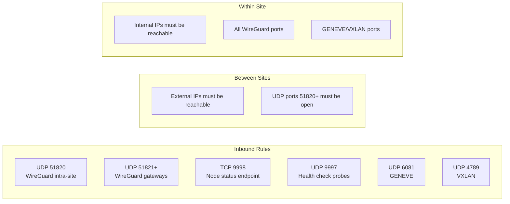
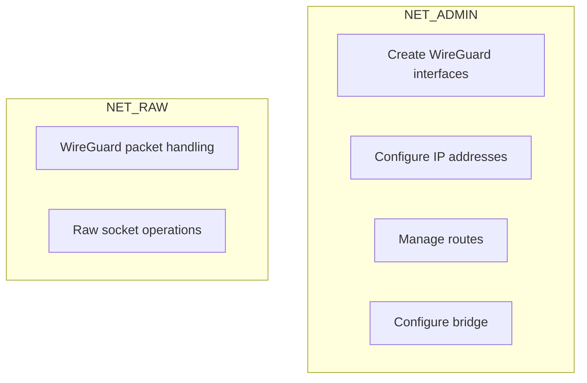

<!-- Copyright (c) Microsoft Corporation. Licensed under the MIT License. -->

# Configuration Reference

This document describes all configuration options for unbounded-net components.

## Runtime Configuration

Both binaries now load runtime settings from a shared YAML file mounted from the `unbounded-net-config` ConfigMap.

- Default path: `/etc/unbounded-net/config.yaml`
- Override path: `--config-file=<path>`
- Startup behavior: fail-fast if the config file is missing or invalid
- CLI flags still work as explicit overrides when set

### Runtime config structure

```yaml
common:
  # Optional. Used only when building Azure Portal links in the UI.
  # Set this only if the managed VMs are in a different tenant than the
  # administrator's signed-in Azure Portal tenant.
  azureTenantId: ""
  # Override the Kubernetes API server URL used by both the controller and node
  # agent. When empty (the default), in-cluster discovery is used. Populated
  # automatically by `make -C hack/net deploy` from the current kubeconfig context.
  apiserverURL: ""
  # klog verbosity level (0-10). Watched for changes at runtime; editing the
  # ConfigMap updates the log level without a pod restart.
  logLevel: 2

controller:
  healthPort: 9999
  nodeAgentHealthPort: 9998
  informerResyncPeriod: 300s
  statusStaleThreshold: 40s
  statusWebsocketKeepaliveInterval: 10s
  statusWsKeepaliveFailureCount: 2
  registerAggregatedAPIServer: true
  leaderElection:
    enabled: true
    leaseDuration: 15s
    renewDeadline: 5s
    retryPeriod: 10s
    resourceNamespace: kube-system
    resourceName: unbounded-net-controller

node:
  cniConfDir: /host/etc/cni/net.d
  cniConfFile: 10-unbounded.conflist
  bridgeName: cbr0
  wireGuardDir: /host/etc/wireguard
  wireGuardPort: 51820
  enablePolicyRouting: false    # Deprecated -- PBR replaced by per-interface FORWARD ACCEPT rules
  mtu: 1280
  healthPort: 9998
  informerResyncPeriod: 3600s
  statusWebsocketEnabled: true
  statusWebsocketURL: ""
  statusWebsocketApiserverMode: fallback
  statusWebsocketApiserverURL: wss://$(KUBERNETES_SERVICE_HOST)/apis/status.net.unbounded-kube.io/v1alpha1/status/nodews
  statusWebsocketApiserverStartupDelay: 60s
  statusWebsocketKeepaliveInterval: 10s
  statusWsKeepaliveFailureCount: 2
  shutdownRemoveWireGuardConfiguration: false
  cleanupNetlinkOnShutdown: false
  shutdownRemoveMasqueradeRules: false
  criticalDeltaEvery: 1s
  statsDeltaEvery: 15s
  statusPushEnabled: true
  statusPushURL: ""
  statusPushDelta: true
  statusPushInterval: 10s
  statusPushApiserverInterval: 30s
  healthCheckPort: 9997
  baseMetric: 1
  routeTableId: 252
  fullSyncEvery: 120s
  healthFlapMaxBackoff: 120s
  kubeProxyHealthInterval: 30s
  preferredPrivateEncap: GENEVE
  preferredPublicEncap: WireGuard
  vxlanPort: 4789
  vxlanSrcPortLow: 47891
  vxlanSrcPortHigh: 47922
  genevePort: 6081
  geneveVni: 1
  geneveInterfaceName: geneve0
  tunnelDataplane: ebpf
  tunnelDataplaneMapSize: 16384
  tunnelIPFamily: IPv4
```

## Controller Configuration

### Pod CIDR Assignment (Site CRD)

Pod CIDR allocation is configured per Site using `spec.podCidrAssignments`.

### Leader Election

| Flag | Type | Default | Description |
|------|------|---------|-------------|
| `--leader-elect` | bool | `false` | Enable leader election for HA. |
| `--leader-elect-lease-duration` | duration | `15s` | Duration of the leader lease. |
| `--leader-elect-renew-deadline` | duration | `5s` | Deadline for renewing leadership. |
| `--leader-elect-retry-period` | duration | `10s` | Retry period for acquiring leadership. |

### Health and Monitoring

| Flag | Type | Default | Description |
|------|------|---------|-------------|
| `--health-port` | int | `9999` | Port for health check HTTP server (0 to disable). |
| `--node-agent-health-port` | int | `9998` | Port where node agents serve their health/status endpoints. Used for dashboard links. |
| `--status-stale-threshold` | duration | `40s` | Duration after which a node's pushed status is considered stale (~4x the default 10s push interval). |
| `--status-ws-keepalive-interval` | duration | `10s` | Interval between controller websocket keepalive pings for node status streams (`0s` disables pings). |
| `--status-ws-keepalive-failure-count` | int | `2` | Sequential websocket keepalive ping failures before the controller closes a node status websocket. |
| `--register-aggregated-apiserver` | bool | `true` | Enable aggregated API server status endpoints (`/apis/status.net.unbounded-kube.io/v1alpha1/status/*`). |
| `--informer-resync-period` | duration | `300s` | How often informers resync with the API server. |
| `--kube-proxy-health-interval` | duration | `30s` | Interval between kube-proxy health checks. 0s disables. |

### Logging

| Flag | Type | Default | Description |
|------|------|---------|-------------|
| `-v` | int | `0` | Log verbosity level (0-10). |
| `--logtostderr` | bool | `true` | Log to stderr instead of files. |

### Example Configuration

```yaml
apiVersion: net.unbounded-kube.io/v1alpha1
kind: Site
metadata:
  name: site-east
spec:
  nodeCidrs:
    - "10.0.0.0/16"
  podCidrAssignments:
    - assignmentEnabled: true
      cidrBlocks:
        - "100.64.0.0/10"
        - "fdde::/48"
      nodeBlockSizes:
        ipv4: 24
        ipv6: 80
      nodeRegex:
        - "^worker-.*"
      priority: 100
```

### CIDR Pool Sizing



---

## Node Agent Configuration

### General

| Flag | Type | Default | Environment | Description |
|------|------|---------|-------------|-------------|
| `--kubeconfig` | string | - | - | Path to kubeconfig (uses in-cluster config if not set). |
| `--node-name` | string | - | `NODE_NAME` | Name of this node (required). |
| `--health-port` | int | `9998` | - | Port for health check server (0 to disable). |
| `--informer-resync-period` | duration | `3600s` | - | Informer resync period. |
| `--route-table-id` | int | `252` | - | Custom routing table ID for policy routing. **Deprecated** -- PBR is replaced by per-interface FORWARD ACCEPT rules; see `--enable-policy-routing`. |
| `--kube-proxy-health-interval` | duration | `30s` | - | Interval between kube-proxy health checks. 0s disables. |
| `--preferred-private-encap` | string | `GENEVE` | - | Preferred encapsulation for internal (private IP) links. |
| `--preferred-public-encap` | string | `WireGuard` | - | Preferred encapsulation for external (public IP) links. |
| `--health-flap-max-backoff` | duration | `120s` | - | Maximum backoff for health check flap dampening. |
| `--status-full-sync-interval` | duration | `2m` | - | Interval between full status sync pushes. |

### CNI Configuration

| Flag | Type | Default | Description |
|------|------|---------|-------------|
| `--cni-conf-dir` | string | `/etc/cni/net.d` | Directory to write CNI configuration. |
| `--cni-conf-file` | string | `10-unbounded.conflist` | Name of the CNI configuration file. |
| `--bridge-name` | string | `cbr0` | Name of the bridge interface. |
| `--mtu` | int | `1280` | MTU for tunnel and bridge interfaces. Must be set to the lowest physical-link MTU of any node in the cluster minus the encapsulation overhead -- 80 bytes for WireGuard, 58 bytes for GENEVE/VXLAN, or 20 bytes for IPIP. The system auto-selects the correct overhead based on the encapsulation type for each link. The node agent clamps the effective MTU to `min(configured, detected)` so packets are never larger than the physical link can carry. A value of `0` is treated as `1280`. See [MTU Guidance](#mtu-guidance) below. |

### MTU Guidance

The `node.mtu` setting controls the MTU used on tunnel interfaces (WireGuard,
GENEVE, VXLAN, and IPIP) and the CNI bridge. WireGuard adds 80 bytes of
encapsulation overhead, GENEVE and VXLAN add 58 bytes, and IPIP adds 20 bytes.
The tunnel MTU must be lower than the underlying network interface MTU.

**Formula:** `node.mtu = <lowest physical-link MTU of any node in the cluster> - 80`

(Using 80, the largest overhead, ensures the value is safe for all tunnel types.)

For example, if all nodes have a 1500-byte link MTU, set `node.mtu` to `1420`.
If some nodes have jumbo frames (9000) but others have standard Ethernet (1500),
the configured MTU must be based on the smallest value: `1500 - 80 = 1420`.

**Behavior:**
- Each node agent detects its default-route interface MTU at startup and on
  every reconciliation, then annotates itself with
  `net.unbounded-kube.io/tunnel-mtu` (the detected max tunnel MTU).
- The effective MTU applied to each tunnel interface is
  `min(configured MTU, detected MTU)`, so a node with a smaller physical link
  will automatically clamp down even if the configured value is higher.
- If the configured MTU exceeds the detected maximum, the node agent logs an
  error and surfaces an `mtuMismatch` node error in the status payload.
- The controller reads `node.mtu` from the shared configmap and compares it
  against every node's `tunnel-mtu` annotation. Mismatches are reported as
  warnings on the status page and in the controller logs.
- A value of `0` is normalized to `1280` (the IPv6 minimum MTU).

### WireGuard Configuration

| Flag | Type | Default | Description |
|------|------|---------|-------------|
| `--wireguard-dir` | string | `/etc/wireguard` | Directory to store WireGuard keys. |
| `--wireguard-port` | int | `51820` | WireGuard listen port. |

### GENEVE Configuration

| Flag | Type | Default | Description |
|------|------|---------|-------------|
| `--geneve-port` | int | `6081` | GENEVE UDP destination port. |
| `--geneve-vni` | int | `1` | GENEVE Virtual Network Identifier. |
| `--geneve-interface` | string | `geneve0` | Name of the GENEVE tunnel interface. |

GENEVE is the default tunnel type for links between peers that communicate over internal IPs only. It provides higher throughput than WireGuard on high-bandwidth links (100Gbps+) by eliminating encryption overhead. The `tunnelProtocol` field on CRD specs controls which encapsulation is used; when set to `Auto` (the default), links using external IPs use WireGuard and links using only internal IPs use GENEVE.

### VXLAN Configuration

| Flag | Type | Default | Description |
|------|------|---------|-------------|
| `--vxlan-port` | int | `4789` | VXLAN UDP destination port. |
| `--vxlan-src-port-low` | int | `47891` | VXLAN UDP source port range low bound. A narrow range reduces the number of distinct flows created from VMs, helping avoid flow table limits on cloud platforms. |
| `--vxlan-src-port-high` | int | `47922` | VXLAN UDP source port range high bound. |

VXLAN uses a single external flow-based `vxlan0` interface. Similar to GENEVE but may benefit from hardware VXLAN offload on some network adapters.

The `--vxlan-src-port-low` and `--vxlan-src-port-high` flags constrain the ephemeral UDP source port range used by VXLAN. Keeping the range narrow (the default spans 32 ports) limits the number of distinct 5-tuple flows originating from a VM, which helps stay within per-VM flow table limits imposed by some cloud platforms (e.g., Azure).

### IPIP Configuration

IPIP tunneling uses per-peer tunnel interfaces with minimal overhead (20 bytes). No additional configuration flags are required -- IPIP interfaces are created and managed automatically when `tunnelProtocol` is set to `IPIP`.

### Tunnel Dataplane

| Flag | Type | Default | Description |
|------|------|---------|-------------|
| `--tunnel-dataplane` | string | `ebpf` | Tunnel dataplane mode. `ebpf` uses BPF LPM tries on the `unbounded0` interface for per-destination tunnel redirection. `netlink` uses traditional per-peer interfaces and kernel routes. |
| `--tunnel-dataplane-map-size` | int | `16384` | Maximum number of entries in each BPF LPM trie map. Only used when `--tunnel-dataplane=ebpf`. |

When `--tunnel-dataplane=ebpf`, the node agent attaches BPF programs to the `unbounded0` interface and populates LPM trie maps with destination CIDR-to-tunnel mappings. This replaces per-peer tunnel interfaces with a single interface and BPF-driven forwarding, reducing netlink state and improving convergence at scale.

Each LPM trie entry supports up to 4 nexthops per CIDR prefix with **ECMP via HRW (Highest Random Weight / rendezvous) hashing**. The BPF program selects a nexthop deterministically per 5-tuple flow so that only flows affected by a nexthop change are rehashed. Each nexthop carries a `TUNNEL_F_HEALTHY` flag maintained by the health check system; unhealthy nexthops are skipped during forwarding, while healthcheck probes (UDP 9997) are always forwarded to enable recovery detection.

When `--tunnel-dataplane=netlink`, the node agent creates individual tunnel interfaces for each peer and programs kernel routes, matching the legacy behavior.

### Tunnel IP Family

| Flag | Type | Default | Description |
|------|------|---------|-------------|
| `--tunnel-ip-family` | string | `IPv4` | Controls which IP address family is used for tunnel encapsulation underlay. Valid values: `IPv4`, `IPv6`. |

This setting determines the address family of the outer (underlay) IP header for tunnel encapsulation. When set to `IPv6`, tunnel endpoints use IPv6 addresses for the outer header. The inner (overlay) traffic can still be dual-stack regardless of this setting.

### Tunnel Protocol Selection

The `tunnelProtocol` field is available on all scope CRDs (Site, SitePeering, GatewayPool, SiteGatewayPoolAssignment, GatewayPoolPeering). Valid values:

| Value | Overhead | Encrypted | Use Case |
|-------|----------|-----------|----------|
| `WireGuard` | 80 bytes | Yes | Cross-site links over public/untrusted networks |
| `GENEVE` | 58 bytes | No | High-throughput internal links (100Gbps+) |
| `VXLAN` | ~58 bytes | No | Internal links with VXLAN hardware offload |
| `IPIP` | 20 bytes | No | Minimal overhead internal links |
| `None` | 0 bytes | No | Direct L3 routing (requires reachability) |
| `Auto` | Varies | Varies | System selects based on link type (default) |

When set to `Auto`, links using external IPs use WireGuard and links using only internal IPs use the preferred private encapsulation (configurable via `--preferred-private-encap`, default `GENEVE`).

The **security-wins rule** ensures that if any scope in the hierarchy explicitly sets `WireGuard`, the link uses WireGuard regardless of other scopes.

### Health Check (UDP Probe over Tunnel)

The health check protocol provides sub-second failure detection for overlay peers using a custom UDP probe protocol (similar to SBFD) running over all tunnel types. Sessions are automatically created for all routes with nexthops (supernet/RoutedCidrs routes, podCIDR routes, and internal IP routes). Bootstrap routes (/32 and /128 host routes for peer nexthops) do not use health checks to avoid a chicken-and-egg dependency.

**Health Check Behavior:**
- Health check sessions are managed automatically for all routed traffic
- Session status is displayed on the `/status` endpoint
- Health checks replace the legacy gateway health checking mechanism -- route metric adjustment on health check failure provides faster and more reliable failover
- No additional configuration flags are needed -- health checks are always active for routed traffic

**Health Check Settings Precedence (CRDs):**
- `Site.spec.healthCheckSettings` applies to node-to-node routes within the same site.
- `SitePeering.spec.healthCheckSettings` applies to node-to-node routes between sites in that peering.
- `GatewayPool.spec.healthCheckSettings` applies to routes from nodes to peers in that gateway pool.
- `GatewayPoolPeering.spec.healthCheckSettings` applies to routes between gateway pools in that peering.

For gateway-pool routes, precedence is:
1. `SiteGatewayPoolAssignment.spec.healthCheckSettings`
2. `GatewayPool.spec.healthCheckSettings`
3. `Site.spec.healthCheckSettings`

If multiple peerings define conflicting health check settings for the same target site or gateway pool,
the controller processes peerings in deterministic name order and keeps the first profile,
logging both the kept and ignored peering/profile details.

### Node-to-controller status transport

The node agent uses configurable API server mode for websocket and push behavior:

1. WebSocket transport (`/status/nodews` and aggregated API path) with JSON full+delta messages, auth via service account token, and compression.
2. Periodic HTTP push (`/status/push` and aggregated API path) when websocket is unavailable or configured for periodic reconciliation.
3. Controller pull fallback when push data is stale/unavailable.

`node.criticalDeltaEvery` (default `1s`) and `node.statsDeltaEvery` (default `15s`) are maximum publish frequencies.
The node only sends a delta when fields changed, and changed fields are queued up to each interval to batch related updates.

HTTP push also supports delta mode (`node.statusPushDelta`). If the controller cannot apply a delta (missing/mismatched base state), it returns `429` and the node immediately resends a full state on the next push.

`node.statusWebsocketApiserverMode` controls preference order:

- `never`: use direct controller websocket and push endpoints only.
- `fallback`: use direct controller endpoints first and API server aggregated endpoints as fallback.
- `preferred`: prefer API server aggregated endpoints and fall back to direct controller endpoints.

`node.statusWebsocketApiserverURL` and `node.statusPushURL` support `$(KUBERNETES_SERVICE_HOST)` expansion at runtime.
`node.statusWebsocketApiserverStartupDelay` delays API server fallback attempts after node startup to allow direct routing to settle first.

| Flag | Type | Default | Description |
|------|------|---------|-------------|
| `--status-push-enabled` | bool | `true` | Enable pushing node status to the controller. |
| `--status-push-url` | string | - | URL to push status to. If unset, the node agent builds `http://$UNBOUNDED_NET_CONTROLLER_SERVICE_HOST:$UNBOUNDED_NET_CONTROLLER_SERVICE_PORT/status/push`. |
| `--status-push-interval` | duration | `10s` | Interval between status pushes to the controller. |
| `--status-push-apiserver-interval` | duration | `30s` | Minimum interval for API server aggregated push attempts (load-control knob). |
| `--status-ws-enabled` | bool | `true` | Enable websocket status push transport. |
| `--status-ws-url` | string | - | Explicit websocket URL to controller. If set, this overrides automatic endpoint selection. |
| `--status-ws-apiserver-mode` | string | `fallback` | API server mode for websocket/push endpoint selection: `never`, `fallback`, `preferred`. |
| `--status-ws-apiserver-url` | string | `wss://$(KUBERNETES_SERVICE_HOST)/apis/status.net.unbounded-kube.io/v1alpha1/status/nodews` | Aggregated API websocket URL (also used to derive aggregated push URL). |
| `--status-ws-apiserver-startup-delay` | duration | `60s` | Delay after startup before API server websocket/push fallback is allowed (`0s` disables delay). |
| `--status-ws-keepalive-interval` | duration | `10s` | Interval between node websocket keepalive pings (`0s` disables pings). |
| `--status-ws-keepalive-failure-count` | int | `2` | Sequential websocket keepalive ping failures before the node reconnects. |
| `--status-critical-interval` | duration | `1s` | Maximum critical-delta publish frequency; changed fields are batched and sent at most once per interval. |
| `--status-stats-interval` | duration | `15s` | Maximum statistics-delta publish frequency; changed fields are batched and sent at most once per interval. |
| `--shutdown-remove-wireguard-configuration` | bool | `false` | Remove WireGuard interfaces on node-agent shutdown. |
| `--shutdown-cleanup-netlink` | bool | `false` | Remove managed netlink routes and policy routing rules on node-agent shutdown. |
| `--enable-policy-routing` | bool | `false` | **Deprecated.** Enable connmark/fwmark/ip-rule policy-based routing on gateway WireGuard interfaces. Replaced by per-interface iptables FORWARD ACCEPT rules that are added when tunnel/WG gateway interfaces are created and removed on deletion. Set to `true` only for backward compatibility with pre-1.0.2 deployments. |
| `--shutdown-remove-masquerade-rules` | bool | `false` | Remove managed masquerade iptables rules on node-agent shutdown. |
| `--healthcheck-port` | int | `9997` | UDP port for health check probe listener (0 to disable). |
| `--base-metric` | int | `1` | Base metric for programmed routes. |

**Notes:**
- The controller validates status push tokens for the `unbounded-net-node` service account in the controller's namespace.
- When CoreDNS is unavailable, rely on the service environment variables instead of DNS.

### Route Reconciliation

| Flag | Type | Default | Description |
|------|------|---------|-------------|
| `--route-reconcile-interval` | duration | `30s` | Interval between route reconciliation passes (removes stale routes). |

### Example Configuration

```yaml
# In DaemonSet manifest
env:
  - name: NODE_NAME
    valueFrom:
      fieldRef:
        fieldPath: spec.nodeName

args:
  # CNI configuration
  - --cni-conf-dir=/etc/cni/net.d
  - --cni-conf-file=10-unbounded.conflist
  - --bridge-name=cbr0

  # WireGuard configuration
  - --wireguard-port=51820

  # GENEVE configuration
  - --geneve-port=6081
  - --geneve-vni=1

  # VXLAN source port range (narrow to limit VM flow count)
  - --vxlan-src-port-low=47891
  - --vxlan-src-port-high=47922

  # Tunnel dataplane
  - --tunnel-dataplane=ebpf
  - --tunnel-dataplane-map-size=16384
  - --tunnel-ip-family=IPv4

  # Logging
  - -v=2
```

---

## Generated CNI Configuration

The node agent generates a CNI configuration file with the following structure:

```json
{
  "cniVersion": "0.4.0",
  "name": "unbounded-net",
  "plugins": [
    {
      "type": "bridge",
      "bridge": "cbr0",
      "isGateway": true,
      "isDefaultGateway": true,
      "forceAddress": true,
      "ipMasq": false,
      "hairpinMode": true,
      "mtu": 1500,
      "ipam": {
        "type": "host-local",
        "ranges": [
          [{"subnet": "100.64.0.0/24"}],
          [{"subnet": "fdde::100/80"}]
        ]
      }
    },
    {
      "type": "portmap",
      "capabilities": {
        "portMappings": true
      }
    },
    {
      "type": "loopback"
    }
  ]
}
```

### CNI Plugin Chain



---

## WireGuard Port Allocation

The node agent uses the following port allocation scheme:

| Interface | Port | Description |
|-----------|------|-------------|
| `wg51820` | 51820 | Main mesh interface for intra-site peers |
| `wg<gwPort>` | per-gateway | Dedicated interface per gateway peer (port from GatewayPool status) |

### Firewall Requirements



---

## Resource Requirements

### Controller

```yaml
resources:
  requests:
    cpu: 10m
    memory: 64Mi
  limits:
    cpu: 100m
    memory: 128Mi
```

### Node Agent

```yaml
resources:
  requests:
    cpu: 10m
    memory: 32Mi
  limits:
    cpu: 100m
    memory: 64Mi
```

### Scaling Considerations

| Cluster Size | Controller Memory | Informer Load |
|--------------|-------------------|---------------|
| < 100 nodes | 64Mi | Low |
| 100-500 nodes | 128Mi | Medium |
| 500-1000 nodes | 256Mi | High |
| > 1000 nodes | 512Mi+ | Very High |

---

## Validating Admission Webhook

The controller registers a single validating admission webhook (`unbounded-net-validating-webhook`) on startup covering CREATE and UPDATE operations on Sites, SiteNodeSlices, GatewayPools, SiteGatewayPoolAssignments, SitePeerings, and GatewayPoolPeerings.

**Key configuration details:**

- **failurePolicy: Ignore** -- if the webhook is unavailable (controller down, certificate issue), CRD operations are allowed to proceed. Most validation constraints are enforced by CRD OpenAPI schema rules (minItems, minProperties, enum, min/max, maxLength).
- **DELETE protection** -- uses the `net.unbounded-kube.io/protection` finalizer on Sites and GatewayPools instead of webhook-based delete guards. SiteNodeSlices are protected by ownerReferences.
- **Single entry** -- previous versions used 6 separate webhook entries. These have been consolidated into 1.

---

## Security Configuration

### Controller Security Context

```yaml
securityContext:
  runAsNonRoot: true
  runAsUser: 65534
  readOnlyRootFilesystem: true
  allowPrivilegeEscalation: false
  capabilities:
    drop:
      - ALL
```

### Node Agent Security Context

```yaml
securityContext:
  privileged: false
  capabilities:
    add:
      - NET_ADMIN    # Create/configure network interfaces
      - NET_RAW      # WireGuard operations
```

### Required Capabilities



---

## Environment Variables

### Controller

| Variable | Description |
|----------|-------------|
| `LOG_LEVEL` | Initial klog verbosity passed as `-v=$(LOG_LEVEL)`. For dynamic changes without restart, edit `common.logLevel` in the ConfigMap YAML instead. |
| `POD_NAME` | Pod name for leader election identity. Auto-populated from downward API. |
| `POD_NAMESPACE` | Namespace for leader election lease. Default: `kube-system`. |
| `POD_IP` | Pod IP address. Used for EndpointSlice management so the leader's dashboard is accessible via the controller Service. |
| `NODE_NAME` | Node name. Displayed in the dashboard as the leader node. |
| `AZURE_TENANT_ID` | Optional tenant ID used only to build Azure Portal URLs in the UI. Required only when the managed VMs are in a different tenant than the admin account currently signed into Azure Portal. |

### Node Agent

| Variable | Description |
|----------|-------------|
| `LOG_LEVEL` | Initial klog verbosity passed as `-v=$(LOG_LEVEL)`. For dynamic changes without restart, edit `common.logLevel` in the ConfigMap YAML instead. |
| `NODE_NAME` | Node name. Required. Populated from downward API. |

### Example Downward API Configuration

```yaml
# Controller
env:
  - name: POD_NAME
    valueFrom:
      fieldRef:
        fieldPath: metadata.name
  - name: POD_NAMESPACE
    valueFrom:
      fieldRef:
        fieldPath: metadata.namespace
  - name: POD_IP
    valueFrom:
      fieldRef:
        fieldPath: status.podIP
  - name: NODE_NAME
    valueFrom:
      fieldRef:
        fieldPath: spec.nodeName

# Node Agent
env:
  - name: NODE_NAME
    valueFrom:
      fieldRef:
        fieldPath: spec.nodeName
```

---

## Tuning Recommendations

### High Availability

```yaml
# Controller deployment
replicas: 2  # Or 3 for larger clusters

args:
  - --leader-elect=true
  - --leader-elect-lease-duration=15s
  - --leader-elect-renew-deadline=5s
  - --leader-elect-retry-period=10s
```

### Large Clusters (1000+ nodes)

```yaml
# Controller
args:
  - --informer-resync-period=600s  # Reduce API load

# Node agent
args:
  - --informer-resync-period=7200s  # Longer resync for stability
```
