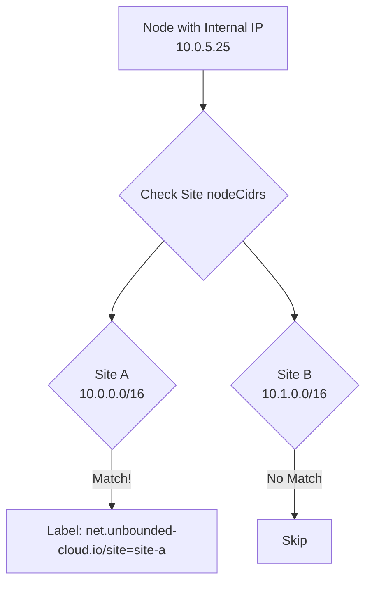
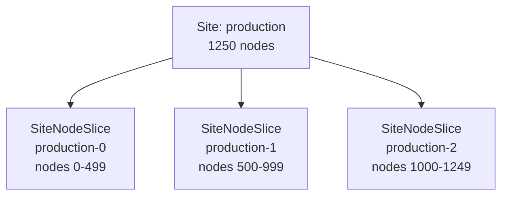
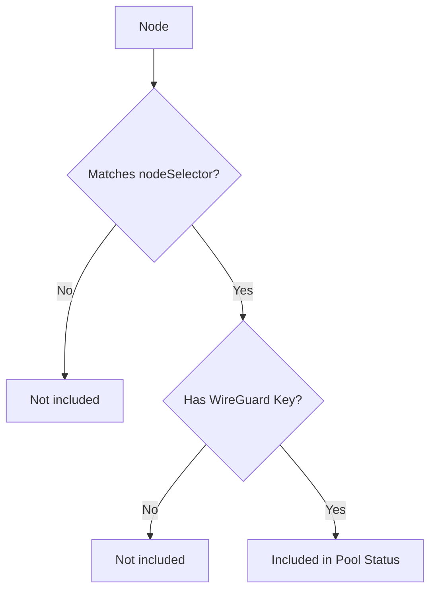
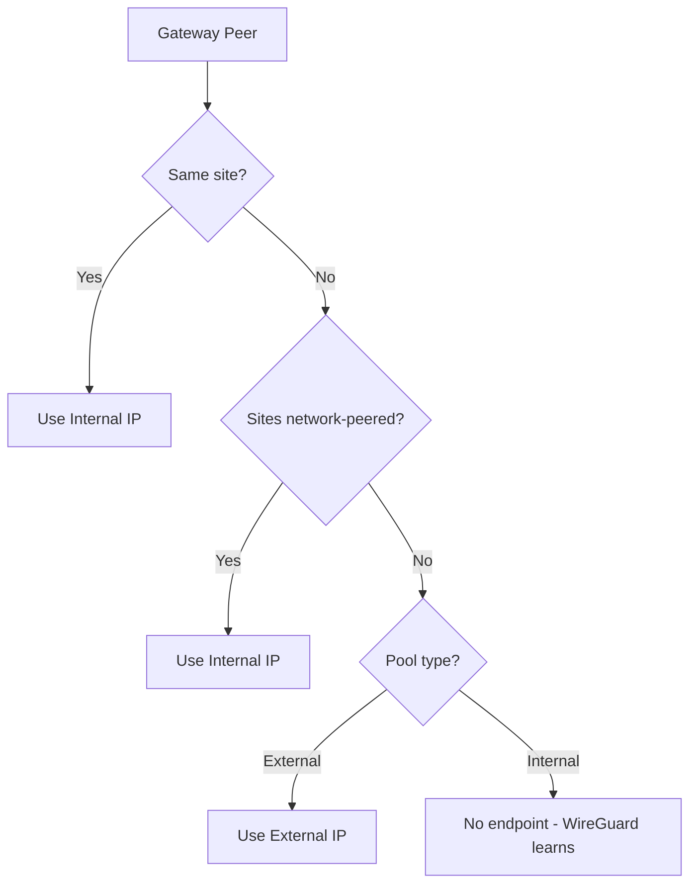
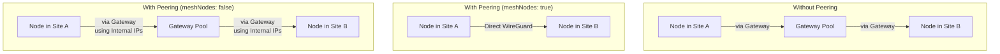
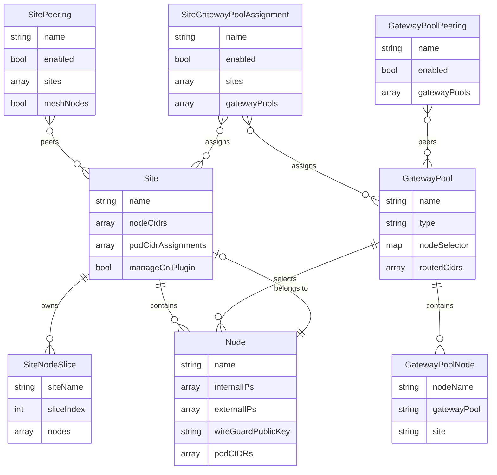

<!-- Copyright (c) Microsoft Corporation. Licensed under the MIT License. -->

# Custom Resource Definitions

unbounded-net uses seven Custom Resource Definitions (CRDs) to manage network configuration.

## Site

A Site represents a network location containing nodes. Nodes are automatically assigned to sites based on their internal IP addresses matching the site's `nodeCidrs`.

### Specification

```yaml
apiVersion: net.unbounded-cloud.io/v1alpha1
kind: Site
metadata:
  name: site-east
spec:
  # Required: CIDRs containing node internal IPs for this site
  nodeCidrs:
    - "10.0.0.0/16"
    - "10.1.0.0/16"

  # Optional: Pod CIDR assignment rules for this site
  podCidrAssignments:
    - assignmentEnabled: true
      cidrBlocks:
        - "100.64.0.0/16"
        - "fdde:1::/48"
      nodeBlockSizes:
        ipv4: 24
        ipv6: 80
      nodeRegex:
        - "^worker-.*"
      priority: 100

  # Optional: Controls CNI and WireGuard intra-site behavior (default: true)
  # Set to false when using an external CNI plugin for intra-site networking
  manageCniPlugin: true

status:
  # Number of nodes matched to this site
  nodeCount: 15

  # Number of SiteNodeSlice objects for this site
  sliceCount: 1
```

### Field Reference

| Field | Type | Required | Description |
|-------|------|----------|-------------|
| `spec.nodeCidrs` | `[]string` | Yes | CIDR blocks containing internal IPs of nodes at this site. At least one required. |
| `spec.podCidrAssignments` | `[]PodCidrAssignment` | No | Pod CIDR allocation rules for this site. |
| `spec.manageCniPlugin` | `*bool` | No | Controls CNI and WireGuard behavior. Defaults to `true`. See below. |
| `spec.nonMasqueradeCIDRs` | `[]string` | No | CIDRs that should NOT be masqueraded when traffic leaves via the default gateway. See below. |
| `spec.localCidrs` | `[]string` | No | CIDR blocks considered local to this site. Traffic to these CIDRs is never routed via gateway pools. |
| `spec.healthCheckSettings` | `HealthCheckSettings` | No | Health check settings for node-to-node routes within this site. |
| `spec.tunnelProtocol` | `string` | No | Tunnel encapsulation: `WireGuard`, `IPIP`, `GENEVE`, `VXLAN`, `None`, or `Auto` (default). When `Auto`, links using external IPs use WireGuard and links using only internal IPs use GENEVE. |
| `spec.tunnelMTU` | `*int32` | No | Tunnel MTU for routes in this scope (576-9000). |
| `status.nodeCount` | `int` | - | Read-only. Number of nodes assigned to this site. |
| `status.sliceCount` | `int` | - | Read-only. Number of SiteNodeSlice objects. |

### PodCidrAssignment Fields

| Field | Type | Required | Description |
|-------|------|----------|-------------|
| `assignmentEnabled` | `*bool` | No | Enables this assignment (default: `true`). Disabled assignments are ignored. |
| `cidrBlocks` | `[]string` | No | CIDR pools to allocate from (IPv4 and/or IPv6). |
| `nodeBlockSizes.ipv4` | `int` | No | IPv4 subnet size for node allocations (default: `/24` when IPv4 pools exist). |
| `nodeBlockSizes.ipv6` | `int` | No | IPv6 subnet size for node allocations (default: first IPv6 pool prefix + 16). |
| `nodeRegex` | `[]string` | No | Regex patterns to match node names. If empty, no regex filtering is applied. |
| `priority` | `*int32` | No | Assignment priority; lower values win (default: `100`). |

### Admission Validation

The controller registers a validating admission webhook that enforces:

- `spec.nodeCidrs` must be valid CIDRs and cannot overlap across sites
- `spec.podCidrAssignments[].cidrBlocks` must be valid CIDRs and cannot overlap across sites
- Pod CIDR assignment mask sizes must be consistent within a site (IPv4 and IPv6 checked separately)
- IPv6 mask sizes must be no more than 16 bits larger than the pool prefix (e.g. `/64` -> max `/80`)
- `spec.podCidrAssignments[].nodeRegex` must be valid regex patterns
- Sites with active nodes cannot be deleted

### ManageCniPlugin Behavior

The `manageCniPlugin` field controls whether the node agent manages CNI configuration and intra-site WireGuard peers:

| Value | CNI Config | Same-Site WireGuard Peers | Pod CIDR Assignment | Gateway WireGuard Links |
|-------|------------|---------------------------|---------------------|------------------------|
| `true` (default) | Written | Created | Enabled | Created |
| `false` | **Not written** | **Not created** | **Disabled** | Created |

When `manageCniPlugin` is `false`, pod CIDR assignment by the controller is disabled even if `assignmentEnabled: true` is set on individual `podCidrAssignments` rules. The `podCidrAssignments` entries are still required because their CIDR blocks define the pod address ranges used for inter-site routing.

**Use `manageCniPlugin: false` when:**
- Using an external CNI plugin (e.g., Cilium, Calico) for intra-site networking
- unbounded-net should only handle cross-site routing via gateways
- The external CNI manages pod-to-pod communication and pod CIDR allocation within the site

**Example -- site with an existing CNI plugin:**
```yaml
apiVersion: net.unbounded-cloud.io/v1alpha1
kind: Site
metadata:
  name: existing-cni-site
spec:
  nodeCidrs:
    - 10.0.0.0/16
  manageCniPlugin: false
  podCidrAssignments:
    - cidrBlocks:
        - 10.244.0.0/16
      assignmentEnabled: false
```

### NonMasqueradeCIDRs Behavior

The `nonMasqueradeCIDRs` field specifies CIDR blocks that should NOT be masqueraded (NAT'd) when traffic leaves the node via the default gateway. Traffic to these CIDRs will use the pod's actual IP address.

**Azure requirement:** If the nodes are Azure VMs/VMSS instances, NIC `ipForwarding` must be enabled for `nonMasqueradeCIDRs` to work correctly.

**Use cases:**
- Corporate networks that need to identify individual pods by their IP
- VPN connections that require source IP preservation
- External services that whitelist pod CIDRs

**Note:** Traffic via WireGuard interfaces and to pod/node CIDRs is never masqueraded, regardless of this setting.

### Site Membership



### Examples

**Basic Site:**
```yaml
apiVersion: net.unbounded-cloud.io/v1alpha1
kind: Site
metadata:
  name: datacenter-east
spec:
  nodeCidrs:
    - "192.168.1.0/24"
```

**Multi-Region Site with Pod CIDR Assignments:**
```yaml
apiVersion: net.unbounded-cloud.io/v1alpha1
kind: Site
metadata:
  name: aws-us-east-1
spec:
  nodeCidrs:
    - "10.10.0.0/16"
    - "10.11.0.0/16"
  podCidrAssignments:
    - assignmentEnabled: true
      cidrBlocks:
        - "100.64.0.0/14"
        - "fdde:east::/48"
      nodeBlockSizes:
        ipv4: 24
        ipv6: 80
      priority: 100
```

---

## SiteNodeSlice

SiteNodeSlice contains a slice of nodes belonging to a site. Each slice holds up to 500 nodes to prevent exceeding Kubernetes object size limits.

> **Important:** SiteNodeSlice objects are **automatically created and managed by the controller**. You should **never create, modify, or delete these manually**. They are owned by their parent Site and will be garbage collected when the Site is deleted.

### Specification

```yaml
apiVersion: net.unbounded-cloud.io/v1alpha1
kind: SiteNodeSlice
metadata:
  name: site-east-0
  ownerReferences:
    - apiVersion: net.unbounded-cloud.io/v1alpha1
      kind: Site
      name: site-east
      uid: <site-uid>
# Name of the parent Site
siteName: site-east

# Zero-based index of this slice
sliceIndex: 0

# Number of nodes currently in this slice
nodeCount: 2

# Node information (max 500 per slice)
nodes:
  - name: node-001
    wireGuardPublicKey: "abc123...="
    internalIPs:
      - "10.0.1.5"
    podCIDRs:
      - "100.64.0.0/24"
      - "fdde:1::100/80"

  - name: node-002
    wireGuardPublicKey: "def456...="
    internalIPs:
      - "10.0.1.6"
      - "fd00::6"
    podCIDRs:
      - "100.64.1.0/24"
```

### Field Reference

| Field | Type | Required | Description |
|-------|------|----------|-------------|
| `siteName` | `string` | Yes | Name of the parent Site resource. |
| `sliceIndex` | `int` | Yes | Zero-based index of this slice. |
| `nodeCount` | `int` | No | Read-only. Number of nodes currently in this slice. |
| `nodes` | `[]NodeInfo` | No | Array of node information (max 500). |
| `nodes[].name` | `string` | Yes | Node name. |
| `nodes[].wireGuardPublicKey` | `string` | No | Node's WireGuard public key. |
| `nodes[].internalIPs` | `[]string` | No | Node's internal IP addresses. |
| `nodes[].podCIDRs` | `[]string` | No | Pod CIDRs assigned to this node. |

### Slice Distribution



### Automatic Management

SiteNodeSlice objects are **fully managed by the Site controller**. Manual intervention is not supported and may cause unexpected behavior.

Deletion is blocked while a slice still references active nodes.

The controller automatically:
- Creates slices when nodes join a site
- Updates slices when node information changes (IPs, WireGuard keys, podCIDRs)
- Deletes slices when no longer needed
- Garbage collects slices when the parent Site is deleted (via ownerReferences)

> **Do not** create, edit, or delete SiteNodeSlice objects manually. If you need to troubleshoot, you can safely read them with `kubectl get sns` or `kubectl describe sns <name>`.

---

## GatewayPool

GatewayPool defines a pool of gateway nodes selected by labels. Gateway nodes route traffic between sites.

Deletion is blocked while a pool has active nodes that match its selector.

### Specification

```yaml
apiVersion: net.unbounded-cloud.io/v1alpha1
kind: GatewayPool
metadata:
  name: main-gateways
spec:
  # Optional: Pool type -- "External" (default) or "Internal"
  type: External

  # Required: Label selector for gateway nodes
  nodeSelector:
    net.unbounded-cloud.io/gateway: "true"
    topology.kubernetes.io/zone: "us-east-1a"

  # Optional: Additional CIDRs to route through this pool
  routedCidrs:
    - "172.16.0.0/12"

  # Optional: Health check settings for routes to peers in this gateway pool
  healthCheckSettings:
    enabled: true

  # Optional: Tunnel encapsulation type (WireGuard, IPIP, GENEVE, VXLAN, None, or Auto; default: Auto)
  tunnelProtocol: Auto

  # Optional: Tunnel MTU for routes in this scope (576-9000)
  tunnelMTU: 1400

status:
  # Number of nodes in this pool
  nodeCount: 3

  # Sites directly connected via this pool
  connectedSites:
    - site-east
    - site-west

  # All sites reachable through this pool (including transitive)
  reachableSites:
    - site-east
    - site-west
    - site-central

  # Gateway node details
  nodes:
    - name: gateway-node-1
      siteName: site-east
      internalIPs:
        - "10.0.1.100"
      externalIPs:
        - "203.0.113.10"
      healthEndpoints:
        - "100.64.0.1"
        - "fdde:1::1"
      wireGuardPublicKey: "xyz789...="
      gatewayWireguardPort: 51821
      podCIDRs:
        - "100.64.0.0/24"
```

### Field Reference

| Field | Type | Required | Description |
|-------|------|----------|-------------|
| `spec.type` | `string` | No | Pool type: `External` (default) or `Internal`. Controls IP resolution for cross-site connections. |
| `spec.nodeSelector` | `map[string]string` | Yes | Label selector for gateway nodes. |
| `spec.routedCidrs` | `[]string` | No | Additional CIDRs routed through this pool. |
| `spec.healthCheckSettings` | `HealthCheckSettings` | No | Health check settings for routes to peers in this gateway pool. |
| `spec.tunnelProtocol` | `string` | No | Tunnel encapsulation: `WireGuard`, `IPIP`, `GENEVE`, `VXLAN`, `None`, or `Auto` (default). When `Auto`, links using external IPs use WireGuard and links using only internal IPs use GENEVE. |
| `spec.tunnelMTU` | `*int32` | No | Tunnel MTU for routes in this scope (576-9000). |
| `status.nodeCount` | `int` | - | Read-only. Number of nodes in this pool. |
| `status.connectedSites` | `[]string` | - | Read-only. Sites directly connected via peering relationships. |
| `status.reachableSites` | `[]string` | - | Read-only. All sites reachable through this pool (including transitive). |
| `status.nodes` | `[]GatewayNodeInfo` | - | Read-only. Gateway node details. |
| `status.nodes[].name` | `string` | - | Node name. |
| `status.nodes[].siteName` | `string` | - | Site this gateway belongs to. |
| `status.nodes[].internalIPs` | `[]string` | - | Internal IPs (same-site and peered-site connections). |
| `status.nodes[].externalIPs` | `[]string` | - | External IPs (cross-site connections for External pools). |
| `status.nodes[].healthEndpoints` | `[]string` | - | Health check IP addresses (first IP of each podCIDR). |
| `status.nodes[].wireGuardPublicKey` | `string` | - | Node's WireGuard public key. |
| `status.nodes[].gatewayWireguardPort` | `int32` | - | WireGuard listen port for gateway-to-gateway peering (assigned by controller, starting at 51821). |
| `status.nodes[].podCIDRs` | `[]string` | - | Pod CIDRs assigned to this gateway node. |

### Gateway Node Requirements

A node is included in a GatewayPool status when it:



### Gateway Peer IP Resolution

When connecting to a gateway peer, the node agent resolves the endpoint IP:



### Examples

**Simple Gateway Pool:**
```yaml
apiVersion: net.unbounded-cloud.io/v1alpha1
kind: GatewayPool
metadata:
  name: all-gateways
spec:
  nodeSelector:
    node-role.kubernetes.io/gateway: ""
```

**Zone-Specific Gateway Pool:**
```yaml
apiVersion: net.unbounded-cloud.io/v1alpha1
kind: GatewayPool
metadata:
  name: zone-a-gateways
spec:
  nodeSelector:
    net.unbounded-cloud.io/gateway: "true"
    topology.kubernetes.io/zone: "zone-a"
```

**Gateway Pool with Custom Routes:**
```yaml
apiVersion: net.unbounded-cloud.io/v1alpha1
kind: GatewayPool
metadata:
  name: edge-gateways
spec:
  nodeSelector:
    net.unbounded-cloud.io/edge-gateway: "true"
  routedCidrs:
    - "192.168.0.0/16"  # On-premises network
    - "172.16.0.0/12"   # Legacy infrastructure
```

---

## GatewayPoolNode

GatewayPoolNode represents an individual node's membership in a gateway pool. These are automatically created and managed by the gateway pool controller. The node agent patches the status with route advertisements and heartbeat timestamps.

> **Important:** GatewayPoolNode objects are **automatically managed**. Do not create or modify them manually.

### Specification

```yaml
apiVersion: net.unbounded-cloud.io/v1alpha1
kind: GatewayPoolNode
metadata:
  name: pool-a-node-1
spec:
  # Required: Name of the Kubernetes node
  nodeName: gateway-node-1

  # Required: Name of the GatewayPool this node belongs to
  gatewayPool: pool-a

  # Optional: Site name (set by controller based on node labels)
  site: site-east

status:
  # Last heartbeat from node agent
  lastUpdated: "2026-02-24T12:00:00Z"

  # Route advertisements from this gateway node
  routes:
    "10.0.0.0/16":
      type: NodeCidr
      paths:
        - - type: Site
            name: site-east
```

### Field Reference

| Field | Type | Required | Description |
|-------|------|----------|-------------|
| `spec.nodeName` | `string` | Yes | Kubernetes node name. |
| `spec.gatewayPool` | `string` | Yes | GatewayPool this node belongs to. |
| `spec.site` | `string` | No | Site name (derived from node labels). |
| `status.lastUpdated` | `string` | - | Read-only. Last heartbeat timestamp. |
| `status.routes` | `map[string]GatewayNodeRoute` | - | Read-only. Route advertisements keyed by CIDR. |
| `status.routes[].type` | `string` | - | Route source type: `NodeCidr`, `PodCidr`, or `RoutedCidr`. |
| `status.routes[].source` | `GatewayNodePathHop` | - | Originating object for this route (`type` + `name`). |
| `status.routes[].intermediateHops` | `[]GatewayNodePathHop` | - | Additional path objects between source and destination. |
| `status.routes[].paths` | `[][]GatewayNodePathHop` | - | Full end-to-end paths. Each item is an ordered hop sequence from origin to local advertiser (max 100). |

---

## SitePeering

SitePeering defines direct peering between sites. By default, nodes in peered sites create direct WireGuard tunnels to each other, as if they were in the same site. When `meshNodes` is set to `false`, nodes do not mesh directly but the sites are still considered network-peered, which allows gateway pool peerings between pools in those sites to use internal IPs instead of external IPs.

### Specification

```yaml
apiVersion: net.unbounded-cloud.io/v1alpha1
kind: SitePeering
metadata:
  name: east-west-peering
spec:
  # Optional: Whether this peering is active (default: true)
  enabled: true

  # Optional: List of site names to peer directly
  # At least two entries are required
  sites:
    - "site-east"
    - "site-west"
    - "site-central"

  # Optional: Whether nodes in listed sites mesh directly (default: true)
  # When false, nodes do not create direct WireGuard tunnels but
  # gateway pool peerings between pools in these sites use internal IPs.
  meshNodes: true

  # Optional: Health check settings for inter-site routes
  healthCheckSettings:
    enabled: true
    detectMultiplier: 3
    receiveInterval: 300ms
    transmitInterval: 300ms

  # Optional: Tunnel encapsulation type (WireGuard, IPIP, GENEVE, VXLAN, None, or Auto; default: Auto)
  tunnelProtocol: Auto

  # Optional: Tunnel MTU for routes in this scope (576-9000)
  tunnelMTU: 1400

status:
  # Number of sites in this peering that exist
  peeredSiteCount: 3

  # Total number of nodes across all peered sites
  totalNodeCount: 45
```

### Field Reference

| Field | Type | Required | Description |
|-------|------|----------|-------------|
| `spec.enabled` | `*bool` | No | Whether this object is active. Defaults to `true`. When `false`, it is treated as if it does not exist. |
| `spec.sites` | `[]string` | No | List of site names to peer directly. At least two entries are required. |
| `spec.meshNodes` | `*bool` | No | Whether nodes mesh directly. Defaults to `true`. When `false`, sites are network-peered but nodes do not create direct WireGuard tunnels. |
| `spec.healthCheckSettings` | `HealthCheckSettings` | No | Health check settings for inter-site routes. |
| `spec.tunnelProtocol` | `string` | No | Tunnel encapsulation: `WireGuard`, `IPIP`, `GENEVE`, `VXLAN`, `None`, or `Auto` (default). When `Auto`, links using external IPs use WireGuard and links using only internal IPs use GENEVE. |
| `spec.tunnelMTU` | `*int32` | No | Tunnel MTU for routes in this scope (576-9000). |
| `status.peeredSiteCount` | `int` | - | Read-only. Number of sites in this peering that exist. |
| `status.totalNodeCount` | `int` | - | Read-only. Total number of nodes across all peered sites. |

### Behavior

When sites are peered via SitePeering:

1. **Direct Node-to-Node WireGuard Tunnels** (when `meshNodes: true`, the default): All nodes in peered sites create direct WireGuard connections to each other, just like nodes within the same site.

2. **Network Peering without Node Mesh** (when `meshNodes: false`): Sites are considered network-peered but nodes do not create direct WireGuard tunnels. Gateway pool peerings between pools in these sites will use internal IPs instead of external IPs, since the sites can reach each other at the network level.

3. **Gateway Bypass** (when `meshNodes: true`): Traffic between peered sites does NOT go through gateways. The gateway pool routing for nodeCIDRs and podCIDRs of peered sites is not built.

4. **Combined Routing** (when `meshNodes: true`): Pod CIDRs from all peered sites are combined into the route table, allowing direct pod-to-pod communication.

### Health Check Settings Precedence

The node agent resolves health check settings per route scope:

- `Site.spec.healthCheckSettings`: node-to-node routes within the same site.
- `SitePeering.spec.healthCheckSettings`: node-to-node routes between sites in that peering.
- `GatewayPool.spec.healthCheckSettings`: routes from nodes to peers in that gateway pool.

For routes to gateway pool peers, precedence is:

1. `SiteGatewayPoolAssignment.spec.healthCheckSettings` (site-to-pool relationships)
2. `GatewayPool.spec.healthCheckSettings` (gateway-to-gateway relationships)

If multiple peerings define conflicting health check settings for the same site or gateway pool,
peerings are processed in deterministic name order, and the first profile is kept.



### Use Cases

- **Low-latency cross-site communication**: When sites have fast, reliable connectivity (e.g., same cloud region, dedicated interconnect)
- **Simplified networking**: When gateway-based routing adds unnecessary complexity
- **Cost optimization**: Avoiding gateway node overhead for frequently communicating sites
- **Network-peered sites without full mesh**: When sites are on the same network but a full node mesh would be too large; use `meshNodes: false` to still benefit from internal IP routing via gateways

### Examples

**Basic Two-Site SitePeering:**
```yaml
apiVersion: net.unbounded-cloud.io/v1alpha1
kind: SitePeering
metadata:
  name: datacenter-peering
spec:
  sites:
    - "datacenter-a"
    - "datacenter-b"
```

**Network-Peered Sites without Node Mesh:**
```yaml
apiVersion: net.unbounded-cloud.io/v1alpha1
kind: SitePeering
metadata:
  name: large-sites-peering
spec:
  sites:
    - "site-east"
    - "site-west"
  meshNodes: false
```

**Multi-Site Regional SitePeering:**
```yaml
apiVersion: net.unbounded-cloud.io/v1alpha1
kind: SitePeering
metadata:
  name: us-east-region
spec:
  sites:
    - "us-east-1a"
    - "us-east-1b"
    - "us-east-1c"
```

---

## SiteGatewayPoolAssignment

SiteGatewayPoolAssignment defines which gateway pools serve which sites. This controls which gateway pools are available for routing traffic from a site, and allows configuring health check settings for the site-to-pool relationship.

### Specification

```yaml
apiVersion: net.unbounded-cloud.io/v1alpha1
kind: SiteGatewayPoolAssignment
metadata:
  name: east-gateways
spec:
  # Optional: Whether this assignment is active (default: true)
  enabled: true

  # Sites that should use these gateway pools
  sites:
    - "site-east"

  # Gateway pools assigned to these sites
  gatewayPools:
    - "main-gateways"
    - "backup-gateways"

  # Optional: Health check settings for routes from these sites to these pools
  healthCheckSettings:
    enabled: true

  # Optional: Tunnel encapsulation type (WireGuard, IPIP, GENEVE, VXLAN, None, or Auto; default: Auto)
  # On SGPA, tunnelProtocol overrides the Site's tunnelProtocol for gateway peer
  # connections. When Auto or unset, the Site's tunnelProtocol is used as fallback.
  tunnelProtocol: Auto

  # Optional: Tunnel MTU for routes in this scope (576-9000)
  tunnelMTU: 1400
```

### Field Reference

| Field | Type | Required | Description |
|-------|------|----------|-------------|
| `spec.enabled` | `*bool` | No | Whether this object is active. Defaults to `true`. When `false`, it is treated as if it does not exist. |
| `spec.sites` | `[]string` | No | Site names that should use these gateway pools. |
| `spec.gatewayPools` | `[]string` | No | Gateway pool names assigned to these sites. |
| `spec.healthCheckSettings` | `HealthCheckSettings` | No | Health check settings for routes from these sites to these pools. |
| `spec.tunnelProtocol` | `string` | No | Tunnel encapsulation: `WireGuard`, `IPIP`, `GENEVE`, `VXLAN`, `None`, or `Auto` (default). Overrides the Site's `tunnelProtocol` for gateway peer connections; when `Auto` or unset, falls back to the Site's setting. |
| `spec.tunnelMTU` | `*int32` | No | Tunnel MTU for routes in this scope (576-9000). |

### Tunnel Protocol Override

The `tunnelProtocol` on a SiteGatewayPoolAssignment overrides the Site's `tunnelProtocol` for connections to gateway pool peers. When the SGPA's `tunnelProtocol` is `Auto` or nil, the Site's `tunnelProtocol` is used as the fallback. This allows per-assignment control of encapsulation without changing the site-wide default.

---

## GatewayPoolPeering

GatewayPoolPeering defines peering between gateway pools, enabling cross-pool routing. Pools listed in a GatewayPoolPeering will establish WireGuard tunnels between their gateway nodes.

### Specification

```yaml
apiVersion: net.unbounded-cloud.io/v1alpha1
kind: GatewayPoolPeering
metadata:
  name: east-west-pool-peering
spec:
  # Optional: Whether this peering is active (default: true)
  enabled: true

  # Gateway pools to peer together
  gatewayPools:
    - "east-gateways"
    - "west-gateways"

  # Optional: Health check settings for inter-pool routes
  healthCheckSettings:
    enabled: true

  # Optional: Tunnel encapsulation type (WireGuard, IPIP, GENEVE, VXLAN, None, or Auto; default: Auto)
  tunnelProtocol: Auto

  # Optional: Tunnel MTU for routes in this scope (576-9000)
  tunnelMTU: 1400
```

### Field Reference

| Field | Type | Required | Description |
|-------|------|----------|-------------|
| `spec.enabled` | `*bool` | No | Whether this object is active. Defaults to `true`. When `false`, it is treated as if it does not exist. |
| `spec.gatewayPools` | `[]string` | No | Gateway pool names to peer together. |
| `spec.healthCheckSettings` | `HealthCheckSettings` | No | Health check settings for inter-pool routes. |
| `spec.tunnelProtocol` | `string` | No | Tunnel encapsulation: `WireGuard`, `IPIP`, `GENEVE`, `VXLAN`, `None`, or `Auto` (default). When `Auto`, links using external IPs use WireGuard and links using only internal IPs use GENEVE. |
| `spec.tunnelMTU` | `*int32` | No | Tunnel MTU for routes in this scope (576-9000). |

---

## Labels and Annotations

### Labels

| Label | Applied To | Description |
|-------|-----------|-------------|
| `net.unbounded-cloud.io/site` | Node | Site membership. Set by Site controller. |
| `app.kubernetes.io/name: unbounded-net` | CRDs | Identifies unbounded-net resources. |

### Annotations

| Annotation | Applied To | Description |
|------------|-----------|-------------|
| `net.unbounded-cloud.io/wg-pubkey` | Node | WireGuard public key. Set by node agent. |

### Taints

| Taint | Applied To | Effect | Description |
|-------|-----------|--------|-------------|
| `net.unbounded-cloud.io/gateway-node=true` | Gateway Node | NoSchedule | Prevents regular workloads on gateway nodes. |

---

## Relationships



---

## Short Names

For convenience, the CRDs define short names for `kubectl`:

| Resource | Short Name | Example |
|----------|------------|---------|
| Site | `st` | `kubectl get st` |
| SiteNodeSlice | `sns` | `kubectl get sns` |
| GatewayPool | `gp` | `kubectl get gp` |
| GatewayPoolNode | `gpn` | `kubectl get gpn` |
| SitePeering | `spr` | `kubectl get spr` |
| SiteGatewayPoolAssignment | `sgpa` | `kubectl get sgpa` |
| GatewayPoolPeering | `gpp` | `kubectl get gpp` |

### Usage Examples

```bash
# List all sites
kubectl get st

# Describe a site
kubectl describe st site-east

# Get gateway pools with details
kubectl get gp -o wide

# View site node slices
kubectl get sns -l net.unbounded-cloud.io/site=site-east

# Watch gateway pool status
kubectl get gp main-gateways -o yaml -w

# List gateway pool nodes
kubectl get gpn

# List site peerings
kubectl get spr

# Describe a peering
kubectl describe spr east-west-peering

# List site-gateway pool assignments
kubectl get sgpa

# List gateway pool peerings
kubectl get gpp
```
