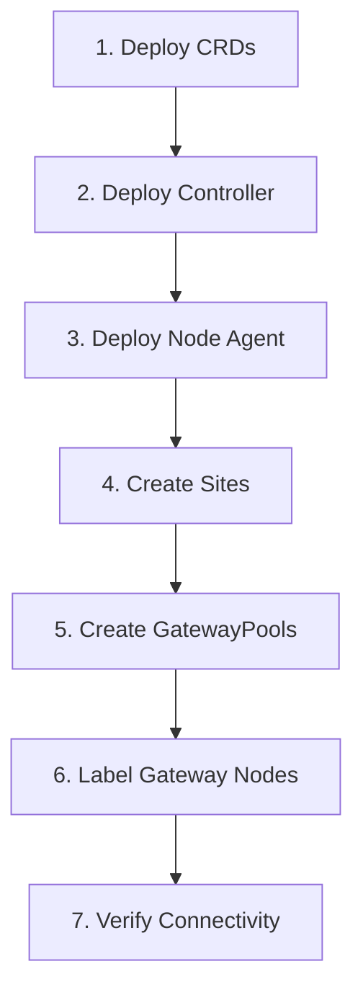
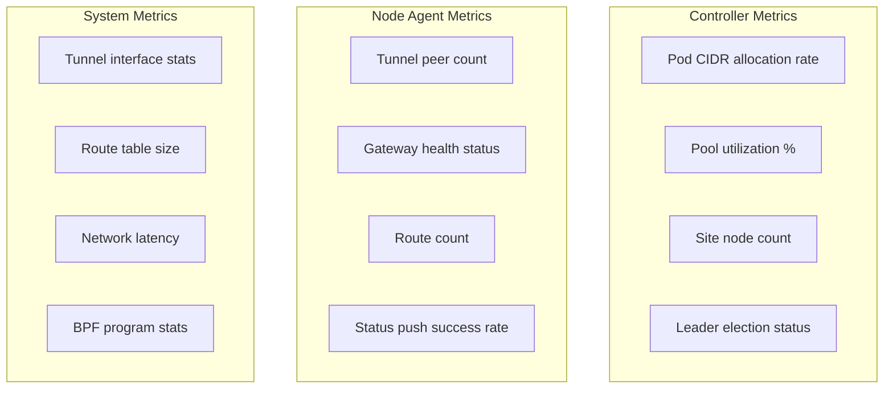
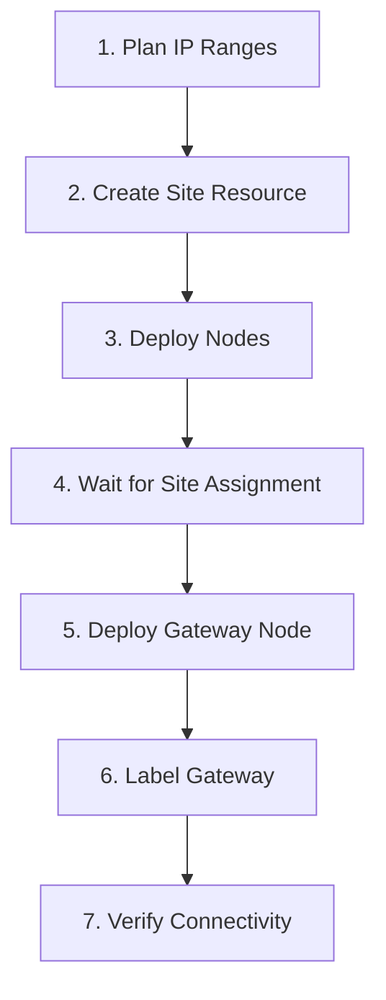

<!-- Copyright (c) Microsoft Corporation. Licensed under the MIT License. -->

# Operations Guide

This guide covers deployment, monitoring, troubleshooting, and operational procedures for unbounded-net.

## Deployment

### Prerequisites

1. **Kubernetes cluster** (1.24+)
2. **Tunnel dataplane** -- one of:
   - **WireGuard** kernel module on all nodes (encrypted tunnels)
   - **eBPF** with GENEVE, VXLAN, or IPIP tunnels (requires kernel eBPF/TC support)
3. **Container runtime** with CNI support
4. **Network connectivity** between sites (UDP ports)

### Verifying WireGuard Support

```bash
# Check if WireGuard module is loaded
lsmod | grep wireguard

# Load WireGuard module (if not loaded)
modprobe wireguard

# Verify WireGuard tools
wg --version
```

### Installation Steps



#### Step 1: Deploy CRDs

```bash
kubectl apply -f deploy/net/crd/
```

Verify CRDs are installed:
```bash
kubectl get crd | grep unbounded
```

Expected output:
```
gatewaypoolnodes.net.unbounded-kube.io              2024-01-15T10:00:00Z
gatewaypoolpeerings.net.unbounded-kube.io            2024-01-15T10:00:00Z
gatewaypools.net.unbounded-kube.io                   2024-01-15T10:00:00Z
sitegatewaypoolassignments.net.unbounded-kube.io     2024-01-15T10:00:00Z
sitenodeslices.net.unbounded-kube.io                 2024-01-15T10:00:00Z
sitepeerings.net.unbounded-kube.io                   2024-01-15T10:00:00Z
sites.net.unbounded-kube.io                          2024-01-15T10:00:00Z
```

#### Container Registry

Production images are published to `unboundednettme.azurecr.io`:

| Image | Description |
|-------|-------------|
| `unboundednettme.azurecr.io/unbounded-net-controller` | Controller |
| `unboundednettme.azurecr.io/unbounded-net-node` | Node agent (includes `unroute` diagnostic tool) |

Both images include the `unroute` BPF diagnostic tool. Deploy manifests use template
placeholders (`{{ .ControllerImage }}`, `{{ .NodeImage }}`), so the registry is injected
at render time.

#### Step 2: Deploy Controller

```bash
kubectl apply -f deploy/controller/
```

On startup, the controller registers aggregated status endpoints through `APIService` `v1alpha1.status.net.unbounded-kube.io`, served over HTTPS via `unbounded-net-controller:9999` with an explicit `caBundle`.

Verify aggregated API registration:
```bash
kubectl get apiservice v1alpha1.status.net.unbounded-kube.io
```

The controller registers the validating admission webhook on startup and stores
its TLS certificates in the `unbounded-net-serving-cert` secret (kube-system).
The webhook Service is `unbounded-net-controller` (port 9999). The webhook uses
`failurePolicy: Ignore` so that CRD operations are not blocked if the webhook
is unavailable. Most validation constraints are enforced by CRD OpenAPI schema
rules. A single webhook entry covers all CRD types for CREATE and UPDATE
operations. DELETE protection uses the `net.unbounded-kube.io/protection`
finalizer on Sites and GatewayPools.

Verify controller is running:
```bash
kubectl -n kube-system get pods -l app=unbounded-net-controller
```

#### Step 3: Deploy Node Agent

```bash
kubectl apply -f deploy/node/
```

Verify agents are running on all nodes:
```bash
kubectl -n kube-system get pods -l app=unbounded-net-node -o wide
```

#### Step 4: Create Sites

```bash
kubectl apply -f - <<EOF
apiVersion: net.unbounded-kube.io/v1alpha1
kind: Site
metadata:
  name: site-east
spec:
  nodeCidrs:
    - "10.0.0.0/16"
  podCidrAssignments:
    - assignmentEnabled: true
      cidrBlocks:
        - "100.64.0.0/14"
      nodeBlockSizes:
        ipv4: 24
      priority: 100
---
apiVersion: net.unbounded-kube.io/v1alpha1
kind: Site
metadata:
  name: site-west
spec:
  nodeCidrs:
    - "10.1.0.0/16"
  podCidrAssignments:
    - assignmentEnabled: true
      cidrBlocks:
        - "100.68.0.0/14"
      nodeBlockSizes:
        ipv4: 24
      priority: 100
EOF
```

#### Step 5: Assign Sites to Gateway Pools

```bash
kubectl apply -f - <<EOF
apiVersion: net.unbounded-kube.io/v1alpha1
kind: SiteGatewayPoolAssignment
metadata:
  name: main-gateway-assignment
spec:
  sites:
    - "site-east"
    - "site-west"
  gatewayPools:
    - "main-gateways"
EOF
```

#### Step 5: Create GatewayPool

```bash
kubectl apply -f - <<EOF
apiVersion: net.unbounded-kube.io/v1alpha1
kind: GatewayPool
metadata:
  name: main-gateways
spec:
  nodeSelector:
    net.unbounded-kube.io/gateway: "true"
EOF
```

#### Step 6: Label Gateway Nodes

```bash
# Label nodes that should be gateways
kubectl label node gateway-east-1 net.unbounded-kube.io/gateway=true
kubectl label node gateway-west-1 net.unbounded-kube.io/gateway=true
```

#### Step 7: Verify Connectivity

```bash
# Check site membership
kubectl get nodes -L net.unbounded-kube.io/site

# Check gateway pool status
kubectl get gp main-gateways -o yaml

# Test pod-to-pod connectivity
kubectl run test-east --image=busybox --rm -it --restart=Never -- \
  ping -c 3 <pod-ip-in-west>
```

---

## Monitoring

### Web Dashboard

The controller provides a real-time web dashboard for monitoring the entire cluster:

```bash
# Open the dashboard in your browser (starts a local authenticated proxy)
kubectl unbounded-net dashboard

# Or use the controller proxy command without opening the browser
kubectl unbounded-net controller proxy
```

The dashboard displays:
- **Overview**: Cluster health summary with node counts, site counts, and gateway status
- **Sites**: All configured sites with node counts and health indicators
- **Connectivity Matrix**: Visual representation of node-to-node connectivity (pingmesh results)
- **Nodes**: Detailed list of all nodes with filtering, sorting, and pagination
  - Tunnel peer status (WireGuard peers or eBPF tunnel endpoints)
  - Gateway health for each node
  - Site membership
  - Pod name, restart count, and pod age
  - Click on any node to view detailed status including stale data warnings

The dashboard uses **WebSocket** for real-time updates with delta compression, falling back to HTTP polling when WebSocket is unavailable. Features include:
- Live status updates via push-based architecture (node agents push status to controller)
- Filtering nodes by name, site, or role (gateway/worker)
- Sorting by any column
- Auto-sizing pagination based on screen height
- Expandable connectivity matrix with zoom and labels
- Dark/light theme toggle

### Health Endpoints

#### Controller Health

```bash
# Liveness check
curl http://<controller-pod-ip>:9999/healthz

# Readiness check
curl http://<controller-pod-ip>:9999/readyz
```

#### Node Agent Health

```bash
# Liveness check (API connectivity)
curl http://<node-agent-pod-ip>:9998/healthz

# Readiness check (API connectivity)
curl http://<node-agent-pod-ip>:9998/readyz
```

#### Node Status Endpoint

```bash
# Node status JSON (full tunnel, route, and health state)
curl http://<node-agent-pod-ip>:9998/status/json
```

#### Controller Status Endpoints

```bash
# Cluster status JSON (leader only)
curl http://<controller-pod-ip>:9999/status/json

# Per-node status (supports ?live=true for force pull)
curl http://<controller-pod-ip>:9999/status/node/<node-name>

# Aggregated API status push endpoint (if enabled)
# POST http://<apiserver>/apis/status.net.unbounded-kube.io/v1alpha1/status/push
# WebSocket: wss://<apiserver>/apis/status.net.unbounded-kube.io/v1alpha1/status/nodews
```

#### Gateway Health

```bash
# Check gateway health endpoint
curl http://<gateway-ip>:9998/healthz
```

### Prometheus Metrics

All components expose Prometheus-compatible metrics at `/metrics` endpoints.

#### Endpoints

| Component | Port | Path | Description |
|-----------|------|------|-------------|
| Controller (HTTP) | 9999 | `/metrics` | Controller metrics, client-go metrics, Go runtime |
| Controller (TLS) | 9999 | `/metrics` | Same metrics, accessible via the unified HTTPS port |
| Node Agent | 9998 | `/metrics` | Node agent metrics, client-go metrics, Go runtime |

#### Prometheus Scrape Configuration

All pods carry standard `prometheus.io/*` annotations for automatic discovery.

**Annotation-based discovery (simplest):**

```yaml
scrape_configs:
  # Scrapes any pod with prometheus.io/scrape=true (controller + node agent)
  - job_name: kubernetes-pods
    kubernetes_sd_configs:
      - role: pod
    relabel_configs:
      - source_labels: [__meta_kubernetes_pod_annotation_prometheus_io_scrape]
        action: keep
        regex: "true"
      - source_labels: [__meta_kubernetes_pod_annotation_prometheus_io_port]
        action: replace
        target_label: __address__
        regex: (\d+)
        replacement: ${1}
      - source_labels: [__address__, __meta_kubernetes_pod_annotation_prometheus_io_port]
        action: replace
        target_label: __address__
        regex: ([^:]+)(?::\d+)?;(\d+)
        replacement: $1:$2
      - source_labels: [__meta_kubernetes_pod_annotation_prometheus_io_path]
        action: replace
        target_label: __metrics_path__
        regex: (.+)
```

**Label-based discovery (explicit):**

```yaml
scrape_configs:
  - job_name: unbounded-net-controller
    kubernetes_sd_configs:
      - role: pod
    relabel_configs:
      - source_labels: [__meta_kubernetes_pod_label_app_kubernetes_io_name]
        regex: unbounded-net-controller
        action: keep
      - source_labels: [__meta_kubernetes_pod_container_port_name]
        regex: health
        action: keep

  - job_name: unbounded-net-node
    kubernetes_sd_configs:
      - role: pod
    relabel_configs:
      - source_labels: [__meta_kubernetes_pod_label_app_kubernetes_io_name]
        regex: unbounded-net-node
        action: keep
      - source_labels: [__meta_kubernetes_pod_container_port_name]
        regex: health
        action: keep
```

#### Key Custom Metrics

**Controller (`unbounded_net_controller_*`):**
- `reconciliation_duration_seconds` -- reconciliation loop duration (labels: controller)
- `reconciliation_total` -- total reconciliations (labels: controller, result)
- `site_nodes_total` -- nodes per site (labels: site)
- `pod_cidr_allocations_total` -- CIDR allocations
- `pod_cidr_exhaustion_total` -- CIDR pool exhaustion events
- `gateway_pool_nodes_total` -- nodes per gateway pool (labels: pool)
- `webhook_requests_total` -- admission webhook requests (labels: resource, operation, result)
- `leader_is_leader` -- whether this instance is the leader (1/0)
- `websocket_connections` -- active node WebSocket connections

**Node Agent (`unbounded_net_node_*`):**
- `reconciliation_duration_seconds` -- reconciliation loop duration
- `wireguard_peers` -- current WireGuard peers (labels: interface)
- `wireguard_configure_duration_seconds` -- WireGuard configuration time
- `routes_installed` -- installed routes (labels: table)
- `route_sync_duration_seconds` -- route sync time (labels: source)
- `masquerade_sync_duration_seconds` -- iptables rule sync time
- `status_push_total` -- status push attempts (labels: method, result)
- `status_push_duration_seconds` -- status push latency
- `status_push_bytes` -- status push payload size
- `cni_config_writes_total` -- CNI config file writes

**Health Check (`unbounded_net_healthcheck_*`):**
- `peer_state` -- current peer health state (0=down, 1=up, 2=admin-down) (labels: peer, overlay_ip)
- `peers_total` -- total health check peers
- `probe_duration_seconds` -- health check probe round-trip time (labels: peer)
- `probes_sent_total` -- total probes sent (labels: peer)
- `probes_received_total` -- total probes received (labels: peer)

**Client-Go (automatic):**
- `workqueue_depth` -- workqueue depth (labels: name)
- `workqueue_work_duration_seconds` -- work item processing time
- `rest_client_requests_total` -- Kubernetes API requests (labels: code, method, host)

### Key Metrics to Monitor



### Viewing Tunnel Status

#### WireGuard Mode

```bash
# On a node, show WireGuard status
wg show

# Show specific interface
wg show wg51820

# Show all interfaces including gateway interfaces
wg show all
```

Example output:
```
interface: wg51820
  public key: abc123...
  private key: (hidden)
  listening port: 51820

peer: def456...
  endpoint: 10.0.1.5:51820
  allowed ips: 100.64.0.0/24
  latest handshake: 15 seconds ago
  transfer: 1.23 MiB received, 456.78 KiB sent
```

### Viewing Routes

```bash
# Show routes via WireGuard interfaces
ip route show dev wg51820
ip route show dev wg51821

# Show all unbounded-net related routes
ip route | grep 'wg'
```

### eBPF Dataplane Verification

When using the eBPF dataplane (GENEVE, VXLAN, or IPIP tunnels), verification differs
from WireGuard mode. Traffic is forwarded by a TC eBPF program attached to the
`unbounded0` dummy interface rather than by per-peer kernel routes.

#### Verifying BPF Program Attachment

The eBPF encapsulation program (`unbounded_encap`) is attached as a TC egress filter
on the `unbounded0` interface:

```bash
# Verify BPF program is attached
tc filter show dev unbounded0 egress
```

Expected output should show a `bpf` filter with `direct-action` on the `clsact` qdisc:
```
filter protocol all pref 49152 bpf chain 0
filter protocol all pref 49152 bpf chain 0 handle 0x1 unbounded_encap direct-action ...
```

If no filter is shown, the eBPF program failed to load or attach. Check node agent logs:
```bash
kubectl -n kube-system logs <node-agent-pod> | grep -i "bpf\|ebpf\|attach"
```

#### Verifying BPF Maps

The eBPF program uses LPM trie maps to look up tunnel endpoints. Map names are
truncated to 15 characters by the kernel:

```bash
# List BPF maps (look for unbounded_endpo -- truncated from unbounded_endpoints_v4/v6)
bpftool map list | grep unbounded

# Dump map contents
bpftool map dump name unbounded_endpo
```

The full map names in the BPF object are `unbounded_endpoints_v4` and
`unbounded_endpoints_v6`, but the kernel truncates them.

#### Using the `unroute` Tool

The `unroute` diagnostic tool is included in both the controller and node agent images.
It reads the BPF maps directly and annotates entries with node/site information from
the controller status API:

```bash
# Dump all BPF entries from inside a node agent pod
kubectl -n kube-system exec <node-agent-pod> -- unroute

# Look up a specific IP
kubectl -n kube-system exec <node-agent-pod> -- unroute <ip-address>

# Show local CIDRs only
kubectl -n kube-system exec <node-agent-pod> -- unroute --local
```

#### BPF Status via kubectl Plugin

The kubectl plugin supports viewing BPF entries for a node:

```bash
# Show BPF map entries for a node
kubectl unbounded net node show <node-name> bpf

# Show routes for a node (supernet routes on unbounded0 in eBPF mode)
kubectl unbounded net node show <node-name> routes

# Show full status JSON for a node
kubectl unbounded net node show <node-name> json
```

### Interface Verification

#### WireGuard Mode

```bash
# Check WireGuard interfaces
ip link show type wireguard
wg show all
```

#### eBPF Mode

In eBPF mode, three types of interfaces are used:

| Interface | Type | Purpose |
|-----------|------|---------|
| `unbounded0` | Dummy (NOARP) | Receives pod traffic via FIB, TC eBPF performs encapsulation |
| `geneve0` | GENEVE (FlowBased) | Shared external tunnel for GENEVE peers |
| `vxlan0` | VXLAN (FlowBased) | Shared external tunnel for VXLAN peers |
| `ipip0` | IPIP (FlowBased) | Shared external tunnel for IPIP peers |

Only the tunnel interfaces for active protocols are present. Unused tunnel devices
are automatically removed (see [Unused Device Cleanup](#unused-device-cleanup)).

```bash
# Verify unbounded0 exists and has NOARP flag
ip link show unbounded0
# Expected: <BROADCAST,NOARP,UP,LOWER_UP> -- no ARP because BPF handles forwarding

# Verify tunnel interfaces (only active protocols will be present)
ip link show geneve0 2>/dev/null
ip link show vxlan0 2>/dev/null
ip link show ipip0 2>/dev/null

# Check that tunnel interfaces are FlowBased (external mode)
ip -d link show geneve0 2>/dev/null | grep -i external
ip -d link show vxlan0 2>/dev/null | grep -i external

# Check all unbounded-net interfaces
ip link | grep -E 'unbounded0|geneve0|vxlan0|ipip0'
```

#### MAC Address Verification

Tunnel interfaces use a deterministic MAC address derived from the node's underlay IP.
The format is `02:<ip[0]>:<ip[1]>:<ip[2]>:<ip[3]>:FF`. For example, a node with underlay
IP `10.0.1.5` would have tunnel MAC `02:0a:00:01:05:ff`.

```bash
# Verify tunnel interface MAC matches expected value
ip link show geneve0 | grep link/ether

# The BPF program uses the same formula to set the source MAC on encapsulated packets
```

### Route Verification (eBPF Mode)

In eBPF mode, routes are configured differently from WireGuard mode:

- **Supernet routes** are installed on `unbounded0` with `scope global` (not `scope link`).
  These attract pod traffic to the dummy interface, where the TC eBPF program handles
  encapsulation and forwarding.
- **No per-peer routes** are needed in the kernel. Peer destinations are encoded in the
  BPF LPM trie maps instead. This reduces kernel route table size significantly in
  large deployments.

```bash
# Show supernet routes on unbounded0
ip route show dev unbounded0
# Expected: broad CIDR prefixes with scope global, e.g.:
#   100.64.0.0/14 scope global

# Confirm no per-peer routes on tunnel interfaces
# (Unlike WireGuard mode, geneve0/vxlan0/ipip0 should have no routes)
ip route show dev geneve0 2>/dev/null
ip route show dev vxlan0 2>/dev/null
ip route show dev ipip0 2>/dev/null
```

In WireGuard mode, per-peer routes are installed on `wg*` devices instead:
```bash
# WireGuard mode routes (for comparison)
ip route show dev wg51820
ip route show dev wg51821
```

### Health Endpoints and Status Reporting

#### Node Agent Endpoints (Port 9998)

The node agent status server listens on port 9998 (configurable via `--health-port`):

| Path | Method | Description |
|------|--------|-------------|
| `/healthz` | GET | Liveness probe (API connectivity) |
| `/readyz` | GET | Readiness probe |
| `/status/json` | GET | Full node status (tunnels, routes, health, BPF entries) |
| `/status` | GET | Human-readable status page |
| `/metrics` | GET | Prometheus metrics |

```bash
# Liveness check
curl http://<node-agent-pod-ip>:9998/healthz

# Full status JSON (includes BpfEntries when using eBPF dataplane)
curl http://<node-agent-pod-ip>:9998/status/json

# Prometheus metrics
curl http://<node-agent-pod-ip>:9998/metrics
```

#### Health Check Probes (Port 9997)

The health check subsystem runs on UDP port 9997 (configurable via `--healthcheck-port`).
It implements a custom UDP probe protocol (similar to SBFD) that runs over the tunnel
overlay to verify end-to-end tunnel connectivity between peers:

```bash
# Check if health check listener is running
ss -ulnp | grep 9997

# Use the unping tool to send a manual probe (from inside a node agent pod)
kubectl -n kube-system exec <node-agent-pod> -- unping -t <peer-overlay-ip> -p 9997
```

#### Status Reporting Chain

Node agents push status to the controller using a tiered approach:

```
Node Agent --> Controller (direct push / WebSocket)
           \-> API Server (aggregated API relay, for external nodes)
```

1. **Direct push (default)**: Node agents POST protobuf status to the controller's
   `/status/push` endpoint, or maintain a persistent WebSocket to `/status/nodews`.
2. **API Server relay (fallback)**: When direct connectivity is unavailable (e.g.,
   external nodes), status is pushed through the Kubernetes API server's aggregated
   API at:
   - `POST /apis/status.net.unbounded-kube.io/v1alpha1/status/push`
   - `WebSocket wss://.../apis/status.net.unbounded-kube.io/v1alpha1/status/nodews`

The relay mode is controlled by `--status-ws-apiserver-mode` on the node agent, which
accepts `never`, `fallback` (default), or `preferred`.

The controller caches received status and supports delta updates -- nodes send only
changed fields after the initial full push. If the controller detects drift, it replies
with a `resync_required` acknowledgment to trigger a full re-push.

```bash
# Check push metrics from a node agent
curl -s http://<node-agent-pod-ip>:9998/metrics | grep status_push

# Verify controller is receiving pushes
curl -s http://<controller-pod-ip>:9999/status/json | python3 -m json.tool | head -40
```

### Unused Device Cleanup

When the tunnel protocol changes for a peer (e.g., from GENEVE to VXLAN, or from
WireGuard to eBPF), unused tunnel devices are automatically removed by the node agent
during reconciliation:

- **eBPF mode**: `geneve0`, `vxlan0`, and `ipip0` are each removed if no active peer
  uses that protocol. For example, if all peers switch from GENEVE to VXLAN, the
  `geneve0` device is deleted.
- **WireGuard mode**: If no WireGuard peers remain, the `wg*` mesh interface is deleted
  and routes are re-synced.
- **Legacy cleanup**: Obsolete per-peer tunnel interfaces (e.g., `gn*`, `ip*` prefixed
  links from older netlink-mode runs) are also removed.

No manual intervention is needed -- the node agent handles cleanup automatically during
each reconciliation cycle.

---

## Troubleshooting

### Common Issues

#### 0. Read-Only Root Filesystem Errors (wget, curl, bash)

**Symptoms:**
- Errors like `Failed to create '/tmp/.wget-hsts_lck_0' (30)`
- Tools fail to write temporary files under `/tmp`

**Cause:**
- The controller and node pods run with `readOnlyRootFilesystem: true`
- `/tmp` is mounted as an `emptyDir`, which is writable at runtime

**Resolution:**
- Use `/tmp` for temporary files
- In interactive shells, the image prints a note and switches to `/tmp` when it is writable

**Note:**
- The node init container runs `/usr/local/bin/node-agent-init.sh` from the image.
- The init script installs missing CNI binaries.

#### 1. Nodes Not Getting Pod CIDRs

**Symptoms:**
- Node shows no `spec.podCIDRs`
- Pods stuck in `ContainerCreating`

**Diagnosis:**
```bash
# Check controller logs
kubectl -n kube-system logs -l app=unbounded-net-controller

# Check Site matching for node internal IPs
kubectl get sites -o yaml

# Check node site label
kubectl get node <node-name> -L net.unbounded-kube.io/site

# Check allocator status (in logs)
kubectl -n kube-system logs -l app=unbounded-net-controller | grep -i alloc
```

**Common Causes:**
- Node internal IP does not match any `spec.nodeCidrs`
- No matching `spec.podCidrAssignments.nodeRegex` in the site's assignments
- Matching assignment has `assignmentEnabled: false`
- CIDR pools exhausted for the matching assignment
- Controller not running or not leader

**Resolution:**
```bash
# Update Site assignment pools or regexes
kubectl edit site <site-name>

# Verify assignment configuration
kubectl get site <site-name> -o yaml
```

#### 2. WireGuard Tunnels Not Establishing

**Symptoms:**
- No WireGuard handshakes
- Pods can't reach pods on other nodes

**Diagnosis:**
```bash
# Check WireGuard interface exists
ip link show wg51820

# Check WireGuard configuration
wg show wg51820

# Check for errors in node agent logs
kubectl -n kube-system logs <node-agent-pod> | grep -i error

# Verify node annotation
kubectl get node <node-name> -o jsonpath='{.metadata.annotations.net\.unbounded-kube\.io/wg-pubkey}'
```

**Common Causes:**
- Firewall blocking UDP 51820
- WireGuard kernel module not loaded
- Node not labeled with site

**Resolution:**
```bash
# Load WireGuard module
modprobe wireguard

# Check firewall rules
iptables -L -n | grep 51820

# Verify site label
kubectl get node <node-name> -L net.unbounded-kube.io/site
```

#### 3. Cross-Site Traffic Failing

**Symptoms:**
- Intra-site traffic works
- Cross-site traffic times out

**Diagnosis:**
```bash
# Check gateway pool status
kubectl get gp -o yaml

# Verify gateway nodes have external IPs
kubectl get gp main-gateways -o jsonpath='{.status.nodes[*].externalIPs}'

# Check gateway interface on regular node
wg show wg51821

# Check routes to remote site
ip route | grep <remote-site-cidr>
```

**Common Causes:**
- No gateways configured
- Gateways not reachable (firewall)
- Health checks failing

**Resolution:**
```bash
# Verify gateways have external IPs
kubectl get nodes -l net.unbounded-kube.io/gateway=true \
  -o jsonpath='{range .items[*]}{.metadata.name}: {.status.addresses[?(@.type=="ExternalIP")].address}{"\n"}{end}'

# Test gateway connectivity
curl -v http://<gateway-health-ip>:9998/healthz

# Check node agent logs for health check failures
kubectl -n kube-system logs <node-agent-pod> | grep -i gateway
```

#### 4. Gateway Health Check Failures

**Symptoms:**
- Routes to remote sites disappear
- Logs show "Gateway unhealthy"

**Diagnosis:**
```bash
# Check health endpoint directly
curl -v http://<gateway-cbr0-ip>:9998/healthz

# Check if gateway is actually reachable
ping <gateway-external-ip>

# Verify gateway taint
kubectl get node <gateway-node> -o jsonpath='{.spec.taints}'

# Check gateway's node agent logs
kubectl -n kube-system logs <gateway-node-agent-pod>
```

**Common Causes:**
- Gateway node agent not running
- Health server not started
- Network partition

**Resolution:**
```bash
# Restart gateway node agent
kubectl -n kube-system delete pod <gateway-node-agent-pod>

# Check health server binding
netstat -tlnp | grep 9998
```

#### 5. Dashboard Shows Stale Node Data

**Symptoms:**
- Dashboard shows nodes with "Stale cache" status
- `lastPushTime` is far in the past

**Diagnosis:**
```bash
# Check controller service endpoints (should be a single EndpointSlice)
kubectl -n kube-system get endpointslices -l kubernetes.io/service-name=unbounded-net-controller

# Verify no stale v1/Endpoints resource exists
kubectl -n kube-system get endpoints unbounded-net-controller 2>&1

# Check push connectivity from a node agent pod
kubectl -n kube-system exec <node-agent-pod> -- wget -q -O - http://<controller-service-ip>:80/healthz
```

**Common Causes:**
- Stale `v1/Endpoints` resource from a previous controller version causing kube-proxy to load-balance pushes to a dead pod IP. The controller automatically cleans these up on leader election, but this can happen during upgrades.
- Controller not the leader (push requests return 503)
- Service account token authentication failures

**Resolution:**
```bash
# Delete stale endpoints if present (controller does this automatically on startup)
kubectl -n kube-system delete endpoints unbounded-net-controller 2>/dev/null

# Restart the controller to trigger leader election and endpoint cleanup
kubectl -n kube-system rollout restart deployment/unbounded-net-controller
```

> **Note:** The controller Service has **no selector**. The leader pod manages its own `EndpointSlice` directly, ensuring only the leader receives push requests. This is by design -- do not add a selector to the service.

### Diagnostic Commands

```bash
# === Cluster Overview ===
# Sites and their node counts
kubectl get st

# Gateway pools
kubectl get gp

# Node site assignments
kubectl get nodes -L net.unbounded-kube.io/site

# === Per-Node Diagnostics (WireGuard) ===
# WireGuard status
wg show all

# === Per-Node Diagnostics (eBPF) ===
# BPF program attachment
tc filter show dev unbounded0 egress

# BPF maps
bpftool map list | grep unbounded

# BPF entry dump (from node agent pod)
# kubectl -n kube-system exec <node-agent-pod> -- unroute

# Interfaces (eBPF mode)
ip link show unbounded0
ip link show geneve0 2>/dev/null
ip link show vxlan0 2>/dev/null
ip link show ipip0 2>/dev/null

# Routes (eBPF mode -- supernet routes on unbounded0)
ip route show dev unbounded0

# === Per-Node Diagnostics (Common) ===
# Routes
ip route show table main | grep -E 'wg|cbr|unbounded'

# Interfaces
ip addr show | grep -E 'wg|cbr|unbounded|geneve|vxlan|ipip'

# CNI configuration
cat /etc/cni/net.d/10-unbounded.conflist

# WireGuard keys (WireGuard mode only)
ls -la /etc/wireguard/

# === Controller Diagnostics ===
# Leader status
kubectl -n kube-system get lease unbounded-net-controller -o yaml

# Recent logs
kubectl -n kube-system logs -l app=unbounded-net-controller --tail=100

# === Node Agent Diagnostics ===
# Recent logs
kubectl -n kube-system logs -l app=unbounded-net-node --tail=100

# === kubectl Plugin ===
# Node list with status summary
kubectl unbounded net node list

# Show node details
kubectl unbounded net node show <node-name> json

# Show BPF entries for a node (eBPF mode)
kubectl unbounded net node show <node-name> bpf

# Show routes for a node
kubectl unbounded net node show <node-name> routes

# Show peers for a node
kubectl unbounded net node show <node-name> peers
```

### Debug Logging

Enable verbose logging:

```yaml
# Controller
args:
  - -v=4  # Very verbose

# Node agent
args:
  - -v=4
```

Log levels:
- `0`: Minimal (errors only)
- `2`: Normal operation info
- `3`: Detailed info (peer changes, route updates)
- `4+`: Debug (every operation)

---

## Operational Procedures

### Adding a New Site



```bash
# 1. Create the site
kubectl apply -f - <<EOF
apiVersion: net.unbounded-kube.io/v1alpha1
kind: Site
metadata:
  name: site-new
spec:
  nodeCidrs:
    - "10.2.0.0/16"
  podCidrAssignments:
    - assignmentEnabled: true
      cidrBlocks:
        - "100.72.0.0/14"
      nodeBlockSizes:
        ipv4: 24
      priority: 100
EOF

# 2. Assign the site to a gateway pool
kubectl apply -f - <<EOF
apiVersion: net.unbounded-kube.io/v1alpha1
kind: SiteGatewayPoolAssignment
metadata:
  name: new-site-assignment
spec:
  sites:
    - "site-new"
  gatewayPools:
    - "main-gateways"
EOF

# 3. Wait for nodes to be labeled
watch kubectl get nodes -L net.unbounded-kube.io/site

# 3. Label gateway node
kubectl label node gateway-new net.unbounded-kube.io/gateway=true

# 4. Verify gateway in pool
kubectl get gp main-gateways -o yaml
```

### Removing a Site

```bash
# 1. Drain workloads from site nodes
kubectl drain <node> --ignore-daemonsets --delete-emptydir-data

# 2. Remove gateway label (if applicable)
kubectl label node <gateway-node> net.unbounded-kube.io/gateway-

# 3. Delete the site
kubectl delete site site-old

# 4. SiteNodeSlices are automatically garbage collected
```

### Replacing a Gateway Node

```bash
# 1. Add new gateway
kubectl label node new-gateway net.unbounded-kube.io/gateway=true

# 2. Verify new gateway in pool
kubectl get gp main-gateways -o yaml

# 3. Wait for routes to update (health check interval)
sleep 10

# 4. Remove old gateway label
kubectl label node old-gateway net.unbounded-kube.io/gateway-

# 5. Gateway taint will remain; drain if needed
kubectl drain old-gateway --ignore-daemonsets
```

### Expanding CIDR Pools

```bash
# Edit the site's pod CIDR assignments to add pools
kubectl edit site <site-name>

# Add additional CIDR blocks under podCidrAssignments[].cidrBlocks
```

### Rolling Restart of Node Agents

```bash
kubectl -n kube-system rollout restart daemonset/unbounded-net-node
kubectl -n kube-system rollout status daemonset/unbounded-net-node
```

---

## Backup and Recovery

### What to Backup

1. **CRD Resources:**
   ```bash
   kubectl get sites -o yaml > sites-backup.yaml
   kubectl get gatewaypools -o yaml > gatewaypools-backup.yaml
   kubectl get sitepeerings -o yaml > sitepeerings-backup.yaml
   kubectl get sitegatewaypoolassignments -o yaml > sgpa-backup.yaml
   kubectl get gatewaypoolpeerings -o yaml > gatewaypoolpeerings-backup.yaml
   ```

   Note: SiteNodeSlices and GatewayPoolNodes are automatically regenerated by the controller and node agents. They do not need to be backed up.

2. **Node Labels:**
   ```bash
   kubectl get nodes -o yaml | grep -A5 "labels:" > node-labels-backup.yaml
   ```

3. **Controller Configuration:**
   ```bash
   kubectl -n kube-system get deploy unbounded-net-controller -o yaml > controller-backup.yaml
   ```

### Recovery Procedure

```bash
# 1. Restore CRDs (if cluster recreated)
kubectl apply -f deploy/net/crd/

# 2. Restore Sites, GatewayPools, and peering resources
kubectl apply -f sites-backup.yaml
kubectl apply -f gatewaypools-backup.yaml
kubectl apply -f sitepeerings-backup.yaml
kubectl apply -f sgpa-backup.yaml
kubectl apply -f gatewaypoolpeerings-backup.yaml

# 3. Restore controller
kubectl apply -f deploy/controller/
kubectl apply -f controller-backup.yaml

# 4. Deploy node agents
kubectl apply -f deploy/node/

# 5. Re-apply gateway labels
kubectl label node <gateway> net.unbounded-kube.io/gateway=true
```

---

## Authentication

### Dashboard Authentication

The controller status dashboard requires authentication by default. Set
`requireDashboardAuth: false` in the controller config to disable it.

When enabled, dashboard endpoints (`/status`, `/status/json`, `/status/ws`)
require an HMAC bearer token with the `viewer` role. Tokens are obtained
from the aggregated API token endpoint.

#### Accessing the Dashboard

Use the kubectl plugin to open the dashboard:

```bash
kubectl unbounded-net dashboard
```

This starts a local HTTP proxy with automatic authentication and opens
the status page in your browser. Use `--no-browser` to skip opening
the browser.

Alternatively, use the controller proxy command (does not open the browser
by default):

```bash
kubectl unbounded-net controller proxy
```

#### Accessing Status via API

Status JSON is available through the Kubernetes aggregated API:

```bash
kubectl get --raw /apis/status.net.unbounded-kube.io/v1alpha1/status/json
```

#### RBAC

Dashboard access is controlled by the `unbounded-net-status-viewer`
ClusterRole, which is automatically aggregated into the built-in `view`
ClusterRole. Any user with at least `view` access can view the dashboard.

### Node Authentication

Node agents authenticate using HMAC tokens issued by the controller.
The token contains the node name extracted from the Kubernetes service
account JWT, preventing nodes from impersonating each other.

Token lifetimes are configurable:
- `--node-token-lifetime` (default: 4h)
- `--viewer-token-lifetime` (default: 30m)

### TLS Certificates

The controller manages its own self-signed CA and uses it to issue a serving
certificate for the unified HTTPS server on port 9999. The private key and
serving certificate are stored in the `unbounded-net-serving-cert` secret
(kube-system). The CA public certificate is published to the
`unbounded-net-serving-ca` ConfigMap so that node agents can verify the
controller's identity.

The CA certificate is injected as the `caBundle` into webhook configurations
and the aggregated APIService so the Kubernetes API server trusts the
controller's self-signed certificate.

Certificates are automatically rotated before expiry. The controller monitors
certificate validity and regenerates the serving certificate (or the CA itself,
if nearing expiry) without requiring a restart or manual intervention. The HMAC
signing key is preserved across rotations so that outstanding tokens remain
valid.

---

## Security Considerations

### Network Policies

unbounded-net traffic can use WireGuard encryption (default for cross-site links), but internal links may use unencrypted tunneling (GENEVE, VXLAN, IPIP) in both WireGuard and eBPF dataplane modes. You may want additional network policies:

```yaml
apiVersion: networking.k8s.io/v1
kind: NetworkPolicy
metadata:
  name: allow-unbounded-net
  namespace: kube-system
spec:
  podSelector:
    matchLabels:
      app: unbounded-net-node
  policyTypes:
    - Ingress
    - Egress
  ingress:
    - ports:
        - protocol: UDP
          port: 51820  # WireGuard
        - protocol: TCP
          port: 9998   # Health check
  egress:
    - {}  # Allow all egress
```

### Key Rotation

WireGuard keys are generated once per node. To rotate:

```bash
# On the node
rm /etc/wireguard/server.priv /etc/wireguard/server.pub

# Restart node agent
kubectl -n kube-system delete pod <node-agent-pod>
```

Note: This will briefly disrupt connectivity to/from that node.

### Audit Logging

Enable audit logging for unbounded-net resources:

```yaml
apiVersion: audit.k8s.io/v1
kind: Policy
rules:
  - level: Metadata
    resources:
      - group: "net.unbounded-kube.io"
        resources: ["sites", "sitenodeslices", "gatewaypools", "gatewaypoolnodes", "sitepeerings", "sitegatewaypoolassignments", "gatewaypoolpeerings"]
```
