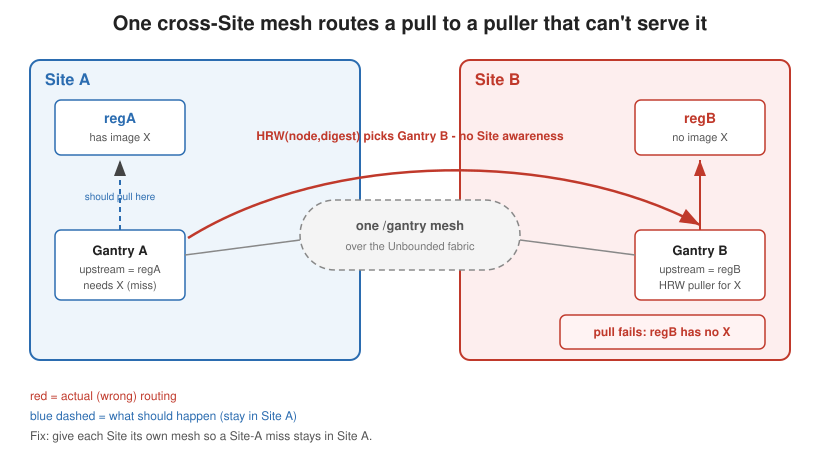

# Per-Site registries and Gantry

## Purpose

This document explains a problem the Gantry developer needs to help solve, and a
related design question about how users should name images. It exists so the
Gantry work can proceed in parallel while the operator team builds the mechanical
part (splitting workloads per Site) in a separate PR.

You do not need operator internals to read this. Where Gantry code matters, file
pointers are at the end.

## Background: what we're building

We're adding a feature to Unbounded: each **Site** can point at its own container
image **registry**. Some Sites sit on networks that can't reach the normal
registry (for example `ghcr.io`), so they need to pull images from a **local
registry** inside the Site's network.

Picture two Sites:

- **Site A** has its own registry, `regA`.
- **Site B** has its own registry, `regB`.

These registries are separate. Site A generally cannot reach `regB`, and Site B
cannot reach `regA`. But the two Sites *are* connected to each other through the
Unbounded network fabric (pods in Site A can talk to pods in Site B). That fabric
connection is the detail that causes the mesh problem below.

On the operator side (what **we** build in the PR), we split the Gantry DaemonSet
so each Site runs its own Gantry pods, with:

- the Gantry **image** pulled from that Site's registry, and
- a per-Site Gantry **config** whose `upstream_registries` points at that Site's
  registry.

That part is mechanical and we have it. The two things we need Gantry's help with
are: (1) keeping each Site's mesh separate, and (2) agreeing on how users name
images so per-Site redirection works.

---

## Part 1: The cross-Site mesh problem

### How Gantry groups peers today (short version)

1. **Membership pool.** Each Gantry agent watches Kubernetes for pods matching a
   label selector, by default `app.kubernetes.io/name=gantry`, in its namespace.
   Every matching pod is a "member."
2. **DHT.** All agents join one libp2p Kademlia **DHT** (a distributed index of
   "who has which blob"), keyed by content **digest** (a hash of the image data).
   The DHT's protocol name is hardcoded to `/gantry`.
3. **Origin puller selection.** On a cache miss (no peer has the blob), Gantry
   picks **one** member to pull it from a real registry using **HRW hashing**
   (rendezvous hashing). HRW takes `(node_id, digest)` and picks the highest-
   scoring member. It does **not** look at Site or which registry the member can
   reach.
4. **What a puller pulls from.** The chosen member pulls from **its own**
   `upstream_registries` config.

Important nuance: image content is **content-addressed**. A blob with digest `D`
is the same bytes no matter which registry it came from. So peers sharing blobs
across Sites is fine *content-wise*. The problem is only the **origin pull** step
(going to a real registry on a cache miss).

### The problem

Because Site A and Site B are connected by the fabric, and their Gantry pods
share the same `app.kubernetes.io/name=gantry` label and the same `/gantry` DHT,
**all** Gantry pods from both Sites end up in **one** mesh. Nothing today makes
the mesh Site-aware.

Walk through a cache miss:

1. A node in **Site A** needs image `X` (digest `D`). No peer has it yet.
2. Gantry uses HRW over the whole mesh to pick the origin puller for `D`. HRW is
   just a hash, so it might pick a node in **Site B**.
3. That Site B node tries to pull `D` from **its own** registry, `regB`.
4. If `regB` doesn't have `X` (say `X` only exists in `regA`), the pull fails -
   even though a Site A node could have pulled it from `regA` fine.

So the request gets routed to a puller that can't serve it. The reverse happens
too: a Site B request can be assigned to a Site A puller that can only reach
`regA`.

There's a second, smaller issue: normal peer-to-peer serving also crosses Site
boundaries. A Site A node might fetch a blob from a Site B node over the fabric.
Content-wise that's correct, but it couples Sites that are supposed to be
isolated and sends fabric traffic that maybe shouldn't be there.

**Bottom line:** once each Site has its own registry, one big cross-Site mesh is
wrong. Each Site's Gantry pods should form their **own** mesh and only ever pull
from their **own** Site's registry.

### What a fix probably needs (for you to design)

Three "levers." Two are configuration the operator sets; one likely needs a code
change in Gantry.

1. **Membership selector per Site (config only, operator handles this).** Our
   per-Site Gantry pods already carry a label `unbounded-cloud.io/site=<site>`.
   We set `GANTRY_MEMBERS_LABEL_SELECTOR` per Site so each agent only counts
   same-Site pods as members. For example Site A uses
   `app.kubernetes.io/name=gantry,unbounded-cloud.io/site=siteA`. Un-Sited nodes
   (like control-plane nodes) use `app.kubernetes.io/name=gantry,!unbounded-cloud.io/site`.
   We confirmed `labels.Parse` accepts these selectors.
2. **DHT isolation per Site (likely a Gantry code change).** The DHT protocol
   prefix is hardcoded to `/gantry` in `discovery.FromConfig`. The
   `Options.ProtocolPrefix` field already exists, so it looks like a small change
   to make it configurable (config field + env var) and let us set it per Site,
   e.g. `/gantry/siteA` vs `/gantry/siteB`. Our open question: **is scoping the
   membership selector alone enough to keep the DHTs separate in practice** (since
   bootstrap would only connect same-Site peers), **or do we also need the
   per-Site protocol prefix** to be safe? We worry that once any cross-Site
   connection forms, the DHTs could merge and stay merged.
3. **Per-Site registry config (operator handles this).** Each Site's Gantry gets
   its own `upstream_registries` pointing at that Site's registry.

Base Gantry (control-plane / un-Sited nodes) forms its own pool on `/gantry` and
pulls from the operator-wide registry.

---

## Part 2: How should users name images?

Once Sites have different registries, there's a naming question: how does a user
reference an image so it pulls from the local registry **regardless of which Site
the pod lands in**? You can't put the Site's host in the name - `regA/foo:v1`
breaks the moment the pod runs in Site B.

The answer: **don't put a Site's registry host in the image name.** Use a stable,
site-independent name and let the node redirect the pull. There are two cases.

### Case 1: Operator bootstrap images (net-node, Gantry's own pod)

These are written by the operator, which makes a **separate** workload per Site.
So the operator can bake the site-local host into the reference directly:
Site A's DaemonSet says `regA/gantry:tag`, Site B's says `regB/gantry:tag`.
Putting the Site host in the name is fine here because there's a different object
per Site and the operator knows which Site it's generating for. This is also the
only way to bootstrap Gantry itself (Gantry can't serve its own image, and
net-node is the network Gantry needs).

### Case 2: User workloads (and anything that runs once Gantry is up)

A single Deployment can land pods on nodes in different Sites, so it must use a
**canonical, site-independent name**, and the node redirects the pull to the
Site's local registry. The pieces already exist in Gantry:

1. The Unbounded agent points containerd's **default** registry mirror at the
   local Gantry agent (`127.0.0.1:5000`). Every image pull on the node goes to
   Gantry first, no matter the image name.
2. The pod uses a canonical name, e.g. `image: ghcr.io/org/foo:v1` (or a stable
   synthetic name - see the open question). The Site host is **not** in it.
3. containerd asks Gantry for that blob and passes the registry namespace
   (`?ns=ghcr.io`).
4. Gantry looks up that namespace in **its per-Site `upstream_registries`
   config**, which maps `ghcr.io` to the **site-local** endpoint (`regA` in
   Site A, `regB` in Site B), and pulls from there (or from a same-Site peer).

So the same pod spec - `ghcr.io/org/foo:v1` - works in every Site. Site A's node
quietly pulls from `regA`; Site B's node quietly pulls from `regB`. The pod never
names a Site.

**Rule for users:** never put a Site's registry host in a workload image name. If
you write `regA/foo:v1`, you've hardcoded the Site and lost portability. Use the
canonical name and let the node redirect.

Note the dependency: on an isolated Site, Gantry **must** be up for user-workload
pulls to work, because the default mirror falls through to the real registry
(unreachable) when Gantry is down. That's why Gantry's own image uses the direct
per-Site override (Case 1) to bootstrap.

### Open design question: what canonical name, and how does the local registry serve it?

For step 4 to work, each Site's local registry must be able to serve content
under whatever canonical name the pod uses. A few ways to arrange this - picking
one is a deployment + Gantry-config decision:

- **Pull-through cache:** each site registry is a caching mirror of the real
  upstream (e.g., `regA` mirrors `ghcr.io`). Pods use real names (`ghcr.io/...`);
  Gantry points the `ghcr.io` namespace at `regA`; transparent. Cleanest if the
  registries support it.
- **Namespace alias:** the site registry hosts images under its own path, and
  Gantry's `NSAlias` maps the canonical namespace onto that path. More config,
  but works when the local registry isn't a pull-through cache.
- **Synthetic canonical host:** pods use a stable fake host like
  `images.internal/...` that never resolves to anything real; each Site's Gantry
  maps `images.internal` to its local registry. Pods get one stable name; each
  Site maps it locally.

All three keep the Site host out of the pod spec; they differ in how the local
registry is populated and how Gantry's per-Site config maps names.

**Decision needed:** what canonical naming convention do we standardize on, and
which mapping mode(s) do we support/recommend?

---

## Questions for the Gantry developer

1. Is per-Site **membership selector** scoping enough on its own, or do we also
   need the per-Site **DHT protocol prefix**? What's the safest minimum?
2. Are there other places where Sites could accidentally merge that we're
   missing - static bootstrap peers, mDNS/other discovery, speculative
   **prefetch**, or shared negative-cache/coordination state?
3. There's an existing `hrw_topology_scope=zone` knob keyed on
   `topology.kubernetes.io/zone`. From our reading it only narrows the HRW
   candidate set and does **not** scope the DHT. Is that right? Could we reuse a
   "zone/cluster id" concept instead of a per-Site prefix, or is a new per-Site
   identifier cleaner?
4. How should a node that **changes Site** be handled (leave one mesh, join the
   other)? Anything Gantry needs to do on that transition?
5. For image naming (Part 2): which canonical-name mapping mode(s) should we
   support, and is `upstream_registries` / `NSAlias` the right place to configure
   it per Site?

## What the operator PR does vs. what Gantry needs

**In the operator PR (us):**

- Split net-node and Gantry into a "base" DaemonSet for un-Sited nodes plus a
  per-Site DaemonSet per Site.
- Per-Site Gantry pods carry `unbounded-cloud.io/site=<site>`, pull their image
  from the Site's registry, and mount a per-Site config with that Site's
  `upstream_registries`.
- Set `GANTRY_MEMBERS_LABEL_SELECTOR` per Site (and the un-Sited variant for the
  base).
- Document the user image-naming rule (Part 2).

**Needs Gantry work (you):**

- Make the DHT protocol prefix configurable so per-Site meshes can't merge (if
  you agree that's needed).
- Sanity-check the other cross-Site coupling points in
  membership/discovery/HRW/prefetch and tell us the minimum set of changes for
  true per-Site isolation.
- Confirm the per-Site image-naming/redirect model (`upstream_registries` /
  `NSAlias`) and which canonical-naming mode(s) to support.

## Where to look in the code

- Membership pool + selector: `internal/gantry/members/members.go` (selector at
  ~line 121-153); config field `MembersLabelSelector` and env
  `GANTRY_MEMBERS_LABEL_SELECTOR` in `internal/gantry/config/config.go`
  (~159-162, ~455, ~581).
- DHT + hardcoded prefix: `internal/gantry/discovery/discovery.go`
  (`Options.ProtocolPrefix` ~81-84; hardcoded `/gantry` at line 131; applied
  ~194-195).
- HRW origin-puller selection: `internal/gantry/hrw` (`hrw.go` scoring) and
  `internal/gantry/coldstart` (`coldstart.go`, `prefetch.go`).
- What a puller pulls from / namespace resolution: `internal/gantry/mirror/mirror.go`
  and `ResolveUpstream` in `internal/gantry/config/config.go`.
- DaemonSet env wiring for reference: `deploy/gantry/daemonset.yaml.tmpl`.
